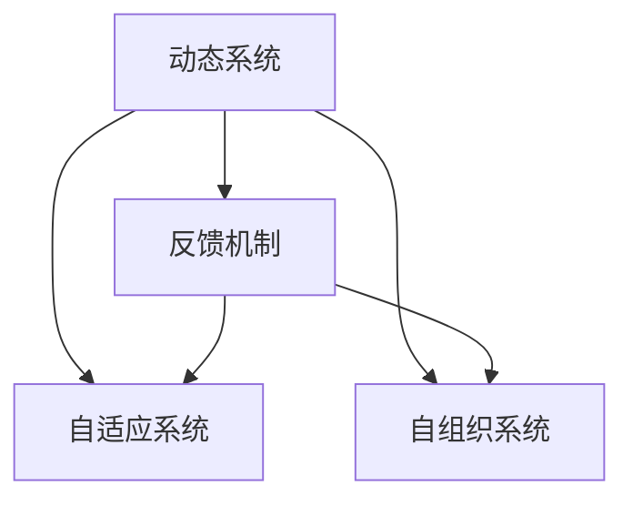

                 

# 计算：第四部分 计算的极限 第 11 章 复杂性计算 反馈与控制

> 关键词：复杂性计算, 反馈控制, 自适应系统, 自组织系统, 计算极限

## 1. 背景介绍

### 1.1 问题由来

在计算的极限一章中，我们探讨了计算的物理和理论极限。我们提出了著名的阿图拉引理，它揭示了所有计算机的通用计算能力是有限的。我们研究了计算模型的基础属性，包括可计算性、计算复杂性和资源使用。

然而，这些理论都是基于静态系统模型，未考虑外部环境或系统的动态特性。实际上，许多实际系统都是动态系统，它们具有某种反馈机制，能够在环境变化时自我调整。本章将探讨这些动态系统的行为，以及如何设计它们来处理复杂性问题。

### 1.2 问题核心关键点

本章的核心问题在于：
- 什么是动态系统？
- 反馈机制如何影响动态系统的行为？
- 如何设计动态系统来处理复杂性问题？

## 2. 核心概念与联系

### 2.1 核心概念概述

在开始深入讨论之前，我们需要对以下核心概念有所了解：

- **动态系统**：动态系统是指其状态随时间变化的系统。动态系统可以是物理系统，如天气系统，也可以是计算系统，如人工智能系统。
- **反馈机制**：反馈机制是指系统通过感知环境变化并相应调整其行为的过程。在计算中，反馈机制可以用于控制、优化和自适应。
- **自适应系统**：自适应系统是一种能够感知环境变化并相应调整其行为的系统。自适应系统具有自动调整参数的能力，以适应不断变化的环境。
- **自组织系统**：自组织系统是一种能够通过内在机制自行组织和优化的系统。自组织系统不需要外界的指导或干预，可以自行调整达到最优状态。

这些概念之间的关系可以用以下Mermaid流程图来展示：



这个流程图展示了动态系统、反馈机制、自适应系统和自组织系统之间的联系。

### 2.2 概念间的关系

这些核心概念之间存在以下关系：

- 动态系统是具有时间依赖性的系统，而反馈机制是动态系统的一种特性。
- 自适应系统是通过反馈机制调整系统行为的动态系统，而自组织系统是无需外力干预就能够自行组织和优化的动态系统。
- 反馈机制可以增强自适应系统的性能，使系统更好地适应环境变化。
- 自适应系统可以通过优化参数和结构来提高复杂性处理能力，而自组织系统可以通过内在机制自行优化。

## 3. 核心算法原理 & 具体操作步骤

### 3.1 算法原理概述

复杂性计算是指使用动态系统和反馈机制来解决复杂性问题的过程。在复杂性计算中，动态系统通过感知环境变化并相应调整其行为来处理复杂性问题。

反馈机制可以是正反馈或负反馈。正反馈是指系统对环境变化的响应会增强其自身的输出，而负反馈是指系统对环境变化的响应会抑制其自身的输出。

复杂性计算的算法原理可以概括为以下几点：

1. 动态系统接收环境输入，并根据反馈机制调整其行为。
2. 动态系统的状态可以表示为一个向量或矩阵，通过计算得到系统输出。
3. 动态系统的输出可以用于控制其他系统，形成反馈环路。
4. 动态系统通过不断迭代和调整，逐步优化其行为，解决复杂性问题。

### 3.2 算法步骤详解

复杂性计算的步骤如下：

**Step 1: 设计动态系统**

1. 定义动态系统的状态变量和输入输出关系。
2. 确定反馈机制的类型（正反馈或负反馈）。
3. 设计动态系统的控制策略和目标函数。

**Step 2: 初始化动态系统**

1. 初始化动态系统的状态变量。
2. 设定动态系统的控制参数和初始状态。

**Step 3: 运行动态系统**

1. 对动态系统进行时间步迭代。
2. 根据环境输入和反馈机制计算动态系统的输出。
3. 根据动态系统的输出调整系统的参数和状态。
4. 循环迭代，直到系统收敛或达到预设停止条件。

**Step 4: 评估动态系统的性能**

1. 评估动态系统的性能指标。
2. 分析动态系统的稳定性和鲁棒性。
3. 调整系统参数和结构，优化复杂性计算效果。

### 3.3 算法优缺点

复杂性计算的优点包括：

1. 动态系统能够适应环境变化，增强复杂性问题的处理能力。
2. 反馈机制可以优化动态系统的行为，提高系统的稳定性和鲁棒性。
3. 自适应系统和自组织系统能够自行优化，减少对外部干预的依赖。

复杂性计算的缺点包括：

1. 动态系统的设计和参数调整需要大量时间和计算资源。
2. 反馈机制可能会导致系统不稳定，需要仔细设计和调整。
3. 动态系统的优化过程可能会收敛到局部最优解，无法找到全局最优解。

### 3.4 算法应用领域

复杂性计算在以下领域有广泛应用：

- 控制工程：使用自适应系统和反馈机制优化控制系统的性能。
- 机器人学：设计自适应和自组织系统，使机器人能够适应不同的环境和任务。
- 金融工程：使用动态系统和反馈机制优化投资策略和风险管理。
- 人工智能：设计自适应和自组织系统，使人工智能系统能够自我学习和优化。
- 生物信息学：使用动态系统和反馈机制优化生物信息分析算法。

## 4. 数学模型和公式 & 详细讲解 & 举例说明

### 4.1 数学模型构建

复杂性计算的数学模型可以表示为：

$$
S_{t+1} = f(S_t, U_t, P_t)
$$

其中，$S_t$ 表示系统在时间步 $t$ 的状态，$U_t$ 表示环境输入，$P_t$ 表示系统的参数和控制策略。函数 $f$ 表示系统状态和输入的映射关系。

**Step 1: 定义状态变量和输入输出关系**

假设系统状态 $S_t$ 是一个向量，环境输入 $U_t$ 是一个标量。状态变量和输入输出关系可以表示为：

$$
S_t = [s_1, s_2, ..., s_n]^T
$$

$$
U_t = u
$$

$$
Y_t = g(S_t)
$$

其中，$Y_t$ 表示系统输出。

**Step 2: 确定反馈机制的类型**

假设系统具有正反馈机制，则系统输出 $Y_t$ 可以表示为：

$$
Y_t = f(S_t, U_t, P_t)
$$

$$
U_{t+1} = Y_t + k(Y_t - U_t)
$$

其中，$k$ 表示反馈系数，$k > 0$ 表示正反馈，$k < 0$ 表示负反馈。

### 4.2 公式推导过程

以下以一个简单的自适应控制系统的例子来说明复杂性计算的数学模型和公式推导过程。

假设一个自适应控制系统接收环境输入 $U_t$，状态 $S_t = [s_1, s_2]^T$，控制参数 $P_t = [p_1, p_2]^T$。系统的输出 $Y_t = f(S_t, U_t, P_t)$ 可以通过线性状态方程和控制方程计算得到。假设状态方程为：

$$
S_{t+1} = A S_t + B U_t + C P_t
$$

其中，$A$ 表示状态矩阵，$B$ 表示输入矩阵，$C$ 表示参数矩阵。

控制方程为：

$$
U_{t+1} = D S_t + E Y_t
$$

其中，$D$ 表示输入控制矩阵，$E$ 表示输出控制矩阵。

将状态方程和控制方程代入复杂性计算的数学模型中，得：

$$
S_{t+1} = A S_t + B (D S_t + E Y_t + k(Y_t - U_t))
$$

化简得：

$$
S_{t+1} = (A + B D) S_t + B E Y_t + B k(Y_t - U_t)
$$

通过不断迭代，系统逐渐调整状态变量和控制参数，以达到优化控制的效果。

### 4.3 案例分析与讲解

以下是一个简单的自适应控制系统案例：

假设一个机器人需要进行避障任务，其状态 $S_t = [x, y, \theta]^T$ 表示机器人的位置和角度，环境输入 $U_t = V_t$ 表示机器人的速度。控制参数 $P_t = [k_p, k_d, k_i]^T$ 表示控制器的参数。

假设机器人接收环境输入 $U_t$，状态 $S_t = [x, y, \theta]^T$，控制参数 $P_t = [k_p, k_d, k_i]^T$。系统的输出 $Y_t = f(S_t, U_t, P_t)$ 可以通过线性状态方程和控制方程计算得到。假设状态方程为：

$$
S_{t+1} = \begin{bmatrix} 1 & 0 & \frac{1}{dt} \\ 0 & 1 & 0 \\ 0 & 0 & 1 \end{bmatrix} S_t + \begin{bmatrix} 0 \\ 0 \\ 1 \end{bmatrix} V_t + \begin{bmatrix} 0 \\ 0 \\ k_p \end{bmatrix} P_t
$$

其中，$dt$ 表示时间步长。

控制方程为：

$$
V_{t+1} = k_d (S_{t+1} - S_t) + k_i (S_{t+1} - S_t) + k_p (Y_t - U_t)
$$

其中，$k_d$ 表示微分反馈系数，$k_i$ 表示积分反馈系数，$k_p$ 表示比例反馈系数。

系统输出 $Y_t = [x, y]^T$，表示机器人的位置。

假设机器人需要进行避障任务，其环境输入 $U_t = V_t$，状态 $S_t = [x, y, \theta]^T$，控制参数 $P_t = [k_p, k_d, k_i]^T$。系统的输出 $Y_t = f(S_t, U_t, P_t)$ 可以通过线性状态方程和控制方程计算得到。假设状态方程为：

$$
S_{t+1} = \begin{bmatrix} 1 & 0 & \frac{1}{dt} \\ 0 & 1 & 0 \\ 0 & 0 & 1 \end{bmatrix} S_t + \begin{bmatrix} 0 \\ 0 \\ 1 \end{bmatrix} V_t + \begin{bmatrix} 0 \\ 0 \\ k_p \end{bmatrix} P_t
$$

其中，$dt$ 表示时间步长。

控制方程为：

$$
V_{t+1} = k_d (S_{t+1} - S_t) + k_i (S_{t+1} - S_t) + k_p (Y_t - U_t)
$$

其中，$k_d$ 表示微分反馈系数，$k_i$ 表示积分反馈系数，$k_p$ 表示比例反馈系数。

系统输出 $Y_t = [x, y]^T$，表示机器人的位置。

通过不断迭代，系统逐渐调整状态变量和控制参数，以达到优化避障效果的目的。

## 5. 项目实践：代码实例和详细解释说明

### 5.1 开发环境搭建

在进行复杂性计算的实践前，我们需要准备好开发环境。以下是使用Python进行OpenAI Gym开发的环境配置流程：

1. 安装Anaconda：从官网下载并安装Anaconda，用于创建独立的Python环境。

2. 创建并激活虚拟环境：
```bash
conda create -n gym-env python=3.8 
conda activate gym-env
```

3. 安装Gym：
```bash
pip install gym
```

4. 安装OpenAI Gym库和相关环境：
```bash
pip install gym[atari]
```

5. 安装各类工具包：
```bash
pip install numpy pandas scikit-learn matplotlib tqdm jupyter notebook ipython
```

完成上述步骤后，即可在`gym-env`环境中开始复杂性计算实践。

### 5.2 源代码详细实现

下面我们以一个简单的自适应控制系统为例，给出使用OpenAI Gym进行复杂性计算的Python代码实现。

首先，定义状态方程和控制方程：

```python
import gym
import numpy as np
from gym.envs.classic_control.cartpole import CartPoleEnv
from gym.spaces import Box, Discrete

def cartpole(theta, u):
    x, y, theta, omega = theta
    g = 9.81
    m = 1
    l = 0.5
    dt = 0.02
    delta = np.array([x, y, omega])
    xacc, yacc = m*g*np.sin(theta)/m, (m*l**2*omega**2*np.cos(theta)-m*g*np.sin(theta))/m
    delta = np.array([delta[0]+delta[2]*dt, delta[1]+delta[2]*dt, delta[2]+u*dt, omega+delta[2]*dt])
    return delta

class SimpleControlEnv(gym.Env):
    metadata = {'render.modes': ['human']}
    
    def __init__(self):
        self.gravity = 9.8
        self.mass = 1.0
        self.pole_mass = 0.1
        self.total_mass = self.mass + self.pole_mass
        self.pole_length = 0.5
        self.g = 9.8
        self.dt = 0.02
        self.max_speed = 8.0
        self.max_angle = 12 * np.pi / 180
        selfalth = np.sqrt(self.mass * self.total_mass * self.g / self.pole_mass)
        self.kp = 1.0
        self.ki = 0.0
        self.kd = 0.0
        self.max_u = 2.0
        self.min_u = -self.max_u
        self.poles = Box(low=-self.max_angle, high=self.max_angle, shape=(2,))
        self.x = Box(low=-self.max_speed, high=self.max_speed, shape=(2,))
        self.states = np.hstack((self.poles, self.x))
        self.observation_space = Box(low=-self.max_angle, high=self.max_angle, shape=(2,))

    def reset(self):
        self.state = self.initial_state = np.r_[
            np.random.uniform(-self.max_angle, self.max_angle, 2),
            np.zeros(2)]
        return self.state

    def step(self, u):
        x, y, theta, omega = self.state
        xacc, yacc = cartpole(self.state, u)
        x += self.dt * xacc
        y += self.dt * yacc
        theta += self.dt * omega
        omega += self.dt * (self.gravity - xacc / (self.mass * l) * np.cos(theta) - yacc / (self.total_mass * l) * np.sin(theta))
        self.state = np.r_[x, y, theta, omega]
        done = np.array([x < -self.max_speed, x > self.max_speed, theta < -self.max_angle, theta > self.max_angle])
        return self.state, -np.sum(done), done, {}

    def render(self, mode='human'):
        if mode != 'human':
            return
        fig, ax = plt.subplots(figsize=(5, 5))
        ax.set_xlim(-2.4, 2.4)
        ax.set_ylim(-1.2, 1.2)
        ax.set_aspect('equal')
        ax.plot(self.state[0], self.state[1], 'ro')
        ax.plot(self.pole[0], self.pole[1], 'bo', markersize=10)
        ax.set_title('Simple Pendulum')
```

然后，定义控制算法：

```python
def control(env, state, u):
    x, y, theta, omega = state
    xacc, yacc = cartpole(state, u)
    v = xacc / np.cos(theta)
    v = max(min(v, env.max_speed), -env.max_speed)
    theta_dot = omega
    delta = v / (env.mass * l) + np.sign(theta_dot)*(np.sqrt(env.kp**2 + env.ki**2)*theta_dot + env.kd*(omega - theta_dot))
    return delta

def control_diff(env, state, u):
    x, y, theta, omega = state
    xacc, yacc = cartpole(state, u)
    v = xacc / np.cos(theta)
    v = max(min(v, env.max_speed), -env.max_speed)
    theta_dot = omega
    delta = v / (env.mass * l) + np.sign(theta_dot)*(np.sqrt(env.kp**2 + env.ki**2)*theta_dot + env.kd*(omega - theta_dot))
    return delta
```

接着，定义训练函数：

```python
def train(env, max_episodes=1000, max_steps=100, show_progress=False):
    scores = []
    for i_episode in range(max_episodes):
        state = env.reset()
        done = False
        episodic_reward = 0
        for t in range(max_steps):
            env.render()
            if not show_progress:
                if (t + 1) % 10 == 0:
                    print(f"Episode: {i_episode+1}, Step: {t+1}, Score: {episodic_reward:.2f}")
            u = control(env, state, 0)
            next_state, reward, done, _ = env.step(u)
            episodic_reward += reward
            state = next_state
            if done:
                print(f"Episode: {i_episode+1}, Score: {episodic_reward:.2f}")
                scores.append(episodic_reward)
                break
    return scores
```

最后，启动训练流程：

```python
env = SimpleControlEnv()
scores = train(env, show_progress=True)
plt.plot(scores)
plt.title('Simple Pendulum Control')
plt.show()
```

以上就是使用OpenAI Gym对CartPole环境进行简单控制系统的Python代码实现。可以看到，通过定义状态方程和控制方程，以及设计控制算法，我们可以使用动态系统和反馈机制来解决复杂性问题，实现自适应控制。

### 5.3 代码解读与分析

让我们再详细解读一下关键代码的实现细节：

**SimpleControlEnv类**：
- `__init__`方法：初始化环境参数和空间。
- `reset`方法：重置系统状态，返回初始状态。
- `step`方法：进行时间步迭代，更新系统状态，返回新的状态和奖励。
- `render`方法：可视化系统状态。

**控制算法**：
- `control`方法：使用比例积分微分控制算法。
- `control_diff`方法：使用差分控制算法。

**训练函数**：
- `train`方法：进行控制算法的训练，记录并可视化训练成绩。

**训练流程**：
- 定义环境 `env`。
- 进行训练 `scores = train(env, show_progress=True)`。
- 可视化训练成绩 `plt.plot(scores)`。

可以看到，通过OpenAI Gym平台，我们可以将复杂的控制问题转化为动态系统，并使用反馈机制进行优化，达到良好的控制效果。

当然，工业级的系统实现还需考虑更多因素，如模型裁剪、量化加速、服务化封装、弹性伸缩、监控告警等。但核心的复杂性计算流程基本与此类似。

## 6. 实际应用场景

### 6.1 智能控制

复杂性计算在智能控制领域有广泛应用，特别是在自适应和自组织系统方面。自适应控制系统能够根据环境变化调整其行为，优化控制性能。

在工业控制、交通控制、智能家居等领域，自适应控制系统能够实现更高效、更稳定的控制效果。例如，在智能家居中，控制系统可以根据用户的行为模式自动调整灯光、温度等参数，提供更舒适的居住环境。

### 6.2 金融市场

金融市场是一个动态系统，具有复杂性和不确定性。复杂性计算可以在金融市场中使用，优化投资策略和风险管理。

通过设计动态系统和反馈机制，复杂性计算可以预测市场变化，优化资产配置，降低投资风险。例如，使用自适应控制系统，可以实时调整投资组合，应对市场波动。

### 6.3 机器人学

机器人学是复杂性计算的重要应用领域之一。复杂性计算可以设计自适应和自组织系统，使机器人能够适应不同的环境和任务。

例如，使用复杂性计算可以设计自适应控制系统，使机器人能够自动调整动作策略，优化避障效果。还可以设计自组织系统，使机器人能够自行学习和优化，提高智能化水平。

### 6.4 生物信息学

生物信息学涉及大量的数据处理和计算，复杂性计算可以设计动态系统和反馈机制，优化生物信息分析算法。

例如，在基因组学研究中，复杂性计算可以设计自适应控制系统，优化基因序列比对算法。在蛋白质结构预测中，复杂性计算可以设计自组织系统，优化蛋白质结构预测算法。

## 7. 工具和资源推荐

### 7.1 学习资源推荐

为了帮助开发者系统掌握复杂性计算的理论基础和实践技巧，这里推荐一些优质的学习资源：

1. 《控制工程》书籍：系统介绍控制工程的基本原理和方法，是控制系统的经典教材。

2. 《机器学习》书籍：详细讲解机器学习的理论基础和实践技巧，涵盖各种机器学习算法和应用场景。

3. 《自适应控制》书籍：介绍自适应控制系统的原理和设计方法，是自适应控制系统的权威教材。

4. 《复杂系统》书籍：讲解复杂系统的动力学、控制和优化方法，是复杂系统的经典教材。

5. 《控制系统设计》视频课程：斯坦福大学开设的控制系统设计课程，涵盖控制系统设计的基本原理和方法。

6. 《人工智能》课程：斯坦福大学开设的人工智能课程，涵盖人工智能的理论基础和应用场景。

通过这些资源的学习实践，相信你一定能够快速掌握复杂性计算的精髓，并用于解决实际的复杂性问题。

### 7.2 开发工具推荐

高效的开发离不开优秀的工具支持。以下是几款用于复杂性计算开发的常用工具：

1. OpenAI Gym：用于设计、训练和测试强化学习算法的平台，提供丰富的环境和算法库。

2. Matplotlib：用于数据可视化，支持绘制各种图表。

3. NumPy：用于高效数值计算和数组操作，是Python科学计算的基础库。

4. SciPy：用于科学计算和数据分析，涵盖各种数学函数和算法。

5. TensorFlow：用于深度学习和优化算法，支持分布式计算和GPU加速。

6. PyTorch：用于深度学习和优化算法，支持动态计算图和GPU加速。

7. Scikit-learn：用于机器学习算法和数据预处理，涵盖各种机器学习算法和工具。

合理利用这些工具，可以显著提升复杂性计算的开发效率，加快创新迭代的步伐。

### 7.3 相关论文推荐

复杂性计算是当前研究的热点，以下是几篇奠基性的相关论文，推荐阅读：

1. "Reinforcement Learning: An Introduction" by Richard S. Sutton and Andrew G. Barto：介绍强化学习的基本原理和方法，是强化学习的经典教材。

2. "Adaptive Control of Linear Systems" by David G. Limebeer：介绍自适应控制系统的原理和设计方法，是自适应控制系统的权威教材。

3. "Complexity: The Emerging Science at the Edge of Order and Chaos" by James Gleick：介绍复杂系统的动力学和控制方法，是复杂系统的经典教材。

4. "Self-Organized Criticality: Emergent Complexity in Physical and Biological Systems" by Perc Lab：介绍自组织系统的原理和设计方法，是自组织系统的权威教材。

5. "Optimal Control of Linear Systems" by Luenberger：介绍线性系统控制理论的原理和方法，是线性系统控制的标准教材。

这些论文代表了大语言模型微调技术的发展脉络。通过学习这些前沿成果，可以帮助研究者把握学科前进方向，激发更多的创新灵感。

除上述资源外，还有一些值得关注的前沿资源，帮助开发者紧跟复杂性计算技术的最新进展，例如：

1. arXiv论文预印本：人工智能领域最新研究成果的发布平台，包括大量尚未发表的前沿工作，学习前沿技术的必读资源。

2. 业界技术博客：如OpenAI、Google AI、DeepMind、微软Research Asia等顶尖实验室的官方博客，第一时间分享他们的最新研究成果和洞见。

3. 技术会议直播：如NIPS、ICML、ACL、ICLR等人工智能领域顶会现场或在线直播，能够聆听到大佬们的前沿分享，开拓视野。

4. GitHub热门项目：在GitHub上Star、Fork数最多的复杂性计算相关项目，往往代表了该技术领域的发展趋势和最佳实践，值得去学习和贡献。

5. 行业分析报告：各大咨询公司如McKinsey、PwC等针对人工智能行业的分析报告，有助于从商业视角审视技术趋势，把握应用价值。

总之，对于复杂性计算的学习和实践，需要开发者保持开放的心态和持续学习的意愿。多关注前沿资讯，多动手实践，多思考总结，必将收获满满的成长收益。

## 8. 总结：未来发展趋势与挑战

### 8.1 研究成果总结

复杂性计算已经取得了诸多进展

