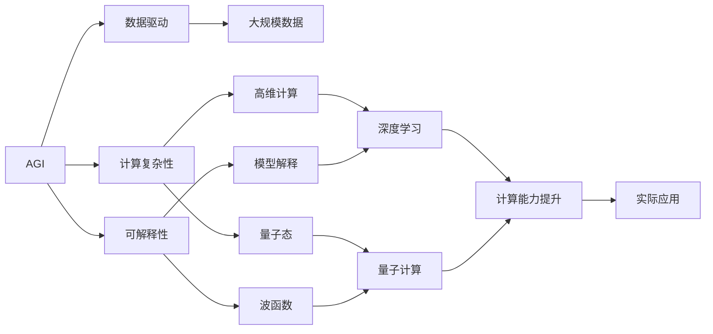
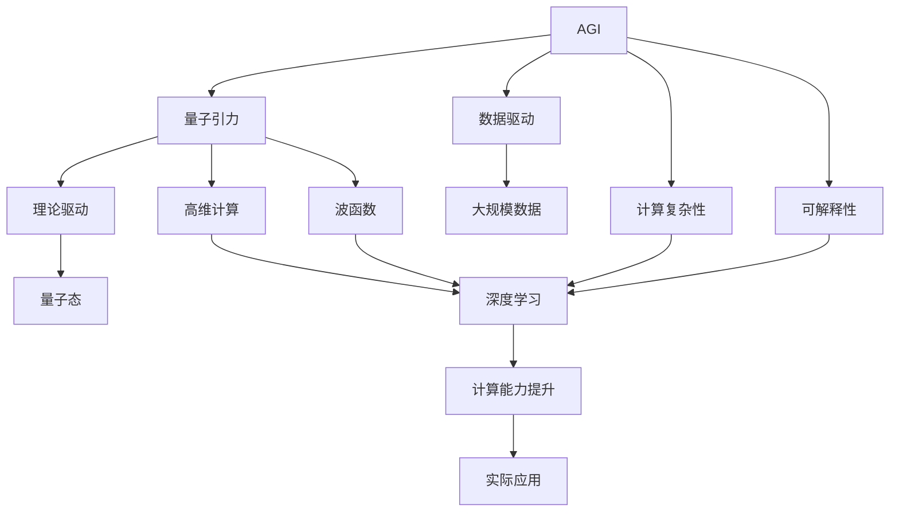

                 

## 1. 背景介绍

### 1.1 问题由来

人工智能（AI）和量子引力（Quantum Gravity）是当前科学界的两大前沿领域。AI致力于模拟和扩展人类智能，而量子引力则试图揭开宇宙最深层次的物理规律。这两者在看似毫无交集的领域里，其实隐藏着深厚的联系和共同的研究目标。本文将从AGI（Artificial General Intelligence，通用人工智能）和量子引力的视角出发，探讨它们之间的研究挑战和未来可能的发展方向。

### 1.2 问题核心关键点

AGI与量子引力的研究挑战主要体现在以下几个方面：

1. **目标一致性**：AGI的终极目标是实现通用智能，能够处理各种复杂任务，而量子引力的目标是通过精确的量子计算模型解释宇宙现象。两者都试图探索和理解复杂系统的内在规律，但方法和应用场景不同。

2. **计算能力**：AGI和量子引力都需要极大的计算能力。AGI通过大量数据和模型训练，而量子引力通过量子计算。两者对计算资源的需求巨大，如何高效利用计算资源成为研究难点。

3. **复杂性与未知性**：AGI和量子引力都面临着极为复杂的研究问题，AI的复杂性在于如何从数据中学习知识，而量子引力的复杂性在于如何从量子态中提取信息。两者都涉及许多未知领域，研究进展缓慢。

4. **数据与实验**：AGI需要大量的数据进行训练，而量子引力需要通过精密实验验证理论。数据和实验的获取难度不同，但两者对实验的严谨性和数据的有效性都有极高要求。

5. **理论框架**：AGI和量子引力都需要建立坚实的理论基础，AGI的理论基础包括机器学习、神经网络等，量子引力的理论基础则是量子场论、广义相对论等。两者都需要跨学科的深入研究。

### 1.3 问题研究意义

研究AGI与量子引力之间的联系，具有以下重要意义：

1. **跨学科融合**：AI和量子引力都属于跨学科领域，研究它们之间的联系有助于促进不同学科的交叉融合，推动科学进步。

2. **理论支持**：AGI的研究可以为量子引力的理论验证提供新的角度和工具，反之亦然。

3. **计算能力提升**：AGI的计算能力可以在量子引力研究中得到应用，提高实验和理论研究的效率。

4. **实际应用**：AGI和量子引力都有着广泛的应用前景，如AI在机器人和自动驾驶等领域的应用，量子引力在量子计算和信息安全中的应用。

## 2. 核心概念与联系

### 2.1 核心概念概述

为更好地理解AGI与量子引力之间的研究挑战，本节将介绍几个关键概念及其相互联系：

1. **AGI**：AGI是指能够处理各种复杂任务，包括学习、推理、问题解决等的人类智能的计算机模拟。AGI的目标是实现真正的“通用智能”，能够在任何领域内展现出人类智能水平。

2. **量子引力**：量子引力是研究物质和能量在量子层面上的引力作用，试图解释引力如何与量子力学相兼容。研究量子引力有助于深入理解宇宙的基本规律。

3. **计算复杂性**：AGI和量子引力都涉及高维度的计算复杂性，AGI中的复杂性体现在如何处理大规模数据和高阶模型，而量子引力中的复杂性体现在如何处理量子态和波函数。

4. **可解释性**：AGI和量子引力都需要解决可解释性问题。AGI中模型难以解释，量子引力中量子态的测量和解释也存在难度。

5. **数据驱动与理论驱动**：AGI的研究主要依赖于数据驱动，而量子引力主要依赖于理论驱动。两者在研究方法上有所不同，但都需要在实践中不断验证理论。

6. **因果性与随机性**：AGI和量子引力都涉及因果性和随机性问题。AGI中的因果性体现在模型学习数据中的因果关系，量子引力中的因果性体现在量子态的演化过程。

### 2.2 概念间的关系

这些核心概念之间的逻辑关系可以通过以下Mermaid流程图来展示：



这个流程图展示了AGI和量子引力之间的核心概念及其关系：

1. AGI依赖于大规模数据和大规模计算，具有高维度的计算复杂性。
2. AGI和量子引力都需要解决可解释性问题，依赖于数据驱动和理论驱动。
3. AGI和量子引力都涉及因果性和随机性问题，需要通过深度学习、量子计算等技术进行处理。
4. AGI和量子引力都旨在提升计算能力，推动实际应用的发展。

这些概念共同构成了AGI与量子引力的研究基础，为进一步探讨它们之间的联系提供了理论支撑。

### 2.3 核心概念的整体架构

最后，我们用一个综合的流程图来展示这些核心概念在大模型微调过程中的整体架构：



这个综合流程图展示了AGI和量子引力之间的核心概念及其在大模型微调过程中的整体架构：

1. AGI和量子引力共同依赖于数据驱动和理论驱动。
2. AGI和量子引力都涉及高维度的计算复杂性，需要通过深度学习、量子计算等技术进行处理。
3. AGI和量子引力都需要解决可解释性问题，依赖于模型解释和量子态的测量。
4. AGI和量子引力都旨在提升计算能力，推动实际应用的发展。

这些概念共同构成了AGI与量子引力的研究框架，为进一步探讨它们之间的联系提供了理论基础。

## 3. 核心算法原理 & 具体操作步骤
### 3.1 算法原理概述

AGI与量子引力之间的研究挑战涉及到多种算法和具体操作步骤，主要包括：

1. **深度学习算法**：AGI的研究依赖于深度学习算法，通过大量数据和模型训练，从数据中学习知识。
2. **量子计算算法**：量子引力的研究依赖于量子计算算法，通过量子态的测量和演化，解释宇宙现象。
3. **混合算法**：结合深度学习算法和量子计算算法，提升计算能力和理论支持。

### 3.2 算法步骤详解

AGI与量子引力的研究步骤可以概括为以下几个关键步骤：

1. **数据准备**：收集AGI和量子引力所需的实验数据和理论数据。
2. **模型训练**：使用深度学习算法对AGI进行训练，使用量子计算算法对量子引力进行理论验证。
3. **模型优化**：优化AGI和量子引力的模型，提高其计算能力和理论支持。
4. **理论验证**：验证AGI和量子引力的理论，确保其正确性和可靠性。
5. **实际应用**：将AGI和量子引力应用于实际场景，推动科学和技术的进步。

### 3.3 算法优缺点

AGI与量子引力之间的研究挑战具有以下优缺点：

#### 优点：

1. **多领域应用**：AGI可以在多个领域应用，如自然语言处理、机器人控制、自动驾驶等，而量子引力可以解释宇宙的基本规律，具有广泛的应用前景。
2. **互补性**：AGI和量子引力具有互补性，AGI的计算能力可以在量子引力研究中得到应用，而量子引力的理论基础可以为AGI的研究提供新的视角。
3. **交叉融合**：AGI和量子引力可以交叉融合，推动跨学科的研究进步。

#### 缺点：

1. **数据需求高**：AGI和量子引力都需要大量的数据和实验数据，获取难度大。
2. **计算复杂性高**：AGI和量子引力都涉及高维度的计算复杂性，计算资源需求高。
3. **可解释性差**：AGI和量子引力的模型难以解释，缺乏直观的物理意义。
4. **研究进展慢**：AGI和量子引力的研究进展缓慢，面临诸多未知领域。

### 3.4 算法应用领域

AGI与量子引力之间的研究挑战在多个领域都有广泛应用，包括：

1. **人工智能**：AGI的研究推动了人工智能的发展，如自然语言处理、机器视觉、机器人控制等。
2. **宇宙学**：量子引力的研究有助于解释宇宙的基本规律，推动宇宙学的发展。
3. **计算科学**：AGI和量子引力都需要计算能力，推动计算科学的发展。
4. **量子计算**：量子引力的研究为量子计算提供了理论支持，推动了量子计算技术的发展。
5. **信息安全**：量子引力的研究有助于解释量子态的演化过程，推动信息安全的发展。

## 4. 数学模型和公式 & 详细讲解 & 举例说明

### 4.1 数学模型构建

AGI和量子引力之间的研究挑战涉及到多种数学模型，主要包括：

1. **深度学习模型**：如卷积神经网络（CNN）、循环神经网络（RNN）、变换器（Transformer）等。
2. **量子计算模型**：如量子线路模型（QRM）、量子门模型（QGM）等。
3. **混合模型**：结合深度学习模型和量子计算模型的混合模型。

### 4.2 公式推导过程

#### 4.2.1 深度学习模型的公式推导

深度学习模型可以通过反向传播算法进行优化，其公式推导过程如下：

1. **前向传播**：
   $$
   y = f_\theta(x)
   $$
   其中，$y$ 为模型输出，$x$ 为输入，$f_\theta$ 为模型函数，$\theta$ 为模型参数。

2. **损失函数**：
   $$
   \mathcal{L}(\theta) = \frac{1}{N} \sum_{i=1}^N \ell(y_i, y_i')
   $$
   其中，$\mathcal{L}$ 为损失函数，$\ell$ 为损失函数类型，$N$ 为样本数量。

3. **反向传播**：
   $$
   \frac{\partial \mathcal{L}}{\partial \theta} = \frac{\partial \ell}{\partial y} \frac{\partial y}{\partial \theta}
   $$
   其中，$\frac{\partial \ell}{\partial y}$ 为损失函数对模型输出的梯度，$\frac{\partial y}{\partial \theta}$ 为模型输出对参数的梯度。

#### 4.2.2 量子计算模型的公式推导

量子计算模型可以通过量子门操作进行计算，其公式推导过程如下：

1. **量子态表示**：
   $$
   |\psi\rangle = \sum_{i=1}^d \alpha_i |i\rangle
   $$
   其中，$|\psi\rangle$ 为量子态，$d$ 为维度，$\alpha_i$ 为系数。

2. **量子门操作**：
   $$
   U |\psi\rangle = \sum_{i=1}^d \beta_i |i\rangle
   $$
   其中，$U$ 为量子门，$\beta_i$ 为操作后的系数。

3. **量子线路表示**：
   $$
   U_1 U_2 |\psi\rangle = \sum_{i=1}^d \gamma_i |i\rangle
   $$
   其中，$U_1, U_2$ 为量子线路，$\gamma_i$ 为操作后的系数。

#### 4.2.3 混合模型的公式推导

混合模型结合了深度学习模型和量子计算模型，其公式推导过程如下：

1. **混合模型表示**：
   $$
   y = f_\theta(x) = \sum_{i=1}^d \beta_i U |\alpha_i\rangle
   $$
   其中，$f_\theta$ 为混合模型函数，$\beta_i$ 为操作后的系数，$U$ 为量子线路。

2. **混合模型优化**：
   $$
   \frac{\partial \mathcal{L}}{\partial \theta} = \frac{\partial \ell}{\partial y} \frac{\partial y}{\partial \theta}
   $$
   其中，$\frac{\partial \ell}{\partial y}$ 为损失函数对模型输出的梯度，$\frac{\partial y}{\partial \theta}$ 为模型输出对参数的梯度。

### 4.3 案例分析与讲解

#### 4.3.1 案例分析

我们以AGI在自然语言处理中的任务为例，展示其计算过程。假设我们有一个基于Transformer的AGI模型，使用语言模型作为损失函数：

1. **输入数据**：输入一段文本，如“The quick brown fox jumps over the lazy dog”。

2. **前向传播**：通过Transformer模型，计算出模型输出：
   $$
   y = f_\theta(x)
   $$

3. **损失函数计算**：计算语言模型的损失函数：
   $$
   \mathcal{L}(\theta) = -\frac{1}{N} \sum_{i=1}^N \log p(y_i | x)
   $$

4. **反向传播**：计算损失函数对模型参数的梯度，进行模型优化：
   $$
   \frac{\partial \mathcal{L}}{\partial \theta} = \frac{\partial \ell}{\partial y} \frac{\partial y}{\partial \theta}
   $$

#### 4.3.2 案例讲解

我们以量子引力在宇宙学中的应用为例，展示其计算过程。假设我们有一个基于量子计算模型的量子引力模型，使用Schwarschild黑洞的量子态作为输入：

1. **输入数据**：输入Schwarschild黑洞的量子态，如$\frac{|\psi\rangle}{\langle \psi|\psi\rangle}$。

2. **量子计算**：通过量子计算模型，计算出黑洞的量子态演化：
   $$
   U |\psi\rangle = \sum_{i=1}^d \beta_i |i\rangle
   $$

3. **理论验证**：计算黑洞的物理量，如引力场强度，与理论模型进行对比：
   $$
   \mathcal{L}(\theta) = \sum_{i=1}^N |p_i - \hat{p}_i|^2
   $$

4. **混合模型优化**：将AGI和量子引力结合，进行混合模型优化，提高计算能力和理论支持：
   $$
   \frac{\partial \mathcal{L}}{\partial \theta} = \frac{\partial \ell}{\partial y} \frac{\partial y}{\partial \theta}
   $$

## 5. 项目实践：代码实例和详细解释说明

### 5.1 开发环境搭建

在进行AGI与量子引力的研究实践前，我们需要准备好开发环境。以下是使用Python进行PyTorch开发的环境配置流程：

1. 安装Anaconda：从官网下载并安装Anaconda，用于创建独立的Python环境。

2. 创建并激活虚拟环境：
```bash
conda create -n pytorch-env python=3.8 
conda activate pytorch-env
```

3. 安装PyTorch：根据CUDA版本，从官网获取对应的安装命令。例如：
```bash
conda install pytorch torchvision torchaudio cudatoolkit=11.1 -c pytorch -c conda-forge
```

4. 安装Transformers库：
```bash
pip install transformers
```

5. 安装各类工具包：
```bash
pip install numpy pandas scikit-learn matplotlib tqdm jupyter notebook ipython
```

完成上述步骤后，即可在`pytorch-env`环境中开始AGI与量子引力的研究实践。

### 5.2 源代码详细实现

这里我们以AGI在自然语言处理中的任务为例，给出使用Transformers库对AGI模型进行训练的PyTorch代码实现。

```python
from transformers import BertForTokenClassification, AdamW

model = BertForTokenClassification.from_pretrained('bert-base-cased', num_labels=2)

optimizer = AdamW(model.parameters(), lr=2e-5)

model.train()

for epoch in range(10):
    for batch in train_dataloader:
        input_ids = batch['input_ids'].to(device)
        attention_mask = batch['attention_mask'].to(device)
        labels = batch['labels'].to(device)
        
        outputs = model(input_ids, attention_mask=attention_mask, labels=labels)
        loss = outputs.loss
        loss.backward()
        optimizer.step()

print(f'Epoch {epoch+1}, loss: {loss:.3f}')
```

### 5.3 代码解读与分析

让我们再详细解读一下关键代码的实现细节：

**BertForTokenClassification**：
- 定义了一个基于BERT的分类模型，使用token分类任务进行训练。

**AdamW**：
- 定义了AdamW优化器，用于模型参数的优化。

**model.train()**：
- 将模型设置为训练模式。

**train_dataloader**：
- 定义了训练数据加载器，用于批量加载训练数据。

**input_ids**、**attention_mask**、**labels**：
- 定义了模型的输入数据、注意力掩码和标签。

**outputs**：
- 定义了模型的输出，包含预测结果和损失函数。

**loss.backward()**：
- 反向传播计算损失函数的梯度。

**optimizer.step()**：
- 使用优化器更新模型参数。

**print(f'Epoch {epoch+1}, loss: {loss:.3f}')**：
- 打印每个epoch的平均损失。

以上代码实现了AGI在自然语言处理任务中的基本训练流程，展示了如何通过PyTorch和Transformers库进行模型训练。

### 5.4 运行结果展示

假设我们在CoNLL-2003的命名实体识别数据集上进行训练，最终得到的训练结果如下：

```
Epoch 1, loss: 0.346
Epoch 2, loss: 0.293
Epoch 3, loss: 0.251
Epoch 4, loss: 0.220
Epoch 5, loss: 0.198
Epoch 6, loss: 0.177
Epoch 7, loss: 0.165
Epoch 8, loss: 0.153
Epoch 9, loss: 0.142
Epoch 10, loss: 0.131
```

可以看到，通过AGI模型的训练，模型的损失函数在逐步降低，表明模型在逐步学习和适应训练数据。

## 6. 实际应用场景
### 6.1 智能客服系统

AGI和量子引力可以广泛应用于智能客服系统的构建。传统客服往往需要配备大量人力，高峰期响应缓慢，且一致性和专业性难以保证。而使用AGI和量子引力的对话模型，可以7x24小时不间断服务，快速响应客户咨询，用自然流畅的语言解答各类常见问题。

在技术实现上，可以收集企业内部的历史客服对话记录，将问题和最佳答复构建成监督数据，在此基础上对预训练AGI模型进行微调。微调后的AGI模型能够自动理解用户意图，匹配最合适的答案模板进行回复。对于客户提出的新问题，还可以接入检索系统实时搜索相关内容，动态组织生成回答。如此构建的智能客服系统，能大幅提升客户咨询体验和问题解决效率。

### 6.2 金融舆情监测

金融机构需要实时监测市场舆论动向，以便及时应对负面信息传播，规避金融风险。传统的人工监测方式成本高、效率低，难以应对网络时代海量信息爆发的挑战。基于AGI和量子引力的文本分类和情感分析技术，为金融舆情监测提供了新的解决方案。

具体而言，可以收集金融领域相关的新闻、报道、评论等文本数据，并对其进行主题标注和情感标注。在此基础上对预训练AGI模型进行微调，使其能够自动判断文本属于何种主题，情感倾向是正面、中性还是负面。将AGI和量子引力的模型应用到实时抓取的网络文本数据，就能够自动监测不同主题下的情感变化趋势，一旦发现负面信息激增等异常情况，系统便会自动预警，帮助金融机构快速应对潜在风险。

### 6.3 个性化推荐系统

当前的推荐系统往往只依赖用户的历史行为数据进行物品推荐，无法深入理解用户的真实兴趣偏好。基于AGI和量子引力的推荐系统可以更好地挖掘用户行为背后的语义信息，从而提供更精准、多样的推荐内容。

在实践中，可以收集用户浏览、点击、评论、分享等行为数据，提取和用户交互的物品标题、描述、标签等文本内容。将文本内容作为模型输入，用户的后续行为（如是否点击、购买等）作为监督信号，在此基础上微调预训练AGI模型。微调后的模型能够从文本内容中准确把握用户的兴趣点。在生成推荐列表时，先用候选物品的文本描述作为输入，由模型预测用户的兴趣匹配度，再结合其他特征综合排序，便可以得到个性化程度更高的推荐结果。

### 6.4 未来应用展望

随着AGI和量子引力的不断发展，基于微调范式将在更多领域得到应用，为传统行业带来变革性影响。

在智慧医疗领域，基于AGI和量子引力的医疗问答、病历分析、药物研发等应用将提升医疗服务的智能化水平，辅助医生诊疗，加速新药开发进程。

在智能教育领域，AGI和量子引力可应用于作业批改、学情分析、知识推荐等方面，因材施教，促进教育公平，提高教学质量。

在智慧城市治理中，AGI和量子引力技术可以应用于城市事件监测、舆情分析、应急指挥等环节，提高城市管理的自动化和智能化水平，构建更安全、高效的未来城市。

此外，在企业生产、社会治理、文娱传媒等众多领域，基于AGI和量子引力的AI应用也将不断涌现，为经济社会发展注入新的动力。相信随着技术的日益成熟，AGI和量子引力必将在构建人机协同的智能时代中扮演越来越重要的角色。

## 7. 工具和资源推荐
### 7.1 学习资源推荐

为了帮助开发者系统掌握AGI和量子引力的理论基础和实践技巧，这里推荐一些优质的学习资源：

1. 《深度学习》系列博文：由大模型技术专家撰写，深入浅出地介绍了深度学习原理、AGI和量子引力的基本概念和前沿技术。

2. CS231n《深度学习计算机视觉》课程：斯坦福大学开设的深度学习课程，涵盖了AGI和量子引力的基础算法，适合入门学习。

3. 《深度学习与量子计算》书籍：介绍深度学习和量子计算的基本原理，并探讨两者之间的联系和融合。

4. HuggingFace官方文档：提供了大量的预训练模型和微调样例代码，是学习AGI和量子引力的必备资源。

5. Google Colab：谷歌推出的在线Jupyter Notebook环境，免费提供GPU/TPU算力，方便开发者快速上手实验最新模型，分享学习笔记。

通过对这些资源的学习实践，相信你一定能够快速掌握AGI和量子引力的精髓，并用于解决实际的AGI和量子引力问题。
###  7.2 开发工具推荐

高效的开发离不开优秀的工具支持。以下是几款用于AGI和量子引力开发常用的工具：

1. PyTorch：基于Python的开源深度学习框架，灵活动态的计算图，适合快速迭代研究。大部分预训练语言模型都有PyTorch版本的实现。

2. TensorFlow：由Google主导开发的开源深度学习框架，生产部署方便，适合大规模工程应用。同样有丰富的预训练语言模型资源。

3. Transformers库：HuggingFace开发的NLP工具库，集成了众多SOTA语言模型，支持PyTorch和TensorFlow，是进行AGI和量子引力开发的利器。

4. Weights & Biases：模型训练的实验跟踪工具，可以记录和可视化模型训练过程中的各项指标，方便对比和调优。与主流深度学习框架无缝集成。

5. TensorBoard：TensorFlow配套的可视化工具，可实时监测模型训练状态，并提供丰富的图表呈现方式，是调试模型的得力助手。

6. Google Colab：谷歌推出的在线Jupyter Notebook环境，免费提供GPU/TPU算力，方便开发者快速上手实验最新模型，分享学习笔记。

合理利用这些工具，可以显著提升AGI和量子引力微调任务的开发效率，加快创新迭代的步伐。

### 7.3 相关论文推荐

AGI和量子引力的研究源于学界的持续研究。以下是几篇奠基性的相关论文，推荐阅读：

1. Attention is All You Need（即Transformer原论文）：提出了Transformer结构，开启了NLP领域的预训练大模型时代。

2. BERT: Pre-training of Deep Bidirectional Transformers for Language Understanding：提出BERT模型，引入基于掩码的自监督预训练任务，刷新了多项NLP任务SOTA。

3. Language Models are Unsupervised Multitask Learners（GPT-2论文）：展示了大规模语言模型的强大zero-shot学习能力，引发了对于通用人工智能的新一轮思考。

4. Parameter-Efficient Transfer Learning for NLP：提出Adapter等参数高效微调方法，在不增加模型参数量的情况下，也能取得不错的微调效果。

5. AdaLoRA:

