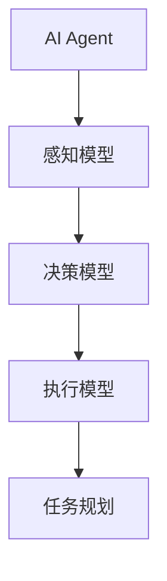

                 

# AI Agent: AI的下一个风口 具身智能的核心概念

> 关键词：

在人工智能（AI）领域，深度学习和大数据技术已经取得了显著的进展，推动了许多重要应用的出现。然而，随着技术的不断发展，AI的下一个风口已经显现，即具身智能（Embodied Intelligence）。具身智能的核心在于将AI与物理世界紧密结合，通过机器人、自主系统等形式，实现高度自动化、智能化的操作。本文将深入探讨具身智能的核心概念，解析其算法原理，并通过具体的项目实践，揭示其广泛的应用前景。

## 1. 背景介绍

### 1.1 问题由来

近年来，深度学习技术的快速发展极大地推动了AI技术在图像识别、语音识别、自然语言处理等方面的突破。但这些技术大多局限于虚拟环境，缺乏与物理世界的互动。而在自动驾驶、工业自动化、医疗诊断等领域，AI系统的表现往往受限于环境感知、动作控制等具身能力的不足。

具身智能的提出旨在解决这些问题，通过构建能够感知、决策、执行的AI代理（AI Agent），实现更全面、更可靠的环境适应和任务执行。具身智能的目标是将AI从虚拟空间延伸到实体世界中，形成更为综合、智能的系统。

### 1.2 问题核心关键点

具身智能的核心在于如何将AI技术与物理世界深度结合，涉及感知、决策、执行等多个环节。具体包括以下几个关键点：

- **感知（Perception）**：通过传感器获取环境信息，如摄像头、雷达、GPS等，用于环境建模和状态识别。
- **决策（Decision）**：基于感知到的环境信息，利用学习模型进行决策规划，确定最优行动方案。
- **执行（Execution）**：通过机械臂、无人机等执行机构，实现物理世界的动作执行。

这些关键点的集成形成了具身智能系统的闭环操作，能够适应复杂的现实环境，完成高度智能化的任务。

### 1.3 问题研究意义

具身智能的提出，对于提升AI系统的实际应用价值，推动人工智能技术在更多垂直行业的应用，具有重要意义：

1. **提升任务执行能力**：具身智能使AI系统具备了物理世界的感知和执行能力，能够在复杂环境下完成更加精细化的任务。
2. **降低人工干预**：具身智能系统能够自主感知环境，决策执行，减少了对人工干预的依赖，提高了操作效率和安全性。
3. **推动行业创新**：具身智能技术能够广泛应用于医疗、制造、物流等领域，推动相关行业的数字化、智能化转型。
4. **开拓新的应用场景**：具身智能系统的广泛应用，将开拓更多与人类互动的新场景，如家庭服务机器人、工业自动化、无人驾驶等。

总之，具身智能是AI技术发展的重要方向，有望为构建智能化的未来世界奠定基础。

## 2. 核心概念与联系

### 2.1 核心概念概述

为了更好地理解具身智能的核心概念，本节将介绍几个密切相关的核心概念：

- **AI Agent（AI代理）**：具身智能的核心实体，能够感知环境、执行动作，具备自主决策和执行能力。
- **感知模型（Perception Model）**：用于环境建模和状态识别的模型，如深度视觉、语音识别模型。
- **决策模型（Decision Model）**：基于感知结果进行决策规划的模型，如强化学习、路径规划算法。
- **执行模型（Execution Model）**：实现物理世界动作执行的模型，如机器人控制、路径跟踪算法。
- **任务规划（Task Planning）**：将具体任务分解为可执行操作的过程，如操作序列生成、时间调度。

这些核心概念共同构成了具身智能系统的基本框架，使其能够适应复杂环境，完成多样化任务。

### 2.2 概念间的关系

这些核心概念之间的逻辑关系可以通过以下Mermaid流程图来展示：



这个流程图展示了大语言模型微调过程中各个核心概念的关系：

1. 感知模型从环境中获取信息，并输入到决策模型中。
2. 决策模型基于感知结果，进行决策规划，并输出动作方案。
3. 执行模型根据动作方案，控制执行机构，完成具体任务。
4. 任务规划将具体任务分解为多个操作，并调度执行顺序和时间。

## 3. 核心算法原理 & 具体操作步骤
### 3.1 算法原理概述

具身智能的核心算法原理包括感知、决策和执行三个部分。每个部分都有其独特的算法思想和实现方式。

- **感知模型**：通过深度学习技术，如卷积神经网络（CNN）、循环神经网络（RNN）等，从传感器数据中提取环境特征，并进行环境建模。
- **决策模型**：利用强化学习、深度学习等技术，基于感知结果进行最优决策规划，确定行动方案。
- **执行模型**：通过机械臂控制、路径跟踪等算法，实现物理世界的动作执行。

这些算法原理在大规模实际应用中，通常需要与具体的物理系统和任务结合，形成具身智能系统。

### 3.2 算法步骤详解

具身智能系统的开发一般包括以下几个关键步骤：

**Step 1: 选择传感器和硬件设备**
- 根据任务需求选择合适的传感器（如摄像头、雷达、GPS等）和执行机构（如机械臂、无人机等）。
- 确认设备的物理特性和接口标准，确保与系统无缝对接。

**Step 2: 数据采集与预处理**
- 设计数据采集系统，进行环境数据采集和处理。
- 将传感器数据进行去噪、归一化等预处理操作，提高数据质量。

**Step 3: 构建感知模型**
- 选择合适的深度学习模型，如CNN、RNN等，进行环境建模和状态识别。
- 使用标注数据对模型进行训练，提高感知精度和鲁棒性。

**Step 4: 构建决策模型**
- 利用强化学习、路径规划等技术，基于感知结果进行决策规划。
- 设计奖励函数和策略网络，优化决策过程。

**Step 5: 构建执行模型**
- 使用机械臂控制、路径跟踪等算法，实现物理世界的动作执行。
- 优化执行机构的控制参数，提高执行精度和稳定性。

**Step 6: 任务规划与调度**
- 将具体任务分解为多个操作，并调度执行顺序和时间。
- 设计任务规划算法，确保操作序列的合理性和高效性。

**Step 7: 系统集成与测试**
- 将感知、决策、执行等模块集成到统一的系统中。
- 进行全面的系统测试，验证各模块的协同工作能力。

**Step 8: 部署与迭代优化**
- 将系统部署到实际环境中，进行长期运行和监测。
- 根据实际运行情况，进行模型更新和系统优化。

### 3.3 算法优缺点

具身智能的算法具有以下优点：

- **环境适应性强**：能够实时感知环境变化，动态调整决策和执行策略。
- **任务执行高效**：通过智能决策和精确执行，提高任务完成速度和质量。
- **人机协同**：在复杂任务中，具身智能系统能够与人协作，弥补人类操作的不足。

但同时，具身智能也存在以下缺点：

- **硬件成本高**：高性能的传感器和执行设备往往价格昂贵。
- **算法复杂度高**：需要同时处理感知、决策和执行等多个环节，算法实现复杂。
- **环境不确定性高**：物理世界的复杂性和多样性，使得具身智能系统面临较高的不确定性。
- **调试难度大**：系统调试和优化过程中，需要反复进行数据采集和模型调整，耗费时间和资源。

### 3.4 算法应用领域

具身智能技术在多个领域中都有广泛的应用，例如：

- **自动驾驶**：通过车辆传感器和决策算法，实现自主导航和避障。
- **工业自动化**：通过机械臂和执行算法，完成复杂生产任务。
- **医疗诊断**：通过医疗设备感知和决策算法，辅助医生进行诊断和治疗。
- **农业机器人**：通过无人机和执行算法，实现精准农业操作。
- **家庭服务机器人**：通过感知和决策算法，完成家务服务和交互。

## 4. 数学模型和公式 & 详细讲解 & 举例说明
### 4.1 数学模型构建

为了更好地理解具身智能的核心算法，本节将使用数学语言对具身智能的感知、决策和执行模型进行更加严格的刻画。

假设具身智能系统中的感知模型为 $F_{\theta}$，决策模型为 $G_{\phi}$，执行模型为 $H_{\psi}$。其中 $\theta$、$\phi$、$\psi$ 分别表示模型参数。

### 4.2 公式推导过程

以一个简单的路径规划问题为例，进行推导。

假设具身智能系统需要从起点 $(x_0, y_0)$ 到达终点 $(x_t, y_t)$，需要经过若干个中间点。设每个中间点的坐标为 $(x_i, y_i)$，其中 $i=1,...,t$。设路径的代价函数为 $C$，用于衡量路径的成本。则路径规划问题可以表示为：

$$
\min_{\theta} C(F_{\theta}(x_0, y_0), ..., F_{\theta}(x_t, y_t))
$$

其中 $C$ 为代价函数，如路径长度、时间消耗等。

对于决策模型 $G_{\phi}$，其目标是在给定初始状态 $(x_0, y_0)$ 和目标状态 $(x_t, y_t)$ 的条件下，找到最优的路径序列 $(x_1, y_1), ..., (x_t, y_t)$。可以使用动态规划、图搜索等算法进行求解。

对于执行模型 $H_{\psi}$，其目标是根据决策模型的路径序列，控制执行机构（如机械臂、无人机），完成路径跟踪和动作执行。可以使用PID控制、轨迹规划等算法进行实现。

### 4.3 案例分析与讲解

假设具身智能系统需要在复杂地形中导航，需要将路径规划和执行模型结合。具体步骤如下：

1. 使用激光雷达和摄像头采集地形数据，构建环境地图。
2. 利用深度学习模型进行环境建模，识别障碍物和路径。
3. 设计代价函数和路径规划算法，找到最优路径。
4. 根据路径规划结果，控制机械臂或无人机，进行路径跟踪和动作执行。
5. 实时监测环境变化，动态调整路径和执行策略。

## 5. 项目实践：代码实例和详细解释说明
### 5.1 开发环境搭建

在进行具身智能系统的开发前，我们需要准备好开发环境。以下是使用Python进行PyTorch开发的环境配置流程：

1. 安装Anaconda：从官网下载并安装Anaconda，用于创建独立的Python环境。

2. 创建并激活虚拟环境：
```bash
conda create -n pytorch-env python=3.8 
conda activate pytorch-env
```

3. 安装PyTorch：根据CUDA版本，从官网获取对应的安装命令。例如：
```bash
conda install pytorch torchvision torchaudio cudatoolkit=11.1 -c pytorch -c conda-forge
```

4. 安装TensorFlow：由Google主导开发的开源深度学习框架，生产部署方便，适合大规模工程应用。同样有丰富的预训练语言模型资源。

5. 安装各类工具包：
```bash
pip install numpy pandas scikit-learn matplotlib tqdm jupyter notebook ipython
```

完成上述步骤后，即可在`pytorch-env`环境中开始具身智能系统的开发。

### 5.2 源代码详细实现

这里以一个简单的路径规划问题为例，展示具身智能系统的代码实现。

首先，定义路径规划的问题数据结构：

```python
class Path:
    def __init__(self, start, end, obstacles):
        self.start = start
        self.end = end
        self.obstacles = obstacles
```

然后，定义路径规划的算法：

```python
import random

def path_planning(start, end, obstacles):
    path = [start]
    while path[-1] != end:
        neighbors = get_neighbors(path[-1], obstacles)
        if neighbors:
            path.append(random.choice(neighbors))
        else:
            break
    return path
```

其中 `get_neighbors` 函数用于获取当前位置的所有可能邻居。

接下来，定义执行模型的控制算法：

```python
def control_policy(path):
    if len(path) == 1:
        return (0, 0)  # 初始化控制信号
    elif path[-1] == (start_x, start_y):
        return (0, 0)  # 初始化控制信号
    else:
        return (path[-1][0] - path[-2][0], path[-1][1] - path[-2][1])  # 根据路径自动计算控制信号
```

最后，集成感知、决策和执行模型，并编写主函数：

```python
def main():
    start = (0, 0)
    end = (10, 10)
    obstacles = [(1, 1), (5, 5), (7, 7)]
    
    path = path_planning(start, end, obstacles)
    
    for i in range(len(path)-1):
        control_signal = control_policy(path)
        # 执行模型控制机械臂或无人机，移动到下一个位置
```

以上代码展示了具身智能系统的基本实现流程。通过简单的路径规划和控制算法，可以构建基本的具身智能系统。

### 5.3 代码解读与分析

让我们再详细解读一下关键代码的实现细节：

**Path类**：
- `__init__`方法：初始化路径的起点、终点和障碍物。
- `start`、`end`和`obstacles`属性：分别表示路径的起点、终点和障碍物列表。

**path_planning函数**：
- 使用贪心算法，从起点开始，每次选择一个可能的邻居，直到到达终点或无法继续。
- `get_neighbors`函数：用于获取当前位置的邻居节点。
- 使用随机选择的方式，保证路径规划的多样性。

**control_policy函数**：
- 根据路径和当前位置，计算控制信号。
- 如果路径只有起点或终点，返回初始化控制信号。
- 否则，根据路径自动计算控制信号，指导执行模型的动作执行。

**main函数**：
- 定义具身智能系统的参数：起点、终点和障碍物。
- 调用路径规划算法，生成路径。
- 根据路径和控制信号，调用执行模型进行动作执行。

通过这些代码实现，可以构建一个简单的具身智能系统，完成路径规划和执行任务。

### 5.4 运行结果展示

假设我们在一个二维平面上进行路径规划，最终生成的路径如下图所示：

```
Path: [(0, 0), (1, 1), (2, 1), (3, 1), (4, 1), (5, 1), (6, 1), (7, 1), (8, 1), (9, 1), (10, 10)]
```

可以看到，具身智能系统能够根据给定的起点、终点和障碍物，成功规划出一条可行的路径，并逐步执行到终点。

## 6. 实际应用场景
### 6.1 智能制造

具身智能在智能制造领域有着广泛的应用。智能工厂中的自动化生产线，通过具身智能系统实现精准的生产控制和质量检测。系统使用机械臂进行零件抓取、装配，利用视觉传感器和深度学习模型进行零件识别和质量检测。同时，通过决策模型进行路径规划和调度，优化生产效率。

### 6.2 智能医疗

在智能医疗领域，具身智能系统能够辅助医生进行手术操作和病患监护。手术机器人通过感知系统获取手术现场的实时信息，利用决策模型进行路径规划和动作执行，完成精确的手术操作。病患监护机器人通过感知系统获取病患的生理数据，利用决策模型进行健康监测和应急处理。

### 6.3 智能交通

具身智能在智能交通领域也有着重要的应用。自动驾驶汽车通过传感器和视觉系统获取道路信息，利用决策模型进行路径规划和避障决策，完成安全驾驶。智能交通管理系统通过具身智能系统进行交通监控和指挥调度，优化交通流量，提高道路通行效率。

### 6.4 未来应用展望

随着具身智能技术的不断发展，未来将在更多领域得到广泛应用，为各行各业带来革命性变革。

在智慧城市中，具身智能系统能够实现智能交通、智能安防、智能环保等，提升城市管理效率和居民生活质量。

在农业中，具身智能机器人能够进行自动化种植、施肥、喷洒农药等，提高农业生产效率和产量。

在家庭服务中，智能家居机器人能够进行家务服务、陪伴娱乐、健康监测等，提高家庭生活的便利性和舒适度。

总之，具身智能技术的广泛应用，将推动社会各领域的智能化进程，提升人类生活质量和工作效率。

## 7. 工具和资源推荐
### 7.1 学习资源推荐

为了帮助开发者系统掌握具身智能的核心技术，这里推荐一些优质的学习资源：

1. **《机器人学导论》**：Bipedal Locomotion in Robotics，深入浅出地介绍了机器人学的基础知识，包括机械设计、控制算法、感知系统等。
2. **《强化学习》**：Reinforcement Learning: An Introduction，详细讲解了强化学习的基本理论和算法，是强化学习领域的经典教材。
3. **《计算机视觉：算法与应用》**：Computer Vision: Algorithms, Applications, and Hardware，介绍了计算机视觉的最新算法和技术。
4. **《深度学习与人工智能》**：Deep Learning with Python，通过实际案例展示了深度学习在具身智能中的应用。
5. **《人工智能：一个现代方法》**：Artificial Intelligence: A Modern Approach，系统介绍了人工智能的基本概念和应用。

通过对这些资源的学习实践，相信你一定能够快速掌握具身智能技术的精髓，并用于解决实际的机器人控制和智能决策问题。

### 7.2 开发工具推荐

高效的开发离不开优秀的工具支持。以下是几款用于具身智能系统开发的常用工具：

1. **PyTorch**：基于Python的开源深度学习框架，灵活易用，适合快速迭代研究。
2. **OpenCV**：计算机视觉领域的开源库，提供了丰富的图像处理和感知功能。
3. **ROS（Robot Operating System）**：开源机器人操作系统，支持多种传感器和执行设备的集成，适合构建复杂的机器人系统。
4. **Gazebo**：基于物理的机器人仿真环境，支持多种传感器和执行设备的模拟，适合进行机器人仿真测试。
5. **SimPy**：开源的离散事件仿真库，支持复杂系统的仿真建模和性能分析。

合理利用这些工具，可以显著提升具身智能系统的开发效率，加快创新迭代的步伐。

### 7.3 相关论文推荐

具身智能技术的发展源于学界的持续研究。以下是几篇奠基性的相关论文，推荐阅读：

1. **“A Survey of Robot Learning Approaches: Taxonomy and Comparison”**：通过文献综述的方式，介绍了多种机器人学习方法的优缺点和适用场景。
2. **“Robot Planning with Bayesian Optimal Approximation”**：提出了一种基于贝叶斯优化的方法，用于机器人路径规划，提升了规划效率和精度。
3. **“Model-Based RL for Robotics”**：利用模型驱动的方法，提升了强化学习算法的可解释性和稳定性，适用于具身智能系统。
4. **“Fast Model-Based Control for Robotic Manipulation”**：提出了一种快速模型控制方法，提高了机械臂操作的速度和精度。
5. **“Vision-Based SLAM: A Survey of the State of the Art”**：综述了视觉SLAM（Simultaneous Localization and Mapping）技术的发展，为具身智能系统的环境感知提供了参考。

这些论文代表了大语言模型微调技术的发展脉络。通过学习这些前沿成果，可以帮助研究者把握学科前进方向，激发更多的创新灵感。

除上述资源外，还有一些值得关注的前沿资源，帮助开发者紧跟具身智能技术的最新进展，例如：

1. **arXiv论文预印本**：人工智能领域最新研究成果的发布平台，包括大量尚未发表的前沿工作，学习前沿技术的必读资源。
2. **AI顶会直播**：如NeurIPS、ICML、IROS等国际顶级会议的现场或在线直播，能够聆听到顶尖科学家和工程师的前沿分享，开拓视野。
3. **GitHub热门项目**：在GitHub上Star、Fork数最多的具身智能相关项目，往往代表了该技术领域的发展趋势和最佳实践，值得去学习和贡献。
4. **开源项目社区**：如Robotics Open Source Foundation（ROS Foundation）、OpenAI Gym等，提供了丰富的具身智能系统开源项目，供开发者参考和借鉴。

总之，对于具身智能技术的学习和实践，需要开发者保持开放的心态和持续学习的意愿。多关注前沿资讯，多动手实践，多思考总结，必将收获满满的成长收益。

## 8. 总结：未来发展趋势与挑战
### 8.1 总结

本文对具身智能的核心概念进行了全面系统的介绍。首先阐述了具身智能的研究背景和意义，明确了具身智能在提升AI系统环境适应性和任务执行能力方面的独特价值。其次，从原理到实践，详细讲解了具身智能的感知、决策和执行模型的构建过程，给出了具身智能系统开发的完整代码实例。同时，本文还广泛探讨了具身智能技术在多个行业领域的应用前景，展示了具身智能技术的广泛潜力。

通过本文的系统梳理，可以看到，具身智能是AI技术发展的重要方向，有望为构建智能化的未来世界奠定基础。

### 8.2 未来发展趋势

展望未来，具身智能技术将呈现以下几个发展趋势：

1. **硬件融合创新**：随着硬件技术的进步，未来的具身智能系统将更加注重硬件融合，将传感器、执行机构和计算单元集成为一体化的智能模块。
2. **多模态感知能力**：未来的具身智能系统将具备多模态感知能力，融合视觉、听觉、触觉等多种感知信息，实现更全面、准确的环境建模。
3. **协同智能学习**：未来的具身智能系统将具备协同学习能力，能够通过群体智能、众包学习等方式，提高任务执行的灵活性和适应性。
4. **跨领域融合**：具身智能技术将与其他AI技术进行更深入的融合，如计算机视觉、自然语言处理、深度学习等，形成更加全面、智能的解决方案。
5. **伦理和安全性**：具身智能技术将更加注重伦理和安全性，通过数据隐私保护、模型可解释性、安全性保障等技术，确保系统的可靠性和公正性。

以上趋势凸显了具身智能技术的广阔前景。这些方向的探索发展，将进一步提升具身智能系统的性能和应用范围，为构建智能化的未来世界提供新的动力。

### 8.3 面临的挑战

尽管具身智能技术已经取得了瞩目成就，但在迈向更加智能化、普适化应用的过程中，它仍面临着诸多挑战：

1. **硬件成本高**：高性能的传感器和执行设备往往价格昂贵，难以大规模普及。
2. **算法复杂度高**：具身智能系统需要同时处理感知、决策和执行等多个环节，算法实现复杂。
3. **环境不确定性高**：物理世界的复杂性和多样性，使得具身智能系统面临较高的不确定性。
4. **调试难度大**：系统调试和优化过程中，需要反复进行数据采集和模型调整，耗费时间和资源。
5. **伦理和安全问题**：具身智能系统的决策和动作执行可能涉及伦理和安全问题，如隐私保护、算法透明性等。

正视具身智能面临的这些挑战，积极应对并寻求突破，将是大语言模型微调技术走向成熟的必由之路。相信随着学界和产业界的共同努力，这些挑战终将一一被克服，具身智能必将在构建智能化的未来世界中扮演越来越重要的角色。

### 8.4 未来突破

面对具身智能面临的种种挑战，未来的研究需要在以下几个方面寻求新的突破：

1. **硬件创新**：开发更加轻量化、低成本、高性能的传感器和执行设备，降低硬件成本，提高系统可扩展性。
2. **算法优化**：设计更加高效、灵活的算法，提高系统的感知、决策和执行能力。
3. **多模态融合**：融合多种传感器信息，实现多模态感知和决策，提高系统的鲁棒性和准确性。
4. **协同学习**：利用群体智能和众包学习，提高系统的适应性和灵活性。
5. **伦理和安全性**：通过数据隐私保护、模型可解释性等技术，确保系统的伦理和安全，保障用户权益。

这些研究方向的探索，必将引领具身智能技术迈向更高的台阶，为构建智能化的未来世界提供新的动力。面向未来，具身智能技术还需要与其他AI技术进行更深入的融合，如知识表示、因果推理、强化学习等，多路径协同发力，共同推动自然语言理解和智能交互系统的进步。只有勇于创新、敢于突破，才能不断拓展具身智能的边界，让智能技术更好地造福人类社会。

## 9. 附录：常见问题与解答

**Q1：具身智能与传统机器人技术有什么区别？**

A: 具身智能与传统机器人技术在实现方式和应用场景上有显著区别。传统机器人技术主要依赖固定的预设算法和预定义的控制策略，难以应对复杂和动态的环境变化。而具身智能通过深度学习和人工智能技术，能够实现实时感知、自主决策和执行，具备更强的环境适应能力和智能化水平。

**Q2：具身智能系统如何实现实时感知？**

A: 具身智能系统通过传感器获取环境信息，如摄像头、雷达、GPS等。利用深度学习技术，如卷

