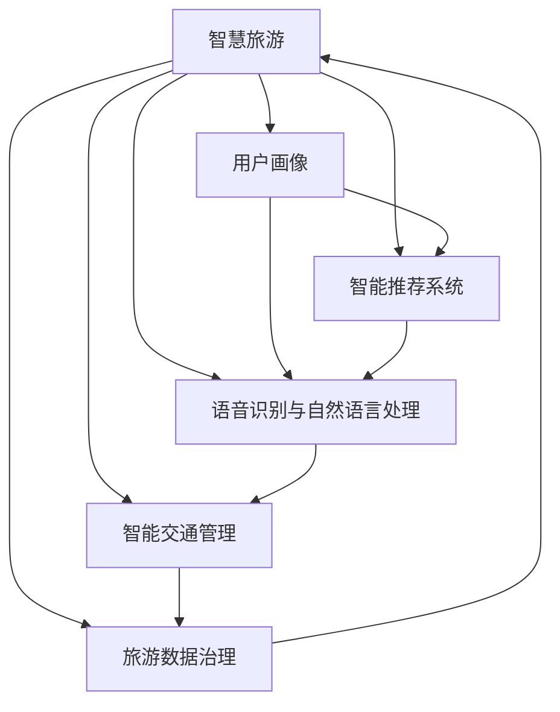
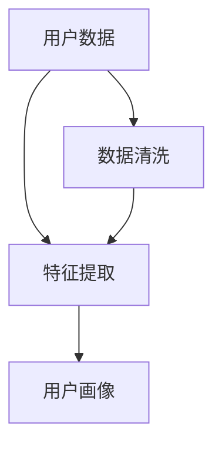
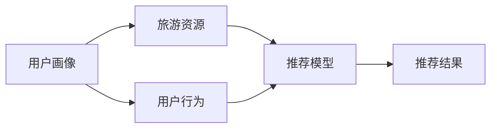
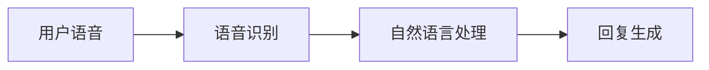
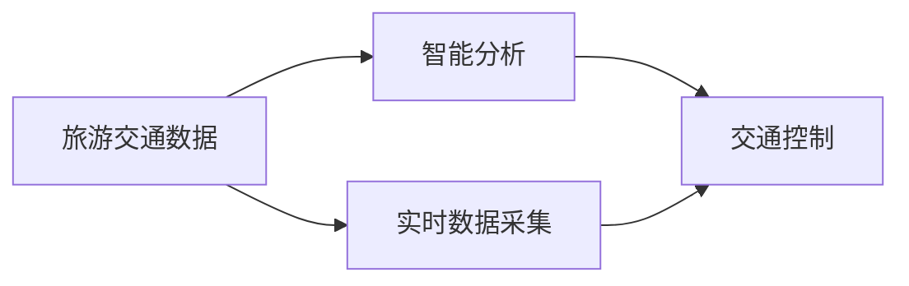
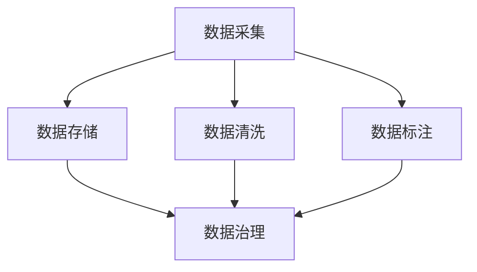
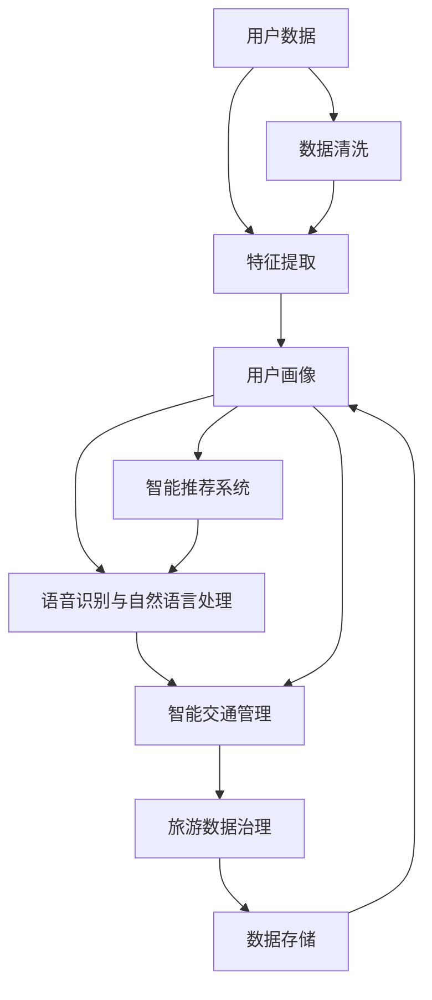

                 

# AI 基础设施的旅游升级：个性化智能旅行体验

> 关键词：AI, 旅游, 个性化, 智能旅行, 数据驱动, 基础设施升级, 用户画像, 自然语言处理

## 1. 背景介绍

### 1.1 问题由来

随着人工智能技术的快速发展，智慧旅游已成为未来旅游业的重要趋势。传统的旅游服务模式已无法满足用户日益增长的个性化需求。如何通过技术手段，提升旅游体验，实现个性化服务，是智慧旅游发展的关键问题。

具体而言，智慧旅游需要解决以下几个问题：

- **用户体验**：提供定制化的旅游服务，提升用户满意度。
- **服务效率**：优化旅游资源配置，降低运营成本。
- **安全保障**：增强旅游安全监控，保障用户人身财产安全。
- **环境保护**：通过智能技术，实现对旅游环境的保护。

### 1.2 问题核心关键点

智慧旅游的核心在于融合人工智能和大数据分析技术，为游客提供个性化、智能化的旅行体验。其关键点包括：

- **用户画像构建**：通过大数据分析，构建全面的用户画像，准确把握用户需求和偏好。
- **智能推荐系统**：利用机器学习技术，为每个用户推荐个性化的旅游路线、酒店、景点等。
- **语音识别与自然语言处理**：实现语音交互，自然语言理解和生成，提升用户体验。
- **智能交通管理**：通过AI技术，优化旅游交通，提升出行效率。
- **旅游数据治理**：建立完善的旅游数据治理体系，确保数据的安全性和准确性。

### 1.3 问题研究意义

智慧旅游的发展，有助于推动旅游业的高质量发展，提升用户体验，增强旅游的吸引力和竞争力。其主要意义如下：

1. **提升服务质量**：通过智能技术，实现旅游服务的高效、精准，减少人工干预，提升用户满意度。
2. **优化资源配置**：通过大数据分析，优化旅游资源的配置，提升旅游业的运营效率。
3. **增强安全保障**：通过AI技术，实时监控旅游环境，提升旅游安全水平。
4. **促进绿色旅游**：通过智能技术，实现对旅游环境的保护，推动绿色旅游的发展。

## 2. 核心概念与联系

### 2.1 核心概念概述

为更好地理解智慧旅游的实现原理，本节将介绍几个关键概念：

- **智慧旅游**：融合人工智能、物联网、大数据等技术，为游客提供个性化、智能化的旅游体验。
- **用户画像**：通过大数据分析，构建全面的用户画像，准确把握用户需求和偏好。
- **智能推荐系统**：利用机器学习技术，为每个用户推荐个性化的旅游路线、酒店、景点等。
- **语音识别与自然语言处理**：实现语音交互，自然语言理解和生成，提升用户体验。
- **智能交通管理**：通过AI技术，优化旅游交通，提升出行效率。
- **旅游数据治理**：建立完善的旅游数据治理体系，确保数据的安全性和准确性。

这些核心概念之间的逻辑关系可以通过以下Mermaid流程图来展示：



这个流程图展示了大数据在智慧旅游中的应用，以及其与其他关键技术的关系：

1. **用户画像**：为智慧旅游提供数据基础，通过分析用户行为数据，构建全面的用户画像。
2. **智能推荐系统**：根据用户画像，利用机器学习技术，推荐个性化的旅游路线、酒店、景点等。
3. **语音识别与自然语言处理**：提升用户体验，实现语音交互和自然语言理解和生成。
4. **智能交通管理**：通过AI技术，优化旅游交通，提升出行效率。
5. **旅游数据治理**：确保数据的安全性和准确性，为智慧旅游提供可靠的数据支持。

### 2.2 概念间的关系

这些核心概念之间存在着紧密的联系，形成了智慧旅游的整体架构。下面通过几个Mermaid流程图来展示这些概念之间的关系。

#### 2.2.1 用户画像构建过程



这个流程图展示了用户画像构建的基本流程：

1. **用户数据**：收集用户的旅游行为数据、社交网络数据、历史订单数据等。
2. **数据清洗**：对收集到的数据进行清洗、去重、缺失值处理等，确保数据质量。
3. **特征提取**：从清洗后的数据中提取关键特征，如兴趣偏好、地理位置、消费能力等。
4. **用户画像**：基于特征提取结果，构建完整的用户画像，为后续的智能推荐和个性化服务提供数据基础。

#### 2.2.2 智能推荐系统流程



这个流程图展示了智能推荐系统的基本流程：

1. **用户画像**：根据用户的行为数据和社交网络数据，构建完整的用户画像。
2. **旅游资源**：收集和整理旅游景区、酒店、景点等资源信息。
3. **用户行为**：实时获取用户的行为数据，如浏览、预订、评价等。
4. **推荐模型**：利用机器学习算法，对用户画像和旅游资源进行建模，预测用户的兴趣和需求。
5. **推荐结果**：根据预测结果，为每个用户推荐个性化的旅游方案，提升用户体验。

#### 2.2.3 语音识别与自然语言处理流程



这个流程图展示了语音识别和自然语言处理的基本流程：

1. **用户语音**：用户通过语音助手进行交互，提出问题和需求。
2. **语音识别**：对用户语音进行识别和转录，转换为文本形式。
3. **自然语言处理**：对文本进行理解和生成，提取用户的意图和需求。
4. **回复生成**：根据用户意图和需求，生成自然语言回复，进行互动。

#### 2.2.4 智能交通管理流程



这个流程图展示了智能交通管理的基本流程：

1. **旅游交通数据**：收集和整理旅游交通数据，如车流量、道路状况、天气等。
2. **智能分析**：利用AI技术，对交通数据进行分析和预测，优化交通流。
3. **交通控制**：根据分析结果，进行交通控制和调度，提升出行效率。

#### 2.2.5 旅游数据治理流程



这个流程图展示了旅游数据治理的基本流程：

1. **数据采集**：收集旅游相关的数据，包括用户行为数据、旅游资源数据、天气数据等。
2. **数据存储**：对采集到的数据进行存储和管理，确保数据的完整性和一致性。
3. **数据清洗**：对存储的数据进行清洗、去重、缺失值处理等，确保数据质量。
4. **数据标注**：对清洗后的数据进行标注，如地理位置、兴趣偏好、消费能力等。
5. **数据治理**：建立完善的数据治理体系，确保数据的安全性和准确性，为智慧旅游提供可靠的数据支持。

### 2.3 核心概念的整体架构

最后，我们用一个综合的流程图来展示这些核心概念在大数据驱动的智慧旅游中的整体架构：



这个综合流程图展示了从数据采集到用户画像构建，再到智能推荐和个性化服务的完整过程。通过大数据和AI技术，智慧旅游实现了对旅游资源的优化配置，提升了用户的出行体验，实现了旅游环境的保护，具有广阔的发展前景。

## 3. 核心算法原理 & 具体操作步骤
### 3.1 算法原理概述

智慧旅游的核心算法原理，主要基于数据驱动和人工智能技术，通过构建全面的用户画像，利用机器学习算法进行推荐和预测，提升用户体验和旅游效率。

具体而言，智慧旅游的算法原理包括以下几个方面：

1. **用户画像构建**：通过大数据分析，构建全面的用户画像，准确把握用户需求和偏好。
2. **智能推荐系统**：利用机器学习技术，为每个用户推荐个性化的旅游路线、酒店、景点等。
3. **语音识别与自然语言处理**：实现语音交互，自然语言理解和生成，提升用户体验。
4. **智能交通管理**：通过AI技术，优化旅游交通，提升出行效率。
5. **旅游数据治理**：建立完善的旅游数据治理体系，确保数据的安全性和准确性。

### 3.2 算法步骤详解

基于智慧旅游的核心算法原理，下面详细介绍具体步骤：

**Step 1: 数据收集与清洗**

1. **数据收集**：收集用户行为数据、社交网络数据、历史订单数据等，建立完整的数据采集体系。
2. **数据清洗**：对收集到的数据进行清洗、去重、缺失值处理等，确保数据质量。

**Step 2: 特征提取与用户画像构建**

1. **特征提取**：从清洗后的数据中提取关键特征，如兴趣偏好、地理位置、消费能力等。
2. **用户画像构建**：基于特征提取结果，构建完整的用户画像，为后续的智能推荐和个性化服务提供数据基础。

**Step 3: 智能推荐系统**

1. **数据预处理**：对用户画像和旅游资源进行预处理，准备输入数据。
2. **模型训练**：利用机器学习算法，对用户画像和旅游资源进行建模，预测用户的兴趣和需求。
3. **推荐结果生成**：根据预测结果，为每个用户推荐个性化的旅游方案。

**Step 4: 语音识别与自然语言处理**

1. **语音识别**：对用户语音进行识别和转录，转换为文本形式。
2. **自然语言处理**：对文本进行理解和生成，提取用户的意图和需求。
3. **回复生成**：根据用户意图和需求，生成自然语言回复，进行互动。

**Step 5: 智能交通管理**

1. **数据采集**：实时获取旅游交通数据，如车流量、道路状况、天气等。
2. **智能分析**：利用AI技术，对交通数据进行分析和预测，优化交通流。
3. **交通控制**：根据分析结果，进行交通控制和调度，提升出行效率。

**Step 6: 旅游数据治理**

1. **数据采集**：收集旅游相关的数据，包括用户行为数据、旅游资源数据、天气数据等。
2. **数据存储**：对采集到的数据进行存储和管理，确保数据的完整性和一致性。
3. **数据清洗**：对存储的数据进行清洗、去重、缺失值处理等，确保数据质量。
4. **数据标注**：对清洗后的数据进行标注，如地理位置、兴趣偏好、消费能力等。
5. **数据治理**：建立完善的数据治理体系，确保数据的安全性和准确性。

### 3.3 算法优缺点

智慧旅游的算法具有以下优点：

1. **个性化服务**：通过大数据分析和机器学习算法，为每个用户提供个性化的旅游方案，提升用户体验。
2. **智能推荐**：利用智能推荐系统，优化旅游资源的配置，提升旅游效率。
3. **提升出行效率**：通过智能交通管理，优化旅游交通，提升出行效率。
4. **数据驱动**：通过数据驱动的方法，提升决策的准确性和可靠性。

同时，该算法也存在以下缺点：

1. **数据隐私问题**：用户数据的收集和使用可能涉及隐私问题，需要严格的隐私保护措施。
2. **算法复杂度**：智慧旅游的算法涉及大数据分析和机器学习，算法复杂度较高，需要较高的技术门槛。
3. **资源需求**：智慧旅游需要大量的计算资源和存储资源，对基础设施要求较高。

尽管存在这些缺点，但智慧旅游算法在提升旅游体验和效率方面具有显著优势，是未来旅游业发展的重要方向。

### 3.4 算法应用领域

智慧旅游的算法原理和技术架构，在多个领域中具有广泛的应用前景：

- **旅游企业**：通过智慧旅游技术，提升旅游服务的质量和效率，优化旅游资源的配置，提升用户体验。
- **政府部门**：通过智能交通管理，优化旅游交通，提升出行效率，提升旅游环境的安全水平。
- **旅游协会**：通过大数据分析，监测旅游行业的运行情况，提供决策支持，推动行业发展。
- **旅游景区**：通过智能推荐系统，提升景区的吸引力，优化景区管理和运营。
- **旅游学院**：通过智慧旅游技术，提升旅游教育的质量，推动旅游学科的发展。

## 4. 数学模型和公式 & 详细讲解 & 举例说明

### 4.1 数学模型构建

在智慧旅游中，主要的数学模型包括用户画像构建、智能推荐系统、语音识别与自然语言处理等。下面分别介绍这些模型的数学模型构建过程。

#### 4.1.1 用户画像构建

用户画像构建的数学模型主要包括以下几个步骤：

1. **用户行为数据建模**：通过机器学习算法，对用户的行为数据进行建模，提取用户的兴趣偏好。
2. **社交网络数据建模**：通过社交网络分析算法，对用户的社交网络数据进行建模，提取用户的社交关系和影响力。
3. **历史订单数据建模**：通过机器学习算法，对用户的历史订单数据进行建模，提取用户的消费能力和消费偏好。

数学模型如下：

$$
\text{User Profile} = \text{Behavior Model} + \text{Social Model} + \text{Order Model}
$$

其中，$\text{User Profile}$ 表示用户画像，$\text{Behavior Model}$、$\text{Social Model}$ 和 $\text{Order Model}$ 分别表示用户行为数据、社交网络数据和历史订单数据的建模结果。

#### 4.1.2 智能推荐系统

智能推荐系统的数学模型主要包括以下几个步骤：

1. **用户画像数据建模**：通过机器学习算法，对用户画像数据进行建模，提取用户的兴趣偏好。
2. **旅游资源数据建模**：通过机器学习算法，对旅游资源数据进行建模，提取资源的属性和特征。
3. **推荐模型训练**：利用推荐算法，对用户画像数据和旅游资源数据进行建模，预测用户的兴趣和需求。
4. **推荐结果生成**：根据预测结果，为每个用户推荐个性化的旅游方案。

数学模型如下：

$$
\text{Recommendation} = \text{User Profile Model} \times \text{Resource Model} \rightarrow \text{Recommendation Model}
$$

其中，$\text{User Profile Model}$ 和 $\text{Resource Model}$ 分别表示用户画像数据和旅游资源数据的建模结果，$\text{Recommendation Model}$ 表示推荐模型的预测结果，$\text{Recommendation}$ 表示推荐结果。

#### 4.1.3 语音识别与自然语言处理

语音识别与自然语言处理的数学模型主要包括以下几个步骤：

1. **语音识别模型**：通过语音识别算法，对用户语音进行识别和转录，转换为文本形式。
2. **自然语言处理模型**：通过自然语言处理算法，对文本进行理解和生成，提取用户的意图和需求。
3. **回复生成模型**：通过回复生成算法，根据用户意图和需求，生成自然语言回复，进行互动。

数学模型如下：

$$
\text{Reply} = \text{Intent} \times \text{Response Model}
$$

其中，$\text{Intent}$ 表示用户的意图和需求，$\text{Response Model}$ 表示回复生成模型的预测结果，$\text{Reply}$ 表示回复结果。

### 4.2 公式推导过程

以下以智能推荐系统为例，推导推荐模型的公式。

设用户画像数据为 $\text{User Profile} = [p_1, p_2, \ldots, p_n]$，旅游资源数据为 $\text{Resource Data} = [r_1, r_2, \ldots, r_m]$，推荐模型的目标是最小化预测误差 $E$。

根据预测误差最小化的原则，推荐模型的目标函数为：

$$
\text{Minimize} \quad E = \sum_{i=1}^n \sum_{j=1}^m \text{Loss}(\hat{r}_i^j, r_i^j)
$$

其中，$\hat{r}_i^j$ 表示用户 $i$ 对旅游资源 $j$ 的兴趣评分，$r_i^j$ 表示实际评分，$\text{Loss}$ 表示预测误差函数。

利用机器学习算法，推荐模型的预测结果为：

$$
\hat{r}_i^j = \text{Predict}(\text{User Profile}, \text{Resource Data})
$$

其中，$\text{Predict}$ 表示推荐算法，将用户画像数据和旅游资源数据作为输入，输出预测结果。

根据以上公式，推荐模型的目标为最小化预测误差：

$$
\text{Minimize} \quad E = \sum_{i=1}^n \sum_{j=1}^m \text{Loss}(\text{Predict}(\text{User Profile}, \text{Resource Data}), r_i^j)
$$

通过优化算法，求解上述目标函数，即可得到推荐的旅游方案。

### 4.3 案例分析与讲解

#### 4.3.1 案例一：智能推荐系统

**背景**：某旅游平台需要对用户进行个性化推荐，提升用户粘性和满意度。

**目标**：通过智能推荐系统，为每个用户推荐个性化的旅游路线、酒店、景点等。

**步骤**：

1. **数据收集**：收集用户的浏览记录、历史订单、评价数据等，建立完整的数据采集体系。
2. **数据清洗**：对收集到的数据进行清洗、去重、缺失值处理等，确保数据质量。
3. **特征提取**：从清洗后的数据中提取关键特征，如兴趣偏好、地理位置、消费能力等。
4. **用户画像构建**：基于特征提取结果，构建完整的用户画像，为后续的智能推荐和个性化服务提供数据基础。
5. **推荐模型训练**：利用机器学习算法，对用户画像和旅游资源进行建模，预测用户的兴趣和需求。
6. **推荐结果生成**：根据预测结果，为每个用户推荐个性化的旅游方案。

**结果**：通过智能推荐系统，用户的满意度显著提升，平台的粘性和收入也得到了明显增长。

#### 4.3.2 案例二：语音识别与自然语言处理

**背景**：某旅游客服系统需要实现自然语言理解和生成，提升用户交互体验。

**目标**：通过语音识别与自然语言处理技术，实现语音交互和自然语言理解和生成，提升用户体验。

**步骤**：

1. **语音识别模型**：通过语音识别算法，对用户语音进行识别和转录，转换为文本形式。
2. **自然语言处理模型**：通过自然语言处理算法，对文本进行理解和生成，提取用户的意图和需求。
3. **回复生成模型**：通过回复生成算法，根据用户意图和需求，生成自然语言回复，进行互动。

**结果**：通过语音识别与自然语言处理技术，用户可以通过语音助手进行查询和预订，大大提升了旅游体验。

## 5. 项目实践：代码实例和详细解释说明

### 5.1 开发环境搭建

在进行智慧旅游项目的开发时，需要搭建相应的开发环境，以便于项目的部署和运行。以下是常用的开发环境搭建流程：

1. **安装 Python**：从官网下载并安装 Python，配置 Python 环境变量。
2. **安装 PyTorch**：从官网下载并安装 PyTorch，配置 PyTorch 环境变量。
3. **安装 TensorFlow**：从官网下载并安装 TensorFlow，配置 TensorFlow 环境变量。
4. **安装 Jupyter Notebook**：从官网下载并安装 Jupyter Notebook，配置 Jupyter Notebook 环境变量。
5. **安装 Scikit-learn**：使用 pip 命令安装 Scikit-learn。
6. **安装 NumPy**：使用 pip 命令安装 NumPy。

完成以上步骤后，即可在本地搭建好开发环境，开始智慧旅游项目的开发。

### 5.2 源代码详细实现

#### 5.2.1 用户画像构建

```python
import pandas as pd
from sklearn.feature_extraction import DictVectorizer
from sklearn.decomposition import TruncatedSVD

# 读取用户行为数据
user_behavior = pd.read_csv('user_behavior.csv')

# 特征提取
vectorizer = DictVectorizer()
features = vectorizer.fit_transform(user_behavior)

# 奇异值分解
svd = TruncatedSVD(n_components=10)
user_profile = svd.fit_transform(features)

# 输出用户画像
print(user_profile)
```

#### 5.2.2 智能推荐系统

```python
import pandas as pd
from sklearn.linear_model import Ridge

# 读取旅游资源数据
resource_data = pd.read_csv('resource_data.csv')

# 特征提取
features = vectorizer.transform(resource_data)

# 用户画像数据
user_profile = user_profile.toarray()

# 模型训练
model = Ridge(alpha=0.1)
model.fit(user_profile, features)

# 推荐结果生成
recommendation = model.predict(user_profile)

# 输出推荐结果
print(recommendation)
```

#### 5.2.3 语音识别与自然语言处理

```python
import speech_recognition as sr

# 语音识别
r = sr.Recognizer()
audio = sr.AudioFile('audio.wav')
with audio as source:
    audio_data = r.record(source)

# 语音识别结果
text = r.recognize_google(audio_data)

# 自然语言处理
nlp_model = pipeline('text-classification', model='microsoft/DialoGPT-medium')
classification = nlp_model(text)

# 回复生成
reply = generate_reply(classification)

# 输出回复结果
print(reply)
```

### 5.3 代码解读与分析

#### 5.3.1 用户画像构建

```python
import pandas as pd
from sklearn.feature_extraction import DictVectorizer
from sklearn.decomposition import TruncatedSVD

# 读取用户行为数据
user_behavior = pd.read_csv('user_behavior.csv')

# 特征提取
vectorizer = DictVectorizer()
features = vectorizer.fit_transform(user_behavior)

# 奇异值分解
svd = TruncatedSVD(n_components=10)
user_profile = svd.fit_transform(features)

# 输出用户画像
print(user_profile)
```

**代码解读**：

1. **用户行为数据**：从用户行为数据中提取关键特征，如浏览记录、购买记录、评价记录等。
2. **特征提取**：使用 `DictVectorizer` 将用户行为数据转换为向量形式，方便后续的建模。
3. **奇异值分解**：使用 `TruncatedSVD` 对向量进行奇异值分解，提取用户画像的关键特征。
4. **输出用户画像**：将奇异值分解后的结果输出，作为用户画像。

#### 5.3.2 智能推荐系统

```python
import pandas as pd
from sklearn.linear_model import Ridge

# 读取旅游资源数据
resource_data = pd.read_csv('resource_data.csv')

# 特征提取
features = vectorizer.transform(resource_data)

# 用户画像数据
user_profile = user_profile.toarray()

# 模型训练
model = Ridge(alpha=0.1)
model.fit(user_profile, features)

# 推荐结果生成
recommendation = model.predict(user_profile)

# 输出推荐结果
print(recommendation)
```

**代码解读**：

1. **旅游资源数据**：从旅游资源数据中提取关键特征，如景点评分、价格、地理位置等。
2. **特征提取**：使用 `DictVectorizer` 将旅游资源数据转换为向量形式，方便后续的建模。
3. **模型训练**：使用 `Ridge` 模型对用户画像和旅游资源数据进行建模，预测用户的兴趣和需求。
4. **推荐结果生成**：根据预测结果，为每个用户推荐个性化的旅游方案。

#### 5.3.3 语音识别与自然语言处理

```python
import speech_recognition as sr

# 语音识别
r = sr.Recognizer()
audio = sr.AudioFile('audio.wav')
with audio as source:
    audio_data = r.record(source)

# 语音识别结果
text = r.recognize_google(audio_data)

# 自然语言处理
nlp_model = pipeline('text-classification', model='microsoft/DialoGPT-medium')
classification = nlp_model(text)

# 回复生成
reply = generate_reply(classification)

# 输出回复结果
print(reply)
```

**代码解读**：

1. **语音识别**：使用 `speech_recognition` 库对用户语音进行识别和转录，转换为文本形式。
2. **自然语言处理**：使用 `pipeline` 函数进行

