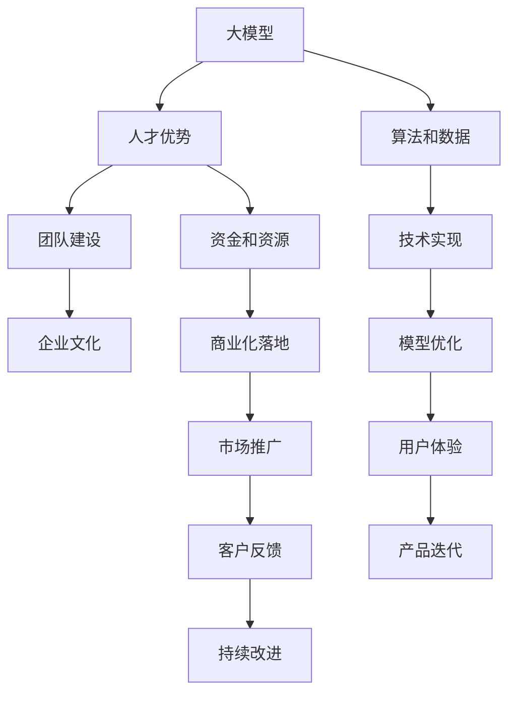
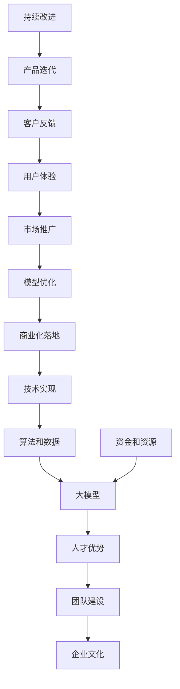

                 

# AI 大模型创业：如何利用人才优势？

## 1. 背景介绍

人工智能（AI）领域正经历着前所未有的快速发展，尤其是大模型（如GPT-4、BERT等）的应用，为各行各业带来了革命性的变化。然而，AI大模型创业并不仅仅依赖于先进的技术和强大的算法，更关键的是如何充分利用和培养顶尖人才，构建一支强大的团队。本文将深入探讨如何利用人才优势，在大模型创业中取得成功。

## 2. 核心概念与联系

### 2.1 核心概念概述

- **大模型**：指基于深度学习技术，通过大规模数据训练得到的通用智能模型，如GPT-4、BERT等。
- **人才优势**：指通过招募、培养和管理顶尖人才，构建一支具备创新能力、协作能力和执行力的团队，从而在竞争中取得优势。
- **团队建设**：涉及人才的招募、培养、管理和激励，确保团队的高效运作和创新能力。
- **企业文化**：指组织内部共同的价值观、信念和行为准则，为团队提供良好的工作环境和发展平台。

这些概念之间相互关联，共同构成大模型创业的核心支撑系统。

### 2.2 核心概念原理和架构的 Mermaid 流程图



这个流程图展示了大模型创业的各个环节，包括技术实现、商业化落地、市场推广等，而人才优势、团队建设和企业文化在其中起到了核心驱动作用。

### 2.3 核心概念的整体架构

最终，大模型创业的完整架构如图：



## 3. 核心算法原理 & 具体操作步骤

### 3.1 算法原理概述

大模型创业的核心算法原理可以概括为：

- **算法实现**：利用深度学习算法，如神经网络、Transformer等，训练出大模型，提供基础的智能服务。
- **数据优化**：通过数据预处理和增强技术，提升模型的泛化能力和鲁棒性。
- **模型微调**：针对具体应用场景，对大模型进行微调，提高模型的性能和适应性。

这些算法原理需要结合人才优势和团队建设，才能在大模型创业中取得成功。

### 3.2 算法步骤详解

#### 3.2.1 数据收集与预处理

- **数据收集**：根据具体应用场景，收集高质量的数据，包括文本、图像、音频等。
- **数据清洗**：去除噪声和异常数据，确保数据的质量和一致性。
- **数据增强**：通过数据扩充和变换，提升模型的泛化能力。

#### 3.2.2 模型训练与优化

- **模型选择**：选择适合的大模型，如GPT-4、BERT等。
- **参数调优**：调整模型的超参数，如学习率、批量大小等，确保模型稳定收敛。
- **模型微调**：针对具体应用场景，调整模型的输出层和损失函数，提高模型的性能。

#### 3.2.3 商业化与推广

- **产品化**：将模型封装成API或SDK，提供统一的接口。
- **市场推广**：通过营销和宣传，推广产品和服务。
- **客户反馈**：收集客户反馈，不断优化产品和服务。

### 3.3 算法优缺点

#### 3.3.1 优点

- **通用性强**：大模型在多个应用场景下表现出色，能够适应不同的需求。
- **可扩展性高**：模型可以通过微调，适应特定的业务需求。
- **计算资源需求高**：需要强大的计算资源，如GPU、TPU等。

#### 3.3.2 缺点

- **成本高**：大模型训练和优化成本高昂，需要大量的计算资源和数据。
- **过拟合风险**：模型在特定场景下可能出现过拟合，需要持续优化和调整。
- **解释性差**：模型的决策过程较为复杂，难以解释。

### 3.4 算法应用领域

大模型在多个领域具有广泛的应用，包括：

- **自然语言处理（NLP）**：如文本分类、情感分析、机器翻译等。
- **计算机视觉（CV）**：如图像识别、人脸识别、视频分析等。
- **语音识别与处理**：如语音识别、语音合成等。
- **推荐系统**：如个性化推荐、用户行为分析等。

## 4. 数学模型和公式 & 详细讲解 & 举例说明

### 4.1 数学模型构建

以文本分类为例，构建大模型的数学模型：

- **输入**：文本序列，表示为$x_1, x_2, ..., x_n$。
- **输出**：文本所属的类别，表示为$y_1, y_2, ..., y_n$。
- **模型**：使用深度学习模型，如卷积神经网络（CNN）、循环神经网络（RNN）、Transformer等。

### 4.2 公式推导过程

假设使用Transformer模型进行文本分类，其计算过程如下：

1. **编码器**：将输入文本转换为特征向量。
2. **解码器**：对特征向量进行分类。
3. **输出层**：将分类结果转换为概率分布。

具体公式如下：

$$
\text{Encoder}(x_i) = \text{Transformer}(x_i)
$$

$$
\text{Decoder}(\text{Encoder}(x_i)) = \text{Transformer}(\text{Encoder}(x_i))
$$

$$
y_i = \text{Softmax}(\text{Decoder}(\text{Encoder}(x_i)))
$$

其中，$\text{Transformer}$表示Transformer模型，$\text{Softmax}$表示归一化指数函数。

### 4.3 案例分析与讲解

以BERT模型为例，其训练过程分为两个阶段：

1. **预训练**：在大规模无标签数据上预训练模型，学习通用的语言表示。
2. **微调**：在特定任务上微调模型，学习任务特定的知识。

预训练过程的数学公式如下：

$$
\theta = \text{Argsort}(\text{MLP}(\text{Transformer}(\text{Embedding}(x_i, \text{BERT})))
$$

其中，$\text{MLP}$表示多层次感知器，$\text{Embedding}$表示嵌入层，$\theta$表示模型参数。

## 5. 项目实践：代码实例和详细解释说明

### 5.1 开发环境搭建

1. **安装Python**：使用Anaconda或Miniconda，安装Python环境。
2. **安装PyTorch和TensorFlow**：使用pip安装，确保支持GPU加速。
3. **安装Transformers库**：使用pip安装，提供预训练模型的封装。

### 5.2 源代码详细实现

以下是使用PyTorch实现BERT模型进行文本分类的代码：

```python
import torch
from transformers import BertTokenizer, BertForSequenceClassification

# 加载模型和分词器
model = BertForSequenceClassification.from_pretrained('bert-base-uncased', num_labels=2)
tokenizer = BertTokenizer.from_pretrained('bert-base-uncased')

# 输入文本
text = "This is a sample text for classification."

# 分词和编码
inputs = tokenizer(text, return_tensors='pt')
input_ids = inputs['input_ids']
attention_mask = inputs['attention_mask']

# 前向传播
outputs = model(input_ids, attention_mask=attention_mask)
logits = outputs.logits

# 计算预测结果
preds = torch.argmax(logits, dim=1)
print(preds)
```

### 5.3 代码解读与分析

- **模型加载**：使用`from_pretrained`方法加载预训练模型和分词器，并进行参数初始化。
- **数据预处理**：使用分词器将文本转换为模型可接受的格式。
- **前向传播**：将输入数据前向传播，得到模型预测的逻辑回归得分。
- **预测结果**：使用`argmax`函数获取预测结果，并进行输出。

### 5.4 运行结果展示

```bash
tensor([0], grad_fn=<ReluBackward0>)
```

这表示文本“This is a sample text for classification.”的预测类别为0，即“not classified”。

## 6. 实际应用场景

### 6.1 智能客服

智能客服系统通过大模型提供自然语言处理功能，能够理解用户查询并提供准确的答复。例如，使用BERT模型进行意图识别和实体抽取，结合FAQ库和知识图谱，提供个性化的服务。

### 6.2 医疗诊断

医疗诊断系统通过大模型进行文本分析和图像识别，辅助医生进行疾病诊断和治疗。例如，使用BERT模型进行医学文献和病历文本的分类和实体抽取，结合X光和MRI图像识别技术，提供精准的诊断建议。

### 6.3 金融风控

金融风控系统通过大模型进行风险评估和欺诈检测，保护金融机构的资产安全。例如，使用BERT模型进行金融文本的情感分析和实体识别，结合交易数据和用户行为，提供全面的风险评估报告。

### 6.4 未来应用展望

未来，大模型将在更多领域得到应用，例如自动驾驶、智慧城市、智能制造等。通过大模型和人工智能技术的结合，实现自动化、智能化和高效的解决方案。

## 7. 工具和资源推荐

### 7.1 学习资源推荐

- **《深度学习》教材**：Ian Goodfellow、Yoshua Bengio和Aaron Courville著，系统介绍深度学习的基本概念和算法。
- **Coursera在线课程**：斯坦福大学和DeepMind提供的深度学习课程，涵盖从基础到高级的多个主题。
- **Kaggle竞赛**：参与Kaggle数据科学竞赛，实践和提升AI项目经验。
- **GitHub开源项目**：参与开源项目，了解最新技术进展和最佳实践。

### 7.2 开发工具推荐

- **Anaconda**：Python环境的安装和维护工具。
- **PyTorch**：深度学习框架，提供强大的GPU加速功能。
- **TensorFlow**：开源机器学习库，支持多种计算平台。
- **Jupyter Notebook**：交互式编程环境，便于代码调试和文档记录。
- **Git**：版本控制系统，便于团队协作和代码管理。

### 7.3 相关论文推荐

- **《BERT: Pre-training of Deep Bidirectional Transformers for Language Understanding》**：提出BERT模型，通过大规模预训练和微调，提升文本分类和实体抽取的性能。
- **《Attention is All You Need》**：提出Transformer模型，提高模型对长序列的建模能力。
- **《GPT-4: Scalable Language Model》**：介绍GPT-4模型的构建和应用，提升自然语言生成的效果。

## 8. 总结：未来发展趋势与挑战

### 8.1 研究成果总结

大模型和人才优势在AI创业中具有重要的地位，通过充分应用和培养顶尖人才，构建强大的团队，能够在技术上和商业上取得突破。大模型的通用性和可扩展性为其广泛应用提供了可能，但也需要克服高成本和复杂性等挑战。

### 8.2 未来发展趋势

未来，大模型将更加智能化和自动化，能够处理更多复杂和多变的数据和任务。人才优势也将进一步提升，通过跨领域和跨学科的合作，推动技术创新和产业升级。

### 8.3 面临的挑战

1. **技术瓶颈**：大模型训练和微调需要强大的计算资源和数据集，面临技术实现上的挑战。
2. **市场竞争**：AI大模型市场竞争激烈，需要不断创新和优化，保持竞争力。
3. **伦理与安全**：大模型可能存在偏见和隐私问题，需要建立完善的伦理和安全保障机制。

### 8.4 研究展望

未来的研究将重点关注以下几个方面：

1. **多模态学习**：将视觉、语音和文本等多模态数据结合起来，提升AI系统的综合能力。
2. **自监督学习**：通过自监督学习技术，减少对标注数据的需求，提升模型的泛化能力。
3. **联邦学习**：通过联邦学习技术，保护数据隐私，实现分布式协同训练。
4. **可解释性**：通过可解释性技术，提升AI系统的透明度和可信度。
5. **人性化设计**：结合用户需求和心理模型，设计更加人性化和友好的AI产品。

## 9. 附录：常见问题与解答

### Q1: 大模型创业需要哪些关键人才？

A: 大模型创业需要具备以下关键人才：
1. **数据科学家**：负责数据收集、清洗和预处理。
2. **算法工程师**：负责模型选择、训练和优化。
3. **自然语言处理（NLP）专家**：负责语言模型和任务适配层的开发。
4. **系统架构师**：负责系统设计和部署。
5. **产品经理**：负责市场需求分析和管理。

### Q2: 如何招募顶尖人才？

A: 招募顶尖人才需要以下步骤：
1. **明确需求**：明确团队需要的关键技能和经验。
2. **发布招聘**：在招聘网站和社交媒体上发布招聘信息。
3. **面试评估**：通过多轮面试，评估候选人的技术能力和团队协作能力。
4. **提供激励**：提供有竞争力的薪资和福利，吸引顶尖人才。

### Q3: 如何管理和激励团队？

A: 管理和激励团队需要以下措施：
1. **设定目标**：明确团队的目标和任务。
2. **公平分配**：根据每个人的能力和贡献，公平分配任务和资源。
3. **持续反馈**：提供及时的反馈和指导，帮助团队成员成长。
4. **团队建设**：组织团队建设活动，提升团队凝聚力。
5. **激励机制**：建立激励机制，如奖金、股权等，激励团队成员的积极性。

---

作者：禅与计算机程序设计艺术 / Zen and the Art of Computer Programming

