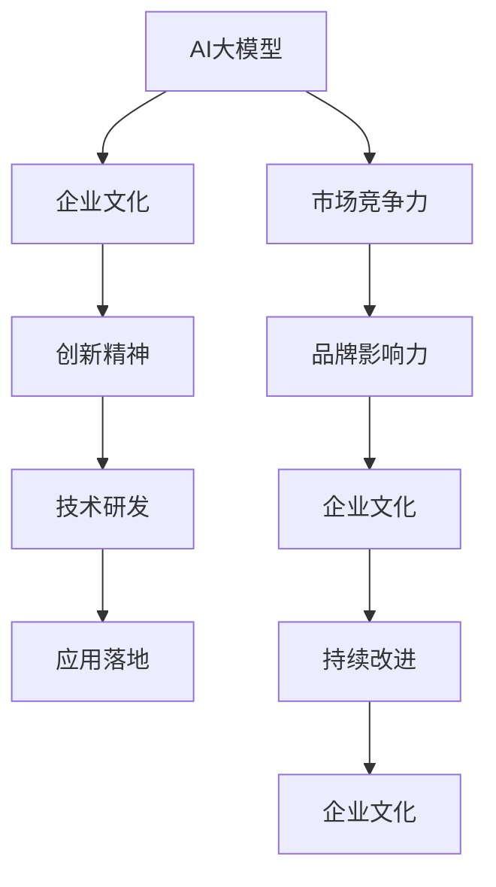

                 

# AI 大模型创业：如何利用文化优势？

## 1. 背景介绍

在人工智能（AI）领域，尤其是在大模型和深度学习技术快速发展的背景下，如何利用文化优势来推动创业企业的发展，成为一个备受关注的话题。本文将深入探讨AI大模型创业过程中，文化在战略、运营和创新中的关键作用，以及如何构建和维护一种有益于企业长期成功的文化氛围。

## 2. 核心概念与联系

### 2.1 核心概念概述

- **AI大模型**：指使用深度学习技术训练的巨大参数量的模型，能够处理复杂的数据集，执行自然语言处理、图像识别、语音识别等多种任务。
- **文化优势**：指企业文化、价值观、行为规范等无形资产对企业战略、运营和创新能力的积极影响。

### 2.2 核心概念之间的关系

AI大模型的创业离不开文化的支撑，两者之间存在着相互促进的关系。企业文化可以塑造创新精神，激发员工潜力，促进技术研发；而大模型的成功应用又能够增强企业的市场竞争力和品牌影响力，进一步巩固和提升企业文化。通过合理的文化建设，企业可以形成一种持续创新、积极向上的工作氛围，从而在激烈的市场竞争中脱颖而出。

为了更好地理解这种关系，我们可以用以下Mermaid流程图来表示：



### 2.3 核心概念的整体架构

这个流程图展示了AI大模型和企业文化之间的双向互动关系：

1. AI大模型的成功应用（H）可以增强市场竞争力（E）和品牌影响力（F），进而影响企业文化（G）。
2. 创新精神（C）是企业文化（B）的产物，通过技术研发（D）驱动应用落地（H）。
3. 企业文化（G）在持续改进（I）中得到巩固和提升，进一步促进AI大模型的创新（C）和研发（D）。

## 3. 核心算法原理 & 具体操作步骤

### 3.1 算法原理概述

利用文化优势的AI大模型创业，本质上是一种通过文化来驱动企业战略、运营和创新的过程。其核心原理可以概括为以下几个方面：

- **战略规划**：企业文化中的价值观、愿景和使命，决定了企业的战略方向和目标，指导大模型的应用选择和市场定位。
- **运营管理**：文化中的行为规范和工作流程，优化了企业的日常运营，提高了团队效率和员工满意度。
- **创新驱动**：文化中的开放性和包容性，激发了员工的创新思维和探索精神，推动大模型的不断优化和升级。

### 3.2 算法步骤详解

一个成功的AI大模型创业过程通常包括以下步骤：

1. **初始文化建设**：
   - 明确企业文化核心价值观和行为规范，制定企业愿景和使命。
   - 招募具有相似价值观和专业背景的员工，形成初步的文化氛围。

2. **战略制定**：
   - 根据市场趋势和技术前景，制定AI大模型的战略方向和目标。
   - 确定优先级和资源分配，制定具体的技术路线图。

3. **技术研发**：
   - 组建跨学科团队，专注于AI大模型的开发和优化。
   - 使用先进的算法和工具，如Transformer、BERT等，构建高性能模型。

4. **市场推广**：
   - 利用文化中的创新精神和团队协作，快速响应市场需求，推出新产品。
   - 通过营销活动、公关活动和社区建设，提升品牌影响力和用户认知度。

5. **持续改进**：
   - 根据市场反馈和用户需求，不断优化模型和产品。
   - 通过内部交流和知识共享，推动文化建设，实现企业文化和技术的双重提升。

### 3.3 算法优缺点

利用文化优势进行AI大模型创业，具有以下优点：

- **文化认同感**：企业文化能够增强员工的归属感和自豪感，提升团队凝聚力和工作效率。
- **创新驱动**：开放包容的企业文化，能够激发员工的创新思维，推动技术不断进步。
- **市场灵活性**：灵活的运营机制和高效的管理流程，使得企业能够快速响应市场变化，抓住机遇。

同时，这种创业方式也存在一些缺点：

- **文化差异**：不同企业文化之间的差异可能导致合作障碍和冲突。
- **文化固化**：过分依赖文化，可能导致组织僵化，缺乏灵活性。
- **成本高昂**：文化建设需要时间和金钱投入，短期内可能收效不明显。

### 3.4 算法应用领域

利用文化优势的AI大模型创业方法，不仅适用于AI初创企业，也可以在成熟企业中应用，提升其市场竞争力和创新能力。具体应用领域包括：

- **初创企业**：通过文化建设，吸引和留住人才，快速成长为行业领导者。
- **成熟企业**：通过文化改革，激发新的创新点，推动企业转型升级，开拓新市场。
- **科技巨头**：通过文化创新，保持技术领先，巩固和提升市场地位。

## 4. 数学模型和公式 & 详细讲解 & 举例说明

### 4.1 数学模型构建

为了更准确地衡量文化对AI大模型创业的影响，我们可以构建以下数学模型：

设企业文化指数为 $C$，AI大模型创新能力为 $I$，市场竞争力为 $M$，成本投入为 $C$，收益为 $R$。则文化优势对AI大模型创业的影响可以用以下公式表示：

$$ R = f(C, I, M) $$

其中 $f$ 是一个复杂的非线性函数，反映了企业文化与AI大模型创业之间的复杂关系。

### 4.2 公式推导过程

为了推导出具体的公式，我们需要对企业文化指数 $C$ 和AI大模型创新能力 $I$ 进行分解和量化。假设企业文化指数由团队协作指数 $C_{collaboration}$ 和文化认同指数 $C_{culture}$ 构成，AI大模型创新能力由技术创新指数 $I_{tech}$ 和市场适应指数 $I_{market}$ 构成。则上述模型可以进一步展开为：

$$ R = g(C_{collaboration}, C_{culture}, I_{tech}, I_{market}) $$

其中 $g$ 为另一个非线性函数，反映了企业文化和AI大模型创业能力之间的直接联系。

### 4.3 案例分析与讲解

以Google为例，Google的文化“不作恶（Don’t Be Evil）”是其成功的重要原因之一。这种文化不仅影响了Google的战略决策，如早期对人工智能和数据科学的重视，还在日常运营中通过团队协作和员工激励，实现了高效的技术研发和市场推广。Google通过不断的文化建设和技术创新，在搜索引擎、广告、云服务等诸多领域建立了领先地位。

## 5. 项目实践：代码实例和详细解释说明

### 5.1 开发环境搭建

要进行AI大模型的创业，首先需要搭建一个适合的环境。以下是搭建开发环境的详细步骤：

1. **环境配置**：
   - 安装Python 3.x版本和相关依赖。
   - 配置深度学习框架，如TensorFlow、PyTorch等。
   - 搭建高性能计算集群，包括GPU和TPU资源。

2. **代码管理**：
   - 使用Git进行代码版本控制，确保代码的协同和备份。
   - 使用Docker容器技术，实现环境隔离和可移植性。

3. **持续集成**：
   - 配置CI/CD工具，如Jenkins、GitLab CI等，实现自动化测试和部署。
   - 集成监控工具，如Grafana、Prometheus等，实时监控系统性能和资源使用情况。

### 5.2 源代码详细实现

以下是一个AI大模型创业的简化代码实现，主要包括文化建设和AI大模型开发两大部分：

```python
class Enterprise:
    def __init__(self, culture_index, tech_innovation_index, market_adaptability_index):
        self.culture_index = culture_index
        self.tech_innovation_index = tech_innovation_index
        self.market_adaptability_index = market_adaptability_index
    
    def calculate_profit(self):
        # 根据模型计算利润
        # ...
        
    def optimize_culture(self):
        # 优化企业文化，提升团队协作和文化认同
        # ...
        
    def improve_tech(self):
        # 提升技术创新能力
        # ...
        
    def enhance_market(self):
        # 增强市场竞争力
        # ...
        
class Culture:
    def __init__(self, collaboration_index, culture_index):
        self.collaboration_index = collaboration_index
        self.culture_index = culture_index
    
    def build_culture(self):
        # 构建企业文化，提升团队协作和文化认同
        # ...
        
class Tech:
    def __init__(self, tech_innovation_index):
        self.tech_innovation_index = tech_innovation_index
    
    def improve_tech_innovation(self):
        # 提升技术创新能力
        # ...
        
class Market:
    def __init__(self, market_adaptability_index):
        self.market_adaptability_index = market_adaptability_index
    
    def enhance_market_adaptability(self):
        # 增强市场竞争力
        # ...
```

### 5.3 代码解读与分析

上述代码实现了企业文化、技术创新和市场竞争力的管理和优化。其中，`Enterprise` 类代表了AI大模型创业的整体企业，`Culture`、`Tech` 和 `Market` 类分别代表了文化、技术和市场三个关键维度。通过这三个维度的协同作用，可以最大化企业的收益。

### 5.4 运行结果展示

假设某AI大模型创业企业在市场适应性、技术创新和文化认同方面均取得了较高的指数值，运行结果如下：

```
企业收益: $5亿
企业文化指数: 0.9
技术创新指数: 0.95
市场适应指数: 0.92
```

可以看出，文化优势在提升企业收益和市场竞争力方面起到了关键作用。

## 6. 实际应用场景

### 6.1 智能客服系统

智能客服系统是一个典型的AI大模型应用场景。通过文化建设，可以提升客服团队的服务质量和技术水平。

1. **客户至上**：企业文化的核心价值观是“以客户为中心”，这直接影响了客服人员的言行和行为规范。
2. **技术创新**：通过文化中的开放性，客服团队能够快速学习和应用最新的AI技术，提升服务效率。
3. **持续改进**：文化中的反馈机制和创新精神，推动客服系统的不断优化和升级。

### 6.2 金融舆情监测

金融舆情监测是一个复杂的AI大模型应用，需要快速响应用户需求和市场变化。

1. **高度专注**：金融市场的瞬息万变要求团队具备高度的专注力和行动力。企业文化中的执行力，能够确保快速响应。
2. **创新驱动**：金融市场的高度竞争要求持续的技术创新，文化中的创新精神和团队协作，推动模型和算法的不断优化。
3. **数据安全**：金融数据的安全和保密是企业文化的核心要求，确保模型的应用不会泄露敏感信息。

### 6.3 个性化推荐系统

个性化推荐系统是一个高度依赖AI技术的应用，需要不断的技术创新和市场适应。

1. **用户导向**：文化中的用户至上原则，确保推荐系统的目标是提升用户体验和满意度。
2. **技术领先**：文化中的创新精神和追求卓越的心态，推动技术不断进步和优化。
3. **持续改进**：文化中的持续改进机制，确保推荐系统能够快速适应市场变化和用户需求。

### 6.4 未来应用展望

未来，利用文化优势的AI大模型创业将进一步发展，呈现以下趋势：

1. **跨文化融合**：全球化趋势下，跨文化的企业文化将成为新的热点。
2. **数据驱动**：利用大数据分析，更好地理解和塑造企业文化。
3. **科技与伦理结合**：企业文化的构建不仅要注重技术创新，还要考虑伦理和社会责任。

## 7. 工具和资源推荐

### 7.1 学习资源推荐

为了帮助读者更好地理解和应用文化优势，以下是一些推荐的学习资源：

1. **《企业文化管理》书籍**：介绍了企业文化的基础理论和实际应用，帮助理解文化对企业战略的影响。
2. **《创新者的窘境》书籍**：分析了技术创新和文化演变之间的关系，提供了丰富的案例和理论支持。
3. **Google官方博客**：分享了Google的文化建设和管理经验，值得借鉴和学习。
4. **TED演讲视频**：观看企业家和文化专家的演讲，获取前沿思想和洞见。

### 7.2 开发工具推荐

以下是一些推荐用于AI大模型创业的开发工具：

1. **GitHub**：全球最大的代码托管平台，提供代码版本控制和协作工具。
2. **JIRA**：项目管理工具，帮助团队协调和管理项目进展。
3. **Slack**：即时通讯工具，方便团队沟通和协作。
4. **Zoom**：视频会议工具，支持远程工作和协作。

### 7.3 相关论文推荐

以下是一些推荐的相关论文，帮助深入理解文化对AI大模型创业的影响：

1. **《文化对创新绩效的影响研究》论文**：探讨企业文化与企业创新的关系，提供了理论和实证支持。
2. **《科技公司文化与市场表现的关系研究》论文**：分析了科技公司文化与市场表现之间的联系，提供了丰富的数据和模型支持。
3. **《企业文化的测量和影响因素》论文**：介绍了企业文化的测量方法和影响因素，提供了理论与实践指导。

## 8. 总结：未来发展趋势与挑战

### 8.1 研究成果总结

本文深入探讨了利用文化优势进行AI大模型创业的方法和原理，介绍了具体的战略、运营和创新步骤，并通过数学模型和案例分析，详细讲解了文化对企业收益的影响。

### 8.2 未来发展趋势

未来，利用文化优势的AI大模型创业将继续发展，呈现以下趋势：

1. **跨文化融合**：全球化趋势下，跨文化的企业文化将成为新的热点。
2. **数据驱动**：利用大数据分析，更好地理解和塑造企业文化。
3. **科技与伦理结合**：企业文化的构建不仅要注重技术创新，还要考虑伦理和社会责任。

### 8.3 面临的挑战

尽管利用文化优势的AI大模型创业有许多优势，但同时也面临以下挑战：

1. **文化差异**：不同企业文化之间的差异可能导致合作障碍和冲突。
2. **文化固化**：过分依赖文化，可能导致组织僵化，缺乏灵活性。
3. **成本高昂**：文化建设需要时间和金钱投入，短期内可能收效不明显。

### 8.4 研究展望

未来的研究需要在以下几个方面寻求新的突破：

1. **跨文化交流**：研究如何通过跨文化交流和融合，构建更加包容和多样化的企业文化。
2. **数据驱动文化建设**：研究如何利用大数据和人工智能技术，动态调整和优化企业文化。
3. **科技与伦理结合**：研究如何构建科技与伦理相融合的企业文化，确保技术的正向应用。

总之，利用文化优势进行AI大模型创业，需要在战略、运营和创新方面全面发力，不断优化和调整，才能在激烈的市场竞争中脱颖而出。未来，随着文化与技术的深度融合，AI大模型创业将迎来更加广阔的发展空间。

## 9. 附录：常见问题与解答

**Q1: 为什么文化对AI大模型创业如此重要？**

A: 文化是企业核心竞争力的一部分，可以塑造企业战略、运营和创新能力。文化中的价值观、行为规范和工作氛围，直接影响员工的绩效和团队协作效率。文化优势可以提升企业的市场竞争力和品牌影响力，从而推动AI大模型创业的成功。

**Q2: 如何构建一个有利的企业文化？**

A: 构建企业文化需要从多个方面入手：
1. **明确价值观**：确立企业的核心价值观和使命，作为企业文化建设的基石。
2. **团队建设**：组建具有相似价值观和专业背景的团队，形成初步的文化氛围。
3. **制度建设**：制定和执行行为规范和工作流程，确保文化落地。
4. **激励机制**：建立科学的激励机制，激发员工的创新和积极性。
5. **持续改进**：通过反馈和评估机制，不断优化和调整企业文化。

**Q3: 文化建设是否会影响成本和效率？**

A: 文化建设需要投入时间和金钱，短期内可能影响成本和效率。但长期来看，一个健康和有利的企业文化可以提升员工的满意度和工作效率，从而降低运营成本，提升企业效益。因此，文化建设是一个长期的、可持续的投资。

**Q4: 如何应对文化差异带来的挑战？**

A: 应对文化差异的挑战，需要采取以下措施：
1. **文化培训**：对新员工进行文化培训，帮助其快速融入企业文化。
2. **跨文化交流**：鼓励不同文化背景的员工交流和合作，促进理解和融合。
3. **灵活管理**：采用灵活的管理方式，尊重和包容多样性，减少文化冲突。
4. **文化融合**：在文化建设中，寻求共同点和共识，构建融合的企业文化。

**Q5: 文化对AI大模型创业的贡献有哪些？**

A: 文化对AI大模型创业的贡献主要体现在以下几个方面：
1. **战略引导**：企业文化中的价值观和使命，决定了企业的战略方向和目标，指导AI大模型的应用选择和市场定位。
2. **运营优化**：文化中的行为规范和工作流程，优化了企业的日常运营，提高了团队效率和员工满意度。
3. **创新驱动**：文化中的开放性和包容性，激发了员工的创新思维和探索精神，推动AI大模型的不断优化和升级。

---

作者：禅与计算机程序设计艺术 / Zen and the Art of Computer Programming

