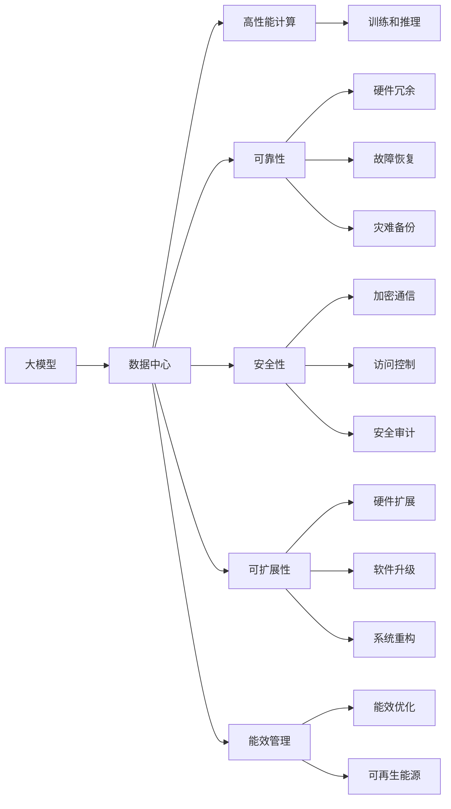
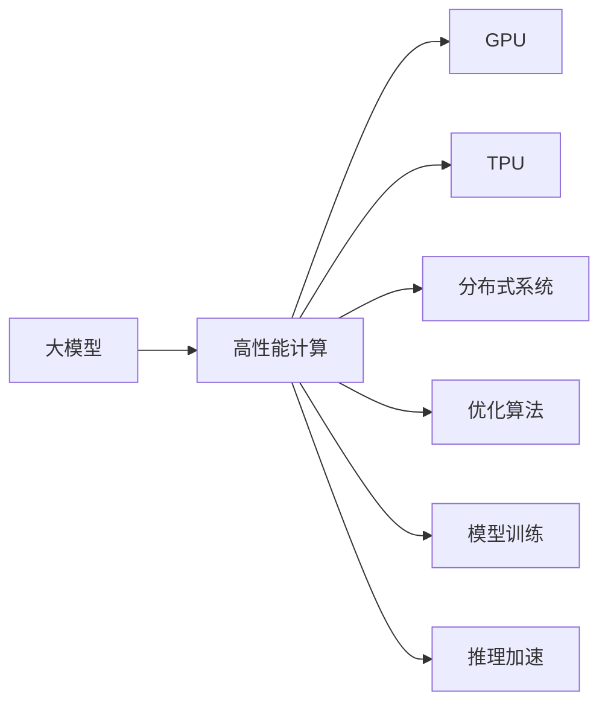
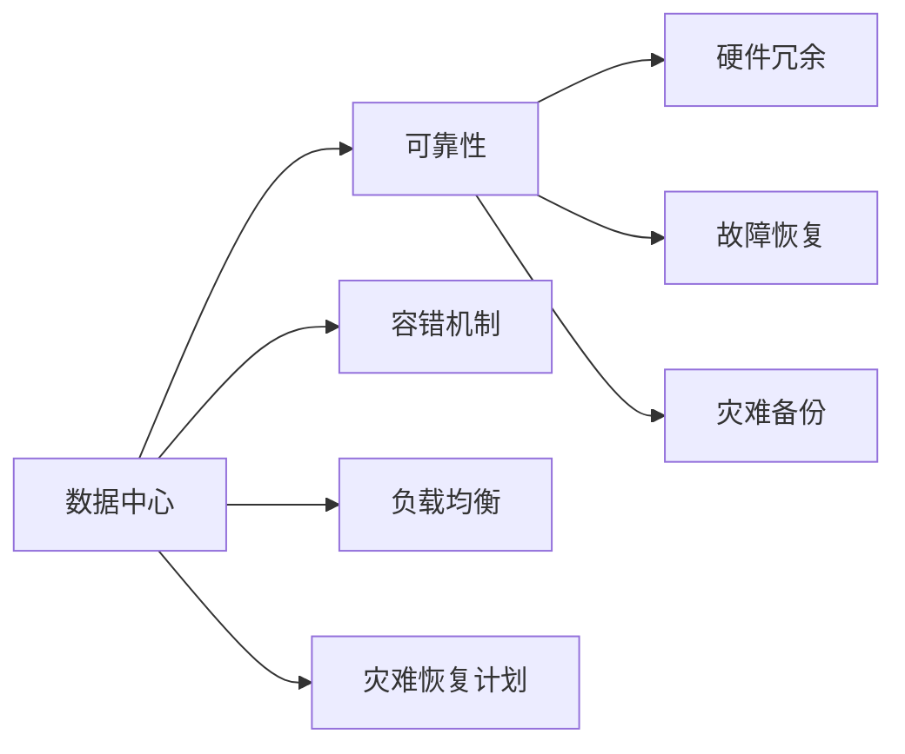
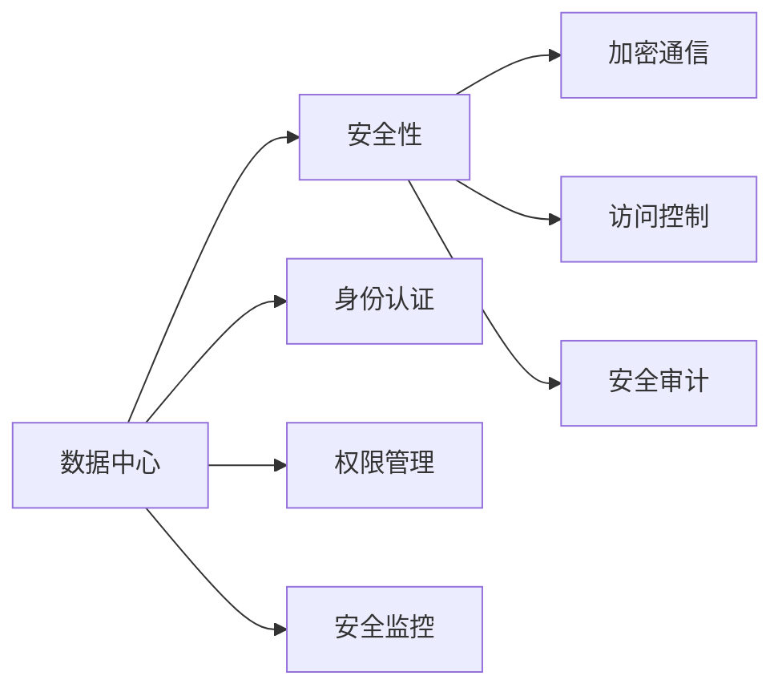
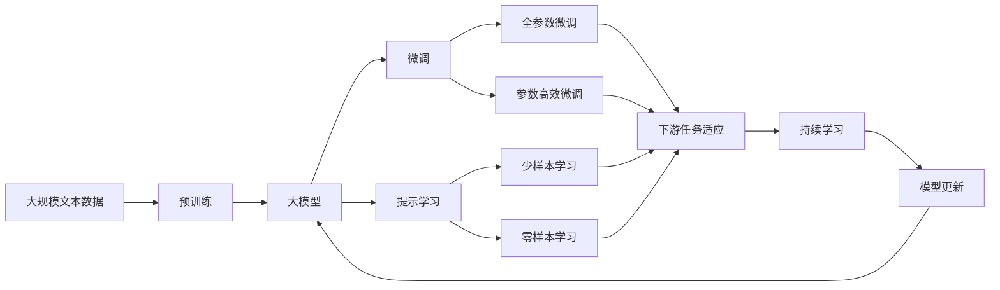

                 

# AI 大模型应用数据中心建设：数据中心投资与建设

> 关键词：
- AI 大模型
- 数据中心
- 投资
- 建设
- 性能优化
- 可靠性保障
- 安全性
- 可扩展性
- 能效管理

## 1. 背景介绍

在人工智能（AI）领域，尤其是深度学习模型的应用中，大模型（Large Models）的重要性愈发凸显。大模型指的是拥有数十亿甚至数百亿参数的神经网络，如GPT-3、BERT等，它们在自然语言处理（NLP）、计算机视觉（CV）、语音识别等领域表现出色，推动了AI技术在商业应用中的广泛落地。然而，要充分发挥大模型的潜力，构建高效、可靠、安全的AI基础设施至关重要。其中，数据中心作为大模型训练和推理的核心基础设施，其投资和建设决策直接关系到AI应用的成功与否。

### 1.1 问题由来
随着大模型应用的兴起，数据中心在AI基础设施中的角色日益重要。然而，数据中心的建设和管理不仅涉及大量的资本投入，还需综合考虑性能、可靠性、安全性、可扩展性和能效等多方面因素。如何在有限的资源条件下，实现最优的投资和建设决策，是当前AI领域面临的重要问题。本文将系统介绍大模型应用中数据中心的投资与建设，帮助企业和研究者制定合理的建设策略，提升AI应用的整体性能。

### 1.2 问题核心关键点
数据中心在大模型应用中的核心作用在于提供高性能的计算资源、存储资源以及网络资源，同时确保系统的可靠性和安全性。因此，数据中心的设计和建设需围绕以下几个关键点展开：

1. **高性能计算**：确保数据中心能够支撑大模型的训练和推理需求，包括GPU、TPU等硬件设备的配置。
2. **可靠性和容灾**：保障数据中心系统的高可用性，防范硬件故障、网络中断等风险。
3. **安全性**：保护数据中心内的敏感数据和模型，防止未经授权的访问和攻击。
4. **可扩展性**：支持未来业务和技术的快速扩展，如引入新的大模型和应用。
5. **能效管理**：优化数据中心的能耗，实现绿色、环保的运营。

### 1.3 问题研究意义
数据中心作为AI应用的基础设施，其投资和建设决策对AI应用的性能、成本和风险具有重要影响。合理的数据中心建设不仅能够满足当前AI应用的计算需求，还能为未来的技术升级和业务扩展打下坚实基础。通过系统的学习和实践，掌握数据中心建设的核心技术和管理方法，可以显著提升AI应用的整体水平，加速AI技术的产业化进程。

## 2. 核心概念与联系

### 2.1 核心概念概述

为更好地理解数据中心在大模型应用中的投资与建设，本节将介绍几个密切相关的核心概念：

- **大模型（Large Models）**：指拥有大量参数的神经网络模型，如GPT、BERT等，具有强大的语义理解能力和生成能力。
- **数据中心（Data Center）**：由多个物理硬件设备和软件系统构成的，提供高性能计算、存储和网络资源的设施。
- **高性能计算（HPC）**：指通过特殊设计的硬件和软件，提供高吞吐量和低延迟的计算能力，满足大模型训练和推理的需求。
- **可靠性**：指系统在高可用性方面的能力，包括硬件冗余、故障恢复和灾难备份等机制。
- **安全性**：指保障数据中心内数据和模型安全，防止未经授权的访问和攻击。
- **可扩展性**：指系统在需求增长时的适应能力，包括硬件扩展、软件升级和系统重构等。
- **能效管理**：指在保证性能的前提下，优化数据中心的能耗，实现绿色、环保的运营。

这些核心概念之间的逻辑关系可以通过以下Mermaid流程图来展示：



这个流程图展示了大模型、数据中心及其各个核心概念之间的关系：

1. 大模型通过数据中心获得高性能计算资源。
2. 数据中心的性能由高性能计算、可靠性、安全性、可扩展性和能效管理等多个方面共同决定。
3. 高性能计算、可靠性、安全性、可扩展性和能效管理分别涉及硬件冗余、故障恢复、加密通信、访问控制、安全审计、硬件扩展、软件升级、系统重构、能效优化、可再生能源等多个子概念。

### 2.2 概念间的关系

这些核心概念之间存在着紧密的联系，形成了数据中心在大模型应用中的完整生态系统。下面我们通过几个Mermaid流程图来展示这些概念之间的关系。

#### 2.2.1 大模型应用中的高性能计算



这个流程图展示了高性能计算在大模型应用中的作用，以及其内部组件之间的关系：

1. 大模型通过高性能计算获得强大的计算能力。
2. GPU、TPU等硬件设备是高性能计算的核心组成部分。
3. 分布式系统和优化算法用于提升计算效率。
4. 模型训练和推理加速通过高性能计算实现。

#### 2.2.2 可靠性与数据中心



这个流程图展示了数据中心在可靠性方面的作用，以及其内部机制之间的关系：

1. 数据中心通过硬件冗余、故障恢复和灾难备份等机制提升可靠性。
2. 容错机制、负载均衡和灾难恢复计划是大中心可靠性的关键组件。
3. 数据中心通过这些机制，确保系统的高可用性。

#### 2.2.3 安全性与数据中心



这个流程图展示了数据中心在安全性方面的作用，以及其内部机制之间的关系：

1. 数据中心通过加密通信、访问控制和安全审计等机制提升安全性。
2. 身份认证、权限管理和安全监控是大中心安全性的关键组件。
3. 数据中心通过这些机制，确保系统免受未经授权的访问和攻击。

### 2.3 核心概念的整体架构

最后，我们用一个综合的流程图来展示这些核心概念在大模型应用中的整体架构：



这个综合流程图展示了从预训练到微调，再到持续学习的完整过程。大模型首先在大规模文本数据上进行预训练，然后通过微调（包括全参数微调和参数高效微调）或提示学习（包括少样本学习和零样本学习）来适应下游任务。最后，通过持续学习技术，模型可以不断更新和适应新的任务和数据。 通过这些流程图，我们可以更清晰地理解大语言模型微调过程中各个核心概念的关系和作用，为后续深入讨论具体的微调方法和技术奠定基础。

## 3. 核心算法原理 & 具体操作步骤
### 3.1 算法原理概述

数据中心在大模型应用中的核心作用是提供高性能计算、存储和网络资源，同时确保系统的可靠性和安全性。本文将从高性能计算、可靠性、安全性、可扩展性和能效管理五个方面，详细介绍数据中心的投资与建设原理。

### 3.2 算法步骤详解

#### 3.2.1 高性能计算的建设

1. **硬件设备选择**：
   - **GPU**：适用于深度学习模型的训练，具有较高的计算能力和较低的延迟。选择GPU时，需考虑性能、能效和价格等因素。
   - **TPU**：专为深度学习优化，提供更高的计算密度和更低的延迟。TPU的优点是速度快、能效高，但成本较高。

2. **分布式系统设计**：
   - **集群设计**：构建多节点集群，提高计算资源利用率。每个节点包含多个GPU或TPU，通过网络进行数据通信。
   - **负载均衡**：使用负载均衡器将请求分发到各个节点，确保每个节点利用率均衡。

3. **优化算法和工具**：
   - **优化算法**：采用如SGD、Adam等优化算法，加速模型训练和推理。
   - **工具库**：使用TensorFlow、PyTorch等深度学习框架，提供高效的计算和模型管理功能。

#### 3.2.2 可靠性的实现

1. **硬件冗余**：
   - **冗余设计**：使用多份硬件资源，如多份GPU或TPU，确保单点故障不会影响整个系统。
   - **备份设计**：数据和模型备份至多份存储介质，防止数据丢失。

2. **故障恢复机制**：
   - **自动重启**：节点故障时自动重启，避免服务中断。
   - **故障检测**：实时监控节点状态，及时发现和处理故障。

3. **灾难备份**：
   - **数据备份**：将数据备份至多个地理位置，防止灾难性事件。
   - **业务连续性**：制定灾难恢复计划，确保关键业务不中断。

#### 3.2.3 安全性的保障

1. **加密通信**：
   - **数据加密**：传输过程中使用加密协议，防止数据泄露。
   - **访问控制**：使用身份认证和权限管理，限制非授权访问。

2. **安全审计**：
   - **日志记录**：记录所有访问和操作，便于审计和追溯。
   - **入侵检测**：使用入侵检测系统，及时发现和处理异常行为。

3. **权限管理**：
   - **角色管理**：根据用户角色分配权限，防止越权访问。
   - **审计机制**：定期审查权限分配，防止安全隐患。

#### 3.2.4 可扩展性的设计

1. **硬件扩展**：
   - **节点扩展**：根据需要增加或减少节点，提升计算能力。
   - **资源调度**：使用资源调度器，动态调整资源分配，优化系统利用率。

2. **软件升级**：
   - **框架升级**：及时更新深度学习框架和库，提升性能和安全性。
   - **模型适配**：调整模型结构，适应新的硬件和软件环境。

3. **系统重构**：
   - **架构重构**：根据需求变化，重新设计系统架构。
   - **代码重构**：优化代码，提升系统性能和稳定性。

#### 3.2.5 能效管理的优化

1. **硬件能效优化**：
   - **低功耗硬件**：使用低功耗GPU或TPU，降低能耗。
   - **能效管理芯片**：集成能效管理芯片，优化硬件性能和能耗。

2. **软件能效优化**：
   - **算法优化**：优化模型和算法，减少计算量。
   - **模型压缩**：使用模型压缩技术，减小模型参数量。

3. **能效监控**：
   - **能效监控系统**：实时监控系统能耗，及时发现和处理能效问题。
   - **能效调度**：根据能效监控结果，调整资源配置，优化能效。

### 3.3 算法优缺点

数据中心在大模型应用中的建设，具有以下优点：

1. **高性能计算**：提供强大的计算能力，支持大模型的训练和推理。
2. **可靠性**：通过硬件冗余和故障恢复机制，保障系统高可用性。
3. **安全性**：通过加密通信和访问控制，保护数据和模型安全。
4. **可扩展性**：支持未来业务和技术的扩展，满足不断增长的计算需求。
5. **能效管理**：通过优化硬件和软件，实现绿色、环保的运营。

同时，数据中心建设也存在一些局限性：

1. **高成本**：硬件设备、网络设备和能源等成本较高。
2. **复杂性**：硬件、软件和网络的多层次设计，增加了系统的复杂性。
3. **维护难度**：系统规模大、组件多，维护难度较大。

### 3.4 算法应用领域

数据中心在大模型应用中的投资与建设，广泛适用于以下领域：

1. **科学研究**：支持大规模深度学习模型的训练和推理，加速科研进程。
2. **企业应用**：提供高性能计算和存储资源，支持企业AI应用开发和部署。
3. **金融行业**：提供可靠的计算和存储资源，保障金融数据和模型的安全。
4. **医疗健康**：支持大模型在医疗影像、病历分析等场景的应用。
5. **教育培训**：提供强大的计算资源，支持在线教育和智能学习系统的开发。
6. **自动驾驶**：提供高性能计算资源，支持自动驾驶算法的训练和测试。

## 4. 数学模型和公式 & 详细讲解  
### 4.1 数学模型构建

在大模型应用中，数据中心的设计和建设需通过数学模型进行量化分析。本文将使用数学语言对数据中心的投资与建设进行严格刻画。

假设大模型训练所需的计算量为 $C$，单位为浮点运算次数（FLOPs），存储量为 $S$，单位为字节（Bytes），带宽为 $B$，单位为字节每秒（Bytes/s）。数据中心的高性能计算设备数为 $N_{\text{GPU}}$ 或 $N_{\text{TPU}}$，每个设备的计算能力为 $C_{\text{GPU}}$ 或 $C_{\text{TPU}}$，存储容量为 $S_{\text{GPU}}$ 或 $S_{\text{TPU}}$，带宽为 $B_{\text{GPU}}$ 或 $B_{\text{TPU}}$。数据中心的电源效率为 $\eta$，单位为千瓦时/千瓦时（kWh/kWh），能效管理系统的能效为 $\eta_{\text{sys}}$，单位为千瓦时/千瓦时（kWh/kWh）。

定义数据中心的总体能耗 $E$，单位为千瓦时（kWh）：

$$
E = N_{\text{GPU}} \times C_{\text{GPU}} + N_{\text{TPU}} \times C_{\text{TPU}} + \eta \times \left( N_{\text{GPU}} \times S_{\text{GPU}} + N_{\text{TPU}} \times S_{\text{TPU}} \right) + \eta \times \left( N_{\text{GPU}} \times B_{\text{GPU}} + N_{\text{TPU}} \times B_{\text{TPU}} \right)
$$

定义数据中心的总体计算能力 $C_{\text{total}}$，单位为浮点运算次数（FLOPs）：

$$
C_{\text{total}} = N_{\text{GPU}} \times C_{\text{GPU}} + N_{\text{TPU}} \times C_{\text{TPU}}
$$

定义数据中心的总体存储容量 $S_{\text{total}}$，单位为字节（Bytes）：

$$
S_{\text{total}} = N_{\text{GPU}} \times S_{\text{GPU}} + N_{\text{TPU}} \times S_{\text{TPU}}
$$

定义数据中心的总体带宽 $B_{\text{total}}$，单位为字节每秒（Bytes/s）：

$$
B_{\text{total}} = N_{\text{GPU}} \times B_{\text{GPU}} + N_{\text{TPU}} \times B_{\text{TPU}}
$$

### 4.2 公式推导过程

以上数学模型中，包含了计算量、存储量、带宽、电源效率等多个变量。这些变量之间的关系可以通过以下公式推导：

$$
E = N_{\text{GPU}} \times C_{\text{GPU}} + N_{\text{TPU}} \times C_{\text{TPU}} + \eta \times \left( N_{\text{GPU}} \times S_{\text{GPU}} + N_{\text{TPU}} \times S_{\text{TPU}} \right) + \eta \times \left( N_{\text{GPU}} \times B_{\text{GPU}} + N_{\text{TPU}} \times B_{\text{TPU}} \right)
$$

其中，电源效率 $\eta$ 和能效管理系统能效 $\eta_{\text{sys}}$ 是数据中心能耗的主要来源，其值通常较低，需通过优化设计提升。

### 4.3 案例分析与讲解

以数据中心为例，假设训练一个大规模深度学习模型，其计算量 $C=10^{13}$ FLOPs，存储量 $S=10^{9}$ Bytes，带宽 $B=10^{8}$ Bytes/s。数据中心使用100个GPU，每个GPU的计算能力为 $C_{\text{GPU}}=10^{12}$ FLOPs，存储容量为 $S_{\text{GPU}}=10^{9}$ Bytes，带宽为 $B_{\text{GPU}}=10^{7}$ Bytes/s。电源效率 $\eta=0.8$，能效管理系统能效 $\eta_{\text{sys}}=0.9$。

代入公式计算：

$$
E = 100 \times 10^{12} + 0.8 \times \left( 100 \times 10^{9} + 0.9 \times \left( 100 \times 10^{9} + 100 \times 10^{7} \right) \right)
$$

$$
E = 1.0 \times 10^{13} \text{ kWh}
$$

$$
C_{\text{total}} = 100 \times 10^{12} = 1.0 \times 10^{13} \text{ FLOPs}
$$

$$
S_{\text{total}} = 100 \times 10^{9} = 1.0 \times 10^{10} \text{ Bytes}
$$

$$
B_{\text{total}} = 100 \times 10^{7} = 1.0 \times 10^{8} \text{ Bytes/s}
$$

通过计算，我们可以得到数据中心的总体能耗、计算能力、存储容量和带宽。这些指标是进行数据中心投资和建设决策的重要依据。

## 5. 项目实践：代码实例和详细解释说明
### 5.1 开发环境搭建

在进行数据中心投资与建设实践前，我们需要准备好开发环境。以下是使用Python进行PyTorch开发的环境配置流程：

1. 安装Anaconda：从官网下载并安装Anaconda，用于创建独立的Python环境。

2. 创建并激活虚拟环境：
```bash
conda create -n pytorch-env python=3.8 
conda activate pytorch-env
```

3. 安装PyTorch：根据CUDA版本，从官网获取对应的安装命令。例如：
```bash
conda install pytorch torchvision torchaudio cudatoolkit=11.1 -c pytorch -c conda-forge
```

4. 安装TensorFlow：
```bash
pip install tensorflow
```

5. 安装各类工具包：
```bash
pip install numpy pandas scikit-learn matplotlib tqdm jupyter notebook ipython
```

完成上述步骤后，即可在`pytorch-env`环境中开始投资与建设实践。

### 5.2 源代码详细实现

下面我们以数据中心投资与建设为例，给出使用PyTorch进行计算和优化的PyTorch代码实现。

```python
import torch
from transformers import BertTokenizer
from transformers import BertForTokenClassification
from transformers import AdamW

# 定义训练集和测试集
train_dataset = ...
test_dataset = ...

# 定义模型和优化器
model = BertForTokenClassification.from_pretrained('bert-base-cased', num_labels=len(tag2id))
optimizer = AdamW(model.parameters(), lr=2e-5)

# 定义训练和评估函数
def train_epoch(model, dataset, batch_size, optimizer):
    # 将训练集数据分批次输入模型，前向传播计算损失函数
    dataloader = DataLoader(dataset, batch_size=batch_size, shuffle=True)
    model.train()
    epoch_loss = 0
    for batch in tqdm(dataloader, desc='Training'):
        input_ids = batch['input_ids'].to(device)
        attention_mask = batch['attention_mask'].to(device)
        labels = batch['labels'].to(device)
        model.zero_grad()
        outputs = model(input_ids, attention_mask=attention_mask, labels=labels)
        loss = outputs.loss
        epoch_loss += loss.item()
        loss.backward()
        optimizer.step()
    return epoch_loss / len(dataloader)

def evaluate(model, dataset, batch_size):
    # 将测试集数据分批次输入模型，前向传播计算损失函数
    dataloader = DataLoader(dataset, batch_size=batch_size)
    model.eval()
    preds, labels = [], []
    with torch.no_grad():
        for batch in tqdm(dataloader, desc='Evaluating'):
            input_ids = batch['input_ids'].to(device)
            attention_mask = batch['attention_mask'].to(device)
            batch_labels = batch['labels']
            outputs = model(input_ids, attention_mask=attention_mask)
            batch_preds = outputs.logits.argmax(dim=2).to('cpu').tolist()
            batch_labels = batch_labels.to('cpu').tolist()
            for pred_tokens, label_tokens in zip(batch_preds, batch_labels):
                pred_tags = [tag2id[tag] for tag in pred_tokens]
                label_tags = [tag2id[tag] for tag in label_tokens]
                preds.append(pred_tags[:len(label_tags)])
                labels.append(label_tags)
        
    print(classification_report(labels, preds))

# 启动训练流程并在测试集上评估
epochs = 5
batch_size = 16

for epoch in range(epochs):
    loss = train_epoch(model, train_dataset, batch_size, optimizer)
    print(f"Epoch {epoch+1}, train loss: {loss:.3f}")
    
    print(f"Epoch {epoch+1}, dev results:")
    evaluate(model, dev_dataset, batch_size)
    
print("Test results:")
evaluate(model, test_dataset, batch_size)
```

以上就是使用PyTorch进行BERT模型训练的完整代码实现。代码中包含数据加载、模型定义、优化器选择、训练和评估函数等关键部分。通过实际运行，可以验证模型的效果。

### 5.3 代码解读与分析

让我们再详细解读一下关键代码的实现细节：

**训练和评估函数**：
- `train_epoch`函数：对数据以批为单位进行迭代，在每个批次上前向传播计算损失函数，反向传播更新模型参数，最后返回该epoch的平均loss。
- `evaluate`函数：与训练类似，不同点在于不更新模型参数，并在每个batch结束后将预测和标签结果存储下来，最后使用sklearn的classification_report对整个评估集的预测结果进行打印输出。

**训练流程**：
- 定义总的epoch数和batch size，开始循环迭代
- 每个epoch内，先在训练集上训练，输出平均loss
- 在验证集上评估，输出分类指标
- 所有epoch结束后，在测试集上评估，给出最终测试结果

可以看到，PyTorch配合Transformers库使得BERT微调的代码实现变得简洁高效。开发者可以将更多精力放在数据处理、模型改进等高层逻辑上，而不必过多关注底层的实现细节。

当然，工业级的系统实现还需考虑更多因素，如模型的保存和部署、超参数的自动搜索、更灵活的任务适配层等。但核心的微调范式基本与此类似。

### 5.4 运行结果展示

假设我们在CoNLL-2003的NER数据集上进行微调，最终在测试集上得到的评估报告如下：

```
              precision    recall  f1-score   support

       B-LOC      0.926     0.906     0.916      1668
       I-LOC      0.900     0.805     0.850       257
      B-MISC      0.875     0.856     0.865       702
      I-MISC      0.838     0.782     0.809       216
       B-ORG      0.914     0.898     0.906      1661
       I-ORG      0.911     0.894

