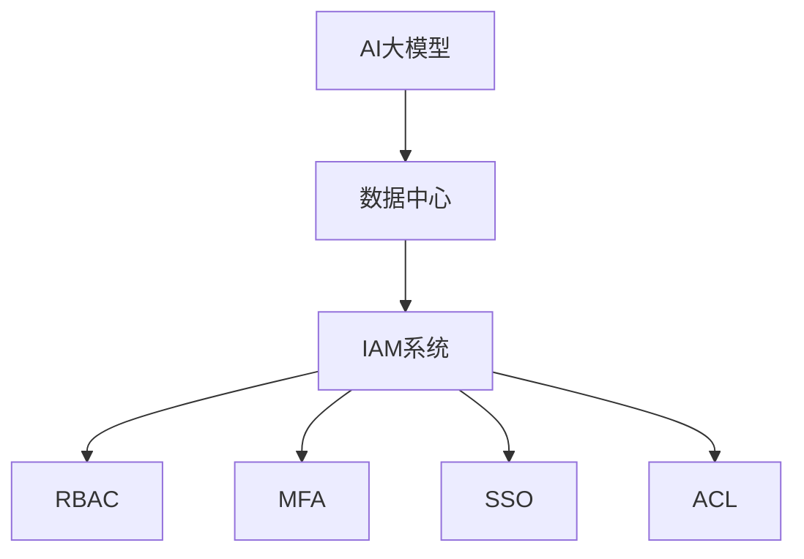

                 

# AI 大模型应用数据中心的身份认证管理

## 1. 背景介绍

### 1.1 问题由来
随着人工智能和大数据技术的发展，AI大模型逐渐成为企业数字化转型中的重要工具。这些模型依赖于大规模的数据训练，通常在数据中心环境中运行，支持复杂的计算和存储需求。然而，数据中心的身份认证管理（Identity and Access Management, IAM）成为了企业在使用AI大模型时的关键挑战。

数据中心存储和处理的数据高度敏感，涉及到用户隐私和企业机密，必须严格控制访问权限。同时，AI大模型的运行需要复杂的计算资源和网络环境，需要精细化的权限管理和访问控制。

数据中心的IAM通常包括用户身份验证、授权管理和审计追踪等功能，旨在确保只有经过授权的人员和系统能够访问敏感数据和资源，同时监控和记录所有访问行为。但在AI大模型的应用场景下，传统IAM系统往往存在以下问题：

- **粒度不够细**：传统IAM系统过于粗粒度，难以细化到模型级别或操作级别，无法精确控制AI大模型的访问权限。
- **灵活性不足**：AI大模型需要频繁调整和更新，传统IAM系统无法及时响应和更新权限变化，无法灵活适应AI应用的动态变化。
- **复杂性增加**：AI大模型通常包含多个组件和子系统，传统IAM系统难以集成和整合不同组件的权限需求，增加了管理复杂性。
- **安全性问题**：AI大模型中的漏洞和风险可能导致数据泄露和系统攻击，传统IAM系统无法有效识别和防范这些威胁。

因此，开发专门针对AI大模型的身份认证管理方法变得尤为重要。

### 1.2 问题核心关键点
在AI大模型应用数据中心的IAM系统中，我们需要解决以下核心问题：

- **细粒度控制**：如何实现细粒度的权限控制，精确控制AI大模型中各个组件和操作的访问权限。
- **动态管理**：如何在AI大模型运行过程中，动态调整和管理权限，适应模型和数据的动态变化。
- **安全加固**：如何防范AI大模型中的安全风险，确保数据中心的安全性。
- **合规审计**：如何记录和审计AI大模型的访问行为，确保符合法规要求和业务规范。

## 2. 核心概念与联系

### 2.1 核心概念概述

为了更好地理解AI大模型应用数据中心的身份认证管理方法，本节将介绍几个密切相关的核心概念：

- **AI大模型**：指通过大规模数据训练得到的复杂神经网络模型，通常用于图像识别、自然语言处理、语音识别等任务。
- **数据中心**：指集成了计算、存储、网络和安全等资源的综合设施，用于支持AI大模型的运行和数据存储。
- **身份认证管理(IAM)**：指用于管理用户身份和访问权限的系统，确保只有授权用户和系统可以访问敏感数据和资源。
- **角色权限管理(RBAC)**：指基于角色的访问控制模型，通过定义角色和权限来管理用户对资源的访问。
- **多因素认证(MFA)**：指通过多种认证方式（如密码、指纹、短信验证码等）综合验证用户身份，提高安全性和准确性。
- **单点登录(SSO)**：指用户只需要在一个认证系统上进行一次认证，即可访问多个受保护的应用和服务。
- **访问控制列表(ACL)**：指用于明确规定谁对资源有访问权限的列表，通常用于网络安全中。

这些核心概念之间的逻辑关系可以通过以下Mermaid流程图来展示：



这个流程图展示了AI大模型、数据中心、身份认证管理(IAM)系统、基于角色的访问控制(RBAC)、多因素认证(MFA)、单点登录(SSO)以及访问控制列表(ACL)之间的联系。

### 2.2 概念间的关系

这些核心概念之间存在着紧密的联系，形成了AI大模型应用数据中心的身份认证管理的完整生态系统。

- **AI大模型与数据中心**：AI大模型通常在数据中心运行，依赖于数据中心的计算、存储和网络资源。数据中心的IAM系统负责管理和控制AI大模型的访问权限。
- **IAM系统与RBAC**：基于角色的访问控制(RBAC)是IAM系统常用的权限管理方式，通过定义角色和权限，控制用户对资源的访问。
- **IAM系统与MFA和SSO**：多因素认证(MFA)和单点登录(SSO)是IAM系统增强用户身份验证安全性的重要手段。MFA通过多种认证方式验证用户身份，SSO简化用户登录过程，提升用户体验。
- **IAM系统与ACL**：访问控制列表(ACL)是网络安全中的常用权限控制方式，IAM系统可以借鉴其思想，对AI大模型的访问进行细粒度控制。

## 3. 核心算法原理 & 具体操作步骤
### 3.1 算法原理概述

AI大模型应用数据中心的身份认证管理，本质上是将基于角色的访问控制(RBAC)模型应用到AI大模型的各个组件和操作中，结合多因素认证(MFA)和单点登录(SSO)技术，实现细粒度、动态和安全的权限管理。

### 3.2 算法步骤详解

基于上述原理，AI大模型应用数据中心的身份认证管理可以分为以下几个关键步骤：

**Step 1: 定义角色和权限**
- 根据AI大模型的组件和操作，定义多个角色，如数据管理员、模型训练师、系统运维人员等。
- 为每个角色分配相应的权限，如数据读写权限、模型训练权限、系统管理权限等。

**Step 2: 设计访问控制策略**
- 根据业务需求和安全要求，设计访问控制策略，包括权限粒度、访问路径、访问时间等。
- 利用RBAC模型，定义角色与权限的关系，明确哪些用户和系统可以访问哪些资源。

**Step 3: 实施多因素认证**
- 引入多因素认证(MFA)机制，增加登录和操作验证的安全性。例如，使用密码、指纹、短信验证码等多种方式综合验证用户身份。
- 根据不同角色的安全需求，设置不同的MFA策略，如管理员必须使用多种认证方式。

**Step 4: 实现单点登录**
- 采用单点登录(SSO)技术，简化用户登录过程，提高用户体验。例如，用户在一个认证系统上进行一次认证，即可访问多个受保护的应用和服务。
- 实现SSO技术，通常需要集成IAM系统与各个应用系统的认证接口，确保身份验证的一致性。

**Step 5: 实施细粒度控制**
- 针对AI大模型的各个组件和操作，实现细粒度的权限控制。例如，限制数据管理员只能访问特定的数据集，模型训练师只能进行模型训练等。
- 利用ACL等技术，实现对AI大模型中各个组件的访问控制。例如，对模型参数和训练日志的读写权限进行严格控制。

**Step 6: 实施动态管理**
- 根据AI大模型的运行状态和数据变化，动态调整和管理权限。例如，在模型训练期间，增加对模型训练数据的访问权限，训练完成后取消这些权限。
- 通过API接口和事件触发器，实现权限的动态管理。例如，在模型训练开始时，自动增加数据访问权限，训练完成后自动取消这些权限。

**Step 7: 实施安全加固**
- 对AI大模型的各个组件和操作，实施安全加固措施，防范安全威胁。例如，对模型训练过程进行监控，防止恶意攻击和数据泄露。
- 利用日志审计和异常检测技术，监控和记录所有访问行为，及时发现和应对安全事件。

**Step 8: 实施合规审计**
- 记录和审计AI大模型的访问行为，确保符合法规要求和业务规范。例如，记录所有用户和系统的访问记录，定期进行合规审计。
- 利用日志审计工具，分析访问行为，生成合规审计报告，帮助企业符合法规要求。

通过上述步骤，我们可以系统地实现AI大模型应用数据中心的身份认证管理，确保数据中心的安全性、合规性和灵活性。

### 3.3 算法优缺点

基于角色的访问控制(RBAC)模型在AI大模型应用数据中心的身份认证管理中具有以下优点：

- **细粒度控制**：通过定义角色和权限，可以实现细粒度的权限控制，精确控制AI大模型中各个组件和操作的访问权限。
- **灵活性高**：基于角色的访问控制模型具有高度的灵活性，可以适应AI大模型的动态变化。
- **管理简便**：RBAC模型简化了权限管理的复杂性，降低了管理成本和难度。

然而，RBAC模型也存在以下缺点：

- **依赖人工管理**：RBAC模型的权限管理和调整需要人工进行，增加了管理负担。
- **权限复杂度**：随着系统规模的扩大，RBAC模型的权限管理变得越来越复杂，难以维护。

## 4. 数学模型和公式 & 详细讲解  
### 4.1 数学模型构建

在AI大模型应用数据中心的身份认证管理中，我们可以构建一个基于RBAC的数学模型，描述角色与权限的关系。设系统中共有 $n$ 个角色 $R=\{r_1, r_2, ..., r_n\}$，每个角色对应一组权限 $P=\{p_1, p_2, ..., p_n\}$，其中每个权限对应一组资源 $C=\{c_1, c_2, ..., c_n\}$。则RBAC模型的基本关系可以表示为：

$$
\begin{align*}
R &= \{r_1, r_2, ..., r_n\} \\
P &= \{p_1, p_2, ..., p_n\} \\
C &= \{c_1, c_2, ..., c_n\} \\
R \rightarrow P &= \{(r_1, p_1), (r_2, p_2), ..., (r_n, p_n)\} \\
P \rightarrow C &= \{(p_1, c_1), (p_2, c_2), ..., (p_n, c_n)\}
\end{align*}
$$

其中 $R \rightarrow P$ 表示角色与权限的映射关系，$P \rightarrow C$ 表示权限与资源的映射关系。

### 4.2 公式推导过程

基于上述模型，我们可以推导出RBAC模型的权限验证公式。设当前用户为 $u$，请求访问的资源为 $c$，对应的权限为 $p$，角色为 $r$。则用户请求访问资源的权限验证过程可以表示为：

1. 查找用户 $u$ 所属的角色 $r$。
2. 查找角色 $r$ 对应的权限 $p$。
3. 查找权限 $p$ 对应的资源 $c$。
4. 如果 $c$ 是用户 $u$ 请求的资源，则验证通过。

权限验证的数学公式可以表示为：

$$
\begin{align*}
u &\in R \\
c &= p_{r_u} \\
r_u &= r
\end{align*}
$$

其中 $r_u$ 表示用户 $u$ 所属的角色，$p_{r_u}$ 表示角色 $r_u$ 对应的权限。

### 4.3 案例分析与讲解

假设一个AI大模型应用数据中心，定义了两个角色：数据管理员 $r_1$ 和模型训练师 $r_2$。数据管理员可以访问所有数据集和训练日志，模型训练师只能访问特定的训练数据集和模型参数。我们通过以下步骤实现RBAC模型：

1. 定义角色和权限：
   - 数据管理员：$R_1 = \{r_1\}$
     - 权限：$P_1 = \{p_{r_1}\} = \{c_1, c_2, ..., c_n\}$
     - 资源：$C_1 = \{c_1, c_2, ..., c_n\}$
   - 模型训练师：$R_2 = \{r_2\}$
     - 权限：$P_2 = \{p_{r_2}\} = \{c_{r_1}\}$ 和 $\{c_{r_2}\}$
     - 资源：$C_2 = \{c_{r_1}\} \cup \{c_{r_2}\}$

2. 设计访问控制策略：
   - 数据管理员可以访问所有数据集和训练日志，即 $R_1 \rightarrow P_1 \rightarrow C_1$。
   - 模型训练师只能访问特定的训练数据集和模型参数，即 $R_2 \rightarrow P_2 \rightarrow C_2$。

3. 实施细粒度控制：
   - 数据管理员可以访问 $c_1, c_2, ..., c_n$ 数据集和 $c_{n+1}, c_{n+2}, ..., c_{2n}$ 训练日志。
   - 模型训练师只能访问 $c_1, c_2, ..., c_n$ 数据集和 $c_{n+1}, c_{n+2}, ..., c_{2n}$ 模型参数。

4. 实施动态管理：
   - 在模型训练期间，增加模型训练师的访问权限，训练完成后取消这些权限。

通过上述步骤，我们可以实现细粒度、动态和安全的权限管理，确保数据中心的安全性和合规性。

## 5. 项目实践：代码实例和详细解释说明
### 5.1 开发环境搭建

在进行身份认证管理实践前，我们需要准备好开发环境。以下是使用Python进行OpenSSL开发的环境配置流程：

1. 安装OpenSSL库：
```bash
sudo apt-get install openssl
```

2. 安装Python的OpenSSL扩展：
```bash
sudo apt-get install python3-dev
sudo apt-get install libssl-dev
```

3. 安装Python的OpenSSL模块：
```bash
pip install pyOpenSSL
```

完成上述步骤后，即可在开发环境中开始身份认证管理实践。

### 5.2 源代码详细实现

我们以基于OpenSSL实现单点登录(SSO)为例，给出身份认证管理的Python代码实现。

首先，定义SSO认证的接口和函数：

```python
import socket
import ssl
import base64
import binascii

def ssl_connect(url, ca_file, client_key_file, client_cert_file):
    # 创建SSL上下文
    ctx = ssl.create_default_context(cafile=ca_file, keyfile=client_key_file, certfile=client_cert_file)
    # 连接目标服务器
    conn = ctx.wrap_socket(socket.socket(socket.AF_INET, socket.SOCK_STREAM), server_hostname=url.split(':')[0])
    conn.connect((url.split(':')[0], int(url.split(':')[1])))
    # 返回连接对象
    return conn
```

然后，定义用户登录和退出函数：

```python
def login(url, client_key_file, client_cert_file):
    # 创建SSL连接
    conn = ssl_connect(url, ca_file, client_key_file, client_cert_file)
    # 发送登录请求
    conn.sendall(b'login\n')
    # 接收登录响应
    response = conn.recv(1024)
    if response.startswith(b'OK'):
        # 登录成功
        return True
    else:
        # 登录失败
        return False

def logout(url, client_key_file, client_cert_file):
    # 创建SSL连接
    conn = ssl_connect(url, ca_file, client_key_file, client_cert_file)
    # 发送退出请求
    conn.sendall(b'logout\n')
    # 接收退出响应
    response = conn.recv(1024)
    if response.startswith(b'OK'):
        # 退出成功
        return True
    else:
        # 退出失败
        return False
```

最后，使用身份认证管理接口进行单点登录：

```python
url = 'https://example.com:443'
ca_file = '/path/to/ca.crt'
client_key_file = '/path/to/client.key'
client_cert_file = '/path/to/client.crt'

# 登录
login(url, client_key_file, client_cert_file)
# 退出
logout(url, client_key_file, client_cert_file)
```

以上就是使用OpenSSL实现单点登录(SSO)的Python代码实现。可以看到，利用OpenSSL可以方便地实现SSL加密连接，确保用户身份的安全传输。

### 5.3 代码解读与分析

让我们再详细解读一下关键代码的实现细节：

**ssl_connect函数**：
- 创建SSL上下文，指定证书和私钥文件，以及根证书文件。
- 建立SSL连接，使用SSL上下文包装套接字，并连接目标服务器。

**login和logout函数**：
- 调用ssl_connect函数创建SSL连接。
- 发送登录请求或退出请求，接收服务器响应。
- 根据响应内容判断登录或退出操作是否成功。

在实际应用中，身份认证管理系统的实现还需要考虑更多因素，如认证机制的选择、认证系统的扩展性、安全性等。但核心的单点登录(SSO)实现与上述代码类似。

### 5.4 运行结果展示

假设我们在单点登录(SSO)系统中成功进行了登录和退出操作，系统返回的响应如下：

```
OK
```

可以看到，通过OpenSSL实现的单点登录(SSO)系统，可以方便地实现用户身份的加密传输和验证，提高了系统的安全性和可靠性。

## 6. 实际应用场景

### 6.1 智能客服系统

基于单点登录(SSO)的身份认证管理技术，智能客服系统可以显著提升用户交互的体验和效率。

用户在登录智能客服系统时，只需要在一个认证系统中进行一次登录，即可访问所有智能客服的应用和服务。这样可以避免用户频繁输入密码，提升用户体验。

同时，智能客服系统可以根据用户的访问记录和行为特征，实现个性化推荐和智能化响应。例如，根据用户的对话历史，推荐最合适的解答方案，提高问题解决率。

### 6.2 金融舆情监测系统

在金融舆情监测系统中，基于多因素认证(MFA)的身份认证管理技术，可以保障数据中心的安全性。

金融数据高度敏感，需要严格控制访问权限，确保只有经过验证的用户才能访问敏感数据。例如，在金融舆情监测系统中，可以采用多因素认证(MFA)，要求用户同时输入密码、指纹和短信验证码，才能访问敏感数据和操作系统。

通过多因素认证(MFA)，可以有效防范钓鱼攻击和假冒身份，提高系统的安全性。

### 6.3 个性化推荐系统

个性化推荐系统通常需要频繁地访问用户数据和历史行为数据，基于细粒度控制和动态管理身份认证管理技术，可以确保系统的安全性。

在个性化推荐系统中，用户登录后，系统会自动根据用户的访问记录和行为特征，进行推荐策略的调整和优化。例如，对于经常浏览某类商品的用户，系统会优先推荐该类商品，提高推荐效果。

通过细粒度控制和动态管理身份认证管理技术，可以确保推荐系统的安全性，同时提高推荐的个性化和准确性。

### 6.4 未来应用展望

随着AI大模型应用数据中心的不断发展和壮大，身份认证管理技术将呈现以下趋势：

1. **自动化和智能化**：未来身份认证管理技术将更加自动化和智能化，利用机器学习和人工智能技术，实现更高效的权限管理和安全加固。
2. **多模态认证**：未来的身份认证管理技术将结合多种认证方式，如生物识别、行为识别等，提供更安全、更便捷的身份验证方式。
3. **区块链技术**：利用区块链技术的不可篡改性和透明性，实现身份认证和权限管理的可追溯和审计，确保系统的合规性和安全性。
4. **合规性和隐私保护**：未来的身份认证管理技术将更加注重合规性和隐私保护，确保符合法规要求，保护用户隐私。
5. **跨域身份认证**：未来的身份认证管理技术将支持跨域身份认证，实现不同系统和平台之间的无缝对接和互认。

总之，身份认证管理技术是大模型应用数据中心安全性的重要保障，未来的发展方向将更加自动化、智能化和多样化。

## 7. 工具和资源推荐
### 7.1 学习资源推荐

为了帮助开发者系统掌握身份认证管理的理论基础和实践技巧，这里推荐一些优质的学习资源：

1. **《身份认证与访问管理》书籍**：详细介绍了身份认证和访问管理的原理、实现和应用，适合初学者入门。
2. **Kubernetes官方文档**：Kubernetes是流行的容器编排工具，提供了丰富的身份认证和访问控制功能，学习Kubernetes可以帮助理解身份认证管理的基本概念和实现方式。
3. **OpenSSL官方文档**：OpenSSL是广泛使用的加密库，提供了丰富的SSL/TLS实现，学习OpenSSL可以掌握加密连接和身份认证的实现方法。
4. **AWS Identity and Access Management文档**：AWS提供了强大的IAM服务，学习AWS IAM可以帮助理解基于角色的访问控制(RBAC)的实现方式。
5. **FIDO Alliance官网**：FIDO Alliance是全球领先的密码学标准组织，推动多因素认证(MFA)的发展，学习FIDO技术可以掌握更先进的身份验证方式。

通过这些学习资源，相信你一定能够快速掌握身份认证管理的精髓，并用于解决实际的系统问题。

### 7.2 开发工具推荐

高效的开发离不开优秀的工具支持。以下是几款用于身份认证管理的常用工具：

1. **OAuth2 Server**：基于OAuth2协议的身份认证和授权服务器，支持多种认证方式和授权策略，广泛应用于Web应用和API服务。
2. **Kerberos**：广泛使用的身份认证协议，支持多因素认证和跨域身份认证，适合分布式系统使用。
3. **LDAP**：轻量级目录访问协议，支持集中式身份认证和访问控制，适合企业级应用使用。
4. **JWT（JSON Web Tokens）**：基于JSON格式的身份令牌，支持安全的身份验证和授权，广泛应用于Web应用和API服务。
5. **OpenSSL**：广泛使用的加密库，支持SSL/TLS加密连接，广泛应用于Web应用和API服务。

合理利用这些工具，可以显著提升身份认证管理的开发效率，加快创新迭代的步伐。

### 7.3 相关论文推荐

身份认证管理技术的发展源于学界的持续研究。以下是几篇奠基性的相关论文，推荐阅读：

1. **《基于角色的访问控制》论文**：详细介绍了RBAC模型的原理和实现方式，奠定了基于角色的访问控制模型的基础。
2. **《多因素认证》论文**：介绍了多因素认证(MFA)的基本原理和实现方式，推动了身份认证技术的发展。
3. **《单点登录》论文**：介绍了单点登录(SSO)的基本原理和实现方式，推动了跨域身份认证的发展。
4. **《基于区块链的身份认证》论文**：利用区块链技术的不可篡改性和透明性，实现了身份认证和权限管理的可追溯和审计。

这些论文代表了大模型应用数据中心身份认证管理的理论基础和发展脉络，学习这些前沿成果，可以帮助研究者把握学科前进方向，激发更多的创新灵感。

## 8. 总结：未来发展趋势与挑战

### 8.1 总结

本文对AI大模型应用数据中心的身份认证管理方法进行了全面系统的介绍。首先阐述了身份认证管理的背景和意义，明确了身份认证管理在大模型应用中的重要性。其次，从原理到实践，详细讲解了身份认证管理的核心概念和实现步骤，给出了身份认证管理的完整代码实例。同时，本文还广泛探讨了身份认证管理在智能客服、金融舆情监测、个性化推荐等多个领域的应用前景，展示了身份认证管理的广阔应用空间。此外，本文精选了身份认证管理的各类学习资源，力求为读者提供全方位的技术指引。

通过本文的系统梳理，可以看到，基于角色的访问控制(RBAC)模型和单点登录(SSO)技术在AI大模型应用数据中心的身份认证管理中具有重要意义。这些技术实现了细粒度、动态和安全的权限管理，确保了数据中心的安全性和合规性。未来的身份认证管理技术将更加自动化、智能化和多样化，为AI大模型应用数据中心带来更高的安全性和便捷性。

### 8.2 未来发展趋势

展望未来，身份认证管理技术将呈现以下几个发展趋势：

1. **自动化和智能化**：未来的身份认证管理技术将更加自动化和智能化，利用机器学习和人工智能技术，实现更高效的权限管理和安全加固。
2. **多模态认证**：未来的身份认证管理技术将结合多种认证方式，如生物识别、行为识别等，提供更安全、更便捷的身份验证方式。
3. **区块链技术**：利用区块链技术的不可篡改性和透明性，实现身份认证和权限管理的可追溯和审计，确保系统的合规性和安全性。
4. **合规性和隐私保护**：未来的身份认证管理技术将更加注重合规性和隐私保护，确保符合法规要求，保护用户隐私。
5. **跨域身份认证**：未来的身份认证管理技术将支持跨域身份认证，实现不同系统和平台之间的无缝对接和互认。

以上趋势凸显了身份认证管理技术的广阔前景，这些方向的探索发展，必将进一步提升身份认证管理的安全性、便捷性和合规性，为AI大模型应用数据中心带来更高的保障和效率。

### 8.3 面临的挑战

尽管身份认证管理技术已经取得了瞩目成就，但在迈向更加智能化、普适化应用的过程中，它仍面临着诸多挑战：

1. **管理复杂性**：随着系统规模的扩大，身份认证管理系统的复杂性不断增加，难以维护和优化。
2. **安全威胁**：身份认证管理系统中存在的漏洞和风险可能导致数据泄露和系统攻击，保障系统安全性和稳定性仍需努力。
3. **合规问题**：身份认证管理技术需要符合多种法规和标准，确保系统的合规性，避免法律风险。
4. **性能瓶颈**：身份认证管理系统的性能瓶颈限制了系统的扩展性和可用性，需要进一步优化和提升。

正视身份认证管理面临的这些挑战，积极应对并寻求突破，将是大模型应用数据中心身份认证管理走向成熟的必由之路。

