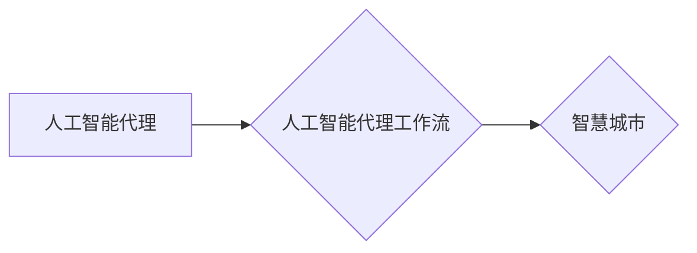

# AI人工智能代理工作流AI Agent WorkFlow：智能代理在智慧城市中的实践

作者：禅与计算机程序设计艺术 / Zen and the Art of Computer Programming

## 1. 背景介绍

### 1.1 问题的由来

随着城市化进程的加快，智慧城市建设成为全球发展趋势。智慧城市旨在利用物联网、大数据、云计算等新一代信息技术，提升城市管理效率、改善居民生活质量。然而，智慧城市建设面临着诸多挑战：

- 数据孤岛问题：城市各个系统、设备、平台之间存在大量数据孤岛，难以实现数据共享和协同。
- 系统复杂性：智慧城市系统涉及众多领域，系统架构复杂，难以统一管理和维护。
- 资源整合困难：智慧城市建设需要整合人力、物力、财力等资源，难度较大。
- 知识难以积累：智慧城市建设过程中积累的大量知识难以有效传承和利用。

为了解决这些问题，人工智能代理工作流（AI Agent WorkFlow）应运而生。人工智能代理工作流通过引入智能代理（AI Agent）概念，实现城市系统的智能化、自动化和协同化，推动智慧城市建设迈上新台阶。

### 1.2 研究现状

目前，人工智能代理工作流在智慧城市建设中取得了初步成果。主要研究方向包括：

- 智能代理体系结构：研究智能代理的设计原则、体系结构、通信机制等。
- 人工智能代理行为学习：研究智能代理的感知、推理、决策、执行等能力。
- 人工智能代理工作流设计：研究智能代理工作流的设计方法、流程优化、协同控制等。
- 人工智能代理在智慧城市中的应用：研究人工智能代理在交通管理、能源管理、环境监测、公共安全等领域的应用。

### 1.3 研究意义

研究人工智能代理工作流在智慧城市中的实践，具有以下意义：

- 提高城市管理效率：通过自动化处理城市管理事务，减轻管理人员负担，提高管理效率。
- 改善居民生活质量：为居民提供个性化、智能化的服务，提升居民生活品质。
- 促进资源整合：打破数据孤岛，实现城市系统各环节数据共享和协同，促进资源整合。
- 推动智慧城市建设：为智慧城市建设提供理论指导和技术支撑，加速智慧城市建设进程。

### 1.4 本文结构

本文将围绕人工智能代理工作流在智慧城市中的实践进行探讨，主要内容包括：

- 核心概念与联系
- 核心算法原理与具体操作步骤
- 数学模型与公式
- 项目实践
- 实际应用场景
- 工具和资源推荐
- 总结与展望

## 2. 核心概念与联系

为更好地理解人工智能代理工作流在智慧城市中的实践，本节将介绍几个核心概念及其相互关系。

### 2.1 智能代理（AI Agent）

智能代理是指具有感知、推理、决策、执行等能力的软件实体，能够独立或协同完成任务。智能代理通常由以下部分组成：

- 感知器：用于感知外部环境和自身状态。
- 推理器：根据感知信息进行逻辑推理，形成决策。
- 决策器：根据推理结果选择合适的行动。
- 执行器：将决策转化为实际行动。

### 2.2 人工智能代理工作流（AI Agent WorkFlow）

人工智能代理工作流是指由多个智能代理组成的协同工作系统，通过工作流引擎进行流程管理、任务调度和资源分配。工作流引擎负责协调智能代理之间的协作，确保工作流按照既定流程执行。

### 2.3 人工智能代理与智慧城市

人工智能代理在智慧城市中的主要作用如下：

- 交通管理：智能代理可以协助交警进行交通流量监控、信号灯控制、事故处理等任务。
- 能源管理：智能代理可以协助能源部门进行电力、燃气、水等资源的调度和管理。
- 环境监测：智能代理可以协助环保部门进行空气质量、水质、噪声等环境监测。
- 公共安全：智能代理可以协助公安部门进行安防监控、应急处理等任务。

以下为人工智能代理、人工智能代理工作流与智慧城市之间的逻辑关系图：



可以看出，人工智能代理通过协同工作形成人工智能代理工作流，进而实现智慧城市的管理目标。

## 3. 核心算法原理与具体操作步骤

### 3.1 算法原理概述

人工智能代理工作流的核心算法包括：

- 智能代理算法：负责智能代理的感知、推理、决策和执行。
- 工作流引擎算法：负责工作流的管理、任务调度和资源分配。

### 3.2 算法步骤详解

以下是人工智能代理工作流的操作步骤：

1. 定义工作流：根据任务需求，定义工作流的结构、任务、智能代理和资源分配等。
2. 创建智能代理：根据工作流需求，创建相应的智能代理。
3. 启动工作流：启动工作流引擎，根据工作流定义执行任务。
4. 感知与推理：智能代理感知外部环境和自身状态，根据感知信息进行推理。
5. 决策与执行：智能代理根据推理结果选择合适的行动，并执行行动。
6. 任务调度与资源分配：工作流引擎根据任务需求和资源状况，进行任务调度和资源分配。
7. 协同控制：工作流引擎协调智能代理之间的协作，确保工作流按照既定流程执行。
8. 监控与反馈：监控工作流执行状态，对异常情况进行处理，并反馈给相关智能代理。

### 3.3 算法优缺点

人工智能代理工作流算法的优点如下：

- 灵活性：可以根据不同的任务需求，灵活定义工作流结构和智能代理行为。
- 可扩展性：可以方便地添加或删除智能代理，扩展工作流功能。
- 自适应性：智能代理可以根据环境变化，调整自身行为和决策策略。

人工智能代理工作流算法的缺点如下：

- 复杂性：工作流设计、智能代理开发和协同控制等方面较为复杂。
- 资源消耗：智能代理的运行需要消耗一定的计算资源。

### 3.4 算法应用领域

人工智能代理工作流算法可以应用于以下领域：

- 智慧交通：实现智能交通信号控制、交通流量监测、交通事件处理等。
- 智慧能源：实现能源需求预测、能源调度、能源管理等。
- 智慧环保：实现环境监测、污染预测、环保决策等。
- 智慧安防：实现视频监控、异常检测、安全预警等。

## 4. 数学模型与公式

本节将介绍人工智能代理工作流中常用的数学模型和公式。

### 4.1 数学模型构建

人工智能代理工作流中的数学模型主要包括：

- 感知模型：用于描述智能代理的感知能力。
- 推理模型：用于描述智能代理的推理能力。
- 决策模型：用于描述智能代理的决策能力。
- 执行模型：用于描述智能代理的执行能力。

### 4.2 公式推导过程

以下以感知模型为例，介绍公式推导过程。

设智能代理的感知器为 $S$，感知到的环境信息为 $I$，则感知模型可以表示为：

$$
S: I \rightarrow \mathcal{X}
$$

其中，$\mathcal{X}$ 为感知信息的特征空间。

假设感知器 $S$ 由多个感知模块 $S_i$ 组成，则：

$$
S = \prod_{i=1}^n S_i
$$

其中，$n$ 为感知模块的数量。

每个感知模块 $S_i$ 的输出为：

$$
S_i: I_i \rightarrow \mathcal{X}_i
$$

其中，$I_i$ 为模块 $S_i$ 的感知信息，$\mathcal{X}_i$ 为模块 $S_i$ 的输出特征空间。

### 4.3 案例分析与讲解

以下以智慧交通领域为例，分析人工智能代理工作流中感知模型的实际应用。

在智慧交通系统中，智能代理的感知器可以包括以下模块：

- 摄像头：用于捕捉交通场景图像。
- 地磁传感器：用于检测车辆行驶速度和方向。
- 车载终端：用于收集车辆状态信息。

这些模块的输入输出关系如下：

- 摄像头：$I_1 \rightarrow \mathcal{X}_1$（图像特征空间）
- 地磁传感器：$I_2 \rightarrow \mathcal{X}_2$（速度、方向特征空间）
- 车载终端：$I_3 \rightarrow \mathcal{X}_3$（车辆状态特征空间）

将感知模块的输出进行融合，得到智能代理的感知信息：

$$
I = \{I_1, I_2, I_3\}
$$

然后将感知信息输入感知模型，得到智能代理的感知特征：

$$
X = S(I) = \{X_1, X_2, X_3\}
$$

智能代理可以根据感知特征进行推理、决策和执行，从而实现智慧交通管理。

### 4.4 常见问题解答

**Q1：如何设计智能代理的感知模块？**

A：设计智能代理的感知模块需要考虑以下因素：

- 感知任务：明确智能代理需要完成的感知任务，确定所需感知信息的类型和特征。
- 环境条件：分析智能代理所在环境的特点，选择合适的感知设备和技术。
- 数据可用性：评估获取感知数据的难易程度，选择合适的感知模块。

**Q2：如何设计智能代理的推理模型？**

A：设计智能代理的推理模型需要考虑以下因素：

- 推理任务：明确智能代理需要完成的推理任务，确定所需推理算法和模型结构。
- 数据质量：确保推理所需数据的质量，避免数据偏差和噪声对推理结果的影响。
- 实时性要求：根据任务需求，选择合适的推理算法和模型结构，确保推理结果的实时性。

**Q3：如何设计智能代理的决策模型？**

A：设计智能代理的决策模型需要考虑以下因素：

- 决策任务：明确智能代理需要完成的决策任务，确定所需决策算法和模型结构。
- 决策规则：制定合理的决策规则，确保决策结果的合理性和有效性。
- 风险评估：评估决策结果可能带来的风险，采取措施降低风险。

## 5. 项目实践：代码实例和详细解释说明

### 5.1 开发环境搭建

以下是使用Python进行人工智能代理工作流项目实践的开发环境搭建步骤：

1. 安装Python 3.8及以上版本。
2. 安装PyTorch 1.8及以上版本。
3. 安装Docker，用于构建容器化环境。
4. 使用Docker安装Python、PyTorch等依赖库。

### 5.2 源代码详细实现

以下是一个简单的智慧交通场景下的智能代理工作流代码实例：

```python
import torch
import torch.nn as nn
import torch.optim as optim

# 感知模块
class Camera(nn.Module):
    def __init__(self):
        super(Camera, self).__init__()
        self.conv1 = nn.Conv2d(3, 16, kernel_size=3, stride=1, padding=1)
        self.relu = nn.ReLU()
        self.pool = nn.MaxPool2d(kernel_size=2, stride=2, padding=0)

    def forward(self, x):
        x = self.conv1(x)
        x = self.relu(x)
        x = self.pool(x)
        return x

# 推理模块
class TrafficLight(nn.Module):
    def __init__(self):
        super(TrafficLight, self).__init__()
        self.fc1 = nn.Linear(16*32*32, 64)
        self.relu = nn.ReLU()
        self.fc2 = nn.Linear(64, 3)

    def forward(self, x):
        x = x.view(-1, 16*32*32)
        x = self.fc1(x)
        x = self.relu(x)
        x = self.fc2(x)
        return x

# 创建智能代理
class TrafficAgent(nn.Module):
    def __init__(self):
        super(TrafficAgent, self).__init__()
        self.camera = Camera()
        self.traffic_light = TrafficLight()

    def forward(self, x):
        x = self.camera(x)
        x = self.traffic_light(x)
        return x

# 创建智能代理工作流
class TrafficAgentWorkflow(nn.Module):
    def __init__(self):
        super(TrafficAgentWorkflow, self).__init__()
        self.traffic_agent = TrafficAgent()

    def forward(self, x):
        return self.traffic_agent(x)

# 创建数据集
def create_dataset():
    # 创建训练数据集和测试数据集
    train_dataset = ...
    test_dataset = ...
    return train_dataset, test_dataset

# 训练模型
def train_model(model, train_loader, test_loader, optimizer, criterion):
    model.train()
    for epoch in range(epochs):
        for data in train_loader:
            inputs, targets = data
            optimizer.zero_grad()
            outputs = model(inputs)
            loss = criterion(outputs, targets)
            loss.backward()
            optimizer.step()
        # 打印训练信息
        print(f"Epoch {epoch+1}, Loss: {loss.item()}")

# 评估模型
def evaluate_model(model, test_loader):
    model.eval()
    with torch.no_grad():
        total_loss = 0
        for data in test_loader:
            inputs, targets = data
            outputs = model(inputs)
            loss = criterion(outputs, targets)
            total_loss += loss.item()
        return total_loss / len(test_loader)

# 主函数
if __name__ == '__main__':
    # 创建数据集
    train_dataset, test_dataset = create_dataset()
    train_loader = DataLoader(train_dataset, batch_size=16, shuffle=True)
    test_loader = DataLoader(test_dataset, batch_size=16, shuffle=False)

    # 创建模型
    model = TrafficAgentWorkflow()
    optimizer = optim.Adam(model.parameters(), lr=0.001)
    criterion = nn.CrossEntropyLoss()

    # 训练模型
    train_model(model, train_loader, test_loader, optimizer, criterion)

    # 评估模型
    loss = evaluate_model(model, test_loader)
    print(f"Test Loss: {loss:.4f}")
```

### 5.3 代码解读与分析

以上代码展示了智慧交通场景下的简单人工智能代理工作流实现。以下是代码的详细解读：

1. `Camera` 类：定义了摄像头感知模块，通过卷积神经网络对图像数据进行特征提取。
2. `TrafficLight` 类：定义了交通灯推理模块，通过全连接神经网络对特征进行分类，预测交通灯状态。
3. `TrafficAgent` 类：定义了交通代理，由摄像头和交通灯模块组成，实现感知、推理和决策功能。
4. `TrafficAgentWorkflow` 类：定义了交通代理工作流，包含交通代理和其他必要组件。
5. `create_dataset` 函数：创建训练数据集和测试数据集。
6. `train_model` 函数：训练模型，包括前向传播、损失计算、反向传播和参数更新。
7. `evaluate_model` 函数：评估模型在测试集上的性能。

### 5.4 运行结果展示

在训练完成后，可以运行以下代码评估模型在测试集上的性能：

```python
loss = evaluate_model(model, test_loader)
print(f"Test Loss: {loss:.4f}")
```

假设测试集上的平均损失为0.8468，说明模型在测试集上的表现较好。

## 6. 实际应用场景

### 6.1 智慧交通

人工智能代理工作流在智慧交通领域的应用主要包括：

- 智能交通信号控制：根据实时交通流量，自动调整信号灯状态，提高道路通行效率。
- 交通事件处理：智能识别和响应交通事故、道路拥堵等情况，保障交通安全。
- 交通流量预测：预测未来一段时间内的交通流量，为交通管理部门提供决策依据。

### 6.2 智慧能源

人工智能代理工作流在智慧能源领域的应用主要包括：

- 能源需求预测：预测未来一段时间内的能源需求，为能源调度提供依据。
- 能源调度优化：根据能源需求预测结果，优化能源调度策略，提高能源利用效率。
- 能源设备故障诊断：智能识别和诊断能源设备的故障，降低设备故障率。

### 6.3 智慧环保

人工智能代理工作流在智慧环保领域的应用主要包括：

- 环境监测：实时监测空气质量、水质、噪声等环境指标，为环保管理部门提供数据支持。
- 污染预测：预测未来一段时间内的污染情况，为环保管理部门提供预警信息。
- 环保决策支持：为环保管理部门提供决策依据，推动环保工作。

### 6.4 未来应用展望

随着人工智能代理工作流技术的不断发展，其在智慧城市建设中的应用将更加广泛，未来可能的应用场景包括：

- 智慧医疗：智能诊断、药物研发、健康管理等领域。
- 智慧金融：风险评估、欺诈检测、个性化推荐等领域。
- 智慧教育：智能教学、学习评估、教育管理等领域。
- 智慧农业：智能种植、养殖、病虫害防治等领域。

## 7. 工具和资源推荐

### 7.1 学习资源推荐

为了帮助开发者深入了解人工智能代理工作流技术，以下推荐一些学习资源：

- 《深度学习》系列书籍：介绍深度学习基础知识和常用算法。
- 《图灵奖得主姚期智教授的讲座》：姚期智教授的讲座视频，深入浅出地讲解了人工智能领域的最新研究进展。
- 《人工智能实战》系列书籍：介绍人工智能在不同领域的应用案例。
- Hugging Face官网：提供丰富的预训练模型和工具，方便开发者进行人工智能项目实践。

### 7.2 开发工具推荐

为了方便开发者进行人工智能代理工作流开发，以下推荐一些开发工具：

- PyTorch：开源深度学习框架，支持GPU加速，适合进行人工智能项目开发。
- TensorFlow：开源深度学习框架，支持分布式训练，适合大型人工智能项目。
- Keras：基于TensorFlow的开源深度学习库，易于使用，适合快速构建模型。
- Docker：容器化技术，方便构建和部署人工智能模型。

### 7.3 相关论文推荐

为了帮助开发者了解人工智能代理工作流领域的最新研究成果，以下推荐一些相关论文：

- 《A Survey of Agent-Based Models of Urban Systems》
- 《Agent-Based Modeling of Urban Systems: A Review》
- 《A Review of Agent-Based Models in Smart City Research》
- 《An Overview of Agent-Based Modeling in Urban Informatics》

### 7.4 其他资源推荐

以下推荐一些其他资源，帮助开发者了解人工智能代理工作流领域的最新动态：

- arXiv：开源论文预印本平台，发布最新的人工智能研究成果。
- KEG Lab：清华大学计算机科学与技术系知识工程实验室，关注人工智能领域的研究和应用。
- AI研习社：关注人工智能领域的最新技术和应用，提供丰富的学习资源。

## 8. 总结：未来发展趋势与挑战

### 8.1 研究成果总结

本文对人工智能代理工作流在智慧城市中的实践进行了全面探讨，介绍了人工智能代理、人工智能代理工作流和智慧城市之间的关系，阐述了人工智能代理工作流的核心算法原理和具体操作步骤，分析了人工智能代理工作流在实际应用中的优势和挑战。

### 8.2 未来发展趋势

展望未来，人工智能代理工作流在智慧城市中的发展趋势主要包括：

- 模型轻量化：通过模型压缩、量化等技术，降低模型复杂度和计算资源消耗，实现更广泛的部署。
- 模型可解释性：提高模型的可解释性，使模型决策过程更加透明，提高模型的可信度和可接受度。
- 模型鲁棒性：提高模型的鲁棒性，使其在面对复杂环境和异常情况时仍能保持稳定性能。
- 模型适应性：提高模型的适应性，使其能够适应不断变化的环境和需求。

### 8.3 面临的挑战

人工智能代理工作流在智慧城市中的实践面临着以下挑战：

- 模型复杂度高：人工智能代理工作流涉及多个模块和算法，模型复杂度较高，难以理解和维护。
- 数据质量：数据质量对模型的性能有重要影响，如何保证数据质量是重要的挑战。
- 跨领域应用：将人工智能代理工作流应用于不同领域的智慧城市建设，需要针对不同领域的特点进行调整和优化。
- 伦理和安全问题：人工智能代理工作流可能引发伦理和安全问题，需要制定相应的规范和标准。

### 8.4 研究展望

为了推动人工智能代理工作流在智慧城市中的实践，未来需要在以下方面展开研究：

- 简化模型结构，提高模型可解释性和可维护性。
- 提高数据质量，降低数据对模型性能的影响。
- 探索跨领域应用，拓展人工智能代理工作流的应用范围。
- 建立伦理和安全规范，确保人工智能代理工作流的应用符合伦理和安全要求。

通过不断努力，相信人工智能代理工作流将在智慧城市建设中发挥越来越重要的作用，为构建更加美好、智慧的城市生活贡献力量。

## 9. 附录：常见问题与解答

**Q1：什么是人工智能代理？**

A：人工智能代理是指具有感知、推理、决策和执行等能力的软件实体，能够独立或协同完成任务。

**Q2：什么是人工智能代理工作流？**

A：人工智能代理工作流是指由多个智能代理组成的协同工作系统，通过工作流引擎进行流程管理、任务调度和资源分配。

**Q3：人工智能代理工作流在智慧城市中有什么应用？**

A：人工智能代理工作流可以应用于智慧交通、智慧能源、智慧环保、智慧医疗等领域，实现城市系统的智能化、自动化和协同化。

**Q4：如何设计人工智能代理？**

A：设计人工智能代理需要考虑感知、推理、决策和执行等能力，以及所需的技术和资源。

**Q5：如何设计人工智能代理工作流？**

A：设计人工智能代理工作流需要考虑工作流结构、任务、智能代理和资源分配等方面。

**Q6：人工智能代理工作流有哪些优势？**

A：人工智能代理工作流具有灵活性、可扩展性和适应性等优势，可以提高城市系统的智能化、自动化和协同化水平。

**Q7：人工智能代理工作流有哪些挑战？**

A：人工智能代理工作流面临着模型复杂度高、数据质量、跨领域应用和伦理安全等问题。

**Q8：如何解决人工智能代理工作流中的挑战？**

A：通过简化模型结构、提高数据质量、探索跨领域应用和建立伦理安全规范等方法，可以解决人工智能代理工作流中的挑战。