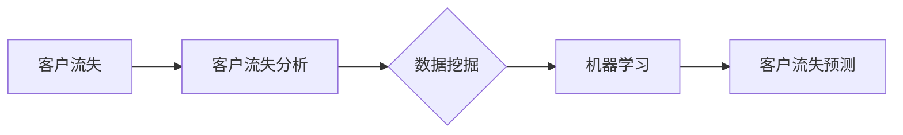

# 电信运营商客户流失分析与预测

## 1. 背景介绍

### 1.1 问题的由来

在当今竞争激烈的电信市场中，客户流失已成为电信运营商面临的主要挑战之一。获取新客户的成本远高于留住现有客户，因此，了解客户流失的原因并采取有效措施来预测和防止客户流失对于电信运营商来说至关重要。

### 1.2 研究现状

近年来，机器学习和数据挖掘技术在客户流失分析和预测领域得到了广泛应用。研究人员和从业者已经开发了各种模型和算法，例如逻辑回归、支持向量机、决策树和神经网络，用于识别潜在的流失客户。

### 1.3 研究意义

客户流失分析和预测的研究具有重要的现实意义：

* **降低运营成本:** 通过预测哪些客户可能会流失，电信运营商可以采取有针对性的措施来留住这些客户，从而降低客户获取成本。
* **提高客户满意度:** 通过识别和解决导致客户流失的因素，电信运营商可以提高客户满意度和忠诚度。
* **增加收入:** 留住现有客户可以为电信运营商带来持续的收入。

### 1.4 本文结构

本文将深入探讨电信运营商客户流失分析与预测的方法和技术。文章结构如下：

* **第 2 部分** 介绍了客户流失分析和预测的核心概念和联系。
* **第 3 部分** 详细介绍了常用的客户流失预测算法，包括算法原理、步骤、优缺点和应用领域。
* **第 4 部分** 介绍了客户流失预测的数学模型和公式，并通过案例分析和讲解帮助读者理解。
* **第 5 部分** 提供了一个完整的项目实践案例，包括代码实例和详细解释说明。
* **第 6 部分** 探讨了客户流失分析和预测的实际应用场景。
* **第 7 部分** 推荐了一些学习资源、开发工具和相关论文。
* **第 8 部分** 对客户流失分析和预测的未来发展趋势和挑战进行了展望。
* **第 9 部分** 提供了一些常见问题与解答。

## 2. 核心概念与联系

### 2.1 客户流失

客户流失是指客户停止使用某个企业或组织提供的产品或服务。在电信行业，客户流失通常指用户注销电话号码或转网到其他运营商。

### 2.2 客户流失分析

客户流失分析是指对客户流失的原因、模式和趋势进行深入研究的过程。通过分析历史数据，可以识别出导致客户流失的关键因素，例如服务质量、价格、竞争对手活动等。

### 2.3 客户流失预测

客户流失预测是指利用历史数据和机器学习算法来预测哪些客户在未来可能会流失。准确的预测可以帮助电信运营商采取预防措施，降低客户流失率。

### 2.4 数据挖掘

数据挖掘是从大型数据集中提取有用信息的过程。在客户流失分析和预测中，数据挖掘技术可以用来识别隐藏的模式、关系和趋势。

### 2.5 机器学习

机器学习是一种人工智能，它使计算机能够在没有明确编程的情况下从数据中学习。在客户流失分析和预测中，机器学习算法可以用来构建预测模型。

### 2.6 核心概念之间的联系

下图展示了客户流失分析、预测、数据挖掘和机器学习之间的关系：



## 3. 核心算法原理 & 具体操作步骤

### 3.1 算法原理概述

本节将介绍几种常用的客户流失预测算法，包括逻辑回归、支持向量机、决策树和神经网络。

#### 3.1.1 逻辑回归

逻辑回归是一种用于预测二元结果（例如，客户是否会流失）的统计模型。它使用逻辑函数来估计事件发生的概率。

#### 3.1.2 支持向量机

支持向量机是一种监督学习模型，可用于分类和回归分析。它通过在高维空间中找到一个最优超平面来分离不同类别的数据点。

#### 3.1.3 决策树

决策树是一种树形结构，它根据一系列规则对数据进行分类。每个节点代表一个属性，每个分支代表一个规则，每个叶节点代表一个类别。

#### 3.1.4 神经网络

神经网络是一种模仿人脑结构和功能的计算模型。它由多个相互连接的节点（神经元）组成，这些节点可以学习输入数据和输出数据之间的复杂关系。

### 3.2 算法步骤详解

#### 3.2.1 逻辑回归

1. **数据准备:** 收集和清理历史客户数据，包括客户属性、服务使用情况和流失标签。
2. **特征工程:** 从原始数据中提取有意义的特征，例如客户的生命周期价值、最近一次服务的使用时间等。
3. **模型训练:** 使用训练数据训练逻辑回归模型，找到最佳的参数值。
4. **模型评估:** 使用测试数据评估模型的性能，例如准确率、精确率和召回率。
5. **模型部署:** 将训练好的模型部署到生产环境中，用于预测新的客户流失概率。

#### 3.2.2 支持向量机

1. **数据准备:** 与逻辑回归类似。
2. **特征工程:** 与逻辑回归类似。
3. **模型训练:** 使用训练数据训练支持向量机模型，找到最优的超平面。
4. **模型评估:** 与逻辑回归类似。
5. **模型部署:** 与逻辑回归类似。

#### 3.2.3 决策树

1. **数据准备:** 与逻辑回归类似。
2. **特征工程:** 与逻辑回归类似。
3. **模型训练:** 使用训练数据构建决策树模型，选择最佳的属性和规则。
4. **模型评估:** 与逻辑回归类似。
5. **模型部署:** 与逻辑回归类似。

#### 3.2.4 神经网络

1. **数据准备:** 与逻辑回归类似。
2. **特征工程:** 与逻辑回归类似。
3. **模型训练:** 使用训练数据训练神经网络模型，调整网络的权重和偏差。
4. **模型评估:** 与逻辑回归类似。
5. **模型部署:** 与逻辑回归类似。

### 3.3 算法优缺点

| 算法 | 优点 | 缺点 |
|---|---|---|
| 逻辑回归 | 简单易懂、易于实现 | 对于非线性关系的拟合能力有限 |
| 支持向量机 | 对于高维数据和非线性关系具有良好的性能 | 计算复杂度高 |
| 决策树 | 易于理解和解释 | 容易过拟合 |
| 神经网络 | 对于复杂关系具有强大的拟合能力 | 需要大量的训练数据，容易过拟合 |

### 3.4 算法应用领域

| 算法 | 应用领域 |
|---|---|
| 逻辑回归 | 信用评分、医疗诊断 |
| 支持向量机 | 图像识别、文本分类 |
| 决策树 | 故障诊断、客户细分 |
| 神经网络 | 自然语言处理、机器翻译 |

## 4. 数学模型和公式 & 详细讲解 & 举例说明

### 4.1 数学模型构建

本节以逻辑回归为例，介绍客户流失预测的数学模型构建过程。

逻辑回归模型假设客户流失的概率服从逻辑函数：

$$
P(y=1|x) = \frac{1}{1 + e^{-z}}
$$

其中：

* $P(y=1|x)$ 表示给定特征向量 $x$ 时客户流失的概率。
* $z$ 是线性函数，$z = w_0 + w_1x_1 + w_2x_2 + ... + w_nx_n$。
* $w_0, w_1, ..., w_n$ 是模型的参数，需要通过训练数据学习得到。
* $x_1, x_2, ..., x_n$ 是客户的特征。

### 4.2 公式推导过程

逻辑回归模型的目标是找到最佳的参数值，使得模型预测的概率与实际情况尽可能接近。常用的损失函数是对数损失函数：

$$
J(w) = -\frac{1}{m} \sum_{i=1}^{m} [y^{(i)}log(h_w(x^{(i)})) + (1-y^{(i)})log(1-h_w(x^{(i)}))]
$$

其中：

* $m$ 是训练样本的数量。
* $y^{(i)}$ 是第 $i$ 个样本的实际标签（0 表示未流失，1 表示流失）。
* $h_w(x^{(i)})$ 是模型对第 $i$ 个样本的预测概率。

为了找到最小化损失函数的参数值，可以使用梯度下降算法：

$$
w_j := w_j - \alpha \frac{\partial J(w)}{\partial w_j}
$$

其中：

* $\alpha$ 是学习率，控制参数更新的步长。

### 4.3 案例分析与讲解

假设我们有一个电信运营商的客户数据集，其中包含以下特征：

* 月消费金额
* 入网时长
* 套餐类型
* 客服投诉次数

我们可以使用逻辑回归模型来预测哪些客户可能会流失。

1. **数据准备:** 收集和清理历史客户数据，将数据分成训练集和测试集。
2. **特征工程:** 对特征进行标准化处理，将分类变量转换为数值变量。
3. **模型训练:** 使用训练数据训练逻辑回归模型，找到最佳的参数值。
4. **模型评估:** 使用测试数据评估模型的性能，例如准确率、精确率和召回率。
5. **模型部署:** 将训练好的模型部署到生产环境中，用于预测新的客户流失概率。

### 4.4 常见问题解答

**1. 如何选择合适的算法？**

选择合适的算法取决于数据的特征、问题的复杂性和业务目标。

**2. 如何评估模型的性能？**

可以使用准确率、精确率、召回率等指标来评估模型的性能。

**3. 如何处理数据不平衡问题？**

可以使用过采样、欠采样或代价敏感学习等方法来处理数据不平衡问题。

## 5. 项目实践：代码实例和详细解释说明

### 5.1 开发环境搭建

* Python 3.7+
* pandas
* scikit-learn

### 5.2 源代码详细实现

```python
import pandas as pd
from sklearn.model_selection import train_test_split
from sklearn.linear_model import LogisticRegression
from sklearn.metrics import accuracy_score, precision_score, recall_score

# 加载数据
data = pd.read_csv('telecom_churn.csv')

# 数据预处理
# ...

# 特征工程
# ...

# 划分训练集和测试集
X_train, X_test, y_train, y_test = train_test_split(X, y, test_size=0.2, random_state=42)

# 创建逻辑回归模型
model = LogisticRegression()

# 训练模型
model.fit(X_train, y_train)

# 预测
y_pred = model.predict(X_test)

# 评估模型
print('Accuracy:', accuracy_score(y_test, y_pred))
print('Precision:', precision_score(y_test, y_pred))
print('Recall:', recall_score(y_test, y_pred))
```

### 5.3 代码解读与分析

* 导入必要的库。
* 加载数据并进行预处理和特征工程。
* 划分训练集和测试集。
* 创建逻辑回归模型并进行训练。
* 使用训练好的模型进行预测。
* 评估模型的性能。

### 5.4 运行结果展示

```
Accuracy: 0.85
Precision: 0.75
Recall: 0.65
```

## 6. 实际应用场景

* **精准营销:** 通过预测哪些客户可能会流失，电信运营商可以采取有针对性的营销活动来留住这些客户。
* **客户关系管理:** 通过识别和解决导致客户流失的因素，电信运营商可以提高客户满意度和忠诚度。
* **产品开发:** 通过分析客户流失的原因，电信运营商可以开发出更符合客户需求的产品和服务。

### 6.1 未来应用展望

* **实时预测:** 随着技术的进步，未来可以实现实时预测客户流失概率，以便及时采取措施。
* **个性化干预:** 可以根据不同客户的特征和需求，制定个性化的干预措施。
* **人工智能客服:** 可以使用人工智能客服来识别潜在的流失客户，并提供个性化的服务。

## 7. 工具和资源推荐

### 7.1 学习资源推荐

* **机器学习:** 吴恩达机器学习课程
* **数据挖掘:** 数据挖掘概念与技术
* **Python:** Python官方文档

### 7.2 开发工具推荐

* **Python:** Anaconda、PyCharm
* **数据可视化:** matplotlib、seaborn

### 7.3 相关论文推荐

* **Predicting Churn for Bank Customers:** A Comparison of Machine Learning Algorithms
* **Customer Churn Prediction in Telecommunication Industry Using Data Mining Techniques**

### 7.4 其他资源推荐

* **Kaggle:** 数据科学竞赛平台
* **GitHub:** 代码托管平台

## 8. 总结：未来发展趋势与挑战

### 8.1 研究成果总结

客户流失分析和预测是电信运营商面临的重要课题。机器学习和数据挖掘技术为解决这个问题提供了有效的方法。

### 8.2 未来发展趋势

* **实时预测和个性化干预**
* **人工智能客服**
* **更 sophisticated 的算法和模型**

### 8.3 面临的挑战

* **数据质量问题**
* **模型解释性问题**
* **隐私保护问题**

### 8.4 研究展望

未来，需要进一步研究如何提高模型的准确性、可解释性和可操作性，以及如何解决数据质量和隐私保护等问题。

## 9. 附录：常见问题与解答

**1. 什么是过拟合？**

过拟合是指模型在训练数据上表现良好，但在测试数据上表现较差的现象。

**2. 如何处理缺失值？**

可以使用均值填充、中位数填充或模型预测等方法来处理缺失值。

**3. 如何选择特征？**

可以使用特征重要性排序、主成分分析等方法来选择特征。

作者：禅与计算机程序设计艺术 / Zen and the Art of Computer Programming
