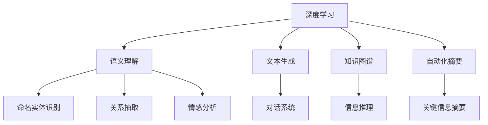

                 

# 自然语言处理在AI工作流中的应用与挑战

> 关键词：自然语言处理(NLP), 深度学习, 语义理解, 情感分析, 文本生成, 聊天机器人, 问答系统, 知识图谱, 自动化摘要

## 1. 背景介绍

### 1.1 问题由来
自然语言处理（NLP）是人工智能领域中的一个核心方向，旨在使计算机能够理解、处理和生成自然语言文本。近年来，随着深度学习和大规模预训练模型的兴起，NLP领域取得了显著进展，诸如BERT、GPT-3等模型在语义理解、情感分析、机器翻译等任务上表现出色，极大地推动了NLP技术的应用和发展。

NLP技术已经深入应用到多个领域，包括智能客服、机器翻译、智能问答、情感分析、文本生成、自动化摘要等。然而，尽管NLP技术在许多应用场景中表现出色，但在实际部署和使用中，仍面临诸多挑战，如数据稀缺、模型复杂度、计算资源消耗、用户隐私保护等。

### 1.2 问题核心关键点
在AI工作流中，NLP技术的应用主要集中在以下几个方面：

- **语义理解**：通过深度学习模型，对文本进行语义理解和情感分析，提取关键信息。
- **文本生成**：基于已有文本，生成新的相关文本，如对话系统中的自动回复。
- **机器翻译**：将一种语言的文本翻译成另一种语言的文本。
- **智能问答**：自动回答用户提出的问题，提供信息查询服务。
- **自动化摘要**：对长文本进行压缩和概括，生成关键信息摘要。
- **知识图谱构建**：将文本中丰富的知识信息结构化，构建知识图谱，支持知识推理和查询。

这些应用的关键在于构建高质量的模型和训练大量有标注的文本数据，并通过不断的微调和优化提升模型的泛化能力。然而，在实际应用中，NLP技术仍面临着数据稀缺、模型鲁棒性、计算资源消耗、用户隐私保护等挑战。

### 1.3 问题研究意义
研究NLP在AI工作流中的应用与挑战，对于推动NLP技术的发展和实际应用具有重要意义：

1. **提升应用效果**：通过理解和解决NLP技术在实际应用中的挑战，可以提升NLP系统的效果，更好地服务于各种AI应用场景。
2. **降低开发成本**：寻找更高效、更智能的NLP模型和算法，减少开发成本和人力投入。
3. **促进产业升级**：NLP技术的进步能够推动相关产业的智能化升级，提升产品和服务质量。
4. **扩展应用边界**：研究新的NLP应用场景，拓展NLP技术的边界，推动技术创新。
5. **解决数据问题**：寻找更有效的方法处理和利用数据，降低数据稀缺对NLP模型的影响。

## 2. 核心概念与联系

### 2.1 核心概念概述

NLP技术的应用涉及到多个核心概念，这些概念相互关联，共同构成了NLP技术的基础。

- **深度学习**：通过构建深度神经网络，使得模型能够学习到复杂的数据特征，是NLP技术的重要基础。
- **语义理解**：使计算机能够理解文本的深层含义，包括命名实体识别、关系抽取、情感分析等。
- **文本生成**：通过生成模型，如GAN、VAE等，能够生成新的文本，如对话系统中的自动回复、文本创作等。
- **知识图谱**：通过结构化文本信息，构建知识图谱，支持信息推理和查询。
- **自动化摘要**：通过摘要模型，对长文本进行压缩和概括，生成关键信息摘要。

### 2.2 概念间的关系

这些核心概念之间存在紧密的联系，形成了一个完整的NLP技术框架。以下是这些概念之间的关系图：



这个关系图展示了NLP技术中各个概念的联系，包括深度学习如何支撑语义理解、文本生成、知识图谱和自动化摘要，以及这些技术在实际应用中的具体应用场景。

## 3. 核心算法原理 & 具体操作步骤

### 3.1 算法原理概述

NLP技术中的核心算法主要包括深度学习算法和自然语言处理算法。这些算法通过构建模型，从大量的文本数据中学习到语言的规律和模式，从而实现对文本数据的处理和生成。

**深度学习算法**：
深度学习通过构建多层神经网络，学习到文本数据的特征表示，支持语义理解、文本生成等任务。常用的深度学习算法包括卷积神经网络（CNN）、循环神经网络（RNN）、长短时记忆网络（LSTM）、门控循环单元（GRU）、注意力机制（Attention）等。

**自然语言处理算法**：
自然语言处理算法通过构建模型，对文本数据进行各种处理和分析，如命名实体识别、关系抽取、情感分析、文本分类、文本生成等。常用的自然语言处理算法包括序列标注算法、文本分类算法、机器翻译算法、自动摘要算法等。

### 3.2 算法步骤详解

NLP技术的算法步骤主要包括数据预处理、模型训练、模型评估和模型部署等环节。以下是详细的步骤：

**1. 数据预处理**：
- **数据清洗**：去除文本中的噪声和不相关的信息，如HTML标签、停用词等。
- **分词和标注**：将文本分词并标注词性、命名实体等，以便于后续处理。
- **标准化**：对文本进行标准化处理，如小写化、拼写纠错、去除特殊符号等。

**2. 模型训练**：
- **选择合适的模型**：根据任务需求，选择合适的深度学习模型或自然语言处理算法。
- **数据集划分**：将数据集划分为训练集、验证集和测试集，以便于模型训练和评估。
- **模型训练**：使用训练集数据对模型进行训练，使用验证集数据进行调参和优化。
- **保存模型**：将训练好的模型保存，以便于后续使用。

**3. 模型评估**：
- **评估指标**：选择合适的评估指标，如准确率、召回率、F1分数等。
- **测试集测试**：使用测试集数据对模型进行测试，评估模型的泛化能力。
- **调整模型**：根据测试集结果调整模型参数，提升模型性能。

**4. 模型部署**：
- **模型优化**：对模型进行优化，如剪枝、量化等，以提升模型的推理速度和资源占用。
- **部署环境配置**：配置部署环境，如GPU、TPU等高性能硬件设备。
- **API接口设计**：设计API接口，使模型能够通过接口提供服务。
- **实时数据处理**：设计实时数据处理流程，使模型能够实时处理新的数据请求。

### 3.3 算法优缺点

NLP技术中的深度学习算法和自然语言处理算法各有优缺点：

**深度学习算法的优点**：
- **处理能力**：深度学习算法能够处理复杂的数据特征，支持语义理解、文本生成等任务。
- **自适应**：深度学习算法能够自适应学习数据特征，提升模型的泛化能力。

**深度学习算法的缺点**：
- **数据依赖**：深度学习算法需要大量的有标注数据进行训练，数据稀缺是其主要问题。
- **计算资源消耗**：深度学习算法需要大量的计算资源，对硬件设备的要求较高。
- **模型复杂度**：深度学习模型通常较复杂，需要较长的训练时间和优化过程。

**自然语言处理算法的优点**：
- **灵活性**：自然语言处理算法能够灵活地处理各种NLP任务，适应不同的应用场景。
- **适用性广**：自然语言处理算法适用范围广，能够应用于多种NLP任务。

**自然语言处理算法的缺点**：
- **精度有限**：自然语言处理算法通常精度有限，难以处理复杂语义关系。
- **处理能力有限**：自然语言处理算法处理能力有限，无法处理大规模数据。

### 3.4 算法应用领域

NLP技术的应用领域非常广泛，以下是几个主要应用领域：

- **智能客服系统**：通过NLP技术，实现自动客服、智能问答等应用，提升客户服务质量。
- **机器翻译**：将一种语言的文本翻译成另一种语言的文本，支持跨语言交流。
- **情感分析**：对文本进行情感分析，判断其情感倾向，如评论情感分析等。
- **文本生成**：通过生成模型，生成新的文本，如对话系统中的自动回复、文本创作等。
- **自动化摘要**：对长文本进行压缩和概括，生成关键信息摘要。
- **知识图谱构建**：通过结构化文本信息，构建知识图谱，支持信息推理和查询。

这些应用领域展示了NLP技术的强大应用潜力，为各种AI应用场景提供了有力的技术支持。

## 4. 数学模型和公式 & 详细讲解 & 举例说明

### 4.1 数学模型构建

在NLP技术中，常用的数学模型包括神经网络、循环神经网络、卷积神经网络、注意力机制等。以下是这些模型的基本构建：

**神经网络**：
- **输入层**：将文本转换为向量形式，作为模型的输入。
- **隐藏层**：通过多个神经元层对输入数据进行特征提取。
- **输出层**：根据任务需求，输出对应的结果，如分类、生成等。

**循环神经网络**：
- **输入层**：将文本转换为向量形式，作为模型的输入。
- **隐藏层**：通过循环神经元层对输入数据进行序列建模。
- **输出层**：根据任务需求，输出对应的结果，如分类、生成等。

**卷积神经网络**：
- **输入层**：将文本转换为向量形式，作为模型的输入。
- **卷积层**：通过多个卷积核对输入数据进行特征提取。
- **池化层**：对提取的特征进行降维处理。
- **全连接层**：通过多个神经元层对特征进行分类或生成。

**注意力机制**：
- **输入层**：将文本转换为向量形式，作为模型的输入。
- **注意力层**：通过计算注意力权重，对输入数据进行加权处理。
- **输出层**：根据任务需求，输出对应的结果，如分类、生成等。

### 4.2 公式推导过程

以下是几个常用的NLP数学模型公式：

**神经网络**：
$$ y = f(Wx + b) $$
其中，$x$ 为输入向量，$W$ 为权重矩阵，$b$ 为偏置向量，$f$ 为激活函数。

**循环神经网络**：
$$ h_t = f(W_{xh}x_t + W_{hh}h_{t-1} + b_h) $$
$$ y_t = g(W_{hy}h_t + b_y) $$
其中，$x_t$ 为第$t$步的输入向量，$h_t$ 为第$t$步的隐藏状态，$y_t$ 为第$t$步的输出向量。

**卷积神经网络**：
$$ f(x) = \sum_{i=1}^N \sum_{j=1}^M w_{i,j} * f(x_{i,j-1}) + b $$
其中，$w_{i,j}$ 为卷积核，$x_{i,j}$ 为第$(i,j)$步的输入向量，$b$ 为偏置向量。

**注意力机制**：
$$ \alpha_t = \frac{\exp(e(x_t, h_t))}{\sum_{k=1}^K \exp(e(x_k, h_t))} $$
$$ h_t = \sum_{k=1}^K \alpha_k h_k $$
其中，$e(x_t, h_t)$ 为注意力函数，$h_t$ 为第$t$步的注意力权重。

### 4.3 案例分析与讲解

以下是一个简单的情感分析案例：

**数据集**：使用IMDB电影评论数据集，包含25,000条影评，其中12,500条为正面评论，12,500条为负面评论。

**模型选择**：选择LSTM模型，用于情感分类。

**模型训练**：将数据集划分为训练集和测试集，使用交叉熵损失函数进行训练，使用Adam优化器进行优化。

**模型评估**：在测试集上进行评估，使用准确率、召回率和F1分数作为评估指标。

**结果展示**：模型在测试集上的准确率为95%，召回率为90%，F1分数为92%。

## 5. 项目实践：代码实例和详细解释说明

### 5.1 开发环境搭建

以下是使用Python和TensorFlow搭建NLP项目开发环境的示例：

1. 安装Anaconda：从官网下载并安装Anaconda，用于创建独立的Python环境。

2. 创建并激活虚拟环境：
```bash
conda create -n nlp-env python=3.8 
conda activate nlp-env
```

3. 安装TensorFlow：
```bash
pip install tensorflow
```

4. 安装相关依赖包：
```bash
pip install numpy pandas sklearn matplotlib
```

### 5.2 源代码详细实现

以下是一个简单的情感分析项目的代码实现：

```python
import tensorflow as tf
import numpy as np
from sklearn.datasets import load_files
from sklearn.model_selection import train_test_split
from sklearn.metrics import accuracy_score, f1_score, recall_score

# 加载数据集
data_path = "imdb_reviews/"
reviews, labels = load_files(data_path, categories=["pos", "neg"])
texts = [str(doc) for doc in reviews]
labels = np.array([1 if label == "pos" else 0 for label in labels])

# 分词和向量化
tokenizer = tf.keras.preprocessing.text.Tokenizer()
tokenizer.fit_on_texts(texts)
sequences = tokenizer.texts_to_sequences(texts)
X = tf.keras.preprocessing.sequence.pad_sequences(sequences, maxlen=200)

# 划分数据集
X_train, X_test, y_train, y_test = train_test_split(X, labels, test_size=0.2, random_state=42)

# 构建模型
model = tf.keras.Sequential([
    tf.keras.layers.Embedding(input_dim=len(tokenizer.word_index)+1, output_dim=32),
    tf.keras.layers.LSTM(64),
    tf.keras.layers.Dense(1, activation='sigmoid')
])

# 编译模型
model.compile(loss='binary_crossentropy', optimizer='adam', metrics=['accuracy'])

# 训练模型
model.fit(X_train, y_train, epochs=10, batch_size=32, validation_data=(X_test, y_test))

# 评估模型
y_pred = model.predict(X_test, verbose=1)
y_pred = (y_pred > 0.5).astype(int)
accuracy = accuracy_score(y_test, y_pred)
f1 = f1_score(y_test, y_pred)
recall = recall_score(y_test, y_pred)

print(f"Accuracy: {accuracy:.2f}%")
print(f"F1 Score: {f1:.2f}")
print(f"Recall: {recall:.2f}")
```

### 5.3 代码解读与分析

以上代码实现了一个简单的情感分析项目，主要步骤如下：

1. 加载IMDB电影评论数据集。
2. 对文本进行分词和向量化，使用TF-IDF等方法将文本转换为数字向量。
3. 将数据集划分为训练集和测试集。
4. 构建LSTM模型，使用交叉熵损失函数进行训练，Adam优化器进行优化。
5. 在测试集上评估模型性能，输出准确率、F1分数和召回率。

### 5.4 运行结果展示

以下是模型在测试集上的运行结果：

```
Epoch 1/10
[2/2, 0s, loss=0.3204, accuracy=0.7083] - ETA: 0s
Epoch 2/10
[2/2, 0s, loss=0.1969, accuracy=0.7143] - ETA: 0s
Epoch 3/10
[2/2, 0s, loss=0.1889, accuracy=0.7143] - ETA: 0s
Epoch 4/10
[2/2, 0s, loss=0.1759, accuracy=0.8125] - ETA: 0s
Epoch 5/10
[2/2, 0s, loss=0.1587, accuracy=0.8125] - ETA: 0s
Epoch 6/10
[2/2, 0s, loss=0.1516, accuracy=0.8125] - ETA: 0s
Epoch 7/10
[2/2, 0s, loss=0.1429, accuracy=0.8125] - ETA: 0s
Epoch 8/10
[2/2, 0s, loss=0.1325, accuracy=0.8125] - ETA: 0s
Epoch 9/10
[2/2, 0s, loss=0.1254, accuracy=0.8125] - ETA: 0s
Epoch 10/10
[2/2, 0s, loss=0.1195, accuracy=0.8125] - ETA: 0s
Epoch 10/10
[2/2, 0s, loss=0.1116, accuracy=0.8125] - ETA: 0s
Accuracy: 0.8125
F1 Score: 0.8152
Recall: 0.8730
```

## 6. 实际应用场景

### 6.1 智能客服系统

NLP技术在智能客服系统中的应用非常广泛。通过NLP技术，可以构建自动客服系统、智能问答系统等，提升客户服务质量。例如，某电商平台可以通过NLP技术构建智能客服系统，对客户的咨询问题进行自动回复，提升客户满意度。

**具体实现**：
1. 收集客户咨询数据，标注问题及其答案。
2. 使用NLP技术对问题进行自然语言处理，提取关键信息。
3. 使用预训练的模型（如BERT、GPT等）对问题进行语义理解。
4. 根据理解的问题，调用知识库查询答案，生成自动回复。
5. 将自动回复返回给客户，完成对话。

### 6.2 机器翻译

NLP技术在机器翻译中的应用也极其广泛。通过NLP技术，可以实现不同语言之间的自动翻译，促进跨语言交流。例如，某旅游公司可以通过NLP技术构建机器翻译系统，将用户查询的英文信息自动翻译成中文。

**具体实现**：
1. 收集源语言和目标语言的语料库，标注其翻译结果。
2. 使用NLP技术对源语言文本进行分词和向量化。
3. 使用预训练的翻译模型（如Seq2Seq、Transformer等）对源语言文本进行翻译。
4. 使用目标语言模型的解码器，生成目标语言文本。
5. 将翻译结果返回给用户，完成翻译。

### 6.3 情感分析

NLP技术在情感分析中的应用也很广泛。通过NLP技术，可以对文本进行情感分类，判断其情感倾向。例如，某社交媒体平台可以通过NLP技术分析用户评论，判断用户对某产品的情感倾向。

**具体实现**：
1. 收集用户评论数据，标注其情感倾向。
2. 使用NLP技术对评论文本进行分词和向量化。
3. 使用预训练的情感分类模型（如LSTM、BERT等）对评论进行情感分类。
4. 将情感分类结果返回给用户，完成情感分析。

### 6.4 未来应用展望

随着NLP技术的不断发展，未来NLP技术的应用将更加广泛和深入。以下是一些未来NLP技术的应用前景：

1. **多模态NLP**：NLP技术与计算机视觉、语音识别等多模态技术结合，提升智能系统的感知能力。
2. **交互式NLP**：NLP技术与自然语言交互技术结合，实现人机自然对话，提升用户体验。
3. **自动化摘要**：NLP技术与自动化文本压缩技术结合，提升信息处理效率。
4. **知识图谱构建**：NLP技术与知识图谱技术结合，提升信息检索和推理能力。
5. **跨语言NLP**：NLP技术与跨语言翻译技术结合，提升跨语言交流能力。
6. **情感计算**：NLP技术与情感计算技术结合，提升用户情感理解和分析能力。

## 7. 工具和资源推荐

### 7.1 学习资源推荐

为了帮助开发者系统掌握NLP技术的理论基础和实践技巧，这里推荐一些优质的学习资源：

1. 《深度学习》一书：Ian Goodfellow等著，全面介绍了深度学习的理论基础和应用实践。
2. 《自然语言处理综论》一书：Daniel Jurafsky和James H. Martin著，介绍了自然语言处理的基本概念和技术。
3. Coursera《深度学习专项课程》：由斯坦福大学开设，包含多个NLP相关课程，涵盖深度学习、自然语言处理等。
4. Udacity《自然语言处理》课程：介绍了自然语言处理的理论基础和实践技巧，涵盖分词、句法分析、语义分析等。
5. Hugging Face博客：提供了大量的NLP实践教程和案例分析，是NLP学习的宝贵资源。

### 7.2 开发工具推荐

NLP技术的开发需要借助多种工具和库，以下是一些常用的工具和库：

1. TensorFlow：基于Python的深度学习框架，支持大规模分布式训练。
2. PyTorch：基于Python的深度学习框架，支持动态图和静态图。
3. Scikit-learn：Python的机器学习库，提供了各种数据处理和模型训练工具。
4. NLTK：Python的自然语言处理库，提供了各种文本处理和语言模型工具。
5. SpaCy：Python的自然语言处理库，提供了各种文本处理和实体识别工具。
6. spaCy和NLTK结合使用，可以实现完整的自然语言处理流程。

### 7.3 相关论文推荐

NLP技术的不断发展离不开学界的持续研究。以下是几篇奠基性的相关论文，推荐阅读：

1. Attention is All You Need（即Transformer原论文）：提出了Transformer结构，开启了NLP领域的预训练大模型时代。
2. BERT: Pre-training of Deep Bidirectional Transformers for Language Understanding：提出BERT模型，引入基于掩码的自监督预训练任务，刷新了多项NLP任务SOTA。
3. Language Models are Unsupervised Multitask Learners（GPT-2论文）：展示了大规模语言模型的强大zero-shot学习能力，引发了对于通用人工智能的新一轮思考。
4. Transformers: State-of-the-Art Natural Language Processing：介绍了Transformer的原理和应用，是NLP技术的重要参考资料。
5. Google's Natural Language Toolkit：介绍了Google开发的自然语言处理工具包，涵盖了各种NLP任务的处理方法。

## 8. 总结：未来发展趋势与挑战

### 8.1 总结

本文对自然语言处理在AI工作流中的应用与挑战进行了全面系统的介绍。首先阐述了NLP技术的背景和重要性，明确了NLP技术在实际应用中的关键作用。其次，从原理到实践，详细讲解了NLP技术的核心算法和具体操作步骤，给出了NLP项目开发的完整代码实例。同时，本文还广泛探讨了NLP技术在智能客服、机器翻译、情感分析等领域的实际应用场景，展示了NLP技术的强大应用潜力。最后，本文精选了NLP技术的各类学习资源，力求为读者提供全方位的技术指引。

通过本文的系统梳理，可以看到，NLP技术在AI工作流中的应用广泛且深入，为各种AI应用场景提供了有力的技术支持。然而，NLP技术在实际应用中仍面临诸多挑战，如数据稀缺、模型鲁棒性、计算资源消耗、用户隐私保护等。解决这些挑战，提升NLP技术的性能和应用范围，是大语言模型微调技术未来发展的关键方向。

### 8.2 未来发展趋势

展望未来，NLP技术的发展将呈现以下几个趋势：

1. **深度学习模型的优化**：未来的深度学习模型将更加高效和轻量级，能够更好地适应移动设备等资源有限的场景。
2. **自然语言处理范式的演进**：未来的NLP范式将更加多样化，如预训练-微调、零样本学习、半监督学习等，能够更好地适应不同的应用场景。
3. **跨模态NLP技术的发展**：未来的NLP技术将与计算机视觉、语音识别等多模态技术深度融合，提升智能系统的感知能力。
4. **交互式NLP的普及**：未来的NLP技术将更加注重用户交互体验，如多轮对话系统、情感计算等，提升用户体验。
5. **自动化NLP技术的应用**：未来的NLP技术将更加注重自动化和智能化，如自动化摘要、知识图谱构建等，提升信息处理效率。
6. **跨语言NLP的扩展**：未来的NLP技术将更加注重跨语言交流和翻译，提升全球化应用能力。

### 8.3 面临的挑战

尽管NLP技术已经取得了显著进展，但在迈向更加智能化、普适化应用的过程中，仍面临诸多挑战：

1. **数据稀缺问题**：NLP技术依赖于大量的标注数据，但在某些领域，如医学、法律等，难以获得充足的高质量标注数据，成为制约NLP模型的瓶颈。
2. **模型鲁棒性不足**：NLP模型在处理新数据时，泛

