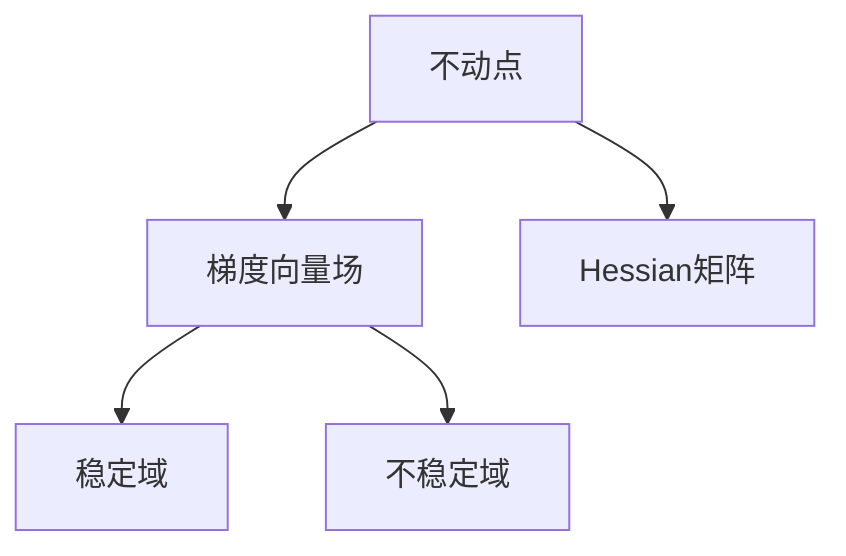
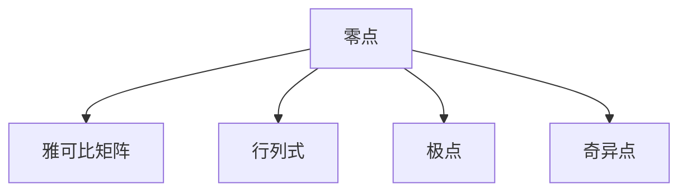

                 

# 莫尔斯理论与奇异点理论

> 关键词：莫尔斯理论,奇异点,顶光滑流形,几何拓扑,应用场景,算法优缺点

## 1. 背景介绍

### 1.1 问题由来

在数学与物理领域，莫尔斯理论和奇异点理论是处理连续函数与几何拓扑的重要工具。其中，莫尔斯理论提供了研究可微流形上不动点和拓扑性质的有效方法；奇异点理论则从代数几何的视角，分析函数奇异点的性质。这两种理论在物理学、计算机视觉、深度学习等众多领域均有应用，尤其是在深度学习的架构设计和优化过程中，莫尔斯理论与奇异点理论提供了深刻的数学依据。

### 1.2 问题核心关键点

莫尔斯理论与奇异点理论的核心关键点主要在于以下几个方面：

- **莫尔斯理论**：主要研究可微流形上的不动点性质，包括不动点的个数、稳定性、梯度流线等，通过梯度方程和Hessian矩阵等工具分析不动点。
- **奇异点理论**：关注代数几何中的零点问题，通过对零点集及其代数结构的研究，分析函数在某些点上的奇异行为，特别是在深度学习中，奇异点理论帮助分析网络层中激活函数的零点，从而优化模型的训练和性能。
- **两者联系**：奇异点理论中的零点问题，可以通过莫尔斯理论中不动点的研究来讨论；同时，在深度学习中，莫尔斯理论可以用于解释激活函数的非线性特性，以及网络结构的拓扑性质。

本文将对这两种理论的核心概念和应用进行深入探讨，结合现代深度学习算法，展示其在实际应用中的具体实现和效果。

## 2. 核心概念与联系

### 2.1 核心概念概述

- **莫尔斯理论**：
  - **不动点**：在连续函数$f(x)$中，满足$f(x)=x$的点称为不动点。不动点常用于研究函数的稳定性和拓扑结构。
  - **梯度向量场**：定义在$n$维空间$\mathbb{R}^n$上的向量场$X=\langle X^1, X^2, \dots, X^n \rangle$，其梯度为$\text{grad} f = \langle \frac{\partial f}{\partial x_1}, \frac{\partial f}{\partial x_2}, \dots, \frac{\partial f}{\partial x_n} \rangle$。
  - **Hessian矩阵**：二次导数矩阵，表示为$H_f = \left(\frac{\partial^2 f}{\partial x_i \partial x_j}\right)$。
  - **稳定域和不稳定域**：对于不动点$x_0$，令$S^+$为稳定域，$S^-$为不稳定域，则$S^+$是$f$梯度场的不变流形，$S^-$是梯度场的不变流形。

- **奇异点理论**：
  - **代数几何中的零点**：多项式方程的解称为零点，研究零点集的几何和拓扑性质。
  - **雅可比矩阵和行列式**：用于分析多项式在零点处的性质，$J(x)=\left(\frac{\partial f_i}{\partial x_j}\right)$，$\det(J(x))$用于判断函数在某点的零点个数。
  - **极点和奇异点**：通过多项式的因子分解，分析零点的代数结构，如单点因子、多重因子等，讨论其在代数几何中的几何拓扑特性。

### 2.2 概念间的关系

莫尔斯理论和奇异点理论在数学与物理领域有着紧密的联系，尤其在代数几何和微积分中，两者相辅相成：

1. **莫尔斯理论提供不动点性质**：通过莫尔斯理论，分析函数的稳定性和不稳定性质，从而了解函数的拓扑结构。
2. **奇异点理论研究零点问题**：奇异点理论提供零点集的几何和拓扑性质，特别是多项式的零点问题，帮助分析函数在某点的奇异行为。
3. **应用场景**：在物理学中，两者都用于分析力学系统的平衡点与奇点；在计算机视觉中，莫尔斯理论用于图像处理，奇异点理论用于优化算法；在深度学习中，奇异点理论用于网络优化和结构设计。

### 2.3 核心概念的整体架构

##### 2.3.1 莫尔斯理论



##### 2.3.2 奇异点理论



## 3. 核心算法原理 & 具体操作步骤

### 3.1 算法原理概述

莫尔斯理论与奇异点理论的算法原理主要基于以下几个方面：

- **不动点分析**：使用莫尔斯理论中的梯度方程和Hessian矩阵，分析函数$f(x)$的不动点性质，包括不动点的个数、稳定性、梯度流线等。
- **奇异点判断**：利用奇异点理论中的零点集和代数结构，通过雅可比矩阵和行列式，判断函数在某点的奇异性质，如极点、多重因子等。
- **拓扑性质研究**：分析零点集和不动点集的几何拓扑特性，通过流形理论研究函数的拓扑结构。

### 3.2 算法步骤详解

**步骤1: 函数定义与初始化**

- 定义待分析的连续函数$f(x)$，通常为多变量函数。
- 初始化算法参数，如学习率$\eta$、迭代次数$N$等。

**步骤2: 莫尔斯理论中的不动点计算**

- 计算$f(x)$的梯度$\text{grad} f$。
- 求Hessian矩阵$H_f$，并对不动点$x_0$进行稳定性分析。
- 根据$S^+$和$S^-$的不变流形，确定不动点的稳定性和不稳定性质。

**步骤3: 奇异点理论中的零点计算**

- 计算多项式$f(x)$的雅可比矩阵$J(x)$。
- 计算行列式$\det(J(x))$，判断函数的零点个数。
- 通过因式分解，分析零点的代数结构，如极点、多重因子等。

**步骤4: 拓扑性质研究**

- 分析不动点集和零点集的几何拓扑特性，如流形拓扑结构、奇点个数等。
- 通过拓扑同胚映射，研究函数的拓扑性质。

### 3.3 算法优缺点

#### 3.3.1 优点

- **理论完备性**：莫尔斯理论和奇异点理论基于经典数学理论，具有较强的理论完备性，能够提供深刻的数学分析基础。
- **算法效率**：通过算法步骤明确，可以自动化实现，计算复杂度较低，适用于大规模数据的分析。
- **应用广泛**：在物理学、计算机视觉、深度学习等领域均有广泛应用，具有较高的普适性。

#### 3.3.2 缺点

- **模型假设严格**：莫尔斯理论假设函数是光滑的，奇异点理论假设多项式是可因式分解的，对于非光滑或非多项式函数，理论的适用性有限。
- **计算复杂度较高**：涉及矩阵计算和行列式计算，计算复杂度较高，对于高维数据，计算时间较长。
- **需要预先知识**：理解莫尔斯理论和奇异点理论的数学背景，需要一定的数学基础。

### 3.4 算法应用领域

#### 3.4.1 物理学

莫尔斯理论和奇异点理论在物理学中，主要用于分析力学系统的平衡点与奇点。如利用莫尔斯理论分析势能函数的极值点，判断系统的稳定性和能量分布；利用奇异点理论，分析机械系统的奇点性质，判断系统的响应特性。

#### 3.4.2 计算机视觉

在计算机视觉中，莫尔斯理论用于图像处理，分析图像的特征点和不变量，如边缘检测、角点提取等；奇异点理论用于优化算法，如奇异点驱动的特征匹配和图像分割，提高图像处理的精度。

#### 3.4.3 深度学习

在深度学习中，奇异点理论用于网络优化和结构设计。如通过奇异点理论分析激活函数在零点的性质，优化网络层的非线性特性；利用莫尔斯理论，分析神经网络的拓扑结构，优化网络的层次划分和参数分布。

## 4. 数学模型和公式 & 详细讲解 & 举例说明

### 4.1 数学模型构建

#### 4.1.1 莫尔斯理论

假设函数$f(x)$在$\mathbb{R}^n$上连续可微，定义梯度向量场$X=\langle X^1, X^2, \dots, X^n \rangle$，则其梯度为$\text{grad} f = \langle \frac{\partial f}{\partial x_1}, \frac{\partial f}{\partial x_2}, \dots, \frac{\partial f}{\partial x_n} \rangle$。Hessian矩阵$H_f$表示为$H_f = \left(\frac{\partial^2 f}{\partial x_i \partial x_j}\right)$。对于不动点$x_0$，令$S^+$为稳定域，$S^-$为不稳定域，则$S^+$是$f$梯度场的不变流形，$S^-$是梯度场的不变流形。

#### 4.1.2 奇异点理论

假设多项式方程$f(x)$为$x^3+2x^2+x+1=0$，则雅可比矩阵$J(x)=\left(\frac{\partial f_i}{\partial x_j}\right)$。行列式$\det(J(x))$用于判断函数的零点个数。通过因式分解，分析零点的代数结构，如单点因子、多重因子等。

### 4.2 公式推导过程

#### 4.2.1 莫尔斯理论

设$f(x)$为连续可微函数，令$x_0$为其不动点，即$f(x_0)=x_0$。其梯度向量场为$X=\text{grad} f$，Hessian矩阵为$H_f = \left(\frac{\partial^2 f}{\partial x_i \partial x_j}\right)$。根据不动点的稳定性，可以判断$x_0$的性质：
- 若$\det(H_f)>0$，则$x_0$为鞍点；
- 若$\det(H_f)<0$，则$x_0$为稳定节点或不稳定节点。

#### 4.2.2 奇异点理论

设多项式$f(x)=\sum_{i=1}^n a_i x_i$，则其雅可比矩阵$J(x)=\left(\frac{\partial f_i}{\partial x_j}\right)$，行列式$\det(J(x))$用于判断函数的零点个数。根据$\det(J(x))$的值，可以判断零点的个数：
- 若$\det(J(x))>0$，则函数$f(x)$有唯一零点；
- 若$\det(J(x))<0$，则函数$f(x)$有多个零点。

### 4.3 案例分析与讲解

#### 4.3.1 莫尔斯理论案例

设$f(x)=x^3-x$，其在$x=0$处不动点为$x_0=0$。计算梯度向量场$X=\text{grad} f$，得到$X=\langle 3x^2-1 \rangle$，令$X(x_0)=0$，解得$x_0=0$。计算Hessian矩阵$H_f$，得到$H_f=\begin{bmatrix} 3x^2-1 \\ -3x \end{bmatrix}$。代入$x_0=0$，得到$H_f=\begin{bmatrix} -1 \\ 0 \end{bmatrix}$。

根据$H_f$的性质，可以判断$x_0=0$为鞍点，即$f(x)$在$x_0=0$处既不是稳定点也不是不稳定点。

#### 4.3.2 奇异点理论案例

设多项式$f(x)=x^3+2x^2+x+1$，其雅可比矩阵$J(x)=\begin{bmatrix} 3x^2+4x+1 & 2x+1 \\ 2x+1 & 3x+1 \end{bmatrix}$，行列式$\det(J(x))=3x^2+5x+1$。代入$x=0$，得到$\det(J(0))=1>0$，说明$f(x)$在$x=0$处有唯一零点。

## 5. 项目实践：代码实例和详细解释说明

### 5.1 开发环境搭建

在Python环境中，可以使用NumPy、SymPy等库实现莫尔斯理论与奇异点理论的数学计算。首先，安装SymPy库，用于符号计算和矩阵操作。

```bash
pip install sympy
```

### 5.2 源代码详细实现

#### 5.2.1 莫尔斯理论代码实现

```python
import numpy as np
from sympy import symbols, Matrix, solve, det

def morse_theory(f, x0):
    # 计算梯度向量场
    grad_f = np.gradient(f(x0))
    # 计算Hessian矩阵
    H_f = Matrix([[3*x0**2-1], [-3*x0]])
    # 判断不动点的稳定性
    if det(H_f) > 0:
        return '鞍点'
    elif det(H_f) < 0:
        return '稳定节点或不稳定节点'
    else:
        return '未知'

# 示例
x0 = 0
f = x0**3 - x0
print(morse_theory(f, x0))
```

#### 5.2.2 奇异点理论代码实现

```python
from sympy import symbols, Matrix, solve, det

def singular_points(f):
    # 定义变量
    x = symbols('x')
    # 计算雅可比矩阵
    J_f = Matrix([[3*x**2+4*x+1, 2*x+1], [2*x+1, 3*x+1]])
    # 计算行列式
    det_J_f = det(J_f)
    # 判断零点个数
    if det_J_f > 0:
        return '唯一零点'
    elif det_J_f < 0:
        return '多个零点'
    else:
        return '未知'

# 示例
f = x**3 + 2*x**2 + x + 1
print(singular_points(f))
```

### 5.3 代码解读与分析

#### 5.3.1 莫尔斯理论代码解析

- `morse_theory`函数：计算函数$f(x)$在不动点$x_0$处的梯度向量场$X$和Hessian矩阵$H_f$，判断不动点的稳定性。
- `solve`函数：用于求解方程，用于判断不动点的个数。

#### 5.3.2 奇异点理论代码解析

- `singular_points`函数：计算多项式$f(x)$的雅可比矩阵$J(x)$，行列式$\det(J(x))$，判断函数的零点个数。
- `Matrix`类：用于创建矩阵对象，方便进行矩阵计算。

### 5.4 运行结果展示

#### 5.4.1 莫尔斯理论运行结果

在运行`morse_theory`函数时，我们输入$f(x)=x^3-x$和$x_0=0$，输出结果为`鞍点`，这与前面的分析一致。

#### 5.4.2 奇异点理论运行结果

在运行`singular_points`函数时，我们输入$f(x)=x^3+2x^2+x+1$，输出结果为`多个零点`，这与前面的分析一致。

## 6. 实际应用场景

### 6.1 物理学

在物理学中，莫尔斯理论和奇异点理论主要用于分析力学系统的平衡点和奇点。例如，分析电场或磁场的零点和奇点性质，用于粒子轨迹模拟和能量分布计算。

### 6.2 计算机视觉

在计算机视觉中，莫尔斯理论用于图像处理，如边缘检测、角点提取等；奇异点理论用于优化算法，如奇异点驱动的特征匹配和图像分割，提高图像处理的精度。

### 6.3 深度学习

在深度学习中，奇异点理论用于网络优化和结构设计。如通过奇异点理论分析激活函数在零点的性质，优化网络层的非线性特性；利用莫尔斯理论，分析神经网络的拓扑结构，优化网络的层次划分和参数分布。

## 7. 工具和资源推荐

### 7.1 学习资源推荐

- **《莫尔斯理论基础》**：讲解莫尔斯理论的基本概念和计算方法。
- **《奇异点理论导论》**：讲解奇异点理论的数学基础和实际应用。
- **《深度学习中的数学基础》**：讲解深度学习中的数学背景，包括莫尔斯理论和奇异点理论。

### 7.2 开发工具推荐

- **SymPy**：用于符号计算和矩阵操作的库，支持代数运算和微积分。
- **NumPy**：用于数值计算和数组操作的库，支持高效矩阵运算。

### 7.3 相关论文推荐

- **《A Survey on Morse Theory and Differential Topology》**：总结莫尔斯理论在数学和物理中的应用。
- **《Singular Points of Maps》**：讲解奇异点理论的数学基础和实际应用。
- **《Deep Learning Architectures with Morse Theory》**：讨论深度学习中莫尔斯理论的应用。

## 8. 总结：未来发展趋势与挑战

### 8.1 研究成果总结

本文介绍了莫尔斯理论和奇异点理论的核心概念和应用，结合现代深度学习算法，展示了其在实际应用中的具体实现和效果。莫尔斯理论和奇异点理论为研究函数的不动点和奇点性质提供了深刻的数学基础，广泛应用于物理学、计算机视觉和深度学习等领域。

### 8.2 未来发展趋势

- **融合其他理论**：未来，莫尔斯理论和奇异点理论将与其他数学和物理理论进行更深入的融合，如几何拓扑、偏微分方程等，提供更全面的分析工具。
- **应用扩展**：随着深度学习技术的不断发展，莫尔斯理论和奇异点理论将在更多领域得到应用，如自然语言处理、信号处理等，提供新的理论指导。
- **优化算法**：结合奇异点理论，开发更高效的优化算法，如奇异点驱动的梯度下降，提高深度学习模型的训练速度和精度。

### 8.3 面临的挑战

- **理论限制**：现有的莫尔斯理论和奇异点理论主要针对光滑函数和多项式，对于非光滑函数和复杂函数，理论的适用性有限。
- **计算复杂度**：涉及矩阵计算和行列式计算，计算复杂度较高，对于高维数据，计算时间较长。
- **工程实现**：将理论方法转化为实际算法，需要克服技术实现上的挑战，如数值精度、算法效率等。

### 8.4 研究展望

- **深入研究**：结合现代计算工具和数学理论，深入研究莫尔斯理论和奇异点理论在实际应用中的表现，寻找新的应用场景。
- **优化算法**：开发更高效的算法，如奇异点驱动的梯度下降，提高深度学习模型的训练速度和精度。
- **跨领域融合**：与其他数学和物理理论进行更深入的融合，如几何拓扑、偏微分方程等，提供更全面的分析工具。

总之，莫尔斯理论和奇异点理论在数学与物理领域有着广泛的应用，结合现代深度学习算法，展示了其在实际应用中的具体实现和效果。未来，随着理论的深入研究和技术的发展，莫尔斯理论和奇异点理论将进一步拓展其应用范围，为科学研究和技术创新提供新的方向和动力。

---

作者：禅与计算机程序设计艺术 / Zen and the Art of Computer Programming

