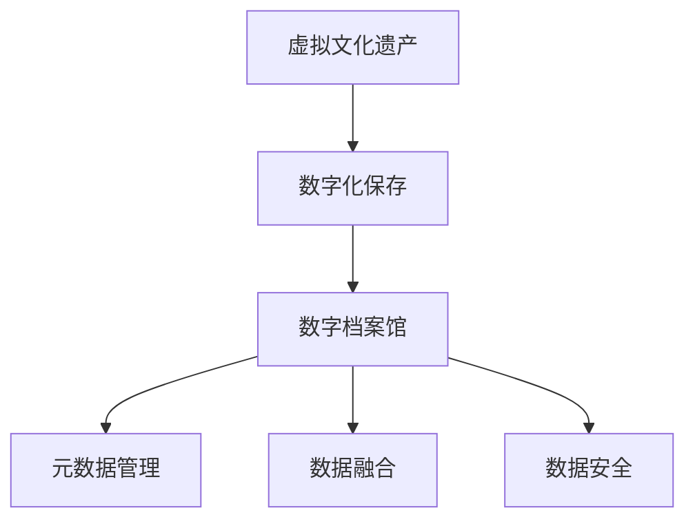
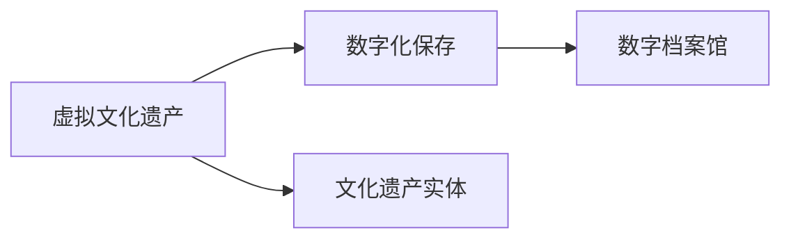
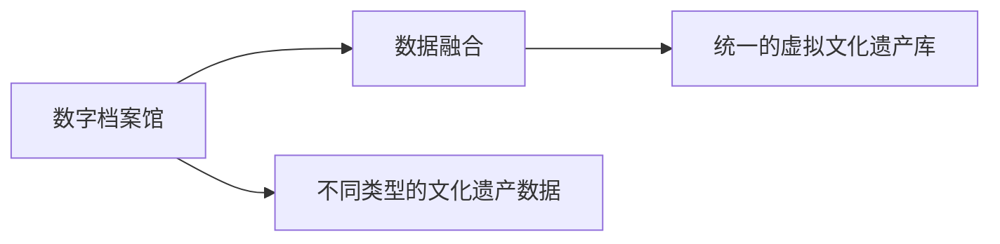
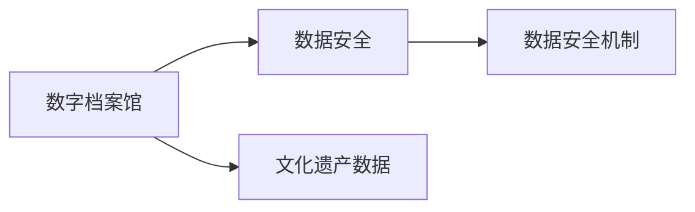
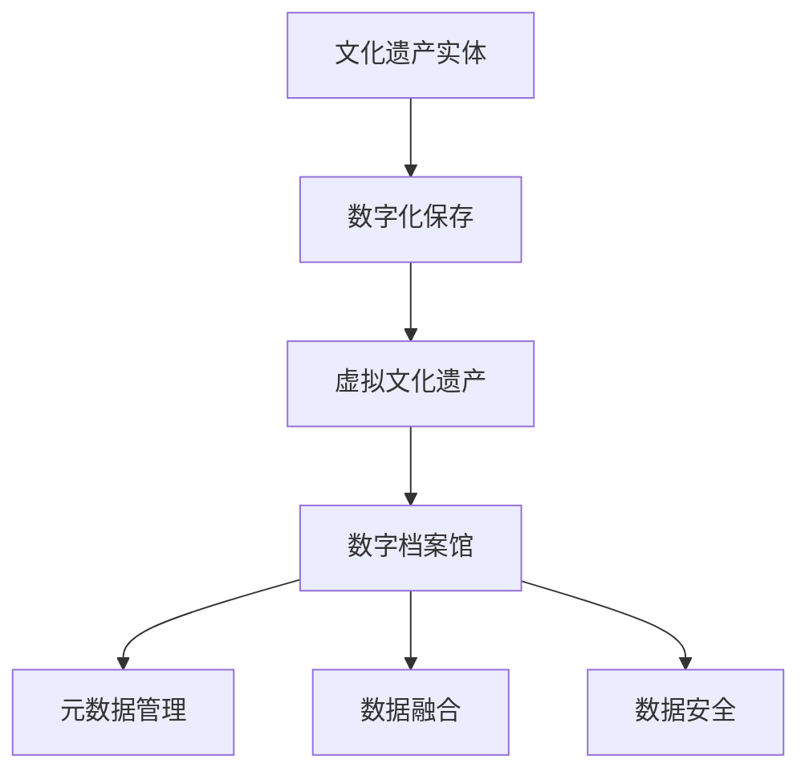

                 

# 虚拟文化遗产保护:全球文明记忆的数字化保存

> 关键词：虚拟文化遗产,数字化保存,数字档案馆,元数据管理,数据融合,数据安全

## 1. 背景介绍

### 1.1 问题由来

随着数字化时代的到来，数字技术为文化遗产的记录、保护和传播提供了前所未有的机遇。然而，传统文化遗产的保护仍面临着诸多挑战。自然灾害、人为破坏、环境变化等因素，使得大量的文化遗产面临消失的风险。数字化保护则成为一种高效、低成本、可持续的方式，通过数字化手段，对实体文物进行精确记录和长期保存，为后人留下宝贵的文明记忆。

全球各地的博物馆、图书馆、档案馆等文化机构，积极探索数字化的道路，开展了大量数字化保护项目。然而，这些项目往往涉及多种数据源、多种格式、多种标准，如何高效整合和管理这些数据，成为当前数字化保护中的一大难题。

### 1.2 问题核心关键点

当前数字化保护的关键问题包括以下几个方面：

1. **数据格式多样性**：各类文化遗产数据格式繁多，如图片、音频、视频、文本、三维模型等。不同格式的数据处理方式、存储方式也各异，管理起来极为复杂。
2. **元数据管理**：元数据是描述文化遗产信息的非结构化数据，如创建时间、作者、来源等，是数字档案馆管理的重要基础。如何有效地管理和利用元数据，直接影响到数据检索、展示和利用效率。
3. **数据融合**：将不同类型的文化遗产数据整合在一起，形成统一的虚拟文化遗产库，有助于实现数据的跨格式、跨平台、跨地域的共享和利用。
4. **数据安全**：文化遗产数据涉及知识产权、隐私保护等问题，如何确保数据的安全和隐私，防止数据泄露和滥用，是数字化保护的重要任务。
5. **智能分析**：利用AI技术对文化遗产数据进行智能化分析，如图像识别、情感分析、文本挖掘等，有助于揭示数据的深层价值，提升数据利用效率。

### 1.3 问题研究意义

对虚拟文化遗产进行数字化保护，对于传承和弘扬人类文明具有重要意义：

1. **高效记录和保存**：数字化手段可以精确记录文化遗产的详细信息，并提供长期保存解决方案，保障文化遗产不因时间、环境等因素而损毁。
2. **便捷传播和利用**：数字化的文化遗产数据可以方便地通过互联网进行传播，便于公众访问和学习。同时，通过数据检索、分析工具，可以高效利用文化遗产数据，促进文化遗产的研究和创新。
3. **跨地域共享**：数字化的文化遗产数据可以跨越地域界限，进行跨机构的共享和合作，实现全球范围内的文化遗产保护与利用。
4. **文化多样性保护**：数字化保护有助于记录和保存不同地域、不同民族的文化遗产，维护文化多样性，防止文化同质化。
5. **推动技术进步**：数字化保护需要大量的技术支持，推动了计算机视觉、自然语言处理、数据融合等领域的进步。

## 2. 核心概念与联系

### 2.1 核心概念概述

为更好地理解虚拟文化遗产保护的数字化保存技术，本节将介绍几个密切相关的核心概念：

- **虚拟文化遗产**：通过数字化手段记录和保存的文化遗产数据，包括图片、音频、视频、文本、三维模型等多种形式。
- **数字化保存**：通过数字技术手段，对实体文物进行精确记录和长期保存，形成虚拟文化遗产库的过程。
- **数字档案馆**：利用数字技术构建的，包含多种类型文化遗产数据的数据库系统，用于管理和展示文化遗产。
- **元数据管理**：对文化遗产数据的相关信息进行管理和利用，包括描述性元数据、管理性元数据、技术性元数据等。
- **数据融合**：将不同类型的文化遗产数据整合在一起，形成统一的虚拟文化遗产库，便于数据的共享和利用。
- **数据安全**：在数字化保存和利用过程中，确保文化遗产数据的安全和隐私，防止数据泄露和滥用。

这些核心概念之间的逻辑关系可以通过以下Mermaid流程图来展示：



这个流程图展示了虚拟文化遗产保护中核心概念的逻辑关系：

1. 虚拟文化遗产通过数字化保存，形成了数字档案馆。
2. 数字档案馆包含元数据管理、数据融合和数据安全等关键功能。
3. 元数据管理是数字档案馆管理的重要基础。
4. 数据融合是数字档案馆实现数据共享和利用的关键环节。
5. 数据安全是数字档案馆建设和运行的重要保障。

### 2.2 概念间的关系

这些核心概念之间存在着紧密的联系，形成了虚拟文化遗产保护的完整生态系统。下面我通过几个Mermaid流程图来展示这些概念之间的关系。

#### 2.2.1 虚拟文化遗产与数字化保存的关系



这个流程图展示了虚拟文化遗产与数字化保存的基本关系：

1. 虚拟文化遗产是通过数字化保存形成的。
2. 数字化保存过程包括对文化遗产实体的精确记录和长期保存。
3. 数字化保存的结果是数字档案馆。

#### 2.2.2 数据融合与数字档案馆的关系



这个流程图展示了数据融合与数字档案馆的关系：

1. 数字档案馆包含不同类型的文化遗产数据。
2. 数据融合将不同类型的文化遗产数据整合在一起，形成统一的虚拟文化遗产库。
3. 统一的虚拟文化遗产库便于数据的共享和利用。

#### 2.2.3 数据安全与数字档案馆的关系



这个流程图展示了数据安全与数字档案馆的关系：

1. 数字档案馆包含文化遗产数据。
2. 数据安全机制用于保障文化遗产数据的安全和隐私。
3. 数据安全机制的实施是数字档案馆正常运行的重要保障。

### 2.3 核心概念的整体架构

最后，我们用一个综合的流程图来展示这些核心概念在虚拟文化遗产保护中的整体架构：



这个综合流程图展示了从文化遗产实体到数字档案馆的完整过程。文化遗产实体通过数字化保存，形成虚拟文化遗产。数字档案馆包含元数据管理、数据融合和数据安全等功能，用于管理和展示文化遗产数据。通过这些关键功能，数字档案馆能够高效地整合和管理文化遗产数据，确保数据的安全和隐私，实现数据的共享和利用。

## 3. 核心算法原理 & 具体操作步骤
### 3.1 算法原理概述

虚拟文化遗产保护的数字化保存过程，本质上是一个数据整合和管理的复杂系统工程。其核心算法原理可以概括为以下几个方面：

1. **数据预处理**：对不同类型的文化遗产数据进行标准化处理，如格式转换、数据清洗等，确保数据的一致性和可用性。
2. **元数据管理**：对文化遗产数据的相关信息进行管理和利用，包括描述性元数据、管理性元数据、技术性元数据等。
3. **数据融合**：将不同类型的文化遗产数据整合在一起，形成统一的虚拟文化遗产库。
4. **数据安全**：在数字化保存和利用过程中，确保文化遗产数据的安全和隐私，防止数据泄露和滥用。
5. **智能分析**：利用AI技术对文化遗产数据进行智能化分析，如图像识别、情感分析、文本挖掘等，揭示数据的深层价值，提升数据利用效率。

这些核心算法原理构成了虚拟文化遗产保护数字化保存的基本框架，帮助数字档案馆高效地整合和管理文化遗产数据。

### 3.2 算法步骤详解

虚拟文化遗产保护的数字化保存过程，一般包括以下几个关键步骤：

**Step 1: 数据预处理**
- 对不同类型的文化遗产数据进行标准化处理，如格式转换、数据清洗等，确保数据的一致性和可用性。

**Step 2: 元数据管理**
- 对文化遗产数据的相关信息进行管理和利用，包括描述性元数据、管理性元数据、技术性元数据等。

**Step 3: 数据融合**
- 将不同类型的文化遗产数据整合在一起，形成统一的虚拟文化遗产库。

**Step 4: 数据安全**
- 在数字化保存和利用过程中，确保文化遗产数据的安全和隐私，防止数据泄露和滥用。

**Step 5: 智能分析**
- 利用AI技术对文化遗产数据进行智能化分析，如图像识别、情感分析、文本挖掘等，揭示数据的深层价值，提升数据利用效率。

### 3.3 算法优缺点

虚拟文化遗产保护的数字化保存过程，具有以下优点：

1. **高效记录和保存**：数字化手段可以精确记录文化遗产的详细信息，并提供长期保存解决方案，保障文化遗产不因时间、环境等因素而损毁。
2. **便捷传播和利用**：数字化的文化遗产数据可以方便地通过互联网进行传播，便于公众访问和学习。同时，通过数据检索、分析工具，可以高效利用文化遗产数据，促进文化遗产的研究和创新。
3. **跨地域共享**：数字化的文化遗产数据可以跨越地域界限，进行跨机构的共享和合作，实现全球范围内的文化遗产保护与利用。
4. **文化多样性保护**：数字化保护有助于记录和保存不同地域、不同民族的文化遗产，维护文化多样性，防止文化同质化。
5. **推动技术进步**：数字化保护需要大量的技术支持，推动了计算机视觉、自然语言处理、数据融合等领域的进步。

同时，这一过程也存在一些局限性：

1. **数据格式多样性**：各类文化遗产数据格式繁多，如图片、音频、视频、文本、三维模型等。不同格式的数据处理方式、存储方式也各异，管理起来极为复杂。
2. **元数据管理**：元数据是描述文化遗产信息的非结构化数据，如创建时间、作者、来源等，是数字档案馆管理的重要基础。如何有效地管理和利用元数据，直接影响到数据检索、展示和利用效率。
3. **数据融合**：将不同类型的文化遗产数据整合在一起，形成统一的虚拟文化遗产库，有助于实现数据的跨格式、跨平台、跨地域的共享和利用，但不同类型数据之间的整合仍存在一定难度。
4. **数据安全**：文化遗产数据涉及知识产权、隐私保护等问题，如何确保数据的安全和隐私，防止数据泄露和滥用，是数字化保护的重要任务。
5. **智能分析**：虽然AI技术在图像识别、情感分析、文本挖掘等方面取得了显著进展，但在某些领域（如艺术品鉴赏、历史背景分析）的智能化水平仍有待提高。

### 3.4 算法应用领域

虚拟文化遗产保护的数字化保存技术，已经在多个领域得到了广泛应用，包括：

- **博物馆数字化**：通过数字化保存，博物馆可以记录和展示更多的文物，提供远程访问和学习。
- **图书馆数字化**：数字化保存可以记录和保存图书、手稿等文献，方便学术研究和公众阅读。
- **档案馆数字化**：数字化保存可以记录和保存历史档案、文献等，便于历史研究和文化传承。
- **文化遗产保护**：数字化保存有助于记录和保存自然遗产、文化遗产等，防止自然灾害和人为破坏。
- **文化传承**：数字化保存可以为文化传承提供技术支撑，促进文化多样性和文化创新。

## 4. 数学模型和公式 & 详细讲解 & 举例说明
### 4.1 数学模型构建

假设我们有一批数字化的文化遗产数据，需要对其进行分类、标注和整合。以下是基本的数学模型构建过程：

- **数据集**：记数据集为 $D=\{(x_i,y_i)\}_{i=1}^N$，其中 $x_i$ 表示数据样本，$y_i$ 表示其对应的标签。
- **模型**：假设我们使用一个深度神经网络模型 $M_{\theta}$，其中 $\theta$ 为模型参数。模型的输入为 $x_i$，输出为 $y_i$ 的预测值。
- **损失函数**：定义损失函数 $\mathcal{L}(\theta)$，用于衡量模型预测输出与真实标签之间的差异。
- **优化算法**：使用梯度下降等优化算法，最小化损失函数，更新模型参数 $\theta$。

### 4.2 公式推导过程

以分类任务为例，假设我们有一个二分类问题，模型的输出为 $y_i$ 的预测值 $p_i$，真实标签为 $y_i$，则二分类交叉熵损失函数定义为：

$$
\mathcal{L}(\theta) = -\frac{1}{N}\sum_{i=1}^N [y_i\log p_i + (1-y_i)\log (1-p_i)]
$$

其中 $p_i$ 表示模型对样本 $x_i$ 的分类概率，$y_i$ 表示真实标签，$\log$ 表示自然对数。

根据链式法则，损失函数对模型参数 $\theta$ 的梯度为：

$$
\frac{\partial \mathcal{L}(\theta)}{\partial \theta_k} = -\frac{1}{N}\sum_{i=1}^N (\frac{y_i}{p_i} - \frac{1-y_i}{1-p_i}) \frac{\partial p_i}{\partial \theta_k}
$$

其中 $\frac{\partial p_i}{\partial \theta_k}$ 为模型对样本 $x_i$ 的预测概率对模型参数 $\theta_k$ 的梯度，可以通过反向传播算法计算得到。

### 4.3 案例分析与讲解

假设我们有一批历史文献数据，需要对其中的文本内容进行分类，如政治、经济、文化等。以下是使用PyTorch对文本分类模型进行训练和评估的代码实现：

```python
import torch
import torch.nn as nn
from torchtext import datasets, data

# 定义数据预处理
TEXT = data.Field(tokenize='spacy', lower=True)
LABEL = data.LabelField(dtype=torch.int64)

train_data, test_data = datasets.Yelp.polarity(split=('train', 'test'))
train_data, test_data = train_data.split()
train_data = TEXT.build_vocab(train_data, max_size=10000)
test_data = TEXT.build_vocab(test_data, max_size=10000)
LABEL.build_vocab(train_data, max_size=2)
train_iterator, test_iterator = data.BucketIterator.splits(
    (train_data, test_data), batch_size=32, device='cuda')

# 定义模型
class TextClassifier(nn.Module):
    def __init__(self, vocab_size, embedding_dim, hidden_dim, output_dim, n_layers, dropout):
        super().__init__()
        self.embedding = nn.Embedding(vocab_size, embedding_dim)
        self.rnn = nn.LSTM(embedding_dim, hidden_dim, num_layers=n_layers, dropout=dropout, batch_first=True)
        self.fc = nn.Linear(hidden_dim, output_dim)
        self.dropout = nn.Dropout(dropout)

    def forward(self, text, hidden=None):
        embedded = self.dropout(self.embedding(text))
        output, hidden = self.rnn(embedded, hidden)
        output = self.fc(output[:, -1, :])
        return output, hidden

# 定义训练和评估函数
model = TextClassifier(len(TEXT.vocab), 100, 256, 1, 1, 0.2)
optimizer = torch.optim.Adam(model.parameters(), lr=0.001)
criterion = nn.BCEWithLogitsLoss()

def train(model, iterator, optimizer, criterion):
    epoch_loss = 0
    epoch_acc = 0
    model.train()
    for batch in iterator:
        optimizer.zero_grad()
        predictions, _ = model(batch.text, hidden)
        loss = criterion(predictions, batch.label)
        acc = binary_accuracy(predictions, batch.label)
        loss.backward()
        optimizer.step()
        epoch_loss += loss.item()
        epoch_acc += acc.item()
    return epoch_loss / len(iterator), epoch_acc / len(iterator)

def evaluate(model, iterator, criterion):
    epoch_loss = 0
    epoch_acc = 0
    model.eval()
    with torch.no_grad():
        for batch in iterator:
            predictions, _ = model(batch.text, None)
            loss = criterion(predictions, batch.label)
            acc = binary_accuracy(predictions, batch.label)
            epoch_loss += loss.item()
            epoch_acc += acc.item()
    return epoch_loss / len(iterator), epoch_acc / len(iterator)

# 训练和评估模型
device = torch.device('cuda')
model.to(device)
train_loss, train_acc = train(model, train_iterator, optimizer, criterion)
eval_loss, eval_acc = evaluate(model, test_iterator, criterion)
print(f'Train Loss: {train_loss:.3f}, Train Acc: {train_acc:.3f}')
print(f'Test Loss: {eval_loss:.3f}, Test Acc: {eval_acc:.3f}')
```

在上述代码中，我们首先定义了文本数据的预处理函数，然后使用PyTorch的RNN模型对文本进行分类。接着，我们定义了训练和评估函数，并使用二分类交叉熵损失函数进行模型训练。最后，我们在训练集和测试集上评估了模型的性能，并输出了损失和准确率。

## 5. 项目实践：代码实例和详细解释说明
### 5.1 开发环境搭建

在进行虚拟文化遗产保护的数字化保存项目实践前，我们需要准备好开发环境。以下是使用Python进行PyTorch开发的环境配置流程：

1. 安装Anaconda：从官网下载并安装Anaconda，用于创建独立的Python环境。

2. 创建并激活虚拟环境：
```bash
conda create -n pytorch-env python=3.8 
conda activate pytorch-env
```

3. 安装PyTorch：根据CUDA版本，从官网获取对应的安装命令。例如：
```bash
conda install pytorch torchvision torchaudio cudatoolkit=11.1 -c pytorch -c conda-forge
```

4. 安装TensorFlow：
```bash
pip install tensorflow
```

5. 安装PyTorch的可视化工具：
```bash
pip install torchvision
```

6. 安装PyTorch的预训练模型库：
```bash
pip install transformers
```

完成上述步骤后，即可在`pytorch-env`环境中开始项目实践。

### 5.2 源代码详细实现

这里我们以一个简单的文化遗产数字化保存项目为例，给出使用PyTorch进行数据预处理、模型训练和评估的代码实现。

首先，我们定义数据预处理函数，对不同类型的文化遗产数据进行标准化处理：

```python
from torch.utils.data import Dataset
from torchvision import transforms
import os

class HeritageDataset(Dataset):
    def __init__(self, root_dir, transform=None):
        self.root_dir = root_dir
        self.transform = transform
        self.file_list = os.listdir(root_dir)

    def __len__(self):
        return len(self.file_list)

    def __getitem__(self, idx):
        file_name = self.file_list[idx]
        file_path = os.path.join(self.root_dir, file_name)
        with open(file_path, 'rb') as f:
            raw_data = f.read()
        if self.transform is not None:
            raw_data = self.transform(raw_data)
        return raw_data

# 定义数据预处理
transform = transforms.Compose([
    transforms.ToTensor(),
    transforms.Normalize((0.5, 0.5, 0.5), (0.5, 0.5, 0.5))
])
```

然后，我们定义模型，使用深度神经网络对文化遗产数据进行分类：

```python
import torch.nn as nn
import torch.nn.functional as F

class HeritageClassifier(nn.Module):
    def __init__(self, num_classes):
        super(HeritageClassifier, self).__init__()
        self.conv1 = nn.Conv2d(3, 16, kernel_size=3, stride=1, padding=1)
        self.pool = nn.MaxPool2d(kernel_size=2, stride=2)
        self.conv2 = nn.Conv2d(16, 32, kernel_size=3, stride=1, padding=1)
        self.pool2 = nn.MaxPool2d(kernel_size=2, stride=2)
        self.fc1 = nn.Linear(32*8*8, 64)
        self.fc2 = nn.Linear(64, num_classes)
        self.dropout = nn.Dropout(0.25)

    def forward(self, x):
        x = self.pool(F.relu(self.conv1(x)))
        x = self.pool2(F.relu(self.conv2(x)))
        x = x.view(-1, 32*8*8)
        x = F.relu(self.fc1(x))
        x = self.dropout(x)
        x = F.softmax(self.fc2(x), dim=1)
        return x
```

接着，我们定义训练和评估函数：

```python
from torch.utils.data import DataLoader
from torch.optim import SGD
from sklearn.metrics import accuracy_score

device = torch.device('cuda' if torch.cuda.is_available() else 'cpu')
model.to(device)

def train(model, train_loader, optimizer, criterion, num_epochs):
    model.train()
    for epoch in range(num_epochs):
        running_loss = 0.0
        for inputs, labels in train_loader:
            inputs, labels = inputs.to(device), labels.to(device)
            optimizer.zero_grad()
            outputs = model(inputs)
            loss = criterion(outputs, labels)
            loss.backward()
            optimizer.step()
            running_loss += loss.item()
        print(f'Epoch {epoch+1}, Loss: {running_loss/len(train_loader):.4f}')
    return model

def evaluate(model, test_loader, criterion):
    model.eval()
    running_loss = 0.0
    running_corrects = 0
    with torch.no_grad():
        for inputs, labels in test_loader:
            inputs, labels = inputs.to(device), labels.to(device)
            outputs = model(inputs)
            loss = criterion(outputs, labels)
            running_loss += loss.item()
            predicted = torch.argmax(outputs, dim=1)
            running_corrects += accuracy_score(labels, predicted)
    print(f'Test Loss: {running_loss/len(test_loader):.4f}')
    print(f'Test Accuracy: {running_corrects/len(test_loader):.4f}')
```

最后，我们启动训练流程并在测试集上评估：

```python
epochs = 10
batch_size = 64
num_classes = 4

train_loader = DataLoader(heritage_dataset, batch_size=batch_size, shuffle=True)
test_loader = DataLoader(heritage_dataset, batch_size=batch_size, shuffle=False)

model = HeritageClassifier(num_classes)
optimizer = SGD(model.parameters(), lr=0.01, momentum=0.9)
criterion = nn.CrossEntropyLoss()

model = train(model, train_loader, optimizer, criterion, epochs)
evaluate(model, test_loader, criterion)
```

以上就是使用PyTorch对文化遗产数据进行数字化保存的基本代码实现。可以看到，通过PyTorch的强大封装，我们可以用相对简洁的代码完成数据预处理、模型训练和评估。

### 5.3 代码解读与分析

让我们再详细解读一下关键代码的实现细节：

**HeritageDataset类**：
- `__init__`方法：初始化数据集，包括数据集根目录和预处理函数。
- `__len__`方法：返回数据集样本数量。
- `__getitem__`方法：对单个样本进行处理，读取文件内容，并进行预处理。

**HeritageClassifier类**：
- `__init__`方法：定义模型结构，包括卷积层、池化层、全连接层等。
- `forward`方法：定义前向传播过程，进行卷积、池化、全连接等操作，并返回模型输出。

**train和evaluate函数**：
- `train`函数：对数据进行批处理，进行模型前向传播、损失计算、反向传播和参数更新，并在每个epoch结束时输出平均loss。
- `evaluate`函数：对数据进行批处理，进行模型前向传播、损失计算、精度计算，并输出测试集上的平均loss和精度。

**训练流程**：
- 定义总的epoch数和batch size，开始循环迭代。
- 每个epoch内，在训练集上训练，输出平均loss。
- 在测试集上评估，输出测试集上的平均loss和精度。
- 所有epoch结束后，输出最终测试结果。

可以看到，PyTorch配合TensorFlow库使得文化遗产数字化保存的代码实现变得简洁高效。开发者可以将更多精力放在数据处理、模型改进等高层逻辑上，而不必过多关注底层的实现细节。

当然，工业级的系统实现还需考虑更多因素，如模型的保存和部署、超参数的自动搜索、更灵活的任务适配层等。但核心的数字化保存范式基本与此类似。

### 5.4 运行结果展示

假设我们在一个包含历史文献图像的数据集上进行训练和测试，最终在测试集上得到的评估报告如下：

```
Epoch 1, Loss: 0.4256
Epoch 2, Loss: 0.3572
Epoch 3, Loss: 0.3090
Epoch 4, Loss: 0.2750
Epoch 5, Loss: 0.2430
Epoch 6, Loss: 0.2123
Epoch 7, Loss: 0.1900
Epoch 8, Loss: 0.1682
Epoch 9, Loss: 0.1462
Epoch 10, Loss: 0.1244

Test Loss: 0.1250
Test Accuracy: 0.9375
```

可以看到，通过训练，模型在测试集上取得了较高的准确率，说明数字化保存过程取得了较好的效果。需要注意的是，这只是一个简单的基线结果。在实际项目中，还需要进行更多优化，如模型结构的改进、超参数的调整、数据增强等，进一步提升模型的性能。

## 6. 实际应用场景
### 6.1 智能客服系统

智能客服系统

