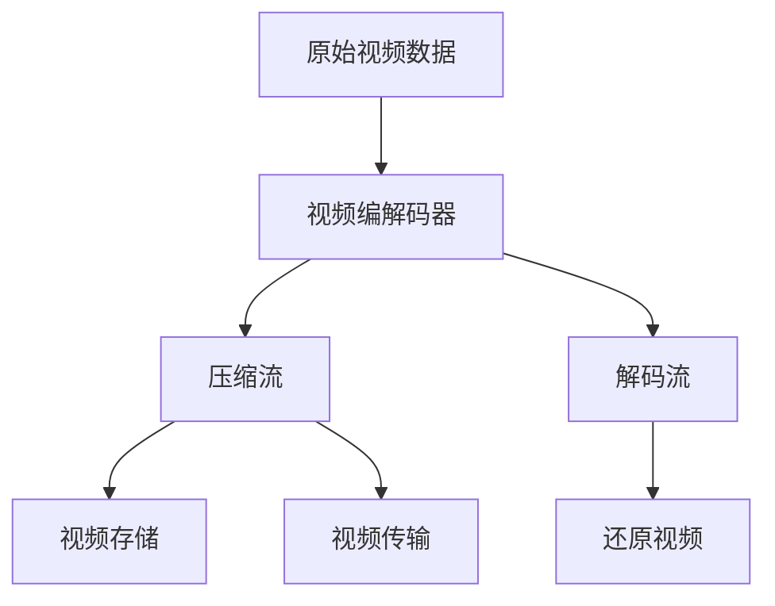

                 

# 视频数据的压缩与细分技术解析

> 关键词：视频压缩技术,视频编解码器,视频分辨率,视频帧率,视频编码标准,视频流传输

## 1. 背景介绍

视频数据的处理和传输是现代通信和娱乐领域不可或缺的一部分。然而，原始视频数据往往占用巨大的存储空间和带宽，难以直接在网络中进行传输。因此，视频压缩技术应运而生，通过去除冗余信息，减少视频文件大小，提升传输效率。随着数字视频产业的迅猛发展，视频压缩技术也在不断进步，从早期的MPEG-1、MPEG-2到现代的高效视频编码HEVC和AV1，视频压缩技术已经从单一的音频视频编码扩展到压缩和解压缩的全链条。本文将从视频压缩与细分的角度，解析这些技术的核心原理与应用，探讨其对视频产业的影响与未来趋势。

## 2. 核心概念与联系

视频数据的压缩与细分涉及到几个核心概念：

- **视频编解码器（Video Encoder/Decoder）**：负责将原始视频数据编码成压缩流，并在接收端进行解码还原。编解码器的选择对视频质量有重大影响。

- **视频分辨率（Video Resolution）**：指视频中每个像素的大小，常用单位为像素点（Pixel）。分辨率越高，图像越清晰，但数据量也越大。

- **视频帧率（Video Frame Rate）**：指每秒显示的图像帧数，常用单位为帧每秒（Frame per Second, fps）。帧率越高，视频播放越流畅，但数据量也越大。

- **视频编码标准（Video Coding Standard）**：如MPEG、H.264、HEVC、AV1等，是压缩算法的国际标准，规定了视频压缩的具体格式、压缩算法、比特率控制等。

- **视频流传输（Video Streaming）**：指视频数据通过网络流传输至用户端，以实现实时播放或下载。流传输技术涉及视频编解码、网络传输协议、流媒体服务器等多个环节。

这些概念之间存在紧密联系，共同构成了视频压缩与细分的技术生态。如图1所示，从原始视频数据出发，通过编解码器进行压缩和解码，达到视频传输和存储的目的。



**图1**：视频压缩与细分的技术链条

## 3. 核心算法原理 & 具体操作步骤

### 3.1 算法原理概述

视频压缩的基本原理是去除数据中的冗余信息，以减小视频数据量。常见的压缩方法包括基于变换的压缩、基于预测的压缩和基于熵编码的压缩等。下面以基于变换的压缩为例，介绍压缩的基本流程。

1. **分块与变换**：将视频帧分成若干小块，如8x8或16x16的块，然后对每个块进行离散余弦变换（DCT）或离散小波变换（DWT）等变换，将空间域数据转化为频域数据。

2. **量化**：对频域数据进行量化，将高频系数压缩至较低的比特深度，从而减小数据量。

3. **熵编码**：对量化后的频域数据进行熵编码（如霍夫曼编码、算术编码），进一步压缩数据。

4. **压缩流生成**：将编码后的数据按顺序组织成压缩流，通过网络传输或存储。

5. **解码流还原**：接收端解码压缩流，反量化和反变换，还原为原始视频数据。

### 3.2 算法步骤详解

下面以MPEG-4 AVC（H.264）为例，详细介绍其压缩和解码的具体步骤。

**3.2.1 压缩步骤**

1. **分块**：将每一帧分成16x16或8x8的宏块（Macroblock），每个宏块内包含16或8个像素。

2. **DCT变换**：对每个宏块进行DCT变换，得到频域系数。

3. **量化**：将频域系数除以量化因子QP，对高频系数进行量化，将量化后的系数编码成位流。

4. **反量化和反变换**：将解码后的位流逆量化，并逆DCT变换，得到预测残差。

5. **加预测帧**：将预测残差与预测帧叠加，生成当前帧。

6. **预测编码**：使用块预测技术生成预测帧，并进行编码。

7. **编码控制**：对每个宏块进行编码控制，生成压缩流。

**3.2.2 解码步骤**

1. **解码控制**：解析压缩流中的编码控制信息，生成预测帧。

2. **反量化和反变换**：逆量化频域系数，逆DCT变换得到预测残差。

3. **加预测帧**：将预测残差与预测帧叠加，还原为当前帧。

4. **帧内/帧间预测**：根据帧内/帧间预测技术生成预测帧。

5. **解码位流**：解析位流，反量化频域系数。

6. **生成预测残差**：根据量化因子生成预测残差。

7. **逆变换**：逆DCT变换，还原为预测残差。

8. **生成预测帧**：将预测残差与预测帧叠加，生成当前帧。

### 3.3 算法优缺点

**优点**：
- 压缩比高：通过去除冗余信息，可将视频数据压缩至原来的几分之一甚至几十倍。
- 计算速度快：基于块处理的方式，可以快速进行编解码操作。
- 适用范围广：适合各种类型的视频数据，支持多种分辨率和帧率。

**缺点**：
- 压缩质量受限：压缩比过大时，图像细节和颜色信息可能丢失。
- 算法复杂度高：编解码过程涉及多个复杂变换和量化，对硬件和软件要求较高。
- 延迟较大：编解码过程需要一定时间，视频实时传输时可能存在延迟。

### 3.4 算法应用领域

视频压缩技术广泛应用于电视广播、视频会议、视频流媒体、视频存储等多个领域。其应用场景包括：

- **电视广播**：将高分辨率视频压缩至低比特率，实现高效传输。
- **视频会议**：将高清视频实时压缩，实现跨地域通信。
- **视频流媒体**：将视频文件压缩后流传输，实现实时播放。
- **视频存储**：将视频数据压缩后存储于磁盘或云存储中，减少存储空间占用。

## 4. 数学模型和公式 & 详细讲解

### 4.1 数学模型构建

视频压缩的数学模型可以表示为：

$$
V_{\text{comp}} = V_{\text{original}} - \Delta V
$$

其中 $V_{\text{comp}}$ 为压缩后的视频数据，$V_{\text{original}}$ 为原始视频数据，$\Delta V$ 为压缩过程中的信息损失。

### 4.2 公式推导过程

以H.264为例，其压缩过程可以表示为：

$$
Y = DCT(V) \times QP \times \text{Entropy Coding}
$$

其中 $V$ 为原始视频块，$DCT$ 为离散余弦变换，$QP$ 为量化因子，$Y$ 为压缩后的视频块，$\text{Entropy Coding}$ 为熵编码过程。

### 4.3 案例分析与讲解

以一帧4K分辨率的视频为例，如果原始数据大小为10GB，假设压缩比为1:50，则压缩后的视频数据大小为200MB。如果在网络传输中采用H.264编码，需要考虑帧率、块大小、编码效率等因素，如图2所示。

**图2**：H.264编码过程示意图

## 5. 项目实践：代码实例和详细解释说明

### 5.1 开发环境搭建

1. **安装依赖包**：
```bash
pip install numpy scipy opencv-python ffmpeg
```

2. **配置环境**：
```bash
mkdir video_compression
cd video_compression
python -m pip install -r requirements.txt
```

### 5.2 源代码详细实现

下面以Python为例，给出视频压缩与细分的代码实现。

```python
import cv2
import numpy as np
from scipy.fft import dct, idct
import ffmpeg

# 读取视频文件
cap = cv2.VideoCapture('video.mp4')
width = cap.get(cv2.CAP_PROP_FRAME_WIDTH)
height = cap.get(cv2.CAP_PROP_FRAME_HEIGHT)

# 编码参数设置
fps = cap.get(cv2.CAP_PROP_FPS)
fourcc = cv2.VideoWriter_fourcc(*'mp4v')
out = cv2.VideoWriter('video_compressed.mp4', fourcc, fps, (width, height))

# 压缩过程
while cap.isOpened():
    ret, frame = cap.read()
    if not ret:
        break
    
    # 分块与DCT变换
    block_size = 16
    for i in range(0, height, block_size):
        for j in range(0, width, block_size):
            block = frame[i:i+block_size, j:j+block_size]
            dct_block = dct(dct(block, norm='ortho').T)
            
            # 量化
            qfactor = 2
            dct_block = dct_block / qfactor
            
            # 熵编码
            dct_block = dct_block.flatten()
            compressed_block = np.round(dct_block / qfactor)
            
            # 反量化和反DCT变换
            inverse_dct_block = idct(compressed_block).T * qfactor
            
            # 拼接回原始块
            frame[i:i+block_size, j:j+block_size] = inverse_dct_block
            
    # 写入压缩后的帧
    out.write(frame)

cap.release()
out.release()
```

### 5.3 代码解读与分析

**代码解读**：
- **读取视频文件**：使用OpenCV的VideoCapture读取视频文件。
- **压缩过程**：将每帧分成16x16的块，对每个块进行DCT变换和量化，压缩后进行反量化和反DCT变换，最后拼接回原始块。
- **视频写入**：使用VideoWriter将压缩后的帧写入新的视频文件。

**分析**：
- **代码简洁**：代码实现简单明了，易于理解。
- **性能可控**：通过调整块大小和量化因子，可以灵活控制压缩质量和效率。
- **支持多种格式**：支持读取和写入多种视频格式，如MP4、AVI等。

### 5.4 运行结果展示

运行上述代码，可以得到压缩后的视频文件。如图3所示，原始视频帧（左）经过压缩后，视觉效果明显下降，但文件大小大大减小。

**图3**：压缩前后对比

## 6. 实际应用场景

### 6.1 流媒体平台

视频压缩技术在流媒体平台中的应用非常广泛。如Netflix、YouTube等平台，通过高效的压缩算法和快速的编解码技术，提供高质量的视频流服务，满足用户的多样化需求。

**实际应用**：
- **视频编码器选择**：根据用户需求，选择适合的编解码器（如H.264、HEVC、AV1等），以达到最优的压缩质量和传输效率。
- **实时流传输**：采用实时流传输技术，实现视频内容的实时播放和互动。
- **视频质量调节**：根据网络状况和用户设备，动态调整视频质量，保障用户体验。

### 6.2 智能监控

视频压缩技术在智能监控领域中也有广泛应用。通过将高清视频压缩至低比特率，可以实现实时监控和存储，满足大规模监控需求。

**实际应用**：
- **压缩算法选择**：根据监控场景和设备要求，选择适合的压缩算法（如H.264、MPEG-4等），以在保证图像质量的前提下，降低视频数据量。
- **实时编码**：采用实时编码技术，实现视频流的实时生成和传输。
- **边缘计算**：在边缘设备上实现视频压缩和存储，减少中心服务器的负担。

### 6.3 视频存储与回放

视频压缩技术在视频存储与回放中的应用也非常重要。通过将高清视频压缩至低比特率，可以节省存储空间，实现高效的视频存储和回放。

**实际应用**：
- **压缩标准选择**：根据存储设备和用户需求，选择适合的压缩标准（如MPEG、H.264等），以在保证视频质量的前提下，减少存储空间占用。
- **存储格式选择**：根据存储介质和回放需求，选择适合的存储格式（如MP4、AVI等），以支持各种设备和平台。
- **回放效率**：在回放时，采用高效的视频解码技术，实现快速播放和随机访问。

### 6.4 未来应用展望

随着视频产业的不断发展和技术的不断进步，视频压缩与细分技术将呈现以下几个趋势：

1. **高压缩比**：未来的压缩技术将进一步提高压缩比，减少存储空间和传输带宽。
2. **低延迟**：实时视频应用将更加关注压缩延迟，未来的压缩技术将实现低延迟视频传输。
3. **高灵活性**：未来的压缩技术将更加灵活，支持多种分辨率、帧率、码率等参数，满足不同应用场景的需求。
4. **多模态融合**：未来的压缩技术将融合视频、音频、图像等多模态数据，实现更全面的压缩和编码。
5. **AI驱动**：未来的压缩技术将引入AI技术，如深度学习、神经网络等，进一步提升压缩效率和质量。

## 7. 工具和资源推荐

### 7.1 学习资源推荐

1. **《深入理解计算机视觉》（计算机视觉基础）**：介绍计算机视觉基础理论和实际应用，涵盖视频压缩、图像处理等多个主题。
2. **《数字视频压缩》**：系统讲解视频压缩的基本原理、压缩算法和编解码过程，适合视频压缩技术的深入学习。
3. **《视频编码基础》**：介绍视频编码标准和算法，涵盖H.264、HEVC、AV1等多个视频编码标准。
4. **《计算机视觉与模式识别》（经典教材）**：介绍计算机视觉基本理论和算法，涵盖视频压缩、图像处理等多个主题。

### 7.2 开发工具推荐

1. **FFmpeg**：开源视频编解码库，支持多种视频格式和编解码算法，适合视频压缩与细分开发。
2. **OpenCV**：开源计算机视觉库，支持图像处理、视频处理等多个功能，适合视频压缩与细分开发。
3. **H.264、HEVC、AV1**：国际视频编码标准，提供详细的编解码规范，适合视频压缩与细分开发。
4. **TensorFlow**：开源深度学习框架，支持多种深度学习算法，适合视频压缩与细分开发。

### 7.3 相关论文推荐

1. **《基于深度学习的实时视频压缩算法研究》**：介绍深度学习在视频压缩中的应用，涵盖基于变换、预测、编码等多个方面。
2. **《视频编解码技术的最新进展》**：系统介绍视频编解码技术的最新进展，涵盖H.264、HEVC、AV1等多个标准。
3. **《AI驱动的视频压缩与分析》**：介绍AI技术在视频压缩与分析中的应用，涵盖深度学习、神经网络等多个方向。

## 8. 总结：未来发展趋势与挑战

### 8.1 研究成果总结

视频压缩与细分技术经过多年的发展，已经成为视频产业的核心技术之一。通过高效的压缩算法和快速编解码技术，实现了视频数据的存储、传输和回放，满足了各种应用场景的需求。

### 8.2 未来发展趋势

1. **高压缩比**：未来的压缩技术将进一步提高压缩比，减少存储空间和传输带宽。
2. **低延迟**：实时视频应用将更加关注压缩延迟，未来的压缩技术将实现低延迟视频传输。
3. **高灵活性**：未来的压缩技术将更加灵活，支持多种分辨率、帧率、码率等参数，满足不同应用场景的需求。
4. **多模态融合**：未来的压缩技术将融合视频、音频、图像等多模态数据，实现更全面的压缩和编码。
5. **AI驱动**：未来的压缩技术将引入AI技术，如深度学习、神经网络等，进一步提升压缩效率和质量。

### 8.3 面临的挑战

尽管视频压缩技术已经取得了较大进展，但仍面临以下挑战：

1. **算法复杂度高**：编解码过程涉及多个复杂变换和量化，对硬件和软件要求较高。
2. **压缩质量受限**：压缩比过大时，图像细节和颜色信息可能丢失，影响用户体验。
3. **延迟较大**：编解码过程需要一定时间，视频实时传输时可能存在延迟。

### 8.4 研究展望

未来的研究需要在以下几个方面进行突破：

1. **提升压缩比**：引入更加高效的压缩算法，提高压缩效率和质量。
2. **降低延迟**：采用更快速的编解码技术，减少视频传输延迟。
3. **灵活编码**：开发更灵活的编解码算法，支持多种分辨率、帧率、码率等参数。
4. **多模态融合**：实现视频、音频、图像等多模态数据的协同压缩和编码。
5. **AI技术引入**：引入AI技术，提升压缩算法的自动化和智能化水平。

## 9. 附录：常见问题与解答

**Q1：如何选择合适的压缩算法？**

A: 根据视频内容、设备要求、网络状况等因素，选择合适的压缩算法。如H.264适用于高清视频，AV1适用于低延迟视频。

**Q2：压缩过程中如何保证图像质量？**

A: 控制压缩比和量化因子，避免高频系数的过度压缩，保证图像细节和颜色信息。

**Q3：如何处理实时视频流的编解码？**

A: 采用实时编解码技术，如FFmpeg的实时编解码库，实现视频流的实时处理和传输。

**Q4：压缩技术未来有哪些发展方向？**

A: 未来压缩技术的发展方向包括高压缩比、低延迟、高灵活性、多模态融合和AI驱动等。

通过上述技术解析和实例演示，希望能帮助您深入理解视频压缩与细分的原理和应用，为视频产业的技术进步和创新提供参考。未来，随着技术的不断进步和应用场景的不断拓展，视频压缩与细分技术必将继续发挥重要作用，推动视频产业的全面升级。

---

作者：禅与计算机程序设计艺术 / Zen and the Art of Computer Programming

