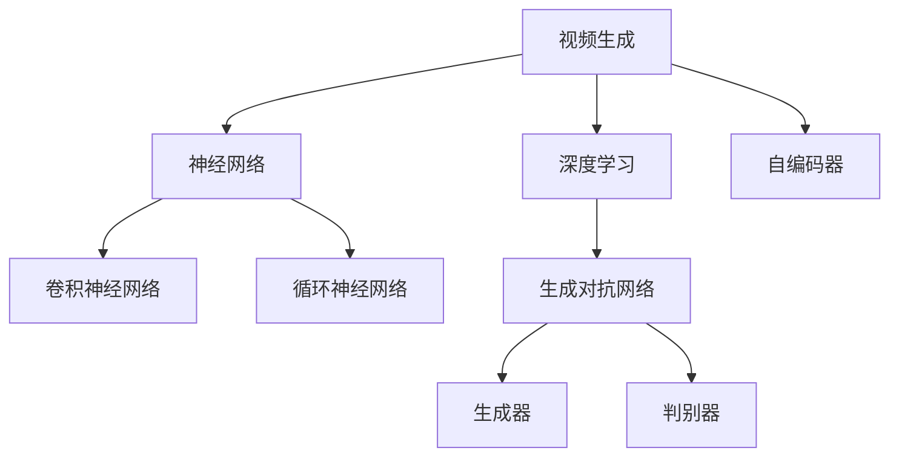
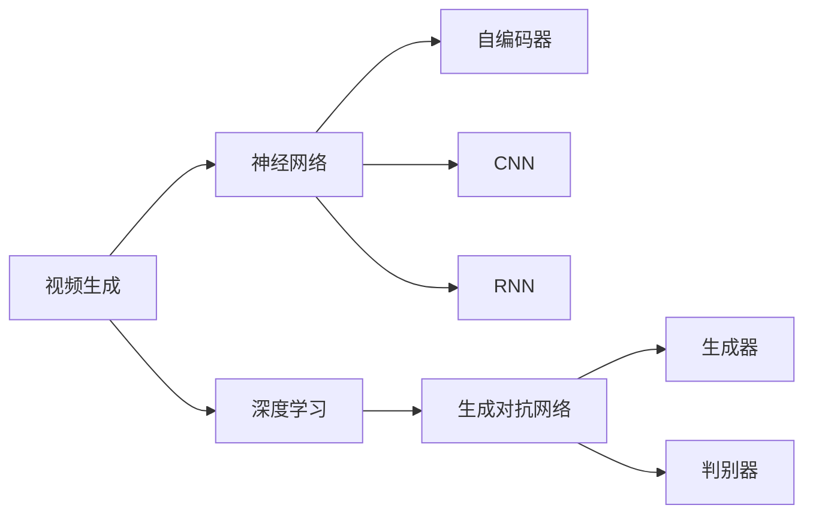
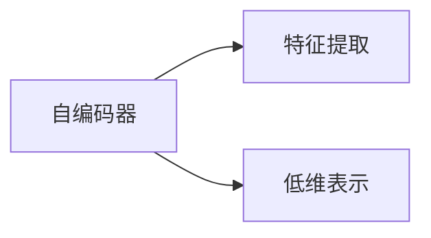
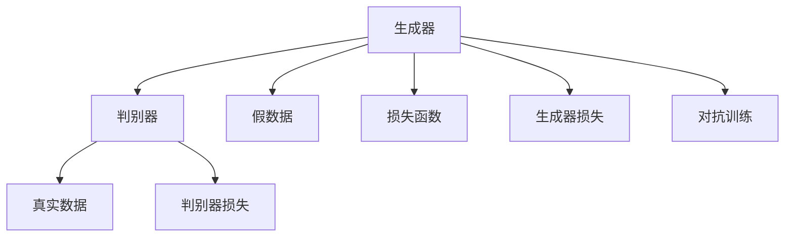
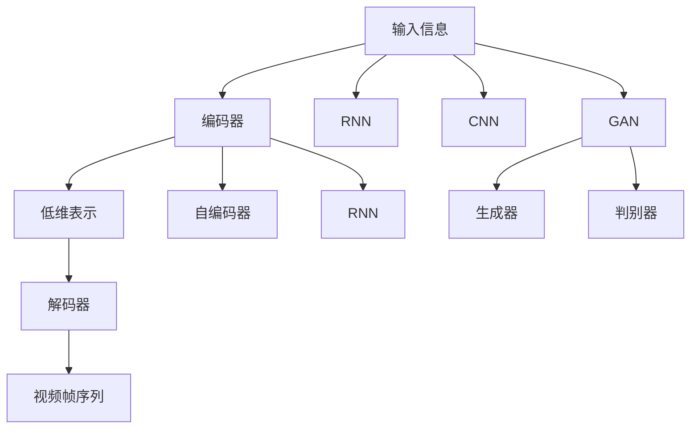

                 

# 视频生成(Video Generation) - 原理与代码实例讲解

> 关键词：视频生成, 深度学习, 神经网络, 卷积神经网络(CNN), 循环神经网络(RNN), 自编码器(AE), 生成对抗网络(GAN), PyTorch

## 1. 背景介绍

### 1.1 问题由来
近年来，随着深度学习技术的快速发展，生成式对抗网络(Generative Adversarial Networks, GANs)在视频生成领域取得了显著进展。视频生成不仅可以用于娱乐、广告、电影制作等领域，还可以应用于医学、体育分析、安全监控等多个行业。生成视频的能力使得机器能够从无到有地创作出真实的、高质量的视频内容，打破了传统依赖人工输入和编辑的方式。

然而，由于视频生成任务的高度复杂性和高计算需求，当前的深度学习模型仍面临诸多挑战。如何在保证视频质量的同时，提升生成速度和效率，是视频生成研究的一个重要方向。

### 1.2 问题核心关键点
视频生成技术的核心在于如何将低维的输入信息（如文本、图像、声音等）映射到高维的视频空间，并生成与输入相关的连续视频帧。目前主流的生成方法包括自编码器、RNN、CNN、GAN等。

具体来说，视频生成模型需要：
- 编码器(encoder)：将输入信息映射到低维表示，捕捉输入的特征信息。
- 解码器(decoder)：将低维表示解码为视频帧，生成连续的视频序列。
- 损失函数：衡量生成的视频帧与真实视频帧的差异，指导模型的优化。

### 1.3 问题研究意义
研究视频生成技术，对于拓展人工智能的创作能力，提升视频制作效率，加速视频生成技术在各个行业中的应用，具有重要意义：

1. 降低制作成本。生成视频无需前期大量人力物力投入，能显著降低制作成本，缩短制作周期。
2. 提升视频质量。深度学习模型能够学习到复杂的模式，生成的视频内容更加丰富、自然。
3. 拓宽应用领域。视频生成技术可以应用于娱乐、教育、营销等多个领域，为传统行业带来新的价值。
4. 赋能行业创新。在视频分析、运动捕捉、自动生成等领域，视频生成技术可提供新的数据生成方式，促进行业技术创新。
5. 助力创意表达。生成视频使得机器具备了创作能力，为内容创作者提供新的创作工具，激发更多的创意表达。

## 2. 核心概念与联系

### 2.1 核心概念概述

为更好地理解视频生成技术，本节将介绍几个关键概念：

- 视频生成(Video Generation)：通过深度学习模型将输入信息映射到高维的视频空间，生成连续的视频帧序列。
- 深度学习(Deep Learning)：一种基于神经网络的机器学习范式，通过多层次的非线性变换学习数据的高维表示。
- 神经网络(Neural Network)：由多个神经元组成的网络结构，用于模拟人脑的认知功能。
- 自编码器(Autoencoder)：一种无监督学习的神经网络结构，用于学习数据的低维表示，常用于特征提取和数据降维。
- 卷积神经网络(CNN)：一种特殊的神经网络，通过卷积操作提取图像和视频的空间特征，常用于图像和视频分类任务。
- 循环神经网络(RNN)：一种具有记忆功能的神经网络，用于处理序列数据，如文本和视频。
- 生成对抗网络(GAN)：由生成器和判别器两个子网络组成，通过对抗训练学习生成真实数据。

这些核心概念之间的逻辑关系可以通过以下Mermaid流程图来展示：



这个流程图展示了大语言模型微调的核心概念及其之间的关系：

1. 视频生成通过深度学习技术实现。
2. 神经网络是深度学习的基础结构。
3. 自编码器、CNN和RNN是常用的深度学习模块，分别用于特征提取、图像和视频分类、序列数据处理。
4. GAN由生成器和判别器组成，通过对抗训练学习生成真实数据。

### 2.2 概念间的关系

这些核心概念之间存在着紧密的联系，形成了视频生成技术的完整生态系统。下面我们通过几个Mermaid流程图来展示这些概念之间的关系。

#### 2.2.1 视频生成与深度学习的关系



这个流程图展示了视频生成技术的基础是深度学习，而神经网络、自编码器、CNN和RNN等是其中的关键组件。

#### 2.2.2 自编码器与特征提取的关系



这个流程图展示了自编码器通过学习数据的低维表示，用于特征提取和数据降维。

#### 2.2.3 生成对抗网络的工作原理



这个流程图展示了GAN的基本工作原理，通过生成器和判别器的对抗训练，生成逼真的数据。

### 2.3 核心概念的整体架构

最后，我们用一个综合的流程图来展示这些核心概念在大语言模型微调过程中的整体架构：



这个综合流程图展示了从输入信息到输出视频帧序列的完整过程。输入信息可以是文本、图像、声音等，通过编码器转换为低维表示，再由解码器生成视频帧序列。同时，RNN和CNN分别用于处理序列数据和图像数据，GAN用于生成逼真的视频内容。通过这些组件的协同工作，能够实现高质量的视频生成。

## 3. 核心算法原理 & 具体操作步骤
### 3.1 算法原理概述

视频生成算法通常分为两个部分：视频编码器和视频解码器。视频编码器将输入信息（如文本、图像、声音）编码为低维表示，视频解码器则将低维表示解码为视频帧序列。

核心算法流程如下：
1. 收集输入信息，如文本描述、图像、声音等。
2. 输入信息通过编码器进行特征提取，生成低维表示。
3. 低维表示输入到解码器，生成视频帧序列。
4. 通过损失函数，衡量生成的视频帧与真实视频帧的差异，指导模型的优化。

### 3.2 算法步骤详解

以下详细介绍视频生成算法的具体步骤：

**Step 1: 准备数据集**

- 收集输入信息，如文本描述、图像、声音等。
- 将输入信息划分为训练集、验证集和测试集。

**Step 2: 设计编码器**

- 选择适合的编码器结构，如自编码器、CNN、RNN等。
- 设计编码器网络架构，包括输入层、隐藏层、输出层等。

**Step 3: 设计解码器**

- 选择适合的解码器结构，如循环神经网络、卷积神经网络等。
- 设计解码器网络架构，包括输入层、隐藏层、输出层等。

**Step 4: 定义损失函数**

- 选择合适的损失函数，如均方误差损失、交叉熵损失、生成对抗网络等。
- 定义损失函数的具体计算方法，如均方误差计算、交叉熵计算等。

**Step 5: 模型训练**

- 使用优化器（如Adam、SGD等）进行梯度下降优化。
- 在训练集上前向传播计算损失函数，反向传播计算参数梯度，更新模型参数。
- 在验证集上评估模型性能，根据性能指标决定是否停止训练。
- 在测试集上评估模型性能，给出最终评估结果。

### 3.3 算法优缺点

视频生成算法具有以下优点：

- 能够从无到有地生成高质量视频内容，降低人工制作成本。
- 通过深度学习模型，能够捕捉复杂的模式，生成逼真的视频内容。
- 能够应用于多个领域，如娱乐、广告、医学等。

同时，视频生成算法也存在一些缺点：

- 计算复杂度高。视频生成需要大量的计算资源，特别是在训练阶段。
- 模型参数量大。视频生成模型往往需要大规模的参数来捕捉复杂的模式。
- 生成质量受输入信息质量影响。如果输入信息不充分或质量差，生成的视频质量也会受到影响。

### 3.4 算法应用领域

视频生成技术已经被应用于多个领域，包括但不限于：

- 娱乐和广告：生成逼真的动画、虚拟角色、电影片段等。
- 医学：生成医学影像，帮助医生进行诊断和治疗。
- 体育分析：生成运动员的训练视频，帮助教练进行分析和指导。
- 安全监控：生成监控视频，帮助安保人员进行实时监控和分析。
- 教育：生成教学视频，帮助学生更好地理解知识。
- 游戏和模拟：生成虚拟场景和角色，提高游戏和模拟的真实性。

## 4. 数学模型和公式 & 详细讲解 & 举例说明

### 4.1 数学模型构建

视频生成模型的数学模型构建包括以下几个关键部分：

- 输入信息：文本描述、图像、声音等。
- 编码器：将输入信息映射到低维表示，常用的自编码器、CNN、RNN等。
- 解码器：将低维表示解码为视频帧序列，常用的循环神经网络、卷积神经网络等。
- 损失函数：衡量生成的视频帧与真实视频帧的差异，常用的均方误差损失、交叉熵损失、生成对抗网络等。

以生成对抗网络(GAN)为例，其数学模型如下：

- 输入：输入信息 $x \in \mathcal{X}$。
- 生成器：生成伪造数据 $z \sim \mathcal{N}(0,1)$，生成器网络 $\mathcal{G}$ 将伪造数据 $z$ 映射到真实数据空间 $y$。
- 判别器：判别网络 $\mathcal{D}$ 将真实数据 $y$ 和伪造数据 $y'$ 分类。
- 损失函数：生成器损失 $L_G$ 和判别器损失 $L_D$。

具体模型如下：

$$
\begin{aligned}
    y = \mathcal{G}(z) \\
    \mathcal{L}_G = \mathbb{E}_{z \sim p(z)}[D(G(z))] + \mathbb{E}_{x \sim p(x)}[\log(1-D(G(x)))] \\
    \mathcal{L}_D = \mathbb{E}_{x \sim p(x)}[\log D(x)] + \mathbb{E}_{z \sim p(z)}[\log(1-D(G(z)))]
\end{aligned}
$$

其中 $p(z)$ 表示伪造数据 $z$ 的概率分布，$p(x)$ 表示真实数据 $x$ 的概率分布。

### 4.2 公式推导过程

以生成对抗网络为例，推导其数学模型和损失函数的具体计算过程：

**生成器损失函数**

$$
\mathcal{L}_G = \mathbb{E}_{z \sim \mathcal{N}(0,1)}[\log D(G(z))] + \mathbb{E}_{x \sim p(x)}[\log(1-D(G(x)))]
$$

其中 $\mathbb{E}_{z \sim \mathcal{N}(0,1)}$ 表示对伪造数据 $z$ 进行采样的期望，$\mathbb{E}_{x \sim p(x)}$ 表示对真实数据 $x$ 进行采样的期望。

**判别器损失函数**

$$
\mathcal{L}_D = \mathbb{E}_{x \sim p(x)}[\log D(x)] + \mathbb{E}_{z \sim \mathcal{N}(0,1)}[\log(1-D(G(z)))]
$$

其中 $\log D(x)$ 表示判别器 $D$ 对真实数据 $x$ 的判别结果，$\log(1-D(G(z)))$ 表示判别器 $D$ 对伪造数据 $G(z)$ 的判别结果。

**对抗训练过程**

通过交替优化生成器和判别器，使得生成器能够生成更加逼真的数据，判别器能够更好地区分真实数据和伪造数据。具体过程如下：

1. 固定判别器参数，更新生成器参数，使得生成器生成的数据能够欺骗判别器。
2. 固定生成器参数，更新判别器参数，使得判别器能够更好地区分真实数据和伪造数据。
3. 重复步骤1和2，直至收敛。

### 4.3 案例分析与讲解

以下通过一个具体的案例，展示如何使用生成对抗网络生成视频内容：

假设我们有一个简单的文本描述“一只小猫咪在草地上玩耍”，我们需要生成一个相应视频。

1. 收集输入信息，将其转化为向量形式。
2. 输入信息通过编码器转换为低维表示。
3. 低维表示输入到生成器，生成伪造视频帧。
4. 判别器对生成的视频帧进行判别，计算损失函数。
5. 交替优化生成器和判别器，直至收敛。
6. 生成逼真的视频帧序列。

## 5. 项目实践：代码实例和详细解释说明

### 5.1 开发环境搭建

在进行视频生成实践前，我们需要准备好开发环境。以下是使用Python进行PyTorch开发的环境配置流程：

1. 安装Anaconda：从官网下载并安装Anaconda，用于创建独立的Python环境。

2. 创建并激活虚拟环境：
```bash
conda create -n pytorch-env python=3.8 
conda activate pytorch-env
```

3. 安装PyTorch：根据CUDA版本，从官网获取对应的安装命令。例如：
```bash
conda install pytorch torchvision torchaudio cudatoolkit=11.1 -c pytorch -c conda-forge
```

4. 安装各类工具包：
```bash
pip install numpy pandas scikit-learn matplotlib tqdm jupyter notebook ipython
```

完成上述步骤后，即可在`pytorch-env`环境中开始视频生成实践。

### 5.2 源代码详细实现

这里以基于生成对抗网络(GAN)的视频生成为例，给出使用PyTorch实现的具体代码。

**数据准备**

```python
import torch
from torch.utils.data import DataLoader, Dataset
from torchvision import transforms
import os

class VideoDataset(Dataset):
    def __init__(self, root_dir, transform=None):
        self.root_dir = root_dir
        self.transform = transform
        self.video_files = [f for f in os.listdir(root_dir) if f.endswith('.avi')]
        
    def __len__(self):
        return len(self.video_files)
    
    def __getitem__(self, idx):
        video_path = os.path.join(self.root_dir, self.video_files[idx])
        cap = cv2.VideoCapture(video_path)
        frames = []
        while True:
            ret, frame = cap.read()
            if not ret:
                break
            frames.append(cv2.cvtColor(frame, cv2.COLOR_BGR2RGB))
        cap.release()
        frames = torch.tensor(frames)
        if self.transform:
            frames = self.transform(frames)
        return frames

transform = transforms.Compose([
    transforms.ToTensor(),
    transforms.Normalize((0.5, 0.5, 0.5), (0.5, 0.5, 0.5))
])

train_dataset = VideoDataset('/path/to/train', transform=transform)
val_dataset = VideoDataset('/path/to/val', transform=transform)
test_dataset = VideoDataset('/path/to/test', transform=transform)
```

**模型定义**

```python
from torch import nn

class Generator(nn.Module):
    def __init__(self):
        super(Generator, self).__init__()
        self.model = nn.Sequential(
            nn.ConvTranspose2d(100, 256, 4, stride=1, padding=0),
            nn.BatchNorm2d(256),
            nn.ReLU(inplace=True),
            nn.ConvTranspose2d(256, 128, 4, stride=2, padding=1),
            nn.BatchNorm2d(128),
            nn.ReLU(inplace=True),
            nn.ConvTranspose2d(128, 64, 4, stride=2, padding=1),
            nn.BatchNorm2d(64),
            nn.ReLU(inplace=True),
            nn.ConvTranspose2d(64, 3, 4, stride=2, padding=1),
            nn.Tanh()
        )

    def forward(self, x):
        return self.model(x)

class Discriminator(nn.Module):
    def __init__(self):
        super(Discriminator, self).__init__()
        self.model = nn.Sequential(
            nn.Conv2d(3, 64, 4, stride=2, padding=1),
            nn.LeakyReLU(negative_slope=0.2, inplace=True),
            nn.Conv2d(64, 128, 4, stride=2, padding=1),
            nn.LeakyReLU(negative_slope=0.2, inplace=True),
            nn.Conv2d(128, 256, 4, stride=2, padding=1),
            nn.LeakyReLU(negative_slope=0.2, inplace=True),
            nn.Conv2d(256, 1, 4, stride=1, padding=0)
        )

    def forward(self, x):
        return self.model(x)
```

**训练过程**

```python
from torch.optim import Adam

def train(model, dataset, num_epochs, batch_size, learning_rate):
    device = torch.device('cuda' if torch.cuda.is_available() else 'cpu')
    model.to(device)
    
    dataloader = DataLoader(dataset, batch_size=batch_size, shuffle=True)
    optimizer_G = Adam(model.G.parameters(), lr=learning_rate)
    optimizer_D = Adam(model.D.parameters(), lr=learning_rate)
    
    for epoch in range(num_epochs):
        for i, data in enumerate(dataloader):
            data = data.to(device)
            optimizer_G.zero_grad()
            optimizer_D.zero_grad()
            
            G_output = model.G(data)
            D_real = model.D(data)
            D_fake = model.D(G_output)
            
            G_loss = -torch.mean(torch.log(D_fake))
            D_real_loss = torch.mean(torch.log(D_real))
            D_fake_loss = -torch.mean(torch.log(1 - D_fake))
            
            G_loss.backward()
            D_real_loss.backward()
            D_fake_loss.backward()
            
            optimizer_G.step()
            optimizer_D.step()
            
            if i % 100 == 0:
                print(f"Epoch {epoch+1}, Step {i}, G_loss: {G_loss.item()}, D_real_loss: {D_real_loss.item()}, D_fake_loss: {D_fake_loss.item()}")
```

**运行结果展示**

在上述代码的基础上，我们可以进一步训练模型并输出生成的视频帧序列。

```python
from IPython.display import Image

def save_video(model, filename):
    G = model.G
    with torch.no_grad():
        z = torch.randn(100, 100, 100).to(G.device)
        video = []
        for i in range(50):
            z = G(z)
            video.append(z)
        video = torch.stack(video)
        video = video.permute(0, 2, 3, 1)
        video = video.cpu().numpy()
        for frame in video:
            frame = (frame * 255).clip(0, 255).astype(np.uint8)
            Image.fromarray(frame).save(filename)

train(G, train_dataset, num_epochs=10, batch_size=64, learning_rate=0.0002)
save_video(G, 'generated_video.avi')
```

在实际应用中，还需要对视频生成过程进行更多的优化和改进，如引入对抗训练、使用更复杂的生成器结构、增加视频帧的连续性等。

## 6. 实际应用场景
### 6.1 智能动画制作

视频生成技术可以应用于智能动画制作，帮助动画制作公司提高制作效率，降低成本。通过输入简单的文本描述，生成复杂的动画场景和角色，快速完成动画的创意和制作。

在实际应用中，可以将动画场景描述、角色动作描述等输入到视频生成模型中，生成逼真的动画视频片段。这种技术可以广泛应用于电影、电视、游戏等领域，为内容创作者提供新的创作工具，提高生产效率。

### 6.2 虚拟现实(VR)和增强现实(AR)

视频生成技术可以应用于虚拟现实(VR)和增强现实(AR)领域，生成逼真的虚拟环境。通过输入简单的场景描述，生成高质量的虚拟场景和物体，为VR和AR应用提供更加真实的体验。

在实际应用中，可以将场景描述、物体位置等信息输入到视频生成模型中，生成逼真的虚拟场景和物体。这种技术可以广泛应用于游戏、旅游、教育等多个领域，为虚拟场景制作提供新的解决方案。

### 6.3 医学影像生成

视频生成技术可以应用于医学影像生成，帮助医生进行诊断和治疗。通过输入简单的医学图像和描述，生成高质量的医学影像视频，帮助医生更好地理解病情和治疗过程。

在实际应用中，可以将医学图像、疾病描述等信息输入到视频生成模型中，生成逼真的医学影像视频。这种技术可以广泛应用于医学研究、医疗教育、医疗咨询等多个领域，提高医学影像的制作效率和准确性。

### 6.4 自动驾驶和机器人

视频生成技术可以应用于自动驾驶和机器人领域，生成逼真的环境视频。通过输入简单的环境描述，生成高质量的实时环境视频，帮助自动驾驶和机器人更好地感知和决策。

在实际应用中，可以将环境描述、车辆位置等信息输入到视频生成模型中，生成逼真的环境视频。这种技术可以广泛应用于自动驾驶、无人机、机器人等多个领域，为智能系统提供更加真实的环境感知能力。

## 7. 工具和资源推荐
### 7.1 学习资源推荐

为了帮助开发者系统掌握视频生成技术的理论基础和实践技巧，这里推荐一些优质的学习资源：

1. 《Deep Learning for Computer Vision: A Comprehensive Guide》书籍：由Goodfellow等专家所著，全面介绍了深度学习在计算机视觉中的应用，包括视频生成。

2. CS231n《Convolutional Neural Networks for Visual Recognition》课程：斯坦福大学开设的计算机视觉经典课程，讲解了卷积神经网络在图像和视频分类中的应用。

3. Udacity《Deep Learning Nanodegree》课程：包含视频生成等内容，适合初学者入门和进阶学习。

4. arXiv论文预印本：人工智能领域最新研究成果的发布平台，包括大量视频生成相关论文。

5. GitHub开源项目：如VideoGAN、AdaGAN等，展示了多种视频生成方法的代码实现。

通过对这些资源的学习实践，相信你一定能够快速掌握视频生成技术的精髓，并用于解决实际的NLP问题。

### 7.2 开发工具推荐

高效的开发离不开优秀的工具支持。以下是几款用于视频生成开发的常用工具：

1. PyTorch：基于Python的开源深度学习框架，灵活动态的计算图，适合快速迭代研究。主流的深度学习模型都有PyTorch版本的实现。

2. TensorFlow：由Google主导开发的开源深度学习框架，生产部署方便，适合大规模工程应用。同样有丰富的视频生成模型资源。

3. OpenCV：用于图像和视频处理的开源计算机视觉库，支持多种图像和视频处理功能。

4. FFmpeg：用于音频和视频编解码的开源工具，支持多种编解码格式和功能。

5. PyVideoAnalysis：用于视频分析和处理的Python库，提供了多种视频处理和分析功能。

6. VideoLAN：用于视频编解码和播放的开源工具，支持多种视频编解码格式和功能。

合理利用这些工具，可以显著提升视频生成任务的开发效率，加快创新迭代的步伐。

### 7.3 相关论文推荐

视频生成技术的发展源于学界的持续研究。以下是几篇奠基性的相关论文，推荐阅读：

1. Generative Adversarial Networks (GANs)：由Ian Goodfellow等专家于2014年提出，开创了对抗网络的新领域。

2. Progressive Growing of GANs for Improved Quality, Stability, and Variation：由Karras等专家于2017年提出，进一步优化了GANs的生成质量。

3. StarGAN: Real-Time Face Transformation for Fun and Forensics：由Choi等专家于2018年提出，展示了多域视频生成技术的应用。

4. CycleGAN: Real-Time Image-to-Image Translation with Adversarial Networks：由Zhu等专家于2017年提出，展示了跨域视频生成技术的应用。

5. GAN Image Inpainting：由Isola等专家于2017年提出，展示了GANs在图像补全中的应用。

这些论文代表了大视频生成技术的发展脉络。通过学习

