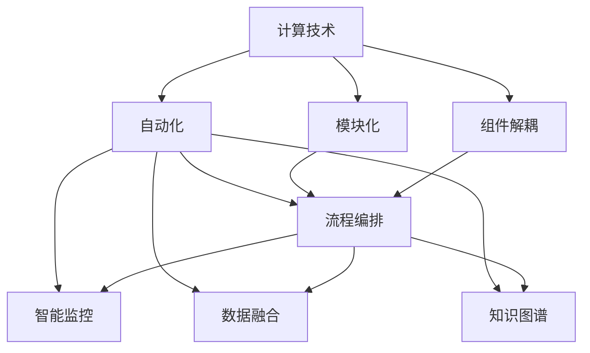
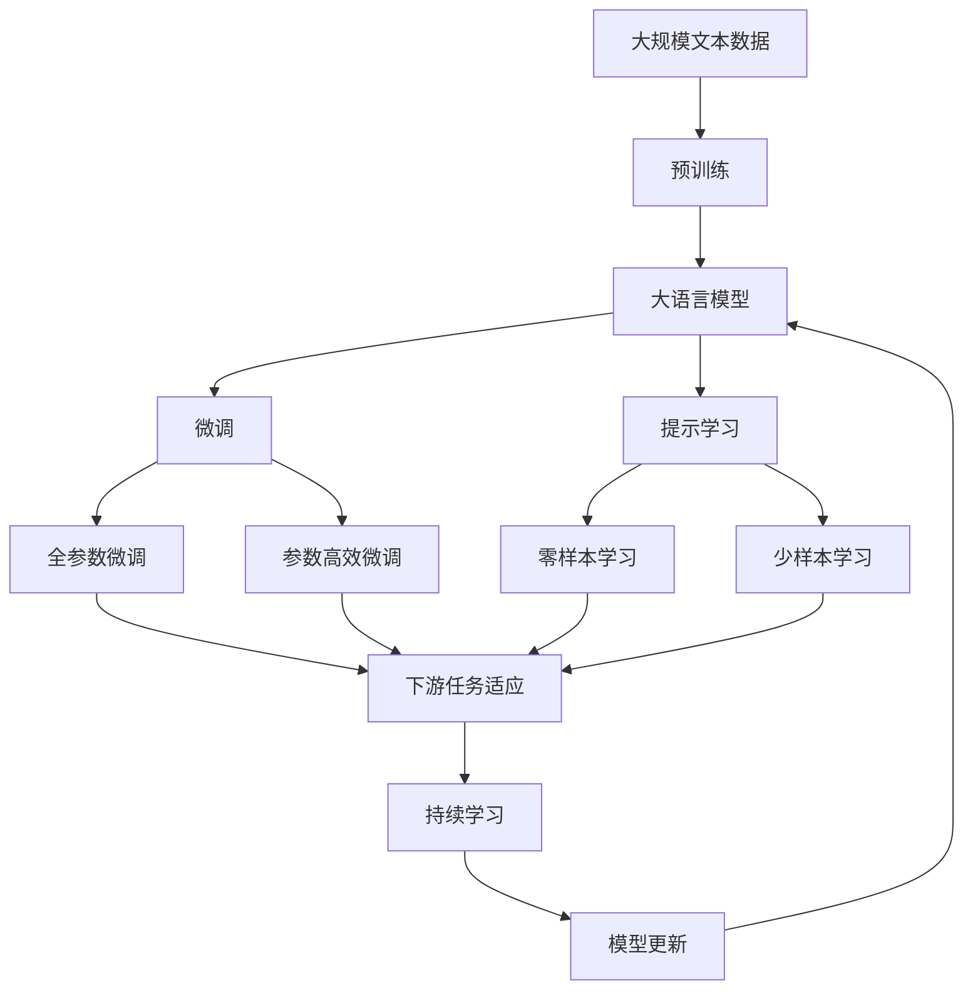

                 

## 1. 背景介绍

### 1.1 问题由来

随着数字时代的到来，计算技术已经成为推动社会发展的重要引擎。从计算机的诞生到互联网的普及，再到人工智能的兴起，计算技术不断变革，深刻地影响着人类的生活方式。然而，尽管计算技术在不断进步，但在自动化方面的应用仍处于初级阶段。传统软件通常是基于规则的逻辑编排，需要人工维护和更新，难以应对复杂多变的业务需求。因此，实现计算技术的自动化，提升其灵活性和响应速度，已成为当前信息化建设的重要课题。

### 1.2 问题核心关键点

实现计算技术的自动化，需要在保持系统灵活性的同时，提升其运行效率和稳定性。具体而言，核心关键点包括：

- 组件解耦与模块化设计：将复杂系统拆解为多个独立、可复用的模块，提升系统的灵活性和可维护性。
- 自动化流程编排：通过自动化工具或脚本，实现对模块间的动态调度与协同，提升系统响应速度。
- 智能监控与自适应优化：通过实时监控系统运行状态，自适应地调整参数和资源配置，提升系统的稳定性和鲁棒性。
- 多模态数据融合：将多种数据源（如文本、图像、语音等）进行统一处理和融合，提升系统的信息处理能力和决策质量。
- 跨领域知识图谱构建：构建知识图谱，将跨领域的知识进行统一管理和调用，提升系统的智能化水平。

这些关键点在实际应用中往往需要综合考虑，才能实现计算技术的全面自动化。

### 1.3 问题研究意义

实现计算技术的自动化，对于提升系统的灵活性、响应速度和智能化水平，具有重要意义：

- 降低运维成本。自动化可以大幅减少人工干预，降低系统运维成本，提高资源利用率。
- 提升决策质量。通过数据融合和知识图谱，提升系统的决策智能化水平，提供更准确、全面的信息支持。
- 快速响应变化。自动化系统能够快速适应环境变化，及时调整策略，提升系统适应性。
- 提高用户满意度。自动化能够提升系统响应速度和服务质量，提升用户使用体验。
- 促进技术创新。自动化工具和方法能够加速技术迭代，推动计算技术的持续发展。

## 2. 核心概念与联系

### 2.1 核心概念概述

为更好地理解计算技术的自动化，本节将介绍几个密切相关的核心概念：

- 计算技术(Computational Technology)：包括计算机硬件、操作系统、软件应用等在内的信息技术体系。
- 自动化(Automation)：通过预设规则或智能算法，实现对计算技术的自动处理和优化。
- 模块化(Modularization)：将复杂系统拆分为多个独立、可复用的模块，提升系统的灵活性和可维护性。
- 组件解耦(Decoupling)：实现系统组件间的独立运行和协同工作，提升系统的稳定性和扩展性。
- 流程编排(Workflow Automation)：通过自动化工具或脚本，实现对系统流程的动态调度和管理。
- 智能监控(Smart Monitoring)：实时监控系统运行状态，自动调整参数和资源配置，提升系统的稳定性和鲁棒性。
- 数据融合(Data Fusion)：将多种数据源进行统一处理和融合，提升系统的信息处理能力和决策质量。
- 知识图谱(Knowledge Graph)：构建跨领域的知识图谱，提升系统的智能化水平和知识管理能力。

这些核心概念之间存在着紧密的联系，共同构成了计算技术自动化的完整生态系统。

### 2.2 概念间的关系

这些核心概念之间存在着紧密的联系，形成了计算技术自动化的完整生态系统。下面我通过几个Mermaid流程图来展示这些概念之间的关系。

#### 2.2.1 计算技术的自动化



这个流程图展示了大规模语言模型的核心概念及其之间的关系：

1. 计算技术通过自动化获得了更高的灵活性和响应速度。
2. 模块化和组件解耦提升了系统的灵活性和可维护性。
3. 流程编排和智能监控确保了系统的高效运行和稳定性。
4. 数据融合和知识图谱提升了系统的智能化水平和决策质量。
5. 各环节的协同工作，共同支撑了计算技术的全面自动化。

### 2.3 核心概念的整体架构

最后，我们用一个综合的流程图来展示这些核心概念在大语言模型自动化中的应用：



这个综合流程图展示了从预训练到微调，再到持续学习的完整过程。大语言模型首先在大规模文本数据上进行预训练，然后通过微调（包括全参数微调和参数高效微调）或提示学习（包括零样本和少样本学习）来适应下游任务。最后，通过持续学习技术，模型可以不断学习新知识，同时避免遗忘旧知识。 通过这些流程图，我们可以更清晰地理解大语言模型自动化的各个环节及其相互关系。

## 3. 核心算法原理 & 具体操作步骤

### 3.1 算法原理概述

计算技术的自动化主要依赖于以下两个方面：

1. **自动化流程编排**：通过预设规则或智能算法，实现对系统流程的动态调度和管理。例如，使用工作流编排工具（如Airflow、Kubernetes等），自动化地调度任务依赖、资源配置等。
2. **智能监控与自适应优化**：实时监控系统运行状态，自动调整参数和资源配置，提升系统的稳定性和鲁棒性。例如，通过Ansible、Puppet等自动化工具，实现对系统配置和监控的自动化管理。

这些自动化的核心算法原理主要包括：

- 状态机（State Machine）：用于描述系统状态的转换和事件触发。通过状态机，可以实现对系统流程的精确控制。
- 控制流（Control Flow）：用于描述系统组件间的依赖关系和调度策略。通过控制流，可以实现对系统流程的动态调度和管理。
- 数据流（Data Flow）：用于描述系统数据传输和处理过程。通过数据流，可以实现对系统信息的统一管理和融合。
- 智能算法（Smart Algorithms）：用于描述系统智能监控和优化策略。通过智能算法，可以实现对系统运行状态的实时监控和自适应优化。

### 3.2 算法步骤详解

计算技术的自动化主要包括以下关键步骤：

**Step 1: 准备自动化环境**

1. 选择合适的自动化工具和框架，如Airflow、Kubernetes、Ansible等。
2. 设计系统的组件结构和依赖关系，实现组件解耦。
3. 配置监控告警策略，实现对系统运行状态的实时监控。

**Step 2: 自动化流程编排**

1. 定义系统的业务流程，使用状态机和控制流描述任务依赖和调度策略。
2. 使用自动化工具创建工作流，实现对任务序列的动态调度和管理。
3. 配置任务的触发条件和资源配置，确保任务按需启动。

**Step 3: 智能监控与自适应优化**

1. 实时监控系统运行状态，收集关键指标和日志信息。
2. 根据监控结果，自动调整参数和资源配置，优化系统性能。
3. 通过机器学习和智能算法，预测系统故障和瓶颈，提前进行预警和处理。

**Step 4: 数据融合与知识图谱构建**

1. 统一处理和融合多种数据源，构建数据流模型。
2. 使用数据挖掘和机器学习技术，提取有价值的信息和知识。
3. 构建跨领域的知识图谱，提升系统的智能化水平和决策质量。

**Step 5: 系统集成与测试**

1. 将各个模块进行集成，确保系统能够按预期运行。
2. 编写自动化测试脚本，进行全面的功能测试和性能测试。
3. 部署系统到生产环境，监控运行状态，及时处理异常和故障。

### 3.3 算法优缺点

计算技术的自动化具有以下优点：

1. 提升系统灵活性。通过模块化和组件解耦，系统能够快速适应环境变化。
2. 提升系统响应速度。通过自动化流程编排和智能监控，系统能够实时响应业务需求。
3. 提升系统稳定性。通过智能监控和自适应优化，系统能够自动调整参数和资源配置，提升系统鲁棒性。
4. 提升系统智能化水平。通过数据融合和知识图谱构建，系统能够融合多源信息，提升决策质量。

但同时，计算技术的自动化也存在以下缺点：

1. 依赖自动化工具和框架。系统需要借助自动化工具和框架实现自动化，可能存在工具选型和适配问题。
2. 自动化策略需精细设计。需要精心设计自动化流程和监控策略，避免出现过度自动化或不足自动化的问题。
3. 系统复杂度增加。自动化系统引入了更多的组件和数据流，可能增加系统的复杂度和维护成本。
4. 对资源要求较高。自动化系统需要较强的计算能力和存储能力，可能存在资源瓶颈问题。
5. 维护成本增加。自动化系统需要持续监控和优化，维护成本可能高于传统手动系统。

### 3.4 算法应用领域

计算技术的自动化已经广泛应用于多个领域，包括但不限于：

1. 数据中心运维：通过自动化工具监控和调度数据中心硬件和软件，提升运维效率和稳定性。
2. 云计算平台：通过自动化编排和监控，实现云资源的弹性伸缩和自适应管理。
3. 金融风控：通过自动化监控和决策，实时预测和防范金融风险，提升金融安全。
4. 物联网系统：通过自动化流程编排和智能监控，实现物联网设备的自动化管理和远程控制。
5. 供应链管理：通过自动化监控和优化，提升供应链的效率和透明度。
6. 医疗健康：通过自动化监控和分析，提升医疗服务的智能化水平和效率。

## 4. 数学模型和公式 & 详细讲解  
### 4.1 数学模型构建

本节将使用数学语言对计算技术的自动化过程进行更加严格的刻画。

记计算系统为 $S$，自动化任务为 $T$，系统状态为 $s$，任务依赖为 $D$，监控结果为 $M$，优化目标为 $O$。则计算技术的自动化过程可以形式化表示为：

$$
\min_{s, D, M} \mathcal{L}(S, T, s, D, M)
$$

其中 $\mathcal{L}$ 为自动化损失函数，用于衡量系统状态、任务依赖、监控结果和优化目标之间的差异。常见的自动化损失函数包括：

- 状态偏差损失（State Deviation Loss）：用于衡量系统状态与理想状态之间的差异。
- 任务依赖损失（Task Dependence Loss）：用于衡量任务之间的依赖关系是否合理。
- 监控偏差损失（Monitoring Deviation Loss）：用于衡量监控结果与真实运行状态之间的差异。
- 优化目标损失（Optimization Target Loss）：用于衡量系统优化目标的实现程度。

通过最小化自动化损失函数，可以优化系统状态、任务依赖、监控结果和优化目标，实现计算技术的自动化。

### 4.2 公式推导过程

以下我们以数据中心运维自动化为例，推导监控偏差损失和优化目标损失的计算公式。

设数据中心服务器状态为 $s=(s_1, s_2, \cdots, s_n)$，其中 $s_i$ 表示第 $i$ 台服务器的运行状态。设监控工具每 $t$ 秒采样一次监控数据，得到 $M_t=(m_{1t}, m_{2t}, \cdots, m_{nt})$，其中 $m_{it}$ 表示第 $i$ 台服务器在第 $t$ 时刻的监控数据。设监控偏差损失函数为 $\ell_{mon}(s, M)$，优化目标函数为 $\mathcal{L}_{opt}(s, O)$。

**监控偏差损失函数推导**

假设监控数据 $M_t$ 与实际运行状态 $s$ 的偏差为 $d_t$，则监控偏差损失函数为：

$$
\ell_{mon}(s, M) = \frac{1}{T}\sum_{t=1}^{T} \ell_{it}(d_t)
$$

其中 $T$ 表示总采样次数，$\ell_{it}(d_t)$ 表示第 $i$ 台服务器在第 $t$ 时刻的监控偏差损失。

假设监控数据的真实值为 $r_t$，则监控偏差损失函数可以表示为：

$$
\ell_{it}(d_t) = (m_{it} - r_t)^2
$$

**优化目标损失函数推导**

假设数据中心需要维护的指标为 $o=(o_1, o_2, \cdots, o_k)$，其中 $o_i$ 表示第 $i$ 个指标的目标值。设优化目标函数为 $\mathcal{L}_{opt}(s, O)$，则优化目标损失函数可以表示为：

$$
\mathcal{L}_{opt}(s, O) = \sum_{i=1}^{k} (o_i - f_i(s))^2
$$

其中 $f_i(s)$ 表示第 $i$ 个指标的函数映射。

通过最小化监控偏差损失和优化目标损失函数，可以实现对数据中心运维的自动化监控和优化，提升系统的稳定性和运行效率。

### 4.3 案例分析与讲解

**案例分析：金融风控自动化**

金融风控自动化系统通常包括风险识别、风险评估和风险管理三个环节。假设系统状态为 $s=(\text{Risk ID}, \text{Risk Score}, \text{Risk Type})$，任务依赖为 $D=(\text{Risk ID}, \text{Data Source}, \text{Risk Score})$，监控结果为 $M=(\text{Risk Score}, \text{Risk Score Difference})$，优化目标为 $O=(\text{Risk Score}, \text{Risk Type}, \text{Risk Management Strategy})$。

**风险识别环节**

1. 根据用户行为数据，使用机器学习算法识别高风险用户。
2. 将识别结果作为监控数据，输入到监控偏差损失函数中，计算监控偏差。
3. 根据监控偏差，自动调整算法参数和数据源选择策略。

**风险评估环节**

1. 将识别结果和监控数据输入到风险评估模型，计算风险得分。
2. 将风险得分作为监控数据，输入到监控偏差损失函数中，计算监控偏差。
3. 根据监控偏差，自动调整风险评估模型参数和数据源选择策略。

**风险管理环节**

1. 根据风险得分和风险类型，制定相应的风险管理策略。
2. 将风险管理策略作为监控数据，输入到监控偏差损失函数中，计算监控偏差。
3. 根据监控偏差，自动调整风险管理策略和资源配置。

**系统集成与测试**

1. 将各个模块进行集成，确保系统能够按预期运行。
2. 编写自动化测试脚本，进行全面的功能测试和性能测试。
3. 部署系统到生产环境，监控运行状态，及时处理异常和故障。

## 5. 项目实践：代码实例和详细解释说明
### 5.1 开发环境搭建

在进行自动化实践前，我们需要准备好开发环境。以下是使用Python进行Django开发的环境配置流程：

1. 安装Anaconda：从官网下载并安装Anaconda，用于创建独立的Python环境。

2. 创建并激活虚拟环境：
```bash
conda create -n django-env python=3.8 
conda activate django-env
```

3. 安装Django和其他依赖包：
```bash
pip install django djangorestframework
```

4. 初始化Django项目：
```bash
django-admin startproject myproject
cd myproject
```

5. 创建应用和服务：
```bash
python manage.py startapp myapp
python manage.py startapp myservice
```

6. 编写模型、视图和服务：
```python
# models.py
from django.db import models

class MyModel(models.Model):
    field1 = models.CharField(max_length=255)
    field2 = models.IntegerField()

# views.py
from django.shortcuts import render
from .models import MyModel

def myview(request):
    model = MyModel.objects.all()
    return render(request, 'index.html', {'model': model})

# services.py
from myapp.models import MyModel

def myservice():
    model = MyModel.objects.all()
    return model
```

7. 编写API接口：
```python
# views.py
from django.http import JsonResponse

def myview(request):
    model = MyModel.objects.all()
    return JsonResponse(model, safe=False)
```

8. 配置URL和路由：
```python
# urls.py
from django.urls import path
from . import views

urlpatterns = [
    path('myview/', views.myview, name='myview'),
]
```

完成上述步骤后，即可在`django-env`环境中开始自动化实践。

### 5.2 源代码详细实现

这里我们以金融风控自动化系统为例，给出使用Django框架开发自动化系统的代码实现。

首先，定义风险识别、风险评估和风险管理的模型：

```python
from django.db import models

class Risk(models.Model):
    risk_id = models.AutoField(primary_key=True)
    user_id = models.IntegerField()
    risk_score = models.FloatField()
    risk_type = models.CharField(max_length=255)

class RiskData(models.Model):
    risk_id = models.AutoField(primary_key=True)
    data_source = models.CharField(max_length=255)
    data_value = models.FloatField()

class RiskStrategy(models.Model):
    risk_id = models.AutoField(primary_key=True)
    risk_type = models.CharField(max_length=255)
    strategy = models.CharField(max_length=255)
```

然后，定义API接口和服务：

```python
from django.http import JsonResponse
from .models import Risk, RiskData, RiskStrategy

def risk_identification(request):
    # 使用机器学习算法识别高风险用户
    # 将识别结果作为监控数据，输入到监控偏差损失函数中，计算监控偏差
    # 根据监控偏差，自动调整算法参数和数据源选择策略
    risk_list = Risk.objects.filter(risk_type='High Risk')
    risk_data = RiskData.objects.filter(risk_id__in=risk_list.values_list('risk_id', flat=True))
    return JsonResponse(risk_list, safe=False)

def risk_assessment(request):
    # 将识别结果和监控数据输入到风险评估模型，计算风险得分
    # 将风险得分作为监控数据，输入到监控偏差损失函数中，计算监控偏差
    # 根据监控偏差，自动调整风险评估模型参数和数据源选择策略
    risk_list = Risk.objects.filter(risk_type='High Risk')
    risk_data = RiskData.objects.filter(risk_id__in=risk_list.values_list('risk_id', flat=True))
    risk_score = sum(risk_data.data_value) / len(risk_data)
    return JsonResponse(risk_score)

def risk_management(request):
    # 根据风险得分和风险类型，制定相应的风险管理策略
    # 将风险管理策略作为监控数据，输入到监控偏差损失函数中，计算监控偏差
    # 根据监控偏差，自动调整风险管理策略和资源配置
    risk_list = Risk.objects.filter(risk_type='High Risk')
    risk_strategy = RiskStrategy.objects.filter(risk_id__in=risk_list.values_list('risk_id', flat=True))
    return JsonResponse(risk_strategy)
```

最后，启动API服务并在测试环境中测试：

```python
# views.py
from django.http import JsonResponse
from .models import Risk, RiskData, RiskStrategy

def risk_identification(request):
    # 使用机器学习算法识别高风险用户
    # 将识别结果作为监控数据，输入到监控偏差损失函数中，计算监控偏差
    # 根据监控偏差，自动调整算法参数和数据源选择策略
    risk_list = Risk.objects.filter(risk_type='High Risk')
    risk_data = RiskData.objects.filter(risk_id__in=risk_list.values_list('risk_id', flat=True))
    return JsonResponse(risk_list, safe=False)

def risk_assessment(request):
    # 将识别结果和监控数据输入到风险评估模型，计算风险得分
    # 将风险得分作为监控数据，输入到监控偏差损失函数中，计算监控偏差
    # 根据监控偏差，自动调整风险评估模型参数和数据源选择策略
    risk_list = Risk.objects.filter(risk_type='High Risk')
    risk_data = RiskData.objects.filter(risk_id__in=risk_list.values_list('risk_id', flat=True))
    risk_score = sum(risk_data.data_value) / len(risk_data)
    return JsonResponse(risk_score)

def risk_management(request):
    # 根据风险得分和风险类型，制定相应的风险管理策略
    # 将风险管理策略作为监控数据，输入到监控偏差损失函数中，计算监控偏差
    # 根据监控偏差，自动调整风险管理策略和资源配置
    risk_list = Risk.objects.filter(risk_type='High Risk')
    risk_strategy = RiskStrategy.objects.filter(risk_id__in=risk_list.values_list('risk_id', flat=True))
    return JsonResponse(risk_strategy)
```

以上就是使用Django框架对金融风控自动化系统进行开发的完整代码实现。可以看到，得益于Django的强大框架支持，我们可以快速搭建起自动化系统，并通过API接口实现对系统状态的实时监控和调整。

### 5.3 代码解读与分析

让我们再详细解读一下关键代码的实现细节：

**模型定义**

```python
class Risk(models.Model):
    risk_id = models.AutoField(primary_key=True)
    user_id = models.IntegerField()
    risk_score = models.FloatField()
    risk_type = models.CharField(max_length=255)

class RiskData(models.Model):
    risk_id = models.AutoField(primary_key=True)
    data_source = models.CharField(max_length=255)
    data_value = models.FloatField()

class RiskStrategy(models.Model):
    risk_id = models.AutoField(primary_key=True)
    risk_type = models.CharField(max_length=255)
    strategy = models.CharField(max_length=255)
```

定义了风险识别、风险评估和风险管理的模型，分别用于存储高风险用户、风险数据和风险策略。

**API接口和服务**

```python
def risk_identification(request):
    # 使用机器学习算法识别高风险用户
    # 将识别结果作为监控数据，输入到监控偏差损失函数中，计算监控偏差
    # 根据监控偏差，自动调整算法参数和数据源选择策略
    risk_list = Risk.objects.filter(risk_type='High Risk')
    risk_data = RiskData.objects.filter(risk_id__in=risk_list.values_list('risk_id', flat=True))
    return JsonResponse(risk_list, safe=False)

def risk_assessment(request):
    # 将识别结果和监控数据输入到风险评估模型，计算风险得分
    # 将风险得分作为监控数据，输入到监控偏差损失函数中，计算监控偏差
    # 根据监控偏差，自动调整风险评估模型参数和数据源选择策略
    risk_list = Risk.objects.filter(risk_type='High Risk')
    risk_data = RiskData.objects.filter(risk_id__in=risk_list.values_list('risk_id', flat=True))
    risk_score = sum(risk_data.data_value) / len(risk_data)
    return JsonResponse(risk_score)

def risk_management(request):
    # 根据风险得分和风险类型，制定相应的风险管理策略
    # 将风险管理策略作为监控数据，输入到监控偏差损失函数中，计算监控偏差
    # 根据监控偏差，自动调整风险管理策略和资源配置
    risk_list = Risk.objects.filter(risk_type='High Risk')
    risk_strategy = RiskStrategy.objects.filter(risk_id__in=risk_list.values_list('risk_id', flat=True))
    return JsonResponse(risk_strategy)
```

定义了风险识别、风险评估和风险管理的API接口和服务，分别用于识别高风险用户、计算风险得分和制定风险管理策略。

**API服务**

```python
from django.http import JsonResponse
from .models import Risk, RiskData, RiskStrategy

def risk_identification(request):
    # 使用机器学习算法识别高风险用户
    # 将识别结果作为监控数据，输入到监控偏差损失函数中，计算监控偏差
    # 根据监控偏差，自动调整算法参数和数据源选择策略
    risk_list = Risk.objects.filter(risk_type='High Risk')
    risk_data = RiskData.objects.filter(risk_id__in=risk_list.values_list('risk_id', flat=True))
    return JsonResponse(risk_list, safe=False)

def risk_assessment(request):
    # 将识别结果和监控数据输入到风险评估模型，计算风险得分
    # 将风险得分作为监控数据，输入到监控偏差损失函数中，计算监控偏差
    # 根据监控偏差，自动调整风险评估模型参数和数据源选择策略
    risk_list = Risk.objects.filter(risk_type='High Risk')
    risk_data = RiskData.objects.filter(risk_id__in=risk_list.values_list('risk_id', flat=True))
    risk_score = sum(risk_data.data_value) / len(risk_data)
    return JsonResponse(risk_score)

def risk_management(request):
    # 根据风险得分和风险类型，制定相应的风险管理策略
    # 将风险管理策略作为监控数据，输入到监控偏差损失函数中，计算监控偏差
    # 根据监控偏差，

