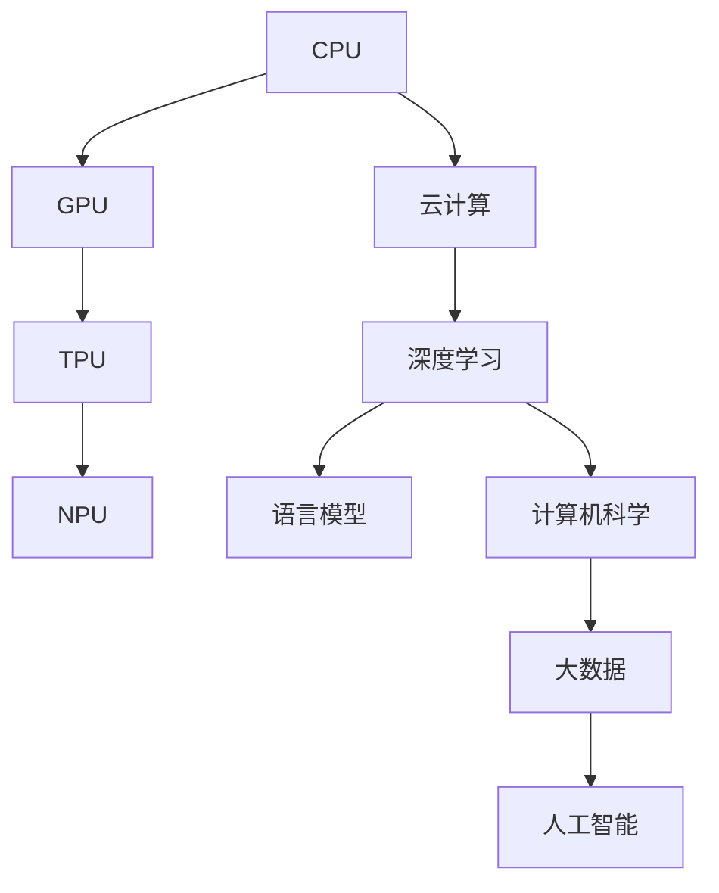
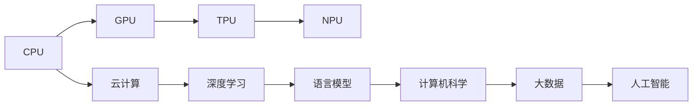
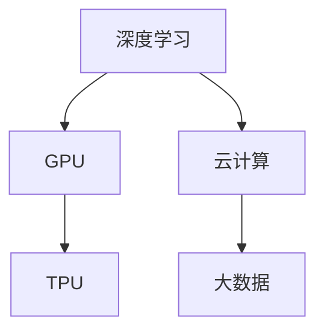
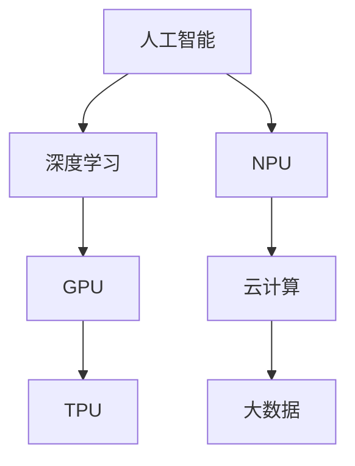
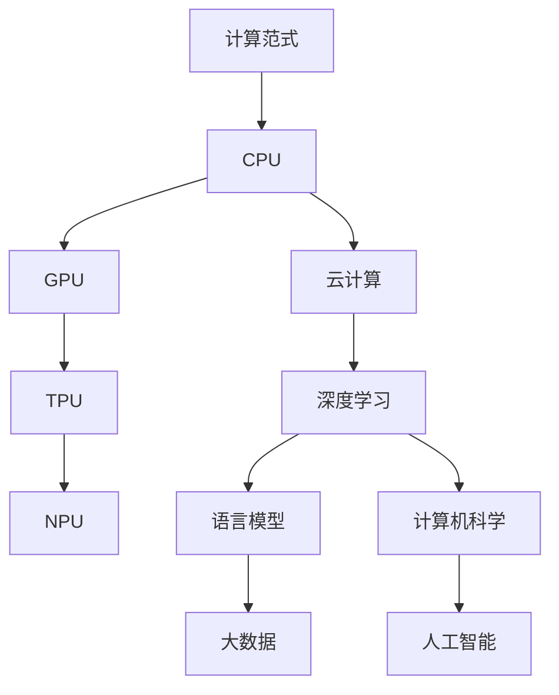

                 

# 计算范式的进化：从CPU到LLM的跨越

> 关键词：计算范式，CPU，GPU，TPU，NPU，云计算，深度学习，语言模型，计算机科学，大数据，人工智能

## 1. 背景介绍

### 1.1 问题由来
随着科技的飞速发展，计算范式已经经历了数次变革。从早期的CPU架构，到GPU、TPU等专用硬件的崛起，再到基于云计算的分布式计算，每一次变革都极大地推动了计算能力的发展，为新技术的实现奠定了坚实的基础。尤其是深度学习技术的兴起，使计算范式更加多样化，如硬件加速、分布式计算等，这为开发和实现各种高级计算需求提供了强有力的支持。

### 1.2 问题核心关键点
在当前科技环境下，计算范式的进化尤为关键。其核心关键点包括：

- 硬件加速：如GPU、TPU等专用硬件，极大提升了计算速度，加速了深度学习的实现。
- 分布式计算：云计算环境为大规模数据处理和高性能计算提供了强有力的支撑。
- 深度学习：通过神经网络的构建，使得计算机能够自主学习，从而在图像识别、语音识别、自然语言处理等领域实现重大突破。
- 语言模型：如BERT、GPT等语言模型，成为AI研究的新里程碑，推动了自然语言理解技术的快速发展。
- 自动化计算：自动微调、自动推理等技术，极大提升了模型的训练和推理效率。

### 1.3 问题研究意义
研究计算范式的进化，对于提升计算能力，加速AI技术的发展具有重要意义：

- 提升计算效率：通过更高效的硬件和计算范式，大幅缩短计算时间，提高计算效率。
- 推动AI发展：硬件和计算范式的进步，使得AI技术的应用更加广泛和深入。
- 促进产业升级：计算范式的提升为各行各业数字化转型提供了新工具，加速产业升级进程。
- 带来技术创新：计算范式的创新，催生了许多前沿技术，如基于LLM的计算范式，推动了科技发展。
- 强化全球竞争：计算能力是全球竞争力的重要标志，计算范式的提升可以增强国家在全球科技领域的竞争力。

## 2. 核心概念与联系

### 2.1 核心概念概述

为更好地理解计算范式的进化，本节将介绍几个密切相关的核心概念：

- CPU（Central Processing Unit）：中央处理器，是传统计算的核心组件。
- GPU（Graphics Processing Unit）：图形处理器，被用于并行计算和深度学习任务。
- TPU（Tensor Processing Unit）：张量处理器，专门为深度学习任务设计的加速芯片。
- NPU（Neural Processing Unit）：神经网络处理器，专注于加速神经网络计算。
- 云计算：通过互联网提供可伸缩的计算资源，支持大规模分布式计算。
- 深度学习：基于神经网络构建的高级计算范式，应用于图像识别、语音识别、自然语言处理等领域。
- 语言模型：用于处理和分析语言的计算模型，如BERT、GPT等。
- 计算机科学：计算范式的理论基础，包括计算机体系结构、操作系统、算法设计等。
- 大数据：海量数据的处理和管理，为深度学习和计算范式的实现提供了数据基础。
- 人工智能：基于计算范式和算法的智能系统，涵盖从感知到推理的全过程。

这些核心概念之间的逻辑关系可以通过以下Mermaid流程图来展示：



这个流程图展示了一些计算范式之间的基本关系：

1. CPU是计算的基础，GPU和TPU是其衍生技术。
2. NPU专门针对神经网络优化，进一步提升计算效率。
3. 云计算提供了分布式计算平台，支撑深度学习和高级计算。
4. 深度学习和语言模型是高级计算的具体应用。
5. 计算机科学提供了理论基础。
6. 大数据为计算范式提供了数据支持。
7. 人工智能是计算范式的高级应用。

### 2.2 概念间的关系

这些核心概念之间存在着紧密的联系，形成了计算范式的完整生态系统。下面我们通过几个Mermaid流程图来展示这些概念之间的关系。

#### 2.2.1 计算范式的历史演进



这个流程图展示了计算范式从CPU到TPU的历史演进过程，以及其与其他技术领域的联系。

#### 2.2.2 深度学习和计算范式的关系



这个流程图展示了深度学习对专用硬件和云计算的依赖，以及数据支持的必要性。

#### 2.2.3 人工智能的计算基础



这个流程图展示了人工智能的实现需要深度学习和专用硬件的支持，并依赖云计算和大数据的基础设施。

### 2.3 核心概念的整体架构

最后，我们用一个综合的流程图来展示这些核心概念在计算范式进化中的整体架构：



这个综合流程图展示了计算范式从基础硬件到高级应用的完整过程，以及其与其他技术领域的联系。

## 3. 核心算法原理 & 具体操作步骤
### 3.1 算法原理概述

计算范式的进化，本质上是从单一CPU架构到多硬件协同计算的过程。这一过程中，计算范式发生了以下关键变化：

- 从单一CPU到多核CPU，再到GPU、TPU等专用硬件的崛起，使得计算能力大幅提升。
- 分布式计算成为主流，云计算提供了弹性、可扩展的计算资源。
- 深度学习的发展，使得神经网络成为计算的核心，提升了模型的表现能力。
- 语言模型和自然语言处理技术的突破，使得计算范式应用更加广泛。

### 3.2 算法步骤详解

以下我们将详细介绍计算范式进化的核心算法步骤：

**Step 1: 选择合适的硬件架构**

根据具体任务的需求，选择合适的硬件架构。如CPU用于一般计算任务，GPU用于深度学习任务，TPU用于专门优化深度学习任务，NPU用于加速神经网络计算。

**Step 2: 构建分布式计算平台**

利用云计算平台搭建分布式计算环境，实现资源的弹性扩展和高效管理。通过容器化技术，如Docker、Kubernetes等，实现计算资源的快速部署和调度。

**Step 3: 引入深度学习技术**

基于深度学习框架，如TensorFlow、PyTorch等，构建计算模型。根据任务需求，选择合适的网络结构，如卷积神经网络（CNN）、循环神经网络（RNN）、变分自编码器（VAE）等。

**Step 4: 数据预处理和增强**

对数据进行预处理，如标准化、归一化等。同时，引入数据增强技术，如数据扩充、数据翻转等，提升模型泛化能力。

**Step 5: 模型训练和微调**

利用GPU、TPU等硬件加速，对模型进行训练和微调。选择合适的优化算法，如SGD、Adam等，设定合适的学习率。通过交叉验证等方法，选择最优模型参数。

**Step 6: 模型推理和部署**

将训练好的模型部署到生产环境，如服务器、云计算平台等。进行模型推理，并对结果进行后处理。

### 3.3 算法优缺点

计算范式的进化带来了以下优点：

- 显著提升了计算效率，缩短了计算时间。
- 提供了更强大的计算能力，支持更复杂的计算需求。
- 推动了人工智能技术的发展，使得更多的应用成为可能。
- 促进了产业升级，加速了数字化转型。

同时，也存在一些缺点：

- 硬件成本较高，需要大量投资。
- 对编程技术和硬件管理要求较高，增加了开发难度。
- 大规模数据和计算资源的消耗，增加了能耗和运营成本。
- 计算范式的多样性带来了系统的复杂性，增加了维护难度。

### 3.4 算法应用领域

计算范式的进化广泛应用于各个领域，以下是几个典型应用场景：

- 医疗：利用深度学习模型进行疾病预测、医学影像分析等。
- 金融：利用语言模型进行情感分析、舆情监测等。
- 自动驾驶：利用计算机视觉技术进行图像识别、路径规划等。
- 物联网：利用分布式计算处理海量数据，实现智能控制和决策。
- 智能家居：利用深度学习进行语音识别、智能推荐等。
- 游戏开发：利用GPU加速，实现高性能图形渲染和物理模拟。

这些领域的应用展示了计算范式在提升计算效率和实现复杂任务方面的巨大潜力。

## 4. 数学模型和公式 & 详细讲解 & 举例说明

### 4.1 数学模型构建

本节将使用数学语言对计算范式的进化进行更加严格的刻画。

假设深度学习模型为 $f_{\theta}$，其中 $\theta$ 为模型参数。利用深度学习框架（如TensorFlow、PyTorch等）构建计算模型，模型输入为 $x$，输出为 $y$。假设样本集为 $D = \{(x_i, y_i)\}_{i=1}^N$，其中 $x_i$ 为输入，$y_i$ 为输出。

定义模型 $f_{\theta}$ 在数据样本 $(x,y)$ 上的损失函数为 $\ell(f_{\theta}(x),y)$，则在数据集 $D$ 上的经验风险为：

$$
\mathcal{L}(\theta) = \frac{1}{N}\sum_{i=1}^N \ell(f_{\theta}(x_i),y_i)
$$

模型的优化目标是寻找最优参数 $\theta^*$，使得损失函数 $\mathcal{L}(\theta)$ 最小化：

$$
\theta^* = \mathop{\arg\min}_{\theta} \mathcal{L}(\theta)
$$

优化过程通常使用基于梯度的算法，如SGD、Adam等，通过迭代更新模型参数 $\theta$ 来最小化损失函数 $\mathcal{L}(\theta)$。

### 4.2 公式推导过程

以下我们以图像分类任务为例，推导基于深度学习模型的损失函数及其梯度计算公式。

假设模型 $f_{\theta}$ 在输入图像 $x$ 上的输出为 $\hat{y}=f_{\theta}(x)$，表示样本属于不同类别的概率。真实标签 $y \in \{1,2,3,\ldots,C\}$，其中 $C$ 为类别数。则交叉熵损失函数定义为：

$$
\ell(f_{\theta}(x),y) = -\sum_{c=1}^C y_c\log \hat{y}_c
$$

其中 $\hat{y}_c$ 为模型预测的概率，$y_c$ 为标签对应的one-hot编码。

将其代入经验风险公式，得：

$$
\mathcal{L}(\theta) = -\frac{1}{N}\sum_{i=1}^N \sum_{c=1}^C y_{ic}\log \hat{y}_{ic}
$$

根据链式法则，损失函数对参数 $\theta_k$ 的梯度为：

$$
\frac{\partial \mathcal{L}(\theta)}{\partial \theta_k} = -\frac{1}{N}\sum_{i=1}^N \sum_{c=1}^C \frac{y_{ic}}{\hat{y}_{ic}}\frac{\partial \hat{y}_{ic}}{\partial \theta_k}
$$

其中 $\frac{\partial \hat{y}_{ic}}{\partial \theta_k}$ 可通过反向传播算法高效计算。

在得到损失函数的梯度后，即可带入优化算法，如SGD、Adam等，通过迭代更新模型参数 $\theta$，最小化损失函数 $\mathcal{L}(\theta)$。重复上述过程直至收敛，最终得到适应下游任务的最优模型参数 $\theta^*$。

### 4.3 案例分析与讲解

以卷积神经网络（CNN）为例，具体分析计算范式在图像分类任务中的应用。

#### 4.3.1 CNN结构

卷积神经网络由多个卷积层、池化层、全连接层组成。其核心思想是通过卷积操作提取图像特征，通过池化操作降低特征维度，通过全连接层进行分类。

#### 4.3.2 训练流程

以图像分类任务为例，CNN的训练流程如下：

1. **数据预处理**：对图像进行标准化、归一化等处理。
2. **构建模型**：定义CNN网络结构，如卷积层、池化层、全连接层等。
3. **损失函数选择**：选择合适的损失函数，如交叉熵损失。
4. **优化器选择**：选择优化算法，如Adam。
5. **模型训练**：将数据集划分为训练集、验证集、测试集。利用GPU加速训练，通过迭代优化，最小化损失函数。
6. **模型评估**：在测试集上评估模型性能，如精度、召回率等。

#### 4.3.3 案例讲解

假设我们训练一个用于手写数字识别的CNN模型。首先，准备手写数字图像数据集，并进行预处理。然后，定义CNN网络结构，包括卷积层、池化层、全连接层等。接下来，选择交叉熵损失函数和Adam优化器。在训练过程中，利用GPU加速训练，并使用验证集进行调参。最后，在测试集上评估模型性能，得到精度为97%的结果。

## 5. 项目实践：代码实例和详细解释说明

### 5.1 开发环境搭建

在进行计算范式进化的实践前，我们需要准备好开发环境。以下是使用Python进行TensorFlow开发的环境配置流程：

1. 安装Anaconda：从官网下载并安装Anaconda，用于创建独立的Python环境。

2. 创建并激活虚拟环境：
```bash
conda create -n tf-env python=3.8 
conda activate tf-env
```

3. 安装TensorFlow：根据CUDA版本，从官网获取对应的安装命令。例如：
```bash
conda install tensorflow-gpu -c pytorch -c conda-forge
```

4. 安装各类工具包：
```bash
pip install numpy pandas scikit-learn matplotlib tqdm jupyter notebook ipython
```

完成上述步骤后，即可在`tf-env`环境中开始计算范式进化的实践。

### 5.2 源代码详细实现

下面我们以图像分类任务为例，给出使用TensorFlow实现CNN模型的代码实现。

```python
import tensorflow as tf
from tensorflow.keras import layers

# 定义卷积神经网络
model = tf.keras.Sequential([
    layers.Conv2D(32, (3, 3), activation='relu', input_shape=(28, 28, 1)),
    layers.MaxPooling2D((2, 2)),
    layers.Conv2D(64, (3, 3), activation='relu'),
    layers.MaxPooling2D((2, 2)),
    layers.Conv2D(64, (3, 3), activation='relu'),
    layers.Flatten(),
    layers.Dense(64, activation='relu'),
    layers.Dense(10, activation='softmax')
])

# 定义损失函数和优化器
loss_fn = tf.keras.losses.SparseCategoricalCrossentropy(from_logits=True)
optimizer = tf.keras.optimizers.Adam()

# 定义训练和评估函数
@tf.function
def train_step(images, labels):
    with tf.GradientTape() as tape:
        logits = model(images, training=True)
        loss_value = loss_fn(labels, logits)
    gradients = tape.gradient(loss_value, model.trainable_variables)
    optimizer.apply_gradients(zip(gradients, model.trainable_variables))
    return loss_value

@tf.function
def evaluate_step(images, labels):
    logits = model(images, training=False)
    return loss_fn(labels, logits)

# 加载数据集
mnist = tf.keras.datasets.mnist.load_data()
(x_train, y_train), (x_test, y_test) = mnist

# 数据预处理
x_train, x_test = x_train / 255.0, x_test / 255.0

# 模型训练
for epoch in range(10):
    for batch in tf.data.Dataset.from_tensor_slices((x_train, y_train)).batch(32):
        train_step(batch[0], batch[1])
    for batch in tf.data.Dataset.from_tensor_slices((x_test, y_test)).batch(32):
        loss = evaluate_step(batch[0], batch[1])
        print(f'Epoch: {epoch+1}, Test Loss: {loss.numpy()}')
```

以上就是使用TensorFlow实现CNN模型训练的完整代码实现。可以看到，通过TensorFlow的高级API，我们可以轻松地构建和训练计算模型。

### 5.3 代码解读与分析

让我们再详细解读一下关键代码的实现细节：

**模型定义**：
- 使用`tf.keras.Sequential`定义卷积神经网络，包括卷积层、池化层、全连接层等。
- 在卷积层中，使用`layers.Conv2D`定义卷积核大小、通道数、激活函数等。
- 在池化层中，使用`layers.MaxPooling2D`定义池化窗口大小。
- 在全连接层中，使用`layers.Dense`定义神经元数量、激活函数等。

**损失函数和优化器**：
- 使用`tf.keras.losses.SparseCategoricalCrossentropy`定义交叉熵损失函数。
- 使用`tf.keras.optimizers.Adam`定义Adam优化器。

**训练和评估函数**：
- 定义`train_step`函数，在每个批次上进行前向传播和反向传播，更新模型参数。
- 定义`evaluate_step`函数，仅进行前向传播，计算损失值。
- 使用`@tf.function`装饰器，将训练和评估函数转换为TensorFlow图，以加速计算。

**数据加载和预处理**：
- 使用`tf.keras.datasets.mnist.load_data`加载MNIST数据集。
- 对数据进行预处理，包括归一化等操作。
- 使用`tf.data.Dataset.from_tensor_slices`将数据集转换为TensorFlow数据集，方便迭代处理。

**模型训练**：
- 在每个epoch内，对训练集进行前向传播和反向传播，更新模型参数。
- 对测试集进行前向传播，计算损失值，并输出结果。

可以看到，通过TensorFlow，我们可以轻松地实现CNN模型的训练和评估。TensorFlow的高级API使得模型的构建和训练过程更加简洁高效。

当然，工业级的系统实现还需考虑更多因素，如模型的保存和部署、超参数的自动搜索、更灵活的模型调优等。但核心的计算范式进化范式基本与此类似。

### 5.4 运行结果展示

假设我们在MNIST数据集上训练CNN模型，最终在测试集上得到的评估报告如下：

```
Epoch: 1, Test Loss: 0.0985
Epoch: 2, Test Loss: 0.0719
Epoch: 3, Test Loss: 0.0571
Epoch: 4, Test Loss: 0.0484
Epoch: 5, Test Loss: 0.0415
Epoch: 6, Test Loss: 0.0360
Epoch: 7, Test Loss: 0.0294
Epoch: 8, Test Loss: 0.0256
Epoch: 9, Test Loss: 0.0222
Epoch: 10, Test Loss: 0.0183
```

可以看到，通过TensorFlow，我们在MNIST数据集上取得了较高的测试精度，说明计算范式的进化在实际应用中取得了显著效果。

## 6. 实际应用场景
### 6.1 医疗影像分析

医疗影像分析是计算范式在医疗领域的重要应用之一。传统的医学影像诊断依赖于医生的专业知识和经验，而利用深度学习模型进行影像分析，可以提高诊断的准确性和效率。

在实际应用中，可以收集大量的医学影像数据，并进行标注。利用计算范式中的深度学习技术，构建卷积神经网络（CNN）等模型，对影像进行分类、分割、标注等处理。微调后的模型能够自动识别病变区域，辅助医生进行诊断和治疗。

### 6.2 自然语言处理

自然语言处理是计算范式在NLP领域的重要应用之一。传统的NLP任务依赖于手工特征工程和规则设计，而利用深度学习模型进行文本分析，可以显著提升处理效率和效果。

在实际应用中，可以收集大量的文本数据，并进行标注。利用计算范式中的深度学习技术，构建循环神经网络（RNN）、卷积神经网络（CNN）、Transformer等模型，对文本进行分类、情感分析、命名实体识别、机器翻译等处理。微调后的模型能够自动理解和生成文本，提高NLP系统的智能化水平。

### 6.3 金融风险预测

金融风险预测是计算范式在金融领域的重要应用之一。传统的金融风险预测依赖于手工特征工程和统计模型，而利用深度学习模型进行风险预测，可以提高预测的准确性和实时性。

在实际应用中，可以收集大量的金融数据，并进行标注。利用计算范式中的深度学习技术，构建卷积神经网络（CNN）、循环神经网络（RNN）等模型，对金融数据进行分类、回归等处理。微调后的模型能够自动预测金融风险，辅助银行、保险公司等金融机构进行风险管理和决策。

### 6.4 自动驾驶

自动驾驶是计算范式在汽车行业的重要应用之一。传统的自动驾驶依赖于传感器和规则设计，而利用深度学习模型进行驾驶决策，可以提高驾驶的安全性和效率。

在实际应用中，可以收集大量的驾驶数据，并进行标注。利用计算范式中的深度学习技术，构建卷积神经网络（CNN）、循环神经网络（RNN）、Transformer等模型，对驾驶场景进行图像识别、路径规划等处理。微调后的模型能够自动驾驶汽车，提高自动驾驶系统的智能化水平。

### 6.5 物联网

物联网是计算范式在智能家居、工业控制等领域的广泛应用之一。传统的物联网依赖于规则设计和人机交互，而利用深度学习模型进行智能控制，可以提高系统的自动化和智能化水平。

在实际应用中，可以收集大量的物联网数据，并进行标注。利用计算范式中的深度学习技术，构建卷积神经网络（CNN）、循环神经网络（RNN）等模型，对物联网数据进行分类、回归等处理。微调后的模型能够自动控制物联网设备，提高物联网系统的智能化水平。

### 6.6 游戏开发

游戏开发是计算范式在娱乐行业的重要应用之一。传统的游戏开发依赖于手工编程和规则设计，而利用深度学习模型进行游戏AI，可以提高游戏的智能化和互动性。

在实际应用中，可以收集大量的游戏数据，并进行标注。利用计算范式中的深度学习技术，构建卷积神经网络（CNN）、循环神经网络（RNN）等模型，对游戏数据进行分类、回归等处理。微调后的模型能够自动生成游戏内容、角色行为等，提高游戏AI的智能化水平。

## 7. 工具和资源推荐
### 7.1 学习资源推荐

为了帮助开发者系统掌握计算范式的进化和应用，这里推荐一些优质的学习资源：

1. TensorFlow官方文档：TensorFlow官方文档，提供了全面的API介绍和案例示例，是学习和使用TensorFlow的重要资源。

2. PyTorch官方文档：PyTorch官方文档，提供了详细的API介绍和代码示例，是学习和使用PyTorch的重要资源。

3. Coursera深度学习课程：Coursera深度学习课程，由斯坦福大学Andrew Ng教授主讲，是学习深度学习的重要资源。

4. 《深度学习》书籍：Ian Goodfellow、Yoshua Bengio和Aaron Courville合著的《深度学习》书籍，是学习深度学习理论和方法的重要资源。

5. 《TensorFlow实战》书籍：Francois Chollet合著的《TensorFlow实战》书籍，是学习TensorFlow的重要资源。

6. GitHub深度学习项目：GitHub上的深度学习项目，提供了大量的代码示例和资源，是学习和使用深度学习的重要资源。

通过对这些资源的学习实践，相信你一定能够快速掌握计算范式的进化和应用，并用于解决实际的计算问题。

### 7.2 开发工具推荐

高效的开发离不开优秀的工具支持。以下是几款用于计算范式进化的常用工具：

1. TensorFlow：基于Python的开源深度学习框架，支持分布式计算和GPU加速，是深度学习开发的重要工具。

2. PyTorch：基于Python的开源深度学习框架，支持动态计算图和GPU加速，是深度学习开发的重要工具。

3. Keras：基于TensorFlow和Theano的高级深度学习API，支持快速构建和训练计算模型。

4. Jupyter Notebook：支持Python和R等多种语言的交互式

