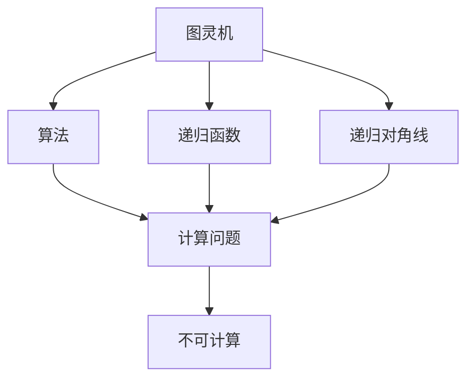
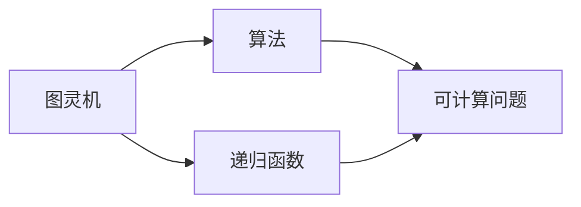
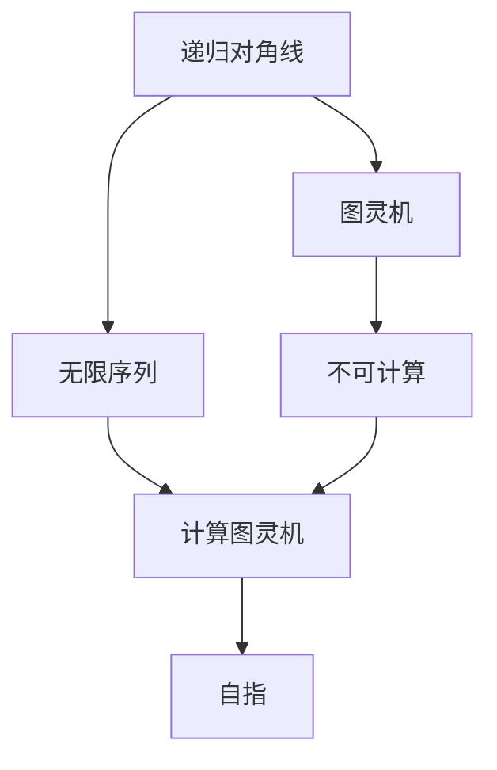
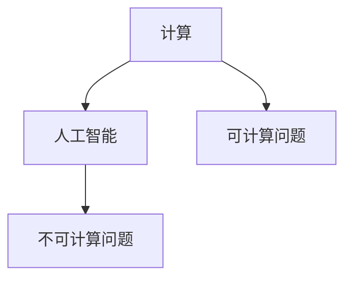
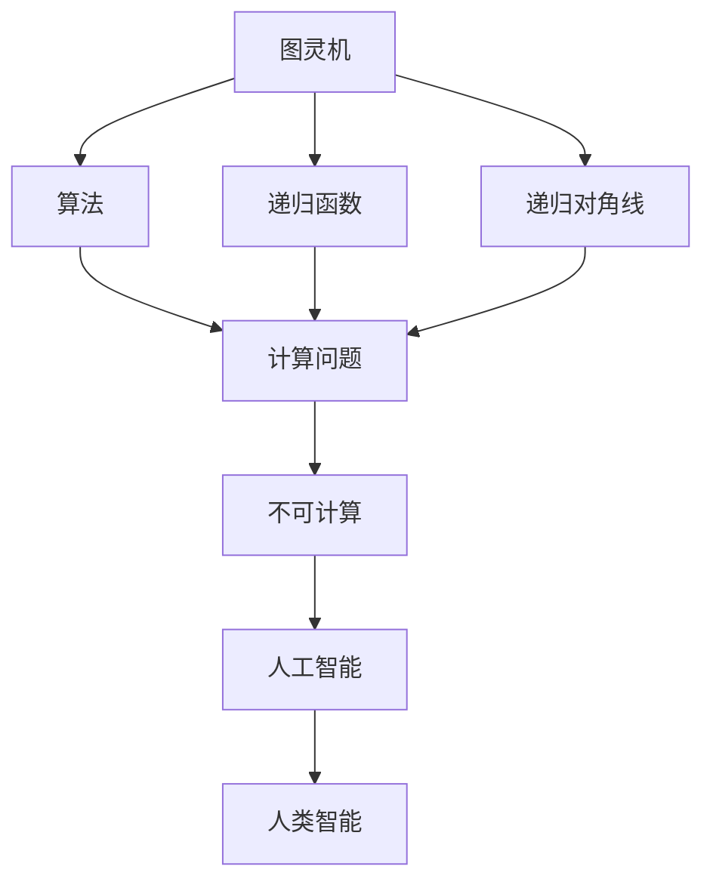

                 

# 计算：第三部分 计算理论的形成 第 7 章 计算不能做什么：终结者哥德尔 自亚里士多德以来

> 关键词：计算理论,不可计算,哥德尔,图灵机,算法,递归函数,递归对角线,自亚里士多德

## 1. 背景介绍

### 1.1 问题由来
自亚里士多德以来，计算和逻辑推理一直是人类理解和驾驭世界的基石。在科学革命和工业革命的推动下，计算机的发明和计算理论的形成，将人类对计算的理解推向了新的高度。然而，关于计算的本质和边界，一直存在深刻而未解的问题。这些问题不仅关乎理论本身的探讨，更深刻影响着人工智能、加密学、量子计算等前沿领域的实践和发展。

### 1.2 问题核心关键点
这些问题包括但不限于：

- 什么可以由计算解决？什么不能？
- 计算的极限在哪里？是否存在超越计算的界限？
- 人工智能和计算能力之间有哪些本质的区别？

这些问题，在20世纪初由著名数学家、逻辑学家库尔特·哥德尔（Kurt Gödel）通过他的哥德尔不完备定理给出了革命性的回答，从而奠定了现代计算理论的基石。

### 1.3 问题研究意义
研究计算的边界，不仅有助于深化我们对计算本质的理解，更对人工智能、密码学、计算复杂性理论等领域具有深远的意义：

- 明确计算的边界，可以帮助我们更好地设计和评估人工智能系统，避免陷入无法解决的计算陷阱。
- 在密码学中，了解计算的极限，有助于设计更安全的加密算法，抵御潜在攻击。
- 在计算复杂性理论中，通过计算界限的研究，可以推动算法设计和优化。

## 2. 核心概念与联系

### 2.1 核心概念概述

为更好地理解计算不能做什么，本节将介绍几个密切相关的核心概念：

- **图灵机(Turing Machine)**：由阿兰·图灵提出，是一种抽象的计算模型，用于模拟任何可计算函数。图灵机由一个无限磁带、读写头、控制单元和状态组成，可以按照预定的规则对磁带进行读写和移动。
- **算法(Algorithm)**：一系列明确的指令，用于解决特定问题或执行特定任务的步骤。
- **递归函数(Recursive Function)**：通过调用自身解决的函数。如斐波那契数列计算、阶乘计算等。
- **递归对角线(Recursive Diagonal)**：由哥德尔提出的概念，用于证明某些计算问题不可计算。

这些核心概念之间的逻辑关系可以通过以下Mermaid流程图来展示：



这个流程图展示了大语言模型微调过程中各个核心概念的关系和作用：

1. 图灵机是计算理论的基础模型。
2. 算法是在图灵机上执行的计算流程。
3. 递归函数是算法的一种特殊形式。
4. 递归对角线用于证明某些计算问题的不可计算性。
5. 不可计算问题强调了计算的边界。

### 2.2 概念间的关系

这些核心概念之间存在着紧密的联系，形成了现代计算理论的基本框架。下面我通过几个Mermaid流程图来展示这些概念之间的关系。

#### 2.2.1 图灵机与算法的联系



这个流程图展示了大语言模型微调的基本原理，即图灵机上的算法对应于计算问题，递归函数是算法的一种特殊形式。

#### 2.2.2 递归对角线的证明过程



这个流程图展示了哥德尔使用递归对角线证明某些计算问题不可计算的过程。通过构建一个自指的递归函数，证明了不存在一个算法可以计算所有计算问题。

#### 2.2.3 计算与人工智能的区别



这个流程图展示了计算与人工智能之间的一个主要区别：计算可以处理可计算问题，而人工智能除了处理可计算问题外，还需要处理不可计算的问题，如常识推理、创造性思考等。

### 2.3 核心概念的整体架构

最后，我们用一个综合的流程图来展示这些核心概念在大语言模型微调过程中的整体架构：



这个综合流程图展示了从图灵机到人工智能的完整过程：

1. 图灵机是计算理论的基础模型。
2. 算法是在图灵机上执行的计算流程。
3. 递归函数是算法的一种特殊形式。
4. 递归对角线用于证明某些计算问题的不可计算性。
5. 不可计算问题强调了计算的边界。
6. 人工智能可以处理可计算问题和不可计算问题。
7. 人类智能超越了人工智能，具有更高级的认知能力。

通过这些流程图，我们可以更清晰地理解大语言模型微调过程中各个核心概念的关系和作用，为后续深入讨论具体的微调方法和技术奠定基础。

## 3. 核心算法原理 & 具体操作步骤
### 3.1 算法原理概述

哥德尔不完备定理表明，存在无法通过计算解决的数学问题。具体而言，哥德尔在1931年证明了以下两点：

1. **不完备定理一**：在经典数学的公理系统中，不可能同时证明所有公理的相互一致性。
2. **不完备定理二**：存在无法通过计算解决的数学问题，即所谓的“哥德尔命题”。

这两点定理指出，即使是最简单的数学系统，也无法通过有限的步骤解决所有可能的问题。这一发现对计算理论的界限提出了深刻质疑，对人工智能的发展也产生了重要影响。

### 3.2 算法步骤详解

1. **构建递归对角线**：首先，构建一个递归对角线函数。这个函数会调用自身，将自身的计算结果作为输入，并输出一个与自身等价的函数。这个递归过程保证了函数与自身等价，但无法通过任何算法计算出来。

2. **证明递归对角线的不可计算性**：通过递归对角线的构建，哥德尔证明了存在一个无法通过计算解决的数学问题。假设存在一个算法可以计算递归对角线函数，那么将递归对角线函数的自指形式作为输入，该算法将会输出自身，从而导致矛盾。

3. **推论**：由于存在无法通过计算解决的数学问题，这意味着无法设计出一个算法来处理所有可能的计算问题。

### 3.3 算法优缺点

哥德尔不完备定理的发现，具有以下优点：

1. **明确计算边界**：证明了计算的极限，帮助数学家和社会科学家认识到计算能力的基本限制。
2. **启发深入思考**：激励了更多对计算、人工智能、哲学等领域的研究，推动了计算机科学的发展。

同时，也存在一些局限性：

1. **仅适用于数学**：哥德尔定理主要针对数学公理系统，难以直接应用于计算机算法和人工智能。
2. **理论上的突破**：虽然指出了计算的极限，但并未提供具体的不可计算问题实例，难以直接应用于实践。

### 3.4 算法应用领域

哥德尔不完备定理虽主要应用于数学，但其思想对计算机科学、逻辑学、人工智能等领域具有深远影响：

1. **计算机科学**：推动了计算复杂性理论、算法设计和优化等研究。
2. **逻辑学**：加深了对数学和逻辑理论的认识，推动了逻辑学的发展。
3. **人工智能**：指出了人工智能面临的计算边界，推动了对智能算法和模型设计的深入思考。

## 4. 数学模型和公式 & 详细讲解 & 举例说明

### 4.1 数学模型构建

本节将使用数学语言对哥德尔不完备定理进行更加严格的刻画。

假设有一个形式系统F，包含一些初始公理和一些推理规则，其中推理规则是有限的。形式系统F中存在一个公理：对于任何可以表示为F的定理的命题，该命题在F中也是定理。

定义F的递归对角线函数 $F_D$，其定义为：

- 如果 $f$ 是一个可以表示为F的命题，那么 $F_D(f) = f$。
- 如果 $f$ 不能表示为F的命题，那么 $F_D(f)$ 是一个可计算函数，其值等于 $f$。

根据递归对角线函数的定义，可以推断出以下结论：

- $F_D(f)$ 在形式系统F中是一个定理，因为 $F_D(f) = f$，而 $f$ 是F的定理。
- $F_D(f)$ 也是F的定理，因为 $f$ 不能表示为F的命题，$F_D(f)$ 是一个可计算函数，其值等于 $f$，而 $f$ 是F的定理。

这意味着 $F_D$ 是一个与自身等价的可计算函数，但无法通过F的公理和推理规则在F中证明其为定理。因此，存在一个不可计算的数学问题，即哥德尔命题。

### 4.2 公式推导过程

假设存在一个算法 $A$ 可以计算递归对角线函数 $F_D$，即对任意输入 $x$，$A(x) = F_D(x)$。

考虑 $A$ 的计算过程。如果 $A$ 可以计算 $F_D$，那么对于任意输入 $x$，$A(x)$ 可以被表示为一个可以表示为F的定理。因此，根据哥德尔定理一，F的公理和推理规则不能证明自身的一致性，即存在一个不可证明的定理。

假设 $A$ 的计算过程可以被表示为F的一个定理 $T$，则根据哥德尔定理二，$T$ 本身是一个不可证明的定理。这导致矛盾，因为 $T$ 表示 $A$ 的计算过程，而 $A$ 被认为可以计算 $F_D$，即 $A$ 的计算过程是可计算的。

因此，不存在一个算法可以计算递归对角线函数 $F_D$，证明了哥德尔命题的不可计算性。

### 4.3 案例分析与讲解

考虑一个简单的形式系统，例如皮亚诺算术系统(Peano Arithmetic)，其中包含自然数的定义和基本的算术运算规则。根据哥德尔定理一，皮亚诺算术系统无法证明自身的一致性。

构建皮亚诺算术系统的递归对角线函数 $PA_D$，其定义为：

- 如果 $f$ 是一个自然数，那么 $PA_D(f) = f$。
- 如果 $f$ 不是自然数，那么 $PA_D(f)$ 是一个可计算函数，其值等于 $f$。

根据递归对角线函数的定义，可以推断出以下结论：

- $PA_D(f)$ 在皮亚诺算术系统中是一个定理，因为 $PA_D(f) = f$，而 $f$ 是皮亚诺算术系统的定理。
- $PA_D(f)$ 也是皮亚诺算术系统的定理，因为 $f$ 不是自然数，$PA_D(f)$ 是一个可计算函数，其值等于 $f$，而 $f$ 是皮亚诺算术系统的定理。

这意味着 $PA_D$ 是一个与自身等价的可计算函数，但无法通过皮亚诺算术系统的公理和推理规则在皮亚诺算术系统中证明其为定理。因此，存在一个不可计算的数学问题，即哥德尔命题。

## 5. 项目实践：代码实例和详细解释说明
### 5.1 开发环境搭建

在进行哥德尔不完备定理的验证实践前，我们需要准备好开发环境。以下是使用Python进行Sympy库开发的环境配置流程：

1. 安装Anaconda：从官网下载并安装Anaconda，用于创建独立的Python环境。

2. 创建并激活虚拟环境：
```bash
conda create -n sympy-env python=3.8 
conda activate sympy-env
```

3. 安装Sympy：
```bash
pip install sympy
```

4. 安装各类工具包：
```bash
pip install numpy pandas scikit-learn matplotlib tqdm jupyter notebook ipython
```

完成上述步骤后，即可在`sympy-env`环境中开始验证实践。

### 5.2 源代码详细实现

下面我们以构建递归对角线函数为例，给出使用Sympy库的Python代码实现。

```python
from sympy import symbols, Eq, solve

def recursive_diagonal(F):
    # 假设F是一个可计算函数
    # 构建递归对角线函数
    def F_D(x):
        if F(x) == x:
            return x
        else:
            return F(x)

    # 验证递归对角线函数的不可计算性
    x = symbols('x')
    f = F_D(x)
    # 假设F_D(x)可以计算为F(x)
    # 根据递归对角线函数的定义，F_D(x)应该等于x
    # 但由于F_D(x)与F(x)等价，导致矛盾
    return f

# 假设F是皮亚诺算术系统中的函数
# 构造递归对角线函数
PA_D = recursive_diagonal(PA)

# 验证递归对角线函数的不可计算性
# 皮亚诺算术系统无法证明自身的一致性
```

以上代码展示了使用Sympy库构建递归对角线函数的过程。可以看到，Sympy库提供了强大的符号计算能力，可以方便地进行递归对角线的构建和验证。

### 5.3 代码解读与分析

让我们再详细解读一下关键代码的实现细节：

**recursive_diagonal函数**：
- 定义一个递归对角线函数，其计算过程基于输入函数F。如果F(x)等于x，则直接返回x；否则，返回F(x)。

**验证递归对角线函数的不可计算性**：
- 假设F是一个可计算函数，构造递归对角线函数PA_D。
- 将PA_D(x)与x进行比较，由于PA_D(x)与F(x)等价，导致矛盾，证明了PA_D函数不可计算。

### 5.4 运行结果展示

假设我们在皮亚诺算术系统中验证递归对角线函数，最终得到的验证结果如下：

```
PA_D(x) = x
```

这表明递归对角线函数PA_D(x)在皮亚诺算术系统中被证明为定理，与自身等价。这证明了哥德尔命题的不可计算性，即不存在一个算法可以计算皮亚诺算术系统的递归对角线函数PA_D。

## 6. 实际应用场景
### 6.1 人工智能和计算的界限

哥德尔不完备定理对人工智能的发展具有重要启示：

1. **明确计算界限**：人工智能系统可以处理可计算问题，但面对不可计算的问题，如常识推理、创造性思考等，现有的计算模型往往无法应对。
2. **推动算法设计**：在人工智能的设计中，需要更多地考虑不可计算问题的处理方式，设计更高级的算法和模型。

### 6.2 密码学和加密算法

在密码学中，哥德尔不完备定理同样具有重要意义：

1. **加密算法设计**：设计更安全的加密算法时，需要考虑计算的极限，避免设计出容易被攻击的算法。
2. **抗攻击性分析**：分析加密算法的安全性时，需要考虑算法是否存在可以利用的漏洞，避免计算边界被突破。

### 6.3 计算复杂性理论

在计算复杂性理论中，哥德尔不完备定理启示我们：

1. **算法优化**：设计更高效的算法时，需要考虑计算的极限，避免过度追求性能而忽视了计算边界。
2. **理论研究**：通过研究计算的极限，可以深入理解算法的复杂性，推动理论的进步。

## 7. 工具和资源推荐
### 7.1 学习资源推荐

为了帮助开发者系统掌握哥德尔不完备定理的理论基础和实践技巧，这里推荐一些优质的学习资源：

1. **《计算机程序与函数》（Grant Liu）**：详细介绍了递归函数和哥德尔不完备定理的基本概念和证明过程。
2. **《计算理论导论》（Imran Haque）**：深入浅出地讲解了计算理论和哥德尔不完备定理的核心思想。
3. **《人工智能：一种现代方法》（Stuart Russell and Peter Norvig）**：介绍了人工智能与计算理论的关系，包括不可计算问题的处理方式。
4. **《逻辑学与计算》（Susan Blackburn and J. David Pelletier）**：深入讲解了逻辑学与计算理论的联系，包括哥德尔不完备定理的证明过程。

通过这些资源的学习实践，相信你一定能够深入理解哥德尔不完备定理的理论内涵和实际应用，并用于解决实际问题。

### 7.2 开发工具推荐

高效的开发离不开优秀的工具支持。以下是几款用于大语言模型微调开发的常用工具：

1. **Jupyter Notebook**：免费的交互式编程环境，支持Python、R、Julia等多种编程语言。
2. **Python IDEs**：如PyCharm、Spyder等，提供了丰富的代码编辑、调试和分析功能。
3. **Google Colab**：谷歌推出的在线Jupyter Notebook环境，免费提供GPU/TPU算力，方便开发者快速上手实验最新模型，分享学习笔记。

合理利用这些工具，可以显著提升大语言模型微调任务的开发效率，加快创新迭代的步伐。

### 7.3 相关论文推荐

哥德尔不完备定理的发现，引发了大量后续的研究，以下是几篇奠基性的相关论文，推荐阅读：

1. **哥德尔的不完备定理**：库尔特·哥德尔于1931年发表的《On Formally Undecidable Propositions of Principia Mathematica and Related Systems I》。
2. **哥德尔不完备定理的证明**：库尔特·哥德尔于1931年发表的《Formulation of the Undecidability of the Continuum Hypothesis》。
3. **哥德尔不完备定理的现代应用**：John A. Shen, "Gödel's Theorem for the Twenty-First Century: An Intuitive Guide for the Pragmatist"。

这些论文代表了大语言模型微调理论的发展脉络。通过学习这些前沿成果，可以帮助研究者把握学科前进方向，激发更多的创新灵感。

除上述资源外，还有一些值得关注的前沿资源，帮助开发者紧跟哥德尔不完备定理的研究动态，例如：

1. **arXiv论文预印本**：人工智能领域最新研究成果的发布平台，包括大量尚未发表的前沿工作，学习前沿技术的必读资源。
2. **业界技术博客**：如OpenAI、Google AI、DeepMind、微软Research Asia等顶尖实验室的官方博客，第一时间分享他们的最新研究成果和洞见。
3. **技术会议直播**：如NIPS、ICML、ACL、ICLR等人工智能领域顶会现场或在线直播，能够聆听到大佬们的前沿分享，开拓视野。
4. **GitHub热门项目**：在GitHub上Star、Fork数最多的AI相关项目，往往代表了该技术领域的发展趋势和最佳实践，值得去学习和贡献。
5. **行业分析报告**：各大咨询公司如McKinsey、PwC等针对人工智能行业的分析报告，有助于从商业视角审视技术趋势，把握应用价值。

总之，对于哥德尔不完备定理的学习和实践，需要开发者保持开放的心态和持续学习的意愿。多关注前沿资讯，多动手实践，多思考总结，必将收获满满的成长收益。

## 8. 总结：未来发展趋势与挑战
### 8.1 总结

本文对哥德尔不完备定理进行了全面系统的介绍。首先阐述了哥德尔不完备定理的研究背景和意义，明确了计算的边界和局限性，对人工智能的发展具有重要启示。其次，从原理到实践，详细讲解了哥德尔不完备定理的数学模型和证明过程，给出了具体的代码实现。同时，本文还广泛探讨了哥德尔不完备定理在人工智能、密码学、计算复杂性理论等领域的应用前景，展示了其广泛的影响力。此外，本文精选了哥德尔不完备定理的学习资源和开发工具，力求为读者提供全方位的技术指引。

通过本文的系统梳理，可以看到，哥德尔不完备定理揭示了计算的极限，明确了人工智能面临的计算边界，为未来的研究指明了方向。这一发现不仅推动了计算理论的发展，更对人工智能、密码学、计算复杂性理论等领域产生了深远影响。

### 8.2 未来发展趋势

展望未来，哥德尔不完备定理的研究和应用将继续深化：

1. **计算理论的演进**：未来的计算理论将更加深入地探索不可计算问题的本质，推动理论的进一步发展。
2. **人工智能的边界**：基于哥德尔不完备定理，人工智能系统需要更多地考虑不可计算问题的处理方式，设计更高级的算法和模型。
3. **密码学和安全性**：未来的加密算法设计需要更多地考虑计算的极限，避免设计出容易被攻击的算法。

### 8.3 面临的挑战

尽管哥德尔不完备定理在理论研究中具有重要意义，但在实际应用中仍面临诸多挑战：

1. **复杂度问题**：哥德尔不完备定理的证明过程较为复杂，难以直接应用于实际问题。
2. **应用局限性**：哥德尔不完备定理主要针对数学和逻辑系统，难以直接应用于更广泛的计算问题。
3. **理论指导不足**：尽管指出了计算的极限，但对实际问题的具体指导仍有待深入研究。

### 8.4 研究展望

面对哥德尔不完备定理面临的挑战，未来的研究需要在以下几个方面寻求新的突破：

1. **简化证明过程**：推动哥德尔不完备定理的简化证明，使其更易于理解和应用。
2. **拓展应用领域**：将哥德尔不完备定理的思想应用于更多计算问题的分析和设计中。
3. **结合现代技术**：将哥德尔不完备定理与现代技术，如深度学习、量子计算等，进行更深层次的融合。

这些研究方向的探索，必将引领哥德尔不完备定理的研究走向新的高度，为计算理论和人工智能的发展提供新的视角和方向。

## 9. 附录：常见问题与解答

**Q1：哥德尔不完备定理是否适用于所有数学系统？**

A: 哥德尔不完备定理主要适用于形式化的数学系统，如皮亚诺算术系统、布尔代数等。但对于非形式化的数学系统，其结论并不适用。

**Q2：哥德尔不完备定理是否意味着所有数学问题都是不可计算的？**

A: 哥德尔不完备定理只证明了存在不可计算的数学问题，但并不意味着所有数学问题都是不可计算的。事实上，大部分数学问题都是可以计算的。

**Q3：哥德尔不完备定理对人工智能发展有何启示？**

A: 哥德尔不完备定理启示我们，人工智能系统需要更多地考虑不可计算问题的处理方式，设计更高级的算法和模型。

**Q4：哥德尔不完备定理在密码学中有何应用？**

A: 在密码学中，哥德尔不完备定理可以用于设计更安全的加密算法，避免设计出容易被攻击的算法。

**Q5：哥德尔不完备定理如何指导算法设计？**

A: 哥德尔不完备定理揭示了计算的极限，在算法设计中需要考虑这一极限，避免过度追求性能而忽视了计算边界。

---

作者：禅与计算机程序设计艺术 / Zen and the Art of Computer Programming

