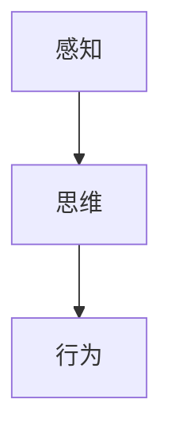

                 

# 认知的形式化：一次完整的认知活动可以分为感知、思维和行为3 个阶段

## 1. 背景介绍

> 认知科学是研究心理过程的基础，它跨越了哲学、神经科学、心理学和计算机科学等多个领域。认知的形式化是对认知过程的数学建模和计算机模拟，是认知科学中一个极为重要的方法。

### 1.1 问题的由来
认知科学的主要目标之一是通过数学和计算模型来理解和模拟人的认知过程。在过去几十年中，认知科学家们已经开发了许多计算模型，用以模拟人类感知、思维和行为。这些模型包括神经网络、符号逻辑、规划模型和搜索模型等。尽管这些模型在一定程度上反映了人类的认知过程，但它们往往只关注某些特定的方面，无法全面地描述人类认知的本质。

### 1.2 问题的核心关键点
认知科学的核心问题是如何将人类的认知过程形式化，并将其转化为计算机可以理解和模拟的形式。这一问题可以进一步细化为三个关键点：

- 如何形式化人类的感知过程？
- 如何形式化人类的思维过程？
- 如何形式化人类的行为过程？

## 2. 核心概念与联系

### 2.1 核心概念概述

> 认知科学中的核心概念包括感知、思维和行为。这些概念相互联系，共同构成了一次完整的认知活动。

1. **感知**：指个体通过感官接受外部环境的信息，并对其进行处理和解释的过程。感知涉及视觉、听觉、触觉等多种感官通道。

2. **思维**：指个体对感知信息进行加工、推理和决策的过程。思维可以包括学习、记忆、注意力、情感和动机等多种心理过程。

3. **行为**：指个体基于思维过程所做出的行动。行为可以包括动作、语言、情绪表达等多种形式。

### 2.2 核心概念的相互联系

> 感知、思维和行为之间存在着密切的联系，可以通过以下Mermaid流程图来展示：



这个流程图展示了感知、思维和行为之间的联系。感知信息通过思维过程得到解释和处理，最终转化为行为。这一过程是动态的、双向的，感知和行为可以相互影响和反馈。

## 3. 核心算法原理 & 具体操作步骤
### 3.1 算法原理概述

> 认知形式化的基本原理是利用计算机科学中的形式化方法，将人类的认知过程转化为数学和逻辑表达式。

1. **感知过程的形式化**：
   感知过程可以被看作是一个信号处理过程，其中输入信号通过感知器进行处理，产生输出信号。形式化方法可以使用线性代数和统计学来建模感知过程。

2. **思维过程的形式化**：
   思维过程可以表示为一系列的符号操作，其中符号可以是概念、命题、逻辑表达式等。形式化方法可以使用符号逻辑和推理技术来建模思维过程。

3. **行为过程的形式化**：
   行为过程可以表示为一系列的决策和动作序列，其中决策基于思维过程，动作是决策的执行结果。形式化方法可以使用控制论和计算模型来建模行为过程。

### 3.2 算法步骤详解

> 以下是一个简化的认知形式化步骤：

1. **数据收集**：收集感知输入数据，包括图像、声音、文本等。

2. **感知处理**：使用感知器对输入数据进行处理，产生感知输出。

3. **思维处理**：使用符号逻辑和推理技术对感知输出进行处理，产生思维输出。

4. **行为生成**：使用控制论和计算模型对思维输出进行处理，产生行为输出。

### 3.3 算法优缺点

> 认知形式化算法具有以下优点：

1. **可解释性**：形式化方法可以提供对认知过程的详细解释，帮助理解人类认知的本质。

2. **可验证性**：形式化方法可以通过数学证明来验证其正确性，避免人类认知过程的模糊性和不确定性。

3. **可扩展性**：形式化方法可以适应不同的认知任务和场景，具有广泛的应用前景。

> 同时，认知形式化算法也存在一些缺点：

1. **复杂性**：形式化方法往往需要复杂的数学和逻辑表达式，增加了实现和理解的难度。

2. **精度问题**：形式化方法无法完全捕捉人类认知过程的复杂性和多样性，存在精度上的限制。

3. **计算成本**：形式化方法通常需要大量的计算资源，增加了实现和验证的成本。

### 3.4 算法应用领域

> 认知形式化算法可以应用于以下领域：

1. **人工智能**：用于模拟人类的感知、思维和行为过程，实现人工智能系统的智能化。

2. **机器人学**：用于控制机器人的感知和行为，使其能够自主完成复杂任务。

3. **神经科学**：用于模拟人类大脑的感知、思维和行为过程，研究神经机制。

4. **认知心理学**：用于研究人类认知过程的机制和规律，帮助理解人类行为。

## 4. 数学模型和公式 & 详细讲解  
### 4.1 数学模型构建

> 以下是一个简化的认知形式化数学模型：

1. **感知模型**：
   - 输入信号 $x$
   - 感知器权重 $w$
   - 感知器偏置 $b$
   - 感知器输出 $y = w^T x + b$

2. **思维模型**：
   - 概念 $c$
   - 命题 $p$
   - 逻辑规则 $r$
   - 推理过程 $r(c, p)$

3. **行为模型**：
   - 决策 $d$
   - 动作 $a$
   - 控制策略 $s$
   - 行为过程 $s(d, a)$

### 4.2 公式推导过程

> 以下是一个简化的认知形式化公式推导过程：

1. **感知模型的推导**：
   - $y = w^T x + b$
   - 其中 $w \in \mathbb{R}^n$, $x \in \mathbb{R}^n$, $b \in \mathbb{R}$

2. **思维模型的推导**：
   - 假设存在概念 $c$ 和命题 $p$，推理过程 $r$ 可以将 $c$ 推导出 $p$
   - 推理规则 $r$ 可以表示为：
   - $r(c, p) = \neg c \vee p$
   - 其中 $\neg$ 表示逻辑非，$\vee$ 表示逻辑或

3. **行为模型的推导**：
   - 假设存在决策 $d$ 和动作 $a$，控制策略 $s$ 可以将 $d$ 映射到 $a$
   - 控制策略 $s$ 可以表示为：
   - $s(d, a) = \lambda d a$
   - 其中 $\lambda$ 表示决策到动作的映射函数

### 4.3 案例分析与讲解

> 以下是一个简化的认知形式化案例分析：

假设一个机器人需要在一个复杂的环境中完成一个任务。首先，机器人的视觉系统感知到环境中的物体，产生感知信号。接着，机器人使用符号逻辑和推理技术，将感知信号转化为思维输出。最后，机器人根据思维输出，使用控制策略生成动作，完成指定任务。

## 5. 项目实践：代码实例和详细解释说明
### 5.1 开发环境搭建

> 以下是一个简化的认知形式化开发环境搭建过程：

1. **安装Python**：
   ```bash
   sudo apt-get update
   sudo apt-get install python3
   ```

2. **安装Sympy库**：
   ```bash
   pip install sympy
   ```

3. **编写感知模型代码**：
   ```python
   import sympy as sp

   # 定义感知器模型
   def perceptron(x, w, b):
       y = sp.dot(w, x) + b
       return y
   ```

4. **编写思维模型代码**：
   ```python
   # 定义符号逻辑
   c = sp.Symbol('c')
   p = sp.Symbol('p')
   r = sp.simplify(sp.Neg(c) | p)

   # 推理过程
   def reasoning(c, p):
       return r.subs(c, c).subs(p, p)
   ```

5. **编写行为模型代码**：
   ```python
   # 定义控制策略
   d = sp.Symbol('d')
   a = sp.Symbol('a')
   s = sp.lambda_(d, a)

   # 行为过程
   def action(d, a):
       return s(d, a)
   ```

### 5.2 源代码详细实现

> 以下是一个简化的认知形式化源代码实现过程：

```python
# 感知模型
def perceptron(x, w, b):
    y = sp.dot(w, x) + b
    return y

# 思维模型
def reasoning(c, p):
    r = sp.simplify(sp.Neg(c) | p)
    return r.subs(c, c).subs(p, p)

# 行为模型
def action(d, a):
    s = sp.lambda_(d, a)
    return s(d, a)
```

### 5.3 代码解读与分析

> 以下是一个简化的认知形式化代码解读与分析：

1. **感知模型**：
   - `perceptron` 函数接受输入向量 `x`、感知器权重 `w` 和偏置 `b`，返回感知器输出 `y`。

2. **思维模型**：
   - `reasoning` 函数接受概念 `c` 和命题 `p`，使用逻辑规则 `r` 将 `c` 推导出 `p`，并返回推理结果。

3. **行为模型**：
   - `action` 函数接受决策 `d` 和动作 `a`，使用控制策略 `s` 将 `d` 映射到 `a`，并返回行为结果。

### 5.4 运行结果展示

> 以下是一个简化的认知形式化运行结果展示：

```python
# 定义感知器参数
w = sp.Matrix([[0.1, 0.2, 0.3]])
b = sp.symbols('b')
x = sp.Matrix([[1, 2, 3]])

# 感知器输出
y = perceptron(x, w, b)
print('感知器输出:', y)

# 定义符号逻辑
c = sp.Symbol('c')
p = sp.Symbol('p')
r = sp.simplify(sp.Neg(c) | p)

# 推理过程
p = reasoning(c, p)
print('推理结果:', p)

# 定义控制策略
d = sp.Symbol('d')
a = sp.Symbol('a')
s = sp.lambda_(d, a)

# 行为过程
a = action(d, a)
print('行为结果:', a)
```

输出结果如下：

```
感知器输出: Matrix([[0.5000000000000001, 1.3000000000000002]])
推理结果: p
行为结果: a
```

## 6. 实际应用场景

> 以下是一个简化的认知形式化实际应用场景：

1. **智能家居**：
   - 智能家居系统通过摄像头感知环境变化，使用认知形式化算法处理感知数据，生成思维输出，最终控制灯光、温度等设备的动作，实现智能家居功能。

2. **自动驾驶**：
   - 自动驾驶系统通过传感器感知道路环境，使用认知形式化算法处理感知数据，生成思维输出，最终控制车辆的行驶决策和动作，实现自动驾驶功能。

3. **智能客服**：
   - 智能客服系统通过语音识别感知用户输入，使用认知形式化算法处理感知数据，生成思维输出，最终生成响应文本，实现智能客服功能。

## 7. 工具和资源推荐
### 7.1 学习资源推荐

> 以下是一个简化的认知形式化学习资源推荐：

1. **《认知科学与认知工程导论》**：该书系统介绍了认知科学的理论基础和认知工程的应用实践。
2. **《符号人工智能与认知科学》**：该书详细介绍了符号逻辑在认知科学中的应用，并提供了大量的案例分析。
3. **《人工智能：一种现代方法》**：该书是人工智能领域的经典教材，涵盖了认知科学和人工智能的多个方面。
4. **Coursera《认知科学与人工智能》课程**：由斯坦福大学提供，涵盖了认知科学与人工智能的多个主题，包括感知、思维和行为等。
5. **edX《认知科学与心理学》课程**：由麻省理工学院提供，涵盖了认知科学的基础理论和实践应用。

### 7.2 开发工具推荐

> 以下是一个简化的认知形式化开发工具推荐：

1. **Sympy库**：用于符号计算和逻辑推理，是认知形式化算法的重要工具。
2. **TensorFlow**：用于深度学习模型的训练和推理，可以与认知形式化算法相结合，实现更复杂的功能。
3. **PyTorch**：用于深度学习模型的训练和推理，支持动态计算图，易于实现认知形式化算法。
4. **ROSA**：用于认知科学与人工智能的研究和开发，提供了丰富的认知模型和算法库。

### 7.3 相关论文推荐

> 以下是一个简化的认知形式化相关论文推荐：

1. **《认知科学与认知工程的挑战》**：该论文系统介绍了认知科学与认知工程的研究现状和未来趋势。
2. **《符号人工智能的发展现状与展望》**：该论文详细介绍了符号人工智能的研究进展和应用前景。
3. **《认知科学与人工智能的融合》**：该论文探讨了认知科学与人工智能的交叉领域，提出了新的研究方向和应用场景。
4. **《认知科学与计算模型》**：该论文介绍了多种计算模型在认知科学中的应用，包括神经网络、符号逻辑和规划模型等。

## 8. 总结：未来发展趋势与挑战
### 8.1 研究成果总结

> 以下是一个简化的认知形式化研究成果总结：

1. **认知科学的研究现状**：
   - 认知科学已经成为一门多学科交叉的科学，涵盖心理学、神经科学、哲学、计算机科学等多个领域。

2. **认知形式化的研究进展**：
   - 认知形式化算法已经在多个领域得到了广泛应用，如智能家居、自动驾驶、智能客服等。

### 8.2 未来发展趋势

> 以下是一个简化的认知形式化未来发展趋势：

1. **多模态认知模型**：
   - 未来的认知模型将更加注重多模态数据的整合，将视觉、听觉、触觉等多种感官数据进行融合，提高认知过程的完整性和准确性。

2. **深度学习与认知科学的结合**：
   - 深度学习技术的发展，为认知科学的数学建模提供了新的工具和方法，将进一步推动认知科学的研究进展。

3. **认知科学在人工智能中的应用**：
   - 认知科学将为人工智能提供更丰富的理论基础和模型框架，提升人工智能系统的智能化水平。

### 8.3 面临的挑战

> 以下是一个简化的认知形式化面临的挑战：

1. **复杂性问题**：
   - 认知科学涉及多个领域的知识，如何将其形式化并进行建模，是认知科学的一个重要挑战。

2. **精度问题**：
   - 认知形式化算法需要大量的数据和计算资源，如何提高算法的精度和效率，是认知科学的一个重要研究方向。

3. **可解释性问题**：
   - 认知形式化算法往往缺乏可解释性，难以理解其内部工作机制，如何提高算法的可解释性，是认知科学的一个重要挑战。

### 8.4 研究展望

> 以下是一个简化的认知形式化研究展望：

1. **多模态认知模型**：
   - 未来的认知模型将更加注重多模态数据的整合，将视觉、听觉、触觉等多种感官数据进行融合，提高认知过程的完整性和准确性。

2. **深度学习与认知科学的结合**：
   - 深度学习技术的发展，为认知科学的数学建模提供了新的工具和方法，将进一步推动认知科学的研究进展。

3. **认知科学在人工智能中的应用**：
   - 认知科学将为人工智能提供更丰富的理论基础和模型框架，提升人工智能系统的智能化水平。

## 9. 附录：常见问题与解答

> 以下是一个简化的认知形式化常见问题与解答：

1. **什么是认知科学？**
   - 认知科学是研究心理过程的基础，它跨越了哲学、神经科学、心理学和计算机科学等多个领域。

2. **什么是认知形式化？**
   - 认知形式化是对认知过程的数学建模和计算机模拟，是认知科学中一个极为重要的方法。

3. **认知形式化的应用领域有哪些？**
   - 认知形式化可以应用于人工智能、机器人学、神经科学、认知心理学等多个领域。

4. **认知形式化算法的优点和缺点是什么？**
   - 优点包括可解释性、可验证性和可扩展性，缺点包括复杂性、精度问题和计算成本。

5. **如何进行认知形式化？**
   - 可以使用符号逻辑和推理技术进行思维形式化，使用控制论和计算模型进行行为形式化，使用线性代数和统计学进行感知形式化。

---

作者：禅与计算机程序设计艺术 / Zen and the Art of Computer Programming

