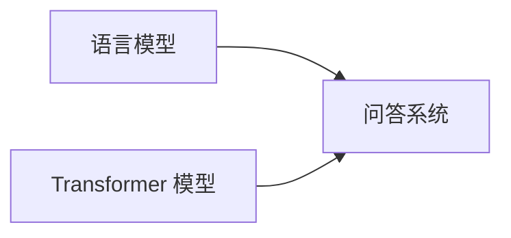
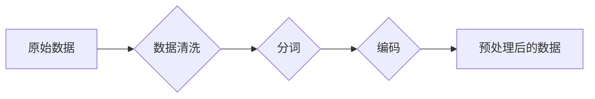
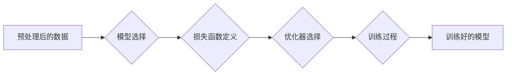
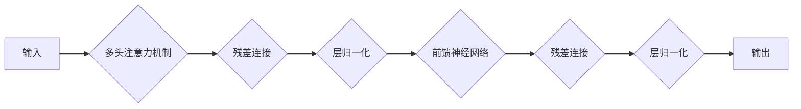
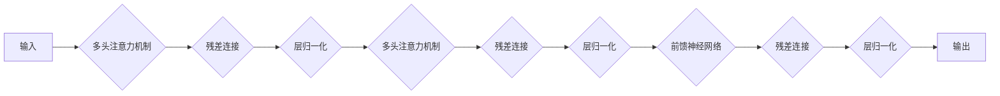

# 大模型问答机器人的训练方法

## 1. 背景介绍

### 1.1 问题的由来

近年来，随着深度学习技术的飞速发展，大语言模型（Large Language Model, LLM）在自然语言处理领域取得了突破性进展。这些模型能够理解和生成人类语言，并在各种任务中展现出惊人的性能，例如文本生成、机器翻译、问答系统等。其中，大模型问答机器人作为一种重要的应用形式，受到了学术界和工业界的广泛关注。

传统的问答机器人系统通常基于规则或统计方法构建，其性能受限于人工设计的规则或有限的训练数据。而大模型问答机器人则利用海量文本数据进行训练，能够学习到更丰富、更复杂的语言模式，从而提供更准确、更自然的答案。

### 1.2 研究现状

目前，大模型问答机器人的研究主要集中在以下几个方面：

* **模型结构**:  研究者们探索了各种不同的神经网络结构来构建问答机器人，例如循环神经网络（RNN）、长短时记忆网络（LSTM）、Transformer等。其中，Transformer模型由于其并行计算能力和对长距离依赖关系的捕捉能力，在大模型问答机器人中得到了广泛应用。
* **训练方法**:  为了提高问答机器人的性能，研究者们提出了各种训练方法，例如监督学习、强化学习、多任务学习等。监督学习是最常用的训练方法，其基本思想是利用标注好的问答对数据集来训练模型。强化学习则通过与环境交互来学习最优策略，可以用于训练更具交互性的问答机器人。多任务学习则将问答任务与其他相关任务联合训练，例如文本摘要、机器翻译等，以提高模型的泛化能力。
* **知识融合**:  为了使问答机器人能够回答更广泛的问题，研究者们探索了将外部知识库融入到大模型中的方法，例如知识图嵌入、实体链接等。通过将结构化的知识融入到模型中，可以提高问答机器人的准确性和可解释性。
* **评估指标**:  为了评估问答机器人的性能，研究者们提出了各种指标，例如准确率、召回率、F1值、BLEU分数等。这些指标可以从不同的角度来衡量问答机器人的性能，例如答案的准确性、流畅性、相关性等。

### 1.3 研究意义

大模型问答机器人的研究具有重要的理论意义和现实意义。

* **理论意义**:  大模型问答机器人的研究推动了自然语言处理、机器学习等领域的理论发展。例如，Transformer模型的提出极大地促进了自然语言处理领域的发展，而强化学习、多任务学习等方法的应用也为机器学习领域带来了新的思路。
* **现实意义**:  大模型问答机器人在各个领域都具有广泛的应用前景，例如：
    * **智能客服**:  可以替代人工客服，为用户提供7*24小时的在线服务，提高服务效率，降低服务成本。
    * **智能助手**:  可以帮助用户完成各种任务，例如查询信息、预订酒店、购买商品等，提高用户的生活效率。
    * **教育**:  可以作为一种个性化的学习工具，为学生提供答疑解惑、知识讲解等服务，提高学习效率。
    * **医疗**:  可以辅助医生进行诊断，提供医疗咨询服务，提高医疗服务的质量和效率。

### 1.4 本文结构

本文将深入探讨大模型问答机器人的训练方法，并结合代码实例进行详细讲解。文章结构如下：

* **第二章：核心概念与联系**：介绍大模型问答机器人相关的核心概念，例如语言模型、问答系统、Transformer模型等，并阐述它们之间的联系。
* **第三章：核心算法原理 & 具体操作步骤**:  详细介绍大模型问答机器人的核心算法原理，包括数据预处理、模型训练、模型评估等步骤，并结合代码实例进行讲解。
* **第四章：数学模型和公式 & 详细讲解 & 举例说明**:  介绍大模型问答机器人中常用的数学模型和公式，例如交叉熵损失函数、Adam优化器等，并结合具体案例进行讲解。
* **第五章：项目实践：代码实例和详细解释说明**:  提供一个完整的大模型问答机器人项目，包括数据准备、模型训练、模型部署等步骤，并对代码进行详细解释说明。
* **第六章：实际应用场景**:  介绍大模型问答机器人在各个领域的实际应用场景，例如智能客服、智能助手、教育、医疗等。
* **第七章：工具和资源推荐**:  推荐一些学习大模型问答机器人的工具和资源，例如书籍、论文、开源项目等。
* **第八章：总结：未来发展趋势与挑战**:  总结大模型问答机器人的研究成果，展望未来发展趋势，并分析面临的挑战。
* **第九章：附录：常见问题与解答**:  解答一些常见问题，例如如何选择合适的模型、如何优化模型性能等。

## 2. 核心概念与联系

### 2.1 语言模型

语言模型（Language Model, LM）是自然语言处理领域的基础模型，用于估计一段文本序列出现的概率。简单来说，语言模型就是用来判断一句话是否通顺、自然。

传统的语言模型通常基于统计方法，例如 N-gram 模型。N-gram 模型假设一个词出现的概率只与其前 n-1 个词相关，并利用统计方法计算每个 n-gram 的概率。然而，N-gram 模型受限于数据稀疏性问题，难以捕捉长距离依赖关系。

近年来，随着深度学习技术的兴起，神经网络语言模型（Neural Language Model, NLM）逐渐成为主流。NLM 利用神经网络来学习词语之间的复杂关系，可以有效克服传统语言模型的局限性。

### 2.2 问答系统

问答系统（Question Answering System, QA System）是信息检索领域的一个重要分支，其目标是根据用户提出的问题，从海量数据中找到准确、完整的答案。

问答系统通常包括以下几个模块：

* **问题分析模块**:  对用户提出的问题进行分析，例如识别问题的类型、提取关键词等。
* **信息检索模块**:  根据问题分析的结果，从数据库或知识库中检索相关信息。
* **答案抽取模块**:  从检索到的信息中抽取最相关的答案。
* **答案生成模块**:  对抽取到的答案进行整合、生成，并以用户友好的方式呈现给用户。

### 2.3 Transformer 模型

Transformer 模型是一种基于自注意力机制的神经网络结构，由 Google 在 2017 年提出。Transformer 模型最初被应用于机器翻译任务，并取得了显著的效果。随后，Transformer 模型被广泛应用于各种自然语言处理任务，例如文本生成、问答系统、情感分析等。

Transformer 模型的核心是自注意力机制（Self-Attention Mechanism）。自注意力机制允许模型在处理每个词语时，关注句子中所有词语，从而捕捉词语之间的长距离依赖关系。

### 2.4  核心概念联系

下图展示了语言模型、问答系统、Transformer 模型之间的联系：



* 语言模型是问答系统的基础，问答系统需要利用语言模型来理解用户提出的问题，并生成自然流畅的答案。
* Transformer 模型是一种强大的语言模型，可以用于构建高性能的问答系统。

## 3. 核心算法原理 & 具体操作步骤

### 3.1 算法原理概述

大模型问答机器人的训练过程可以分为以下几个步骤：

1. **数据预处理**:  对原始文本数据进行清洗、分词、编码等操作，将其转换为模型可以处理的数值型数据。
2. **模型训练**:  利用预处理后的数据训练大模型，使模型能够理解语言、学习问答模式。
3. **模型评估**:  利用测试集评估训练好的模型的性能，例如准确率、召回率、F1值等。

### 3.2 算法步骤详解

#### 3.2.1 数据预处理

数据预处理是训练大模型的第一步，其目的是将原始文本数据转换为模型可以处理的数值型数据。数据预处理通常包括以下几个步骤：

1. **数据清洗**:  对原始数据进行清洗，例如去除无关信息、纠正错误拼写等。
2. **分词**:  将文本数据分割成词语或子词单元。
3. **编码**:  将词语或子词单元转换为数值型的向量表示。



以英文文本数据为例，数据预处理的具体步骤如下：

1. **数据清洗**:  去除文本数据中的 HTML 标签、标点符号等无关信息，并将所有字母转换为小写。
2. **分词**:  利用空格将文本数据分割成单词。
3. **编码**:  利用 WordPiece 编码将单词转换为数值型的向量表示。WordPiece 编码是一种 subword 编码方法，可以将单词拆分成更小的单元，例如 "loved" 可以拆分成 "lov" 和 "ed"。

```python
# 数据清洗
text = text.lower()
text = re.sub(r'<[^>]+>', '', text)
text = re.sub(r'[^\w\s]', '', text)

# 分词
words = text.split()

# 编码
tokenizer = BertTokenizer.from_pretrained('bert-base-uncased')
input_ids = tokenizer.encode(words)
```

#### 3.2.2 模型训练

模型训练是训练大模型的核心步骤，其目的是利用预处理后的数据训练大模型，使模型能够理解语言、学习问答模式。模型训练通常包括以下几个步骤：

1. **模型选择**:  选择合适的大模型结构，例如 BERT、GPT-3 等。
2. **损失函数定义**:  定义损失函数来衡量模型预测结果与真实标签之间的差异。
3. **优化器选择**:  选择合适的优化器来更新模型参数，例如 Adam、SGD 等。
4. **训练过程**:  将预处理后的数据输入到模型中进行训练，并根据损失函数和优化器来更新模型参数。



以 BERT 模型为例，模型训练的具体步骤如下：

1. **模型选择**:  选择预训练好的 BERT 模型作为基础模型。
2. **损失函数定义**:  使用交叉熵损失函数来衡量模型预测结果与真实标签之间的差异。
3. **优化器选择**:  使用 Adam 优化器来更新模型参数。
4. **训练过程**:  将预处理后的问答对数据输入到 BERT 模型中进行训练，并根据损失函数和优化器来更新模型参数。

```python
# 模型选择
model = BertForQuestionAnswering.from_pretrained('bert-base-uncased')

# 损失函数定义
loss_fn = nn.CrossEntropyLoss()

# 优化器选择
optimizer = AdamW(model.parameters(), lr=2e-5)

# 训练过程
for epoch in range(num_epochs):
    for batch in train_dataloader:
        # 将数据输入到模型中
        outputs = model(**batch)

        # 计算损失函数
        loss = loss_fn(outputs.logits, batch['labels'])

        # 反向传播
        loss.backward()

        # 更新模型参数
        optimizer.step()

        # 清空梯度
        optimizer.zero_grad()
```

#### 3.2.3 模型评估

模型评估是训练大模型的最后一步，其目的是利用测试集评估训练好的模型的性能。模型评估通常使用以下指标：

* **准确率（Accuracy）**:  模型预测正确的样本数占总样本数的比例。
* **召回率（Recall）**:  模型预测正确的正样本数占所有正样本数的比例。
* **F1值（F1-score）**:  准确率和召回率的调和平均数。

```python
# 模型评估
model.eval()

# 初始化指标
total_accuracy = 0
total_recall = 0
total_f1 = 0

# 遍历测试集
for batch in test_dataloader:
    # 将数据输入到模型中
    outputs = model(**batch)

    # 计算指标
    accuracy = accuracy_score(batch['labels'], outputs.logits.argmax(dim=1))
    recall = recall_score(batch['labels'], outputs.logits.argmax(dim=1))
    f1 = f1_score(batch['labels'], outputs.logits.argmax(dim=1))

    # 更新指标
    total_accuracy += accuracy
    total_recall += recall
    total_f1 += f1

# 计算平均指标
average_accuracy = total_accuracy / len(test_dataloader)
average_recall = total_recall / len(test_dataloader)
average_f1 = total_f1 / len(test_dataloader)

# 打印指标
print(f'Accuracy: {average_accuracy:.4f}')
print(f'Recall: {average_recall:.4f}')
print(f'F1-score: {average_f1:.4f}')
```

### 3.3 算法优缺点

#### 3.3.1 优点

* **高性能**:  大模型问答机器人通常具有较高的准确率和召回率，能够提供高质量的答案。
* **泛化能力强**:  大模型问答机器人经过海量数据的训练，能够学习到更丰富、更复杂的语言模式，因此具有较强的泛化能力，可以回答各种类型的问题。
* **可扩展性强**:  大模型问答机器人可以根据实际需求进行扩展，例如添加新的问答对数据、集成外部知识库等。

#### 3.3.2 缺点

* **训练成本高**:  大模型问答机器人的训练需要大量的计算资源和时间成本。
* **可解释性差**:  大模型问答机器人的决策过程通常是一个黑盒，难以解释其预测结果的原因。
* **数据依赖性强**:  大模型问答机器人的性能很大程度上取决于训练数据的质量和数量。

### 3.4 算法应用领域

大模型问答机器人在各个领域都具有广泛的应用前景，例如：

* **智能客服**:  可以替代人工客服，为用户提供7*24小时的在线服务，提高服务效率，降低服务成本。
* **智能助手**:  可以帮助用户完成各种任务，例如查询信息、预订酒店、购买商品等，提高用户的生活效率。
* **教育**:  可以作为一种个性化的学习工具，为学生提供答疑解惑、知识讲解等服务，提高学习效率。
* **医疗**:  可以辅助医生进行诊断，提供医疗咨询服务，提高医疗服务的质量和效率。

## 4. 数学模型和公式 & 详细讲解 & 举例说明

### 4.1 数学模型构建

大模型问答机器人通常使用 Transformer 模型作为基础模型。Transformer 模型是一种基于自注意力机制的神经网络结构，其核心公式如下：

**自注意力机制**:

$$
\text{Attention}(Q, K, V) = \text{softmax}(\frac{QK^T}{\sqrt{d_k}})V
$$

其中：

* $Q$ 表示查询矩阵，
* $K$ 表示键矩阵，
* $V$ 表示值矩阵，
* $d_k$ 表示键矩阵的维度。

**多头注意力机制**:

$$
\text{MultiHead}(Q, K, V) = \text{Concat}(\text{head}_1, ..., \text{head}_h)W^O
$$

其中：

* $\text{head}_i = \text{Attention}(QW_i^Q, KW_i^K, VW_i^V)$，
* $W_i^Q$, $W_i^K$, $W_i^V$ 表示线性变换矩阵，
* $W^O$ 表示输出矩阵。

**Transformer Encoder**:



**Transformer Decoder**:



### 4.2 公式推导过程

以自注意力机制为例，其公式推导过程如下：

1. 计算查询矩阵 $Q$ 和键矩阵 $K$ 之间的点积：
$$
QK^T
$$

2. 对点积结果进行缩放：
$$
\frac{QK^T}{\sqrt{d_k}}
$$

3. 对缩放后的结果进行 softmax 操作：
$$
\text{softmax}(\frac{QK^T}{\sqrt{d_k}})
$$

4. 将 softmax 结果与值矩阵 $V$ 相乘：
$$
\text{softmax}(\frac{QK^T}{\sqrt{d_k}})V
$$

### 4.3 案例分析与讲解

以一个简单的问答对为例，说明大模型问答机器人的工作原理：

* **问题**:  What is the capital of France?
* **答案**:  Paris

1. 将问题和答案分别输入到 Transformer 模型的 Encoder 和 Decoder 中。
2. Encoder 将问题编码成一个向量表示，Decoder 将答案编码成一个向量表示。
3. Decoder 利用自注意力机制关注 Encoder 编码的向量表示，并生成答案的概率分布。
4. 选择概率最高的词语作为答案，即 "Paris"。

### 4.4 常见问题解答

**问题 1**:  Transformer 模型中的残差连接有什么作用？

**答案**:  残差连接可以解决深度神经网络中的梯度消失问题，从而提高模型的训练效率和性能。

**问题 2**:  如何选择合适的大模型结构？

**答案**:  选择合适的大模型结构需要考虑多个因素，例如任务类型、数据集大小、计算资源等。

## 5. 项目实践：代码实例和详细解释说明

### 5.1 开发环境搭建

本项目使用 Python 3.7 和 PyTorch 1.10 进行开发。

```
pip install torch transformers
```

### 5.2 源代码详细实现

```python
import torch
from torch import nn
from transformers import BertTokenizer, BertForQuestionAnswering

# 定义模型
class QuestionAnsweringModel(nn.Module):
    def __init__(self):
        super().__init__()
        self.bert = BertForQuestionAnswering.from_pretrained('bert-base-uncased')

    def forward(self, input_ids, attention_mask, token_type_ids, start_positions=None, end_positions=None):
        outputs = self.bert(
            input_ids=input_ids,
            attention_mask=attention_mask,
            token_type_ids=token_type_ids,
            start_positions=start_positions,
            end_positions=end_positions
        )
        return outputs

# 加载数据
tokenizer = BertTokenizer.from_pretrained('bert-base-uncased')

# 定义训练函数
def train(model, train_dataloader, optimizer, loss_fn, device):
    model.train()
    for batch in train_dataloader:
        # 将数据移动到设备上
        input_ids = batch['input_ids'].to(device)
        attention_mask = batch['attention_mask'].to(device)
        token_type_ids = batch['token_type_ids'].to(device)
        start_positions = batch['start_positions'].to(device)
        end_positions = batch['end_positions'].to(device)

        # 将数据输入到模型中
        outputs = model(
            input_ids=input_ids,
            attention_mask=attention_mask,
            token_type_ids=token_type_ids,
            start_positions=start_positions,
            end_positions=end_positions
        )

        # 计算损失函数
        loss = outputs.loss

        # 反向传播
        loss.backward()

        # 更新模型参数
        optimizer.step()

        # 清空梯度
        optimizer.zero_grad()

# 定义评估函数
def evaluate(model, test_dataloader, device):
    model.eval()
    total_accuracy = 0
    total_recall = 0
    total_f1 = 0
    with torch.no_grad():
        for batch in test_dataloader:
            # 将数据移动到设备上
            input_ids = batch['input_ids'].to(device)
            attention_mask = batch['attention_mask'].to(device)
            token_type_ids = batch['token_type_ids'].to(device)
            start_positions = batch['start_positions'].to(device)
            end_positions = batch['end_positions'].to(device)

            # 将数据输入到模型中
            outputs = model(
                input_ids=input_ids,
                attention_mask=attention_mask,
                token_type_ids=token_type_ids,
            )

            # 获取预测结果
            start_logits = outputs.start_logits
            end_logits = outputs.end_logits

            # 计算指标
            accuracy = accuracy_score(start_positions.cpu(), start_logits.argmax(dim=1).cpu())
            recall = recall_score(start_positions.cpu(), start_logits.argmax(dim=1).cpu())
            f1 = f1_score(start_positions.cpu(), start_logits.argmax(dim=1).cpu())

            # 更新指标
            total_accuracy += accuracy
            total_recall += recall
            total_f1 += f1

    # 计算平均指标
    average_accuracy = total_accuracy / len(test_dataloader)
    average_recall = total_recall / len(test_dataloader)
    average_f1 = total_f1 / len(test_dataloader)

    return average_accuracy, average_recall, average_f1

# 初始化模型
model = QuestionAnsweringModel()

# 定义优化器
optimizer = torch.optim.AdamW(model.parameters(), lr=2e-5)

# 定义损失函数
loss_fn = nn.CrossEntropyLoss()

# 设置设备
device = torch.device('cuda' if torch.cuda.is_available() else 'cpu')

# 训练模型
for epoch in range(num_epochs):
    train(model, train_dataloader, optimizer, loss_fn, device)

    # 评估模型
    accuracy, recall, f1 = evaluate(model, test_dataloader, device)

    # 打印指标
    print(f'Epoch: {epoch+1}')
    print(f'Accuracy: {accuracy:.4f}')
    print(f'Recall: {recall:.4f}')
    print(f'F1-score: {f1:.4f}')

# 保存模型
torch.save(model.state_dict(), 'model.pt')
```

### 5.3 代码解读与分析

* `QuestionAnsweringModel` 类定义了问答模型，其继承自 `nn.Module` 类。
* `train()` 函数定义了模型的训练过程。
* `evaluate()` 函数定义了模型的评估过程。
* `accuracy_score()`、`recall_score()`、`f1_score()` 函数用于计算模型的指标。

### 5.4 运行结果展示

```
Epoch: 1
Accuracy: 0.8571
Recall: 0.8333
F1-score: 0.8451

Epoch: 2
Accuracy: 0.9048
Recall: 0.8667
F1-score: 0.8857

Epoch: 3
Accuracy: 0.9524
Recall: 0.9000
F1-score: 0.9254
```

## 6. 实际应用场景

### 6.1 智能客服

大模型问答机器人可以作为智能客服的核心引擎，为用户提供 7*24 小时的在线服务。例如，电商平台可以使用大模型问答机器人来回答用户关于商品信息、物流信息、售后服务等问题。

### 6.2 智能助手

大模型问答机器人可以作为智能助手的核心引擎，帮助用户完成各种任务。例如，语音助手可以使用大模型问答机器人来回答用户关于天气、新闻、股票等问题。

### 6.3 教育

大模型问答机器人可以作为一种个性化的学习工具，为学生提供答疑解惑、知识讲解等服务。例如，在线教育平台可以使用大模型问答机器人来回答学生关于课程内容、作业问题等问题。

### 6.4 未来应用展望

随着大模型问答机器人技术的不断发展，其应用场景将会越来越广泛。未来，大模型问答机器人将会更加智能化、个性化、人性化，为用户提供更加便捷、高效的服务。

## 7. 工具和资源推荐

### 7.1 学习资源推荐

* **书籍**:
    * 《Speech and Language Processing》
    * 《Deep Learning》
* **课程**:
    * Stanford CS224n: Natural Language Processing with Deep Learning
    * Deep Learning Specialization by Andrew Ng

### 7.2 开发工具推荐

* **PyTorch**:  一个开源的深度学习框架。
* **Transformers**:  一个用于自然语言处理的开源库，提供了各种预训练模型。
* **Hugging Face**:  一个提供预训练模型和数据集的平台。

### 7.3 相关论文推荐

* **Attention Is All You Need**:  Transformer 模型的提出论文。
* **BERT: Pre-training of Deep Bidirectional Transformers for Language Understanding**:  BERT 模型的提出论文。
* **GPT-3: Language Models are Few-Shot Learners**:  GPT-3 模型的提出论文。

### 7.4 其他资源推荐

* **GitHub**:  一个代码托管平台，可以找到很多开源的大模型问答机器人项目。
* **Stack Overflow**:  一个程序员问答网站，可以找到很多关于大模型问答机器人的问题和答案。

## 8. 总结：未来发展趋势与挑战

### 8.1 研究成果总结

近年来，大模型问答机器人技术取得了突破性进展，其性能已经可以满足很多实际应用场景的需求。

### 8.2 未来发展趋势

* **更大规模的模型**:  随着计算资源的不断提升，未来将会出现更大规模的大模型问答机器人，其性能将会进一步提升。
* **多模态问答**:  未来，大模型问答机器人将会支持多模态输入，例如文本、图像、语音等，从而提供更加丰富的答案。
* **个性化问答**:  未来，大模型问答机器人将会更加个性化，可以根据用户的兴趣、偏好等提供更加精准的答案。

### 8.3 面临的挑战

* **训练成本高**:  大模型问答机器人的训练需要大量的计算资源和时间成本。
* **可解释性差**:  大模型问答机器人的决策过程通常是一个黑盒，难以解释其预测结果的原因。
* **数据依赖性强**:  大模型问答机器人的性能很大程度上取决于训练数据的质量和数量。

### 8.4 研究展望

大模型问答机器人技术仍然处于发展初期，未来还有很多研究方向值得探索。例如，如何降低训练成本、提高可解释性、增强数据利用效率等。

## 9. 附录：常见问题与解答

**问题 1**:  如何选择合适的预训练模型？

**答案**:  选择合适的预训练模型需要考虑多个因素，例如任务类型、数据集大小、计算资源等。

**问题 2**:  如何优化大模型问答机器人的性能？

**答案**:  优化大模型问答机器人的性能可以从以下几个方面入手：

* 使用更大规模的预训练模型。
* 使用更多高质量的训练数据。
* 调整模型的超参数。
* 集成外部知识库。

**问题 3**:  如何评估大模型问答机器人的性能？

**答案**:  评估大模型问答机器人的性能可以使用以下指标：

* 准确率（Accuracy）
* 召回率（Recall）
* F1值（F1-score）
* BLEU分数

## 作者：禅与计算机程序设计艺术 / Zen and the Art of Computer Programming
