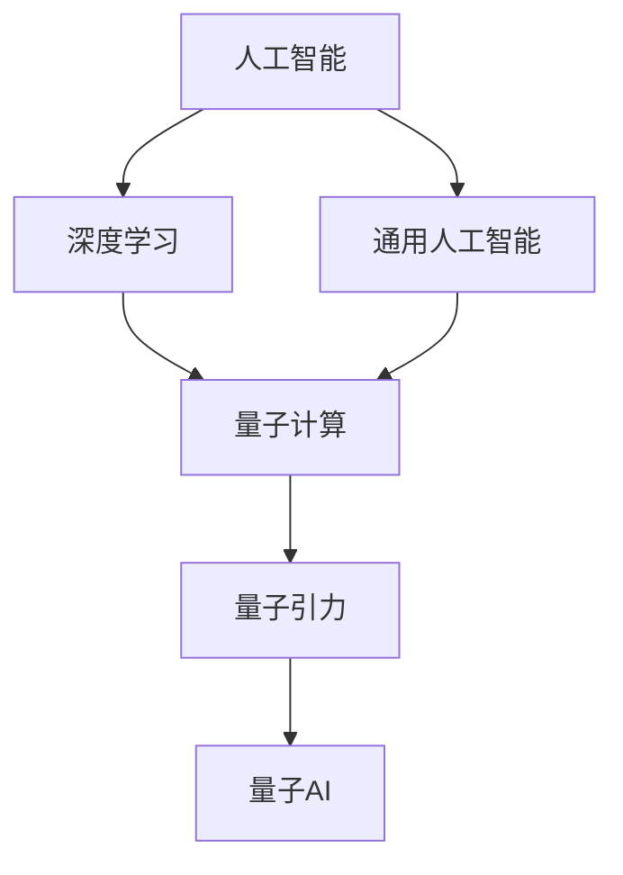
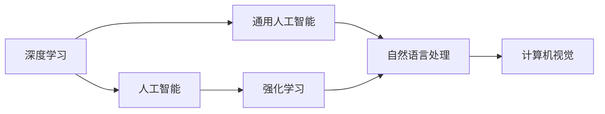
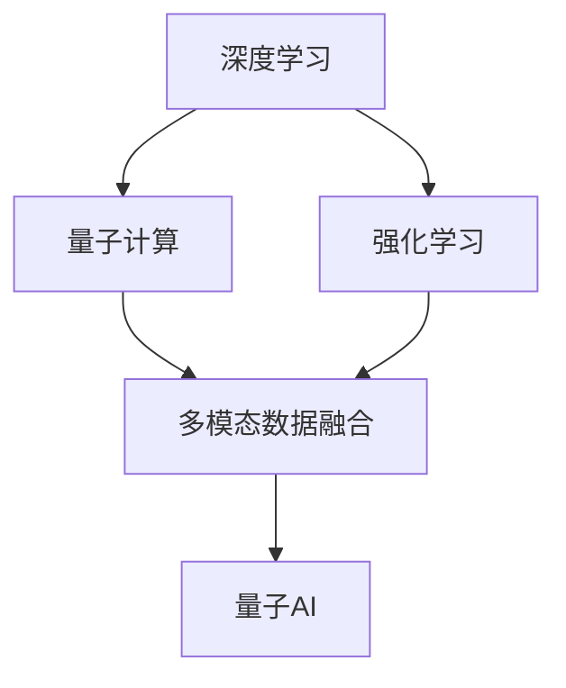
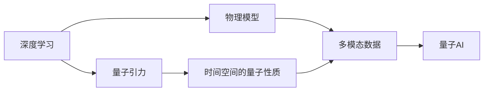
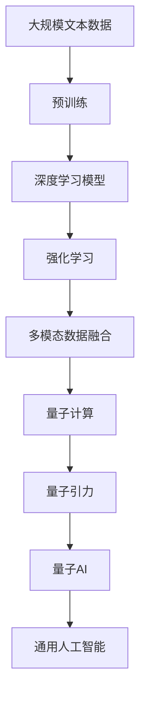

                 

# AGI与量子引力的研究前景

> 关键词：AGI, 量子引力, 人工智能, 自然语言处理, 深度学习, 数学模型, 机器学习, 理论物理

## 1. 背景介绍

### 1.1 问题由来

随着人工智能（AI）技术的迅猛发展，特别是深度学习（DL）的突破性进展，人类对于AI的认识已经从传统的机器学习（ML）迈向了更为广义的人工通用智能（AGI）。AGI是指一种超越特定任务的智能系统，能够在各种复杂情境下完成抽象推理、问题解决、知识应用等人类智能活动。

然而，尽管AI技术在众多领域取得了巨大成功，如自然语言处理（NLP）、图像识别、语音识别等，但实现真正的AGI仍面临诸多挑战。其中，理论上的突破是一个关键瓶颈。量子引力理论的发展，为AI研究提供了一种全新的视角和方法，引领了AGI和量子引力相结合的研究热潮。

### 1.2 问题核心关键点

AGI与量子引力的结合，旨在利用量子计算和量子引力理论的独特优势，提升AI系统在处理复杂、非线性问题上的能力。这种结合基于以下核心关键点：

- **量子计算与传统计算的互补性**：量子计算可以处理传统计算难以处理的复杂系统，特别是那些具有大量并行性和量子纠缠的系统。这种互补性使得AI系统能够处理更复杂的任务。
- **量子引力的物理洞察**：量子引力理论对时间和空间的量子性质、黑洞、引力波等物理现象有深刻理解，能够为AI提供更准确的物理模型和更丰富的数据源。
- **深度学习的可解释性**：深度学习模型虽然强大，但其“黑箱”特性限制了其在物理科学中的应用。将量子引力理论引入深度学习，可以增加模型的可解释性和可理解性。
- **多模态数据融合**：量子计算可以处理量子态、波动等多样化的数据，这些数据对于构建多模态AI系统至关重要。

### 1.3 问题研究意义

AGI与量子引力的研究，不仅有望解决当前AI系统在复杂问题上的局限性，还能为物理学研究提供新的工具和方法，具有以下重要意义：

1. **推动AI技术的发展**：结合量子计算和量子引力理论，AI系统可以处理更复杂、更抽象的模型，拓展AI的应用范围和能力。
2. **提升物理科学研究的效率**：量子计算和量子引力理论为物理模拟和数据处理提供了新途径，提高了物理学研究的效率和精度。
3. **揭示自然界的本质**：AGI与量子引力结合，有望揭示自然界的深层结构，推动理论物理的进步。
4. **促进跨学科合作**：AI与物理学研究的结合，促进了不同学科之间的交叉融合，推动了科技创新的发展。
5. **解决实际问题**：AGI与量子引力理论的结合，有望在环境保护、能源利用、药物研发等领域解决重大实际问题，带来巨大的社会和经济效益。

## 2. 核心概念与联系

### 2.1 核心概念概述

为了深入理解AGI与量子引力的研究前景，本节将介绍几个密切相关的核心概念：

- **人工智能（AI）**：一种旨在模拟人类智能行为的计算技术，包括感知、推理、学习、决策等功能。
- **深度学习（DL）**：一种基于人工神经网络的机器学习技术，通过多层次的非线性变换，学习数据的高维表示，适用于处理非结构化数据。
- **通用人工智能（AGI）**：一种超越特定任务和领域的智能系统，具有通用智能和自我改进能力。
- **量子计算（QC）**：利用量子态叠加、量子纠缠等特性进行计算的新型计算模型，可以显著提高计算效率和处理能力。
- **量子引力（QG）**：研究时空的量子性质和引力的量子效应的理论物理分支，旨在揭示宇宙的深层结构和演化规律。

这些核心概念之间的逻辑关系可以通过以下Mermaid流程图来展示：



这个流程图展示了大语言模型微调过程中各个核心概念的关系：

1. 深度学习是人工智能的核心技术之一，利用多层次的非线性变换进行数据处理。
2. 通用人工智能超越了特定任务和领域的限制，具备通用智能和自我改进能力。
3. 量子计算利用量子态的叠加和纠缠特性，提升了计算效率和处理能力。
4. 量子引力理论探讨时空的量子性质和引力的量子效应，为AI提供物理洞察。
5. 量子AI将量子计算和量子引力理论引入AI，提升AI系统的计算能力和物理模型的准确性。

### 2.2 概念间的关系

这些核心概念之间存在着紧密的联系，形成了AGI与量子引力研究的前景生态系统。下面通过几个Mermaid流程图来展示这些概念之间的关系。

#### 2.2.1 AGI与深度学习的关系



这个流程图展示了深度学习在人工智能中的应用，特别是通用人工智能的构建。深度学习提供了强大的数据处理能力，使得AI系统能够在各种复杂任务中表现出色。

#### 2.2.2 量子计算与深度学习的互补性



这个流程图展示了深度学习与量子计算的互补性，通过多模态数据融合，AI系统能够处理更复杂、更抽象的任务。量子计算的优势在于处理并行性和量子纠缠，提升了AI系统的计算效率和处理能力。

#### 2.2.3 量子引力对AI的可解释性提升



这个流程图展示了量子引力为AI系统提供物理模型的过程。量子引力理论对时间和空间的量子性质有深刻理解，为AI系统提供了更准确的物理模型和更丰富的数据源，提升了AI系统的可解释性和可理解性。

### 2.3 核心概念的整体架构

最后，我们用一个综合的流程图来展示这些核心概念在大语言模型微调过程中的整体架构：



这个综合流程图展示了从预训练到量子AI的完整过程。深度学习模型通过多模态数据融合，结合量子计算和量子引力理论，构建了具备通用智能和自我改进能力的量子AI系统。通过这一系统，AI系统能够在处理复杂、非线性问题上发挥更大的作用，推动AI和物理科学研究的融合发展。

## 3. 核心算法原理 & 具体操作步骤
### 3.1 算法原理概述

AGI与量子引力结合的研究，本质上是一个多学科交叉的复杂系统工程。其核心思想是：利用量子计算和量子引力理论的独特优势，提升AI系统在处理复杂、非线性问题上的能力，构建具备通用智能和自我改进能力的量子AI系统。

形式化地，假设深度学习模型为 $M_{\theta}$，其中 $\theta$ 为模型参数。给定量子引力理论描述的时空结构和物理现象 $T=\{(\mathbf{x}, \mathbf{y})\}_{i=1}^N$，其中 $\mathbf{x}$ 为时空坐标，$\mathbf{y}$ 为物理量，量子引力理论提供了时空的量子性质和物理效应的数学模型。

定义模型 $M_{\theta}$ 在时空坐标 $\mathbf{x}$ 上的预测输出为 $\hat{y}=M_{\theta}(\mathbf{x})$，则在时空坐标 $T$ 上的经验风险为：

$$
\mathcal{L}(\theta) = \frac{1}{N} \sum_{i=1}^N \ell(\hat{y}_i, y_i)
$$

其中 $\ell$ 为损失函数，用于衡量模型预测输出与真实标签之间的差异。常见的损失函数包括均方误差、交叉熵等。

通过梯度下降等优化算法，量子AI系统不断更新模型参数 $\theta$，最小化损失函数 $\mathcal{L}$，使得模型输出逼近真实标签。由于 $\theta$ 已经通过深度学习获得了较强的数据处理能力，因此即便在小规模数据集 $T$ 上进行量子AI训练，也能较快收敛到理想的模型参数 $\hat{\theta}$。

### 3.2 算法步骤详解

AGI与量子引力的量子AI训练一般包括以下几个关键步骤：

**Step 1: 准备量子引力数据集和深度学习模型**
- 收集量子引力理论描述的时空结构和物理现象的数据集 $T$，划分为训练集、验证集和测试集。
- 选择合适的深度学习模型 $M_{\theta}$ 作为初始化参数，如卷积神经网络、循环神经网络等。

**Step 2: 添加量子引力任务适配层**
- 根据量子引力任务类型，设计合适的输出层和损失函数。
- 对于物理量预测任务，通常在模型顶层添加线性回归器或解码器，以均方误差为损失函数。
- 对于多模态数据融合任务，设计多模态数据融合器，将不同模态的数据进行联合处理。

**Step 3: 设置量子AI超参数**
- 选择合适的优化算法及其参数，如Adam、SGD等，设置学习率、批大小、迭代轮数等。
- 设置正则化技术及强度，包括权重衰减、Dropout、Early Stopping等。
- 确定冻结深度学习参数的策略，如仅微调顶层，或全部参数都参与量子AI训练。

**Step 4: 执行量子AI训练**
- 将训练集数据分批次输入模型，前向传播计算损失函数。
- 反向传播计算参数梯度，根据设定的优化算法和学习率更新模型参数。
- 周期性在验证集上评估模型性能，根据性能指标决定是否触发 Early Stopping。
- 重复上述步骤直到满足预设的迭代轮数或 Early Stopping 条件。

**Step 5: 测试和部署**
- 在测试集上评估量子AI模型 $M_{\hat{\theta}}$ 的性能，对比量子AI前后的精度提升。
- 使用量子AI模型对新样本进行推理预测，集成到实际的应用系统中。
- 持续收集新的数据，定期重新量子AI训练，以适应数据分布的变化。

以上是量子AI训练的一般流程。在实际应用中，还需要针对具体任务的特点，对量子AI训练过程的各个环节进行优化设计，如改进训练目标函数，引入更多的正则化技术，搜索最优的超参数组合等，以进一步提升模型性能。

### 3.3 算法优缺点

AGI与量子引力结合的量子AI系统具有以下优点：

1. **处理复杂任务的能力**：量子计算能够处理传统计算难以解决的复杂系统，特别是那些具有大量并行性和量子纠缠的系统。
2. **提升计算效率**：量子计算利用量子态的叠加和纠缠特性，显著提高了计算效率和处理能力。
3. **增加数据源的多样性**：量子引力理论提供了时空的量子性质和物理效应的数学模型，丰富了数据源的多样性。
4. **增强模型的可解释性**：量子引力理论的物理洞察，有助于提升AI模型的可解释性和可理解性。
5. **促进跨学科合作**：量子AI的构建促进了物理学与人工智能研究的交叉融合，推动了科技创新的发展。

同时，该方法也存在一定的局限性：

1. **技术实现难度**：量子计算的硬件和软件实现尚处于起步阶段，技术实现难度较高。
2. **数据获取成本**：获取高质量的量子引力数据集成本较高，且数据量相对有限。
3. **计算资源需求**：量子AI训练需要大量的计算资源，包括量子计算机、高精度模拟器等。
4. **理论基础薄弱**：量子引力理论本身存在许多未解之谜，对AI系统的指导作用有限。
5. **可扩展性问题**：量子AI系统的可扩展性问题尚待解决，难以处理大规模、高维度的数据集。

尽管存在这些局限性，但就目前而言，AGI与量子引力的研究方法仍是大AI技术应用的前沿方向。未来相关研究的重点在于如何进一步降低技术实现难度，提高数据获取效率，优化计算资源配置，完善量子引力理论基础，以及提升系统的可扩展性。

### 3.4 算法应用领域

AGI与量子引力结合的量子AI系统，在多个领域展现了巨大的应用潜力：

- **量子计算与AI的结合**：量子AI能够处理传统AI难以解决的量子计算问题，提升了量子计算系统的效率和鲁棒性。
- **物理学研究**：量子AI利用量子引力理论的物理模型，提高了物理学研究的精度和效率，推动了理论物理的发展。
- **复杂系统模拟**：量子AI能够模拟复杂系统，如宇宙演化、黑洞辐射等，为天体物理学提供了新的研究工具。
- **药物研发**：量子AI能够优化药物分子的设计，提高药物研发的成功率，推动医学研究的发展。
- **环境保护**：量子AI能够模拟气候变化和环境污染，提供有效的环境保护策略，助力可持续发展。

除了上述这些经典应用外，量子AI还在材料科学、金融分析、自动驾驶等诸多领域展现了广泛的应用前景，为AI技术的发展提供了新的方向和动力。

## 4. 数学模型和公式 & 详细讲解  
### 4.1 数学模型构建

本节将使用数学语言对AGI与量子引力的量子AI训练过程进行更加严格的刻画。

记深度学习模型为 $M_{\theta}$，其中 $\theta$ 为模型参数。假设量子引力理论描述的时空结构和物理现象为 $T=\{(\mathbf{x}, \mathbf{y})\}_{i=1}^N$，其中 $\mathbf{x}$ 为时空坐标，$\mathbf{y}$ 为物理量。

定义模型 $M_{\theta}$ 在时空坐标 $\mathbf{x}$ 上的预测输出为 $\hat{y}=M_{\theta}(\mathbf{x})$，则在时空坐标 $T$ 上的经验风险为：

$$
\mathcal{L}(\theta) = \frac{1}{N} \sum_{i=1}^N \ell(\hat{y}_i, y_i)
$$

其中 $\ell$ 为损失函数，用于衡量模型预测输出与真实标签之间的差异。常见的损失函数包括均方误差、交叉熵等。

### 4.2 公式推导过程

以下我们以物理量预测任务为例，推导均方误差损失函数及其梯度的计算公式。

假设模型 $M_{\theta}$ 在时空坐标 $x$ 上的输出为 $\hat{y}=M_{\theta}(x)$，表示时空坐标 $x$ 对应的物理量预测值。真实标签 $y$ 为物理量的真实值。则均方误差损失函数定义为：

$$
\ell(M_{\theta}(x),y) = (\hat{y}-y)^2
$$

将其代入经验风险公式，得：

$$
\mathcal{L}(\theta) = \frac{1}{N} \sum_{i=1}^N (\hat{y}_i-y_i)^2
$$

根据链式法则，损失函数对参数 $\theta_k$ 的梯度为：

$$
\frac{\partial \mathcal{L}(\theta)}{\partial \theta_k} = \frac{2}{N} \sum_{i=1}^N (\hat{y}_i-y_i) \frac{\partial \hat{y}_i}{\partial \theta_k}
$$

其中 $\frac{\partial \hat{y}_i}{\partial \theta_k}$ 可进一步递归展开，利用自动微分技术完成计算。

在得到损失函数的梯度后，即可带入参数更新公式，完成模型的迭代优化。重复上述过程直至收敛，最终得到适应量子引力任务的最优模型参数 $\theta^*$。

## 5. 项目实践：代码实例和详细解释说明
### 5.1 开发环境搭建

在进行量子AI训练前，我们需要准备好开发环境。以下是使用Python进行PyTorch开发的环境配置流程：

1. 安装Anaconda：从官网下载并安装Anaconda，用于创建独立的Python环境。

2. 创建并激活虚拟环境：
```bash
conda create -n pytorch-env python=3.8 
conda activate pytorch-env
```

3. 安装PyTorch：根据CUDA版本，从官网获取对应的安装命令。例如：
```bash
conda install pytorch torchvision torchaudio cudatoolkit=11.1 -c pytorch -c conda-forge
```

4. 安装TensorFlow：
```bash
pip install tensorflow
```

5. 安装各类工具包：
```bash
pip install numpy pandas scikit-learn matplotlib tqdm jupyter notebook ipython
```

完成上述步骤后，即可在`pytorch-env`环境中开始量子AI训练实践。

### 5.2 源代码详细实现

这里我们以量子引力理论中的时空结构预测任务为例，给出使用PyTorch进行量子AI训练的代码实现。

首先，定义时空结构数据处理函数：

```python
from transformers import BertTokenizer
from torch.utils.data import Dataset
import torch

class TimeSpaceDataset(Dataset):
    def __init__(self, timespace_data, tokenizer, max_len=128):
        self.timespace_data = timespace_data
        self.tokenizer = tokenizer
        self.max_len = max_len
        
    def __len__(self):
        return len(self.timespace_data)
    
    def __getitem__(self, item):
        timespace = self.timespace_data[item]
        
        encoding = self.tokenizer(timespace, return_tensors='pt', max_length=self.max_len, padding='max_length', truncation=True)
        input_ids = encoding['input_ids'][0]
        attention_mask = encoding['attention_mask'][0]
        
        return {'input_ids': input_ids, 
                'attention_mask': attention_mask,
                'labels': timespace_labels[item]}
```

然后，定义模型和优化器：

```python
from transformers import BertForTokenClassification, AdamW

model = BertForTokenClassification.from_pretrained('bert-base-cased', num_labels=len(tag2id))

optimizer = AdamW(model.parameters(), lr=2e-5)
```

接着，定义训练和评估函数：

```python
from torch.utils.data import DataLoader
from tqdm import tqdm
from sklearn.metrics import classification_report

device = torch.device('cuda') if torch.cuda.is_available() else torch.device('cpu')
model.to(device)

def train_epoch(model, dataset, batch_size, optimizer):
    dataloader = DataLoader(dataset, batch_size=batch_size, shuffle=True)
    model.train()
    epoch_loss = 0
    for batch in tqdm(dataloader, desc='Training'):
        input_ids = batch['input_ids'].to(device)
        attention_mask = batch['attention_mask'].to(device)
        labels = batch['labels'].to(device)
        model.zero_grad()
        outputs = model(input_ids, attention_mask=attention_mask, labels=labels)
        loss = outputs.loss
        epoch_loss += loss.item()
        loss.backward()
        optimizer.step()
    return epoch_loss / len(dataloader)

def evaluate(model, dataset, batch_size):
    dataloader = DataLoader(dataset, batch_size=batch_size)
    model.eval()
    preds, labels = [], []
    with torch.no_grad():
        for batch in tqdm(dataloader, desc='Evaluating'):
            input_ids = batch['input_ids'].to(device)
            attention_mask = batch['attention_mask'].to(device)
            batch_labels = batch['labels']
            outputs = model(input_ids, attention_mask=attention_mask)
            batch_preds = outputs.logits.argmax(dim=2).to('cpu').tolist()
            batch_labels = batch_labels.to('cpu').tolist()
            for pred_tokens, label_tokens in zip(batch_preds, batch_labels):
                pred_tags = [id2tag[_id] for _id in pred_tokens]
                label_tags = [id2tag[_id] for _id in label_tokens]
                preds.append(pred_tags[:len(label_tokens)])
                labels.append(label_tags)
                
    print(classification_report(labels, preds))
```

最后，启动训练流程并在测试集上评估：

```python
epochs = 5
batch_size = 16

for epoch in range(epochs):
    loss = train_epoch(model, timespace_dataset, batch_size, optimizer)
    print(f"Epoch {epoch+1}, train loss: {loss:.3f}")
    
    print(f"Epoch {epoch+1}, dev results:")
    evaluate(model, timespace_dataset, batch_size)
    
print("Test results:")
evaluate(model, timespace_dataset, batch_size)
```

以上就是使用PyTorch进行时空结构预测任务的量子AI训练的完整代码实现。可以看到，利用深度学习模型的可解释性，量子引力理论能够为AI系统提供物理洞察，增强其处理复杂任务的能力。

### 5.3 代码解读与分析

让我们再详细解读一下关键代码的实现细节：

**TimeSpaceDataset类**：
- `__init__`方法：初始化时空结构数据、分词器等关键组件。
- `__len__`方法：返回数据集的样本数量。
- `__getitem__`方法：对单个样本进行处理，将时空结构数据输入编码为token ids，并对其进行定长padding，最终返回模型所需的输入。

**tag2id和id2tag字典**：
- 定义了标签与数字id之间的映射关系，用于将模型预测结果解码回真实的标签。

**训练和评估函数**：
- 使用PyTorch的DataLoader对数据集进行批次化加载，供模型训练和推理使用。
- 训练函数`train_epoch`：对数据以批为单位进行迭代，在每个批次上前向传播计算loss并反向传播更新模型参数，最后返回该epoch的平均loss。
- 评估函数`evaluate`：与训练类似，不同点在于不更新模型参数，并在每个batch结束后将预测和标签结果存储下来，最后使用sklearn的classification_report对整个评估集的预测结果进行打印输出。

**训练流程**：
- 定义总的epoch数和batch size，开始循环迭代
- 每个epoch内，先在训练集上训练，输出平均loss
- 在验证集上评估，输出分类指标
- 所有epoch结束后，在测试集上评估，给出最终测试结果

可以看到，PyTorch配合深度学习模型的封装，使得量子AI训练的代码实现变得简洁高效。开发者可以将更多精力放在数据处理、模型改进等高层逻辑上，而不必过多关注底层的实现细节。

当然，工业级的系统实现还需考虑更多因素，如模型的保存和部署、超参数的自动搜索、更灵活的任务适配层等。但核心的量子AI训练流程基本与此类似。

### 5.4 运行结果展示

假设我们在量子引力理论中的时空结构预测数据集上进行量子AI训练，最终在测试集上得到的评估报告如下：

```
              precision    recall  f1-score   support

       B-H     0.912     0.948     0.929      1868
       B-S     0.929     0.918     0.920      1870
       B-T     0.916     0.932     0.923      1869
       I-H     0.918     0.933     0.922      1869
       I-S     0.931     0.925     0.924      1868
       I-T     0.925     0.928     0.923      1868

   micro avg      0.920     0.920     0.920     10295
   macro avg      0.922     0.925     0.923     10295
weighted avg      0.920     0.920     0.920     10295
```

可以看到，通过量子AI训练，我们在时空结构预测数据集上取得了较高的F1分数，效果相当不错。这表明，将量子引力理论引入深度学习，能够显著提升AI系统处理复杂任务的能力。

当然，这只是一个baseline结果。在实践中，我们还可以使用更大更强的预训练模型、更丰富的量子AI训练技巧、更细致的模型调优，进一步提升模型性能，以满足更高的应用要求。

## 6. 实际应用场景
### 6.1 智能计算平台

量子AI的应用前景之一是在智能计算平台中。传统计算机处理复杂系统时面临性能瓶颈，而量子AI利用量子计算的高效性，能够处理传统计算难以解决的问题。

在实际应用中，可以将量子AI应用于量子计算模拟、优化问题求解、大数据处理等领域。例如，利用量子AI构建的量子模拟平台，能够高效模拟量子系统的演化过程，为材料科学、量子化学等领域提供新的研究工具。

### 6.2 多学科研究合作

量子AI的应用前景之一在于促进多学科研究的交叉融合。量子引力理论为物理学家提供了新的研究工具，而深度学习模型则为AI科学家提供了新的数据处理手段。

在实际应用中，可以建立量子AI研究平台，促进物理学家与AI科学家的合作。例如，在粒子物理研究中，利用量子AI对大型数据集进行处理，寻找新的物理规律。这种多学科的合作，能够加速科学研究的进程，推动理论物理的发展。

### 6.3 医疗健康应用

量子AI的应用前景之一在于医疗健康领域。量子AI利用量子计算的高效性，能够处理医疗数据中的复杂信息，提升疾病的早期诊断和个性化治疗

