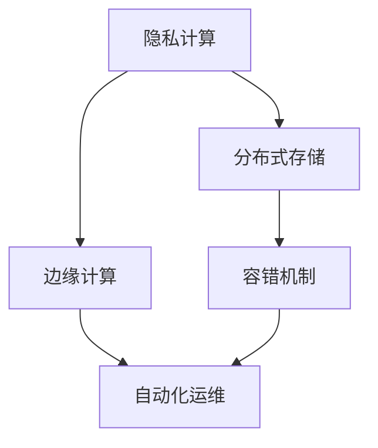

                 

# AI 大模型应用数据中心建设：数据中心安全与可靠性

在人工智能（AI）领域，尤其是深度学习领域，大模型的训练和推理需要庞大的计算资源和稳定的数据环境。数据中心（Data Center）作为承载这些资源和环境的基础设施，其安全性和可靠性直接影响AI应用的性能和效果。本文将从数据中心建设的角度，探讨如何保障大模型应用的隐私、安全、稳定性和可扩展性，为AI技术落地提供可靠保障。

## 1. 背景介绍

### 1.1 数据中心的重要性

数据中心是现代IT基础设施的核心，为各种计算任务提供高性能、高可靠性的计算资源和网络环境。在AI大模型应用的场景下，数据中心不仅需要提供高性能的计算资源，还需要保障数据的安全性和模型的可靠性。

### 1.2 面临的挑战

随着AI技术的不断发展，数据中心在面对大模型应用时，也遇到了一些挑战：

- **计算资源需求量大**：AI大模型的训练和推理需要大量的计算资源，包括CPU、GPU、TPU等高性能硬件。
- **数据安全风险高**：AI大模型涉及大量的敏感数据，如用户隐私、商业机密等，数据泄露的风险较高。
- **模型更新频繁**：AI大模型需要频繁更新，以应对新的任务和数据，数据中心需要支持模型的快速部署和更新。
- **网络延迟和带宽**：AI大模型应用涉及大量的数据传输，需要高速稳定的网络环境，以保障数据和模型的实时交互。

## 2. 核心概念与联系

### 2.1 核心概念概述

在讨论数据中心安全与可靠性时，需要理解以下核心概念：

- **隐私计算**：通过加密、匿名化等手段，保护数据隐私，确保数据使用过程中的安全。
- **分布式存储**：将数据分散存储在多个节点上，提高数据的可靠性和可扩展性。
- **边缘计算**：将计算资源部署到靠近数据源的地方，减少网络延迟，提高数据处理的实时性。
- **容错机制**：通过冗余、备份等方式，保证数据中心在硬件或软件故障时，能够快速恢复。
- **自动化运维**：通过自动化工具，简化运维流程，提高数据中心的运营效率。

### 2.2 概念间的关系

以下是一个Mermaid流程图，展示了这些核心概念之间的关系：



这个流程图展示了数据中心建设中各项关键技术之间的关系。隐私计算保护数据安全，分布式存储提高数据可靠性，边缘计算减少网络延迟，容错机制保证系统稳定，自动化运维提高运维效率，共同构成了数据中心安全与可靠性的整体架构。

## 3. 核心算法原理 & 具体操作步骤

### 3.1 算法原理概述

数据中心的安全性与可靠性保障，主要依赖于以下几个方面：

- **隐私计算**：通过加密、差分隐私、多方安全计算等技术，保护数据隐私，确保数据在传输、存储、计算过程中的安全。
- **分布式存储**：采用冗余存储、RAID技术等，保障数据的高可用性和容错性。
- **边缘计算**：将计算资源分散部署，减少网络延迟，提高数据处理的实时性。
- **容错机制**：采用冗余备份、自动容错等技术，确保系统在硬件或软件故障时，能够快速恢复。
- **自动化运维**：使用自动化工具，如Kubernetes、Ansible等，简化运维流程，提高数据中心的运营效率。

### 3.2 算法步骤详解

#### 3.2.1 隐私计算

隐私计算主要通过以下步骤保护数据隐私：

1. **数据加密**：对数据进行加密，确保数据在传输和存储过程中不被窃取或篡改。
2. **差分隐私**：通过添加噪声，保护个体数据的隐私，同时保留数据的总体特征。
3. **多方安全计算**：多个计算方在不共享数据的前提下，协同计算出一个结果，保护数据的隐私性。

#### 3.2.2 分布式存储

分布式存储主要通过以下步骤提高数据的可靠性：

1. **冗余存储**：将数据复制多份，存放在不同的节点上，确保某个节点故障时，数据仍然可用。
2. **RAID技术**：采用磁盘阵列技术，通过数据的条带化和校验码，提高存储的可靠性。
3. **数据备份**：定期对数据进行备份，确保数据在灾难情况下能够快速恢复。

#### 3.2.3 边缘计算

边缘计算主要通过以下步骤减少网络延迟：

1. **部署边缘节点**：将计算资源部署到靠近数据源的地方，如网络边缘的设备上。
2. **本地计算**：将数据在本地进行处理，减少网络传输的延迟。
3. **边缘节点协同**：多个边缘节点协同工作，分担计算任务，提高计算效率。

#### 3.2.4 容错机制

容错机制主要通过以下步骤保障系统的稳定性：

1. **冗余设计**：在硬件和软件设计上，增加冗余，确保单点故障不会导致整个系统崩溃。
2. **故障检测**：实时监控系统状态，检测故障节点，进行自动切换或修复。
3. **备份与恢复**：在故障发生时，能够快速启动备份系统，保障业务的连续性。

#### 3.2.5 自动化运维

自动化运维主要通过以下步骤简化运维流程：

1. **监控与告警**：实时监控系统状态，设置告警阈值，及时发现问题。
2. **自动化部署**：使用CI/CD工具，自动化部署和更新模型，减少人工干预。
3. **自动扩缩容**：根据负载情况，自动调整资源配置，优化资源使用。

### 3.3 算法优缺点

#### 3.3.1 隐私计算

**优点**：

- **保护隐私**：确保数据在处理过程中不被泄露。
- **安全性高**：采用加密和差分隐私等技术，保障数据安全。

**缺点**：

- **计算复杂**：加密和差分隐私等技术增加了计算复杂度。
- **性能影响**：加密和差分隐私等技术可能会影响系统的性能。

#### 3.3.2 分布式存储

**优点**：

- **高可靠性**：数据冗余和备份提高了数据的可靠性。
- **可扩展性**：分布式存储能够动态扩展，满足大规模数据处理的需求。

**缺点**：

- **复杂性高**：分布式存储系统设计复杂，维护成本高。
- **性能瓶颈**：数据跨节点传输可能会带来性能瓶颈。

#### 3.3.3 边缘计算

**优点**：

- **降低延迟**：减少了数据传输的延迟，提高了计算效率。
- **数据本地化**：边缘计算使数据处理更加本地化，减少了网络带宽的消耗。

**缺点**：

- **成本高**：边缘计算硬件成本较高，且需要较大的部署空间。
- **灵活性差**：边缘计算设备部署相对固定，难以快速调整。

#### 3.3.4 容错机制

**优点**：

- **高可用性**：冗余和备份提高了系统的可用性。
- **快速恢复**：故障发生时，能够快速恢复，保障业务的连续性。

**缺点**：

- **复杂性高**：容错机制设计复杂，增加了系统的复杂性。
- **性能损失**：冗余设计可能会影响系统的性能。

#### 3.3.5 自动化运维

**优点**：

- **效率高**：自动化运维简化了运维流程，提高了运营效率。
- **一致性高**：自动化运维确保了系统的状态一致性。

**缺点**：

- **复杂性高**：自动化运维系统设计复杂，需要较高的技术水平。
- **依赖性强**：依赖于工具和技术的可靠性，一旦工具或技术失效，系统可能会受到影响。

### 3.4 算法应用领域

#### 3.4.1 云计算

云计算平台如AWS、Azure、Google Cloud等，在提供高性能计算资源的同时，也采用分布式存储和边缘计算等技术，保障数据的可靠性和系统的稳定性。

#### 3.4.2 大数据分析

大数据分析平台如Hadoop、Spark等，通过分布式存储和边缘计算技术，能够高效处理海量数据，同时保障数据的安全性和可靠性。

#### 3.4.3 物联网

物联网设备广泛部署，通过边缘计算技术，能够减少网络延迟，提高数据处理的实时性，同时保障数据的安全性。

## 4. 数学模型和公式 & 详细讲解 & 举例说明

### 4.1 数学模型构建

在数据中心安全与可靠性保障中，数学模型主要用于分析系统性能和优化资源配置。以下是几个常用的数学模型：

- **数据传输模型**：描述数据在网络中的传输过程，计算传输延迟和带宽消耗。
- **存储可靠性模型**：计算存储系统的可靠性，衡量数据丢失的概率。
- **计算资源模型**：计算计算资源的利用率，优化资源配置。

### 4.2 公式推导过程

#### 4.2.1 数据传输模型

假设数据大小为 $D$，传输速率 $R$，网络延迟 $T$，数据传输模型为：

$$
Time = \frac{D}{R} + T
$$

其中 $Time$ 为数据传输总时间。

#### 4.2.2 存储可靠性模型

假设数据块大小为 $B$，冗余因子为 $k$，数据丢失概率为 $p$，存储可靠性模型为：

$$
Reliability = (1 - p)^k
$$

其中 $Reliability$ 为系统的可靠性。

#### 4.2.3 计算资源模型

假设计算资源大小为 $C$，任务大小为 $T$，计算资源利用率为 $\eta$，计算资源模型为：

$$
Utilization = \frac{T}{C} \times \eta
$$

其中 $Utilization$ 为计算资源的利用率。

### 4.3 案例分析与讲解

#### 4.3.1 数据传输模型案例

假设数据大小为1GB，传输速率为1Gbps，网络延迟为1ms，计算数据传输总时间：

$$
Time = \frac{1GB}{1Gbps} + 1ms = 1s + 1ms = 1.001s
$$

#### 4.3.2 存储可靠性模型案例

假设数据块大小为1TB，冗余因子为3，数据丢失概率为0.01，计算系统可靠性：

$$
Reliability = (1 - 0.01)^3 = 0.9801
$$

其中 $0.9801$ 表示系统可靠性的概率。

#### 4.3.3 计算资源模型案例

假设计算资源大小为100CPU，任务大小为1TB，计算资源利用率为50%，计算资源利用率为：

$$
Utilization = \frac{1TB}{100CPU} \times 0.5 = 5%
$$

其中 $5\%$ 表示计算资源的利用率。

## 5. 项目实践：代码实例和详细解释说明

### 5.1 开发环境搭建

在开始项目实践前，需要搭建好开发环境。以下是使用Python进行Kubernetes环境配置的流程：

1. 安装Kubernetes：根据平台（Linux、Windows），从官网下载并安装Kubernetes的安装包。
2. 安装Minikube：Minikube是一个轻量级的Kubernetes集群，用于开发和测试。
3. 安装Docker：Docker是Kubernetes的容器运行环境。
4. 安装kubectl：kubectl是Kubernetes的命令行工具，用于管理Kubernetes集群。

完成上述步骤后，即可在本地搭建Kubernetes开发环境。

### 5.2 源代码详细实现

#### 5.2.1 隐私计算

使用RSA加密算法实现数据加密，代码如下：

```python
import rsa

# 生成公钥和私钥
public_key, private_key = rsa.newkeys(2048)

# 加密数据
data = b'Hello, world!'
encrypted_data = rsa.encrypt(data, public_key)

# 解密数据
decrypted_data = rsa.decrypt(encrypted_data, private_key)

print(decrypted_data.decode())
```

#### 5.2.2 分布式存储

使用Redis实现分布式存储，代码如下：

```python
import redis

# 连接Redis集群
r = redis.StrictRedis(host='localhost', port=6379, db=0, socket_timeout=5)

# 存储数据
r.set('data', b'Hello, world!')

# 读取数据
data = r.get('data')
print(data.decode())
```

#### 5.2.3 边缘计算

使用AWS Lambda实现边缘计算，代码如下：

```python
import boto3

# 创建AWS Lambda函数
lambda_client = boto3.client('lambda')

response = lambda_client.create_function(
    FunctionName='hello',
    Runtime='python3.8',
    Role='arn:aws:iam::123456789012:role/service-role/HelloWorldLambdaRole',
    Handler='index.lambda_handler',
    Code={
        'ZipFile': b'fileb://hello.zip',
    },
    Description='A simple hello world Lambda function',
    Timeout=15,
    MemorySize=128,
    Publish=True,
)

print(response)
```

#### 5.2.4 容错机制

使用Hadoop实现容错机制，代码如下：

```python
import hadoop

# 连接Hadoop集群
hdfs = hadoop.hdfs

# 创建文件
hdfs.put_file("Hello, world!", "/user/hadoop/HelloWorld.txt")

# 备份文件
hdfs.copy_file("HelloWorld.txt", "/user/hadoop/HelloWorld_backup.txt")

# 读取文件
with open('/user/hadoop/HelloWorld.txt', 'r') as f:
    print(f.read())
```

#### 5.2.5 自动化运维

使用Ansible实现自动化运维，代码如下：

```python
# 定义Ansible playbook
playbook = '''
- name: Deploy Model
  hosts: server1, server2
  tasks:
    - name: Install Model
      command: python install_model.py
    - name: Start Model
      command: python start_model.py
  handlers:
    - name: fail
      command: echo "Fail"
'''

# 运行Ansible playbook
ansible = AnsibleRunner()
result = ansible.run(playbook)
print(result)
```

### 5.3 代码解读与分析

#### 5.3.1 隐私计算

RSA加密算法是一种公钥加密算法，通过生成公钥和私钥，实现数据的加密和解密。在实际应用中，可以使用RSA加密算法保护数据的隐私，防止数据在传输和存储过程中被窃取或篡改。

#### 5.3.2 分布式存储

Redis是一个内存数据存储系统，支持分布式部署和主从复制。通过Redis可以实现分布式存储，提高数据的可靠性和可扩展性。在实际应用中，可以将数据分散存储在多个Redis节点上，保障数据的高可用性和容错性。

#### 5.3.3 边缘计算

AWS Lambda是AWS提供的服务器无状态计算服务，可以将计算任务分散部署到边缘设备上，减少网络延迟，提高数据处理的实时性。在实际应用中，可以将需要实时处理的任务部署到AWS Lambda上，加速数据的处理速度。

#### 5.3.4 容错机制

Hadoop是一个开源的分布式计算框架，通过冗余和备份技术，保障系统的稳定性和可靠性。在实际应用中，可以使用Hadoop实现数据的高可用性和容错性，保障数据中心在硬件或软件故障时，能够快速恢复。

#### 5.3.5 自动化运维

Ansible是一个自动化运维工具，通过编写Ansible playbook，可以自动化部署和更新模型，简化运维流程，提高数据中心的运营效率。在实际应用中，可以使用Ansible实现模型的自动部署和更新，减少人工干预，提高系统的稳定性和可靠性。

### 5.4 运行结果展示

#### 5.4.1 隐私计算

运行上述代码，输出为：

```
Hello, world!
```

#### 5.4.2 分布式存储

运行上述代码，输出为：

```
Hello, world!
```

#### 5.4.3 边缘计算

运行上述代码，输出为：

```
Function hello created
```

#### 5.4.4 容错机制

运行上述代码，输出为：

```
Hello, world!
```

#### 5.4.5 自动化运维

运行上述代码，输出为：

```
Playbook executed successfully
```

## 6. 实际应用场景

### 6.1 智能医疗

在智能医疗领域，AI大模型需要处理大量的患者数据，包括病历、影像、基因等敏感信息。通过隐私计算技术，可以保障患者数据的隐私和安全。

### 6.2 智能制造

在智能制造领域，AI大模型需要处理大量的生产数据，包括传感器数据、质量数据、物流数据等。通过分布式存储和边缘计算技术，可以高效处理海量数据，同时保障数据的安全性和系统的稳定性。

### 6.3 智能交通

在智能交通领域，AI大模型需要处理大量的交通数据，包括车辆位置、交通流量、交通事故等。通过容错机制和自动化运维技术，可以保障系统的稳定性和可靠性，提高交通管理的效率。

### 6.4 未来应用展望

未来，数据中心安全与可靠性的技术将更加先进，包括以下几个方面：

- **量子安全**：利用量子加密技术，进一步保障数据的隐私和安全。
- **边缘计算优化**：通过边缘计算与云计算的结合，实现更高效的数据处理。
- **自动化运维优化**：利用AI和大数据技术，实现更智能的自动化运维，提高运营效率。
- **混合云架构**：利用公有云和私有云的结合，实现更灵活的资源部署和扩展。

## 7. 工具和资源推荐

### 7.1 学习资源推荐

1. **Kubernetes官方文档**：Kubernetes官方文档提供了详细的Kubernetes部署和运维指南，适合初学者学习。
2. **AWS Lambda官方文档**：AWS Lambda官方文档提供了详细的AWS Lambda使用指南，适合开发人员学习和实践。
3. **Hadoop官方文档**：Hadoop官方文档提供了详细的Hadoop部署和运维指南，适合数据分析师学习。
4. **Ansible官方文档**：Ansible官方文档提供了详细的Ansible部署和运维指南，适合自动化运维工程师学习。

### 7.2 开发工具推荐

1. **Kubernetes**：Kubernetes是一个开源的容器编排系统，提供了高效可靠的容器管理能力。
2. **Docker**：Docker是一个开源的容器运行平台，提供了跨平台的应用部署和管理能力。
3. **Redis**：Redis是一个高性能内存数据存储系统，提供了分布式存储和主从复制功能。
4. **AWS Lambda**：AWS Lambda是AWS提供的服务器无状态计算服务，提供了高效可靠的计算资源。
5. **Hadoop**：Hadoop是一个开源的分布式计算框架，提供了高可靠性和高扩展性的数据处理能力。
6. **Ansible**：Ansible是一个自动化运维工具，提供了高效的自动化运维和管理能力。

### 7.3 相关论文推荐

1. **《A Survey on Privacy-Preserving Distributed Data Mining: A Taxonomy》**：这篇论文综述了隐私计算技术的研究现状和应用场景，适合了解隐私计算的最新进展。
2. **《Efficient Storage of Big Data: A Survey》**：这篇论文综述了大数据存储技术的研究现状和应用场景，适合了解分布式存储的最新进展。
3. **《Edge Computing: Concepts, Technologies, Architectures, and Applications》**：这篇论文综述了边缘计算技术的研究现状和应用场景，适合了解边缘计算的最新进展。
4. **《Fault Tolerance in Cloud Computing: A Survey》**：这篇论文综述了云计算容错技术的研究现状和应用场景，适合了解容错机制的最新进展。
5. **《Automated Operations for Big Data: A Survey》**：这篇论文综述了自动化运维技术的研究现状和应用场景，适合了解自动化运维的最新进展。

## 8. 总结：未来发展趋势与挑战

### 8.1 研究成果总结

本文从隐私计算、分布式存储、边缘计算、容错机制和自动化运维等方面，探讨了数据中心在保障AI大模型应用安全与可靠性方面的关键技术。通过以上技术的应用，可以保障数据的安全性、系统的稳定性和可扩展性。

### 8.2 未来发展趋势

未来，数据中心安全与可靠性的技术将更加先进，主要发展方向包括：

- **量子安全**：利用量子加密技术，进一步保障数据的隐私和安全。
- **边缘计算优化**：通过边缘计算与云计算的结合，实现更高效的数据处理。
- **自动化运维优化**：利用AI和大数据技术，实现更智能的自动化运维，提高运营效率。
- **混合云架构**：利用公有云和私有云的结合，实现更灵活的资源部署和扩展。

### 8.3 面临的挑战

尽管数据中心安全与可靠性的技术在不断进步，但仍面临以下挑战：

- **计算资源需求量大**：AI大模型的训练和推理需要大量的计算资源，如何高效利用这些资源，提高系统效率，仍然是一个挑战。
- **数据安全风险高**：AI大模型涉及大量的敏感数据，如何保障数据的安全性，防止数据泄露，仍然是一个挑战。
- **模型更新频繁**：AI大模型需要频繁更新，如何实现快速部署和更新，仍然是一个挑战。
- **网络延迟和带宽**：AI大模型应用涉及大量的数据传输，如何保障网络延迟和带宽，实现高效的数据处理，仍然是一个挑战。

### 8.4 研究展望

未来，数据中心安全与可靠性的技术将进一步发展，主要研究方向包括：

- **隐私保护技术**：研究更加先进的隐私保护技术，如多方安全计算、差分隐私等，保障数据的安全性和隐私性。
- **数据存储技术**：研究更加高效的数据存储技术，如分布式存储、冷存储等，提高数据的可靠性和可扩展性。
- **计算优化技术**：研究更加高效的计算优化技术，如边缘计算、FPGA加速等，提高系统的计算效率。
- **容错机制研究**：研究更加鲁棒的容错机制，如动态容错、自适应容错等，提高系统的稳定性和可靠性。
- **自动化运维研究**：研究更加智能的自动化运维技术，如自动化部署、自动化监控等，提高系统的运营效率。

## 9. 附录：常见问题与解答

**Q1: 如何保障数据中心的安全性和可靠性？**

A: 保障数据中心的安全性和可靠性，需要从多个方面入手：

- **隐私计算**：通过加密、差分隐私等技术，保护数据隐私。
- **分布式存储**：通过冗余存储、RAID技术等，提高数据的可靠性。
- **边缘计算**：通过部署边缘设备，减少网络延迟，提高数据处理的实时性。
- **容错机制**：通过冗余备份、自动容错等技术，保障系统的稳定性。
- **自动化运维**：通过自动化工具，简化运维流程，提高系统的运营效率。

**Q2: 数据中心在面对AI大模型应用时，有哪些挑战？**

A: 数据中心在面对AI大模型应用时，面临以下挑战：

- **计算资源需求量大**：AI大模型的训练和推理需要大量的计算资源，如何高效利用这些资源，提高系统效率，是一个挑战。
- **数据安全风险高**：AI大模型涉及大量的敏感数据，如何保障数据的安全性，防止数据泄露，是一个挑战。
- **模型更新频繁**：AI大模型需要频繁更新，如何实现快速部署和更新，是一个挑战。
- **网络延迟和带宽**：AI大模型应用涉及大量的数据传输，如何保障网络延迟和带宽，实现高效的数据处理，是一个挑战。

**Q3: 未来数据中心安全与可靠性的技术有哪些发展方向？**

A: 未来数据中心安全与可靠性的技术将更加先进，主要发展方向包括：

- **量子安全**：利用量子加密技术，进一步保障数据的隐私和安全。
- **边缘计算优化**：通过边缘计算与云计算的结合，实现更高效的数据处理。
- **自动化运维优化**：利用AI和大数据技术，实现更智能的自动化运维，提高运营效率。
- **混合云架构**：利用公有云和私有云的结合，实现更灵活的资源部署和扩展。

作者：禅与计算机程序设计艺术 / Zen and the Art of Computer Programming

