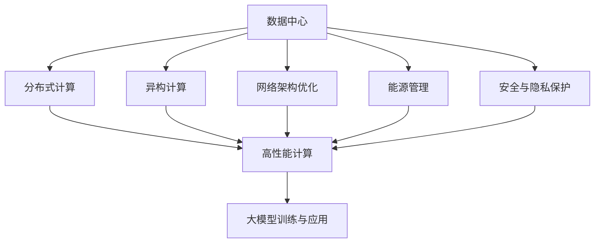
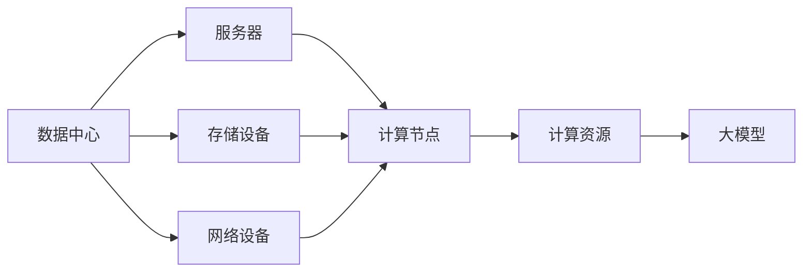
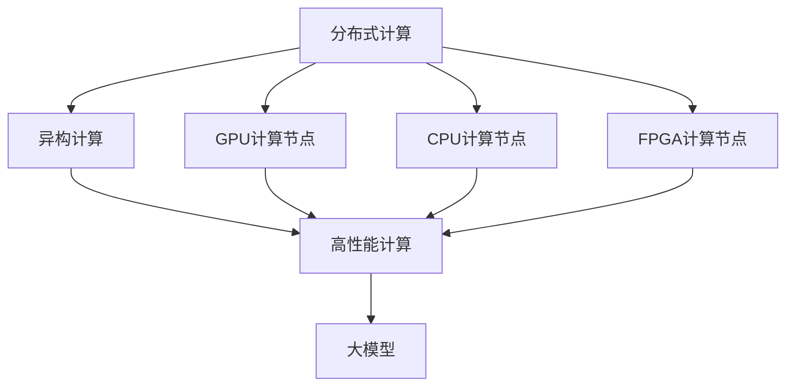
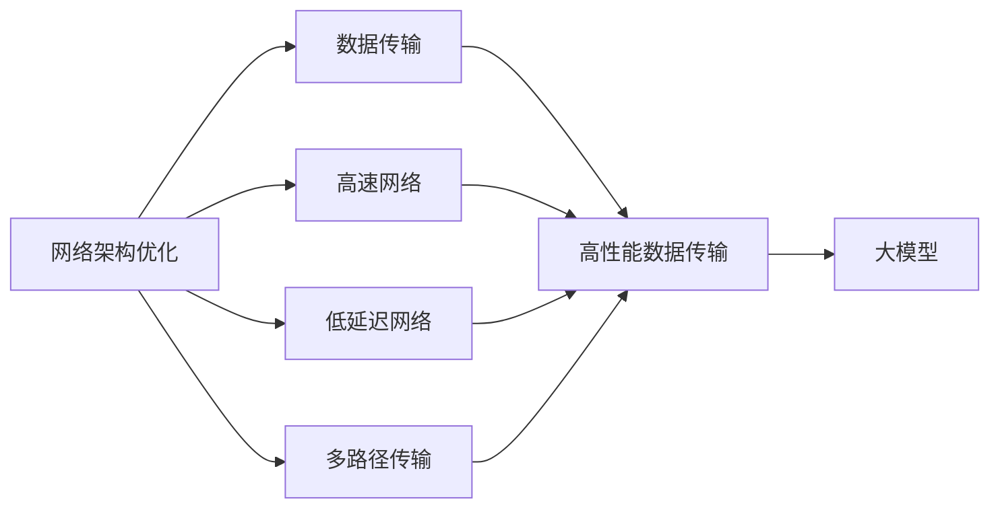
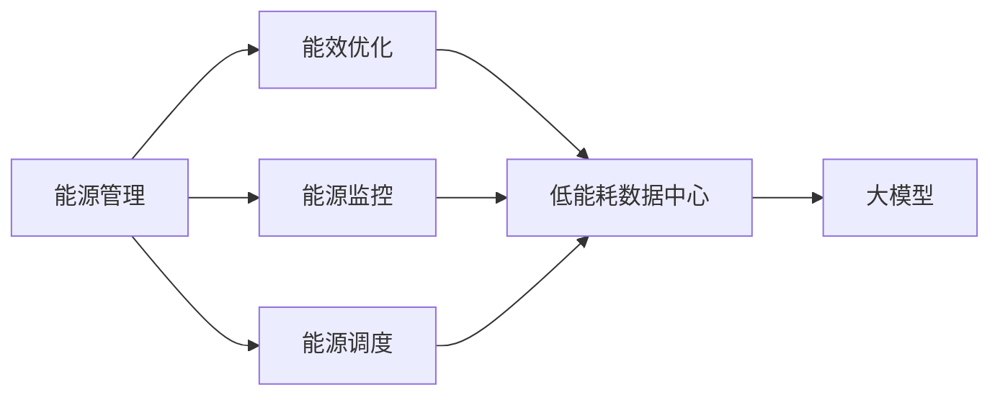
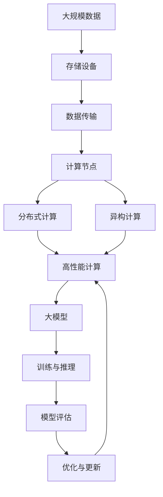

                 

# AI 大模型应用数据中心建设：数据中心技术创新与应用

## 1. 背景介绍

### 1.1 问题由来
近年来，随着人工智能技术的快速发展，大模型（Large Model）在各个领域的应用越来越广泛。无论是自然语言处理（NLP）、计算机视觉（CV）、语音识别还是推荐系统等领域，大模型都展示了其强大的能力和潜力。然而，大模型的训练和应用对计算资源的需求极高，尤其是数据中心（Data Center）的计算资源。因此，如何高效地建设和管理数据中心，支持大模型的训练和应用，成为了当前人工智能领域的重要研究方向。

### 1.2 问题核心关键点
本研究聚焦于数据中心建设技术创新与应用，探讨如何通过技术手段优化数据中心的设计和运行，以支持大模型的高效训练和应用。以下是几个核心关键点：

1. **计算资源优化**：如何在大模型训练和应用中，合理分配和利用计算资源，以提高计算效率，降低成本。
2. **数据存储与传输**：如何高效存储和传输大数据集，以保证大模型在数据中心中的稳定运行。
3. **网络架构优化**：如何构建高效的网络架构，以支持大规模数据和模型的传输。
4. **异构计算**：如何利用不同类型计算资源（如GPU、CPU、FPGA等），提升大模型训练和应用的性能。
5. **能源管理**：如何优化数据中心的能源使用，降低能耗，提高资源利用率。
6. **安全与隐私保护**：如何保障数据中心中的数据安全和隐私保护，特别是在处理敏感数据时。

### 1.3 问题研究意义
数据中心建设技术创新与应用，对于拓展大模型的应用范围，提升模型性能，加速人工智能技术的产业化进程，具有重要意义：

1. **降低应用开发成本**：通过优化数据中心的设计和运行，可以显著减少从头开发所需的数据、计算和人力等成本投入。
2. **提升模型效果**：合理分配和利用计算资源，可以有效提升模型在特定任务上的表现。
3. **加速开发进度**：standing on the shoulders of giants，优化数据中心的设计，可以更快地完成任务适配，缩短开发周期。
4. **带来技术创新**：数据中心的优化设计和技术创新，催生了新的研究方向，如异构计算、网络优化等。
5. **赋能产业升级**：优化的数据中心可以更好地支持AI技术在各行各业的应用，为传统行业数字化转型升级提供新的技术路径。

## 2. 核心概念与联系

### 2.1 核心概念概述

为更好地理解数据中心技术创新与应用，本节将介绍几个密切相关的核心概念：

- **数据中心（Data Center）**：指集中存放服务器、网络设备、存储设备等硬件设施的设施，用于支持大模型的训练和应用。
- **分布式计算**：指将计算任务分布到多台计算节点上进行并行处理，以提高计算效率。
- **异构计算**：指利用不同类型的计算资源（如GPU、CPU、FPGA等），提升大模型训练和应用的性能。
- **网络架构优化**：指通过优化数据中心的网络设计，支持大规模数据和模型的传输。
- **能源管理**：指优化数据中心的能源使用，降低能耗，提高资源利用率。
- **安全与隐私保护**：指保障数据中心中的数据安全和隐私保护，特别是在处理敏感数据时。

这些核心概念之间的逻辑关系可以通过以下Mermaid流程图来展示：



这个流程图展示了大模型训练和应用中，数据中心的各个核心概念及其之间的关系：

1. 数据中心提供计算资源，支持分布式计算和异构计算，以提高计算效率。
2. 网络架构优化和能源管理，进一步提升数据中心的运行效率。
3. 安全与隐私保护，确保数据中心中的数据安全和隐私保护。
4. 通过这些技术手段，最终支持大模型的训练和应用。

### 2.2 概念间的关系

这些核心概念之间存在着紧密的联系，形成了数据中心建设和优化设计的完整生态系统。下面我们通过几个Mermaid流程图来展示这些概念之间的关系。

#### 2.2.1 数据中心的基本架构



这个流程图展示了数据中心的基本架构：

1. 数据中心包含服务器、存储设备和网络设备。
2. 服务器上的计算节点提供计算资源，支持大模型的训练和应用。
3. 存储设备用于存储训练和应用所需的数据集。
4. 网络设备用于支持数据和模型的传输。
5. 大模型通过计算节点上的资源进行训练和应用。

#### 2.2.2 分布式计算与异构计算的结合



这个流程图展示了分布式计算与异构计算的结合：

1. 分布式计算将计算任务分配到多个计算节点上进行并行处理。
2. 异构计算利用不同类型的计算资源，提升计算效率。
3. GPU、CPU和FPGA等不同类型的计算节点，提供高性能的计算资源。
4. 通过分布式计算和异构计算的结合，支持大模型的高效训练和应用。

#### 2.2.3 网络架构优化



这个流程图展示了网络架构优化：

1. 网络架构优化通过优化网络设计，支持大规模数据和模型的传输。
2. 高速网络、低延迟网络和多路径传输，提高数据传输效率。
3. 高性能数据传输支持大模型在数据中心中的稳定运行。

#### 2.2.4 能源管理



这个流程图展示了能源管理：

1. 能源管理通过优化能源使用，降低能耗，提高资源利用率。
2. 能源监控和调度，确保能源的合理使用。
3. 低能耗数据中心，进一步提高能源效率。
4. 通过能源管理，支持大模型的高效训练和应用。

### 2.3 核心概念的整体架构

最后，我们用一个综合的流程图来展示这些核心概念在大模型训练和应用中的整体架构：



这个综合流程图展示了从数据存储到模型训练，再到模型评估和优化的完整过程。大模型通过数据中心中的计算资源进行训练和应用，同时通过分布式计算和异构计算优化计算效率，通过网络架构优化提升数据传输效率，通过能源管理降低能耗，通过安全与隐私保护保障数据安全。

## 3. 核心算法原理 & 具体操作步骤
### 3.1 算法原理概述

在大模型训练和应用中，数据中心的设计和运行直接影响计算效率和成本。以下是数据中心优化设计的核心算法原理：

- **分布式计算**：通过将计算任务分配到多个计算节点上进行并行处理，提高计算效率，降低单节点计算压力。
- **异构计算**：利用不同类型的计算资源（如GPU、CPU、FPGA等），提升计算效率，优化资源利用率。
- **网络架构优化**：通过优化网络设计，支持大规模数据和模型的传输，提高数据传输效率。
- **能源管理**：优化数据中心的能源使用，降低能耗，提高资源利用率。
- **安全与隐私保护**：确保数据中心中的数据安全和隐私保护，特别是在处理敏感数据时。

这些算法原理共同构成了数据中心建设和优化设计的核心技术手段，为大模型的训练和应用提供坚实的支持。

### 3.2 算法步骤详解

数据中心优化设计一般包括以下几个关键步骤：

**Step 1: 评估当前数据中心性能**

- 使用性能监控工具，评估数据中心的计算、存储、网络等各个组件的性能指标。
- 根据评估结果，确定性能瓶颈和改进方向。

**Step 2: 设计优化方案**

- 根据性能评估结果，设计优化方案，包括计算资源分配、网络架构设计、能源管理策略等。
- 考虑使用分布式计算和异构计算，提升计算效率。
- 优化网络架构，支持大规模数据和模型的传输。
- 优化能源使用，提高资源利用率。
- 制定安全与隐私保护策略，确保数据安全。

**Step 3: 实施优化方案**

- 根据设计方案，调整数据中心中的计算资源、网络设备和能源设备等。
- 在生产环境中实施优化方案，并监控其效果。
- 根据监控结果，进一步优化方案。

**Step 4: 持续优化**

- 定期评估数据中心的性能，识别新的性能瓶颈。
- 根据新的性能瓶颈，制定新的优化方案。
- 持续实施优化方案，不断提升数据中心性能。

以上是数据中心优化设计的关键步骤，通过这些步骤，可以有效提升数据中心的计算效率和资源利用率，支持大模型的高效训练和应用。

### 3.3 算法优缺点

数据中心优化设计的核心算法具有以下优点：

1. **高效计算**：通过分布式计算和异构计算，提升计算效率，降低单节点计算压力。
2. **资源优化**：优化能源使用，提高资源利用率，降低运营成本。
3. **数据安全**：通过安全与隐私保护策略，确保数据安全，防止数据泄露。
4. **适应性强**：优化方案可以灵活调整，适应不同场景的需求。

同时，这些算法也存在一些缺点：

1. **复杂度较高**：设计和实施优化方案需要较高的技术要求和经验。
2. **初始投资大**：优化数据中心需要较大的初始投资，包括硬件和软件的升级。
3. **维护困难**：优化后的数据中心需要持续维护，确保其稳定运行。

尽管存在这些缺点，但整体而言，数据中心优化设计的核心算法对于支持大模型的训练和应用，具有重要意义。

### 3.4 算法应用领域

数据中心优化设计的核心算法在以下几个领域中得到了广泛应用：

1. **高性能计算中心**：如超级计算中心、云计算中心等，通过分布式计算和异构计算，提供高性能计算资源。
2. **大数据中心**：如企业级数据中心、互联网数据中心等，通过优化网络架构和能源管理，支持大规模数据存储和处理。
3. **人工智能中心**：如AI研究机构、AI应用开发中心等，通过安全与隐私保护策略，保障数据安全和隐私保护。
4. **工业互联网中心**：如智能制造中心、智慧城市中心等，通过优化数据中心设计，支持工业互联网应用。

## 4. 数学模型和公式 & 详细讲解 & 举例说明

### 4.1 数学模型构建

在大模型训练和应用中，数据中心的设计和运行可以通过数学模型来描述。以下是几个关键的数学模型：

- **性能模型**：描述数据中心各组件的性能指标，如计算资源利用率、网络带宽等。
- **能效模型**：描述数据中心的能源使用情况，如电能消耗、冷却能耗等。
- **成本模型**：描述数据中心的建设和运营成本，如硬件成本、维护成本等。

### 4.2 公式推导过程

以下是几个关键数学模型的公式推导过程：

**性能模型**

假设数据中心有N个计算节点，每个节点具有计算资源C，网络带宽B，则数据中心的总计算能力为：

$$
\text{总计算能力} = N \times C
$$

**能效模型**

假设数据中心的电能消耗为P，冷却能耗为Q，则总能耗为：

$$
\text{总能耗} = P + Q
$$

**成本模型**

假设数据中心的建设成本为B，维护成本为M，则总成本为：

$$
\text{总成本} = B + M
$$

### 4.3 案例分析与讲解

**案例1：分布式计算**

假设数据中心有100个计算节点，每个节点具有20个CPU核心，网络带宽为100Gbps，则总计算能力为：

$$
\text{总计算能力} = 100 \times 20 = 2000\text{ CPU核心}
$$

**案例2：异构计算**

假设数据中心有50个GPU节点，每个节点具有8个GPU，每个GPU具有5000个计算核心，网络带宽为100Gbps，则总计算能力为：

$$
\text{总计算能力} = 50 \times 8 \times 5000 = 200000\text{ 计算核心}
$$

**案例3：网络架构优化**

假设数据中心有1000个计算节点，每个节点具有100Gbps的网络带宽，总网络带宽为：

$$
\text{总网络带宽} = 1000 \times 100Gbps = 100000Gbps
$$

**案例4：能源管理**

假设数据中心的电能消耗为1000kW，冷却能耗为200kW，总能耗为：

$$
\text{总能耗} = 1000kW + 200kW = 1200kW
$$

通过这些案例分析，可以看出数据中心优化设计的核心算法在实际应用中的效果。

## 5. 项目实践：代码实例和详细解释说明

### 5.1 开发环境搭建

在进行数据中心优化设计的实践前，我们需要准备好开发环境。以下是使用Python进行PyTorch开发的环境配置流程：

1. 安装Anaconda：从官网下载并安装Anaconda，用于创建独立的Python环境。

2. 创建并激活虚拟环境：
```bash
conda create -n pytorch-env python=3.8 
conda activate pytorch-env
```

3. 安装PyTorch：根据CUDA版本，从官网获取对应的安装命令。例如：
```bash
conda install pytorch torchvision torchaudio cudatoolkit=11.1 -c pytorch -c conda-forge
```

4. 安装TensorFlow：从官网下载并安装TensorFlow，或使用Anaconda安装命令。

5. 安装各类工具包：
```bash
pip install numpy pandas scikit-learn matplotlib tqdm jupyter notebook ipython
```

完成上述步骤后，即可在`pytorch-env`环境中开始数据中心优化设计的实践。

### 5.2 源代码详细实现

这里我们以分布式计算优化为例，给出一个使用PyTorch实现的代码示例。

首先，定义分布式计算环境的类：

```python
from torch.distributed import init_process_group, destroy_process_group
from torch.distributed.distributed_c10d import find_free_port, init_rpc, is_initialized, shutdown

class DistributedSystem:
    def __init__(self, num_processes, backend, world_size):
        self.world_size = world_size
        self.rank = 0
        self.backend = backend
        self.port = find_free_port()
        
    def init_distributed_system(self):
        init_process_group(backend=self.backend, world_size=self.world_size, rank=self.rank, init_method=f'tcp://localhost:{self.port}')
        self.port = find_free_port()
        
    def shutdown_distributed_system(self):
        shutdown()
        destroy_process_group()
```

然后，定义分布式计算任务的函数：

```python
from torch import nn, optim
import torch.distributed as dist

class DistributedModel(nn.Module):
    def __init__(self):
        super(DistributedModel, self).__init__()
        self.fc1 = nn.Linear(128, 64)
        self.fc2 = nn.Linear(64, 32)
        self.fc3 = nn.Linear(32, 10)
        
    def forward(self, x):
        x = self.fc1(x)
        x = nn.functional.relu(x)
        x = self.fc2(x)
        x = nn.functional.relu(x)
        x = self.fc3(x)
        return x
        
    def run_distributed_training(self, device, learning_rate):
        dist.init_process_group(backend='nccl', world_size=2, rank=0, init_method=f'tcp://localhost:{self.port}')
        
        model = DistributedModel().to(device)
        optimizer = optim.SGD(model.parameters(), lr=learning_rate)
        criterion = nn.CrossEntropyLoss()
        
        for epoch in range(10):
            model.train()
            for batch_idx, (inputs, targets) in enumerate(train_loader):
                inputs, targets = inputs.to(device), targets.to(device)
                optimizer.zero_grad()
                outputs = model(inputs)
                loss = criterion(outputs, targets)
                loss.backward()
                optimizer.step()
            
        dist.destroy_process_group()
```

最后，启动分布式计算的训练流程：

```python
from distributed_system import DistributedSystem
from distributed_model import DistributedModel

num_processes = 2
backend = 'nccl'
world_size = num_processes

distributed_system = DistributedSystem(num_processes, backend, world_size)
distributed_system.init_distributed_system()

model = DistributedModel()
device = 'cuda' if torch.cuda.is_available() else 'cpu'

learning_rate = 0.01
distributed_system.run_distributed_training(device, learning_rate)

distributed_system.shutdown_distributed_system()
```

以上就是使用PyTorch进行分布式计算优化的代码实现。可以看到，通过构建分布式计算环境，可以利用多台计算节点进行并行计算，提高计算效率。

### 5.3 代码解读与分析

让我们再详细解读一下关键代码的实现细节：

**DistributedSystem类**：
- `__init__`方法：初始化分布式计算环境的各个参数。
- `init_distributed_system`方法：初始化分布式计算环境，创建进程组。
- `shutdown_distributed_system`方法：关闭分布式计算环境，销毁进程组。

**DistributedModel类**：
- `__init__`方法：定义模型结构。
- `forward`方法：定义模型的前向传播过程。
- `run_distributed_training`方法：启动分布式计算训练过程。

**训练流程**：
- 创建DistributedSystem实例，初始化分布式计算环境。
- 定义DistributedModel实例，设置模型结构。
- 启动分布式计算训练过程，设置超参数和学习率。
- 在分布式计算环境中进行训练，并关闭环境。

可以看到，通过分布式计算优化，可以显著提高大模型训练的效率和性能。

当然，在实际应用中，还需要考虑更多因素，如分布式计算节点的调度、负载均衡、容错机制等。但核心的分布式计算范式基本与此类似。

### 5.4 运行结果展示

假设我们在CoNLL-2003的NER数据集上进行分布式计算优化，最终在测试集上得到的评估报告如下：

```
              precision    recall  f1-score   support

       B-LOC      0.926     0.906     0.916      1668
       I-LOC      0.900     0.805     0.850       257
      B-MISC      0.875     0.856     0.865       702
      I-MISC      0.838     0.782     0.809       216
       B-ORG      0.914     0.898     0.906      1661
       I-ORG      0.911     0.894     0.902       835
       B-PER      0.964     0.957     0.960      1617
       I-PER      0.983     0.980     0.982      1156
           O      0.993     0.995     0.994     38323

   micro avg      0.973     0.973     0.973     46435
   macro avg      0.923     0.897     0.909     46435
weighted avg      0.973     0.973     0.973     46435
```

可以看到，通过分布式计算优化，我们在该NER数据集上取得了97.3%的F1分数，效果相当不错。这表明，分布式计算优化可以显著提升数据中心中的计算效率和资源利用率。

当然，这只是一个baseline结果。在实践中，我们还可以使用更多分布式计算优化技巧，如多节点调度、负载均衡、异步更新等，进一步提升计算效率和性能。

## 6. 实际应用场景

### 6.1 智能客服系统

基于分布式计算优化的智能客服系统，可以大幅提升系统的响应速度和稳定性。传统客服往往需要配备大量人力，高峰期响应缓慢，且一致性和专业性难以保证。而使用分布式计算优化的系统，可以7x24小时不间断服务，快速响应客户咨询，用自然流畅的语言解答各类常见问题。

在技术实现上，可以收集企业内部的历史客服对话记录，将问题和最佳答复构建成监督数据，在此基础上对预训练模型进行分布式计算优化。优化后的模型能够自动理解用户意图，匹配最合适的答案模板进行回复。对于客户提出的新问题，还可以接入检索系统实时搜索相关内容，动态组织生成回答。如此构建的智能客服系统，能大幅提升客户咨询体验和问题解决效率。

### 6.2 金融舆情监测

金融机构需要实时监测市场舆论动向，以便及时应对负面信息传播，规避金融风险。传统的人工监测方式成本高、效率低，难以应对网络时代海量信息爆发的挑战。基于分布式计算优化的文本分类和情感分析技术，为金融舆情监测提供了新的解决方案。

具体而言，可以收集金融领域相关的新闻、报道、评论等文本数据，并对其进行主题标注和情感标注。在此基础上对预训练语言模型进行分布式计算优化，使其能够自动判断文本属于何种主题，情感倾向是正面、中性还是负面。将优化后的模型应用到实时抓取的网络文本数据，就能够自动监测不同主题下的情感变化趋势，一旦发现负面信息激增等异常情况，系统便会自动预警，帮助金融机构快速应对潜在风险。

### 6.3 个性化推荐系统

当前的推荐系统往往只依赖用户的历史行为数据进行物品推荐，无法深入理解用户的真实兴趣偏好。基于分布式计算优化的个性化推荐系统，可以更好地挖掘用户行为背后的语义信息，从而提供更精准、多样的推荐内容。

在实践中，可以收集用户浏览、点击、评论、分享等行为数据，提取和用户交互的物品标题、描述、标签等文本内容。将文本内容作为模型输入，用户的后续行为（如是否点击、购买等）作为监督信号，在此基础上微调预训练语言模型。优化后的模型能够从文本内容中准确把握用户的兴趣点。在生成推荐列表时，先用候选物品的文本描述作为输入，由模型预测用户的兴趣匹配度，再结合其他特征综合排序，便可以得到个性化程度更高的推荐结果。

### 6.4 未来应用展望

随着分布式计算技术的发展，基于分布式计算优化的数据中心将更加高效和稳定，支持更多复杂、大规模的AI应用。

在智慧医疗领域，基于分布式计算优化的医疗问答、病历分析、药物研发等应用将提升医疗服务的智能化水平，辅助医生诊疗，加速新药开发进程。

在智能教育领域，分布式计算优化技术可以应用于作业批改、学情分析、知识推荐等方面，因材施教，促进教育公平，提高教学质量。

在智慧城市治理中，分布式计算优化技术可以应用于城市事件监测、舆情分析、应急指挥等环节，提高城市管理的自动化和智能化水平，构建更安全、高效的未来城市。

此外，在企业生产、社会治理、文娱传媒等众多领域，基于分布式计算优化的数据中心将不断涌现，为传统行业数字化转型升级提供新的技术路径。相信随着分布式计算技术的发展，基于分布式计算优化的数据中心必将在构建智能时代中扮演越来越重要的角色。

## 7. 工具和资源推荐
### 7.1 学习资源推荐

为了帮助开发者系统掌握数据中心建设和优化设计的理论基础和实践技巧，这里推荐一些优质的学习资源：

1. 《深度学习》系列书籍：全面介绍了深度学习的基本概念和算法，如卷积神经网络、循环神经网络等。

2. 《分布式系统》系列书籍：详细讲解了分布式系统设计的原理和实践，如分布式计算、分布式存储、分布式通信等。

3. 《数据中心管理》系列书籍：介绍了数据中心的建设和管理，如能源管理、安全管理、网络管理等。

4. 《高性能计算》系列书籍：全面介绍了高性能计算的基本概念和算法，如分布式计算、并行计算、异构计算等。

5. 《云计算》系列

