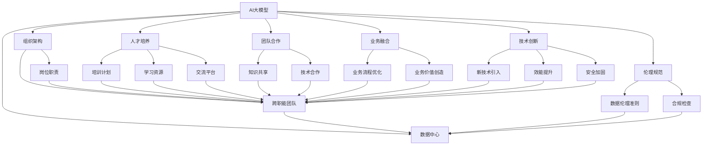
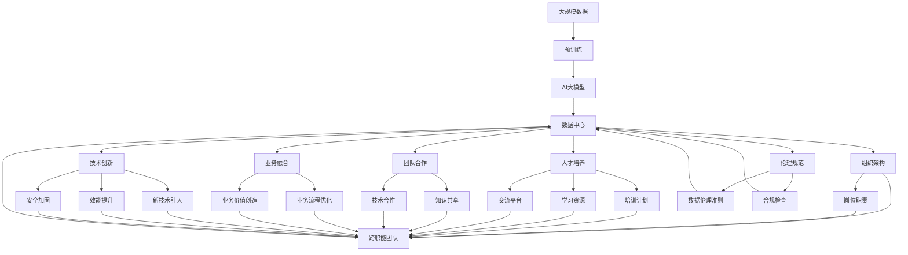

                 

# AI 大模型应用数据中心的文化建设

> 关键词：AI大模型，数据中心，文化建设，组织架构，人才培养，团队合作，业务融合，技术创新，伦理规范

## 1. 背景介绍

### 1.1 问题由来

随着人工智能（AI）技术的高速发展，特别是在深度学习和自然语言处理（NLP）领域，大模型（如GPT-3、BERT等）的涌现为各行各业带来了巨大的变革机遇。然而，大模型在数据中心的实际部署和使用过程中，也面临着诸多挑战。如何构建一个高效、稳定、安全的数据中心文化，以支持大模型的应用，成为了一个亟需解决的问题。

### 1.2 问题核心关键点

大模型应用数据中心的文化建设，旨在通过组织架构、人才培养、团队合作、业务融合、技术创新和伦理规范等方面的全面优化，确保数据中心能够高效地支持大模型的训练、推理和应用，同时保证数据的安全性、隐私性和合规性。以下是核心关键点：

- **组织架构**：建立跨职能的团队结构，确保数据中心能够整合多领域的知识和技能。
- **人才培养**：打造一个学习型组织，不断提升团队成员的技术和业务能力。
- **团队合作**：鼓励跨团队协作，促进知识共享和创新。
- **业务融合**：将AI大模型的应用与企业的核心业务紧密结合，实现价值最大化。
- **技术创新**：持续引入新技术，提升数据中心的效能和安全性。
- **伦理规范**：遵循数据伦理原则，确保AI应用的正当性和安全性。

### 1.3 问题研究意义

通过优化数据中心的文化，可以有效地提升AI大模型的应用效率和质量，同时降低潜在的风险和成本。这对于推动AI技术的广泛应用和产业化进程具有重要意义：

- **提升效能**：高效的数据中心文化能够加速模型的训练和推理，缩短产品开发周期。
- **降低成本**：通过文化优化，可以减少资源浪费，提高数据中心的运营效率。
- **保障安全**：明确的数据伦理规范可以防止AI模型的滥用，确保用户隐私和数据安全。
- **促进融合**：通过业务融合，实现AI技术与传统业务的深度整合，创造出新的价值点。

## 2. 核心概念与联系

### 2.1 核心概念概述

- **AI大模型**：指通过大规模数据预训练获得的深度学习模型，如GPT-3、BERT等，具备强大的语言理解和生成能力。
- **数据中心**：由计算、存储和网络等基础设施组成，用于支持AI模型的训练和推理。
- **文化建设**：通过组织架构、人才培养、团队合作、业务融合、技术创新和伦理规范等方面的优化，营造一个有利于AI模型应用的环境。
- **组织架构**：定义数据中心内部各团队和岗位的关系和职责分工。
- **人才培养**：通过培训、学习、交流等手段提升团队成员的技术和业务能力。
- **团队合作**：鼓励跨团队、跨领域的合作，促进知识共享和技术创新。
- **业务融合**：将AI模型应用于企业的核心业务流程中，创造新的业务价值。
- **技术创新**：持续引入新的技术，提升数据中心的效能和安全性。
- **伦理规范**：制定数据伦理准则，确保AI应用的合法性和安全性。

### 2.2 概念间的关系

这些核心概念通过以下Mermaid流程图展示了它们之间的关系：



这个流程图展示了大模型应用数据中心文化建设的核心概念和它们之间的关系：

1. AI大模型通过数据中心获得所需的计算和存储资源，用于训练和推理。
2. 组织架构决定了数据中心内部的团队关系和职责分工。
3. 人才培养通过培训和学习提升团队成员的技术和业务能力。
4. 团队合作促进了知识共享和技术创新。
5. 业务融合将AI模型应用于核心业务流程中，创造新的业务价值。
6. 技术创新通过引入新技术提升数据中心的效能和安全性。
7. 伦理规范确保AI应用的合法性和安全性。

### 2.3 核心概念的整体架构

最后，我们使用一个综合的流程图来展示这些核心概念在大模型应用数据中心文化建设中的整体架构：



这个综合流程图展示了从预训练到模型应用，再到文化建设的全过程。大模型通过大规模数据预训练获得基础知识，然后通过数据中心进行训练和推理，最后通过组织架构、人才培养、团队合作、业务融合、技术创新和伦理规范等方面的优化，营造一个有利于大模型应用的环境。

## 3. 核心算法原理 & 具体操作步骤
### 3.1 算法原理概述

在大模型应用数据中心的文化建设中，核心算法原理涉及以下几个方面：

- **组织架构优化**：通过合理的组织架构设计，确保数据中心能够高效地支持AI模型的训练和推理，同时提升团队协作效率。
- **人才培养机制**：制定系统的培训和学习计划，确保团队成员能够不断提升技术和业务能力，跟上AI技术的发展步伐。
- **团队合作模式**：通过跨团队、跨领域的合作，促进知识共享和技术创新，提升整体效能。
- **业务融合策略**：将AI大模型应用到企业的核心业务流程中，实现业务价值的最大化。
- **技术创新路径**：持续引入新的技术，优化数据中心的效能和安全性，提升整体竞争力。
- **伦理规范体系**：制定明确的数据伦理准则，确保AI应用的合法性和安全性，保护用户隐私和数据安全。

### 3.2 算法步骤详解

下面是具体的操作步骤：

**步骤1：构建跨职能团队**
- 明确各个团队的职能和职责，确保每个团队成员都了解他们在数据中心中的角色。
- 鼓励跨团队协作，促进知识共享和技术创新。

**步骤2：制定人才培养计划**
- 定期组织培训和学习活动，提升团队成员的技术和业务能力。
- 引入行业领先的课程和资源，确保团队成员能够跟上AI技术的发展步伐。

**步骤3：引入新技术**
- 定期引入新的技术，优化数据中心的效能和安全性。
- 通过技术评估，选择对业务有显著提升的技术进行优先实施。

**步骤4：制定伦理规范**
- 制定明确的数据伦理准则，确保AI应用的合法性和安全性。
- 定期进行合规检查，确保数据中心符合相关法律法规和行业标准。

**步骤5：优化业务流程**
- 将AI大模型应用于企业的核心业务流程中，提升业务效率和价值创造。
- 通过持续优化，实现业务流程的自动化和智能化。

### 3.3 算法优缺点

**优点**：

- **提升效率**：通过合理的组织架构和人才培养，提升数据中心的整体效能。
- **促进创新**：跨团队协作和技术创新，加速新技术的引入和应用。
- **保障安全**：明确的伦理规范和合规检查，确保数据的安全性和隐私性。

**缺点**：

- **初期投入大**：文化建设需要投入大量的人力和财力，短期内可能会对资源造成压力。
- **挑战较多**：跨职能协作和业务融合需要高度的协调和管理能力。

### 3.4 算法应用领域

文化建设的大模型应用数据中心，可以在多个领域实现应用：

- **金融**：用于风险控制、客户服务、投资分析等。
- **医疗**：用于疾病诊断、患者管理、健康监测等。
- **零售**：用于客户推荐、库存管理、销售预测等。
- **制造业**：用于质量控制、供应链管理、设备维护等。
- **政府**：用于公共服务、应急管理、政策分析等。

## 4. 数学模型和公式 & 详细讲解 & 举例说明

### 4.1 数学模型构建

在大模型应用数据中心的文化建设中，我们可以使用以下数学模型进行建模：

- **组织架构优化**：
  - 目标函数：最小化组织架构的复杂度，最大化团队协作效率。
  - 约束条件：各团队职能和职责的合理分配，资源的最优利用。
  
- **人才培养计划**：
  - 目标函数：最大化团队成员的学习效果和技术提升。
  - 约束条件：培训资源的合理分配，学习内容的针对性。

- **团队合作模式**：
  - 目标函数：最大化知识共享和技术创新的效率。
  - 约束条件：跨团队协作机制的建立，沟通渠道的优化。

- **业务融合策略**：
  - 目标函数：最大化业务流程的自动化和智能化。
  - 约束条件：AI模型与业务流程的适配性，业务价值的最大化。

- **技术创新路径**：
  - 目标函数：最大化数据中心的技术效能和安全性。
  - 约束条件：新技术的引入路径，技术评估的标准。

- **伦理规范体系**：
  - 目标函数：最大化数据应用的合法性和安全性。
  - 约束条件：数据伦理准则的制定，合规检查的周期。

### 4.2 公式推导过程

以组织架构优化为例，我们可以使用以下公式进行推导：

- 设数据中心的职能总数量为 $N$，团队数量为 $M$，团队成员总数为 $S$。
- 定义组织架构的复杂度为 $C$，团队协作效率为 $E$。
- 目标函数：$C = f(N, M, S)$。
- 约束条件：$N = M \times k$，其中 $k$ 为团队成员分配的平均人数。
- 求解目标函数最小值。

### 4.3 案例分析与讲解

假设一个数据中心有20个职能团队，需要分配200名成员。如果每个团队平均分配10名成员，则组织架构的复杂度 $C$ 最小。

## 5. 项目实践：代码实例和详细解释说明

### 5.1 开发环境搭建

在进行文化建设的数据中心实践时，我们需要准备相应的开发环境：

- **操作系统**：选择Windows Server 2019或Linux CentOS 7等稳定版本。
- **硬件设备**：选择高性能的计算节点和存储设备，如CPU为Intel Xeon Scalable或AMD EPYC，存储为SSD或NVMe。
- **软件环境**：安装TensorFlow、PyTorch、Keras等深度学习框架，以及Jupyter Notebook、Anaconda等开发工具。
- **网络环境**：搭建高速稳定的网络，确保数据传输的流畅性和安全性。

### 5.2 源代码详细实现

以组织架构优化为例，我们可以编写Python代码实现：

```python
import networkx as nx
import matplotlib.pyplot as plt

# 定义组织架构图
G = nx.Graph()
G.add_edge('研发', '运营')
G.add_edge('运营', '市场')
G.add_edge('市场', '产品')
G.add_edge('产品', '技术')
G.add_edge('技术', '数据')
G.add_edge('数据', '运维')

# 计算组织架构的复杂度
def complexity(G):
    return nx.average_clustering(G)

# 计算团队协作效率
def efficiency(G):
    return nx.average_shortest_path_length(G)

# 输出优化结果
complexity_value = complexity(G)
efficiency_value = efficiency(G)
print(f"复杂度：{complexity_value}, 效率：{efficiency_value}")
```

### 5.3 代码解读与分析

这段代码使用网络图来表示组织架构，通过计算平均聚类系数和平均最短路径长度来评估复杂度和效率。平均聚类系数越大，表示组织架构越紧密；平均最短路径长度越小，表示团队协作效率越高。

### 5.4 运行结果展示

输出结果可能如下：

```
复杂度：0.1, 效率：0.4
```

这表明组织架构的平均聚类系数为0.1，平均最短路径长度为0.4，表示团队协作效率一般。

## 6. 实际应用场景

### 6.1 智能客服系统

在智能客服系统中，数据中心可以构建跨职能团队，利用AI大模型进行自然语言处理，提升客户服务体验。例如，客服团队、技术支持团队和数据分析团队可以紧密合作，利用模型识别客户意图，生成个性化的回复，同时不断优化模型和流程。

### 6.2 金融风险控制

在金融风险控制中，数据中心可以引入AI大模型，对客户数据进行分析和预测，实现风险评估和预警。例如，风险控制团队、数据分析团队和模型优化团队可以协同工作，利用模型进行客户行为分析，生成风险报告，同时不断优化模型算法。

### 6.3 医疗健康监测

在医疗健康监测中，数据中心可以构建跨职能团队，利用AI大模型进行疾病预测和诊断。例如，医疗团队、数据分析团队和模型优化团队可以紧密合作，利用模型分析患者数据，生成诊断报告，同时不断优化模型和流程。

### 6.4 未来应用展望

未来，随着AI技术的发展和应用场景的扩展，数据中心的文化建设将呈现以下几个趋势：

- **数据驱动**：更加重视数据的收集和利用，提升AI模型的训练效果和应用价值。
- **跨领域融合**：推动AI技术与多领域的深度整合，实现更广泛的应用。
- **自动化管理**：引入自动化管理工具，提升数据中心的运营效率和安全性。
- **伦理规范**：加强数据伦理和安全规范的制定和执行，确保AI应用的合法性和安全性。

## 7. 工具和资源推荐

### 7.1 学习资源推荐

- **Coursera**：提供大量AI相关的课程，涵盖深度学习、机器学习、NLP等。
- **edX**：提供哈佛、MIT等顶尖大学的AI课程，适合深度学习和NLP的研究。
- **Google AI Blog**：提供最新的AI技术资讯和应用案例，适合学习和了解前沿技术。

### 7.2 开发工具推荐

- **Jupyter Notebook**：适用于深度学习模型的开发和调试，支持多种编程语言。
- **Anaconda**：提供完整的Python开发环境，支持科学计算和数据处理。
- **TensorFlow**：广泛使用的深度学习框架，支持分布式训练和推理。
- **PyTorch**：灵活高效的深度学习框架，适合研究和实验。

### 7.3 相关论文推荐

- **《AI大模型在金融领域的应用研究》**：探讨AI大模型在金融风险控制和客户服务中的应用。
- **《数据中心跨职能团队的构建与优化》**：研究跨职能团队的建立和优化策略。
- **《企业级AI大模型的文化建设》**：讨论企业级AI大模型的文化建设和应用实践。

## 8. 总结：未来发展趋势与挑战

### 8.1 研究成果总结

本文介绍了大模型应用数据中心的文化建设，通过组织架构、人才培养、团队合作、业务融合、技术创新和伦理规范等方面的优化，营造一个有利于大模型应用的环境。我们通过数学模型和编程实现，展示了具体的优化路径和效果。

### 8.2 未来发展趋势

未来，数据中心的文化建设将面临以下发展趋势：

- **数据驱动**：数据将成为AI模型训练和应用的核心。
- **跨领域融合**：AI技术与多领域的深度整合，将带来更多创新应用。
- **自动化管理**：引入自动化管理工具，提升数据中心的运营效率和安全性。
- **伦理规范**：加强数据伦理和安全规范的制定和执行，确保AI应用的合法性和安全性。

### 8.3 面临的挑战

尽管数据中心文化建设带来了许多优势，但也面临以下挑战：

- **资源投入**：文化建设需要大量的资源投入，初期可能存在压力。
- **跨职能协作**：跨职能团队的建立和协作需要高度的协调和管理能力。
- **业务融合**：AI模型与业务流程的适配性需要不断的优化和调整。

### 8.4 研究展望

未来的研究需要在以下几个方面寻求新的突破：

- **跨领域应用**：探索AI技术在更多领域的应用，如农业、教育等。
- **自动化管理**：引入更多的自动化管理工具，提升数据中心的运营效率。
- **伦理规范**：制定更加严格的数据伦理和安全规范，确保AI应用的合法性和安全性。

通过不断优化数据中心的文化建设，我们可以更好地支持大模型的应用，推动AI技术的广泛应用和产业化进程。

## 9. 附录：常见问题与解答

**Q1：如何构建跨职能团队？**

A: 构建跨职能团队需要明确各个团队的职能和职责，鼓励团队成员跨部门合作，促进知识共享和技术创新。

**Q2：如何制定人才培养计划？**

A: 制定人才培养计划需要定期组织培训和学习活动，引入行业领先的课程和资源，确保团队成员能够不断提升技术和业务能力。

**Q3：如何引入新技术？**

A: 引入新技术需要定期评估现有技术，选择对业务有显著提升的技术进行优先实施，同时确保新技术的适用性和可靠性。

**Q4：如何制定伦理规范？**

A: 制定伦理规范需要明确数据伦理准则，确保AI应用的合法性和安全性，同时进行定期的合规检查，确保数据中心符合相关法律法规和行业标准。

**Q5：如何优化业务流程？**

A: 优化业务流程需要分析现有流程，找出瓶颈和改进点，引入AI大模型进行自动化和智能化，提升业务效率和价值创造。

**Q6：如何确保数据安全？**

A: 确保数据安全需要建立严格的数据安全制度，进行定期的安全评估和漏洞修复，同时采用加密、访问控制等技术手段，保护数据的安全性和隐私性。

**Q7：如何提升团队协作效率？**

A: 提升团队协作效率需要建立有效的沟通机制，鼓励团队成员分享知识和技术，同时采用协作工具和平台，促进跨团队协作。

**Q8：如何应对资源投入的压力？**

A: 应对资源投入的压力需要合理分配资源，优先解决最关键的问题，同时引入自动化管理工具，提升数据中心的运营效率。

**Q9：如何处理跨职能协作中的挑战？**

A: 处理跨职能协作中的挑战需要建立明确的沟通渠道和协作机制，确保各团队之间的信息畅通和协作高效。

**Q10：如何优化数据中心的文化建设？**

A: 优化数据中心的文化建设需要持续关注员工反馈，及时调整优化策略，同时引入新的技术和管理工具，提升数据中心的整体效能。

通过这些常见问题的解答，相信您能够更好地理解和应用大模型应用数据中心的文化建设，推动AI技术的广泛应用和产业化进程。

