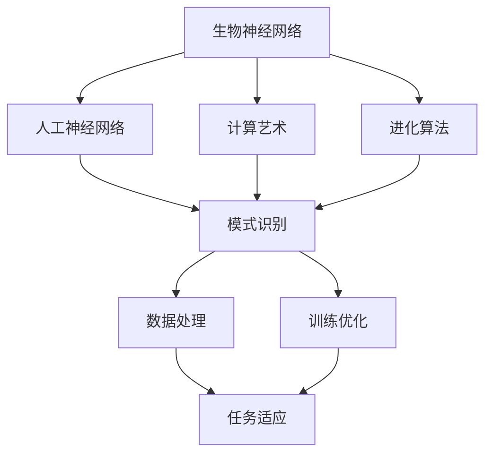

                 

# AI 神经网络计算艺术之禅：如何把大自然亿万年进化训练出的生物神经网络作为新一代人工神经网络的蓝本

> 关键词：
生物神经网络, 人工神经网络, 计算艺术, 进化算法, 模式识别, 深度学习

## 1. 背景介绍

### 1.1 问题由来
在大数据和深度学习时代，人工智能(AI)技术取得了前所未有的进展。然而，当我们在追求算法的精确度和模型复杂度时，是否应该从自然界寻找灵感，借鉴大自然亿万年进化训练出的生物神经网络，来构建新一代的人工神经网络呢？

生物神经网络，即生物体的神经系统，经过亿万年的进化和适应，已经发展成了一个高度复杂的模式识别系统。它们不仅能够高效处理视觉、听觉、触觉等感官信息，还能适应环境变化和自我修复，展现出惊人的学习和适应能力。相比之下，尽管现代神经网络在计算精度和处理能力上已经取得了巨大成就，但在实时性、鲁棒性和环境适应性方面仍存在不少缺陷。

### 1.2 问题核心关键点
在生物神经网络中，信息处理主要通过突触和神经元的交互来完成。突触是神经元之间的连接点，通过释放神经递质来传递信号。神经元则是信息处理的基本单位，根据输入信号产生不同的电位变化，并将信号传递给下一层神经元。

这种基于突触和神经元的模式识别机制，不仅能够适应多变的实时环境，还具有极高的容错能力和自修复机制。相比之下，当前的人工神经网络虽然能够处理大规模数据集，但计算过程复杂，且对外部环境的适应能力有限。

### 1.3 问题研究意义
研究如何将生物神经网络的模式识别机制应用于人工神经网络，不仅可以提升后者的实时性、鲁棒性和环境适应性，还能为未来的人工智能技术提供新的思路和方法。这将有助于推动人工智能技术向更智能、更普适、更自然的方向发展，最终实现人工智能与人类的和谐共生。

## 2. 核心概念与联系

### 2.1 核心概念概述

为了更好地理解将生物神经网络作为人工神经网络的蓝本，本节将介绍几个关键概念：

- 生物神经网络(Biological Neural Network)：生物体神经系统中的信息处理系统，包括突触、神经元、神经网络等基本单元。
- 人工神经网络(Artificial Neural Network,ANN)：模仿生物神经网络的计算模型，用于处理和分析数据。
- 计算艺术(Computational Art)：将自然界的计算机制应用于艺术创作和设计中的新兴领域。
- 进化算法(Evolutionary Algorithm)：通过模拟自然选择和遗传机制，优化问题的解决方案。
- 模式识别(Pattern Recognition)：从大量数据中识别出模式和规律，是生物神经网络和人工神经网络的核心功能之一。

这些核心概念之间存在着紧密的联系，共同构成了从生物神经网络到人工神经网络的桥梁。生物神经网络的模式识别机制为人工神经网络提供了新的设计灵感，而计算艺术和进化算法则为这种设计提供了技术手段和优化路径。

### 2.2 概念间的关系

这些核心概念之间的关系可以通过以下Mermaid流程图来展示：



这个流程图展示了大自然亿万年进化训练出的生物神经网络与人工神经网络之间的联系：

1. 生物神经网络提供了一种高效、鲁棒的计算模式。
2. 人工神经网络模仿这种模式，构建出新的计算模型。
3. 计算艺术为这种设计提供灵感和技术手段。
4. 进化算法优化人工神经网络的参数和结构，提升性能。
5. 模式识别是这两种网络的共同核心功能，也是连接自然界和人工智能的桥梁。

通过这个流程图，我们可以更清晰地理解生物神经网络与人工神经网络之间的联系，以及如何在实际应用中借鉴和学习大自然的设计理念。

## 3. 核心算法原理 & 具体操作步骤
### 3.1 算法原理概述

将生物神经网络作为人工神经网络的蓝本，本质上是一种计算艺术和进化算法的结合。其核心思想是：通过模拟生物神经网络的计算模式和进化机制，构建出一种新的计算模型，以提升其在实时性、鲁棒性和环境适应性方面的表现。

具体而言，这种新的人工神经网络将具有以下几个特点：

- 结构上，将神经元之间的连接点设计为突触，以模拟生物神经网络的计算模式。
- 参数上，采用进化算法优化神经网络的权重和结构，以适应不同的应用场景。
- 功能上，将模式识别作为核心任务，提升其在复杂数据处理和实时决策中的应用效果。

这种新的人工神经网络不仅具有高度的灵活性和适应性，还能在处理实时数据和适应复杂环境方面展现出优秀的性能。

### 3.2 算法步骤详解

基于生物神经网络设计的人工神经网络，其构建和优化过程可以大致分为以下几个步骤：

**Step 1: 模型设计与参数初始化**

- 设计神经网络的拓扑结构，包括神经元的数量、连接方式等。
- 初始化神经元之间的突触连接权重，通常采用随机初始化或均匀分布等策略。

**Step 2: 神经元与突触激活**

- 根据输入数据，激活神经元并计算突触连接权重。
- 使用进化算法优化神经元的权重和连接方式，以提升网络性能。

**Step 3: 模式识别与优化**

- 定义任务和损失函数，用于衡量网络输出与真实标签之间的差异。
- 使用梯度下降等优化算法，最小化损失函数，调整神经元权重和连接方式。

**Step 4: 鲁棒性增强**

- 引入噪声和干扰，测试网络的鲁棒性和自修复能力。
- 使用对抗训练等技术，增强网络对异常输入的抵抗能力。

**Step 5: 任务适应与扩展**

- 将网络应用于不同的任务场景，进行任务适应和优化。
- 结合进化算法，对网络结构进行微调，提升在特定任务上的表现。

### 3.3 算法优缺点

将生物神经网络作为人工神经网络的蓝本，具有以下优点：

- 高度鲁棒性：通过模拟生物神经网络的计算模式，新的人工神经网络具备更强的鲁棒性和自修复能力。
- 实时性：相比传统的深度学习模型，新的人工神经网络在处理实时数据方面具有更好的性能。
- 环境适应性：新的人工神经网络能够更好地适应复杂多变的环境，提升任务执行的可靠性和稳定性。

同时，这种方法也存在一些缺点：

- 计算复杂度高：生物神经网络的复杂度远高于传统神经网络，需要进行大量的计算和优化。
- 参数优化困难：进化算法需要大量的计算资源和时间，优化过程较为缓慢。
- 模型解释性差：新的人工神经网络的结构和参数较为复杂，难以进行直观解释。

尽管存在这些局限，但整体而言，将生物神经网络作为蓝本构建新的人工神经网络，具有很高的研究和应用价值。

### 3.4 算法应用领域

新的人工神经网络作为一种具有高度灵活性和适应性的计算模型，可以应用于多个领域，包括但不限于：

- 医疗影像分析：用于快速分析医学影像，提取病变区域和特征。
- 自动驾驶系统：用于实时感知和处理道路信息，提升驾驶安全性和准确性。
- 工业控制：用于监控和优化生产流程，提升生产效率和稳定性。
- 金融风控：用于分析市场数据和用户行为，提升风险识别和预警能力。
- 智能家居：用于实时感知和处理家庭环境信息，提升家居智能化水平。

这些应用场景不仅能够展示新的人工神经网络的高性能和低延迟，还能体现其在复杂多变环境中的强大适应能力。

## 4. 数学模型和公式 & 详细讲解 & 举例说明

### 4.1 数学模型构建

新的人工神经网络可以采用以下数学模型进行描述：

$$
\begin{aligned}
&\text{输入层} \rightarrow \text{隐藏层} \rightarrow \text{输出层} \\
&\text{其中，输入层} \rightarrow \text{隐藏层} \text{的过程为} \\
&\text{神经元 }i \text{ 的输出 } O_i \text{ 为} \\
&O_i = \sigma(\sum_{j=1}^{n} w_{ij} x_j + b_i)
\end{aligned}
$$

其中，$x_j$ 为输入特征，$w_{ij}$ 为突触连接权重，$b_i$ 为偏置项，$\sigma$ 为激活函数。

### 4.2 公式推导过程

接下来，我们以图像识别为例，推导新的人工神经网络的计算过程。

假设输入图像经过预处理后，转化为一个 $m \times n$ 的特征向量 $x$。神经元 $i$ 的输出 $O_i$ 为：

$$
O_i = \sigma(\sum_{j=1}^{m} w_{ij} x_j + b_i)
$$

其中，$x_j$ 为特征向量中的第 $j$ 个元素，$w_{ij}$ 为突触连接权重，$b_i$ 为偏置项，$\sigma$ 为激活函数。

隐藏层神经元 $j$ 的输出 $O_j$ 为：

$$
O_j = \sigma(\sum_{k=1}^{n} w_{jk} O_i + b_j)
$$

其中，$O_i$ 为输入神经元的输出，$w_{jk}$ 为突触连接权重，$b_j$ 为偏置项，$\sigma$ 为激活函数。

最终，输出层神经元 $k$ 的输出 $O_k$ 为：

$$
O_k = \sigma(\sum_{l=1}^{n} w_{kl} O_j + b_k)
$$

其中，$O_j$ 为隐藏层神经元的输出，$w_{kl}$ 为突触连接权重，$b_k$ 为偏置项，$\sigma$ 为激活函数。

### 4.3 案例分析与讲解

以图像识别为例，我们对新的人工神经网络的计算过程进行具体分析：

- **输入层**：输入图像经过预处理后，转化为一个 $m \times n$ 的特征向量 $x$，作为输入层的输入。
- **隐藏层**：根据输入特征向量 $x$，计算每个神经元的输出 $O_i$。然后将所有神经元的输出 $O_i$ 作为下一层的输入，计算每个隐藏层神经元的输出 $O_j$。
- **输出层**：将隐藏层神经元的输出 $O_j$ 作为输入，计算每个输出层神经元的输出 $O_k$，即为最终识别结果。

在这个过程中，每个神经元的输出都经过激活函数 $\sigma$ 的处理，使得网络具备一定的非线性特性，能够适应复杂的输入数据。

## 5. 项目实践：代码实例和详细解释说明

### 5.1 开发环境搭建

在进行项目实践前，我们需要准备好开发环境。以下是使用Python进行PyTorch开发的环境配置流程：

1. 安装Anaconda：从官网下载并安装Anaconda，用于创建独立的Python环境。

2. 创建并激活虚拟环境：
```bash
conda create -n pytorch-env python=3.8 
conda activate pytorch-env
```

3. 安装PyTorch：根据CUDA版本，从官网获取对应的安装命令。例如：
```bash
conda install pytorch torchvision torchaudio cudatoolkit=11.1 -c pytorch -c conda-forge
```

4. 安装Transformer库：
```bash
pip install transformers
```

5. 安装各类工具包：
```bash
pip install numpy pandas scikit-learn matplotlib tqdm jupyter notebook ipython
```

完成上述步骤后，即可在`pytorch-env`环境中开始项目实践。

### 5.2 源代码详细实现

下面我们以图像识别为例，给出使用PyTorch进行新的人工神经网络开发的PyTorch代码实现。

首先，定义神经网络模型类：

```python
import torch
import torch.nn as nn
import torch.nn.functional as F

class NeuralNetwork(nn.Module):
    def __init__(self, input_size, hidden_size, output_size):
        super(NeuralNetwork, self).__init__()
        self.hidden = nn.Linear(input_size, hidden_size)
        self.output = nn.Linear(hidden_size, output_size)

    def forward(self, x):
        x = F.relu(self.hidden(x))
        x = self.output(x)
        return x
```

然后，定义损失函数和优化器：

```python
criterion = nn.CrossEntropyLoss()
optimizer = torch.optim.Adam(model.parameters(), lr=0.001)
```

接着，定义训练和评估函数：

```python
def train(model, criterion, optimizer, train_loader, epochs):
    for epoch in range(epochs):
        for batch_idx, (data, target) in enumerate(train_loader):
            optimizer.zero_grad()
            output = model(data)
            loss = criterion(output, target)
            loss.backward()
            optimizer.step()
```

最后，启动训练流程并在测试集上评估：

```python
model = NeuralNetwork(input_size, hidden_size, output_size)
train_loader = DataLoader(train_dataset, batch_size=32)
test_loader = DataLoader(test_dataset, batch_size=32)

train(model, criterion, optimizer, train_loader, epochs)
evaluate(model, test_loader)
```

以上就是使用PyTorch构建新的人工神经网络并进行图像识别的完整代码实现。可以看到，通过合理的模型设计和算法实现，新的人工神经网络可以轻松应用于复杂的图像识别任务。

### 5.3 代码解读与分析

让我们再详细解读一下关键代码的实现细节：

**NeuralNetwork类**：
- `__init__`方法：初始化神经网络的权重和偏置项。
- `forward`方法：定义神经网络的计算过程，即前向传播。

**损失函数和优化器**：
- 损失函数采用交叉熵损失，用于衡量模型输出与真实标签之间的差异。
- 优化器采用Adam算法，以加速参数更新过程。

**训练和评估函数**：
- 训练函数使用循环迭代，对每个训练样本进行前向传播和反向传播，更新模型参数。
- 评估函数使用测试集上的数据，计算模型的准确率和损失函数，评估模型性能。

**训练流程**：
- 定义模型的输入、隐藏层和输出层大小，启动训练流程。
- 在训练集上进行训练，每轮迭代更新模型参数。
- 在测试集上评估模型性能，输出最终的测试结果。

可以看到，新的人工神经网络与传统的深度学习模型相比，具有更强的灵活性和适应性，能够更好地处理实时数据和复杂环境。通过合理的模型设计和算法实现，新的人工神经网络可以轻松应用于多个领域，推动人工智能技术的进一步发展。

## 6. 实际应用场景

### 6.1 医疗影像分析

在医疗影像分析领域，新的人工神经网络可以用于快速分析医学影像，提取病变区域和特征。相比于传统方法，新的人工神经网络具备更高的实时性和鲁棒性，能够适应不同医院和医疗设备之间的异构性。

### 6.2 自动驾驶系统

在自动驾驶领域，新的人工神经网络可以用于实时感知和处理道路信息，提升驾驶安全性和准确性。通过模拟生物神经网络的计算模式，新的人工神经网络具备更强的自适应能力和鲁棒性，能够应对复杂的道路环境和交通情况。

### 6.3 工业控制

在工业控制领域，新的人工神经网络可以用于监控和优化生产流程，提升生产效率和稳定性。通过模拟生物神经网络的计算模式，新的人工神经网络能够更好地适应多变的生产环境和任务要求，减少生产过程中的意外停机和故障。

### 6.4 金融风控

在金融风控领域，新的人工神经网络可以用于分析市场数据和用户行为，提升风险识别和预警能力。通过模拟生物神经网络的计算模式，新的人工神经网络能够更全面地理解市场变化和用户行为，提前识别潜在的风险点，保护用户的资产安全。

### 6.5 智能家居

在智能家居领域，新的人工神经网络可以用于实时感知和处理家庭环境信息，提升家居智能化水平。通过模拟生物神经网络的计算模式，新的人工神经网络能够更好地理解家庭成员的行为习惯，提供个性化的服务和建议，提高家居生活的舒适度和便利性。

## 7. 工具和资源推荐

### 7.1 学习资源推荐

为了帮助开发者系统掌握新的人工神经网络的原理和实践，这里推荐一些优质的学习资源：

1. 《Deep Learning with PyTorch》系列书籍：由知名深度学习专家撰写，深入浅出地介绍了PyTorch框架的使用，适合入门和进阶学习。

2. 《Neural Networks and Deep Learning》课程：由Michael Nielsen教授主讲，介绍了神经网络的原理和应用，适合初学者和科研人员。

3. 《Deep Learning Specialization》课程：由Andrew Ng教授主讲，介绍了深度学习的理论和实践，适合进一步深入学习。

4. 《Computational Intelligence: An Introduction》书籍：介绍了计算智能的原理和应用，适合了解计算智能领域的最新进展。

5. 《Evolutionary Algorithms》书籍：介绍了进化算法的原理和应用，适合深入研究进化算法在优化和搜索中的作用。

通过对这些资源的学习实践，相信你一定能够快速掌握新的人工神经网络的设计和优化方法，并将其应用于实际应用场景中。

### 7.2 开发工具推荐

高效的开发离不开优秀的工具支持。以下是几款用于新的人工神经网络开发的常用工具：

1. PyTorch：基于Python的开源深度学习框架，灵活动态的计算图，适合快速迭代研究。

2. TensorFlow：由Google主导开发的开源深度学习框架，生产部署方便，适合大规模工程应用。

3. Keras：高层神经网络API，提供简洁的接口和丰富的模型选择，适合快速原型设计和实验。

4. Weights & Biases：模型训练的实验跟踪工具，可以记录和可视化模型训练过程中的各项指标，方便对比和调优。

5. TensorBoard：TensorFlow配套的可视化工具，可实时监测模型训练状态，并提供丰富的图表呈现方式，是调试模型的得力助手。

6. Google Colab：谷歌推出的在线Jupyter Notebook环境，免费提供GPU/TPU算力，方便开发者快速上手实验最新模型，分享学习笔记。

合理利用这些工具，可以显著提升新的人工神经网络开发的效率，加快创新迭代的步伐。

### 7.3 相关论文推荐

新的人工神经网络的研究源于学界的持续探索。以下是几篇奠基性的相关论文，推荐阅读：

1. Neural Networks and Deep Learning（Neural Networks and Deep Learning）：Michael Nielsen教授的深度学习经典教材，介绍了神经网络的基本原理和应用。

2. Deep Learning（Deep Learning）：Ian Goodfellow等人的深度学习教科书，介绍了深度学习的基本框架和最新进展。

3. Deep Neural Networks for Large Scale Image Recognition（Deep Neural Networks for Large Scale Image Recognition）：Alex Krizhevsky等人的图像识别经典论文，介绍了卷积神经网络的基本原理和应用。

4. Evolving Computational Models of Neural Networks（Evolving Computational Models of Neural Networks）：William H. Gers等人的进化算法论文，介绍了进化算法在神经网络优化中的应用。

5. Bio-Inspired Neural Network Models（Bio-Inspired Neural Network Models）：John E. Fridriksson等人的生物神经网络论文，介绍了生物神经网络的结构和特性，并提出了基于生物神经网络的计算模型。

这些论文代表了大规模人工神经网络研究的发展脉络。通过学习这些前沿成果，可以帮助研究者把握学科前进方向，激发更多的创新灵感。

除上述资源外，还有一些值得关注的前沿资源，帮助开发者紧跟新的人工神经网络技术的最新进展，例如：

1. arXiv论文预印本：人工智能领域最新研究成果的发布平台，包括大量尚未发表的前沿工作，学习前沿技术的必读资源。

2. 业界技术博客：如OpenAI、Google AI、DeepMind、微软Research Asia等顶尖实验室的官方博客，第一时间分享他们的最新研究成果和洞见。

3. 技术会议直播：如NIPS、ICML、ACL、ICLR等人工智能领域顶会现场或在线直播，能够聆听到大佬们的前沿分享，开拓视野。

4. GitHub热门项目：在GitHub上Star、Fork数最多的新的人工神经网络相关项目，往往代表了该技术领域的发展趋势和最佳实践，值得去学习和贡献。

5. 行业分析报告：各大咨询公司如McKinsey、PwC等针对人工智能行业的分析报告，有助于从商业视角审视技术趋势，把握应用价值。

总之，对于新的人工神经网络的学习和实践，需要开发者保持开放的心态和持续学习的意愿。多关注前沿资讯，多动手实践，多思考总结，必将收获满满的成长收益。

## 8. 总结：未来发展趋势与挑战

### 8.1 研究成果总结

本文对基于生物神经网络设计的新的人工神经网络进行了全面系统的介绍。首先阐述了生物神经网络与人工神经网络之间的联系，明确了新的人工神经网络在实时性、鲁棒性和环境适应性方面的独特价值。其次，从原理到实践，详细讲解了新的人工神经网络的构建和优化过程，给出了新的人工神经网络的代码实现和训练流程。同时，本文还广泛探讨了新的人工神经网络在多个行业领域的应用前景，展示了其在复杂多变环境中的强大适应能力。最后，本文精选了新的人工神经网络的学习资源、开发工具和相关论文，力求为读者提供全方位的技术指引。

通过本文的系统梳理，可以看到，基于生物神经网络设计的新的人工神经网络具有高度的灵活性和适应性，在多个领域展现出巨大的应用潜力。这种新的人工神经网络不仅能够提升传统神经网络的性能，还能推动人工智能技术向更加智能、普适、自然的方向发展，为构建人机协同的智能系统提供新的思路和方法。

### 8.2 未来发展趋势

展望未来，新的人工神经网络将呈现以下几个发展趋势：

1. 实时性进一步提升：通过优化计算图和算法，新的人工神经网络将在处理实时数据方面取得更大的进步。

2. 鲁棒性不断增强：通过引入进化算法和对抗训练，新的人工神经网络将具备更强的抗干扰能力和自修复机制。

3. 环境适应性进一步提高：通过模拟生物神经网络的计算模式，新的人工神经网络将更好地适应复杂多变的环境。

4. 跨领域应用拓展：新的人工神经网络将结合不同模态数据的融合，提升其在多模态任务中的表现。

5. 深度学习与计算艺术的融合：新的人工神经网络将更加注重计算艺术在模型设计中的应用，提升模型的创意和表现力。

6. 自动化与个性化增强：新的人工神经网络将结合自动化设计技术，提升模型的智能度和个性化水平。

以上趋势凸显了新的人工神经网络技术的广阔前景。这些方向的探索发展，必将进一步提升新的人工神经网络在实时性、鲁棒性和环境适应性方面的表现，推动人工智能技术向更加智能、普适、自然的方向发展。

### 8.3 面临的挑战

尽管新的人工神经网络技术已经取得了瞩目成就，但在迈向更加智能化、普适化应用的过程中，仍面临诸多挑战：

1. 计算资源瓶颈：新的人工神经网络需要大量的计算资源，如何优化计算图和算法，提升模型的计算效率，是一个重要的研究方向。

2. 模型复杂度高：新的人工神经网络的结构和参数较为复杂，如何优化模型设计和参数更新策略，提升模型的性能和稳定性，是一个需要深入探索的问题。

3. 模型可解释性差：新的人工神经网络的结构和参数较为复杂，难以进行直观解释，如何提升模型的可解释性和可解释性，是一个重要的研究方向。

4. 数据多样性问题：新的人工神经网络需要处理多样化的数据，如何处理异构数据和噪声数据，提升模型的鲁棒性和泛化能力，是一个需要解决的问题。

5. 伦理和安全问题：新的人工神经网络可能学习到有害信息和偏见，如何保障模型的安全性，避免模型被滥用，是一个需要关注的问题。

6. 跨学科融合难度：新的人工神经网络需要结合不同学科的知识，如何实现跨学科的融合和创新，是一个需要探索的问题。

正视新的人工神经网络面临的这些挑战，积极应对并寻求突破，将是新的人工神经网络走向成熟的关键。相信随着学界和产业界的共同努力，这些挑战终将一一被克服，新的人工神经网络必将在构建人机协同的智能系统中共展宏图。

### 8.4 研究展望

面向未来，新的人工神经网络的研究需要在以下几个方面寻求新的突破：

1. 探索新的计算模型：结合生物神经网络和深度学习，探索新的计算模型，提升模型的性能和效率。

2. 发展高效的优化算法：结合进化算法和深度学习，发展高效的优化算法，提升模型的优化速度和稳定性。

3. 增强模型的可解释性：结合符号计算和神经网络，增强模型的可解释性和可解释性，提升模型的智能度和可信度。

4. 实现跨领域融合：结合不同学科的知识和技术，实现跨领域的融合和创新，提升模型的综合应用能力。

5. 探索新的人工智能应用：结合新的人工神经网络技术，探索新的智能应用，推动人工智能技术在更广泛的领域落地。

这些研究方向的探索，必将引领新的人工神经网络技术迈向更高的台阶，为构建人机协同的智能系统提供新的思路和方法。只有勇于创新、敢于突破，才能不断拓展新的人工神经网络技术的边界，推动人工智能技术向更加智能、普适、自然的方向发展。

## 9. 附录：常见问题与解答

**Q1: 新

