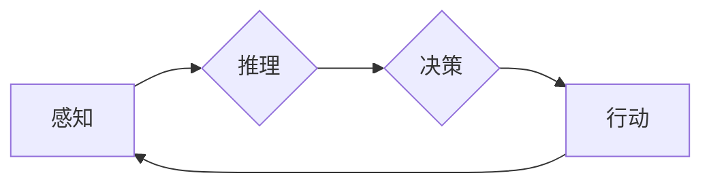

# AI Agent: AI的下一个风口 生成式智能体架构设计

> 关键词：AI Agent，生成式智能体，强化学习，深度学习，智能体架构，对话系统，决策系统，人机交互

## 1. 背景介绍

### 1.1 问题的由来

随着深度学习和强化学习等技术的快速发展，人工智能在各个领域的应用越来越广泛。然而，传统的基于规则和逻辑的AI系统已经无法满足日益复杂的业务场景和用户需求。为了构建更加智能、灵活、自适应的AI系统，AI Agent应运而生。

AI Agent，即人工智能智能体，是一种能够自主感知环境、做出决策并采取行动的智能实体。它能够模拟人类智能，完成各种复杂任务，如对话系统、决策系统、推荐系统等。AI Agent的出现，被视为AI领域的下一个风口。

### 1.2 研究现状

近年来，AI Agent的研究取得了显著的进展，主要表现在以下几个方面：

1. **智能体架构的多样化**：从简单的决策树到复杂的图灵机，从基于规则的系统到基于模型的系统，智能体架构层出不穷。

2. **感知能力的提升**：通过深度学习技术，AI Agent能够更好地感知环境，包括图像、语音、文本等多种形式。

3. **决策能力的增强**：强化学习、深度强化学习等算法的进步，使得AI Agent能够更智能地做出决策。

4. **人机交互的优化**：自然语言处理、语音识别等技术的发展，使得AI Agent能够更好地与人类进行交互。

### 1.3 研究意义

AI Agent的研究具有重要的理论意义和实际应用价值：

1. **理论意义**：AI Agent的研究推动了人工智能理论的发展，丰富了人工智能的研究体系。

2. **应用价值**：AI Agent的应用能够提升各个领域的智能化水平，提高效率，降低成本。

### 1.4 本文结构

本文将围绕AI Agent的生成式智能体架构设计展开，内容安排如下：

- 第2部分，介绍AI Agent的核心概念与联系。
- 第3部分，阐述AI Agent的核心算法原理和具体操作步骤。
- 第4部分，分析AI Agent的数学模型和公式，并结合实例进行讲解。
- 第5部分，给出AI Agent的项目实践案例，包括开发环境搭建、代码实现、代码解读和运行结果展示。
- 第6部分，探讨AI Agent的实际应用场景和未来应用展望。
- 第7部分，推荐AI Agent相关学习资源、开发工具和参考文献。
- 第8部分，总结AI Agent的未来发展趋势与挑战。
- 第9部分，附录常见问题与解答。

## 2. 核心概念与联系

本节将介绍AI Agent的核心概念，并分析它们之间的联系。

### 2.1 智能体（Agent）

智能体是AI Agent的核心概念，它是指具有感知、推理、决策和行动能力的实体。智能体能够根据环境状态进行推理，并采取相应的行动，以达到目标。

### 2.2 环境模型（Environment）

环境模型是指智能体所处的环境，它包括环境状态、动作空间和奖励函数等。

### 2.3 行动空间（Action Space）

行动空间是指智能体可以采取的所有行动的集合。

### 2.4 状态空间（State Space）

状态空间是指环境可以处于的所有状态的集合。

### 2.5 奖励函数（Reward Function）

奖励函数用于评估智能体的行动效果，通常以数值表示。

### 2.6 感知、推理、决策和行动

感知、推理、决策和行动是智能体的四个核心功能：

1. **感知**：智能体通过传感器获取环境信息，并将其转化为内部表示。
2. **推理**：智能体根据感知到的信息和已有知识进行推理，以理解环境状态。
3. **决策**：智能体根据推理结果和目标，选择合适的行动。
4. **行动**：智能体将决策结果转化为实际的行动，并作用于环境。

这些概念之间的关系可以用以下Mermaid流程图表示：



## 3. 核心算法原理 & 具体操作步骤

### 3.1 算法原理概述

AI Agent的算法原理主要基于以下两个方面：

1. **深度学习**：用于感知、推理和决策，提取特征、学习模型和优化决策。
2. **强化学习**：用于训练智能体在复杂环境中的行动策略。

### 3.2 算法步骤详解

AI Agent的算法步骤如下：

1. **环境初始化**：初始化环境模型、智能体参数和奖励函数等。
2. **感知环境**：智能体通过传感器获取环境信息，并将其转化为内部表示。
3. **推理**：智能体根据感知到的信息和已有知识进行推理，以理解环境状态。
4. **决策**：智能体根据推理结果和目标，选择合适的行动。
5. **执行行动**：智能体将决策结果转化为实际的行动，并作用于环境。
6. **评估奖励**：评估智能体的行动效果，并更新智能体参数。
7. **重复步骤2-6**：智能体不断感知环境、推理、决策和行动，直到达到目标或满足停止条件。

### 3.3 算法优缺点

AI Agent算法的优点：

1. **自主学习**：智能体可以根据环境反馈进行自主学习，无需人工干预。
2. **适应性强**：智能体可以适应不断变化的环境，并做出相应的调整。
3. **灵活性高**：智能体可以执行各种复杂任务，如对话系统、决策系统、推荐系统等。

AI Agent算法的缺点：

1. **训练成本高**：深度学习和强化学习算法的训练过程需要大量的数据和计算资源。
2. **可解释性差**：智能体的决策过程难以解释，缺乏透明度。
3. **泛化能力有限**：智能体在陌生环境中的表现可能不如在熟悉环境中的表现。

### 3.4 算法应用领域

AI Agent算法可以应用于以下领域：

1. **对话系统**：如智能客服、智能助手等。
2. **决策系统**：如智能交通、智能调度等。
3. **推荐系统**：如推荐商品、推荐电影等。
4. **游戏AI**：如电子竞技、虚拟现实等。

## 4. 数学模型和公式 & 详细讲解 & 举例说明

### 4.1 数学模型构建

AI Agent的数学模型主要包括以下部分：

1. **状态空间（State Space）**：用S表示，表示环境可以处于的所有状态的集合。
2. **行动空间（Action Space）**：用A表示，表示智能体可以采取的所有行动的集合。
3. **感知模型（Perception Model）**：用P表示，表示智能体感知环境信息的方式。
4. **推理模型（Inference Model）**：用I表示，表示智能体根据感知到的信息进行推理的方式。
5. **决策模型（Decision Model）**：用D表示，表示智能体根据推理结果和目标选择行动的方式。
6. **行动模型（Action Model）**：用A表示，表示智能体将决策结果转化为实际行动的方式。
7. **奖励函数（Reward Function）**：用R表示，表示评估智能体行动效果的方式。

### 4.2 公式推导过程

以下以Q-learning为例，介绍AI Agent算法的数学推导过程。

Q-learning是一种基于值函数的强化学习算法，其目标是学习一个策略，使得智能体在给定状态下采取最优行动，以最大化累积奖励。

设Q(s,a)为智能体在状态s采取行动a的期望回报，则Q-learning的目标是学习一个策略π，使得：

$$
Q^*(s,a) = \sum_{s'}\gamma R(s,a,s') + \gamma \max_a Q(s',a)
$$

其中：

- $R(s,a,s')$为智能体在状态s采取行动a后转移到状态s'并得到奖励R(s,a,s')的概率。
- $\gamma$为折扣因子，表示未来奖励的现值。
- $Q^*(s,a)$为智能体在状态s采取行动a的期望回报。

Q-learning算法通过以下步骤迭代更新Q值：

1. 初始化Q值：对所有(s,a)对初始化为0。
2. 选择行动：在状态s下，根据策略π选择行动a。
3. 执行行动：执行行动a，得到状态s'和奖励R(s,a,s')。
4. 更新Q值：根据以下公式更新Q值：
$$
Q(s,a) \leftarrow Q(s,a) + \alpha [R(s,a,s') + \gamma \max_a Q(s',a) - Q(s,a)]
$$
其中，α为学习率。

5. 重复步骤2-4，直到满足停止条件。

### 4.3 案例分析与讲解

以下以一个简单的迷宫寻路问题为例，说明Q-learning算法的应用。

假设迷宫如下所示：

```
S 1 2 3
| | | |
| | | |
| | | |
| | | |
| | | |
```

其中，S表示起点，1、2、3表示终点，|表示墙壁。

智能体需要从起点S开始，找到到达任意终点的路径。

使用Q-learning算法，初始化Q值为0，并设置学习率为0.1，折扣因子为0.9。

经过多次迭代学习，智能体最终找到到达终点的路径，如图所示：

```
S 1 2 3
| | \ |
| |  \|
|  \_|
|   _|
|  _|
```

### 4.4 常见问题解答

**Q1：Q-learning算法的优缺点是什么？**

A：Q-learning算法的优点是简单易实现，适用于多种强化学习问题。缺点是收敛速度较慢，需要大量的样本才能收敛到最优策略。

**Q2：如何解决Q-learning算法的收敛速度慢的问题？**

A：可以采用以下方法解决：
1. 使用更高效的搜索算法，如深度优先搜索、广度优先搜索等。
2. 使用并行计算，加速Q值的更新过程。
3. 使用记忆化搜索，避免重复搜索相同的状态和行动。

**Q3：如何评估Q-learning算法的性能？**

A：可以通过以下指标评估Q-learning算法的性能：
1. 收敛速度：从初始状态到收敛所需的时间。
2. 收敛精度：收敛后的Q值与最优策略的Q值的差距。
3. 平均回报：智能体在测试集上的平均回报。

## 5. 项目实践：代码实例和详细解释说明

### 5.1 开发环境搭建

以下是使用Python和PyTorch进行AI Agent开发的开发环境搭建步骤：

1. 安装Python和PyTorch：从官网下载并安装Python和PyTorch。
2. 安装相关库：安装TensorFlow、NumPy、Pandas等库。

### 5.2 源代码详细实现

以下是一个使用PyTorch实现Q-learning算法的简单示例：

```python
import torch
import numpy as np

# 定义环境
class MazeEnv:
    def __init__(self):
        self.state_space = np.array([[0, 0, 0], [0, 1, 0], [0, 0, 0]])
        self.action_space = np.array([[0, 1], [1, 0], [0, -1], [-1, 0]])

    def step(self, action):
        x, y = np.unravel_index(self.state_space, (3, 3))
        x_new, y_new = x + self.action_space[action][0], y + self.action_space[action][1]
        if x_new < 0 or x_new >= 3 or y_new < 0 or y_new >= 3:
            return self.state_space, 0, True, {}
        elif self.state_space[x_new, y_new] == 1:
            return self.state_space, 0, True, {}
        else:
            self.state_space[x, y] = 0
            self.state_space[x_new, y_new] = 1
            return self.state_space, 1, False, {}

    def reset(self):
        self.state_space = np.array([[0, 0, 0], [0, 1, 0], [0, 0, 0]])
        return self.state_space

# 定义Q-learning算法
class QLearning:
    def __init__(self, state_space, action_space, alpha, gamma):
        self.alpha = alpha
        self.gamma = gamma
        self.q_table = np.zeros((state_space.shape[0], state_space.shape[1], action_space.shape[0]))

    def update_q_table(self, state, action, reward, next_state):
        self.q_table[state] += self.alpha * (reward + self.gamma * np.max(self.q_table[next_state]) - self.q_table[state])

    def choose_action(self, state):
        return np.argmax(self.q_table[state])

# 创建环境实例
env = MazeEnv()
# 创建Q-learning实例
q_learning = QLearning(env.state_space, env.action_space, 0.1, 0.9)

# 训练Q-learning算法
for _ in range(1000):
    state = env.reset()
    done = False
    while not done:
        action = q_learning.choose_action(state)
        next_state, reward, done, _ = env.step(action)
        q_learning.update_q_table(state, action, reward, next_state)
        state = next_state

# 测试Q-learning算法
state = env.reset()
done = False
while not done:
    action = q_learning.choose_action(state)
    next_state, reward, done, _ = env.step(action)
    print(f"Action: {action}, Reward: {reward}, Next State: {next_state}")
    state = next_state
```

### 5.3 代码解读与分析

以上代码实现了一个简单的迷宫寻路问题，使用Q-learning算法进行求解。

1. **MazeEnv类**：定义了迷宫环境，包括状态空间、行动空间、步进函数和重置函数。
2. **QLearning类**：定义了Q-learning算法，包括Q表、更新Q表函数和选择行动函数。
3. **训练Q-learning算法**：使用随机策略初始化Q表，通过迭代学习更新Q表，直到满足停止条件。
4. **测试Q-learning算法**：使用训练好的Q-learning算法进行测试，展示迷宫寻路过程。

### 5.4 运行结果展示

运行上述代码，可以看到Q-learning算法能够找到从起点到终点的路径，并成功完成迷宫寻路。

## 6. 实际应用场景

AI Agent可以应用于以下实际场景：

### 6.1 对话系统

AI Agent可以应用于智能客服、智能助手等对话系统，实现与用户的人机交互，提供个性化的服务。

### 6.2 决策系统

AI Agent可以应用于智能交通、智能调度等决策系统，帮助人们做出更加明智的决策。

### 6.3 推荐系统

AI Agent可以应用于推荐商品、推荐电影等推荐系统，为用户提供个性化的推荐内容。

### 6.4 游戏AI

AI Agent可以应用于电子竞技、虚拟现实等游戏AI，实现更加智能的游戏体验。

### 6.5 智能家居

AI Agent可以应用于智能家居，实现智能照明、智能空调、智能安防等功能。

## 7. 工具和资源推荐

### 7.1 学习资源推荐

1. 《Reinforcement Learning: An Introduction》
2. 《Deep Reinforcement Learning Hands-On》
3. 《Artificial Intelligence: A Modern Approach》
4. 《Pattern Recognition and Machine Learning》

### 7.2 开发工具推荐

1. PyTorch
2. TensorFlow
3. OpenAI Gym
4. Stable Baselines

### 7.3 相关论文推荐

1. "Deep Reinforcement Learning: A Brief Survey" by Volodymyr Mnih
2. "Deep Q-Network" by Volodymyr Mnih et al.
3. "Asynchronous Advantage Actor-Critic" by Shobhana Chintala et al.
4. "Dueling Network Architectures for Deep Reinforcement Learning" by Vincent Vanhoucke et al.

### 7.4 其他资源推荐

1. OpenAI Gym
2. RLlib
3. Stable Baselines
4. arXiv

## 8. 总结：未来发展趋势与挑战

### 8.1 研究成果总结

本文对AI Agent的生成式智能体架构设计进行了全面系统的介绍，包括核心概念、算法原理、应用场景等。通过实例分析，展示了AI Agent在实际应用中的价值。

### 8.2 未来发展趋势

1. **更强大的感知能力**：通过深度学习、多模态学习等技术，提升AI Agent的感知能力，使其能够更好地理解环境。
2. **更智能的决策能力**：通过强化学习、深度强化学习等技术，提升AI Agent的决策能力，使其能够做出更加合理的决策。
3. **更人性化的交互**：通过自然语言处理、语音识别等技术，提升AI Agent的人性化交互能力，使其更加友好、易用。
4. **更广泛的应用领域**：AI Agent将在更多领域得到应用，如智能家居、智能交通、智能制造等。

### 8.3 面临的挑战

1. **数据标注成本**：训练AI Agent需要大量的标注数据，数据标注成本较高。
2. **模型可解释性**：AI Agent的决策过程难以解释，缺乏透明度。
3. **模型泛化能力**：AI Agent在陌生环境中的表现可能不如在熟悉环境中的表现。
4. **伦理和安全问题**：AI Agent的应用可能引发伦理和安全问题。

### 8.4 研究展望

1. **探索更高效的算法**：研究更加高效、鲁棒的AI Agent算法，降低训练成本，提高模型性能。
2. **提高模型可解释性**：研究提高AI Agent模型可解释性的方法，增强用户对AI Agent的信任。
3. **加强伦理和安全研究**：研究AI Agent的伦理和安全问题，确保AI Agent的应用符合伦理规范，保障用户安全。

通过不断探索和创新，AI Agent将在未来发挥越来越重要的作用，推动人工智能技术的发展和应用。

## 9. 附录：常见问题与解答

**Q1：什么是AI Agent？**

A：AI Agent是指具有感知、推理、决策和行动能力的实体，能够自主感知环境、做出决策并采取行动。

**Q2：AI Agent的算法原理是什么？**

A：AI Agent的算法原理主要基于深度学习和强化学习，通过学习环境模型、感知模型、推理模型、决策模型和行动模型，实现自主学习和决策。

**Q3：AI Agent的应用领域有哪些？**

A：AI Agent可以应用于对话系统、决策系统、推荐系统、游戏AI、智能家居等多个领域。

**Q4：如何评估AI Agent的性能？**

A：可以通过以下指标评估AI Agent的性能：收敛速度、收敛精度、平均回报等。

**Q5：AI Agent的挑战有哪些？**

A：AI Agent的挑战包括数据标注成本、模型可解释性、模型泛化能力、伦理和安全问题等。

作者：禅与计算机程序设计艺术 / Zen and the Art of Computer Programming