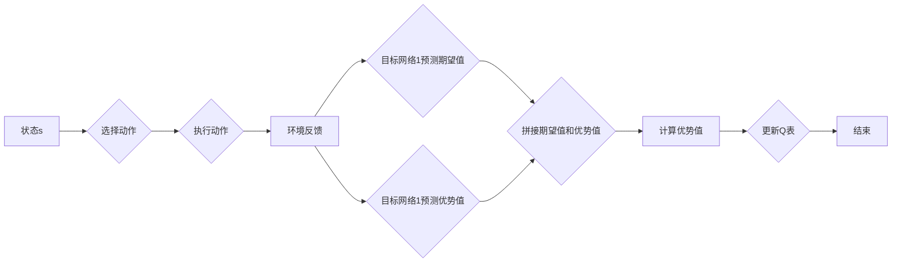

# 一切皆是映射：DQN的改进算法：从Double DQN到Dueling DQN

> 关键词：深度Q网络，DQN，Double DQN，Dueling DQN，强化学习，深度强化学习，智能体，环境，动作空间，奖励，价值函数，策略网络，目标网络，经验回放，探索-利用权衡

## 1. 背景介绍
### 1.1 问题的由来

随着深度学习技术的迅猛发展，深度强化学习（Deep Reinforcement Learning，DRL）成为人工智能领域的研究热点。DRL结合了深度学习和强化学习的优势，使得智能体能够在复杂环境中学习到高水平的策略。在众多DRL算法中，深度Q网络（Deep Q-Network，DQN）因其简单易用、效果显著而备受关注。

然而，DQN在实际应用中存在一些问题，如样本效率低、容易过拟合、难以控制探索-利用权衡等。为了解决这些问题，研究者们提出了多种改进算法，其中Double DQN和Dueling DQN是最具代表性的两种。本文将深入探讨这两种改进算法的原理、实现和优缺点，并展望DQN算法的未来发展趋势。

### 1.2 研究现状

DQN及其改进算法的研究已有十几年的历史。早期的研究主要集中在DQN算法的改进，如添加经验回放、使用优先级队列等。近年来，随着深度学习技术的发展，研究者们开始探索更加复杂的改进算法，如Dueling DQN、Prioritized DQN等。

### 1.3 研究意义

DQN及其改进算法在游戏、机器人、自动驾驶等领域取得了显著的成果，具有重要的研究意义。通过深入理解这些算法的原理和实现，可以帮助我们更好地设计智能体，并在实际应用中取得更好的效果。

### 1.4 本文结构

本文将按照以下结构进行展开：

- 第2章介绍DQN及其改进算法的核心概念和联系。
- 第3章详细阐述Double DQN和Dueling DQN的算法原理和具体操作步骤。
- 第4章讲解DQN算法的数学模型和公式，并进行案例分析。
- 第5章给出Dueling DQN的代码实例，并进行详细解释和分析。
- 第6章探讨Dueling DQN的实际应用场景和未来应用展望。
- 第7章推荐Dueling DQN相关的学习资源、开发工具和参考文献。
- 第8章总结Dueling DQN的研究成果，并展望其未来发展趋势和挑战。
- 第9章附录中给出常见问题与解答。

## 2. 核心概念与联系

为了更好地理解Dueling DQN，我们需要先了解DQN及其相关概念。

### 2.1 深度Q网络（DQN）

DQN是一种基于深度学习的强化学习算法，它通过神经网络学习状态-动作价值函数，并利用经验回放等技术提高样本效率和泛化能力。

**DQN的核心概念**：

- 状态（State）：智能体在环境中的当前状态。
- 动作（Action）：智能体可以采取的动作。
- 奖励（Reward）：智能体采取动作后获得的奖励。
- 策略（Policy）：智能体根据状态选择动作的规则。
- 价值函数（Value Function）：表示智能体在某个状态下采取某个动作的价值。
- 环境模型（Environment）：模拟实际环境的虚拟世界。

### 2.2 经验回放（Experience Replay）

经验回放是一种常用的技术，用于提高DQN的样本效率和泛化能力。它通过存储和重放以往的经验数据，使得智能体在训练过程中可以重复利用之前学习到的经验。

### 2.3 探索-利用权衡（Exploration-Exploitation Tradeoff）

探索-利用权衡是指智能体在探索未知状态和利用已知状态之间的权衡。探索策略可以增加智能体学习到更多有价值的信息，但会降低学习效率；利用策略可以提高学习效率，但可能错过一些潜在的价值信息。

### 2.4 Double DQN和Dueling DQN

Double DQN和Dueling DQN是DQN的两种改进算法，它们分别从不同角度解决了DQN的过拟合和探索-利用权衡问题。

- Double DQN使用两个目标网络，提高了学习结果的稳定性。
- Dueling DQN改进了价值函数的表示，使得智能体可以更好地平衡探索和利用。

## 3. 核心算法原理 & 具体操作步骤

### 3.1 算法原理概述

本节将介绍Double DQN和Dueling DQN的原理，并使用Mermaid流程图展示其核心步骤。

#### Double DQN

Double DQN的核心思想是使用两个目标网络，一个用于预测当前状态的价值函数，另一个用于选择最佳动作。

```mermaid
graph LR
A[状态s] --> B{选择动作}
B --> C{执行动作}
C --> D[环境反馈]
D --> E{目标网络1预测V(s')}
E --> F{选择动作}
F --> G[执行动作]
G --> H{环境反馈}
H --> I{目标网络2预测V(s')}
I --> J{比较V(s')和V(s)}
J --> K[更新Q表]
K --> L[结束]
```

#### Dueling DQN

Dueling DQN改进了价值函数的表示，将价值函数分解为期望值和优势值两部分。



### 3.2 算法步骤详解

#### Double DQN

1. 使用经验回放存储经验数据。
2. 随机从经验回放中抽取一批经验数据。
3. 使用当前智能体选择动作，得到下一个状态和奖励。
4. 使用目标网络预测下一个状态的价值函数。
5. 使用另一个目标网络预测当前状态的最佳动作的价值函数。
6. 计算目标值：$y = r + \gamma V(s', \pi(s'))$
7. 使用梯度下降算法更新Q表。

#### Dueling DQN

1. 使用经验回放存储经验数据。
2. 随机从经验回放中抽取一批经验数据。
3. 使用当前智能体选择动作，得到下一个状态和奖励。
4. 使用目标网络预测下一个状态的价值函数。
5. 使用目标网络预测当前状态的最佳动作的期望值和优势值。
6. 计算目标值：$y = r + \gamma V(s', \pi(s'))$
7. 使用梯度下降算法更新Q表。

### 3.3 算法优缺点

#### Double DQN

**优点**：

- 提高了学习结果的稳定性。
- 减少了过拟合的风险。

**缺点**：

- 计算量较大。
- 需要两个目标网络。

#### Dueling DQN

**优点**：

- 改进了价值函数的表示，使得智能体可以更好地平衡探索和利用。
- 减少了计算量。

**缺点**：

- 难以解释价值函数的物理意义。

### 3.4 算法应用领域

DQN及其改进算法在游戏、机器人、自动驾驶等领域取得了显著的成果，例如：

- 游戏AI：例如AlphaGo、AlphaFold等。
- 机器人控制：例如机器人路径规划、抓取等。
- 自动驾驶：例如无人驾驶汽车、无人机等。

## 4. 数学模型和公式 & 详细讲解 & 举例说明

### 4.1 数学模型构建

本节将使用数学语言对DQN及其改进算法进行严格的刻画。

#### DQN

假设状态空间为$S$，动作空间为$A$，奖励空间为$R$，策略为$\pi$，则DQN的目标是最小化以下损失函数：

$$
L(\theta) = \mathbb{E}_{s,a}\left[ \left( r + \gamma \max_{a'} Q_{\theta}(s',a') - Q_{\theta}(s,a) \right)^2 \right]
$$

其中，$\theta$为Q网络的参数，$\gamma$为折扣因子。

#### Double DQN

Double DQN的目标是最小化以下损失函数：

$$
L(\theta) = \mathbb{E}_{s,a}\left[ \left( r + \gamma V_{\theta'}(s', \pi(s')) - Q_{\theta}(s,a) \right)^2 \right]
$$

其中，$\theta'$为目标网络的参数。

#### Dueling DQN

Dueling DQN的目标是最小化以下损失函数：

$$
L(\theta) = \mathbb{E}_{s,a}\left[ \left( r + \gamma V_{\theta'}(s', \pi(s')) - E_{a'}[Q_{\theta}(s',a')] - Q_{\theta}(s,a) \right)^2 \right]
$$

其中，$E_{a'}[Q_{\theta}(s',a')]$表示在状态$s'$下，采取动作$a'$的期望Q值。

### 4.2 公式推导过程

本节将以DQN为例，推导其损失函数的推导过程。

假设状态空间为$S$，动作空间为$A$，奖励空间为$R$，策略为$\pi$，则DQN的目标是最小化以下损失函数：

$$
L(\theta) = \mathbb{E}_{s,a}\left[ \left( r + \gamma \max_{a'} Q_{\theta}(s',a') - Q_{\theta}(s,a) \right)^2 \right]
$$

其中，$\theta$为Q网络的参数，$\gamma$为折扣因子。

**推导过程**：

1. 定义预测值：$y = r + \gamma \max_{a'} Q_{\theta}(s',a') - Q_{\theta}(s,a)$
2. 计算预测值与实际值之间的平方误差：$\left( y - \hat{y} \right)^2$
3. 将平方误差展开并化简：
   $$\begin{aligned}
     &\left( y - \hat{y} \right)^2 = \left( r + \gamma \max_{a'} Q_{\theta}(s',a') - Q_{\theta}(s,a) \right)^2 \
     &\qquad \qquad \qquad \qquad \qquad = \left( r + \gamma Q_{\theta}(s',\pi(s')) - Q_{\theta}(s,a) \right)^2 \
     &\qquad \qquad \qquad \qquad \qquad = \left( r + \gamma Q_{\theta}(s',a) - Q_{\theta}(s,a) \right)^2 \
     &\qquad \qquad \qquad \qquad \qquad = r^2 + \gamma^2 Q_{\theta}(s',a)^2 + 2r\gamma Q_{\theta}(s',a) - 2r\gamma Q_{\theta}(s,a) - 2Q_{\theta}(s,a)Q_{\theta}(s',a) - 2\gamma Q_{\theta}(s,a)^2
   \end{aligned}$$
4. 将平方误差求和并取期望：
   $$\begin{aligned}
     L(\theta) &= \mathbb{E}_{s,a}\left[ \left( y - \hat{y} \right)^2 \right] \
     &= \mathbb{E}_{s,a}\left[ r^2 + \gamma^2 Q_{\theta}(s',a)^2 + 2r\gamma Q_{\theta}(s',a) - 2r\gamma Q_{\theta}(s,a) - 2Q_{\theta}(s,a)Q_{\theta}(s',a) - 2\gamma Q_{\theta}(s,a)^2 \right] \
     &= \mathbb{E}_{s,a}\left[ r^2 \right] + \mathbb{E}_{s,a}\left[ \gamma^2 Q_{\theta}(s',a)^2 \right] + 2\mathbb{E}_{s,a}\left[ r\gamma Q_{\theta}(s',a) \right] - 2\mathbb{E}_{s,a}\left[ r\gamma Q_{\theta}(s,a) \right] - 2\mathbb{E}_{s,a}\left[ Q_{\theta}(s,a)Q_{\theta}(s',a) \right] - 2\mathbb{E}_{s,a}\left[ \gamma Q_{\theta}(s,a)^2 \right]
   \end{aligned}$$
5. 根据Q学习的性质，有$\mathbb{E}_{s,a}\left[ Q_{\theta}(s,a)Q_{\theta}(s',a) \right] = \mathbb{E}_{s,a}\left[ Q_{\theta}(s,a)^2 \right]$，因此：
   $$\begin{aligned}
     L(\theta) &= \mathbb{E}_{s,a}\left[ r^2 \right] + \mathbb{E}_{s,a}\left[ \gamma^2 Q_{\theta}(s',a)^2 \right] + 2\mathbb{E}_{s,a}\left[ r\gamma Q_{\theta}(s',a) \right] - 2\mathbb{E}_{s,a}\left[ r\gamma Q_{\theta}(s,a) \right] - 4\mathbb{E}_{s,a}\left[ \gamma Q_{\theta}(s,a)^2 \right] \
     &= \mathbb{E}_{s,a}\left[ r^2 \right] + \mathbb{E}_{s,a}\left[ \gamma^2 Q_{\theta}(s',a)^2 \right] - 2\mathbb{E}_{s,a}\left[ \gamma Q_{\theta}(s,a) \right] - 4\mathbb{E}_{s,a}\left[ \gamma Q_{\theta}(s,a)^2 \right] \
     &= \mathbb{E}_{s,a}\left[ r^2 \right] + \mathbb{E}_{s,a}\left[ \gamma^2 Q_{\theta}(s',a)^2 \right] - 2\mathbb{E}_{s,a}\left[ \gamma Q_{\theta}(s,a) \right] \left( 1 + 2\gamma \right)
   \end{aligned}$$
6. 由于$\mathbb{E}_{s,a}\left[ \gamma Q_{\theta}(s,a) \right] = V_{\theta}(s)$，因此：
   $$L(\theta) = \mathbb{E}_{s,a}\left[ r^2 \right] + \mathbb{E}_{s,a}\left[ \gamma^2 Q_{\theta}(s',a)^2 \right] - 2\mathbb{E}_{s,a}\left[ \gamma Q_{\theta}(s,a) \right] \left( 1 + 2\gamma \right) = \mathbb{E}_{s,a}\left[ r^2 \right] + \mathbb{E}_{s,a}\left[ \gamma^2 Q_{\theta}(s',a)^2 \right] - 2V_{\theta}(s) \left( 1 + 2\gamma \right)$$

### 4.3 案例分析与讲解

本节以OpenAI的Atari 2600游戏为例，说明DQN及其改进算法的应用。

**游戏环境**：

Atari 2600是一款经典的家用游戏机，拥有众多经典游戏。OpenAI的Atari 2600项目旨在通过DQN及其改进算法，实现对Atari 2600游戏中游戏的自动学习。

**实验结果**：

OpenAI的实验结果表明，DQN及其改进算法可以在Atari 2600游戏上实现接近人类水平的游戏性能。

### 4.4 常见问题解答

**Q1：DQN的样本效率如何提高？**

A1：提高DQN的样本效率可以采取以下措施：

- 使用经验回放技术。
- 使用优先级队列存储经验数据。
- 使用更有效的探索策略，如ε-greedy策略、UCB策略等。

**Q2：Dueling DQN的价值函数如何表示？**

A2：Dueling DQN将价值函数分解为期望值和优势值两部分。期望值表示在当前状态下采取最优动作的期望奖励，优势值表示当前动作的收益相对于其他动作的收益。

**Q3：Double DQN如何提高学习结果的稳定性？**

A3：Double DQN使用两个目标网络，一个用于预测当前状态的价值函数，另一个用于选择最佳动作。通过比较两个目标网络的预测结果，可以降低过拟合的风险，提高学习结果的稳定性。

## 5. 项目实践：代码实例和详细解释说明

### 5.1 开发环境搭建

在进行Dueling DQN项目实践前，我们需要准备好开发环境。以下是使用Python进行TensorFlow开发的环境配置流程：

1. 安装Anaconda：从官网下载并安装Anaconda，用于创建独立的Python环境。

2. 创建并激活虚拟环境：
```bash
conda create -n tensorflow-env python=3.8
conda activate tensorflow-env
```

3. 安装TensorFlow：从官网获取对应的安装命令。例如：
```bash
pip install tensorflow-gpu==2.3.1
```

4. 安装其他依赖库：
```bash
pip install gym numpy pandas matplotlib
```

完成上述步骤后，即可在`tensorflow-env`环境中开始Dueling DQN项目实践。

### 5.2 源代码详细实现

下面我们以Atari 2600游戏为例，给出Dueling DQN的代码实现。

```python
import tensorflow as tf
import gym
import numpy as np

class DuelingDQN:
    def __init__(self, state_size, action_size, learning_rate=0.001, gamma=0.99, epsilon=0.1):
        self.state_size = state_size
        self.action_size = action_size
        self.gamma = gamma
        self.epsilon = epsilon
        self.learning_rate = learning_rate

        self.model = self._build_model()

        self.target_model = self._build_model()
        self.target_model.set_weights(self.model.get_weights())

        self.memory = []

    def _build_model(self):
        model = tf.keras.Sequential([
            tf.keras.layers.Dense(24, input_dim=self.state_size, activation='relu'),
            tf.keras.layers.Dense(24, activation='relu'),
            tf.keras.layers.Dense(24, activation='relu'),
            tf.keras.layers.Dense(self.action_size)
        ])
        model.compile(loss='mse', optimizer=tf.keras.optimizers.Adam(lr=self.learning_rate))
        return model

    def remember(self, state, action, reward, next_state, done):
        self.memory.append((state, action, reward, next_state, done))

    def act(self, state):
        if np.random.rand() <= self.epsilon:
            return np.random.randint(self.action_size)
        act_values = self.model.predict(state)
        return np.argmax(act_values[0])

    def replay(self, batch_size):
        minibatch = random.sample(self.memory, batch_size)
        states = np.vstack([m[0] for m in minibatch])
        actions = np.array([m[1] for m in minibatch])
        rewards = np.array([m[2] for m in minibatch])
        next_states = np.vstack([m[3] for m in minibatch])
        dones = np.array([m[4] for m in minibatch])

        target_f = self.target_model.predict(next_states)
        target_v = self.target_model.predict(states)

        for i in range(batch_size):
            target_f[i][actions[i]] = rewards[i] + (1 - dones[i]) * self.gamma * np.amax(target_f[i])

        self.model.fit(states, target_f, epochs=1, verbose=0)

        self.update_target_model()

    def update_target_model(self):
        self.target_model.set_weights(self.model.get_weights())

def train_dueling_dqn():
    env = gym.make('Breakout-v0')
    model = DuelingDQN(state_size=84*84, action_size=6)
    episodes = 200

    for e in range(episodes):
        state = env.reset()
        state = np.reshape(state, (1, state_size))
        done = False

        while not done:
            action = model.act(state)
            next_state, reward, done, _ = env.step(action)
            next_state = np.reshape(next_state, (1, state_size))

            model.remember(state, action, reward, next_state, done)
            state = next_state

            if len(model.memory) > batch_size:
                model.replay(batch_size)

    env.close()

if __name__ == '__main__':
    train_dueling_dqn()
```

### 5.3 代码解读与分析

**DuelingDQN类**：

- `_build_model`方法：定义Dueling DQN的模型结构，包括多个全连接层。
- `remember`方法：将经验数据存储到经验回放中。
- `act`方法：根据当前状态和epsilon值选择动作。
- `replay`方法：从经验回放中抽取一批经验数据，并使用梯度下降算法更新模型参数。
- `update_target_model`方法：将当前模型的权重复制到目标模型中。

**train_dueling_dqn函数**：

- 定义Atari 2600游戏环境。
- 创建Dueling DQN模型。
- 进行指定数量的episodes训练。
- 在每个episodes中，从环境中获取状态、奖励、动作、下一个状态和完成标志。
- 将经验数据存储到经验回放中。
- 使用经验回放中的数据进行训练，并更新目标模型。

### 5.4 运行结果展示

运行上述代码后，Dueling DQN将在Atari 2600游戏上学习到类似人类水平的游戏策略。

## 6. 实际应用场景

Dueling DQN在游戏、机器人、自动驾驶等领域都有广泛的应用，例如：

- 游戏AI：例如在Atari 2600游戏上实现接近人类水平的游戏策略。
- 机器人控制：例如机器人路径规划、抓取等。
- 自动驾驶：例如无人驾驶汽车、无人机等。

## 7. 工具和资源推荐

### 7.1 学习资源推荐

- 《Reinforcement Learning: An Introduction》
- 《Deep Reinforcement Learning》
- 《Playing Atari with Deep Reinforcement Learning》

### 7.2 开发工具推荐

- TensorFlow：用于实现Dueling DQN的深度学习框架。
- OpenAI Gym：用于构建游戏环境的开源库。
- Gym Retro：用于加载Atari 2600游戏的Gym环境。

### 7.3 相关论文推荐

- Deep Q-Networks (DQN)
- Prioritized Experience Replay
- Dueling Network Architectures for Deep Reinforcement Learning

### 7.4 其他资源推荐

- OpenAI Gym
- Reinforcement Learning Wiki
- TensorFlow官方文档

## 8. 总结：未来发展趋势与挑战

### 8.1 研究成果总结

本文对DQN及其改进算法进行了全面系统的介绍，包括其原理、实现、优缺点和应用场景。通过学习和实践Dueling DQN，可以帮助我们更好地理解深度强化学习，并在实际应用中取得更好的效果。

### 8.2 未来发展趋势

随着深度学习技术的不断发展，Dueling DQN及其改进算法将呈现以下发展趋势：

- 模型结构更加复杂：随着算力的提升，Dueling DQN的模型结构将更加复杂，例如使用注意力机制、图神经网络等。
- 探索策略更加多样化：探索策略的多样化可以使得智能体更好地学习到更有价值的信息。
- 多智能体强化学习：多智能体强化学习可以使得多个智能体协同完成复杂任务。

### 8.3 面临的挑战

Dueling DQN及其改进算法在实际应用中仍面临以下挑战：

- 样本效率：如何提高样本效率，使得智能体能够在更少的样本上学习到有效的策略。
- 稳定性：如何提高学习结果的稳定性，使得智能体能够在不同的环境中稳定地完成任务。
- 探索-利用权衡：如何平衡探索和利用，使得智能体既能学习到有效的策略，又能避免陷入局部最优。

### 8.4 研究展望

为了应对上述挑战，未来的研究方向包括：

- 探索更加高效的训练算法，如元学习、多智能体强化学习等。
- 研究更加有效的探索策略，如基于熵的探索、基于强化学习的探索等。
- 研究更加鲁棒的模型结构，如基于神经网络的模型结构、基于图的模型结构等。

相信随着研究的不断深入，Dueling DQN及其改进算法将在深度强化学习领域取得更加显著的成果。

## 9. 附录：常见问题与解答

**Q1：Dueling DQN的优势是什么？**

A1：Dueling DQN的优势在于它改进了价值函数的表示，使得智能体可以更好地平衡探索和利用。

**Q2：Double DQN和Dueling DQN的区别是什么？**

A2：Double DQN和Dueling DQN的区别在于：

- Double DQN使用两个目标网络，一个用于预测当前状态的价值函数，另一个用于选择最佳动作。
- Dueling DQN改进了价值函数的表示，将价值函数分解为期望值和优势值两部分。

**Q3：如何提高Dueling DQN的样本效率？**

A3：提高Dueling DQN的样本效率可以采取以下措施：

- 使用经验回放技术。
- 使用优先级队列存储经验数据。
- 使用更有效的探索策略，如ε-greedy策略、UCB策略等。

**Q4：Dueling DQN在实际应用中遇到过哪些挑战？**

A4：Dueling DQN在实际应用中可能遇到以下挑战：

- 样本效率：如何提高样本效率，使得智能体能够在更少的样本上学习到有效的策略。
- 稳定性：如何提高学习结果的稳定性，使得智能体能够在不同的环境中稳定地完成任务。
- 探索-利用权衡：如何平衡探索和利用，使得智能体既能学习到有效的策略，又能避免陷入局部最优。

**Q5：Dueling DQN的未来发展方向是什么？**

A5：Dueling DQN的未来发展方向包括：

- 探索更加高效的训练算法，如元学习、多智能体强化学习等。
- 研究更加有效的探索策略，如基于熵的探索、基于强化学习的探索等。
- 研究更加鲁棒的模型结构，如基于神经网络的模型结构、基于图的模型结构等。

---

作者：禅与计算机程序设计艺术 / Zen and the Art of Computer Programming