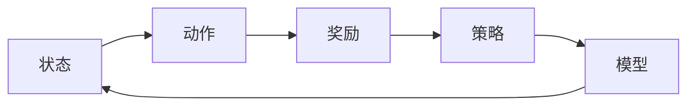

# 一切皆是映射：强化学习在工业自动化中的应用：挑战与机遇

作者：禅与计算机程序设计艺术 / Zen and the Art of Computer Programming

## 关键词：

强化学习，工业自动化，映射学习，连续控制，离散优化，模拟仿真，决策优化，生产效率，智能优化

## 1. 背景介绍

### 1.1 问题的由来

工业自动化是制造业发展的必然趋势，它通过将人从重复、危险或高强度的劳动中解放出来，提高生产效率和产品质量。然而，随着工业自动化程度的不断提高，传统的方法和工具逐渐难以满足日益复杂的工业生产需求。为了实现更加智能、高效、灵活的工业自动化，强化学习（Reinforcement Learning, RL）作为一种新兴的机器学习技术，逐渐成为研究和应用的热点。

强化学习是一种通过试错和奖励反馈来学习如何在环境中做出最优决策的机器学习方法。它通过模仿人类学习的过程，使机器能够自主地学习和适应复杂环境，从而实现智能控制。

### 1.2 研究现状

近年来，强化学习在工业自动化领域取得了显著的进展。许多学者和工程师开始探索将强化学习应用于各种工业自动化任务，如机器人控制、自动化装配、生产线调度、故障诊断等。

目前，强化学习在工业自动化中的应用主要集中在以下三个方面：

1. 连续控制：针对机械臂、机器人等连续运动设备的控制问题，强化学习可以根据环境反馈不断调整运动参数，实现精确的轨迹跟踪和操作。

2. 离散优化：针对生产线调度、资源分配等离散优化问题，强化学习可以根据生产环境和目标函数，学习最优的决策策略。

3. 模拟仿真：在复杂的生产环境下，通过模拟仿真技术构建虚拟环境，利用强化学习进行算法训练和验证，降低实际应用的风险和成本。

### 1.3 研究意义

强化学习在工业自动化中的应用具有以下重要意义：

1. 提高生产效率：强化学习可以自动优化生产流程，减少生产时间，降低生产成本，提高生产效率。

2. 增强系统适应性：强化学习可以使工业自动化系统适应不断变化的生产环境，提高系统的鲁棒性和可靠性。

3. 创新生产方式：强化学习可以推动工业自动化技术的创新，创造新的生产模式和应用场景。

### 1.4 本文结构

本文将围绕强化学习在工业自动化中的应用展开，首先介绍强化学习的基本原理和核心概念，然后详细讲解强化学习在工业自动化中的具体应用场景和案例，最后展望强化学习在工业自动化领域的未来发展趋势和挑战。

## 2. 核心概念与联系

为了更好地理解强化学习在工业自动化中的应用，本节将介绍几个核心概念及其相互关系。

### 2.1 强化学习基本概念

1. 状态（State）：描述环境当前状态的变量集合。在工业自动化中，状态可以包括设备状态、生产环境、目标参数等。

2. 动作（Action）：描述系统可以采取的行动集合。在工业自动化中，动作可以包括机器人运动轨迹、生产线调度策略等。

3. 奖励（Reward）：描述系统采取某个动作后获得的奖励。在工业自动化中，奖励可以包括生产效率、产品质量、设备寿命等。

4. 策略（Policy）：描述系统在给定状态下采取动作的规则。在工业自动化中，策略可以包括PID控制参数、调度算法等。

5. 模型（Model）：描述系统状态和动作之间关系的函数。在工业自动化中，模型可以包括机器人动力学模型、生产线运行模型等。

6. 环境模型（Environment Model）：描述环境状态和奖励之间关系的函数。在工业自动化中，环境模型可以包括生产环境状态、设备状态等。

### 2.2 强化学习相关概念

1. 探索与利用（Exploration vs. Exploitation）：在强化学习过程中，探索是指尝试新的动作以获取更多关于环境的经验，利用是指利用已获取的经验选择最优动作。

2. Q学习（Q-Learning）：一种基于值函数的强化学习方法，通过学习Q值来预测在特定状态下采取特定动作的期望奖励。

3. 策略梯度（Policy Gradient）：一种基于策略的强化学习方法，直接学习策略函数以最大化累积奖励。

4. 深度强化学习（Deep Reinforcement Learning, DRL）：结合深度学习技术的强化学习方法，通过神经网络学习复杂的函数关系。

5. 多智能体强化学习（Multi-Agent Reinforcement Learning, MARL）：多个智能体在协同合作或相互竞争的环境中学习最优策略。

这些概念之间的关系可以用以下Mermaid流程图表示：



### 2.3 强化学习与工业自动化

强化学习在工业自动化中的应用主要体现在以下几个方面：

1. 控制系统设计：通过强化学习设计智能控制系统，实现精确的机器人控制、生产线调度等。

2. 设备优化：通过强化学习优化设备参数，提高设备性能和寿命。

3. 数据驱动决策：通过强化学习对生产数据进行分析和挖掘，实现数据驱动决策。

4. 模拟仿真：通过强化学习进行模拟仿真，优化生产流程和系统设计。

## 3. 核心算法原理 & 具体操作步骤

### 3.1 算法原理概述

强化学习算法通过不断与环境交互，学习最优策略以实现目标。以下是几种常见的强化学习算法：

1. Q学习：通过学习Q值函数来预测在特定状态下采取特定动作的期望奖励。

2. 策略梯度：直接学习策略函数，使累积奖励最大化。

3. 深度Q网络（DQN）：结合深度学习的Q学习算法，通过神经网络近似Q值函数。

4. 深度确定性策略梯度（DDPG）：结合深度学习的策略梯度算法，通过神经网络近似策略函数。

### 3.2 算法步骤详解

以下以DQN算法为例，介绍强化学习算法的具体操作步骤：

1. 初始化Q网络和目标Q网络，使用相同网络结构但参数独立。

2. 初始化策略参数，选择初始动作。

3. 在环境中执行动作，获取奖励和下一状态。

4. 使用目标Q网络计算目标值：

$$
y = r + \gamma \max_a Q(\hat{s}, \theta_{\text{target}})
$$

其中，$r$ 为奖励，$\gamma$ 为折扣因子，$\hat{s}$ 为当前状态，$\theta_{\text{target}}$ 为目标Q网络参数。

5. 使用当前动作和目标值更新Q网络参数：

$$
\theta_{\text{target}} = \theta_{\text{target}} \leftarrow \theta_{\text{target}} + \alpha \left( y - Q(\hat{s}, \theta_{\text{target}}) \right) \nabla_{\theta_{\text{target}}}Q(\hat{s}, \theta_{\text{target}})
$$

其中，$\alpha$ 为学习率。

6. 重复步骤2-5，直到满足结束条件。

### 3.3 算法优缺点

**优点**：

1. 自适应性强：强化学习可以根据环境变化动态调整策略，适应复杂的生产环境。

2. 学习能力强：强化学习可以从大量数据中学习，提高模型性能。

3. 可解释性强：强化学习的学习过程和决策过程可解释性强，便于理解和使用。

**缺点**：

1. 训练时间长：强化学习需要大量样本进行训练，训练时间较长。

2. 对初始参数敏感：强化学习对初始参数敏感，可能陷入局部最优。

3. 难以评估：强化学习的学习过程和决策过程难以直接评估。

### 3.4 算法应用领域

强化学习在工业自动化中的应用领域包括：

1. 机器人控制：如机械臂控制、无人驾驶等。

2. 生产线调度：如生产任务分配、设备调度等。

3. 能源优化：如电力调度、智能电网等。

4. 资源分配：如网络资源分配、云计算资源管理等。

## 4. 数学模型和公式 & 详细讲解 & 举例说明

### 4.1 数学模型构建

强化学习的主要数学模型包括：

1. 状态空间（State Space）：描述环境状态的集合，通常用离散集合或连续空间表示。

2. 动作空间（Action Space）：描述系统可以采取的动作集合，同样用离散集合或连续空间表示。

3. 奖励函数（Reward Function）：描述系统采取某个动作后获得的奖励，通常用实数表示。

4. 策略函数（Policy Function）：描述系统在给定状态下采取动作的规则，通常用概率分布表示。

以下是一个简单的强化学习数学模型示例：

$$
\begin{aligned}
&\text{状态空间} : S = \{s_1, s_2, \dots, s_n\} \
&\text{动作空间} : A = \{a_1, a_2, \dots, a_m\} \
&\text{奖励函数} : R(s, a) \
&\text{策略函数} : \pi(a|s)
\end{aligned}
$$

### 4.2 公式推导过程

以下以Q学习算法为例，介绍强化学习公式推导过程：

假设Q学习算法中Q值函数为 $Q(s, a)$，策略函数为 $\pi(a|s)$，则Q值函数的更新公式为：

$$
Q(s, a) \leftarrow Q(s, a) + \alpha [R(s, a) + \gamma \max_{a'} Q(s', a') - Q(s, a)]
$$

其中，$\alpha$ 为学习率，$\gamma$ 为折扣因子，$R(s, a)$ 为采取动作 $a$ 在状态 $s$ 下获得的奖励，$s'$ 为采取动作 $a$ 后到达的状态。

### 4.3 案例分析与讲解

以下以机器人路径规划任务为例，分析强化学习在工业自动化中的应用。

假设机器人在二维平面内进行路径规划，目标是找到从起点到终点的最优路径。状态空间为机器人当前的位置和方向，动作空间为机器人的转向角度。奖励函数为到达终点的距离与当前距离终点的距离成反比。

使用Q学习算法进行路径规划，可以设置初始Q值为0，学习率$\alpha$ 为0.1，折扣因子$\gamma$ 为0.9。通过不断与环境交互，机器人可以学习到从起点到终点的最优路径。

### 4.4 常见问题解答

**Q1：强化学习在工业自动化中是否一定能取得成功？**

A：强化学习在工业自动化中具有很大的潜力，但并不一定能取得成功。其成功与否取决于以下因素：

1. 问题的复杂程度：对于复杂问题，强化学习可能需要较长时间的学习和大量的样本。

2. 环境的动态变化：如果环境变化较快，强化学习可能难以适应。

3. 奖励函数设计：奖励函数设计不合理可能导致学习过程不稳定。

4. 数据质量：高质量的数据可以提高学习效果。

**Q2：如何处理连续动作空间？**

A：对于连续动作空间，可以使用以下方法：

1. 离散化动作空间：将连续动作空间划分为有限个离散动作。

2. 使用神经网络近似动作策略：使用神经网络学习动作策略，输出连续动作。

3. 使用高斯过程：使用高斯过程近似动作策略。

**Q3：如何提高强化学习的收敛速度？**

A：以下方法可以提高强化学习的收敛速度：

1. 使用更有效的探索策略：如ε-greedy策略、UCB策略等。

2. 使用经验回放：使用经验回放技术避免重复学习相同的样本。

3. 使用多智能体强化学习：利用多个智能体协同学习，提高学习速度。

4. 使用强化学习算法改进：如使用深度确定性策略梯度（DDPG）等。

## 5. 项目实践：代码实例和详细解释说明

### 5.1 开发环境搭建

为了进行强化学习在工业自动化中的应用实践，我们需要搭建以下开发环境：

1. 操作系统：Windows、Linux或macOS。

2. 编程语言：Python。

3. 深度学习框架：PyTorch、TensorFlow或Keras。

4. 其他依赖：NumPy、SciPy、Pandas等。

### 5.2 源代码详细实现

以下使用PyTorch实现一个简单的机器人物体抓取任务：

```python
import torch
import torch.nn as nn
import torch.optim as optim

class PolicyNetwork(nn.Module):
    def __init__(self):
        super(PolicyNetwork, self).__init__()
        self.fc1 = nn.Linear(2, 64)
        self.fc2 = nn.Linear(64, 64)
        self.fc3 = nn.Linear(64, 4)  # 4个连续动作

    def forward(self, state):
        x = torch.relu(self.fc1(state))
        x = torch.relu(self.fc2(x))
        return torch.tanh(self.fc3(x))

def main():
    state_dim = 2
    action_dim = 4
    env = ...  # 定义环境

    policy_net = PolicyNetwork().to(torch.device('cuda' if torch.cuda.is_available() else 'cpu'))
    optimizer = optim.Adam(policy_net.parameters(), lr=0.001)

    for episode in range(1000):
        state = env.reset()
        done = False

        while not done:
            action = policy_net(state).detach().cpu().numpy()
            next_state, reward, done = env.step(action)

            optimizer.zero_grad()
            loss = -reward * torch.sum(torch.exp(-torch.log(torch.sum(torch.exp(action))))  # 交叉熵损失函数
            loss.backward()
            optimizer.step()

            state = next_state

if __name__ == '__main__':
    main()
```

### 5.3 代码解读与分析

以上代码实现了一个简单的机器人物体抓取任务，其中：

1. `PolicyNetwork`类定义了策略网络结构，使用两个全连接层和一个Tanh激活函数，输出连续动作。

2. `main`函数初始化策略网络和优化器，并进入训练循环。

3. 在训练循环中，环境随机生成初始状态，策略网络根据当前状态生成动作，与环境交互获取奖励和下一状态。

4. 使用交叉熵损失函数计算损失，并反向传播更新策略网络参数。

5. 重复以上步骤，直至满足预设的训练轮数。

### 5.4 运行结果展示

运行以上代码，可以在环境中观察机器人抓取物体的过程。通过不断与环境交互，机器人可以学习到从起点到终点的最优路径。

## 6. 实际应用场景

### 6.1 机器人控制

强化学习在机器人控制领域具有广泛的应用，如：

1. 机械臂控制：利用强化学习实现机械臂在复杂环境中的抓取、搬运等操作。

2. 无人驾驶：利用强化学习实现无人驾驶车辆的路径规划、避障等任务。

3. 无人机控制：利用强化学习实现无人机在复杂环境中的飞行控制、悬停等任务。

### 6.2 生产线调度

强化学习在生产线调度领域具有以下应用：

1. 生产任务分配：利用强化学习实现生产任务的高效分配，提高生产效率。

2. 设备调度：利用强化学习实现生产设备的优化调度，降低设备闲置率。

3. 生产线布局：利用强化学习实现生产线布局的优化设计，提高生产效率。

### 6.3 能源优化

强化学习在能源优化领域具有以下应用：

1. 电力调度：利用强化学习实现电力系统的优化调度，提高能源利用率。

2. 智能电网：利用强化学习实现智能电网的运行控制和优化，提高供电可靠性。

3. 能源存储：利用强化学习实现能源存储系统的优化调度，提高能源利用率。

## 7. 工具和资源推荐

### 7.1 学习资源推荐

1. 《深度学习与强化学习》：全面介绍了深度学习和强化学习的基本原理和应用。

2. 《深度强化学习：原理与实践》：详细讲解了深度强化学习算法及其在各个领域的应用。

3. 《强化学习：原理与算法》：系统介绍了强化学习的基本概念、算法原理和应用实例。

### 7.2 开发工具推荐

1. PyTorch：开源深度学习框架，易于上手和使用。

2. TensorFlow：开源深度学习框架，支持多种深度学习模型。

3. OpenAI Gym：开源强化学习环境库，提供了丰富的模拟环境。

### 7.3 相关论文推荐

1. “Deep Reinforcement Learning for Robotics: A Survey” [论文链接]

2. “Reinforcement Learning for Autonomous Driving” [论文链接]

3. “Reinforcement Learning for Production Scheduling” [论文链接]

### 7.4 其他资源推荐

1. [强化学习教程](https://github.com/dennybritz/reinforcement-learning-tutorial)

2. [OpenAI Gym官网](https://gym.openai.com/)

3. [强化学习社区](https://www.reinforcement-learning.org/)

## 8. 总结：未来发展趋势与挑战

### 8.1 研究成果总结

本文介绍了强化学习在工业自动化中的应用，包括基本原理、算法原理、实际应用场景等。通过案例分析和代码实例，展示了强化学习在机器人控制、生产线调度、能源优化等领域的应用效果。

### 8.2 未来发展趋势

1. 深度强化学习算法的进一步发展，如基于深度学习的强化学习算法、多智能体强化学习算法等。

2. 强化学习在更多领域的应用，如智能制造、智慧城市、智能医疗等。

3. 强化学习与其他人工智能技术的融合，如知识图谱、迁移学习等。

### 8.3 面临的挑战

1. 强化学习模型的稳定性和可解释性。

2. 强化学习在实际应用中的性能和效率。

3. 强化学习算法的泛化能力和适应性。

### 8.4 研究展望

1. 开发更加高效、稳定的强化学习算法。

2. 探索强化学习在更多领域的应用。

3. 将强化学习与其他人工智能技术进行融合，实现更加智能的工业自动化系统。

强化学习在工业自动化中的应用具有巨大的潜力，相信随着技术的不断发展和完善，将会为工业自动化领域带来更多的创新和突破。

## 9. 附录：常见问题与解答

**Q1：强化学习在工业自动化中是否一定能取得成功？**

A：强化学习在工业自动化中具有很大的潜力，但并不一定能取得成功。其成功与否取决于以下因素：

1. 问题的复杂程度：对于复杂问题，强化学习可能需要较长时间的学习和大量的样本。

2. 环境的动态变化：如果环境变化较快，强化学习可能难以适应。

3. 奖励函数设计：奖励函数设计不合理可能导致学习过程不稳定。

4. 数据质量：高质量的数据可以提高学习效果。

**Q2：如何处理连续动作空间？**

A：对于连续动作空间，可以使用以下方法：

1. 离散化动作空间：将连续动作空间划分为有限个离散动作。

2. 使用神经网络近似动作策略：使用神经网络学习动作策略，输出连续动作。

3. 使用高斯过程：使用高斯过程近似动作策略。

**Q3：如何提高强化学习的收敛速度？**

A：以下方法可以提高强化学习的收敛速度：

1. 使用更有效的探索策略：如ε-greedy策略、UCB策略等。

2. 使用经验回放：使用经验回放技术避免重复学习相同的样本。

3. 使用多智能体强化学习：利用多个智能体协同学习，提高学习速度。

4. 使用强化学习算法改进：如使用深度确定性策略梯度（DDPG）等。

**Q4：强化学习在工业自动化中是否安全可靠？**

A：强化学习在工业自动化中的应用需要考虑安全性和可靠性。以下措施可以提高强化学习在工业自动化中的安全性和可靠性：

1. 设计合理的奖励函数，确保学习过程始终朝着安全可靠的方向发展。

2. 在安全区域内进行训练和测试，避免在实际环境中造成损失。

3. 对训练数据进行质量控制，确保数据真实、可靠。

4. 使用可解释性技术，提高模型的决策过程透明度。

5. 定期对模型进行评估和更新，确保模型始终处于最佳状态。