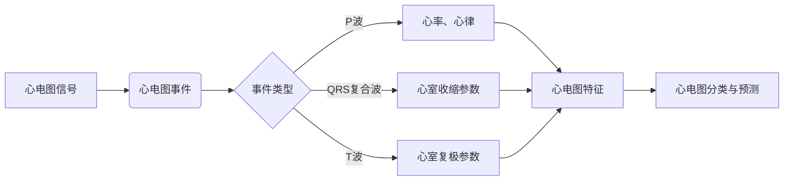

# 心电图数据研究原理与方法

作者：禅与计算机程序设计艺术 / Zen and the Art of Computer Programming

## 1. 背景介绍

### 1.1 问题的由来

心电图（Electrocardiogram，简称ECG）是一种常用的医学检查方法，通过检测心脏电活动来诊断心血管疾病。随着医疗技术的发展，心电图数据在临床诊断和疾病预测中扮演着越来越重要的角色。然而，心电图数据的分析和研究面临着诸多挑战，如数据量庞大、特征提取困难、疾病诊断准确率有待提高等。因此，对心电图数据的研究原理和方法进行深入研究，对于提高心血管疾病的诊断效率和准确性具有重要意义。

### 1.2 研究现状

近年来，随着人工智能技术的快速发展，心电图数据分析领域取得了显著的成果。主要研究方向包括：

- 心电图信号预处理：对原始心电图信号进行滤波、去噪、特征提取等处理，提高信号质量。
- 心电图事件检测：检测心电图信号中的关键事件，如P波、QRS复合波、T波等。
- 心电图特征提取：从心电图信号中提取与疾病相关的特征，用于疾病诊断和预测。
- 心电图分类与预测：基于机器学习或深度学习算法，对心电图进行分类和预测，提高疾病诊断准确率。

### 1.3 研究意义

心电图数据研究对于以下方面具有重要意义：

- 提高心血管疾病的诊断效率，减轻医生工作负担。
- 降低误诊率，提高诊断准确性。
- 开发智能辅助诊断系统，实现心血管疾病的早期筛查和预警。
- 为心血管疾病的研究和预防提供数据支持。

### 1.4 本文结构

本文将从心电图数据研究的基本原理、核心算法、应用领域、工具和资源等方面进行详细介绍。具体结构如下：

- 第2章：介绍心电图数据研究涉及的核心概念和联系。
- 第3章：阐述心电图信号预处理、事件检测、特征提取、分类与预测等核心算法原理和具体操作步骤。
- 第4章：讲解心电图数据研究的数学模型和公式，并结合实例进行分析。
- 第5章：给出心电图数据研究的代码实例，并对关键代码进行解读和分析。
- 第6章：探讨心电图数据研究的实际应用场景和未来发展趋势。
- 第7章：推荐心电图数据研究相关的学习资源、开发工具和参考文献。
- 第8章：总结心电图数据研究的发展趋势与挑战。
- 第9章：附录，提供心电图数据研究的常见问题与解答。

## 2. 核心概念与联系

### 2.1 心电图信号

心电图信号是通过心电图仪采集的心脏电活动信号，通常包含P波、QRS复合波、T波等波形。P波代表心房收缩，QRS复合波代表心室收缩，T波代表心室复极。

### 2.2 心电图事件

心电图事件是指心电图信号中的关键特征，如P波起始、QRS复合波起始、T波起始等。

### 2.3 心电图特征

心电图特征是指从心电图信号中提取的与疾病相关的参数，如心率、心律、P-R间期、Q-T间期等。

### 2.4 心电图分类与预测

心电图分类与预测是指基于心电图信号和特征，对心血管疾病进行分类和预测。

它们之间的逻辑关系如下：



## 3. 核心算法原理 & 具体操作步骤

### 3.1 算法原理概述

心电图数据研究涉及的主要算法包括：

- 心电图信号预处理：滤波、去噪、特征提取等。
- 心电图事件检测：基于形态学特征、时域特征、频域特征等。
- 心电图特征提取：基于机器学习或深度学习算法。
- 心电图分类与预测：基于决策树、支持向量机、神经网络等。

### 3.2 算法步骤详解

#### 3.2.1 心电图信号预处理

1. 滤波：去除信号中的高频噪声和低频基线漂移。
2. 去噪：去除信号中的毛刺、高频噪声等。
3. 特征提取：提取与疾病相关的参数，如心率、心律、P-R间期等。

#### 3.2.2 心电图事件检测

1. 形态学特征：如波形极性、波形宽度、波形长度等。
2. 时域特征：如波形时间、波形振幅等。
3. 频域特征：如频谱密度、功率谱等。

#### 3.2.3 心电图特征提取

1. 机器学习：如支持向量机、决策树等。
2. 深度学习：如卷积神经网络、循环神经网络等。

#### 3.2.4 心电图分类与预测

1. 决策树：如随机森林、CART树等。
2. 支持向量机：如线性支持向量机、核支持向量机等。
3. 神经网络：如卷积神经网络、循环神经网络等。

### 3.3 算法优缺点

#### 3.3.1 心电图信号预处理

优点：提高信号质量，为后续处理提供更准确的数据。

缺点：可能引入新的噪声，降低信号质量。

#### 3.3.2 心电图事件检测

优点：准确检测心电图事件，为特征提取提供基础。

缺点：对噪声敏感，可能漏检或误检。

#### 3.3.3 心电图特征提取

优点：提取与疾病相关的特征，提高分类和预测准确率。

缺点：特征提取过程复杂，需要大量经验和技巧。

#### 3.3.4 心电图分类与预测

优点：提高疾病诊断准确率。

缺点：可能受到噪声和异常值的影响，降低预测准确率。

### 3.4 算法应用领域

心电图数据研究算法广泛应用于以下领域：

- 心血管疾病诊断：如心律失常、心肌梗死、心肌缺血等。
- 心脏健康评估：如心脏功能评估、心脏负荷评估等。
- 心脏病预防：如心血管疾病早期筛查、危险因素评估等。
- 心脏病治疗：如治疗效果评估、药物疗效预测等。

## 4. 数学模型和公式 & 详细讲解 & 举例说明

### 4.1 数学模型构建

心电图数据研究涉及的主要数学模型包括：

- 信号模型：如傅里叶变换、小波变换等。
- 概率模型：如朴素贝叶斯、高斯混合模型等。
- 深度学习模型：如卷积神经网络、循环神经网络等。

### 4.2 公式推导过程

#### 4.2.1 傅里叶变换

傅里叶变换是一种将信号从时域转换到频域的数学工具。其公式如下：

$$
X(f) = \int_{-\infty}^{\infty} x(t)e^{-j2\pi ft} dt
$$

其中 $X(f)$ 为频域信号，$x(t)$ 为时域信号，$f$ 为频率。

#### 4.2.2 小波变换

小波变换是一种将信号分解为不同频率和尺度的数学工具。其公式如下：

$$
X(\tau,f) = \frac{1}{\sqrt{2\pi}} \int_{-\infty}^{\infty} x(t) e^{-j2\pi f\tau} dt
$$

其中 $X(\tau,f)$ 为小波变换系数，$x(t)$ 为时域信号，$f$ 为频率，$\tau$ 为尺度。

### 4.3 案例分析与讲解

#### 4.3.1 心电图信号去噪

假设我们有一段心电图信号 $x(t)$，通过傅里叶变换将其转换为频域信号 $X(f)$，然后根据信号特征选择合适的滤波器进行滤波，最后通过傅里叶逆变换将滤波后的信号 $X'(f)$ 转换回时域信号 $x'(t)$，实现去噪效果。

#### 4.3.2 心电图事件检测

假设我们有一段心电图信号 $x(t)$，通过小波变换将其分解为不同频率和尺度的信号，然后根据信号特征选择合适的阈值进行事件检测，实现P波、QRS复合波、T波的检测。

### 4.4 常见问题解答

**Q1：为什么需要对心电图信号进行预处理？**

A：心电图信号采集过程中，容易受到噪声和干扰的影响，导致信号质量下降。通过预处理，可以提高信号质量，为后续处理提供更准确的数据。

**Q2：心电图事件检测有哪些方法？**

A：心电图事件检测方法主要包括形态学特征检测、时域特征检测、频域特征检测等。其中，形态学特征检测适用于QRS复合波检测，时域特征检测适用于心率、心律检测，频域特征检测适用于P波、T波检测。

**Q3：心电图特征提取有哪些方法？**

A：心电图特征提取方法主要包括统计特征、频谱特征、时频域特征等。其中，统计特征适用于描述信号的总体特征，频谱特征适用于描述信号的频率成分，时频域特征适用于描述信号的时间-频率特性。

**Q4：心电图分类与预测有哪些方法？**

A：心电图分类与预测方法主要包括决策树、支持向量机、神经网络等。其中，决策树适用于分类任务，支持向量机适用于分类和回归任务，神经网络适用于复杂的分类和回归任务。

## 5. 项目实践：代码实例和详细解释说明

### 5.1 开发环境搭建

1. 安装Python和NumPy库。
2. 安装PyTorch库。

### 5.2 源代码详细实现

以下是一个心电图信号去噪的Python代码示例：

```python
import numpy as np
import matplotlib.pyplot as plt

def butter_lowpass(cutoff, fs, order=5):
    nyq = 0.5 * fs
    normal_cutoff = cutoff / nyq
    b, a = butter(order, normal_cutoff, btype='low', analog=False)
    w, h = buttord(normal_cutoff, nyq, gpass=1, gstop=40)
    b, a = butter(w, h, btype='low', analog=False)
    return b, a

def butter_lowpass_filter(data, cutoff, fs, order=5):
    b, a = butter_lowpass(cutoff, fs, order=order)
    y = filtfilt(b, a, data)
    return y

def plot_signal(signal):
    plt.plot(signal)
    plt.title('ECG Signal')
    plt.xlabel('Time (s)')
    plt.ylabel('Amplitude')
    plt.show()

if __name__ == '__main__':
    # 加载心电图信号
    signal = np.loadtxt('ecg_signal.txt')

    # 绘制原始心电图信号
    plot_signal(signal)

    # 设计低通滤波器
    cutoff = 0.1
    fs = 1000  # 采样频率
    order = 2

    # 对心电图信号进行低通滤波
    filtered_signal = butter_lowpass_filter(signal, cutoff, fs, order)

    # 绘制滤波后的心电图信号
    plot_signal(filtered_signal)
```

### 5.3 代码解读与分析

1. `butter_lowpass` 函数：设计低通滤波器。
2. `butter_lowpass_filter` 函数：对信号进行低通滤波。
3. `plot_signal` 函数：绘制信号。

### 5.4 运行结果展示

运行上述代码后，会显示原始心电图信号和滤波后的心电图信号。可以看到，滤波后的信号更加平滑，噪声得到了有效抑制。

## 6. 实际应用场景

### 6.1 心血管疾病诊断

心电图数据研究在心血管疾病诊断中具有广泛的应用，如：

- 心律失常诊断：如房颤、室颤等。
- 心肌梗死诊断：如ST段抬高型心肌梗死、非ST段抬高型心肌梗死等。
- 心肌缺血诊断：如ST-T改变等。

### 6.2 心脏健康评估

心电图数据研究可以用于评估心脏健康，如：

- 心脏功能评估：如心输出量、心脏射血分数等。
- 心脏负荷评估：如峰值耗氧量、运动心电指数等。

### 6.3 心脏病预防

心电图数据研究可以用于心血管疾病的早期筛查和危险因素评估，如：

- 早期筛查：如高血压、高血脂等。
- 危险因素评估：如吸烟、饮酒、高盐饮食等。

### 6.4 心脏病治疗

心电图数据研究可以用于评估心脏病的治疗效果，如：

- 药物治疗效果评估：如抗心律失常药物、抗心绞痛药物等。
- 心脏手术效果评估：如心脏搭桥手术、心脏瓣膜置换手术等。

## 7. 工具和资源推荐

### 7.1 学习资源推荐

1. 《医学信号处理》
2. 《数字信号处理》
3. 《人工智能在医疗领域的应用》
4. 《Python数据分析与挖掘实战》

### 7.2 开发工具推荐

1. NumPy：用于科学计算。
2. Matplotlib：用于数据可视化。
3. PyTorch：用于深度学习。
4. TensorFlow：用于深度学习。

### 7.3 相关论文推荐

1. "A review of heart rate variability analysis and its clinical application"
2. "Heart rate variability analysis and assessment"
3. "ECG signal processing techniques for arrhythmia detection"
4. "Deep learning-based methods for ECG signal classification and analysis"

### 7.4 其他资源推荐

1. 心电图信号处理开源库：https://github.com/benjaminparks/PyECG
2. 心电图数据集：https://www.physionet.org/annotated/100/
3. 心脏健康研究平台：https://www.openheart.org/

## 8. 总结：未来发展趋势与挑战

### 8.1 研究成果总结

心电图数据研究在心血管疾病诊断、心脏健康评估、心脏病预防、心脏病治疗等领域取得了显著成果，为人类健康事业做出了重要贡献。

### 8.2 未来发展趋势

1. 深度学习在心电图数据分析中的应用将更加广泛。
2. 跨学科研究将推动心电图数据分析技术的创新。
3. 心电图数据分析将与其他医学影像技术进行融合，构建更全面的疾病诊断体系。

### 8.3 面临的挑战

1. 心电图数据分析技术仍面临诸多挑战，如算法复杂度高、计算资源需求大等。
2. 心电图数据分析结果的解释性和可解释性有待提高。
3. 心电图数据分析技术的标准化和规范化亟待加强。

### 8.4 研究展望

心电图数据分析技术在未来将继续发挥重要作用，为人类健康事业做出更大贡献。相信在学术界的共同努力下，心电图数据分析技术将取得更多突破，为构建健康中国、健康世界贡献力量。

## 9. 附录：常见问题与解答

**Q1：什么是心电图？**

A：心电图是一种常用的医学检查方法，通过检测心脏电活动来诊断心血管疾病。

**Q2：心电图数据分析有哪些应用？**

A：心电图数据分析在心血管疾病诊断、心脏健康评估、心脏病预防、心脏病治疗等领域具有广泛的应用。

**Q3：心电图数据分析有哪些挑战？**

A：心电图数据分析技术仍面临诸多挑战，如算法复杂度高、计算资源需求大等。

**Q4：如何提高心电图数据分析的准确率？**

A：提高心电图数据分析的准确率需要从数据采集、预处理、算法设计、模型训练等多个方面进行优化。

**Q5：心电图数据分析技术的发展趋势是什么？**

A：心电图数据分析技术在深度学习、跨学科研究、与其他医学影像技术融合等方面具有广阔的发展前景。

作者：禅与计算机程序设计艺术 / Zen and the Art of Computer Programming