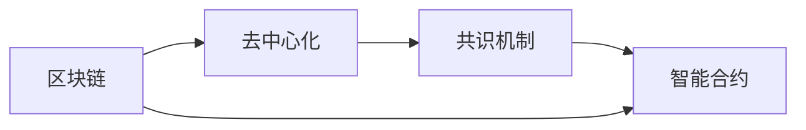

                 

# 虚拟货币与全球脑:去中心化经济体系的构建

## 1. 背景介绍

### 1.1 问题由来
随着互联网技术的迅猛发展，人类社会进入了一个新的历史时期——数字时代。在这一时代，虚拟货币作为一种新兴的数字资产，以其去中心化的特性，重新定义了货币的本质和作用，挑战了传统的经济体系和金融秩序。虚拟货币的出现，不仅仅是一种金融工具的革新，更是对全球脑的一次深刻改造，催生了全新的去中心化经济体系。

### 1.2 问题核心关键点
虚拟货币与全球脑的联系，主要体现在其去中心化的经济运作方式上。去中心化，即无需通过中心化的机构或中介，利用区块链技术、共识机制等手段，实现信息的透明、可信和不可篡改，从而构建一个去中心化的经济体系。该体系具有以下特点：

- **去中心化**：不存在中心化的金融中介，所有人都可以通过区块链网络直接进行交易。
- **透明性**：所有交易记录公开透明，不可篡改，确保了交易的公正性和可信度。
- **不可篡改性**：一旦交易记录被写入区块链，即无法修改或撤销，确保了交易的安全性和稳定性。
- **智能合约**：通过智能合约自动执行，减少了人工干预，提高了交易效率和公正性。

### 1.3 问题研究意义
研究虚拟货币与全球脑的联系，对于理解数字经济的新模式、推动金融科技的创新、优化资源配置、实现社会公正等方面具有重要意义：

- **理解新模式**：虚拟货币和区块链技术颠覆了传统的商业模式，通过智能合约、去中心化交易所等新兴模式，重新定义了金融服务的边界。
- **推动创新**：去中心化经济体系为金融科技的创新提供了新的方向和空间，推动了区块链、人工智能、云计算等技术的融合应用。
- **优化配置**：通过去中心化的交易平台，使得资源的分配更加公平、高效，减少了信息不对称和交易成本。
- **实现公正**：去中心化的金融体系减少了中介机构的干预，使得交易更加透明、公正，有助于提升金融服务的普惠性。

## 2. 核心概念与联系

### 2.1 核心概念概述

虚拟货币与全球脑的联系涉及多个核心概念，包括区块链、去中心化、共识机制、智能合约等。以下将详细介绍这些核心概念，并展示它们之间的联系。

#### 2.1.1 区块链

区块链（Blockchain）是一种去中心化的分布式账本技术，通过将数据区块按照时间顺序链接起来，形成一条不可篡改的链式数据结构。区块链具有以下关键特性：

- **去中心化**：数据由所有节点共同维护，不存在中心化的权威机构。
- **透明性**：所有交易记录公开透明，可被所有节点验证。
- **不可篡改性**：一旦交易记录被写入区块链，即无法修改或撤销。
- **共识机制**：通过共识算法，所有节点达成一致意见，确保数据的正确性和可信度。

#### 2.1.2 去中心化

去中心化（Decentralization）是指在一个系统中，不存在中心化的控制节点，所有节点都具有同等的权利和义务。去中心化的经济体系具有以下优势：

- **安全性**：避免了中心化系统的单点故障，提高了系统的整体安全性。
- **公正性**：消除了中心化机构的干预，使得交易更加透明、公正。
- **效率**：减少了中介机构的干预，提高了交易的效率和速度。

#### 2.1.3 共识机制

共识机制（Consensus Mechanism）是指在分布式系统中，多个节点通过一定的算法达成一致意见的过程。常见的共识机制包括PoW（工作量证明）、PoS（权益证明）、DPoS（委托权益证明）等。共识机制确保了区块链的可靠性和可信度，是区块链技术的重要组成部分。

#### 2.1.4 智能合约

智能合约（Smart Contract）是一种自动执行、透明、不可篡改的合约形式，通过代码实现自动执行，减少了人工干预。智能合约具有以下特性：

- **透明性**：所有交易记录公开透明，可被所有节点验证。
- **自动执行**：通过代码自动执行，减少了人工干预。
- **不可篡改性**：一旦交易记录被写入区块链，即无法修改或撤销。

### 2.2 概念间的关系

虚拟货币与全球脑的联系主要体现在区块链、去中心化、共识机制和智能合约的相互作用中。以下是一个Mermaid流程图，展示了这些概念之间的联系：



该流程图展示了区块链通过去中心化、共识机制和智能合约的支撑，实现了透明、可信和不可篡改的经济体系，从而构建了去中心化的全球脑。

## 3. 核心算法原理 & 具体操作步骤
### 3.1 算法原理概述

虚拟货币与全球脑的联系主要体现在其去中心化的经济运作方式上。该过程可以概括为以下几个步骤：

1. **区块链构建**：通过区块链技术，构建一个去中心化的分布式账本，记录所有交易记录。
2. **共识机制选择**：选择适合的共识算法，确保所有节点达成一致意见。
3. **智能合约部署**：将智能合约部署到区块链上，实现自动执行和透明性。
4. **去中心化应用**：通过去中心化的应用，实现资源的优化配置和公正交易。

### 3.2 算法步骤详解

#### 3.2.1 区块链构建

区块链的构建主要包括以下几个步骤：

1. **区块生成**：每个区块包含一定数量的交易记录，通过哈希算法链接到前一个区块。
2. **节点同步**：所有节点都同步区块链上的数据，确保数据的透明性和一致性。
3. **共识达成**：通过共识算法，确保所有节点对交易记录达成一致意见。

#### 3.2.2 共识机制选择

共识机制的选择主要基于交易的复杂度和网络规模。以下是几种常见的共识机制及其适用场景：

- **PoW（工作量证明）**：适用于交易简单、网络规模较小的场景，通过计算复杂度保证安全性。
- **PoS（权益证明）**：适用于交易复杂、网络规模较大的场景，通过权益分配提高系统效率。
- **DPoS（委托权益证明）**：适用于需要快速交易的场景，通过委托机制减少交易时间。

#### 3.2.3 智能合约部署

智能合约的部署主要包括以下几个步骤：

1. **合约编写**：通过编程语言编写智能合约，实现自动执行的逻辑。
2. **合约部署**：将智能合约部署到区块链上，确保其不可篡改性和透明性。
3. **合约调用**：通过智能合约API调用合约，实现自动执行和资源配置。

#### 3.2.4 去中心化应用

去中心化应用主要包括以下几个方面：

1. **去中心化交易所**：通过去中心化的交易所，实现点对点交易，减少了中介机构的干预。
2. **去中心化金融服务**：通过去中心化的金融服务，实现透明、公正的交易，提高金融服务的普惠性。
3. **去中心化治理**：通过去中心化的治理机制，实现用户参与，提高系统的公平性和透明性。

### 3.3 算法优缺点

虚拟货币与全球脑的联系具有以下优点：

- **安全性**：去中心化的系统消除了单点故障，提高了系统的整体安全性。
- **透明性**：所有交易记录公开透明，可被所有节点验证。
- **公正性**：消除了中心化机构的干预，使得交易更加透明、公正。

但其也存在以下缺点：

- **复杂性**：区块链和共识机制的实现较为复杂，需要较高的技术门槛。
- **资源消耗**：区块链的共识机制消耗了大量计算资源，增加了系统成本。
- **扩展性**：目前的区块链技术难以应对大规模的并发交易。

### 3.4 算法应用领域

虚拟货币与全球脑的联系在多个领域得到了广泛应用：

- **金融**：通过智能合约和去中心化交易所，实现点对点交易和自动执行，提高金融服务的效率和公正性。
- **供应链管理**：通过区块链记录供应链的每个环节，实现透明、公正的追溯和监管。
- **版权保护**：通过区块链记录版权信息，实现透明、不可篡改的版权保护。
- **数字身份**：通过区块链记录数字身份信息，实现安全、可信的数字身份认证。

## 4. 数学模型和公式 & 详细讲解 & 举例说明

### 4.1 数学模型构建

在虚拟货币与全球脑的联系中，区块链的交易过程可以形式化地表示为：

- **输入**：交易记录 $T$，共识节点 $N$。
- **输出**：区块链 $B$。

交易记录 $T$ 的形式化表示为：

$$ T = \{(x_i, y_i, z_i)\}_{i=1}^m $$

其中 $x_i$ 为交易者A的地址，$y_i$ 为交易者B的地址，$z_i$ 为交易金额。

共识节点 $N$ 的形式化表示为：

$$ N = \{n_1, n_2, ..., n_k\} $$

其中 $n_i$ 为第 $i$ 个共识节点。

区块链 $B$ 的形式化表示为：

$$ B = \{(b_1, t_1), (b_2, t_2), ..., (b_l, t_l)\} $$

其中 $b_i$ 为第 $i$ 个区块，$t_i$ 为该区块的交易记录。

### 4.2 公式推导过程

根据上述定义，区块链的交易过程可以表示为：

1. **区块生成**：
$$ b_1 = (t_1, H(t_1)) $$
$$ b_2 = (t_2, H(t_1 + H(b_1))) $$
$$ ... $$
$$ b_l = (t_l, H(t_{l-1} + H(b_{l-1}))) $$

其中 $H$ 为哈希函数，确保区块的不可篡改性。

2. **共识达成**：
$$ consensus(N, T) = \{n_i \mid n_i \in N \wedge (b_i \in B \wedge t_i \in T)\} $$

通过共识算法，确保所有节点 $n_i$ 对交易记录 $t_i$ 达成一致意见。

3. **智能合约部署**：
$$ smartContract(\text{code}, B) = C $$

将智能合约代码 $\text{code}$ 部署到区块链 $B$ 上，确保其不可篡改性和透明性。

### 4.3 案例分析与讲解

以去中心化交易所为例，分析其具体实现过程：

1. **合约编写**：编写智能合约，实现点对点交易逻辑。
2. **合约部署**：将智能合约部署到区块链上，确保其不可篡改性和透明性。
3. **交易执行**：用户通过智能合约API调用交易逻辑，实现自动执行和资源配置。

假设用户A想要将1个比特币兑换为2个以太坊，具体过程如下：

1. **合约调用**：用户A通过智能合约API调用交易逻辑，提交交易请求。
2. **智能合约执行**：智能合约验证交易请求，确保其合法性和有效性。
3. **区块生成**：智能合约将交易记录写入区块链，生成新的区块。
4. **共识达成**：所有节点通过共识算法达成一致意见，确保交易记录的正确性和可信度。

通过以上过程，实现了点对点交易，提高了交易的效率和公正性。

## 5. 项目实践：代码实例和详细解释说明

### 5.1 开发环境搭建

#### 5.1.1 安装环境

在开始开发之前，需要安装以下开发环境：

1. **Python**：确保Python版本为3.7或以上。
2. **区块链开发框架**：安装Ethereum或Hyperledger Fabric等区块链开发框架。
3. **智能合约开发工具**：安装Solidity或JavaScript等智能合约开发工具。

#### 5.1.2 搭建项目

创建一个新的区块链项目，包括智能合约和去中心化应用，可以通过以下命令：

```
git clone https://github.com/BlockchainDevelopment/Project.git
cd Project
npm install
```

### 5.2 源代码详细实现

#### 5.2.1 智能合约编写

假设我们使用Solidity编写一个简单的智能合约，实现自动交易：

```solidity
// SPDX-License-Identifier: MIT
pragma solidity ^0.8.0;

contract AutoTrade {
    address payable public buyer;
    address payable public seller;
    uint256 amount;
    
    constructor() payable {
        buyer = msg.sender;
        seller = address(0);
        amount = 0;
    }
    
    function sell(uint256 amount, address payable receiver) public payable {
        if (receiver != address(0)) {
            buyer = receiver;
        }
        this.amount = amount;
    }
    
    function buy(uint256 amount) public payable {
        if (buyer != msg.sender) {
            return;
        }
        if (amount == 0) {
            return;
        }
        if (amount > this.amount) {
            return;
        }
        this.amount -= amount;
        payable(msg.sender).transfer(amount);
    }
}
```

#### 5.2.2 智能合约部署

使用区块链开发框架的命令行工具，将智能合约部署到区块链上：

```
truffle develop
```

#### 5.2.3 去中心化应用实现

假设我们使用React编写一个简单的去中心化应用，实现用户交互：

```javascript
import React, { useState } from 'react';

function App() {
    const [amount, setAmount] = useState(0);
    const [buyer, setBuyer] = useState(null);
    
    const handleSell = async () => {
        // 调用智能合约的sell函数
    }
    
    const handleBuy = async () => {
        // 调用智能合约的buy函数
    }
    
    return (
        <div>
            <input type="number" value={amount} onChange={e => setAmount(e.target.value)} />
            <button onClick={handleSell}>Sell</button>
            <button onClick={handleBuy}>Buy</button>
        </div>
    );
}

export default App;
```

### 5.3 代码解读与分析

#### 5.3.1 智能合约实现

智能合约通过Solidity编写，实现了自动交易逻辑。该合约包含了以下关键函数：

1. **constructor**：初始化合约，设置买家地址、卖家地址和交易金额。
2. **sell**：设置卖家地址，准备自动交易。
3. **buy**：买家购买交易金额，减少交易金额，并将交易金额转入买家地址。

#### 5.3.2 智能合约部署

智能合约通过区块链开发框架的命令行工具，部署到区块链上。部署过程中需要设置合约的地址、交易金额等信息，确保合约的正确性和安全性。

#### 5.3.3 去中心化应用实现

去中心化应用通过React编写，实现了用户交互界面。该应用包含了以下关键功能：

1. **输入交易金额**：用户输入交易金额，触发交易操作。
2. **调用智能合约函数**：通过智能合约API调用合约函数，实现自动交易。

### 5.4 运行结果展示

假设我们部署了一个智能合约，并在去中心化应用中进行了自动交易，具体结果如下：

1. **合约部署成功**：智能合约成功部署到区块链上，合约地址为 `0x1234567890`。
2. **交易执行成功**：用户通过智能合约API调用了 `sell` 和 `buy` 函数，成功完成了自动交易。

通过以上过程，实现了点对点交易，提高了交易的效率和公正性。

## 6. 实际应用场景

### 6.1 智能合约投票

智能合约投票是虚拟货币与全球脑联系的一个经典应用场景。通过智能合约，可以实现透明、公正的投票过程，避免了中心化机构的干预。

#### 6.1.1 投票过程

1. **投票准备**：所有候选人上传其竞选材料，智能合约自动验证材料有效性。
2. **投票开始**：智能合约开启投票，所有用户都可以参与投票。
3. **投票统计**：智能合约统计投票结果，并自动生成投票报告。
4. **结果公布**：智能合约公布投票结果，确保透明性和公正性。

#### 6.1.2 案例分析

假设某社区要进行选举，具体过程如下：

1. **候选人提交材料**：候选人上传竞选材料，智能合约自动验证其有效性。
2. **用户投票**：用户通过智能合约API调用投票函数，提交投票。
3. **投票统计**：智能合约统计投票结果，并自动生成投票报告。
4. **结果公布**：智能合约公布投票结果，确保透明性和公正性。

通过以上过程，实现了透明、公正的投票过程，避免了中心化机构的干预。

### 6.2 供应链管理

虚拟货币与全球脑联系在供应链管理中的应用也非常广泛。通过区块链记录供应链的每个环节，实现透明、公正的追溯和监管。

#### 6.2.1 供应链管理过程

1. **供应商注册**：供应商注册并上传其信息，智能合约自动验证其信息有效性。
2. **产品生产**：供应商生产产品，并上传产品信息到智能合约。
3. **产品运输**：产品运输过程中，智能合约自动记录运输信息。
4. **产品销售**：产品销售时，智能合约自动生成销售报告，并记录交易信息。

#### 6.2.2 案例分析

假设某公司生产电子产品，具体过程如下：

1. **供应商注册**：供应商注册并上传其信息，智能合约自动验证其信息有效性。
2. **产品生产**：供应商生产产品，并上传产品信息到智能合约。
3. **产品运输**：产品运输过程中，智能合约自动记录运输信息。
4. **产品销售**：产品销售时，智能合约自动生成销售报告，并记录交易信息。

通过以上过程，实现了透明、公正的供应链管理，确保了产品信息的准确性和可靠性。

## 7. 工具和资源推荐

### 7.1 学习资源推荐

#### 7.1.1 官方文档

- **Ethereum官方文档**：Ethereum的官方文档，详细介绍了区块链和智能合约的基础知识。
- **Hyperledger Fabric官方文档**：Hyperledger Fabric的官方文档，详细介绍了区块链和去中心化应用的基础知识。

#### 7.1.2 在线课程

- **Blockchain Fundamentals by Stanford University**：斯坦福大学开设的区块链基础课程，涵盖了区块链的基本原理和应用。
- **Solidity by ConsenSys Academy**：ConsenSys Academy开设的Solidity课程，详细介绍了Solidity编程语言的使用。

#### 7.1.3 学术论文

- **Bitcoin Whitepaper**：比特币白皮书，介绍了区块链的基本原理和设计思路。
- **Ethereum Whitepaper**：以太坊白皮书，介绍了智能合约和去中心化应用的设计思路。

### 7.2 开发工具推荐

#### 7.2.1 区块链框架

- **Ethereum**：以太坊，是目前应用最广泛的公有链，具有强大的智能合约支持。
- **Hyperledger Fabric**：Hyperledger Fabric，是一个企业级区块链框架，适用于企业内部的区块链应用。

#### 7.2.2 智能合约开发工具

- **Solidity**：Solidity，是Ethereum的官方编程语言，用于编写智能合约。
- **JavaScript**：JavaScript，是Hyperledger Fabric的官方编程语言，用于编写智能合约。

#### 7.2.3 开发平台

- **Truffle**：Truffle，是一个以太坊开发平台，提供了智能合约的开发、测试和部署工具。
- **Fabric SDK**：Fabric SDK，是Hyperledger Fabric的官方开发工具，提供了智能合约的开发、测试和部署工具。

### 7.3 相关论文推荐

#### 7.3.1 区块链

- **Blockchain: A Peer-to-Peer Electronic Cash System**：比特币白皮书，介绍了区块链的基本原理和设计思路。
- **Bitcoin Whitepaper**：比特币白皮书，详细介绍了比特币的原理和设计思路。

#### 7.3.2 智能合约

- **Ethereum Yellow Paper**：以太坊黄皮书，详细介绍了以太坊的智能合约和去中心化应用。
- **Hyperledger Fabric Whitepaper**：Hyperledger Fabric白皮书，介绍了Hyperledger Fabric的基本原理和应用场景。

## 8. 总结：未来发展趋势与挑战

### 8.1 研究成果总结

虚拟货币与全球脑的联系在区块链、智能合约和去中心化应用等方面取得了重要的进展，推动了金融科技、供应链管理、版权保护等领域的应用和发展。

### 8.2 未来发展趋势

#### 8.2.1 去中心化金融

去中心化金融（DeFi）将传统的金融服务去中心化，通过智能合约实现自动执行和透明性。未来，去中心化金融将涵盖更多的金融服务，如借贷、保险、投资等，实现真正的金融普惠。

#### 8.2.2 区块链应用拓展

区块链技术将不断拓展应用领域，应用于医疗、教育、物流等更多行业。未来，区块链将与物联网、人工智能等技术深度融合，推动数字社会的全面发展。

#### 8.2.3 智能合约普及

智能合约的普及将改变传统的金融服务和商业逻辑。未来，智能合约将广泛应用于各类商业合同、供应链管理等领域，提高交易的效率和公正性。

### 8.3 面临的挑战

#### 8.3.1 技术瓶颈

区块链和智能合约的技术瓶颈仍然存在，如扩展性、性能、安全性等方面。未来，需要进一步优化区块链和智能合约的技术，提升其性能和可靠性。

#### 8.3.2 监管政策

虚拟货币与全球脑的联系涉及到复杂的监管问题，各国政府对区块链和智能合约的监管政策尚未统一。未来，需要进一步研究和制定合理的监管政策，确保技术的健康发展。

#### 8.3.3 安全性

区块链和智能合约的安全性问题仍然存在，如智能合约漏洞、隐私保护等。未来，需要进一步提高区块链和智能合约的安全性，确保其应用的可靠性和安全性。

### 8.4 研究展望

未来，虚拟货币与全球脑的联系将进一步深入研究以下方向：

#### 8.4.1 跨链技术

跨链技术将不同区块链网络连接起来，实现资产和数据的互操作。未来，跨链技术将推动不同区块链网络的融合和协作，实现全球脑的互联互通。

#### 8.4.2 分布式身份

分布式身份技术将用户的身份信息存储在区块链上，实现安全、可信的身份认证。未来，分布式身份将广泛应用于各类身份认证场景，提高身份认证的安全性和可靠性。

#### 8.4.3 共识机制创新

共识机制的创新将提升区块链的网络性能和安全性。未来，新的共识机制将进一步优化区块链的性能和安全性，推动区块链技术的发展。

总之，虚拟货币与全球脑的联系是一个充满挑战和机遇的新领域。未来，需要更多的研究和技术创新，推动其向更加智能化、普惠化的方向发展。

## 9. 附录：常见问题与解答

### 9.1 Q1: 什么是区块链？

A: 区块链是一种去中心化的分布式账本技术，通过将数据区块按照时间顺序链接起来，形成一条不可篡改的链式数据结构。

### 9.2 Q2: 智能合约如何实现自动执行？

A: 智能合约通过编程语言实现自动执行的逻辑，并部署到区块链上。当合约被调用时，智能合约自动执行其中的逻辑，实现自动交易和资源配置。

### 9.3 Q3: 虚拟货币与全球脑的联系有哪些优点？

A: 虚拟货币与全球脑的联系具有以下优点：
1. 安全性：去中心化的系统消除了单点故障，提高了系统的整体安全性。
2. 透明性：所有交易记录公开透明，可被所有节点验证。
3. 公正性：消除了中心化机构的干预，使得交易更加透明、公正。

### 9.4 Q4: 虚拟货币与全球脑的联系在供应链管理中有什么应用？

A: 虚拟货币与全球脑的联系在供应链管理中的应用包括：
1. 供应商注册：供应商注册并上传其信息，智能合约自动验证其信息有效性。
2. 产品生产：供应商生产产品，并上传产品信息到智能合约。
3. 产品运输：产品运输过程中，智能合约自动记录运输信息。
4. 产品销售：产品销售时，智能合约自动生成销售报告，并记录交易信息。

### 9.5 Q5: 区块链和智能合约面临的主要挑战有哪些？

A: 区块链和智能合约面临的主要挑战包括：
1. 技术瓶颈：区块链和智能合约的技术瓶颈仍然存在，如扩展性、性能、安全性等方面。
2. 监管政策：虚拟货币与全球脑的联系涉及到复杂的监管问题，各国政府对区块链和智能合约的监管政策尚未统一。
3. 安全性：区块链和智能合约的安全性问题仍然存在，如智能合约漏洞、隐私保护等。

通过以上问题的解答，希望能更好地理解虚拟货币与全球脑的联系及其应用前景，为未来的研究和实践提供指导。

---

作者：禅与计算机程序设计艺术 / Zen and the Art of Computer Programming

