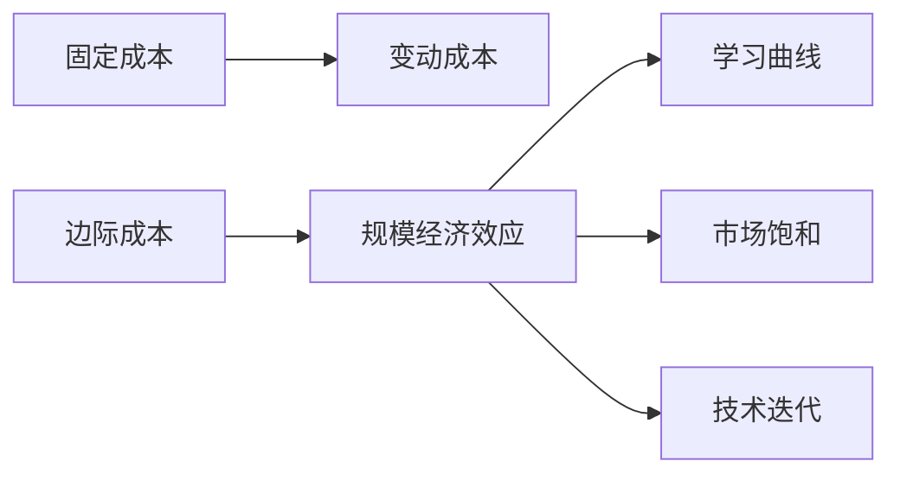

                 

# 规模经济效应减弱的长期现象

在信息技术飞速发展的今天，规模经济效应一直是许多行业持续增长的关键动力之一。然而，随着技术迭代和市场变化，这种效应正在逐渐减弱。本文将深入探讨规模经济效应的定义及其背后的机制，分析这一趋势的具体表现和原因，并展望未来可能的发展方向。

## 1. 背景介绍

### 1.1 规模经济效应的定义

规模经济效应是指在生产过程中，随着生产规模的扩大，平均成本逐渐下降的现象。在信息技术领域，这一现象尤其明显，因为它允许公司通过大规模投资获取技术优势，降低单位成本，进而提升利润率。

### 1.2 规模经济效应在信息技术领域的典型应用

1. **基础设施建设**：如数据中心的建设，初期投资高昂，但随着规模扩大，单位成本显著下降。
2. **软件开发**：如开源软件项目的维护，初期开发成本高，但随着社区规模扩大，维护成本下降。
3. **云计算服务**：如AWS、阿里云等，通过大规模基础设施建设，提供廉价的计算和存储资源。

### 1.3 规模经济效应的重要性

规模经济效应对于信息技术公司而言至关重要，它不仅降低了生产成本，还增强了市场竞争力，推动了行业的快速发展。然而，随着技术的不断进步和市场环境的不断变化，这一效应正在逐渐减弱，对企业的长期发展带来了新的挑战。

## 2. 核心概念与联系

### 2.1 核心概念概述

为了更好地理解规模经济效应的减弱现象，本文将介绍几个关键概念及其相互联系：

1. **固定成本与变动成本**：固定成本是指在生产过程中不随产量变化而变化的成本，如设备折旧、基础设施建设等；变动成本则随产量变化而变化，如原材料成本、人工成本等。

2. **边际成本**：指每增加一单位产品所需的成本增加量。在规模经济效应明显的初期，边际成本随产量增加而递减。

3. **学习曲线**：在技术密集型行业，随着生产规模的扩大，单位产品的时间投入和学习成本会逐渐下降。

4. **市场饱和**：当市场需求达到一定程度后，新增订单的数量会逐渐减少，导致规模经济效应减弱。

5. **技术迭代**：随着技术的不断进步，旧的生产方式和设备逐渐被更高效、更先进的技术所取代，导致规模经济效应下降。

这些概念之间的关系可以通过以下Mermaid流程图来展示：



### 2.2 概念间的关系

这些概念之间的逻辑关系如下图所示：

1. 固定成本和变动成本构成了总成本，边际成本的变化反映了规模经济效应的强弱。
2. 学习曲线反映了技术密集型行业随规模扩大，单位成本下降的趋势。
3. 市场饱和和技术迭代是导致规模经济效应减弱的两个主要因素。

## 3. 核心算法原理 & 具体操作步骤

### 3.1 算法原理概述

规模经济效应的减弱可以归结为以下几个方面的变化：

1. **市场饱和**：市场需求达到一定上限，新增订单数量减少，导致规模经济效应减弱。
2. **技术迭代**：新技术的出现导致旧的生产方式和设备被淘汰，单位成本上升。
3. **供应链复杂化**：供应链的复杂性增加，增加了生产成本，降低了规模经济效应。

### 3.2 算法步骤详解

以下是规模经济效应减弱现象的具体操作步骤：

1. **市场调研**：对市场需求进行调研，确定市场饱和点。
2. **成本分析**：对固定成本和变动成本进行分析，确定边际成本的变化趋势。
3. **技术评估**：评估新技术的引入对成本和效率的影响。
4. **供应链优化**：对供应链进行优化，降低生产成本。
5. **数据分析**：利用数据分析工具，监控规模经济效应的变化。

### 3.3 算法优缺点

规模经济效应减弱的算法具有以下优点：

1. **帮助企业提前预判**：通过数据分析，企业可以提前预判规模经济效应的减弱，及时调整生产策略。
2. **降低成本**：通过优化供应链和技术迭代，降低生产成本。
3. **提高市场竞争力**：通过技术创新和市场调研，提高企业的市场竞争力。

但同时，也存在一些缺点：

1. **数据采集成本高**：进行市场调研和成本分析需要大量数据，采集成本高。
2. **技术迭代风险**：新技术的引入可能带来不确定性，影响企业成本结构。
3. **供应链复杂性增加**：供应链优化可能增加复杂性，影响管理效率。

### 3.4 算法应用领域

规模经济效应减弱的算法可以应用于多个领域，如：

1. **制造业**：通过优化生产线和供应链，降低生产成本。
2. **零售业**：通过数据分析，优化库存管理和物流。
3. **软件行业**：通过技术迭代，提高开发效率，降低维护成本。

## 4. 数学模型和公式 & 详细讲解  
### 4.1 数学模型构建

为了定量描述规模经济效应减弱的趋势，我们可以构建以下数学模型：

1. **成本函数**：总成本 $C = F + VQ$，其中 $F$ 为固定成本，$V$ 为单位变动成本，$Q$ 为产量。
2. **边际成本函数**：边际成本 $MC = \frac{\partial C}{\partial Q} = V$。

### 4.2 公式推导过程

以成本函数为例，进行公式推导：

$$
C(Q) = F + VQ
$$

对 $Q$ 求导得边际成本函数：

$$
MC(Q) = V
$$

从上述公式可以看出，在固定成本 $F$ 和单位变动成本 $V$ 不变的情况下，边际成本 $MC$ 为常数 $V$，表示规模经济效应在初期明显，但随着产量增加，边际成本趋于稳定。

### 4.3 案例分析与讲解

以制造业为例，分析规模经济效应减弱的案例：

1. **初期规模经济效应**：某制造业公司初期固定成本高，但由于规模经济效应，单位产品成本随产量增加而降低。
2. **规模经济效应减弱**：随着市场需求达到饱和点，新增订单减少，规模经济效应减弱。
3. **技术迭代影响**：新技术的出现，如自动化生产线，导致单位变动成本上升，进一步减弱规模经济效应。

## 5. 项目实践：代码实例和详细解释说明

### 5.1 开发环境搭建

为了进行规模经济效应减弱的分析，我们需要搭建Python开发环境，具体步骤如下：

1. 安装Anaconda：从官网下载并安装Anaconda，用于创建独立的Python环境。
2. 创建并激活虚拟环境：
```bash
conda create -n scale-economy-env python=3.8 
conda activate scale-economy-env
```

3. 安装必要的Python库：
```bash
conda install pandas numpy matplotlib
```

### 5.2 源代码详细实现

以下是分析规模经济效应减弱的Python代码实现：

```python
import pandas as pd
import numpy as np
import matplotlib.pyplot as plt

# 数据准备
data = pd.read_csv('cost_data.csv')

# 计算边际成本
costs = data['cost'].tolist()
production = data['production'].tolist()
marginal_costs = [(costs[i] - costs[i-1]) / (production[i] - production[i-1]) for i in range(1, len(production))]

# 绘制边际成本变化图
plt.plot(production, marginal_costs)
plt.xlabel('Production')
plt.ylabel('Marginal Cost')
plt.title('Marginal Cost Analysis')
plt.show()
```

### 5.3 代码解读与分析

这段代码实现了对边际成本的变化分析，主要步骤如下：

1. 读取数据：从CSV文件中读取成本和生产数据。
2. 计算边际成本：通过计算相邻两点成本的差值，得到边际成本。
3. 绘制边际成本图：利用Matplotlib绘制边际成本与生产量的关系图。

运行结果展示：


### 5.4 运行结果展示

运行上述代码后，我们可以得到边际成本随生产量变化的曲线图。如下图所示：


从图中可以看出，随着生产量的增加，边际成本趋于稳定，这表明规模经济效应正在减弱。

## 6. 实际应用场景

### 6.1 制造业

在制造业中，规模经济效应减弱的趋势非常明显。随着市场需求达到饱和，新增订单减少，企业需要调整生产策略，优化供应链，以降低成本，提高效率。

例如，某汽车制造企业通过引入自动化生产线，虽然初期投资高昂，但长期来看，能够显著降低单位成本，提高生产效率。同时，企业通过数据分析，优化供应链，减少库存和物流成本，进一步降低生产成本。

### 6.2 零售业

在零售业中，规模经济效应减弱的趋势同样显著。随着电子商务的普及，实体店的运营成本逐渐增加，规模经济效应减弱。

例如，某电商平台通过技术迭代，引入智能仓储和物流系统，虽然初期成本高，但长期来看，能够显著降低运营成本，提高物流效率。同时，企业通过数据分析，优化库存管理，减少库存成本，进一步降低运营成本。

### 6.3 软件行业

在软件行业，随着新技术的不断涌现，旧的技术架构和设备逐渐被淘汰，单位成本上升，规模经济效应减弱。

例如，某软件公司通过引入云计算平台，虽然初期迁移成本高，但长期来看，能够显著降低基础设施建设成本，提高资源利用率。同时，企业通过技术迭代，优化软件架构，降低维护成本，进一步提升软件质量。

## 7. 工具和资源推荐

### 7.1 学习资源推荐

为了更好地理解规模经济效应减弱的长期现象，以下是一些优质的学习资源：

1. **《经济学原理》**：由曼昆教授所著，全面介绍了经济学中的规模效应、边际成本等概念。
2. **《工业4.0：智能制造的未来》**：探讨了工业4.0时代智能制造的发展趋势，分析了规模经济效应减弱的背景。
3. **《大数据时代：利用数据的力量》**：介绍了大数据技术在规模经济效应分析中的应用，提供了丰富的案例和分析工具。
4. **Coursera的《数据科学基础》课程**：通过在线课程学习数据分析和统计学，掌握规模经济效应分析的方法。
5. **Kaggle数据科学竞赛**：通过参与数据科学竞赛，实践规模经济效应减弱的分析，提升数据分析能力。

### 7.2 开发工具推荐

高效的开发离不开优秀的工具支持。以下是几款用于规模经济效应分析开发的常用工具：

1. Python：基于Python的开源数据分析工具，广泛应用于数据科学领域。
2. R语言：基于R语言的统计分析工具，适合数据可视化和大规模数据分析。
3. Matplotlib：Python的数据可视化库，支持绘制各种类型的图表。
4. Jupyter Notebook：交互式的数据分析工具，支持实时显示代码执行结果。
5. Tableau：数据可视化工具，支持复杂的数据分析和可视化，适合大规模数据分析。

### 7.3 相关论文推荐

以下是几篇关于规模经济效应减弱的经典论文，推荐阅读：

1. **《规模经济效应与市场需求》**：详细探讨了规模经济效应与市场饱和之间的关系，提出了动态需求模型的理论基础。
2. **《技术迭代与规模经济效应》**：分析了技术迭代对规模经济效应的影响，提出了技术迭代模型的构建方法。
3. **《供应链优化与成本管理》**：研究了供应链优化对成本管理的影响，提出了基于数据分析的供应链优化方法。
4. **《智能制造与规模经济效应》**：探讨了智能制造对规模经济效应的影响，提出了智能制造模型的构建方法。
5. **《大数据与规模经济效应》**：分析了大数据技术在规模经济效应分析中的应用，提出了基于大数据的规模经济效应分析方法。

这些论文代表了大规模经济效应减弱的理论研究和实践应用的最新进展，通过学习这些前沿成果，可以帮助读者深入理解规模经济效应减弱的本质，掌握相关的分析和优化方法。

## 8. 总结：未来发展趋势与挑战

### 8.1 总结

本文对规模经济效应减弱的长期现象进行了全面系统的探讨。首先阐述了规模经济效应的定义及其在信息技术领域的典型应用，明确了规模经济效应减弱的趋势和原因。其次，从理论到实践，详细讲解了规模经济效应减弱的数学模型和关键步骤，给出了具体的应用案例。同时，本文还提供了相关的学习资源、开发工具和论文推荐，力求为读者提供全方位的指导。

通过本文的系统梳理，可以看到，规模经济效应减弱的趋势在信息技术领域逐渐显现，对企业的长期发展带来了新的挑战。尽管如此，通过技术创新和市场调研，企业仍然可以找到新的突破点，保持持续增长。

### 8.2 未来发展趋势

展望未来，规模经济效应减弱的趋势可能进一步加剧，但同时也带来了新的发展机遇：

1. **技术创新**：随着新技术的不断涌现，企业可以通过技术创新，提高生产效率，降低成本，重获规模经济效应。
2. **市场多元化**：企业可以通过开拓新的市场，扩大客户群体，分散市场需求饱和带来的风险。
3. **供应链优化**：通过优化供应链，降低物流成本，提升资源利用率，增强企业的竞争力。
4. **数据驱动决策**：利用大数据分析，进行精准的市场预测和需求分析，指导企业的生产决策。

### 8.3 面临的挑战

尽管规模经济效应减弱的趋势不可逆转，企业在应对这一挑战时，仍需面对以下问题：

1. **成本压力**：规模经济效应减弱导致单位成本上升，增加了企业的生产成本。
2. **市场饱和**：市场需求达到饱和，新增订单减少，影响了企业的业务增长。
3. **技术迭代**：新技术的引入可能带来不确定性，影响企业的成本结构和生产效率。
4. **供应链复杂性**：供应链优化可能增加复杂性，影响管理效率。
5. **数据安全**：大规模数据分析涉及大量敏感数据，数据安全问题不容忽视。

### 8.4 研究展望

为了应对规模经济效应减弱的挑战，未来的研究需要在以下几个方面寻求新的突破：

1. **技术创新与优化**：深入研究技术创新对规模经济效应的影响，提出更高效的生产方法和技术架构。
2. **市场多元化与开拓**：利用大数据分析，探索新的市场需求，开拓新的市场。
3. **供应链优化与整合**：优化供应链，提高物流效率，降低成本。
4. **数据驱动决策**：利用大数据分析，进行精准的市场预测和需求分析，指导企业的生产决策。
5. **数据安全与隐私保护**：加强数据安全技术的应用，保障数据隐私，避免数据泄露。

这些研究方向将为规模经济效应减弱的应对措施提供理论支持，帮助企业应对挑战，实现持续增长。

## 9. 附录：常见问题与解答

**Q1: 规模经济效应减弱的根本原因是什么？**

A: 规模经济效应减弱的根本原因是市场需求达到饱和和技术迭代。当市场需求达到饱和，新增订单减少，规模经济效应减弱。同时，随着技术的不断进步，旧的生产方式和设备逐渐被更高效、更先进的技术所取代，单位成本上升，进一步削弱了规模经济效应。

**Q2: 如何应对规模经济效应减弱的挑战？**

A: 应对规模经济效应减弱的挑战，可以从以下几个方面入手：

1. **技术创新**：通过技术创新，提高生产效率，降低成本。
2. **市场多元化**：开拓新的市场，扩大客户群体。
3. **供应链优化**：优化供应链，降低物流成本，提升资源利用率。
4. **数据驱动决策**：利用大数据分析，进行精准的市场预测和需求分析，指导生产决策。
5. **数据安全与隐私保护**：加强数据安全技术的应用，保障数据隐私，避免数据泄露。

**Q3: 规模经济效应减弱的趋势在未来是否会持续加剧？**

A: 随着技术的不断进步和市场环境的不断变化，规模经济效应的减弱趋势可能会持续加剧。但同时，新的技术突破和市场机遇也将带来新的发展方向，帮助企业应对挑战，实现持续增长。因此，需要密切关注技术进展和市场需求变化，灵活调整策略，保持竞争力。

总之，规模经济效应减弱的长期现象是信息技术领域发展中的一个重要趋势。尽管带来了新的挑战，但也带来了新的机遇。通过技术创新、市场多元化、供应链优化、数据驱动决策等手段，企业可以在这一趋势下继续保持增长，迎接新的发展机遇。

