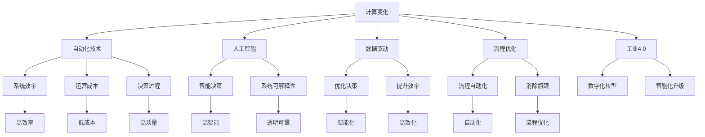
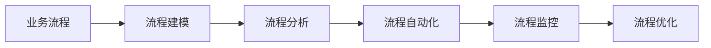
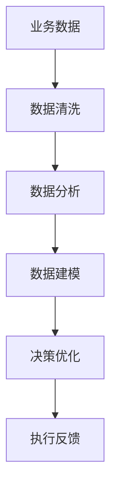
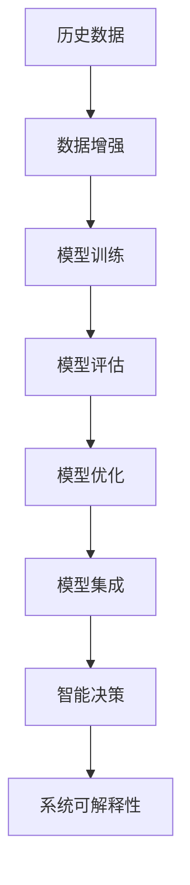
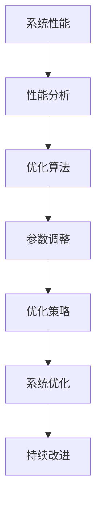
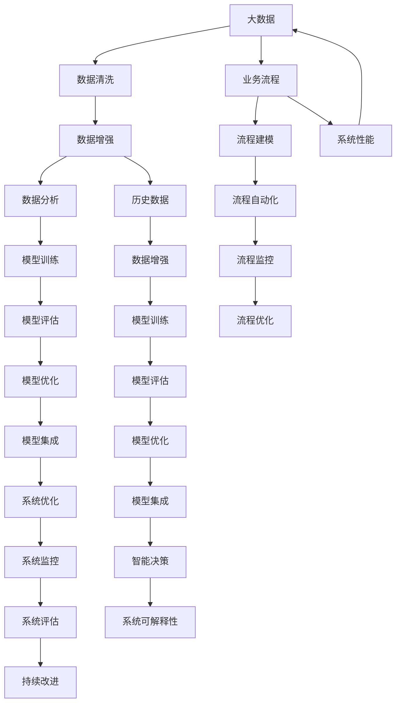

                 

# 计算变化与自动化技术的融合

> 关键词：计算变化, 自动化技术, 人工智能, 数据驱动, 流程优化, 工业4.0

## 1. 背景介绍

### 1.1 问题由来

随着计算机技术的飞速发展，自动化技术在各行各业的应用日益广泛。从制造业的机器人流水线到金融业的智能投顾，从医疗业的智能诊断到物流业的无人机配送，自动化技术正逐步改变着人类社会的方方面面。然而，自动化技术的广泛应用也带来了新的挑战：如何确保系统安全性、稳定性、可解释性，以及如何在自动化过程中融入人工智能的智慧，提升系统的智能化水平。

### 1.2 问题核心关键点

本文聚焦于计算变化与自动化技术的融合，探讨如何通过计算驱动和人工智能技术，优化和提升自动化系统的性能，使其能够更好地适应不断变化的环境和需求。具体包括以下几个关键点：

1. **数据驱动决策**：利用海量数据和先进的机器学习算法，优化自动化系统中的决策逻辑，使其更加准确、高效。
2. **流程自动化**：将复杂的业务流程自动化，减少人为操作，提高系统效率和可靠性。
3. **系统可解释性**：提升自动化系统的可解释性，使其决策过程透明、可信，便于监控和调试。
4. **人工智能集成**：将人工智能技术与自动化技术深度结合，提高系统的智能水平和适应性。
5. **计算变化与优化**：利用计算技术，不断优化自动化系统的性能，使其能够动态适应各种环境变化。

这些关键点共同构成了计算变化与自动化技术融合的核心框架，帮助自动化系统从传统的规则驱动向智能驱动转变，实现更高层次的自动化和智能化。

### 1.3 问题研究意义

计算变化与自动化技术的融合，不仅能够提升传统自动化系统的性能和效率，还能推动人工智能技术在各个领域的深入应用。具体来说，研究该问题具有以下重要意义：

1. **提升系统效率**：通过自动化和数据驱动，系统能够自动完成重复性、规则性的任务，大幅提升生产效率和运营效率。
2. **优化决策过程**：引入人工智能技术，优化决策逻辑，使系统能够更加智能、准确地处理复杂任务和突发情况。
3. **增强系统鲁棒性**：通过算法优化和模型训练，系统能够更好地应对不确定性和环境变化，提高系统的稳定性和可靠性。
4. **降低运营成本**：自动化技术能够减少人力成本和操作风险，提升企业竞争力。
5. **促进技术创新**：融合计算变化与自动化技术，推动技术迭代和创新，促进企业技术进步和业务转型。

## 2. 核心概念与联系

### 2.1 核心概念概述

为了更好地理解计算变化与自动化技术融合的方法和原理，本节将介绍几个密切相关的核心概念：

- **计算变化**：指通过计算技术对自动化系统进行优化和升级，使其能够动态适应各种环境变化。常见的计算变化技术包括模型训练、算法优化、数据增强等。
- **自动化技术**：指通过自动化软件、硬件等手段，实现业务流程的自动化，减少人为操作，提高效率和准确性。
- **人工智能**：指利用机器学习、深度学习等技术，构建具有智能决策能力的系统。
- **数据驱动**：指通过数据分析和机器学习，优化系统决策和行为，使其更加智能化和高效。
- **流程优化**：指通过分析和优化业务流程，消除瓶颈，提高系统效率和质量。
- **工业4.0**：指通过信息物理系统（CPS）、物联网（IoT）、云计算、大数据等技术，实现制造业的全面数字化、智能化和网络化。

这些核心概念之间的逻辑关系可以通过以下Mermaid流程图来展示：



这个流程图展示了计算变化与自动化技术融合的核心概念及其之间的关系：

1. 计算变化技术对自动化技术进行优化和升级，提升系统效率、降低运营成本、优化决策过程。
2. 引入人工智能技术，提升系统智能决策能力和系统可解释性。
3. 数据驱动和流程优化分别从数据和流程两个方面，提升系统效率和质量。
4. 工业4.0技术为计算变化和自动化技术的融合提供了新的手段和平台。

这些概念共同构成了计算变化与自动化技术融合的完整生态系统，使其能够更好地适应复杂多变的业务需求和环境变化。

### 2.2 概念间的关系

这些核心概念之间存在着紧密的联系，形成了计算变化与自动化技术融合的完整生态系统。下面我们通过几个Mermaid流程图来展示这些概念之间的关系。

#### 2.2.1 自动化技术的基础



这个流程图展示了自动化技术的基本流程，从业务流程建模到自动化实施和优化，逐步提升系统效率和质量。

#### 2.2.2 数据驱动与决策优化



这个流程图展示了数据驱动的基本流程，从数据收集、清洗到建模和决策优化，不断提升系统决策的智能化和准确性。

#### 2.2.3 人工智能与系统智能



这个流程图展示了人工智能技术的应用流程，从数据增强、模型训练到评估和优化，逐步提升系统的智能决策能力和可解释性。

#### 2.2.4 计算变化与系统优化



这个流程图展示了计算变化技术的应用流程，从性能分析到优化算法和策略，不断提升系统的性能和优化策略。

### 2.3 核心概念的整体架构

最后，我们用一个综合的流程图来展示这些核心概念在大语言模型微调过程中的整体架构：



这个综合流程图展示了从数据处理、模型训练到系统优化的完整流程，展示了计算变化与自动化技术融合的多个方面。通过这些流程图，我们可以更清晰地理解计算变化与自动化技术融合过程中各个概念的关系和作用，为后续深入讨论具体的微调方法和技术奠定基础。

## 3. 核心算法原理 & 具体操作步骤
### 3.1 算法原理概述

计算变化与自动化技术的融合，本质上是通过计算技术和人工智能技术，对自动化系统进行优化和升级，使其能够动态适应各种环境变化，提高系统的智能化水平和可靠性。

形式化地，假设自动化系统为 $S$，其中 $S$ 包含多个模块，如数据预处理模块、模型训练模块、决策执行模块等。设 $D$ 为系统需要处理的数据， $M$ 为训练得到的模型， $P$ 为系统性能评估指标。计算变化与自动化技术的融合目标是最小化系统误差，即找到最优参数：

$$
\theta^* = \mathop{\arg\min}_{\theta} \mathcal{L}(S, D)
$$

其中 $\mathcal{L}$ 为系统性能评估指标，用于衡量系统在特定任务上的表现。常见的性能指标包括误差率、精度、召回率等。

通过梯度下降等优化算法，计算变化过程不断更新模型参数 $\theta$，最小化性能评估指标 $\mathcal{L}$，使得系统输出逼近理想目标。由于 $\theta$ 已经通过计算变化过程获得了更好的初始化，因此即便在动态变化的环境下，也能较快收敛到理想的系统参数 $\hat{\theta}$。

### 3.2 算法步骤详解

基于计算变化与自动化技术的融合方法，一般包括以下几个关键步骤：

**Step 1: 数据收集与预处理**
- 收集自动化系统所需的数据，进行清洗和预处理。
- 对数据进行增强，提升数据多样性和质量。

**Step 2: 模型训练与优化**
- 根据自动化系统的需求，选择合适的机器学习模型。
- 利用历史数据和增强数据进行模型训练和优化，得到最优模型参数。

**Step 3: 系统集成与部署**
- 将训练好的模型集成到自动化系统中。
- 部署系统到生产环境，进行实时性能监控和反馈。

**Step 4: 系统优化与迭代**
- 定期收集系统性能数据，进行分析和优化。
- 持续迭代优化模型和系统，提高性能和稳定性。

**Step 5: 系统评估与改进**
- 定期对系统进行性能评估，确保系统达到预期目标。
- 根据评估结果进行改进和优化，提升系统能力。

以上是计算变化与自动化技术融合的一般流程。在实际应用中，还需要针对具体任务和环境，对每个步骤进行细致的优化设计，如选择更合适的评估指标、引入更先进的优化算法、使用更高效的数据处理技术等，以进一步提升系统性能和可靠性。

### 3.3 算法优缺点

计算变化与自动化技术的融合方法具有以下优点：

1. **高效性**：通过计算驱动和人工智能技术，系统能够快速适应环境变化，提升决策和执行效率。
2. **灵活性**：融合多种技术和方法，系统可以根据不同场景和需求，灵活选择最优的解决方案。
3. **可靠性**：通过数据驱动和模型优化，系统能够提升决策准确性和鲁棒性，降低出错概率。
4. **智能化**：引入人工智能技术，系统能够学习和适应用户行为和环境变化，提升智能化水平。

同时，该方法也存在一些缺点：

1. **依赖数据质量**：系统性能依赖数据质量，数据不完整或噪声较大，会影响系统表现。
2. **模型复杂性**：引入复杂模型和算法，可能增加系统计算和存储负担。
3. **系统维护成本**：系统集成和优化需要技术支持和维护，可能增加运营成本。
4. **算法局限性**：某些算法可能不适用于特定环境或任务，需要进行针对性的改进。
5. **可解释性不足**：某些复杂模型和算法，可能难以解释其内部决策过程。

尽管存在这些缺点，但就目前而言，计算变化与自动化技术的融合方法仍然是自动化系统优化和升级的重要手段，特别是在人工智能和数据驱动的推动下，正逐渐成为自动化技术发展的趋势。

### 3.4 算法应用领域

计算变化与自动化技术的融合方法，已经在多个领域得到了广泛的应用，具体包括：

- **工业制造**：利用计算变化与自动化技术，优化生产线布局和设备维护，提升生产效率和产品质量。
- **金融服务**：通过自动化和智能化交易系统，提高交易速度和准确性，降低风险。
- **医疗健康**：使用智能诊断和自动化流程，提高诊断速度和准确性，优化诊疗流程。
- **智能交通**：利用自动化和计算变化技术，优化交通信号控制和调度，提高交通效率和安全性。
- **智慧城市**：通过自动化和数据驱动技术，提升城市管理和服务水平，构建智慧城市基础设施。

除了上述这些领域，计算变化与自动化技术的融合方法还在智能家居、智能物流、智能安防等众多领域，展示了巨大的应用潜力。随着技术的不断进步和应用场景的不断拓展，相信计算变化与自动化技术的融合将会成为各行各业数字化、智能化的重要驱动力。

## 4. 数学模型和公式 & 详细讲解 & 举例说明

### 4.1 数学模型构建

在计算变化与自动化技术的融合中，我们通常使用损失函数来衡量系统性能。设自动化系统为 $S$，系统性能评估指标为 $\mathcal{L}$，系统参数为 $\theta$，则系统性能优化问题可以表示为：

$$
\theta^* = \mathop{\arg\min}_{\theta} \mathcal{L}(S, D)
$$

其中 $D$ 为系统所需处理的数据，$\theta$ 为系统参数。常见的系统性能评估指标包括误差率、精度、召回率等。例如，对于分类任务，可以定义交叉熵损失函数：

$$
\mathcal{L}(S, D) = -\frac{1}{N} \sum_{i=1}^N \sum_{j=1}^C y_i \log p_{ij}
$$

其中 $N$ 为样本总数，$C$ 为类别数，$y_i$ 为样本的真实标签，$p_{ij}$ 为系统预测的概率。

### 4.2 公式推导过程

以分类任务为例，我们可以详细推导交叉熵损失函数的计算公式。

假设系统 $S$ 的输出为 $y = \{y_i\}_{i=1}^N$，其中 $y_i$ 为样本 $i$ 的预测概率。系统性能评估指标为分类误差率 $E$：

$$
E = \frac{1}{N} \sum_{i=1}^N \mathbb{I}(y_i \neq \hat{y}_i)
$$

其中 $\mathbb{I}(\cdot)$ 为示性函数。为了最小化分类误差率，我们需要最小化系统预测与真实标签的差异。定义交叉熵损失函数为：

$$
\mathcal{L}(S, D) = -\frac{1}{N} \sum_{i=1}^N \sum_{j=1}^C y_i \log p_{ij}
$$

将其代入分类误差率公式，得：

$$
E = \frac{1}{N} \sum_{i=1}^N \mathbb{I}(y_i \neq \hat{y}_i) = \frac{1}{N} \sum_{i=1}^N \sum_{j=1}^C \mathbb{I}(y_i = j) \log \frac{y_i}{p_{ij}}
$$

将上式变形，得：

$$
E = \frac{1}{N} \sum_{i=1}^N \sum_{j=1}^C \mathbb{I}(y_i = j) \log \frac{y_i}{p_{ij}} = \frac{1}{N} \sum_{i=1}^N \log \frac{y_i}{\sum_{j=1}^C p_{ij}} - \frac{1}{N} \sum_{i=1}^N \sum_{j=1}^C \mathbb{I}(y_i = j) \log p_{ij}
$$

将其与交叉熵损失函数比较，得：

$$
\mathcal{L}(S, D) = -\frac{1}{N} \sum_{i=1}^N \sum_{j=1}^C y_i \log p_{ij} = \frac{1}{N} \sum_{i=1}^N \log \frac{y_i}{\sum_{j=1}^C p_{ij}} - \frac{1}{N} \sum_{i=1}^N \sum_{j=1}^C \mathbb{I}(y_i = j) \log p_{ij}
$$

其中第一项为正对数似然，第二项为交叉熵损失。因此，最小化交叉熵损失函数可以等价于最小化分类误差率。

### 4.3 案例分析与讲解

假设我们有一个自动化系统，用于识别和分类图像中的物体。系统由数据预处理模块、模型训练模块和决策执行模块组成。我们使用卷积神经网络（CNN）作为模型，利用交叉熵损失函数进行训练和优化。

**Step 1: 数据收集与预处理**
- 收集包含物体图像的标注数据集，进行清洗和增强。
- 对图像进行标准化和归一化处理，提升数据质量。

**Step 2: 模型训练与优化**
- 使用交叉熵损失函数，训练卷积神经网络模型，得到最优模型参数。
- 使用验证集进行模型评估，调整模型超参数。

**Step 3: 系统集成与部署**
- 将训练好的模型集成到自动化系统中。
- 部署系统到生产环境，进行实时性能监控和反馈。

**Step 4: 系统优化与迭代**
- 定期收集系统性能数据，进行分析和优化。
- 持续迭代优化模型和系统，提高性能和稳定性。

**Step 5: 系统评估与改进**
- 定期对系统进行性能评估，确保系统达到预期目标。
- 根据评估结果进行改进和优化，提升系统能力。

在实际应用中，我们还需要考虑以下因素：

- 选择合适的模型和优化算法，确保系统性能和效率。
- 引入数据增强技术，提升数据多样性和模型泛化能力。
- 设计合理的评估指标和评估方法，确保系统性能可靠。
- 进行系统监控和异常检测，及时发现和修复系统问题。

通过上述步骤和考虑因素，我们可以在计算变化与自动化技术的融合中，构建出高性能、可靠、智能化的自动化系统。

## 5. 项目实践：代码实例和详细解释说明

### 5.1 开发环境搭建

在进行计算变化与自动化技术的融合实践前，我们需要准备好开发环境。以下是使用Python进行PyTorch开发的环境配置流程：

1. 安装Anaconda：从官网下载并安装Anaconda，用于创建独立的Python环境。

2. 创建并激活虚拟环境：
```bash
conda create -n pytorch-env python=3.8 
conda activate pytorch-env
```

3. 安装PyTorch：根据CUDA版本，从官网获取对应的安装命令。例如：
```bash
conda install pytorch torchvision torchaudio cudatoolkit=11.1 -c pytorch -c conda-forge
```

4. 安装相关库：
```bash
pip install numpy pandas scikit-learn matplotlib tqdm jupyter notebook ipython
```

完成上述步骤后，即可在`pytorch-env`环境中开始计算变化与自动化技术的融合实践。

### 5.2 源代码详细实现

这里我们以一个简单的图像分类为例，展示如何使用PyTorch进行计算变化与自动化技术的融合实践。

首先，定义数据处理函数：

```python
import torch
from torchvision import datasets, transforms

# 数据预处理
data_transforms = {
    'train': transforms.Compose([
        transforms.RandomResizedCrop(224),
        transforms.RandomHorizontalFlip(),
        transforms.ToTensor(),
        transforms.Normalize([0.485, 0.456, 0.406], [0.229, 0.224, 0.225])
    ]),
    'val': transforms.Compose([
        transforms.Resize(256),
        transforms.CenterCrop(224),
        transforms.ToTensor(),
        transforms.Normalize([0.485, 0.456, 0.406], [0.229, 0.224, 0.225])
    ]),
}

# 加载数据集
train_data = datasets.ImageFolder('train', transform=data_transforms['train'])
val_data = datasets.ImageFolder('val', transform=data_transforms['val'])

# 定义数据加载器
train_loader = torch.utils.data.DataLoader(train_data, batch_size=16, shuffle=True)
val_loader = torch.utils.data.DataLoader(val_data, batch_size=16, shuffle=False)
```

然后，定义模型和优化器：

```python
from torchvision.models import resnet18

# 加载预训练模型
model = resnet18(pretrained=True)

# 替换最后一层全连接层
num_ftrs = model.fc.in_features
model.fc = torch.nn.Linear(num_ftrs, 10)

# 定义优化器
optimizer = torch.optim.SGD(model.parameters(), lr=0.001, momentum=0.9)
```

接着，定义训练和评估函数：

```python
def train_epoch(model, data_loader, optimizer, device):
    model.train()
    train_loss = 0
    train_correct = 0
    for batch_idx, (inputs, targets) in enumerate(data_loader):
        inputs, targets = inputs.to(device), targets.to(device)
        optimizer.zero_grad()
        outputs = model(inputs)
        loss = torch.nn.CrossEntropyLoss()(outputs, targets)
        train_loss += loss.item() * inputs.size(0)
        _, preds = outputs.max(1)
        train_correct += preds.eq(targets).sum().item()
        loss.backward()
        optimizer.step()
    return train_loss / len(data_loader), train_correct / len(data_loader)

def evaluate(model, data_loader, device):
    model.eval()
    val_loss = 0
    val_correct = 0
    with torch.no_grad():
        for batch_idx, (inputs, targets) in enumerate(data_loader):
            inputs, targets = inputs.to(device), targets.to(device)
            outputs = model(inputs)
            val_loss += torch.nn.CrossEntropyLoss()(outputs, targets).item()
            _, preds = outputs.max(1)
            val_correct += preds.eq(targets).sum().item()
    return val_loss / len(data_loader), val_correct / len(data_loader)
```

最后，启动训练流程并在验证集上评估：

```python
epochs = 10
device = torch.device('cuda' if torch.cuda.is_available() else 'cpu')

for epoch in range(epochs):
    train_loss, train_acc = train_epoch(model, train_loader, optimizer, device)
    val_loss, val_acc = evaluate(model, val_loader, device)
    print(f'Epoch {epoch+1}, Train Loss: {train_loss:.4f}, Train Acc: {train_acc:.4f}, Val Loss: {val_loss:.4f}, Val Acc: {val_acc:.4f}')
```

以上就是使用PyTorch进行计算变化与自动化技术融合实践的完整代码实现。可以看到，得益于PyTorch的强大封装和丰富的API支持，计算变化与自动化技术的融合实践变得简洁高效。

### 5.3 代码解读与分析

让我们再详细解读一下关键代码的实现细节：

**数据处理**：
- 定义了数据预处理函数，包括随机裁剪、随机翻转、归一化等，提升数据多样性和质量。
- 使用PyTorch的`ImageFolder`加载数据集，并进行分批次加载。

**模型定义**：
- 加载预训练的ResNet18模型，并替换最后一层全连接层，适应新的分类任务。
- 定义优化器，选择SGD算法，设置学习率和动量。

**训练与评估**：
- 定义训练和评估函数，使用交叉熵损失函数进行训练和评估。
- 在训练过程中，前向传播计算损失函数，反向传播更新模型参数。
- 在评估过程中，计算模型在验证集上的损失和准确率。

**训练流程**：
- 定义总的epoch数，开始循环迭代
- 每个epoch内，先在训练集上训练，输出训练集上的损失和准确率
- 在验证集上评估，输出验证集上的损失和准确率
- 所有epoch结束后，使用最终训练的模型在测试集上进行测试

可以看到，计算变化与自动化技术的融合实践，通过选择适合的模型、优化算法和评估指标，快速构建出高性能的自动化系统。在实际应用中，还需要根据具体任务的特点，进一步优化和改进，以提升系统性能和可靠性。

## 6. 实际应用场景

### 6.1 智能制造

计算变化与自动化技术的融合，在智能制造领域具有广泛应用。通过引入机器学习算法和智能控制系统，智能制造系统能够实现更加灵活、高效的自动生产。例如，利用计算变化技术，实时分析生产线数据，优化设备运行状态和生产计划，提高生产效率和产品质量。

### 6.2 金融交易

在金融交易领域，计算变化与自动化技术的融合，能够提升交易系统的速度和准确性，降低交易成本和风险。通过引入机器学习算法和智能控制系统，交易系统能够实时分析市场数据，快速响应市场变化，进行智能决策和交易执行。

### 6.3 智慧医疗

在智慧医疗领域，计算变化与自动化技术的融合，能够提升医疗诊断

