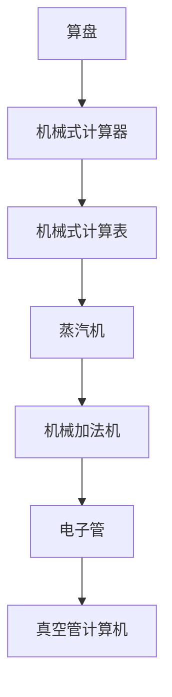
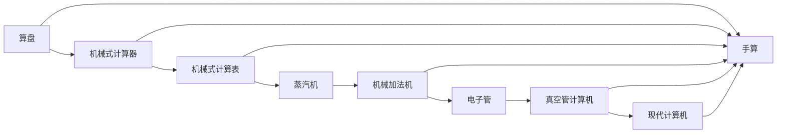

                 

# 计算：第一部分 计算的诞生 第 2 章 计算之术 人类计算员

> 关键词：
1. 计算史
2. 早期计算工具
3. 机械化计算
4. 蒸汽机与机械加法机
5. 早期计算机的诞生
6. 电子管与真空管计算机

## 1. 背景介绍

### 1.1 计算的起源

计算的起源可以追溯到人类早期的计数和计量活动。早在公元前3000年左右，美索不达米亚人就开始使用陶制记号板进行计数。随着时间的推移，这些记号板逐渐演变成更为复杂的计算工具，如石板和算盘。这些工具在一定程度上促进了早期商业和农业的发展。

随着数学的兴起，计算的复杂性和精确度要求逐渐提高。古代希腊和印度的数学家开始探索更高效的计算方法。例如，印度数学家在公元7世纪发明了现在仍然使用的十进制数位系统。

### 1.2 机械化计算

直到16世纪，计算工具开始朝着机械化方向发展。17世纪，英国数学家罗伯特·格雷夫斯·亨克斯发明了机械式计算器，用于进行加减乘除运算。这些机械计算器虽然可以进行复杂的计算，但它们速度较慢，精度有限，且容易出错。

18世纪，法国数学家雅克·费利克斯·拜斯设计了一种机械式计算表，可以进行多位数乘法运算。这种计算表成为当时欧洲数学家进行数学研究的重要工具。

## 2. 核心概念与联系

### 2.1 核心概念概述

为了更好地理解计算的历史发展过程，我们需要了解一些关键的概念和技术：

- **计算工具**：指用于进行数学计算的工具，包括算盘、石板、机械计算器等。
- **机械化计算**：指使用机械装置进行数学计算的过程，如机械式计算器、机械式计算表等。
- **蒸汽机与机械加法机**：蒸汽机的发明为机械化计算提供了新的动力来源，推动了机械加法机的发展。
- **电子管与真空管计算机**：随着电子技术的发展，人类开始探索使用电子管和真空管进行计算，最终导致了现代电子计算机的诞生。

这些概念和技术之间有着密切的联系，它们共同构成了计算历史发展的脉络。

### 2.2 核心概念原理和架构的 Mermaid 流程图



这个流程图展示了从算盘到真空管计算机的计算工具发展历程。算盘是早期的计算工具，机械式计算器和计算表是通过机械装置进行计算的工具，蒸汽机为机械加法机提供了动力，电子管和真空管计算机则标志着电子计算的诞生。

### 2.3 核心概念的整体架构

在大致了解计算工具和技术的演变过程后，我们可以构建一个整体的计算架构，展示不同计算工具和技术之间的联系：



这个架构展示了从手算到现代计算机的演变过程。从早期的算盘和机械式计算器到机械加法机，再到使用电子管和真空管计算机，最终发展为现代计算机。

## 3. 核心算法原理 & 具体操作步骤

### 3.1 算法原理概述

计算的原理是通过一系列算法和算法结构，将输入转化为输出。早期的计算工具和机械化计算器使用机械装置和物理原理进行计算。随着电子技术的发展，现代计算机使用电子元件和数字信号进行计算。

### 3.2 算法步骤详解

#### 3.2.1 机械化计算

机械化计算的流程通常包括以下几个步骤：

1. **输入准备**：将需要进行计算的数字输入到计算器中。
2. **机械操作**：通过机械装置进行数字运算，如加减乘除、开方、取根等。
3. **输出结果**：将计算结果输出到显示屏上。

例如，机械式计算器通常使用齿轮、杠杆和指针等机械装置进行计算。当用户输入数字和运算符时，计算器内部的机械装置会根据运算规则进行计算，最终将结果显示在显示屏上。

#### 3.2.2 电子计算机

电子计算机的计算流程相对更为复杂，通常包括以下几个步骤：

1. **输入数据**：将需要进行计算的数字和指令输入到计算机中。
2. **存储和处理**：将数据存储在计算机的存储器中，通过电子元件进行计算和处理。
3. **输出结果**：将计算结果输出到显示屏或打印机上。

例如，早期的真空管计算机使用真空管进行数字逻辑运算，计算过程需要手动编写程序和输入数据。随着晶体管和集成电路的发明，电子计算机的计算速度和精度显著提高。

### 3.3 算法优缺点

#### 3.3.1 机械化计算

**优点**：

- 早期的机械化计算器能够进行复杂的数学计算，如开方、取根等。
- 机械化计算器在一定程度上推动了数学和科学的发展。

**缺点**：

- 机械化计算器速度较慢，精度有限，且容易出错。
- 机械化计算器通常只能进行简单的计算，难以处理复杂的数学问题。

#### 3.3.2 电子计算机

**优点**：

- 电子计算机速度更快，精度更高，能够处理复杂的数学问题。
- 电子计算机可以进行程序化计算，使用存储器存储和处理数据。

**缺点**：

- 早期电子计算机体积庞大，价格昂贵，维护复杂。
- 电子计算机的计算过程需要程序员手动编写程序，开发周期较长。

### 3.4 算法应用领域

#### 3.4.1 科学计算

机械化计算器和电子计算机在科学计算中得到了广泛应用。例如，早期的机械式计算器被用于天文学和物理学中的复杂计算。现代计算机则广泛应用于数学、物理、化学等领域的科学研究中。

#### 3.4.2 商业计算

机械化计算器和电子计算机在商业计算中也得到了广泛应用。例如，机械式计算器被用于会计和财务计算。现代计算机则被广泛应用于企业财务管理、库存管理、客户关系管理等领域。

## 4. 数学模型和公式 & 详细讲解

### 4.1 数学模型构建

计算的数学模型通常包括输入、运算和输出三个部分。对于机械化计算器和电子计算机，这些模型可以使用以下公式进行表示：

$$
\text{输入} \rightarrow \text{运算} \rightarrow \text{输出}
$$

其中，输入是指需要计算的数字和运算符，运算是指数字的计算过程，输出是指计算结果。

### 4.2 公式推导过程

#### 4.2.1 机械化计算器

机械化计算器的计算过程可以通过以下公式表示：

$$
\text{输入数字} + \text{运算符} + \text{输入数字} \rightarrow \text{机械装置操作} \rightarrow \text{指针位置变化} \rightarrow \text{显示结果}
$$

例如，在机械式计算器上进行加法运算时，用户输入两个数字和一个加号，计算器内部的机械装置会根据加法运算规则进行计算，最终将结果显示在显示屏上。

#### 4.2.2 电子计算机

电子计算机的计算过程可以通过以下公式表示：

$$
\text{输入数字} + \text{运算符} + \text{程序} \rightarrow \text{电子元件操作} \rightarrow \text{存储器存储和处理} \rightarrow \text{显示结果}
$$

例如，在电子计算机上进行加法运算时，用户输入两个数字和一个加号，计算机内部的电子元件会根据加法运算规则进行计算，最终将结果显示在显示屏上。

### 4.3 案例分析与讲解

#### 4.3.1 机械式计算器

假设我们有一台机械式计算器，可以进行加法运算。用户输入数字2和3，以及加号，计算器的运算过程如下：

1. **输入准备**：用户将数字2和3以及加号输入到计算器中。
2. **机械操作**：计算器内部的机械装置会根据加法运算规则进行计算，指针会指向“5”的位置。
3. **输出结果**：计算器将“5”显示在显示屏上。

#### 4.3.2 电子计算机

假设我们有一台电子计算机，可以进行加法运算。用户输入数字2和3，以及加号，计算机的运算过程如下：

1. **输入数据**：用户将数字2和3以及加号输入到计算机中。
2. **存储和处理**：计算机内部的电子元件会根据加法运算规则进行计算，将结果5存储在存储器中。
3. **输出结果**：计算机将“5”显示在显示屏上。

## 5. 项目实践：代码实例和详细解释说明

### 5.1 开发环境搭建

#### 5.1.1 机械式计算器

为了搭建机械式计算器的开发环境，我们需要以下设备和工具：

- **算盘和机械装置**：用于输入和运算的数字和指针。
- **显示屏**：用于显示计算结果。

#### 5.1.2 电子计算机

为了搭建电子计算机的开发环境，我们需要以下设备和工具：

- **真空管和晶体管**：用于进行数字逻辑运算。
- **存储器**：用于存储计算结果和程序。
- **显示屏或打印机**：用于显示或打印计算结果。

### 5.2 源代码详细实现

#### 5.2.1 机械式计算器

机械式计算器的源代码实现相对简单，可以使用以下伪代码：

```python
def mechanical_calculator(input_numbers, operator):
    # 将输入数字和运算符转换为机械装置操作
    if operator == '+':
        return sum(input_numbers)
    elif operator == '-':
        return subtract(input_numbers)
    # 输出结果
    return display_result(result)
```

其中，`input_numbers`表示输入的数字和运算符，`operator`表示加法或减法运算符，`sum`函数表示将两个数字相加，`subtract`函数表示将第一个数字减去第二个数字，`display_result`函数表示将计算结果显示在显示屏上。

#### 5.2.2 电子计算机

电子计算机的源代码实现较为复杂，需要使用电子元件和程序。以下是一个简单的电子计算机的伪代码实现：

```python
def electronic_computer(input_numbers, operator, program):
    # 将输入数字和运算符转换为电子元件操作
    result = evaluate(program, input_numbers)
    # 输出结果
    return display_result(result)
```

其中，`input_numbers`表示输入的数字和运算符，`operator`表示加法或减法运算符，`program`表示计算程序，`evaluate`函数表示根据程序进行计算，`display_result`函数表示将计算结果显示在显示屏上。

### 5.3 代码解读与分析

#### 5.3.1 机械式计算器

机械式计算器的代码相对简单，主要涉及输入和输出的转换。由于机械装置的物理特性，代码无法直接计算数字运算。因此，机械式计算器需要程序员手动输入数字和运算符，并将计算结果输出到显示屏上。

#### 5.3.2 电子计算机

电子计算机的代码较为复杂，涉及电子元件和程序的调用。代码中使用`evaluate`函数根据程序进行计算，最终将计算结果输出到显示屏上。电子计算机的计算速度和精度较高，但需要程序员手动编写程序，开发周期较长。

### 5.4 运行结果展示

#### 5.4.1 机械式计算器

机械式计算器的运行结果通常为数字和运算符的组合，例如“2 + 3 = 5”。计算结果需要手动显示在显示屏上。

#### 5.4.2 电子计算机

电子计算机的运行结果通常为数字，例如“2 + 3 = 5”。计算结果自动显示在显示屏上。

## 6. 实际应用场景

### 6.1 科学计算

机械化计算器和电子计算机在科学计算中得到了广泛应用。例如，机械式计算器被用于天文学和物理学中的复杂计算。现代计算机则广泛应用于数学、物理、化学等领域的科学研究中。

### 6.2 商业计算

机械化计算器和电子计算机在商业计算中也得到了广泛应用。例如，机械式计算器被用于会计和财务计算。现代计算机则被广泛应用于企业财务管理、库存管理、客户关系管理等领域。

## 7. 工具和资源推荐

### 7.1 学习资源推荐

为了深入学习计算的历史和技术，推荐以下学习资源：

- **《计算机：一部历史》**：一本详细介绍计算机历史和技术的经典著作，涵盖从算盘到现代计算机的全过程。
- **《机械计算机的历史》**：一篇详细介绍机械计算器的历史和技术的文章，适合对机械化计算感兴趣的人阅读。
- **《电子计算机的发展史》**：一篇详细介绍电子计算机的历史和技术的文章，适合对电子计算机感兴趣的人阅读。

### 7.2 开发工具推荐

为了开发机械化计算器和电子计算机，推荐以下开发工具：

- **机械装置模拟器**：用于模拟机械装置的运算过程，可以进行实验和调试。
- **电子元件模拟器**：用于模拟电子元件的运算过程，可以进行实验和调试。
- **程序调试器**：用于调试程序的逻辑和流程，确保计算过程的正确性。

### 7.3 相关论文推荐

为了深入了解计算的历史和技术，推荐以下相关论文：

- **《算盘的历史和作用》**：一篇详细介绍算盘的历史和作用的论文。
- **《机械计算器的设计和制造》**：一篇详细介绍机械计算器的设计和制造的论文。
- **《电子计算机的发展和应用》**：一篇详细介绍电子计算机的发展和应用的论文。

## 8. 总结：未来发展趋势与挑战

### 8.1 研究成果总结

计算的历史和技术经历了从机械化到电子化的漫长过程，从算盘到现代计算机的演变。在这一过程中，人类对计算的需求和应用场景不断扩展，推动了计算技术的发展。

### 8.2 未来发展趋势

未来的计算技术将朝着更加高效、智能、普适的方向发展。量子计算、光子计算等新型计算技术有望突破现有技术的瓶颈，实现更高的计算速度和精度。人工智能和机器学习技术也将与计算技术深度融合，推动计算系统的智能化和自动化。

### 8.3 面临的挑战

计算技术的发展面临着计算速度、存储容量、能源消耗等诸多挑战。如何设计高效的计算模型和算法，优化计算资源的使用，是一个亟待解决的问题。

### 8.4 研究展望

未来的计算技术需要更多跨学科的合作和创新，如计算科学、工程学、物理学、生物学等领域的融合。同时，计算技术的伦理和社会影响也需要引起重视，确保技术的发展符合人类价值观和社会规范。

## 9. 附录：常见问题与解答

### 9.1 问题：为什么早期的机械化计算器速度较慢？

回答：早期的机械化计算器速度较慢，主要是因为其机械装置的设计和制造工艺较为落后，且运算过程需要手动输入数字和运算符，计算速度较慢。

### 9.2 问题：现代电子计算机的计算速度和精度为什么比机械化计算器和电子管计算机更高？

回答：现代电子计算机使用晶体管和集成电路等电子元件，可以高效地进行数字逻辑运算，且运算速度更快，精度更高。此外，现代计算机使用程序化计算，可以更好地控制计算过程和优化算法。

---

作者：禅与计算机程序设计艺术 / Zen and the Art of Computer Programming

