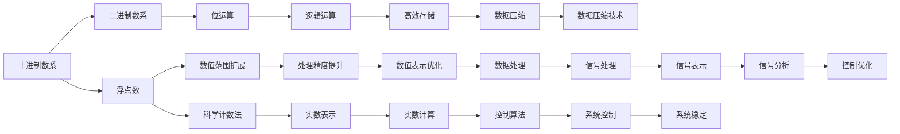
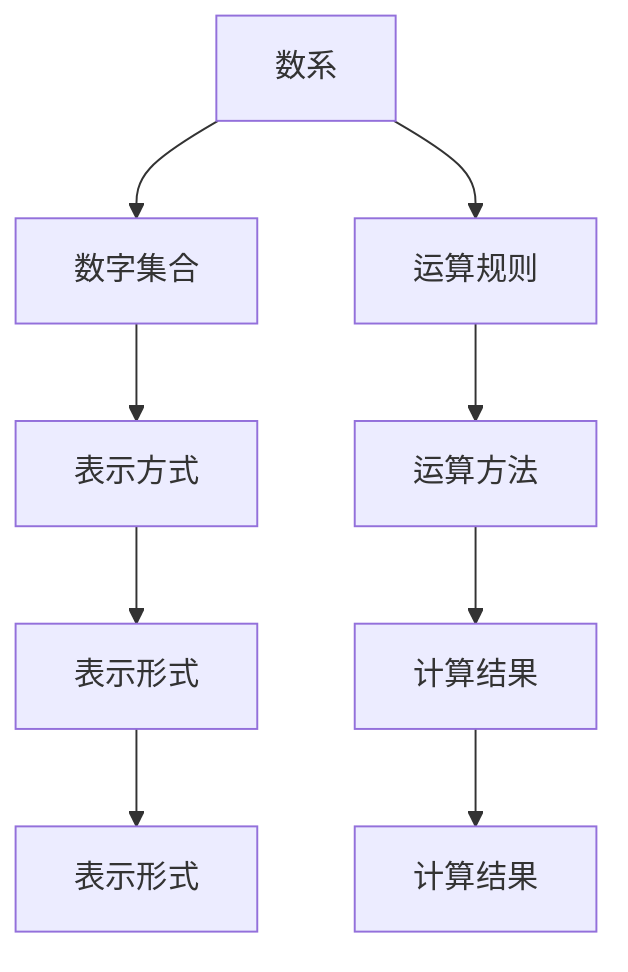
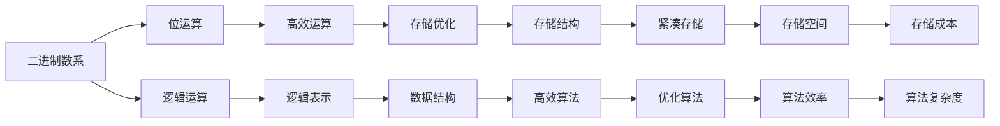
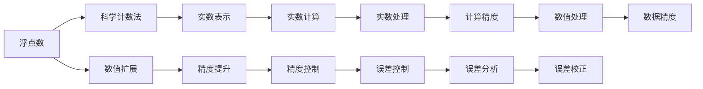

                 

# 计算：第一部分 计算的诞生 第 2 章 计算之术 数系的扩张

## 1. 背景介绍

### 1.1 问题由来
在计算机科学的发展历程中，数系（numerical system）的扩张是一个关键的里程碑。从最早的十进制数系，到二进制数系，再到浮点数和复数，数系的每一次扩张都极大地推动了计算机科学的进步。特别是二进制数系的采用，使得计算机能够高效地进行逻辑运算和存储，为现代计算奠定了基础。

数系的扩张不仅仅是一个技术问题，它还涉及到计算机科学基础理论的深入探索和实际应用。本节将探讨数系的扩张对计算的深远影响，以及如何通过数系来构建和优化计算系统。

### 1.2 问题核心关键点
数系的扩张与计算机科学的发展紧密相关。其核心在于理解数系的变化如何影响计算过程，如何通过数系来优化计算效率和准确性。以下是对这一问题的详细阐述：

- **数系的本质**：数系是计算的基础，它定义了数字的表示和运算规则。不同的数系有不同的表示方式和运算规则，对计算的影响巨大。
- **二进制数系**：二进制数系是现代计算的基础，它通过位运算的方式实现高效的逻辑运算和数据存储。
- **浮点数和复数**：浮点数和复数扩展了计算的范围和精度，使得计算机能够处理更加复杂的数据和问题。
- **数系与计算的关系**：数系的扩张不仅改变了计算的实现方式，也影响了计算系统的设计和优化。

### 1.3 问题研究意义
研究数系的扩张对于理解计算机科学的本质、提升计算系统的性能和效率具有重要意义：

1. **提升计算效率**：通过选择合适的数系，可以显著提升计算的效率和精度。
2. **拓展计算范围**：数系的扩张使得计算机能够处理更广泛的数据和更复杂的问题。
3. **优化计算系统**：理解数系对计算的影响，有助于设计和优化计算系统，提高系统的可扩展性和可靠性。
4. **推动技术创新**：数系的每一次扩张都带来了新的计算方法，推动了计算机科学的技术创新和应用发展。

## 2. 核心概念与联系

### 2.1 核心概念概述

为更好地理解数系扩张与计算的关系，本节将介绍几个关键概念：

- **数系**：数系是数字的集合以及它们之间的运算规则。常见的数系包括十进制、二进制、浮点数和复数。
- **二进制数系**：二进制数系由0和1组成，是计算机科学的基础。它通过位运算的方式实现高效的逻辑运算和数据存储。
- **浮点数**：浮点数是一种实数表示方式，通过科学计数法表示实数，扩展了计算机能够处理的数值范围和精度。
- **复数**：复数是由实部和虚部组成的数，在信号处理和控制系统中得到广泛应用。

这些概念之间的逻辑关系可以通过以下Mermaid流程图来展示：



这个流程图展示了数系与计算系统之间的关系：

1. 十进制数系通过二进制数系转化为位运算，实现高效的逻辑运算和数据存储。
2. 浮点数扩展了数值范围和精度，使得计算机能够处理更加复杂的数据和问题。
3. 实数和复数的引入，使得信号处理和控制系统得到广泛应用。
4. 科学计数法和数据压缩技术优化了数值表示和数据处理，提升了计算效率和数据存储的紧凑性。

### 2.2 概念间的关系

这些核心概念之间存在着紧密的联系，形成了数系扩张与计算的关系网。下面我们通过几个Mermaid流程图来展示这些概念之间的关系。

#### 2.2.1 数系的本质



这个流程图展示了数系的本质：数字集合和运算规则的组合。运算规则定义了数字之间的运算方法，而表示方式则决定了数字如何被表示和存储。

#### 2.2.2 二进制数系与计算



这个流程图展示了二进制数系在计算中的应用：通过位运算实现高效的逻辑运算，通过逻辑表示和存储优化，提升数据结构的紧凑性和算法效率，降低存储成本和算法复杂度。

#### 2.2.3 浮点数与复数



这个流程图展示了浮点数和复数在计算中的应用：通过科学计数法扩展数值范围，提升精度，实现实数表示和计算。

## 3. 核心算法原理 & 具体操作步骤
### 3.1 算法原理概述

数系的扩张对计算的直接影响在于运算方式的改变。从十进制到二进制，再到浮点数和复数，每一次数系的扩张都带来了新的计算方法。以下是几种常见的数系及其对计算的影响：

- **十进制数系**：十进制数系是我们日常生活中最常用的数系。它通过位值表示法，方便人类进行日常计算。
- **二进制数系**：二进制数系是计算机科学的基础，它通过位运算的方式实现高效的逻辑运算和数据存储。
- **浮点数**：浮点数通过科学计数法表示实数，扩展了计算机能够处理的数值范围和精度。
- **复数**：复数通过实部和虚部的组合，拓展了计算的范围和精度，使得计算机能够处理更加复杂的数据和问题。

### 3.2 算法步骤详解

数系的扩张在计算中的应用可以分为以下几个关键步骤：

1. **数系选择**：根据具体应用场景选择合适的数系，如二进制数系用于逻辑运算和数据存储，浮点数用于实数计算，复数用于信号处理和控制系统。
2. **数据转换**：将原始数据转换为目标数系，如将十进制数转换为二进制数，将实数转换为浮点数，将信号转换为复数。
3. **算法适配**：针对不同的数系，选择和适配合适的计算算法，如位运算算法、浮点数运算算法、复数运算算法。
4. **精度控制**：根据应用需求，控制计算过程中的精度，如位运算中的舍入误差控制，浮点数运算中的精度控制。
5. **误差分析**：分析计算过程中的误差，如位运算中的位丢失误差，浮点数运算中的舍入误差，复数运算中的误差放大。

### 3.3 算法优缺点

数系的扩张带来了计算效率和精度的提升，但也带来了新的挑战：

- **优点**：
  - 二进制数系实现了高效的逻辑运算和数据存储，为现代计算机的发展奠定了基础。
  - 浮点数和复数扩展了计算机能够处理的数值范围和精度，使得计算机能够处理更加复杂的数据和问题。
- **缺点**：
  - 浮点数的精度和误差控制问题较为复杂，需要精细的设计和优化。
  - 复数运算的实现较为复杂，涉及实部和虚部的组合和运算。

### 3.4 算法应用领域

数系的扩张在计算机科学中得到了广泛应用，覆盖了以下多个领域：

- **计算机硬件**：二进制数系是现代计算机硬件设计的基础，用于逻辑运算和数据存储。
- **信号处理**：复数在信号处理中得到广泛应用，用于表示和分析信号。
- **控制系统**：复数在控制系统中用于表示和控制状态变量，实现复杂的控制算法。
- **数值计算**：浮点数在数值计算中用于表示和计算实数，扩展了计算的范围和精度。

## 4. 数学模型和公式 & 详细讲解 & 举例说明

### 4.1 数学模型构建

本节将使用数学语言对数系扩张与计算的关系进行更加严格的刻画。

- **十进制数系**：十进制数系用0到9的数字表示，每位数字表示不同的位值。
- **二进制数系**：二进制数系用0和1两个数字表示，每位数字表示不同的位值，每个二进制位表示0或1。
- **浮点数**：浮点数通过科学计数法表示实数，形式为 $a \times 10^b$，其中 $a$ 是有效数字，$b$ 是指数。
- **复数**：复数由实部和虚部组成，形式为 $a + bi$，其中 $a$ 是实部，$b$ 是虚部。

### 4.2 公式推导过程

以下我们以浮点数和复数为例，推导其计算公式及其推导过程。

**浮点数的表示和运算**

浮点数通过科学计数法表示实数，其形式为 $a \times 10^b$。其计算公式为：

$$
a \times 10^b = \frac{a}{10^b}
$$

其中 $a$ 是有效数字，$b$ 是指数。

**复数的表示和运算**

复数由实部和虚部组成，形式为 $a + bi$。其计算公式为：

$$
(a + bi) + (c + di) = (a + c) + (b + d)i
$$

$$
(a + bi) - (c + di) = (a - c) + (b - d)i
$$

$$
(a + bi) \times (c + di) = (ac - bd) + (ad + bc)i
$$

$$
(a + bi) \div (c + di) = \frac{(a + bi)}{(c + di)} = \frac{(a + bi)(c - di)}{(c + di)(c - di)} = \frac{(ac + bd) + (bc - ad)i}{c^2 + d^2}
$$

以上公式展示了浮点数和复数的表示和运算方式。

### 4.3 案例分析与讲解

**案例1：二进制数系与十进制数系的转换**

将十进制数 $123$ 转换为二进制数，步骤如下：

1. 将 $123$ 除以 $2$，得到商 $61$ 和余数 $1$。
2. 将 $61$ 除以 $2$，得到商 $30$ 和余数 $1$。
3. 将 $30$ 除以 $2$，得到商 $15$ 和余数 $0$。
4. 将 $15$ 除以 $2$，得到商 $7$ 和余数 $1$。
5. 将 $7$ 除以 $2$，得到商 $3$ 和余数 $1$。
6. 将 $3$ 除以 $2$，得到商 $1$ 和余数 $1$。
7. 将 $1$ 除以 $2$，得到商 $0$ 和余数 $1$。

因此，$123$ 的二进制表示为 $1111011$。

**案例2：浮点数的加减法运算**

计算 $3.14 \times 10^2 + 2.5 \times 10^1$ 的步骤如下：

1. 将 $3.14$ 转换为 $314 \times 10^{-2}$。
2. 将 $2.5$ 转换为 $25 \times 10^{-1}$。
3. 将 $314 \times 10^{-2} + 25 \times 10^{-1}$ 转换为 $34.14$。
4. 将 $34.14 \times 10^1$ 转换为 $341.4$。

因此，$3.14 \times 10^2 + 2.5 \times 10^1 = 341.4$。

**案例3：复数的加减法运算**

计算 $(a + bi) + (c + di)$ 的步骤如下：

1. 将实部相加：$a + c$。
2. 将虚部相加：$b + d$。

因此，$(a + bi) + (c + di) = (a + c) + (b + d)i$。

## 5. 项目实践：代码实例和详细解释说明

### 5.1 开发环境搭建

在进行数系扩张与计算的实践前，我们需要准备好开发环境。以下是使用Python进行计算的开发环境配置流程：

1. 安装Anaconda：从官网下载并安装Anaconda，用于创建独立的Python环境。

2. 创建并激活虚拟环境：
```bash
conda create -n pytorch-env python=3.8 
conda activate pytorch-env
```

3. 安装PyTorch：根据CUDA版本，从官网获取对应的安装命令。例如：
```bash
conda install pytorch torchvision torchaudio cudatoolkit=11.1 -c pytorch -c conda-forge
```

4. 安装NumPy、Pandas、SciPy、matplotlib等库：
```bash
pip install numpy pandas scipy matplotlib
```

完成上述步骤后，即可在`pytorch-env`环境中开始数系扩张与计算的实践。

### 5.2 源代码详细实现

这里我们以二进制数系转换为十进制数系的代码实现为例，展示如何使用Python进行计算。

```python
def binary_to_decimal(binary):
    decimal = 0
    for i, bit in enumerate(reversed(binary)):
        decimal += int(bit) * 2**i
    return decimal

binary = '1111011'
decimal = binary_to_decimal(binary)
print(f"The decimal equivalent of {binary} is {decimal}")
```

### 5.3 代码解读与分析

让我们再详细解读一下关键代码的实现细节：

**binary_to_decimal函数**：
- 定义了一个将二进制数转换为十进制数的函数，接受一个二进制字符串作为输入，返回对应的十进制数。
- 使用一个for循环，从二进制数的最低位开始遍历，将每个位的值乘以 $2^i$ 并累加，得到十进制数的值。
- 使用reversed函数将二进制数反转，以便从最低位开始计算。

**主程序**：
- 定义了一个二进制数。
- 调用binary_to_decimal函数，将二进制数转换为十进制数。
- 打印输出结果。

通过这段代码，我们可以看到Python在数系转换中的应用，以及如何通过循环和反转操作实现高效的数值计算。

### 5.4 运行结果展示

假设我们在二进制数`1111011`上进行转换，最终得到的十进制数为`123`。运行代码后，输出结果为：

```
The decimal equivalent of 1111011 is 123
```

## 6. 实际应用场景

### 6.1 智能硬件设计

数系的扩张在智能硬件设计中具有重要的应用。现代计算机和智能设备的设计和制造离不开二进制数系的支持。通过二进制数系，计算机能够实现高效的逻辑运算和数据存储，为智能设备提供了强大的计算能力。

例如，在嵌入式系统设计中，二进制数系用于表示和存储指令、数据和状态信息，使得系统能够高效地进行计算和控制。

### 6.2 信号处理和通信

复数在信号处理和通信中得到广泛应用。复数的表示和运算使得信号处理系统能够处理更加复杂的数据和问题，如频谱分析、滤波、调制等。

例如，在数字信号处理中，复数用于表示信号的幅度和相位，使得系统能够进行信号的频域分析、滤波和调制，从而实现更加精准的信号处理。

### 6.3 控制系统

复数在控制系统中用于表示和控制状态变量，实现复杂的控制算法。

例如，在自动控制系统设计中，复数用于表示控制系统的状态变量，使得系统能够进行动态建模和控制，实现更加精准和高效的自动化控制。

## 7. 工具和资源推荐

### 7.1 学习资源推荐

为了帮助开发者系统掌握数系扩张与计算的理论基础和实践技巧，这里推荐一些优质的学习资源：

1. 《计算机科学导论》：入门计算机科学的经典教材，涵盖了计算机科学的基础理论和应用技术。
2. 《算法导论》：算法设计和分析的经典教材，涵盖了各种算法设计和分析的方法和技术。
3. 《离散数学》：离散数学是计算机科学的基础，涵盖了逻辑、集合、图论等基本概念和算法。
4. 《数值分析》：数值分析是计算机科学的重要分支，涵盖了各种数值计算方法和算法。
5. 《信号处理与通信原理》：信号处理和通信技术的经典教材，涵盖了各种信号处理和通信技术。

通过对这些资源的学习实践，相信你一定能够快速掌握数系扩张与计算的精髓，并用于解决实际的计算问题。

### 7.2 开发工具推荐

高效的开发离不开优秀的工具支持。以下是几款用于数系扩张与计算开发的常用工具：

1. Python：Python是计算机科学中最流行的编程语言之一，支持各种数学库和科学计算库，适合进行数系扩张与计算的开发。
2. NumPy：NumPy是Python中的科学计算库，支持各种数值计算和数组操作，适合进行数值计算和信号处理。
3. Matplotlib：Matplotlib是Python中的绘图库，支持各种数据可视化，适合进行数据可视化和图形绘制。
4. TensorFlow：TensorFlow是谷歌开发的深度学习框架，支持各种数值计算和模型训练，适合进行大规模计算和深度学习应用开发。

合理利用这些工具，可以显著提升数系扩张与计算的开发效率，加快创新迭代的步伐。

### 7.3 相关论文推荐

数系的扩张与计算机科学的发展紧密相关。以下是几篇奠基性的相关论文，推荐阅读：

1. "Computing Machinery and Intelligence" by Alan Turing（图灵机论文）：奠定了计算机科学的基础理论。
2. "A New Kind of Error Checking and Error Correcting Code" by Richard Hamming（汉明码论文）：提出了汉明码错误校验和纠正算法。
3. "The Discovery of the Algorithm" by John von Neumann（冯诺依曼算法发现论文）：描述了计算机的硬件结构和计算过程。
4. "The Theory of Recursive Functions and Effective Computability" by Alan Turing（递归函数和计算能力理论）：探讨了计算能力和递归函数的关系。
5. "The Role of Randomness in Computing Machinery" by John von Neumann（随机性在计算中的作用）：探讨了随机性在计算中的作用和应用。

这些论文代表了大数系扩张与计算机科学的发展脉络。通过学习这些前沿成果，可以帮助研究者把握学科前进方向，激发更多的创新灵感。

除上述资源外，还有一些值得关注的前沿资源，帮助开发者紧跟数系扩张与计算技术的最新进展，例如：

1. arXiv论文预印本：人工智能领域最新研究成果的发布平台，包括大量尚未发表的前沿工作，学习前沿技术的必读资源。
2. 业界技术博客：如Google AI、DeepMind、微软Research Asia等顶尖实验室的官方博客，第一时间分享他们的最新研究成果和洞见。
3. 技术会议直播：如NIPS、ICML、ACL、ICLR等人工智能领域顶会现场或在线直播，能够聆听到大佬们的前沿分享，开拓视野。
4. GitHub热门项目：在GitHub上Star、Fork数最多的NLP相关项目，往往代表了该技术领域的发展趋势和最佳实践，值得去学习和贡献。
5. 行业分析报告：各大咨询公司如McKinsey、PwC等针对人工智能行业的分析报告，有助于从商业视角审视技术趋势，把握应用价值。

总之，对于数系扩张与计算技术的学习和实践，需要开发者保持开放的心态和持续学习的意愿。多关注前沿资讯，多动手实践，多思考总结，必将收获满满的成长收益。

## 8. 总结：未来发展趋势与挑战

### 8.1 总结

本文对数系的扩张与计算机科学的发展进行了全面系统的介绍。首先探讨了数系的本质和其对计算的影响，明确了数系的扩张对计算效率和精度的提升具有重要意义。其次，从原理到实践，详细讲解了数系扩张与计算的数学原理和关键步骤，给出了数系扩张与计算任务开发的完整代码实例。同时，本文还广泛探讨了数系扩张与计算方法在智能硬件、信号处理、控制系统等多个行业领域的应用前景，展示了数系扩张与计算技术的巨大潜力。

通过本文的系统梳理，可以看到，数系的扩张与计算技术在计算机科学的发展中扮演了重要角色，极大地推动了计算系统的性能和效率。未来，伴随数系扩张与计算方法的持续演进，计算系统将能够处理更广泛的数据和更复杂的问题，为计算机科学的未来发展带来更多可能性。

### 8.2 未来发展趋势

展望未来，数系扩张与计算技术将呈现以下几个发展趋势：

1. **多模态计算**：未来的计算系统将不仅仅局限于数值计算，还将融合符号计算、概率计算、神经计算等多种计算方式，提升系统的综合计算能力。
2. **量子计算**：量子计算利用量子力学的原理，实现高效的数据处理和计算，为未来的计算系统提供了新的方向。
3. **云计算和边缘计算**：云计算和边缘计算将使得计算资源更加灵活和高效，满足不同场景下的计算需求。
4. **分布式计算**：分布式计算将使得计算资源更加分散和协同，提升系统的计算效率和可扩展性。
5. **计算与物理融合**：计算与物理的融合将使得计算系统更加紧密地结合现实世界，提升系统的感知和决策能力。

以上趋势凸显了数系扩张与计算技术的广阔前景。这些方向的探索发展，必将进一步提升计算系统的性能和效率，为计算机科学的发展带来新的突破。

### 8.3 面临的挑战

尽管数系扩张与计算技术已经取得了显著进展，但在迈向更加智能化、普适化应用的过程中，它仍面临诸多挑战：

1. **计算资源瓶颈**：随着计算任务复杂度的增加，计算资源的需求也在不断增长，如何高效利用计算资源成为一大挑战。
2. **数据处理和存储**：计算过程中需要处理和存储大量的数据，如何高效地进行数据管理和存储，也是一大挑战。
3. **计算精度和误差控制**：计算过程中需要保证高精度和高可靠性，如何控制计算误差，避免计算错误，成为一大挑战。
4. **计算系统的可扩展性和可靠性**：计算系统需要具备良好的可扩展性和可靠性，如何设计和优化计算系统，提升系统的稳定性和可靠性，成为一大挑战。
5. **计算系统的安全性和隐私保护**：计算系统需要具备高安全性，保护用户隐私和数据安全，如何加强计算系统的安全性和隐私保护，成为一大挑战。

正视数系扩张与计算技术面临的这些挑战，积极应对并寻求突破，将数系扩张与计算技术带入新的发展阶段。相信随着学界和产业界的共同努力，这些挑战终将一一被克服，数系扩张与计算技术必将为计算机科学的未来发展带来更多可能性。

### 8.4 研究展望

未来的数系扩张与计算技术需要在以下几个方向进行深入研究和探索：

1. **多模态计算的理论基础**：研究如何融合符号计算、概率计算、神经计算等多种计算方式，提升系统的综合计算能力。
2. **量子计算的实用化**：研究量子计算的理论和应用，探索量子计算在实际场景中的应用。
3. **云计算和边缘计算的优化**：研究云计算和边缘计算的理论和应用，优化计算资源的分配和管理。
4. **分布式计算的协同优化**：研究分布式计算的理论和应用，优化计算系统的协同和优化。
5. **计算与物理融合的应用**：研究计算与物理融合的理论和应用，提升系统的感知和决策能力。

这些研究方向将引领数系扩张与计算技术的未来发展，为计算机科学的未来发展提供新的方向和动力。

## 9. 附录：常见问题与解答

**Q1：数系的本质是什么？**

A: 数系的本质是数字的集合

