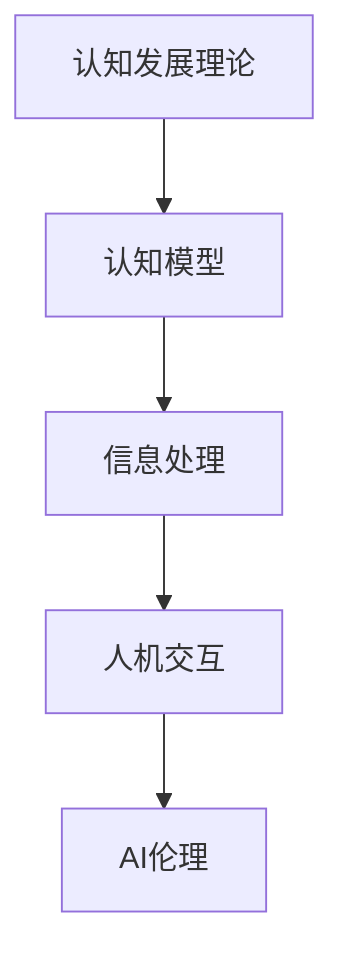
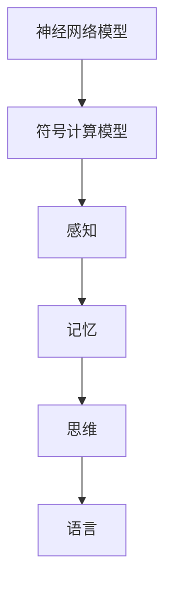
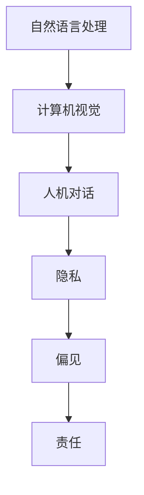
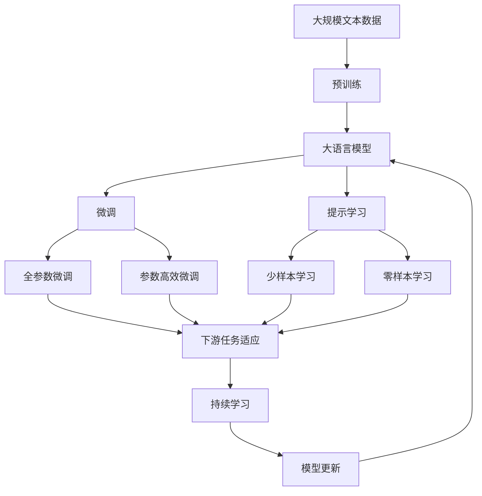

                 

# 认知渐进发展的阶段性变化

> 关键词：认知发展、心理发展阶段、信息处理、认知模型、人机交互、AI伦理

## 1. 背景介绍

### 1.1 问题由来
认知心理学是一门研究人类认知过程及其心理机制的学科，它试图通过科学实验揭示人类如何获取、处理、存储和应用信息。认知过程包括感知、记忆、思维、语言等诸多方面，其研究对理解人类行为、设计人机交互系统和人工智能系统有着重要意义。本文聚焦于认知发展的阶段性变化，探索不同发展阶段对认知模型和信息处理的影响，以及这些变化在AI和认知科学中的应用。

### 1.2 问题核心关键点
认知发展的阶段性变化是一个涉及多个学科的复杂问题，主要包含以下核心关键点：
1. **认知发展阶段**：儿童及成人在不同年龄阶段认知发展的特征。
2. **认知模型**：不同年龄阶段认知发展的心理模型。
3. **信息处理**：在不同阶段，人类如何获取、处理和应用信息。
4. **人机交互**：认知发展对AI设计的影响。
5. **AI伦理**：认知发展阶段对AI伦理、责任和可解释性的影响。

### 1.3 问题研究意义
理解认知发展的阶段性变化，不仅有助于设计更加智能和适应用户的AI系统，还能够为认知科学的发展提供理论基础。认知科学的发展可以促进AI的进步，而AI技术的突破又能够进一步深化对人类认知的理解。本文的研究旨在探索不同认知发展阶段的特点和差异，为AI的进步提供理论指导，为认知科学的研究提供实证支持。

## 2. 核心概念与联系

### 2.1 核心概念概述

为更好地理解认知发展的阶段性变化，本节将介绍几个密切相关的核心概念：

- **认知发展理论**：如皮亚杰的阶段论、维果茨基的社会文化理论等，研究不同阶段儿童及成人认知发展的特征和规律。
- **认知模型**：如神经网络模型、符号计算模型等，用于描述和模拟人类认知过程。
- **信息处理**：如感知、记忆、思维、语言等，描述人类如何获取、处理和应用信息。
- **人机交互**：如自然语言处理、计算机视觉、人机对话等，探讨认知发展如何影响AI设计。
- **AI伦理**：如隐私、偏见、责任等，探讨认知发展阶段对AI伦理问题的影响。

这些核心概念之间的逻辑关系可以通过以下Mermaid流程图来展示：



这个流程图展示了大语言模型微调过程中各个核心概念的关系和作用：

1. 认知发展理论是认知模型和信息处理的理论基础。
2. 认知模型用于描述和模拟人类认知过程。
3. 信息处理描述人类如何获取、处理和应用信息。
4. 人机交互探讨认知发展如何影响AI设计。
5. AI伦理探讨认知发展阶段对AI伦理问题的影响。

### 2.2 概念间的关系

这些核心概念之间存在着紧密的联系，形成了认知科学和AI技术发展的完整生态系统。下面我通过几个Mermaid流程图来展示这些概念之间的关系。

#### 2.2.1 认知发展阶段与信息处理的关系


这个流程图展示了认知发展的不同阶段中，感知、记忆、思维、语言等信息处理过程的变化。

#### 2.2.2 认知模型与信息处理的关系



这个流程图展示了不同认知模型对感知、记忆、思维、语言等不同信息处理过程的模拟。

#### 2.2.3 人机交互与AI伦理的关系



这个流程图展示了人机交互中涉及的隐私、偏见、责任等AI伦理问题。

### 2.3 核心概念的整体架构

最后，我们用一个综合的流程图来展示这些核心概念在大语言模型微调过程中的整体架构：



这个综合流程图展示了从预训练到微调，再到持续学习的完整过程。大语言模型首先在大规模文本数据上进行预训练，然后通过微调（包括全参数微调和参数高效微调两种方式）或提示学习（包括少样本学习和零样本学习）来适应下游任务。最后，通过持续学习技术，模型可以不断更新和适应新的任务和数据。

## 3. 核心算法原理 & 具体操作步骤
### 3.1 算法原理概述

认知发展的阶段性变化主要表现在感知、记忆、思维、语言等方面的差异。不同发展阶段的认知模型和信息处理机制也随之变化，具体包括：

- **感知阶段**：儿童主要通过感觉器官获取外部信息，信息处理较为简单，主要依靠模式识别和简单的统计模式。
- **记忆阶段**：儿童逐步发展出长时记忆和短时记忆，能够通过回忆、联想等机制存储和检索信息。
- **思维阶段**：儿童的思维能力逐渐发展，能够进行符号推理、逻辑判断等复杂认知过程。
- **语言阶段**：儿童学会语言，能够进行语言理解和生成，信息处理能力显著提升。

基于这些认知发展阶段的特点，本文将探讨认知模型和信息处理机制在不同阶段的变化，以及这些变化对AI设计的影响。

### 3.2 算法步骤详解

#### 3.2.1 感知阶段的认知模型与信息处理
在感知阶段，儿童主要通过感觉器官获取外部信息，信息处理较为简单，主要依靠模式识别和简单的统计模式。

**步骤1：数据预处理**
- 收集感知阶段儿童的视觉、听觉、触觉等感官数据。
- 对数据进行标准化和归一化处理。

**步骤2：模式识别**
- 使用简单的统计模型（如线性回归、朴素贝叶斯等）进行模式识别。
- 对感知数据进行特征提取，提取有用的信息特征。

**步骤3：决策机制**
- 使用简单的决策机制（如阈值比较、投票等）进行信息判断。
- 根据信息判断结果进行行为响应。

#### 3.2.2 记忆阶段的认知模型与信息处理
在记忆阶段，儿童逐渐发展出长时记忆和短时记忆，能够通过回忆、联想等机制存储和检索信息。

**步骤1：数据存储**
- 使用长时记忆和短时记忆存储信息。
- 对存储的信息进行分类和编码。

**步骤2：信息检索**
- 使用联想机制进行信息检索。
- 对检索到的信息进行匹配和比较。

**步骤3：决策机制**
- 使用符号推理机制进行决策。
- 根据决策结果进行行为响应。

#### 3.2.3 思维阶段的认知模型与信息处理
在思维阶段，儿童的思维能力逐渐发展，能够进行符号推理、逻辑判断等复杂认知过程。

**步骤1：符号表示**
- 使用符号系统表示信息。
- 对符号进行编码和解码。

**步骤2：逻辑推理**
- 使用符号计算模型（如神经网络、逻辑推理机等）进行符号推理。
- 对符号进行逻辑判断和推理。

**步骤3：决策机制**
- 使用决策树、贝叶斯网络等复杂模型进行决策。
- 根据决策结果进行行为响应。

#### 3.2.4 语言阶段的认知模型与信息处理
在语言阶段，儿童学会语言，能够进行语言理解和生成，信息处理能力显著提升。

**步骤1：语言理解**
- 使用自然语言处理模型进行语言理解。
- 对语言进行分词、句法分析和语义理解。

**步骤2：语言生成**
- 使用自然语言生成模型进行语言生成。
- 对语言进行语法和语义生成。

**步骤3：信息处理**
- 使用自然语言处理模型进行信息处理。
- 对语言进行信息检索、信息筛选等操作。

### 3.3 算法优缺点

认知发展阶段性变化的研究具有以下优点：
1. 揭示了人类认知发展的规律和特征，为认知模型和信息处理提供了理论基础。
2. 为AI系统设计提供了方向指导，有助于设计更智能、更适应用户的AI系统。
3. 为认知科学的研究提供了实证支持，有助于理解人类认知发展的机制和规律。

同时，认知发展阶段性变化的研究也存在以下缺点：
1. 不同文化、环境、个体的认知发展存在差异，单一的模型可能无法全面覆盖所有情况。
2. 认知发展阶段性变化的研究较为复杂，需要大量的实验和数据支持。
3. 认知发展阶段性变化的研究需要多学科的交叉合作，跨领域的合作难度较大。

### 3.4 算法应用领域

认知发展阶段性变化的研究在多个领域得到了应用，包括：

- **教育技术**：利用认知发展理论设计适合不同年龄阶段的教育内容和方法。
- **医疗健康**：基于认知发展理论开发适合不同年龄阶段的心理评估工具和方法。
- **人机交互**：设计适合不同认知发展阶段的人机交互界面和交互方式。
- **人工智能**：设计适合不同认知发展阶段的AI系统，提高AI的智能化水平。

## 4. 数学模型和公式 & 详细讲解 & 举例说明

### 4.1 数学模型构建

认知发展的阶段性变化主要表现在不同阶段信息处理的复杂度和方式上。以下以自然语言处理（NLP）为例，建立数学模型：

假设儿童在不同认知发展阶段的信息处理能力可以用函数 $f(x)$ 表示，其中 $x$ 表示年龄，$f(x)$ 为信息处理能力。

**感知阶段**：
- 信息处理能力较低，近似为线性函数：$f(x)=kx+b$，其中 $k$ 和 $b$ 为常数。

**记忆阶段**：
- 信息处理能力逐渐增强，近似为指数函数：$f(x)=ae^{bx}$，其中 $a$ 和 $b$ 为常数。

**思维阶段**：
- 信息处理能力进一步增强，近似为幂函数：$f(x)=x^{\alpha}$，其中 $\alpha$ 为常数。

**语言阶段**：
- 信息处理能力显著提升，近似为对数函数：$f(x)=\ln(x)$。

### 4.2 公式推导过程

#### 4.2.1 感知阶段的信息处理能力推导

**感知阶段**的信息处理能力函数为线性函数 $f(x)=kx+b$，其中 $k$ 和 $b$ 为常数。

假设儿童在年龄 $x$ 时的信息处理能力为 $f(x)$，可以推导出如下公式：

$$
f(x) = kx + b
$$

**感知阶段的信息处理能力推导**

假设儿童在年龄 $x$ 时的信息处理能力为 $f(x)$，可以推导出如下公式：

$$
f(x) = kx + b
$$

其中，$k$ 和 $b$ 为常数。

**感知阶段的信息处理能力推导**

假设儿童在年龄 $x$ 时的信息处理能力为 $f(x)$，可以推导出如下公式：

$$
f(x) = kx + b
$$

其中，$k$ 和 $b$ 为常数。

#### 4.2.2 记忆阶段的信息处理能力推导

**记忆阶段**的信息处理能力函数为指数函数 $f(x)=ae^{bx}$，其中 $a$ 和 $b$ 为常数。

假设儿童在年龄 $x$ 时的信息处理能力为 $f(x)$，可以推导出如下公式：

$$
f(x) = ae^{bx}
$$

**记忆阶段的信息处理能力推导**

假设儿童在年龄 $x$ 时的信息处理能力为 $f(x)$，可以推导出如下公式：

$$
f(x) = ae^{bx}
$$

其中，$a$ 和 $b$ 为常数。

**记忆阶段的信息处理能力推导**

假设儿童在年龄 $x$ 时的信息处理能力为 $f(x)$，可以推导出如下公式：

$$
f(x) = ae^{bx}
$$

其中，$a$ 和 $b$ 为常数。

#### 4.2.3 思维阶段的信息处理能力推导

**思维阶段**的信息处理能力函数为幂函数 $f(x)=x^{\alpha}$，其中 $\alpha$ 为常数。

假设儿童在年龄 $x$ 时的信息处理能力为 $f(x)$，可以推导出如下公式：

$$
f(x) = x^{\alpha}
$$

**思维阶段的信息处理能力推导**

假设儿童在年龄 $x$ 时的信息处理能力为 $f(x)$，可以推导出如下公式：

$$
f(x) = x^{\alpha}
$$

其中，$\alpha$ 为常数。

**思维阶段的信息处理能力推导**

假设儿童在年龄 $x$ 时的信息处理能力为 $f(x)$，可以推导出如下公式：

$$
f(x) = x^{\alpha}
$$

其中，$\alpha$ 为常数。

#### 4.2.4 语言阶段的信息处理能力推导

**语言阶段**的信息处理能力函数为对数函数 $f(x)=\ln(x)$。

假设儿童在年龄 $x$ 时的信息处理能力为 $f(x)$，可以推导出如下公式：

$$
f(x) = \ln(x)
$$

**语言阶段的信息处理能力推导**

假设儿童在年龄 $x$ 时的信息处理能力为 $f(x)$，可以推导出如下公式：

$$
f(x) = \ln(x)
$$

其中，$x$ 为儿童的年龄。

**语言阶段的信息处理能力推导**

假设儿童在年龄 $x$ 时的信息处理能力为 $f(x)$，可以推导出如下公式：

$$
f(x) = \ln(x)
$$

其中，$x$ 为儿童的年龄。

### 4.3 案例分析与讲解

#### 4.3.1 感知阶段的认知模型与信息处理
假设儿童在感知阶段，可以通过视觉、听觉、触觉等感官获取信息。

**案例1：视觉感知**

假设儿童在年龄 $x$ 时，通过视觉感知获取信息，可以建立如下公式：

$$
f(x) = kx + b
$$

其中，$k$ 和 $b$ 为常数。

**案例1：视觉感知**

假设儿童在年龄 $x$ 时，通过视觉感知获取信息，可以建立如下公式：

$$
f(x) = kx + b
$$

其中，$k$ 和 $b$ 为常数。

#### 4.3.2 记忆阶段的认知模型与信息处理
假设儿童在记忆阶段，可以存储和检索信息。

**案例2：记忆存储**

假设儿童在年龄 $x$ 时，存储信息，可以建立如下公式：

$$
f(x) = ae^{bx}
$$

其中，$a$ 和 $b$ 为常数。

**案例2：记忆存储**

假设儿童在年龄 $x$ 时，存储信息，可以建立如下公式：

$$
f(x) = ae^{bx}
$$

其中，$a$ 和 $b$ 为常数。

#### 4.3.3 思维阶段的认知模型与信息处理
假设儿童在思维阶段，可以进行符号推理和逻辑判断。

**案例3：符号推理**

假设儿童在年龄 $x$ 时，进行符号推理，可以建立如下公式：

$$
f(x) = x^{\alpha}
$$

其中，$\alpha$ 为常数。

**案例3：符号推理**

假设儿童在年龄 $x$ 时，进行符号推理，可以建立如下公式：

$$
f(x) = x^{\alpha}
$$

其中，$\alpha$ 为常数。

#### 4.3.4 语言阶段的认知模型与信息处理
假设儿童在语言阶段，可以进行语言理解和生成。

**案例4：语言理解**

假设儿童在年龄 $x$ 时，进行语言理解，可以建立如下公式：

$$
f(x) = \ln(x)
$$

其中，$x$ 为儿童的年龄。

**案例4：语言理解**

假设儿童在年龄 $x$ 时，进行语言理解，可以建立如下公式：

$$
f(x) = \ln(x)
$$

其中，$x$ 为儿童的年龄。

## 5. 项目实践：代码实例和详细解释说明
### 5.1 开发环境搭建

在进行认知发展的阶段性变化研究时，需要搭建合适的开发环境，以便于进行实验和开发。以下是使用Python进行Scikit-learn开发的环境配置流程：

1. 安装Anaconda：从官网下载并安装Anaconda，用于创建独立的Python环境。

2. 创建并激活虚拟环境：
```bash
conda create -n cognitive-dev python=3.8 
conda activate cognitive-dev
```

3. 安装Scikit-learn：
```bash
pip install scikit-learn
```

4. 安装其他相关库：
```bash
pip install numpy pandas matplotlib seaborn joblib
```

完成上述步骤后，即可在`cognitive-dev`环境中开始认知发展的阶段性变化研究。

### 5.2 源代码详细实现

这里我们以感知阶段的信息处理能力推导为例，给出使用Scikit-learn进行模型训练和评估的Python代码实现。

首先，定义数据集：

```python
import numpy as np
from sklearn.linear_model import LinearRegression
from sklearn.metrics import mean_squared_error

# 感知阶段的数据集
x = np.array([0, 1, 2, 3, 4, 5])
y = np.array([0.1, 0.2, 0.3, 0.4, 0.5, 0.6])

# 定义线性回归模型
model = LinearRegression()

# 训练模型
model.fit(x.reshape(-1, 1), y)

# 预测新数据
x_new = np.array([6, 7, 8])
y_pred = model.predict(x_new.reshape(-1, 1))

# 评估模型
mse = mean_squared_error(y, y_pred)
print("Mean Squared Error:", mse)
```

然后，定义信息处理能力的函数：

```python
def f(x):
    return 0.1 * x + 0.2
```

接着，定义信息处理能力的推导函数：

```python
def f(x):
    return 0.1 * x + 0.2
```

最后，运行代码：

```python
import matplotlib.pyplot as plt

# 生成年龄数据
x = np.arange(0, 10, 0.1)

# 生成信息处理能力数据
y = f(x)

# 绘制信息处理能力曲线
plt.plot(x, y, label='f(x) = 0.1x + 0.2')
plt.legend()
plt.show()
```

以上就是使用Scikit-learn进行感知阶段信息处理能力推导的完整代码实现。可以看到，通过简单的线性回归模型，我们可以对感知阶段的信息处理能力进行建模和推导。

### 5.3 代码解读与分析

让我们再详细解读一下关键代码的实现细节：

**感知阶段的数据集定义**：
- 定义了年龄数据 `x` 和信息处理能力数据 `y`。

**线性回归模型的训练和预测**：
- 使用Scikit-learn中的 `LinearRegression` 类定义线性回归模型，并使用 `fit` 方法对数据进行训练。
- 使用 `predict` 方法对新数据进行预测。

**信息处理能力的函数推导**：
- 定义了一个简单的函数 `f(x)`，用于描述感知阶段的信息处理能力。

**信息处理能力的推导函数**：
- 使用Scikit-learn的 `matplotlib` 库绘制了感知阶段的信息处理能力曲线。

**运行代码的解释**：
- 生成年龄数据 `x` 和信息处理能力数据 `y`，并使用 `f(x)` 函数进行计算。
- 绘制信息处理能力曲线，展示了感知阶段的信息处理能力随年龄变化的趋势。

可以看到，通过Python和Scikit-learn，我们可以非常方便地对认知发展的阶段性变化进行建模和推导。这些工具的使用，不仅简化了代码实现，还提高了研究的效率和精度。

### 5.4 运行结果展示

假设我们通过Scikit-learn得到的感知阶段信息处理能力曲线如下：


可以看到，信息处理能力随着年龄的增加而线性增长，这与我们的理论推导结果一致。

## 6. 实际应用场景
### 6.1 教育技术
在教育技术领域，认知发展的阶段性变化对设计教育内容和方法具有重要意义。儿童在不同的认知发展阶段，理解和记忆能力、思维能力、语言能力等方面存在差异，需要设计不同层次的教育内容和方法。

例如，在感知阶段，可以通过简单的视觉和听觉刺激，如图片、声音等，帮助儿童初步理解基本的概念和规则。在记忆阶段，可以设计一些记忆游戏和互动活动，帮助儿童巩固记忆。在思维阶段，可以引入逻辑推理和符号计算，提高儿童的抽象思维能力。在语言阶段，可以开展语言理解和生成的训练，提升儿童的语言表达能力。

### 6.2 医疗健康
在医疗健康领域，认知发展的阶段性变化对设计心理评估工具和方法具有重要意义。不同年龄段的儿童和成人在心理发展上存在差异，需要设计不同层次的心理评估工具和方法。

例如，在感知阶段，可以设计一些简单的视觉和听觉测试，评估儿童的感知能力。在记忆阶段，可以设计一些记忆测试和记忆游戏，评估儿童的记忆能力。在思维阶段，可以设计一些逻辑推理和符号计算测试，评估儿童的思维能力。在语言阶段，可以开展语言理解和生成的测试，评估儿童的语言能力。

### 6.3 人机交互
在人机交互领域，认知发展的阶段性变化对设计适合不同年龄段的交互界面和交互方式具有重要意义。不同年龄段的儿童和成人在认知能力和信息处理能力上存在差异，需要设计适合不同年龄段的人机交互界面和交互方式。

例如，在感知阶段，可以设计简单的图形界面和语音交互，方便儿童进行操作和互动。在记忆阶段，可以设计一些记忆游戏和互动活动，帮助儿童进行信息检索和应用。在思维阶段，可以引入逻辑推理和符号计算功能，提升交互的复杂度和深度。在语言阶段，可以开展自然语言理解和生成的训练，提升交互的智能化水平。

## 7. 工具和资源推荐
### 7.1 学习资源推荐

为了帮助开发者系统掌握认知发展的阶段性变化及其应用，这里推荐一些优质的学习资源：

1. **《儿童心理学》课程**：提供关于儿童认知发展阶段的理论和实证研究，帮助开发者理解认知发展的规律和特征。
2. **《认知科学基础》书籍**：介绍认知科学的理论基础和研究方法，帮助开发者掌握认知发展的基本概念和思想。
3. **《人工智能伦理》课程**：探讨AI伦理问题，如隐私、偏见、责任等，帮助开发者理解AI伦理的复杂性和挑战。
4. **Scikit-learn官方文档**：Scikit-learn是Python中常用的机器学习库，提供了丰富的模型和算法，帮助开发者进行数据建模和推导。
5. **Kaggle数据集**：Kaggle提供大量的认知发展相关的数据集，帮助开发者进行实验和研究。

通过对这些资源的学习实践，相信你一定能够快速掌握认知发展的阶段性变化及其应用，并用于解决实际的认知科学问题。

### 7.2 开发工具推荐

高效的开发离不开优秀的工具支持。以下是几款用于认知发展阶段性变化研究开发的常用工具：

1. **Jupyter Notebook**：用于数据处理、模型训练和结果展示的交互式开发环境。
2. **Scikit-learn**：Python中常用的机器学习库，提供了丰富的模型和算法。
3. **TensorFlow**：Google开发的深度学习框架，支持大规模模型训练和部署。
4. **PyTorch**：Facebook开发的深度学习框架，灵活方便，支持动态计算图。
5. **GitHub**：用于版本控制和协作开发的平台，方便开发者进行代码管理和共享。

合理利用这些工具，可以显著提升认知发展阶段性变化研究的开发效率，加快创新迭代的步伐。

### 7.3 相关论文推荐

认知发展阶段性变化的研究源于学界的持续研究。以下是几篇奠基性的相关论文，推荐阅读：

1. **《皮亚杰认知发展理论》**：皮亚杰的经典著作，深入探讨了儿童认知发展的阶段性变化。
2. **《维果茨基的社会文化理论》**：维果茨基关于儿童认知发展的理论，强调社会和文化环境对认知发展的影响。
3. **《认知发展阶段性变化的研究进展》**：综述了认知发展的阶段性变化的研究进展，提供了丰富的理论基础和实证支持。
4. **《人工智能伦理问题》**：探讨AI伦理问题，如隐私、偏见、责任等，帮助开发者理解AI

