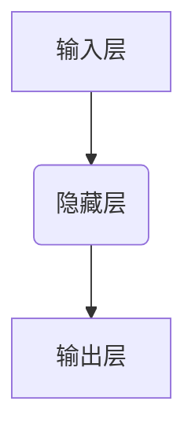

## 神经网络：人工智能的基石

> 关键词：神经网络、深度学习、人工神经元、激活函数、反向传播、卷积神经网络、循环神经网络

## 1. 背景介绍

人工智能（AI）近年来发展迅速，已渗透到各个领域，从自动驾驶到医疗诊断，再到自然语言处理，神经网络作为人工智能的核心技术，扮演着至关重要的角色。

早期的人工智能研究主要依赖于基于规则的系统，但这些系统难以处理复杂、非结构化的数据。随着计算机硬件和算法的进步，神经网络逐渐成为人工智能研究的热点。

神经网络的灵感来源于人类大脑的结构和功能。它由大量相互连接的神经元组成，这些神经元通过权重来传递信息。通过训练，神经网络可以学习复杂的模式和关系，从而实现各种智能任务。

## 2. 核心概念与联系

### 2.1 人工神经元

人工神经元是神经网络的基本单元，模拟了生物神经元的运作机制。每个人工神经元接收多个输入信号，对这些信号进行加权求和，并通过激活函数进行处理，最终输出一个信号。



### 2.2 激活函数

激活函数决定了神经元对输入信号的响应方式。常见的激活函数包括 sigmoid 函数、ReLU 函数、tanh 函数等。激活函数的作用是引入非线性，使神经网络能够学习复杂的模式。

### 2.3 层次结构

神经网络通常由多个层组成，包括输入层、隐藏层和输出层。输入层接收原始数据，隐藏层对数据进行处理和转换，输出层输出最终结果。

### 2.4 权重

权重是连接神经元之间的参数，决定了每个输入信号对神经元的贡献程度。通过训练，神经网络会不断调整权重，以最小化预测误差。

### 2.5 反向传播算法

反向传播算法是训练神经网络的关键算法。它通过计算误差梯度，反向传播到各层神经元，并更新权重，从而使神经网络的预测精度不断提高。

## 3. 核心算法原理 & 具体操作步骤

### 3.1 算法原理概述

神经网络的核心算法是反向传播算法，它基于梯度下降法，通过不断调整神经网络的权重，使网络的输出与实际目标值之间的误差最小化。

### 3.2 算法步骤详解

1. **前向传播:** 将输入数据传递到神经网络，计算各层神经元的输出值。
2. **误差计算:** 计算输出层的预测值与实际目标值之间的误差。
3. **反向传播:** 将误差反向传播到各层神经元，计算每个神经元的梯度。
4. **权重更新:** 根据梯度更新神经网络的权重，使误差最小化。
5. **重复步骤1-4:** 重复上述步骤，直到误差达到预设阈值。

### 3.3 算法优缺点

**优点:**

* 能够学习复杂的非线性关系。
* 具有强大的泛化能力。
* 可应用于多种机器学习任务。

**缺点:**

* 训练时间长，计算资源消耗大。
* 容易陷入局部最优解。
* 对训练数据质量要求高。

### 3.4 算法应用领域

* **图像识别:** 人脸识别、物体检测、图像分类等。
* **自然语言处理:** 机器翻译、文本摘要、情感分析等。
* **语音识别:** 语音转文本、语音合成等。
* **推荐系统:** 商品推荐、用户画像等。
* **医疗诊断:** 疾病预测、影像分析等。

## 4. 数学模型和公式 & 详细讲解 & 举例说明

### 4.1 数学模型构建

神经网络可以看作是一个多层感知机（MLP），其数学模型可以表示为：

$$
y = f(W_3 * a_2 + b_3)
$$

$$
a_2 = f(W_2 * a_1 + b_2)
$$

$$
a_1 = X * W_1 + b_1
$$

其中：

* $X$ 是输入数据。
* $W_1$, $W_2$, $W_3$ 是连接各层神经元的权重矩阵。
* $b_1$, $b_2$, $b_3$ 是各层的偏置向量。
* $a_1$, $a_2$ 是各层的激活值。
* $f$ 是激活函数。
* $y$ 是输出结果。

### 4.2 公式推导过程

反向传播算法的核心是计算误差梯度，并根据梯度更新权重。

误差函数通常定义为预测值与实际目标值之间的平方差：

$$
E = \frac{1}{2} \sum_{i=1}^{N} (y_i - t_i)^2
$$

其中：

* $y_i$ 是预测值。
* $t_i$ 是实际目标值。
* $N$ 是样本数量。

通过链式法则，可以计算每个权重的梯度：

$$
\frac{\partial E}{\partial W_{ij}} = \frac{\partial E}{\partial y} \cdot \frac{\partial y}{\partial a_j} \cdot \frac{\partial a_j}{\partial W_{ij}}
$$

### 4.3 案例分析与讲解

假设我们有一个简单的神经网络，用于预测房价。输入数据包括房屋面积、房间数量等特征，输出是房价。

通过训练数据，神经网络学习到房屋面积和房间数量与房价之间的关系。当输入一个新的房屋信息时，神经网络可以根据学习到的关系预测房价。

## 5. 项目实践：代码实例和详细解释说明

### 5.1 开发环境搭建

* Python 3.x
* TensorFlow 或 PyTorch 等深度学习框架

### 5.2 源代码详细实现

```python
import tensorflow as tf

# 定义模型
model = tf.keras.models.Sequential([
  tf.keras.layers.Dense(64, activation='relu', input_shape=(4,)),
  tf.keras.layers.Dense(1)
])

# 编译模型
model.compile(optimizer='adam', loss='mse')

# 训练模型
model.fit(X_train, y_train, epochs=10)

# 评估模型
loss = model.evaluate(X_test, y_test)
```

### 5.3 代码解读与分析

* `tf.keras.models.Sequential` 创建一个顺序模型，即层级连接。
* `tf.keras.layers.Dense` 定义一个全连接层，输入维度为4，输出维度为64，激活函数为ReLU。
* `model.compile` 编译模型，指定优化器、损失函数和指标。
* `model.fit` 训练模型，输入训练数据和 epochs 参数。
* `model.evaluate` 评估模型，输入测试数据。

### 5.4 运行结果展示

训练完成后，可以将模型应用于新的数据，预测房价。

## 6. 实际应用场景

### 6.1 图像识别

* **人脸识别:** 用于解锁手机、身份验证等。
* **物体检测:** 用于自动驾驶、安防监控等。
* **图像分类:** 用于医学影像诊断、产品分类等。

### 6.2 自然语言处理

* **机器翻译:** 将文本从一种语言翻译成另一种语言。
* **文本摘要:** 自动生成文本的简要概述。
* **情感分析:** 分析文本的情感倾向，用于市场调研、用户反馈分析等。

### 6.3 语音识别

* **语音转文本:** 将语音转换为文本，用于语音助手、听写软件等。
* **语音合成:** 将文本转换为语音，用于语音导航、播报系统等。

### 6.4 其他应用

* **推荐系统:** 根据用户行为推荐商品、内容等。
* **医疗诊断:** 辅助医生诊断疾病，预测患者风险等。
* **金融预测:** 预测股票价格、风险评估等。

### 6.5 未来应用展望

随着人工智能技术的不断发展，神经网络将在更多领域得到应用，例如：

* **个性化教育:** 根据学生的学习情况提供个性化的学习方案。
* **智能制造:** 自动化生产流程，提高生产效率。
* **自动驾驶:** 实现真正意义上的自动驾驶汽车。

## 7. 工具和资源推荐

### 7.1 学习资源推荐

* **书籍:**
    * 《深度学习》
    * 《神经网络与深度学习》
    * 《动手学深度学习》
* **在线课程:**
    * Coursera: 深度学习
    * Udacity: 深度学习工程师
    * fast.ai: 深度学习课程

### 7.2 开发工具推荐

* **TensorFlow:** Google 开发的开源深度学习框架。
* **PyTorch:** Facebook 开发的开源深度学习框架。
* **Keras:** TensorFlow 的高层API，易于使用。

### 7.3 相关论文推荐

* **AlexNet:** ImageNet Large Scale Visual Recognition Challenge 2012 冠军论文。
* **VGGNet:** 深度卷积神经网络架构论文。
* **ResNet:** 残差网络架构论文。

## 8. 总结：未来发展趋势与挑战

### 8.1 研究成果总结

近年来，神经网络取得了显著的进展，在图像识别、自然语言处理等领域取得了突破性成果。

### 8.2 未来发展趋势

* **模型更深、更复杂:** 研究更深层次、更复杂的网络架构，提高模型的表达能力。
* **数据更丰富、更有效:** 利用更多数据和更有效的训练方法，提高模型的泛化能力。
* **硬件加速:** 利用GPU、TPU等专用硬件加速模型训练和推理。
* **解释性更强:** 研究更易于解释的神经网络模型，提高模型的可信度。

### 8.3 面临的挑战

* **数据偏差:** 训练数据可能存在偏差，导致模型产生偏见。
* **计算资源:** 训练大型神经网络需要大量的计算资源。
* **安全性和隐私:** 神经网络模型可能存在安全漏洞，泄露用户隐私。

### 8.4 研究展望

未来，神经网络研究将继续朝着更智能、更安全、更可解释的方向发展。


## 9. 附录：常见问题与解答

### 9.1 什么是激活函数？

激活函数是神经网络中引入非线性性的重要组成部分。它决定了神经元对输入信号的响应方式，使神经网络能够学习复杂的模式。

### 9.2 什么是反向传播算法？

反向传播算法是训练神经网络的关键算法。它通过计算误差梯度，反向传播到各层神经元，并更新权重，从而使神经网络的预测精度不断提高。

### 9.3 如何选择合适的激活函数？

不同的激活函数适用于不同的任务和网络架构。常见的激活函数包括 sigmoid 函数、ReLU 函数、tanh 函数等。选择合适的激活函数需要根据具体任务和网络结构进行考虑。

### 9.4 如何防止神经网络过拟合？

过拟合是指神经网络在训练数据上表现很好，但在测试数据上表现较差。

防止过拟合的方法包括：

* 使用更丰富的训练数据。
* 使用正则化技术，例如 L1 正则化和 L2 正则化。
* 使用 dropout 技术，随机丢弃一些神经元。
* 使用早停策略，在训练过程中监控模型在验证集上的性能，并在性能下降时停止训练。


作者：禅与计算机程序设计艺术 / Zen and the Art of Computer Programming 
