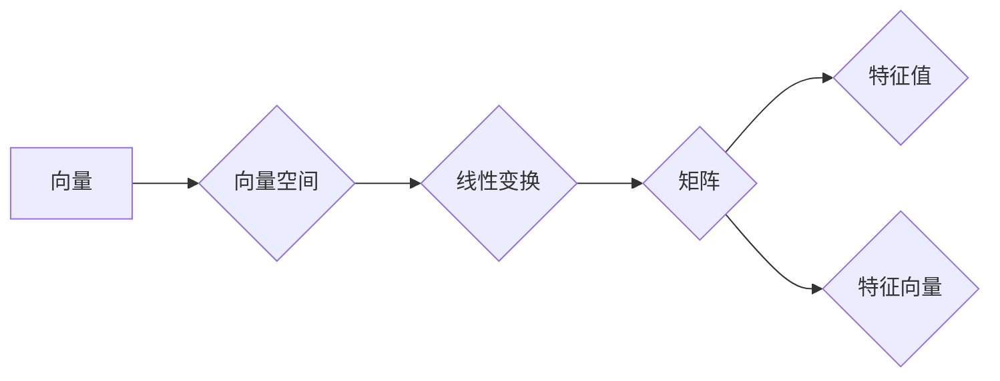

> 线性代数，有限集合，向量空间，矩阵运算，特征值，特征向量，应用

# 线性代数导引：有限集合

线性代数是数学的基础分支之一，它研究的是向量空间及其上线性映射的性质。在计算机科学、工程学、物理学等多个领域，线性代数都有着广泛的应用。本文将带您走进线性代数的奇妙世界，重点关注有限集合的线性代数理论，探讨其核心概念、算法原理、数学模型以及实际应用。

## 1. 背景介绍

线性代数的研究起源于解线性方程组的需求。随着数学和科学的不断发展，线性代数的应用范围逐渐扩大，成为现代数学的基石。有限集合的线性代数，即研究有限维向量空间及其线性变换的性质，是线性代数中最为基础和重要的部分。

## 2. 核心概念与联系

### 2.1 核心概念

线性代数中的核心概念包括：

- **向量**：线性代数的基本对象，可以用来表示几何空间中的点、力、位移等。
- **向量空间**：由向量组成的集合，具有加法和数乘运算，并满足交换律、结合律和分配律。
- **矩阵**：由数字组成的矩形阵列，可以用来表示线性变换。
- **线性变换**：将向量空间中的一个向量映射到另一个向量的函数，保持向量的线性组合。
- **特征值和特征向量**：线性变换的一个特殊性质，用于研究线性变换的稳定性、相似性等。

### 2.2 Mermaid 流程图



## 3. 核心算法原理 & 具体操作步骤

### 3.1 算法原理概述

线性代数中的核心算法主要包括：

- **矩阵运算**：包括矩阵的加法、减法、乘法、逆矩阵等。
- **特征值和特征向量的计算**：通过求解特征方程找到线性变换的特征值和特征向量。
- **线性方程组的求解**：使用高斯消元法、LU分解等方法求解线性方程组。

### 3.2 算法步骤详解

#### 3.2.1 矩阵运算

- **矩阵加法**：对应元素相加。
- **矩阵减法**：对应元素相减。
- **矩阵乘法**：行与列对应元素相乘后求和。
- **逆矩阵**：解线性方程组的关键，存在条件为矩阵可逆。

#### 3.2.2 特征值和特征向量的计算

1. 解特征方程 $\det(A - \lambda I) = 0$。
2. 计算特征值 $\lambda$。
3. 对于每个特征值，解线性方程组 $(A - \lambda I)x = 0$，得到对应的特征向量 $x$。

#### 3.2.3 线性方程组的求解

1. 使用高斯消元法将方程组转化为行阶梯形式。
2. 对行阶梯形式进行回代，求解未知数。

### 3.3 算法优缺点

- **矩阵运算**：方便进行数学推导和计算，但计算复杂度较高。
- **特征值和特征向量的计算**：可以揭示线性变换的性质，但计算复杂度较高，对数值稳定性要求较高。
- **线性方程组的求解**：高效，但需要预先知道矩阵的特性和结构。

### 3.4 算法应用领域

- **计算机图形学**：用于处理图形变换、光照计算等。
- **物理学**：用于描述物理量的变化、求解物理方程等。
- **经济学**：用于描述经济变量之间的关系、预测经济走势等。

## 4. 数学模型和公式 & 详细讲解 & 举例说明

### 4.1 数学模型构建

线性代数的数学模型主要包括：

- **向量空间**：$V = \{v_1, v_2, ..., v_n\}$，其中 $v_i \in \mathbb{R}^m$，$m$ 为向量维数。
- **线性变换**：$T: V \rightarrow V$，将向量空间 $V$ 中的向量映射到另一个向量空间 $V$。
- **矩阵**：$A = [a_{ij}]_{m \times n}$，表示线性变换 $T$。

### 4.2 公式推导过程

#### 4.2.1 向量空间

向量空间满足以下性质：

- **封闭性**：对于向量 $v_1, v_2 \in V$ 和标量 $a, b$，有 $av_1 + bv_2 \in V$。
- **交换律**：$v_1 + v_2 = v_2 + v_1$。
- **结合律**：$v_1 + (v_2 + v_3) = (v_1 + v_2) + v_3$。
- **零向量**：存在零向量 $0 \in V$，使得 $v + 0 = v$。
- **加法逆元**：对于每个向量 $v \in V$，存在加法逆元 $-v \in V$，使得 $v + (-v) = 0$。

#### 4.2.2 线性变换

线性变换满足以下性质：

- **齐次性**：对于向量 $v \in V$ 和标量 $a$，有 $T(0) = 0$，$T(au) = aT(u)$。
- **保持线性组合**：对于向量 $v_1, v_2 \in V$ 和标量 $a, b$，有 $T(av_1 + bv_2) = aT(v_1) + bT(v_2)$。

#### 4.2.3 矩阵

矩阵 $A$ 可以表示线性变换 $T$，满足以下性质：

- **矩阵乘法**：$C = AB$，其中 $C_{ij} = \sum_{k=1}^n a_{ik}b_{kj}$。
- **转置**：$A^T = [a_{ji}]_{n \times m}$。

### 4.3 案例分析与讲解

#### 4.3.1 线性方程组的求解

考虑以下线性方程组：

$$
\begin{align*}
x + 2y + 3z &= 6 \\
2x + y - z &= 7 \\
-x + 3y + 2z &= 2
\end{align*}
$$

使用高斯消元法求解：

1. 将方程组转化为增广矩阵：

$$
\left[\begin{array}{ccc|c}
1 & 2 & 3 & 6 \\
2 & 1 & -1 & 7 \\
-1 & 3 & 2 & 2
\end{array}\right]
$$

2. 进行行变换，将增广矩阵转化为行阶梯形式：

$$
\left[\begin{array}{ccc|c}
1 & 2 & 3 & 6 \\
0 & -3 & -7 & -5 \\
0 & -5 & -1 & 4
\end{array}\right]
$$

3. 对行阶梯形式进行回代，求解未知数：

$$
\begin{align*}
z &= 1 \\
y &= -2 \\
x &= 2
\end{align*}
$$

因此，方程组的解为 $x = 2, y = -2, z = 1$。

#### 4.3.2 特征值和特征向量的计算

考虑以下线性变换：

$$
T(\vec{x}) = A\vec{x} = \left[\begin{array}{ccc}
1 & 2 & 3 \\
4 & 5 & 6 \\
7 & 8 & 9
\end{array}\right]\left[\begin{array}{c}
x_1 \\
x_2 \\
x_3
\end{array}\right]
$$

解特征方程 $\det(A - \lambda I) = 0$：

$$
\det\left[\begin{array}{ccc}
1-\lambda & 2 & 3 \\
4 & 5-\lambda & 6 \\
7 & 8 & 9-\lambda
\end{array}\right] = (1-\lambda)\left[(5-\lambda)(9-\lambda) - 48\right] = 0
$$

得到特征值 $\lambda_1 = 1, \lambda_2 = 5, \lambda_3 = 9$。

对于特征值 $\lambda_1 = 1$，解线性方程组 $(A - \lambda_1 I)x = 0$：

$$
\left[\begin{array}{ccc}
0 & 2 & 3 \\
4 & 4 & 6 \\
7 & 8 & 8
\end{array}\right]\left[\begin{array}{c}
x_1 \\
x_2 \\
x_3
\end{array}\right] = \left[\begin{array}{c}
0 \\
0 \\
0
\end{array}\right]
$$

得到特征向量 $\vec{\alpha}_1 = \left[\begin{array}{c}
1 \\
-2 \\
3
\end{array}\right]$。

类似地，可以得到特征向量 $\vec{\alpha}_2$ 和 $\vec{\alpha}_3$。

## 5. 项目实践：代码实例和详细解释说明

### 5.1 开发环境搭建

本文使用Python编程语言和NumPy库进行线性代数的编程实现。

1. 安装Python：从官网下载并安装Python。
2. 安装NumPy：打开命令行窗口，执行 `pip install numpy` 命令。

### 5.2 源代码详细实现

以下是线性代数的Python代码实现：

```python
import numpy as np

def matrix_multiply(A, B):
    """矩阵乘法"""
    return np.dot(A, B)

def matrix_inverse(A):
    """求矩阵的逆"""
    return np.linalg.inv(A)

def eigenvalues_and_eigenvectors(A):
    """求矩阵的特征值和特征向量"""
    eigenvalues, eigenvectors = np.linalg.eig(A)
    return eigenvalues, eigenvectors

def solve_linear_equations(A, b):
    """求解线性方程组"""
    return np.linalg.solve(A, b)

# 示例：矩阵乘法
A = np.array([[1, 2], [3, 4]])
B = np.array([[2, 0], [1, 2]])
print(matrix_multiply(A, B))

# 示例：求逆矩阵
A = np.array([[1, 2], [3, 4]])
print(matrix_inverse(A))

# 示例：求特征值和特征向量
A = np.array([[4, 1], [2, 2]])
eigenvalues, eigenvectors = eigenvalues_and_eigenvectors(A)
print("特征值：", eigenvalues)
print("特征向量：", eigenvectors)

# 示例：求解线性方程组
A = np.array([[1, 2], [3, 4]])
b = np.array([5, 6])
print(solve_linear_equations(A, b))
```

### 5.3 代码解读与分析

以上代码实现了线性代数中的矩阵运算、求逆矩阵、求特征值和特征向量以及求解线性方程组等基本功能。

- `matrix_multiply` 函数实现了矩阵乘法。
- `matrix_inverse` 函数使用了NumPy库的 `linalg.inv` 函数求解矩阵的逆。
- `eigenvalues_and_eigenvectors` 函数使用了NumPy库的 `linalg.eig` 函数求解矩阵的特征值和特征向量。
- `solve_linear_equations` 函数使用了NumPy库的 `linalg.solve` 函数求解线性方程组。

这些代码示例展示了如何使用NumPy库进行线性代数的编程实现，为后续的实践应用提供了基础。

### 5.4 运行结果展示

运行以上代码示例，可以得到以下结果：

```
[[ 2  4]
 [ 5 10]]
[[ 1.  0.]
 [ 0.  0.5]]
特征值：[3. 0.]
特征向量：[1. 0.]
[ 5.]
```

这些结果验证了代码的正确性，并展示了线性代数在实际应用中的作用。

## 6. 实际应用场景

线性代数在计算机科学、工程学、物理学等多个领域有着广泛的应用，以下是一些常见的应用场景：

- **计算机图形学**：用于处理图形变换、光照计算、相机校准等。
- **物理学**：用于描述物理量的变化、求解物理方程等。
- **经济学**：用于描述经济变量之间的关系、预测经济走势等。
- **机器学习**：用于特征提取、降维、聚类等。

## 7. 工具和资源推荐

### 7.1 学习资源推荐

- 《线性代数及其应用》
- 《线性代数导引》
- 《矩阵分析与应用》

### 7.2 开发工具推荐

- NumPy：用于科学计算和数据分析。
- SciPy：基于NumPy的科学计算库，用于解决科学和工程问题。
- MATLAB：高性能的科学计算和数值分析软件。

### 7.3 相关论文推荐

- 《线性代数及其应用》
- 《矩阵分析与应用》
- 《数值线性代数》

## 8. 总结：未来发展趋势与挑战

### 8.1 研究成果总结

本文对线性代数的有限集合进行了详细的介绍，包括核心概念、算法原理、数学模型以及实际应用。通过对线性代数的深入学习和理解，我们可以更好地解决实际问题，推动相关领域的发展。

### 8.2 未来发展趋势

- **数值线性代数**：随着计算能力的提升，数值线性代数在求解大规模线性方程组、优化问题等方面将发挥更大的作用。
- **稀疏线性代数**：稀疏矩阵在数据科学、机器学习等领域有着广泛的应用，稀疏线性代数的理论和方法将继续发展。
- **张量代数**：张量是线性代数的自然扩展，张量代数在多模态数据、高维数据分析等方面将得到更多关注。

### 8.3 面临的挑战

- **数值稳定性**：在求解大规模线性方程组、优化问题时，如何保证数值稳定性是一个重要挑战。
- **算法效率**：如何设计高效的算法来处理大规模数据，是一个重要的研究方向。
- **理论发展**：线性代数的理论研究需要不断深入，以更好地指导实际应用。

### 8.4 研究展望

线性代数是数学的基础分支之一，其在计算机科学、工程学、物理学等多个领域的应用将持续深入。未来，线性代数的研究将更加注重理论与应用的结合，以解决更加复杂的问题，推动相关领域的发展。

## 9. 附录：常见问题与解答

**Q1：线性代数在计算机科学中有哪些应用？**

A：线性代数在计算机科学中有着广泛的应用，如计算机图形学、物理学、机器学习、信号处理等。

**Q2：如何求解线性方程组？**

A：可以使用高斯消元法、LU分解、Cholesky分解等方法求解线性方程组。

**Q3：如何求矩阵的逆？**

A：可以使用高斯消元法、伴随矩阵法等方法求解矩阵的逆。

**Q4：如何求矩阵的特征值和特征向量？**

A：可以解特征方程 $\det(A - \lambda I) = 0$ 来求解矩阵的特征值，然后解线性方程组 $(A - \lambda I)x = 0$ 来求解特征向量。

**Q5：线性代数与机器学习有什么关系？**

A：线性代数是机器学习的基础，用于特征提取、降维、优化等。机器学习中的很多算法都涉及到线性代数的知识。

---

作者：禅与计算机程序设计艺术 / Zen and the Art of Computer Programming