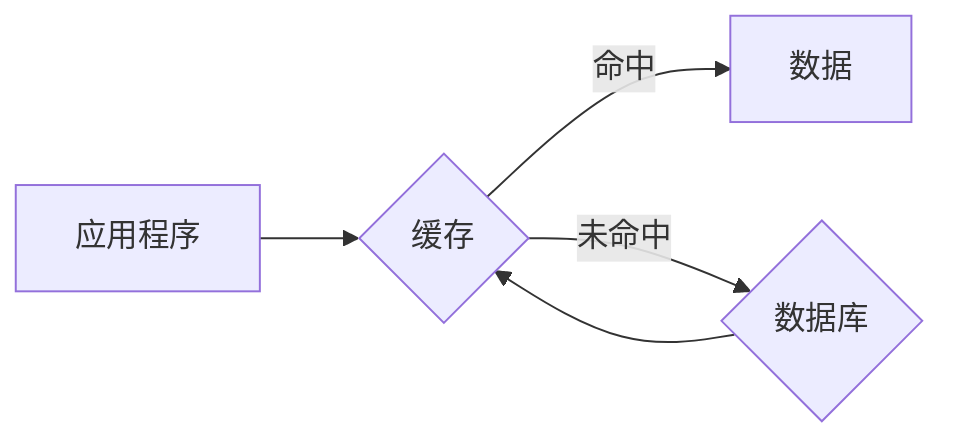

## 缓存机制在高吞吐量中的实例应用

> 关键词：缓存机制、高吞吐量、数据访问、性能优化、算法原理、实例应用、代码实现

## 1. 背景介绍

在当今数据爆炸的时代，应用程序处理海量数据的能力至关重要。高吞吐量系统，即能够快速处理大量请求的系统，在电商、金融、社交媒体等领域扮演着越来越重要的角色。然而，频繁访问数据存储往往会成为系统性能瓶颈，导致响应时间延迟、资源消耗过高。

缓存机制作为一种数据存储优化技术，能够有效缓解这一问题。它通过将频繁访问的数据存储在高速内存中，减少对慢速存储设备（如硬盘）的访问次数，从而显著提升数据访问速度和系统吞吐量。

## 2. 核心概念与联系

### 2.1 缓存机制概述

缓存机制是一种将数据从一个存储位置（例如硬盘）复制到另一个存储位置（例如内存）的技术，以便更快地访问数据。缓存通常由以下几个关键组件组成：

* **缓存空间:** 用于存储缓存数据的内存区域。
* **缓存控制器:** 管理缓存空间，负责数据加载、存储和检索。
* **命中率:** 指缓存能够成功返回数据的比例。命中率越高，缓存机制的效率越高。
* **失效策略:** 用于决定何时将缓存数据从缓存空间中移除。常见的失效策略包括：
    * **时间失效:** 根据数据在缓存中的存活时间进行失效。
    * **使用失效:** 根据数据在缓存中的使用频率进行失效。
    * **强失效:** 强制移除特定数据，即使该数据尚未失效。

### 2.2 缓存与数据库的关系

数据库是存储大量数据的持久存储系统，而缓存则是一个高速的临时存储系统。两者协同工作，形成一个高效的数据访问架构。

当应用程序需要访问数据时，首先会查询缓存。如果数据存在于缓存中，则直接从缓存中读取，速度极快。如果数据不存在于缓存中，则需要从数据库中查询，并将数据加载到缓存中，以便下次访问时能够直接从缓存中读取。

**Mermaid 流程图**



## 3. 核心算法原理 & 具体操作步骤

### 3.1 算法原理概述

缓存机制的核心算法是**缓存替换算法**，用于决定当缓存空间已满时，如何选择移除旧数据。常见的缓存替换算法包括：

* **FIFO (First-In, First-Out):** 移除缓存中最先添加的数据。
* **LRU (Least Recently Used):** 移除最近最少使用的缓存数据。
* **MRU (Most Recently Used):** 移除最近最频繁使用的缓存数据。
* **LFU (Least Frequently Used):** 移除最少访问的缓存数据。

### 3.2 算法步骤详解

以LRU算法为例，其具体操作步骤如下：

1. 当应用程序请求访问数据时，首先检查缓存中是否存在该数据。
2. 如果数据存在于缓存中，则直接返回数据，并更新该数据的访问时间。
3. 如果数据不存在于缓存中，则需要从数据库中查询数据。
4. 将查询到的数据加载到缓存中，并更新其访问时间。
5. 如果缓存空间已满，则需要选择一个缓存数据进行移除。
6. 使用LRU算法，选择访问时间最久远的缓存数据进行移除。

### 3.3 算法优缺点

**LRU算法**

* **优点:** 能够有效地利用缓存空间，优先保留最近访问的数据，提高命中率。
* **缺点:** 需要维护每个缓存数据的访问时间，增加了算法的复杂度。

### 3.4 算法应用领域

缓存替换算法广泛应用于各种高吞吐量系统，例如：

* **Web服务器:** 缓存网页内容、静态资源等，提高网页加载速度。
* **数据库:** 缓存查询结果、索引信息等，加速数据库查询。
* **游戏服务器:** 缓存游戏地图、角色数据等，降低游戏延迟。
* **内容分发网络 (CDN):** 缓存静态内容，加速内容分发。

## 4. 数学模型和公式 & 详细讲解 & 举例说明

### 4.1 数学模型构建

缓存机制的性能可以评估为命中率和平均访问时间。

* **命中率 (Hit Ratio):**  表示缓存能够成功返回数据的比例，计算公式如下：

$$Hit Ratio = \frac{Number of Cache Hits}{Number of Cache Requests}$$

* **平均访问时间 (Average Access Time):** 表示应用程序访问数据所需的时间，计算公式如下：

$$Average Access Time = Hit Time \times Hit Ratio + Miss Time \times (1 - Hit Ratio)$$

其中：

* **Hit Time:** 从缓存中读取数据所需的时间。
* **Miss Time:** 从数据库中读取数据并加载到缓存所需的时间。

### 4.2 公式推导过程

平均访问时间公式的推导过程如下：

1. 当应用程序请求访问数据时，有两种情况：
    * **命中:** 数据存在于缓存中，则访问时间为Hit Time。
    * **未命中:** 数据不存在于缓存中，则需要从数据库中查询，访问时间为Miss Time。
2. 命中率表示命中次数占总请求次数的比例，未命中率为1 - 命中率。
3. 因此，平均访问时间可以表示为命中时间乘以命中率，加上未命中时间乘以未命中率。

### 4.3 案例分析与讲解

假设一个系统，Hit Time = 10ns，Miss Time = 1000ns，Hit Ratio = 0.9。

则平均访问时间为：

$$Average Access Time = 10ns \times 0.9 + 1000ns \times (1 - 0.9) = 9ns + 100ns = 109ns$$

可见，即使命中率较高，未命中时间仍然会对平均访问时间产生显著影响。因此，提高缓存命中率是优化系统性能的关键。

## 5. 项目实践：代码实例和详细解释说明

### 5.1 开发环境搭建

本示例使用Python语言和Redis数据库进行实现。

* 安装Python环境
* 安装Redis数据库
* 安装Python Redis库：pip install redis

### 5.2 源代码详细实现

```python
import redis

# 连接Redis数据库
r = redis.Redis(host='localhost', port=6379, db=0)

# 定义缓存键
cache_key = 'user_info'

# 获取用户数据
def get_user_info(user_id):
    # 从缓存中获取数据
    data = r.get(cache_key + user_id)
    if data:
        print('数据从缓存中获取成功')
        return data.decode('utf-8')
    else:
        # 从数据库中获取数据
        print('数据从数据库中获取')
        # 模拟从数据库获取数据
        data = f'用户ID: {user_id}, 用户名: testuser{user_id}'
        # 将数据缓存到Redis
        r.set(cache_key + user_id, data.encode('utf-8'))
        return data

# 示例使用
user_id = 1
user_info = get_user_info(user_id)
print(user_info)
```

### 5.3 代码解读与分析

* 代码首先连接到Redis数据库。
* 定义了一个缓存键`cache_key`，用于存储用户数据。
* `get_user_info`函数用于获取用户数据，首先从缓存中查询数据，如果存在则直接返回，否则从数据库中获取数据并缓存到Redis。
* 示例代码演示了如何使用该函数获取用户数据。

### 5.4 运行结果展示

运行代码后，第一次获取用户数据时，会从数据库中获取数据并缓存到Redis，并打印“数据从数据库中获取”。第二次获取相同用户数据时，会从缓存中获取数据，并打印“数据从缓存中获取成功”。

## 6. 实际应用场景

### 6.1 网页缓存

在Web服务器中，缓存网页内容、静态资源等，可以显著提高网页加载速度。例如，当用户访问一个网站时，服务器可以将网页内容缓存到内存中，下次用户访问相同页面时，可以直接从缓存中读取，无需重新渲染，从而大幅缩短页面加载时间。

### 6.2 数据库缓存

数据库缓存可以加速数据库查询。例如，可以将经常被查询的数据库结果缓存到内存中，当应用程序再次查询相同数据时，可以直接从缓存中读取，避免重复查询数据库，从而提高查询效率。

### 6.3 游戏服务器缓存

在游戏服务器中，缓存游戏地图、角色数据等，可以降低游戏延迟。例如，当玩家进入游戏地图时，服务器可以将地图数据缓存到内存中，下次玩家访问相同地图时，可以直接从缓存中读取，避免重新加载地图数据，从而降低游戏延迟。

### 6.4 内容分发网络 (CDN)

CDN可以将静态内容缓存到全球分布的边缘服务器，从而加速内容分发。当用户请求访问静态内容时，CDN会将请求转发到最近的边缘服务器，从边缘服务器获取内容，从而缩短内容传输距离，提高内容加载速度。

### 6.5 未来应用展望

随着云计算、大数据、人工智能等技术的快速发展，缓存机制将在未来发挥更加重要的作用。例如：

* **边缘计算:** 将缓存机制部署到边缘节点，可以进一步降低延迟，提高实时性。
* **人工智能:** 将缓存机制应用于机器学习模型的训练和推理，可以加速模型训练和预测速度。
* **物联网:** 将缓存机制应用于物联网设备的数据处理，可以提高设备的响应速度和数据处理效率。

## 7. 工具和资源推荐

### 7.1 学习资源推荐

* **书籍:**
    * 《深入理解计算机系统》
    * 《操作系统导论》
    * 《计算机网络》
* **在线课程:**
    * Coursera: Operating Systems
    * edX: Computer Networks
    * Udemy: Computer Architecture

### 7.2 开发工具推荐

* **Redis:** 高性能的内存数据库，广泛用于缓存应用。
* **Memcached:** 轻量级的内存数据库，适合用于简单的缓存应用。
* **Varnish Cache:** 高性能的Web应用加速器，可以用于缓存网页内容。

### 7.3 相关论文推荐

* **The Case for a Memory-Based Caching System**
* **A Survey of Cache Replacement Algorithms**
* **Performance Evaluation of Different Cache Replacement Algorithms**

## 8. 总结：未来发展趋势与挑战

### 8.1 研究成果总结

本文介绍了缓存机制在高吞吐量系统中的应用，包括核心概念、算法原理、代码实现以及实际应用场景。

### 8.2 未来发展趋势

未来，缓存机制将朝着以下方向发展：

* **智能化:** 利用机器学习等技术，自动优化缓存策略，提高缓存命中率。
* **分布式化:** 将缓存机制部署到分布式系统中，提高缓存容量和可用性。
* **边缘化:** 将缓存机制部署到边缘节点，降低延迟，提高实时性。

### 8.3 面临的挑战

缓存机制的发展也面临着一些挑战：

* **数据一致性:** 在分布式缓存系统中，保证数据一致性是一个难题。
* **缓存管理复杂性:** 随着缓存规模的扩大，缓存管理的复杂性也会增加。
* **安全问题:** 缓存数据可能包含敏感信息，需要采取措施保证数据安全。

### 8.4 研究展望

未来，研究人员将继续探索新的缓存算法、架构和应用场景，以解决上述挑战，推动缓存机制的发展。


## 9. 附录：常见问题与解答

* **什么是缓存击穿？**

缓存击穿是指当大量用户同时访问同一个缓存数据时，缓存空间不足，导致请求无法命中缓存，需要从数据库中查询数据，从而导致系统性能下降。

* **如何避免缓存击穿？**

常见的解决方案包括：

* **使用缓存预热:** 在系统启动时，