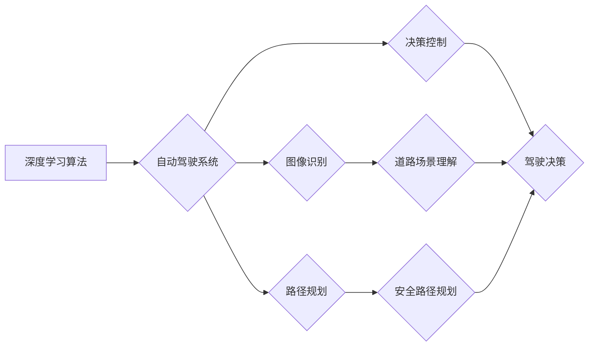

## 自动驾驶中的深度学习算法可解释性研究

> 关键词：深度学习、自动驾驶、可解释性、算法理解、模型透明度

## 1. 背景介绍

自动驾驶技术作为人工智能领域的重要应用之一，近年来取得了显著进展。深度学习算法在自动驾驶中的应用，例如图像识别、路径规划和决策控制，推动了自动驾驶技术的快速发展。然而，深度学习模型的复杂性和黑盒性质也带来了新的挑战。

自动驾驶系统需要在复杂、动态的环境中做出安全可靠的决策，而深度学习模型的决策过程往往难以被人类理解。这使得自动驾驶系统的安全性、可靠性和可信度受到质疑。因此，如何提高深度学习算法的可解释性，使其决策过程更加透明和可理解，成为自动驾驶技术发展的重要课题。

## 2. 核心概念与联系

### 2.1 深度学习算法

深度学习算法是一种基于多层神经网络的机器学习算法，能够从海量数据中学习复杂的特征表示和模式。在自动驾驶领域，深度学习算法广泛应用于图像识别、目标检测、场景理解、路径规划和决策控制等任务。

### 2.2 可解释性

可解释性是指机器学习模型的决策过程能够被人类理解和解释的能力。对于自动驾驶系统来说，可解释性意味着能够解释模型如何识别道路场景、预测其他车辆的行为、做出驾驶决策等。

### 2.3 算法理解与模型透明度

算法理解是指能够理解机器学习算法的内部工作机制，包括其输入、输出、决策过程以及影响决策的因素。模型透明度是指能够清晰地展示模型的结构、参数和决策规则，以便人类能够对其进行审查和评估。

**Mermaid 流程图**



## 3. 核心算法原理 & 具体操作步骤

### 3.1 算法原理概述

深度学习算法的可解释性研究主要集中在以下几个方面：

* **特征重要性分析:** 识别模型中哪些特征对决策结果影响最大，并解释这些特征的含义。
* **决策边界可视化:** 将模型的决策边界可视化，以便人类能够直观地理解模型如何将数据分类。
* **局部解释:** 对单个样本的预测结果进行解释，说明模型是如何做出该预测的。
* **全局解释:** 对模型的整体决策过程进行解释，理解模型的学习规律和决策机制。

### 3.2 算法步骤详解

**特征重要性分析:**

1. **选择特征重要性度量方法:** 常用的方法包括特征权重、SHAP值、LIME等。
2. **计算特征重要性得分:** 根据选择的度量方法，计算每个特征对模型预测结果的影响程度。
3. **排序特征重要性:** 将特征按照重要性得分进行排序，识别最重要的特征。

**决策边界可视化:**

1. **选择可视化方法:** 常用的方法包括决策树可视化、t-SNE降维可视化、决策边界图等。
2. **生成决策边界图:** 将模型的决策边界可视化，以便人类能够直观地理解模型如何将数据分类。

**局部解释:**

1. **选择局部解释方法:** 常用的方法包括LIME、SHAP等。
2. **生成局部解释结果:** 对单个样本的预测结果进行解释，说明模型是如何做出该预测的。

**全局解释:**

1. **选择全局解释方法:** 常用的方法包括决策树解释、模型蒸馏等。
2. **生成全局解释结果:** 对模型的整体决策过程进行解释，理解模型的学习规律和决策机制。

### 3.3 算法优缺点

**优点:**

* 可以提高对深度学习模型的理解和信任。
* 可以帮助识别模型的潜在偏差和错误。
* 可以指导模型的改进和优化。

**缺点:**

* 可解释性方法的复杂性和计算成本。
* 可解释性结果的准确性和可靠性。
* 可解释性方法与特定应用场景的匹配性。

### 3.4 算法应用领域

* **自动驾驶:** 解释自动驾驶系统如何识别道路场景、预测其他车辆的行为、做出驾驶决策等。
* **医疗诊断:** 解释深度学习模型如何诊断疾病、预测患者的风险等。
* **金融风险管理:** 解释深度学习模型如何识别欺诈行为、评估风险等。

## 4. 数学模型和公式 & 详细讲解 & 举例说明

### 4.1 数学模型构建

**特征重要性分析:**

假设我们有一个深度学习模型 $f(x)$，其中 $x$ 是输入特征向量，$f(x)$ 是模型的输出预测结果。特征重要性度量方法通常会计算每个特征对模型输出的影响程度。

例如，SHAP值 (SHapley Additive exPlanations) 是一种基于博弈论的特征重要性度量方法，它将每个特征的重要性分配到模型的预测结果中。

**公式:**

$$SHAP(i,x) = \sum_{S \subseteq N \setminus \{i\}} \left[ f(x_S \cup \{i\}) - f(x_S) \right]$$

其中，$N$ 是特征集，$i$ 是第 $i$ 个特征，$x_S$ 是特征集 $S$ 的特征向量。

**决策边界可视化:**

决策边界可视化通常使用降维技术将高维数据降到二维或三维空间，然后绘制决策边界。

例如，t-SNE (t-Distributed Stochastic Neighbor Embedding) 是一种非线性降维技术，可以有效地可视化高维数据的结构。

**局部解释:**

LIME (Local Interpretable Model-agnostic Explanations) 是一种局部解释方法，它通过在每个样本附近构建一个简单的线性模型来解释模型的预测结果。

**公式:**

$$LIME(x) = \arg\min_g \left[ \sum_{x' \in \mathcal{N}(x)} \left( f(x') - g(x') \right)^2 + \lambda \Omega(g) \right]$$

其中，$f(x)$ 是原始模型的预测结果，$g(x)$ 是局部线性模型的预测结果，$\mathcal{N}(x)$ 是样本 $x$ 的邻域，$\lambda$ 是正则化参数，$\Omega(g)$ 是局部线性模型的复杂度。

### 4.2 公式推导过程

公式推导过程涉及到数学统计、概率论、机器学习等领域的知识，具体推导过程可以参考相关文献和教程。

### 4.3 案例分析与讲解

**案例:**

假设我们有一个深度学习模型用于识别交通信号灯，模型的输入是图像，输出是信号灯的颜色。

**分析:**

我们可以使用SHAP值来分析模型对图像中不同区域的影响。例如，如果SHAP值表明模型对信号灯区域的特征影响最大，则说明模型主要依赖于信号灯的颜色信息来进行识别。

我们可以使用t-SNE降维可视化模型的决策边界，观察模型如何将不同颜色信号灯区分开来。

我们可以使用LIME解释模型对单个图像的预测结果，了解模型是如何识别该图像中的信号灯颜色的。

## 5. 项目实践：代码实例和详细解释说明

### 5.1 开发环境搭建

* Python 3.6+
* TensorFlow/PyTorch
* Jupyter Notebook

### 5.2 源代码详细实现

```python
# 使用SHAP值分析特征重要性
import shap

# 加载模型
model = load_model()

# 生成特征重要性图
shap.summary_plot(shap_values, X_test)

# 使用t-SNE降维可视化决策边界
import tsne

# 降维后的数据
X_embedded = tsne.fit_transform(X_test)

# 绘制决策边界图
plt.scatter(X_embedded[:, 0], X_embedded[:, 1], c=y_test)
plt.show()

# 使用LIME解释单个样本的预测结果
import lime

# 生成LIME解释结果
explainer = lime.LimeTabularExplainer(X_test.to_numpy())
explanation = explainer.explain_instance(X_test[0], model.predict, top_labels=1)

# 可视化LIME解释结果
explanation.as_list()
```

### 5.3 代码解读与分析

* **SHAP值分析:** 使用SHAP值可以分析模型对每个特征的影响程度，并生成特征重要性图。
* **t-SNE降维可视化:** 使用t-SNE降维技术可以将高维数据降到二维或三维空间，并绘制决策边界图。
* **LIME解释:** 使用LIME可以解释模型对单个样本的预测结果，并生成局部解释结果。

### 5.4 运行结果展示

运行上述代码后，可以生成特征重要性图、决策边界图和LIME解释结果，帮助我们理解模型的决策过程。

## 6. 实际应用场景

### 6.1 自动驾驶场景

* **事故原因分析:** 当自动驾驶车辆发生事故时，可解释性方法可以帮助分析事故原因，例如识别模型的决策错误或环境因素的影响。
* **驾驶行为分析:** 可解释性方法可以分析自动驾驶车辆的驾驶行为，例如加速、减速、转向等，并识别潜在的安全隐患。
* **用户信任建立:** 通过解释模型的决策过程，可以提高用户对自动驾驶系统的信任，促进自动驾驶技术的普及。

### 6.2 其他应用场景

* **医疗诊断:** 解释深度学习模型如何诊断疾病，帮助医生更好地理解模型的预测结果。
* **金融风险管理:** 解释深度学习模型如何识别欺诈行为，帮助金融机构更好地防范风险。
* **法律判决:** 解释深度学习模型如何进行法律判决，帮助法官更好地理解模型的决策依据。

### 6.4 未来应用展望

随着自动驾驶技术的不断发展，可解释性方法将发挥越来越重要的作用。未来，可解释性方法将被应用于更广泛的场景，例如：

* **自动驾驶系统的安全认证:** 可解释性方法可以帮助评估自动驾驶系统的安全性和可靠性，并为其安全认证提供依据。
* **自动驾驶系统的个性化定制:** 可解释性方法可以帮助用户理解模型的决策过程，并根据自己的需求进行个性化定制。
* **自动驾驶系统的伦理决策:** 可解释性方法可以帮助研究和解决自动驾驶系统中的伦理问题，例如如何处理紧急情况下的决策。

## 7. 工具和资源推荐

### 7.1 学习资源推荐

* **书籍:**
    * "Interpretable Machine Learning" by Christoph Molnar
    * "Deep Learning" by Ian Goodfellow, Yoshua Bengio, and Aaron Courville
* **在线课程:**
    * Coursera: "Machine Learning" by Andrew Ng
    * edX: "Deep Learning" by Microsoft
* **博客和网站:**
    * Towards Data Science
    * Machine Learning Mastery

### 7.2 开发工具推荐

* **SHAP:** https://github.com/slundberg/shap
* **LIME:** https://github.com/marcotcr/lime
* **TensorFlow:** https://www.tensorflow.org/
* **PyTorch:** https://pytorch.org/

### 7.3 相关论文推荐

* "SHAP: A Unified Approach to Interpreting Model Predictions" by Lundberg and Lee (2017)
* "Local Interpretable Model-agnostic Explanations" by Ribeiro, Singh, and Guestrin (2016)
* "Towards a Rigorous Science of Interpretable Machine Learning" by Guidotti et al. (2018)

## 8. 总结：未来发展趋势与挑战

### 8.1 研究成果总结

近年来，深度学习算法的可解释性研究取得了显著进展，涌现出许多有效的可解释性方法。这些方法能够帮助