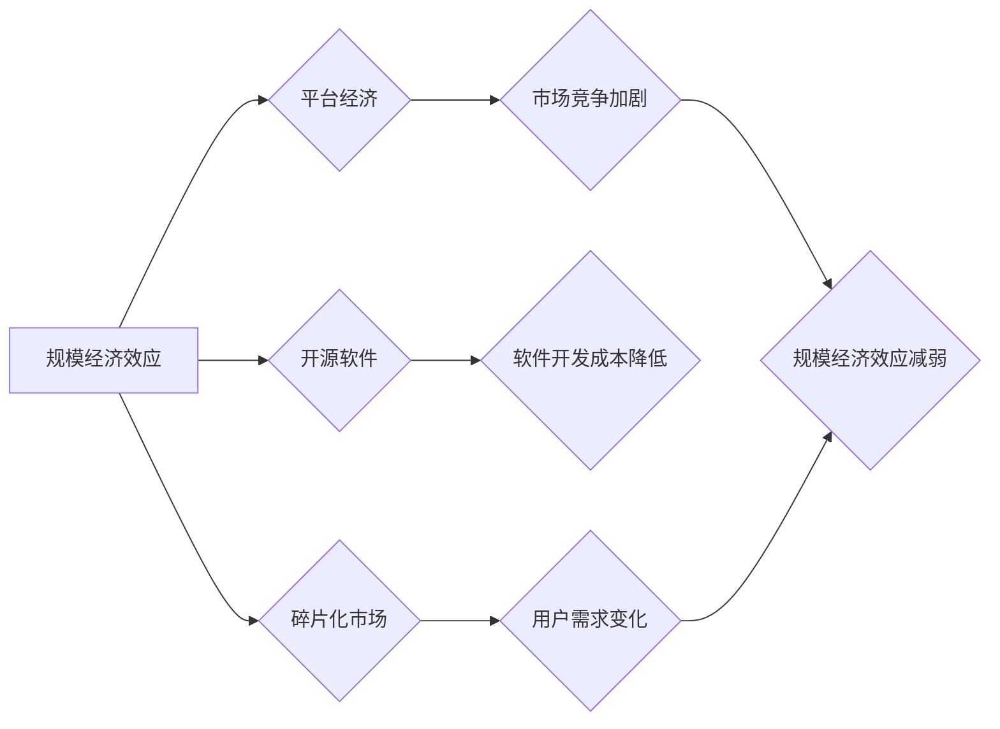

## 1. 背景介绍

在过去几十年中，规模经济效应一直是推动科技进步和经济增长的关键驱动力。随着技术的进步和互联网的普及，规模经济效应在软件开发、云计算、数据中心等领域得到了充分体现。然而，随着技术的演进和市场竞争的加剧，我们开始注意到规模经济效应的减弱趋势。

### 1.1  规模经济效应的定义

规模经济效应是指随着生产规模的扩大，单位成本下降的现象。在软件领域，规模经济效应主要体现在以下几个方面：

* **开发成本分摊：** 大型软件项目开发成本高昂，但随着用户数量的增加，开发成本可以分摊到更多用户身上，从而降低单位成本。
* **网络效应：** 一些软件产品具有网络效应，即用户数量越多，产品价值越高。例如，社交网络平台、电商平台等，用户越多，平台的活跃度和交易量就越高，吸引更多用户加入。
* **数据规模优势：** 大数据时代，拥有海量数据可以为软件产品提供更精准的分析和个性化服务，从而提升用户体验和商业价值。

### 1.2  规模经济效应的减弱趋势

尽管规模经济效应在过去几十年中发挥了重要作用，但近年来，我们开始注意到其减弱趋势。主要原因包括：

* **技术进步：** 随着云计算、容器化、微服务等技术的兴起，软件开发成本降低，小型团队也能开发出高质量的软件产品。
* **市场竞争加剧：** 软件市场竞争日益激烈，新兴的创业公司不断涌现，挑战传统巨头的市场地位。
* **用户需求变化：** 用户对软件产品的个性化需求越来越高，大型软件产品难以满足所有用户的需求。

## 2. 核心概念与联系

规模经济效应的减弱与以下几个核心概念密切相关：

* **平台经济：** 平台经济是指通过搭建平台连接供需双方，从中获取收益的商业模式。平台经济的兴起打破了传统行业壁垒，促进了市场竞争和创新。
* **开源软件：** 开源软件是指源代码公开可供他人修改和使用的软件。开源软件降低了软件开发成本，促进了软件创新和社区发展。
* **碎片化市场：** 随着用户需求的个性化，市场逐渐碎片化，大型软件产品难以满足所有用户的需求。

**Mermaid 流程图：**



## 3. 核心算法原理 & 具体操作步骤

规模经济效应的减弱与一些算法原理和操作步骤密切相关，例如：

### 3.1  算法原理概述

* **推荐算法：** 推荐算法根据用户的历史行为和偏好，推荐相关产品或服务。随着数据量的增加，推荐算法的精度不断提高，可以满足用户个性化需求。
* **个性化算法：** 个性化算法根据用户的特征和行为，定制个性化产品或服务。例如，电商平台根据用户的购买历史和浏览记录，推荐个性化商品。
* **微服务架构：** 微服务架构将大型软件系统分解成多个小型、独立的服务，每个服务负责特定的功能。微服务架构可以提高软件开发效率和灵活性，降低软件开发成本。

### 3.2  算法步骤详解

* **数据收集和预处理：** 收集用户数据，并进行清洗、转换和特征提取。
* **模型训练：** 使用机器学习算法训练推荐模型或个性化模型。
* **模型评估和优化：** 使用测试数据评估模型性能，并根据评估结果优化模型参数。
* **模型部署和监控：** 将训练好的模型部署到生产环境，并进行持续监控和维护。

### 3.3  算法优缺点

* **优点：** 可以提高软件产品的用户体验和商业价值，降低软件开发成本。
* **缺点：** 需要大量的数据进行训练，模型训练和部署成本较高，存在数据隐私和安全问题。

### 3.4  算法应用领域

* **电商平台：** 商品推荐、个性化营销
* **社交网络平台：** 内容推荐、用户匹配
* **音乐流媒体平台：** 音乐推荐、个性化播放列表
* **金融科技：** 风险评估、欺诈检测

## 4. 数学模型和公式 & 详细讲解 & 举例说明

规模经济效应可以用数学模型来描述。

### 4.1  数学模型构建

假设一个软件产品的开发成本为C，用户数量为N，单位成本为c。则可以建立以下数学模型：

$$c = \frac{C}{N}$$

### 4.2  公式推导过程

从上述模型可以看出，当用户数量N增加时，单位成本c会下降。

### 4.3  案例分析与讲解

例如，一个软件产品的开发成本为100万美元，用户数量为1000人，则单位成本为1000美元。如果用户数量增加到10000人，则单位成本会下降到100美元。

## 5. 项目实践：代码实例和详细解释说明

### 5.1  开发环境搭建

* 操作系统：Linux
* 编程语言：Python
* 开发工具：VS Code

### 5.2  源代码详细实现

```python
# 计算单位成本
def calculate_unit_cost(development_cost, user_count):
  unit_cost = development_cost / user_count
  return unit_cost

# 示例代码
development_cost = 1000000  # 开发成本
user_count = 1000  # 用户数量
unit_cost = calculate_unit_cost(development_cost, user_count)
print(f"单位成本: {unit_cost}")
```

### 5.3  代码解读与分析

* `calculate_unit_cost()` 函数接收开发成本和用户数量作为参数，计算并返回单位成本。
* 示例代码演示了如何使用该函数计算单位成本。

### 5.4  运行结果展示

```
单位成本: 1000
```

## 6. 实际应用场景

规模经济效应减弱的趋势在以下实际应用场景中体现明显：

* **SaaS 软件：** SaaS 软件的订阅模式降低了用户门槛，促进了小型企业和个人用户的采用。
* **移动应用：** 移动应用开发成本相对较低，更容易吸引小型团队和个人开发者。
* **开源软件社区：** 开源软件社区的兴起打破了传统软件开发模式，促进了软件创新和社区发展。

### 6.4  未来应用展望

随着技术的不断发展，规模经济效应减弱的趋势将更加明显。未来，我们将看到更多小型软件产品和服务涌现，满足用户个性化需求。

## 7. 工具和资源推荐

### 7.1  学习资源推荐

* **书籍：**
    * 《The Innovator's Dilemma》 by Clayton M. Christensen
    * 《Zero to One》 by Peter Thiel
* **在线课程：**
    * Coursera: Machine Learning
    * Udacity: Artificial Intelligence Nanodegree

### 7.2  开发工具推荐

* **云计算平台：** AWS, Azure, Google Cloud
* **容器化平台：** Docker, Kubernetes
* **代码托管平台：** GitHub, GitLab

### 7.3  相关论文推荐

* **The Economics of Scale and Scope** by Alfred Marshall
* **Platform Competition in the Digital Economy** by Jean Tirole

## 8. 总结：未来发展趋势与挑战

### 8.1  研究成果总结

规模经济效应减弱的趋势是科技发展和市场竞争的必然结果。

### 8.2  未来发展趋势

* **个性化定制：** 软件产品将更加个性化，满足用户多样化的需求。
* **碎片化市场：** 市场将更加碎片化，小型软件产品和服务将占据更大的市场份额。
* **开源软件发展：** 开源软件社区将继续发展壮大，推动软件创新和开源文化。

### 8.3  面临的挑战

* **数据隐私和安全：** 个性化软件产品需要收集和使用大量用户数据，如何保护用户隐私和数据安全是一个重要挑战。
* **算法偏见：** 算法模型可能存在偏见，导致不公平的结果。如何解决算法偏见是一个重要的研究课题。
* **技术人才短缺：** 软件开发领域需要大量技术人才，如何培养和吸引技术人才是一个重要的挑战。

### 8.4  研究展望

未来，我们需要继续研究规模经济效应减弱的机制和影响，探索新的软件开发模式和商业模式，并解决数据隐私、算法偏见等挑战，推动软件行业健康发展。

## 9. 附录：常见问题与解答

* **问题：** 规模经济效应减弱会对大型软件公司造成什么影响？
* **答案：** 规模经济效应减弱会迫使大型软件公司更加注重创新和用户体验，并探索新的商业模式。

* **问题：** 开源软件如何应对规模经济效应减弱的趋势？
* **答案：** 开源软件可以利用社区的力量和协同开发模式，降低开发成本，并提供更加灵活和定制化的解决方案。


作者：禅与计算机程序设计艺术 / Zen and the Art of Computer Programming 
