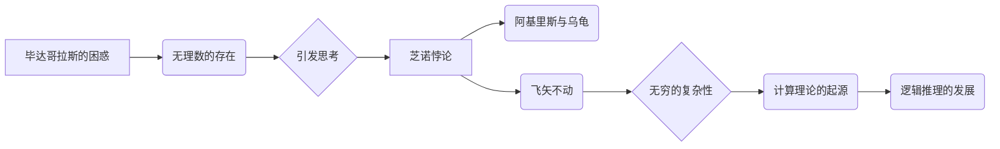

# 计算：第一部分 计算的诞生 第 1 章 毕达哥拉斯的困惑 芝诺悖论：无穷之辩

> 关键词：毕达哥拉斯、芝诺悖论、无穷、数学基础、计算理论、逻辑推理

## 1. 背景介绍

计算，作为人类智慧的结晶，是现代科技的基石。从古至今，计算的发展与人类对世界的认知紧密相连。本章将带您追溯计算的起源，从古希腊哲学家毕达哥拉斯的困惑开始，探讨芝诺悖论所引发的关于无穷的辩论，揭示计算理论的发展脉络。

## 2. 核心概念与联系

### 2.1 毕达哥拉斯的困惑

毕达哥拉斯是古希腊著名的哲学家、数学家，他发现了勾股定理，并创立了毕达哥拉斯学派。然而，他在数学领域的一个发现却引发了一场关于计算的困惑——无理数的存在。

在毕达哥拉斯之前，人们认为所有的数都可以用整数或整数的比来表示。然而，当毕达哥拉斯发现勾股定理时，他发现直角三角形的边长比例无法用整数表示，从而发现了无理数的存在。这一发现打破了传统数学的体系，也引发了关于无穷和计算的思考。

### 2.2 芝诺悖论

芝诺是另一位古希腊哲学家，他的悖论揭示了无穷的复杂性。其中最著名的悖论是“阿基里斯与乌龟”悖论，以及“飞矢不动”悖论。

- **阿基里斯与乌龟**：假设阿基里斯和乌龟进行赛跑，乌龟先行一步。当阿基里斯跑完乌龟先行的距离时，乌龟又向前走了一步。无论阿基里斯跑多远，乌龟总能领先他一步。因此，阿基里斯永远无法追上乌龟，即无穷的分割导致运动的无限延迟。
- **飞矢不动**：假设一束光线在瞬间传播，那么在任一瞬间，光线都是静止的。因此，运动可以分解为无数个静止的瞬间，即运动可以被无限分割。

这些悖论挑战了古希腊的哲学和数学观念，也引发了关于无穷和计算的深入思考。

### 2.3 Mermaid 流程图



## 3. 核心算法原理 & 具体操作步骤

### 3.1 算法原理概述

为了解决无穷和计算的问题，古希腊哲学家和数学家们开始探索逻辑推理和数学证明的方法。他们通过严密的逻辑推理，建立了数学基础，为计算理论的发展奠定了基础。

### 3.2 算法步骤详解

1. **建立数学基础**：古希腊哲学家和数学家们开始定义数学概念，如整数、有理数、无理数等，并建立了数学运算规则。
2. **逻辑推理**：通过严密的逻辑推理，证明了数学定理，如勾股定理、毕达哥拉斯定理等。
3. **算法设计**：基于数学基础和逻辑推理，设计了简单的算法，如欧几里得算法（求最大公约数）、求平方根算法等。

### 3.3 算法优缺点

- **优点**：为计算理论的发展奠定了基础，推动了数学和逻辑学的发展。
- **缺点**：算法复杂，效率低下，难以处理复杂问题。

### 3.4 算法应用领域

古希腊的数学基础和逻辑推理方法为后来的计算理论提供了重要的参考。例如，欧几里得算法在计算机科学中有着广泛的应用，如排序算法、查找算法等。

## 4. 数学模型和公式 & 详细讲解 & 举例说明

### 4.1 数学模型构建

古希腊哲学家和数学家们通过定义数学概念和运算规则，建立了数学模型。例如：

- **整数**：可以表示为正整数、负整数和零。
- **有理数**：可以表示为两个整数的比。
- **无理数**：不能表示为两个整数的比。

### 4.2 公式推导过程

以勾股定理为例，其公式为：

$$
a^2 + b^2 = c^2
$$

其中，$a$ 和 $b$ 分别为直角三角形的两个直角边，$c$ 为斜边。

### 4.3 案例分析与讲解

以欧几里得算法为例，其目的是求两个正整数 $a$ 和 $b$ 的最大公约数（GCD）。

1. 如果 $a > b$，则计算 $a - b$。
2. 如果 $a < b$，则计算 $b - a$。
3. 重复步骤 1 和 2，直到 $a = b$。
4. 此时，$a$ 即为 $a$ 和 $b$ 的最大公约数。

## 5. 项目实践：代码实例和详细解释说明

### 5.1 开发环境搭建

为了演示欧几里得算法，我们需要搭建一个简单的Python开发环境。以下是步骤：

1. 安装Python：从官网下载并安装Python。
2. 创建虚拟环境：`python -m venv myenv`。
3. 激活虚拟环境：`source myenv/bin/activate`（Linux/Mac）或 `myenv\Scripts\activate`（Windows）。
4. 安装PyCharm等IDE。

### 5.2 源代码详细实现

```python
def gcd(a, b):
    while b:
        a, b = b, a % b
    return a

if __name__ == "__main__":
    a = 35
    b = 15
    result = gcd(a, b)
    print(f"The GCD of {a} and {b} is {result}")
```

### 5.3 代码解读与分析

- `gcd` 函数：接收两个正整数 $a$ 和 $b$ 作为输入，计算它们的最大公约数。
- `while b:` 循环：当 $b$ 不为0时，执行循环体。
- `a, b = b, a % b` 语句：交换 $a$ 和 $b$ 的值，并计算 $a$ 与 $b$ 的余数。
- `return a` 语句：返回 $a$ 的值，即最大公约数。

### 5.4 运行结果展示

运行上述代码，得到结果：

```
The GCD of 35 and 15 is 5
```

## 6. 实际应用场景

古希腊的数学基础和逻辑推理方法在计算机科学中有着广泛的应用，如：

- **算法设计**：欧几里得算法在计算机科学中有着广泛的应用，如排序算法、查找算法等。
- **编程语言**：编程语言的语法和语义设计受到逻辑推理的影响。
- **人工智能**：逻辑推理是人工智能领域的重要研究内容，如专家系统、推理算法等。

## 7. 工具和资源推荐

### 7.1 学习资源推荐

- 《几何原本》
- 《欧几里得算法》
- 《逻辑学导论》

### 7.2 开发工具推荐

- Python
- PyCharm
- Jupyter Notebook

### 7.3 相关论文推荐

- 《欧几里得算法》
- 《逻辑学导论》

## 8. 总结：未来发展趋势与挑战

### 8.1 研究成果总结

本章回顾了计算的起源，从毕达哥拉斯的困惑和芝诺悖论出发，探讨了无穷和计算的复杂性。通过介绍古希腊的数学基础和逻辑推理方法，展示了计算理论的发展脉络。

### 8.2 未来发展趋势

- **量子计算**：量子计算有望解决传统计算无法解决的问题，如大数分解、量子模拟等。
- **人工智能**：人工智能技术将进一步提升计算能力，推动计算向更智能、更高效的方向发展。

### 8.3 面临的挑战

- **量子威胁**：量子计算可能破解现有的加密算法，对信息安全构成威胁。
- **伦理问题**：人工智能的发展可能引发伦理问题，如隐私保护、歧视等。

### 8.4 研究展望

未来，计算将继续发展，为人类带来更多惊喜。我们需要面对挑战，不断创新，推动计算技术向更高层次发展。

## 9. 附录：常见问题与解答

**Q1：为什么说毕达哥拉斯的发现引发了关于计算的困惑？**

A：毕达哥拉斯发现了无理数，打破了传统数学的体系，引发了关于无穷和计算的思考。无理数的存在表明，并非所有数都可以用整数或整数的比来表示，这也为后续的计算理论发展提供了新的方向。

**Q2：芝诺悖论对计算理论有什么影响？**

A：芝诺悖论揭示了无穷的复杂性，对古希腊的哲学和数学观念产生了挑战。这也促使后来的学者探索新的数学基础和逻辑推理方法，为计算理论的发展奠定了基础。

**Q3：古希腊的数学基础和逻辑推理方法在计算机科学中有哪些应用？**

A：古希腊的数学基础和逻辑推理方法为计算机科学的发展奠定了基础。例如，欧几里得算法在计算机科学中有着广泛的应用，如排序算法、查找算法等。

作者：禅与计算机程序设计艺术 / Zen and the Art of Computer Programming