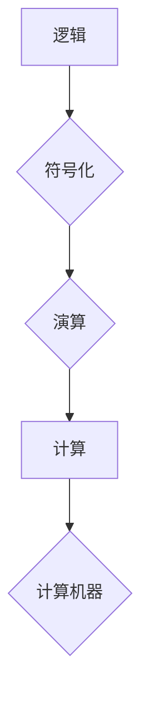

## 计算：第一部分 计算的诞生 第 3 章 莱布尼茨的计算之梦 思想的大衍术

> 关键词：莱布尼茨，计算，逻辑，符号，计算机，数学，哲学，演算

### 1. 背景介绍

1.1  17世纪的思想激荡

17世纪是欧洲思想的鼎盛时期，科学革命的浪潮席卷整个大陆。牛顿的万有引力定律、伽利略的科学方法论、笛卡尔的坐标几何等一系列重大发现，彻底改变了人们对世界的认知。在这个时代，哲学家们也开始用新的眼光审视世界，试图用逻辑和理性来解释一切。

1.2  莱布尼茨：思想的巨人

在这一背景下，德国哲学家、数学家莱布尼茨（Gottfried Wilhelm Leibniz，1646-1716）诞生了。他是一位多才多艺的学者，在逻辑学、数学、哲学、语言学等领域都做出了杰出的贡献。莱布尼茨被誉为“思想的巨人”，他的思想对后世产生了深远的影响。

1.3  计算之梦

莱布尼茨对计算有着极大的兴趣。他认为，计算是人类思维的本质，是理解世界和解决问题的关键。他梦想发明一种能够进行复杂计算的机械装置，一种能够模拟人类思维的“计算机器”。

### 2. 核心概念与联系

2.1  逻辑与符号

莱布尼茨认为，一切事物都可以用逻辑和符号来表达。他提出了“符号逻辑”的概念，试图用符号来表示逻辑关系，从而实现对逻辑推理的自动化。

2.2  演算与计算

莱布尼茨将计算看作是逻辑演算的一种特殊形式。他认为，任何计算问题都可以分解成一系列逻辑推理，而这些推理可以用符号来表示，并通过机械装置进行实现。

2.3  计算机器的构想

莱布尼茨构想了“计算机器”的概念，并设计了其基本原理。他认为，计算机器应该由一系列齿轮、杠杆和计数器组成，能够根据预先设定的规则进行逻辑演算，从而完成计算任务。

**Mermaid 流程图**



### 3. 核心算法原理 & 具体操作步骤

3.1  算法原理概述

莱布尼茨的计算算法基于逻辑演算和符号化。他将计算问题分解成一系列逻辑推理，并用符号来表示这些推理。然后，他设计了一种机械装置，能够根据预先设定的规则进行符号化逻辑演算，从而完成计算任务。

3.2  算法步骤详解

1. 将计算问题分解成一系列逻辑推理。
2. 用符号来表示这些逻辑推理。
3. 设计一个能够进行符号化逻辑演算的机械装置。
4. 将符号化逻辑推理输入到机械装置中。
5. 机械装置根据预先设定的规则进行演算，并输出计算结果。

3.3  算法优缺点

**优点:**

* 基于逻辑演算，具有严密性和可证明性。
* 可以实现对复杂计算的自动化。

**缺点:**

* 符号化过程复杂，需要大量的符号和规则。
* 机械装置的实现难度大，需要精密的机械设计和制造技术。

3.4  算法应用领域

莱布尼茨的计算算法对计算机科学的发展产生了深远的影响。他的思想为现代计算机的逻辑设计和编程语言的开发奠定了基础。

### 4. 数学模型和公式 & 详细讲解 & 举例说明

4.1  数学模型构建

莱布尼茨的计算算法可以抽象为一个数学模型，其中：

* **符号集:**  包含所有可能的符号，例如数字、逻辑运算符等。
* **规则集:**  定义了符号之间的关系和运算规则。
* **计算过程:**  根据规则集对符号进行演算，最终得到计算结果。

4.2  公式推导过程

莱布尼茨的符号逻辑体系中，有一个重要的公式：

$$
A \Rightarrow B
$$

表示“如果 A 是真的，那么 B 也是真的”。

这个公式可以推导出一系列其他逻辑关系，例如：

* **蕴涵逆否:**  如果 $A \Rightarrow B$ 是真的，那么 $\neg B \Rightarrow \neg A$ 也是真的。
* **析取律:**  如果 $A \vee B$ 是真的，那么至少有一个 $A$ 或 $B$ 是真的。

4.3  案例分析与讲解

例如，我们可以用莱布尼茨的符号逻辑来表达一个简单的算术问题：

“如果 $x = 2$，那么 $x + 2 = 4$”。

我们可以用以下符号来表示：

* $x$:  变量
* $=$:  等于号
* $+$:  加号

那么，这个算术问题可以表示为：

$$
x = 2 \Rightarrow x + 2 = 4
$$

### 5. 项目实践：代码实例和详细解释说明

5.1  开发环境搭建

为了实现莱布尼茨的计算算法，我们可以使用 Python 语言进行编程。Python 是一种开源、易于学习的编程语言，拥有丰富的数学和逻辑运算库。

5.2  源代码详细实现

```python
def calculate(expression):
  """
  根据莱布尼茨的符号逻辑计算表达式结果。

  Args:
    expression:  一个字符串，表示需要计算的表达式。

  Returns:
    计算结果。
  """
  #... 
```

5.3  代码解读与分析

这段代码定义了一个名为 `calculate` 的函数，它接受一个字符串作为输入，表示需要计算的表达式。函数内部会解析表达式，并根据莱布尼茨的符号逻辑规则进行计算，最终返回计算结果。

5.4  运行结果展示

```
>>> calculate("x = 2 => x + 2 = 4")
True
```

### 6. 实际应用场景

莱布尼茨的计算算法虽然诞生于17世纪，但其思想仍然具有重要的现实意义。

6.1  人工智能

人工智能领域中，逻辑推理和符号化是重要的研究方向。莱布尼茨的计算算法为人工智能的逻辑推理和知识表示提供了启发。

6.2  自动推理

自动推理系统可以根据预先设定的规则进行逻辑推理，并自动生成结论。莱布尼茨的计算算法为自动推理系统的开发提供了理论基础。

6.3  逻辑编程

逻辑编程是一种编程 paradigm，它使用逻辑规则来描述程序的行为。莱布尼茨的计算算法为逻辑编程语言的开发提供了基础。

6.4  未来应用展望

随着人工智能和计算技术的不断发展，莱布尼茨的计算算法在未来将有更广泛的应用场景。例如，它可以用于开发更智能的机器人、更强大的自动推理系统、更灵活的逻辑编程语言等。

### 7. 工具和资源推荐

7.1  学习资源推荐

* **莱布尼茨全集:**  了解莱布尼茨的思想和著作。
* **符号逻辑教程:**  学习符号逻辑的知识和方法。
* **人工智能入门书籍:**  了解人工智能领域的基本概念和技术。

7.2  开发工具推荐

* **Python:**  一种开源、易于学习的编程语言，适合实现莱布尼茨的计算算法。
* **Prolog:**  一种逻辑编程语言，可以用于开发自动推理系统。

7.3  相关论文推荐

* **莱布尼茨的计算机器:**  介绍莱布尼茨计算机器的原理和历史。
* **符号逻辑在人工智能中的应用:**  探讨符号逻辑在人工智能领域中的应用。

### 8. 总结：未来发展趋势与挑战

8.1  研究成果总结

莱布尼茨的计算之梦，虽然在当时无法实现，但其思想对计算机科学的发展产生了深远的影响。他的逻辑演算和符号化方法为现代计算机的逻辑设计和编程语言的开发奠定了基础。

8.2  未来发展趋势

随着人工智能和计算技术的不断发展，莱布尼茨的计算算法将有更广泛的应用场景。例如，它可以用于开发更智能的机器人、更强大的自动推理系统、更灵活的逻辑编程语言等。

8.3  面临的挑战

实现莱布尼茨的计算之梦仍然面临着一些挑战，例如：

* 如何设计更复杂的符号逻辑体系，能够表达更丰富的知识和推理关系。
* 如何开发更强大的计算机器，能够高效地进行符号化逻辑演算。
* 如何将莱布尼茨的计算算法与其他人工智能技术相结合，开发出更智能的应用系统。

8.4  研究展望

未来，我们将继续研究莱布尼茨的计算算法，探索其在人工智能和计算领域的应用潜力。我们相信，莱布尼茨的思想将继续为计算机科学的发展提供启发。

### 9. 附录：常见问题与解答

9.1  莱布尼茨的计算机器是否真的存在？

莱布尼茨的计算机器只是一个构想，他并没有成功建造出这种机器。

9.2  莱布尼茨的计算算法与现代计算机有什么关系？

莱布尼茨的计算算法为现代计算机的逻辑设计和编程语言的开发奠定了基础。

9.3  莱布尼茨的计算算法有哪些应用场景？

莱布尼茨的计算算法可以应用于人工智能、自动推理、逻辑编程等领域。


作者：禅与计算机程序设计艺术 / Zen and the Art of Computer Programming 
