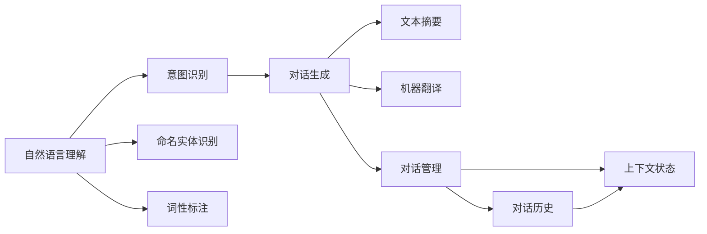
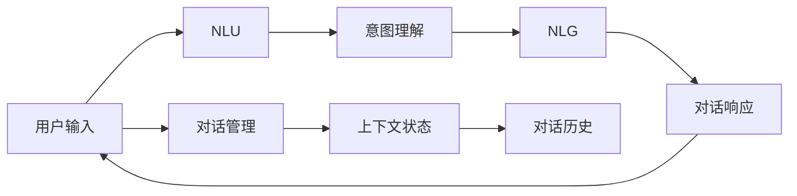
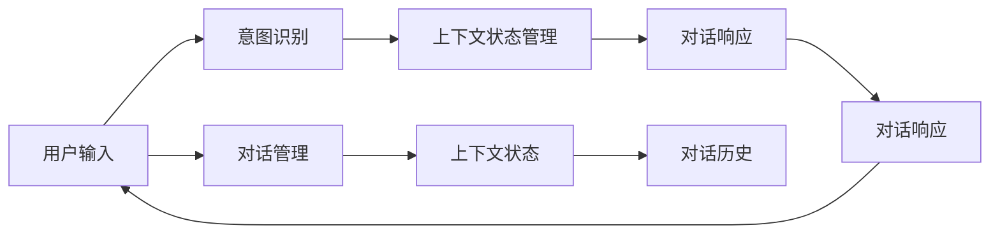
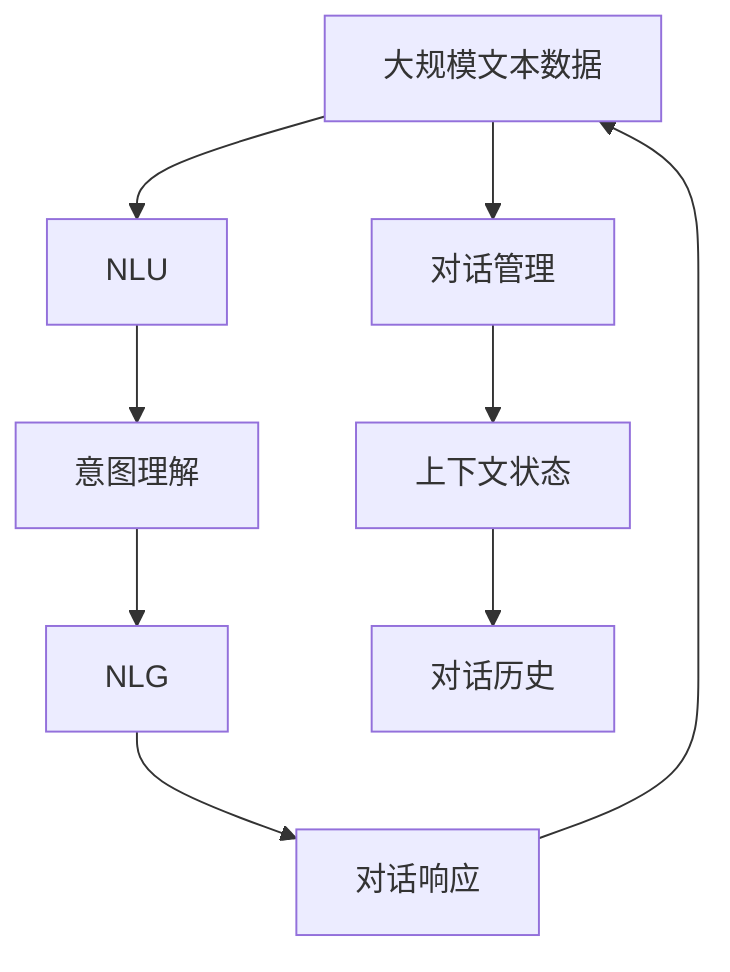

                 

# 自然语言交互与对话系统原理与代码实战案例讲解

> 关键词：自然语言交互,对话系统,自然语言理解(NLU),自然语言生成(NLG),深度学习,深度学习框架,对话管理,自然语言处理,机器翻译,问答系统

## 1. 背景介绍

### 1.1 问题由来
近年来，随着人工智能技术的发展，自然语言交互(Natural Language Interaction, NLI)和对话系统(Dialogue System)成为了热门的研究方向。这些系统通过模拟人类的语言交流方式，为用户提供语音识别、文本理解、意图识别、对话管理等功能，极大地提升了用户体验。然而，由于语言的多样性和复杂性，构建一个高质量的对话系统仍然是一个极具挑战性的任务。

### 1.2 问题核心关键点
构建一个高效的自然语言交互与对话系统，主要包括以下几个关键点：
- 自然语言理解(Natural Language Understanding, NLU)：解析用户的输入文本，理解其背后的意图和语义。
- 自然语言生成(Natural Language Generation, NLG)：根据用户的意图和语境，生成自然流畅的响应文本。
- 对话管理(Dialogue Management)：记录对话历史，控制对话流程，管理上下文状态。
- 数据收集与标注：构建高质量的对话数据集，对系统进行训练和验证。

### 1.3 问题研究意义
研究自然语言交互与对话系统，对于提升人机交互的智能水平，改善用户体验，具有重要意义：
- 提升交互效率：通过自然语言交互，用户可以以自然、流畅的方式与系统进行沟通，减少输入的时间和精力。
- 增强体验感：对话系统可以处理复杂任务，解答用户问题，提供个性化的服务，提升用户的满意度。
- 辅助决策：对话系统能够帮助用户从大量信息中筛选关键点，辅助决策过程，提供多维度的信息支持。
- 扩展应用场景：对话系统可以应用于客服、教育、医疗等多个领域，推动相关行业的数字化转型升级。

## 2. 核心概念与联系

### 2.1 核心概念概述

为了更好地理解自然语言交互与对话系统，本节将介绍几个密切相关的核心概念：

- 自然语言理解(NLU)：解析用户的输入文本，理解其背后的意图和语义。常见的NLU任务包括分词、词性标注、命名实体识别、意图识别等。
- 自然语言生成(NLG)：根据用户的意图和语境，生成自然流畅的响应文本。NLG包括文本摘要、机器翻译、对话生成等任务。
- 对话管理(DM)：记录对话历史，控制对话流程，管理上下文状态。对话管理可以采用状态机、信念状态空间等模型表示对话状态。
- 深度学习框架(Deep Learning Framework)：如TensorFlow、PyTorch等，用于构建和训练自然语言交互与对话系统的模型。

这些概念之间的逻辑关系可以通过以下Mermaid流程图来展示：



这个流程图展示了大语言交互与对话系统中的关键任务和组件：

1. 输入解析：包括分词、词性标注、命名实体识别等NLU任务。
2. 意图理解：通过意图识别任务，解析用户的输入意图。
3. 响应生成：对话生成任务，根据意图生成自然语言响应。
4. 对话管理：维护对话历史和上下文状态，控制对话流程。

### 2.2 概念间的关系

这些核心概念之间存在着紧密的联系，形成了自然语言交互与对话系统的完整生态系统。下面我通过几个Mermaid流程图来展示这些概念之间的关系。

#### 2.2.1 自然语言交互与对话系统的整体架构



这个流程图展示了自然语言交互与对话系统的一般流程：

1. 用户输入文本，经过NLU解析。
2. 意图理解模块解析出用户意图。
3. NLG模块生成响应文本。
4. 对话管理模块维护上下文状态和对话历史。
5. 响应文本作为输出返回给用户。

#### 2.2.2 意图理解与上下文状态管理



这个流程图展示了意图理解与上下文状态管理之间的紧密联系：

1. 用户输入文本，意图识别解析出意图。
2. 上下文状态管理模块更新当前上下文状态。
3. 对话响应模块生成响应文本。
4. 对话管理模块维护上下文状态和对话历史。
5. 响应文本作为输出返回给用户。

### 2.3 核心概念的整体架构

最后，我们用一个综合的流程图来展示这些核心概念在大语言交互与对话系统中的整体架构：



这个综合流程图展示了从预训练到微调，再到持续学习的完整过程。自然语言交互与对话系统首先在大规模文本数据上进行预训练，然后通过微调对特定任务进行适配，最后通过持续学习技术，模型能够不断学习新知识，同时避免遗忘旧知识。 通过这些流程图，我们可以更清晰地理解自然语言交互与对话系统的工作原理和优化方向。

## 3. 核心算法原理 & 具体操作步骤
### 3.1 算法原理概述

自然语言交互与对话系统的核心算法原理基于深度学习和自然语言处理(NLP)技术。其核心思想是通过深度学习模型对自然语言进行理解和生成，结合对话管理技术，构建出高效、智能的对话系统。

形式化地，假设对话系统中的模型为 $M_{\theta}$，其中 $\theta$ 为模型的参数。设输入文本为 $x$，输出文本为 $y$，对话管理模块为 $D$。对话系统的目标是最小化预测文本与真实文本之间的差异，即：

$$
\mathcal{L}(M_{\theta}, D, x) = \sum_{i=1}^N \ell(M_{\theta}(D(x, x_{<i})), y_i)
$$

其中 $\ell$ 为损失函数，通常包括交叉熵损失、KL散度损失等。$x_{<i}$ 表示对话历史，即之前的所有输入文本。

### 3.2 算法步骤详解

自然语言交互与对话系统的一般步骤包括：

**Step 1: 准备预训练模型和数据集**
- 选择合适的深度学习框架，如TensorFlow、PyTorch等，搭建对话系统。
- 准备对话系统所需的大规模文本数据，并进行预处理（如分词、去停用词等）。
- 构建对话数据集，标注意图和语义，准备用于微调和评估。

**Step 2: 添加意图识别模块**
- 在预训练模型的基础上，添加意图识别模块，用于解析用户输入的意图。
- 设计合适的意图识别模型，如使用Transformer等深度学习模型。
- 添加损失函数和优化器，如交叉熵损失和Adam优化器，训练意图识别模型。

**Step 3: 添加对话管理模块**
- 根据对话系统的架构设计对话管理模块，记录对话历史和上下文状态。
- 设计对话管理算法，如使用信念状态空间模型。
- 训练对话管理模块，使其能够根据对话历史和上下文状态生成合适的对话响应。

**Step 4: 添加响应生成模块**
- 在预训练模型的基础上，添加响应生成模块，用于根据意图生成自然语言响应。
- 设计合适的响应生成模型，如使用Transformer等深度学习模型。
- 添加损失函数和优化器，如交叉熵损失和Adam优化器，训练响应生成模型。

**Step 5: 集成测试**
- 将意图识别、对话管理和响应生成模块集成到对话系统中。
- 构建测试数据集，对集成后的对话系统进行测试和评估。
- 调整模型参数和超参数，优化系统性能。

### 3.3 算法优缺点

自然语言交互与对话系统有以下优点：

1. 高效智能：深度学习模型能够处理大规模自然语言数据，具备较强的自然语言理解和生成能力。
2. 灵活性高：对话系统可以根据任务需求进行微调，适应不同的应用场景。
3. 用户体验好：自然语言交互方式简洁、自然，提升了用户体验。
4. 可扩展性强：对话系统可以根据需要进行模块扩展和功能增强。

同时，该系统也存在一些局限性：

1. 依赖标注数据：意图识别和响应生成模块需要大量标注数据进行训练，标注成本较高。
2. 鲁棒性不足：对话系统在面对域外数据时，泛化性能可能不佳。
3. 可解释性不足：深度学习模型往往难以解释其内部工作机制。
4. 资源消耗大：大规模深度学习模型需要大量的计算资源和存储空间。

### 3.4 算法应用领域

自然语言交互与对话系统已经在多个领域得到了广泛的应用，例如：

- 客服系统：构建智能客服机器人，处理客户咨询、问题解答、订单管理等任务。
- 教育系统：开发智能教育助手，提供学习资源推荐、作业批改、学习效果评估等服务。
- 医疗系统：构建智能医疗助手，提供健康咨询、疾病查询、医学文献推荐等医疗服务。
- 语音助手：开发智能语音助手，如Siri、Google Assistant、Amazon Alexa等，进行语音交互和任务执行。
- 智能家居：构建智能家居对话系统，如通过语音控制家电、查询天气信息等。

除了上述这些领域，自然语言交互与对话系统还在智能交通、智能制造、智能金融等多个领域得到了应用，展现了其强大的应用潜力和广阔的应用前景。

## 4. 数学模型和公式 & 详细讲解  
### 4.1 数学模型构建

本节将使用数学语言对自然语言交互与对话系统的数学模型进行严格刻画。

记自然语言交互与对话系统的模型为 $M_{\theta}$，其中 $\theta$ 为模型的参数。设输入文本为 $x$，输出文本为 $y$，对话管理模块为 $D$。对话系统的目标是最小化预测文本与真实文本之间的差异，即：

$$
\mathcal{L}(M_{\theta}, D, x) = \sum_{i=1}^N \ell(M_{\theta}(D(x, x_{<i})), y_i)
$$

其中 $\ell$ 为损失函数，通常包括交叉熵损失、KL散度损失等。$x_{<i}$ 表示对话历史，即之前的所有输入文本。

### 4.2 公式推导过程

以下我们以二分类任务为例，推导交叉熵损失函数及其梯度的计算公式。

假设模型 $M_{\theta}$ 在输入 $x$ 上的输出为 $\hat{y}=M_{\theta}(x) \in [0,1]$，表示样本属于正类的概率。真实标签 $y \in \{0,1\}$。则二分类交叉熵损失函数定义为：

$$
\ell(M_{\theta}(x),y) = -[y\log \hat{y} + (1-y)\log (1-\hat{y})]
$$

将其代入经验风险公式，得：

$$
\mathcal{L}(\theta) = -\frac{1}{N}\sum_{i=1}^N [y_i\log M_{\theta}(D(x, x_{<i})), y_i]
$$

根据链式法则，损失函数对参数 $\theta_k$ 的梯度为：

$$
\frac{\partial \mathcal{L}(\theta)}{\partial \theta_k} = -\frac{1}{N}\sum_{i=1}^N (\frac{y_i}{M_{\theta}(D(x, x_{<i}))} - \frac{1-y_i}{1-M_{\theta}(D(x, x_{<i}))}) \frac{\partial M_{\theta}(D(x, x_{<i}))}{\partial \theta_k}
$$

其中 $\frac{\partial M_{\theta}(D(x, x_{<i}))}{\partial \theta_k}$ 可进一步递归展开，利用自动微分技术完成计算。

在得到损失函数的梯度后，即可带入参数更新公式，完成模型的迭代优化。重复上述过程直至收敛，最终得到适应对话任务的最优模型参数 $\theta^*$。

## 5. 项目实践：代码实例和详细解释说明
### 5.1 开发环境搭建

在进行对话系统开发前，我们需要准备好开发环境。以下是使用Python进行PyTorch开发的环境配置流程：

1. 安装Anaconda：从官网下载并安装Anaconda，用于创建独立的Python环境。

2. 创建并激活虚拟环境：
```bash
conda create -n dialog-env python=3.8 
conda activate dialog-env
```

3. 安装PyTorch：根据CUDA版本，从官网获取对应的安装命令。例如：
```bash
conda install pytorch torchvision torchaudio cudatoolkit=11.1 -c pytorch -c conda-forge
```

4. 安装必要的库：
```bash
pip install numpy pandas scikit-learn tensorflow transformers sentencepiece sentencepiece-opencv
```

5. 安装PyTorch Lightning：用于加速模型的训练和推理。
```bash
pip install torchlightning
```

完成上述步骤后，即可在`dialog-env`环境中开始对话系统开发。

### 5.2 源代码详细实现

下面以智能客服系统为例，给出使用PyTorch构建自然语言交互与对话系统的完整代码实现。

首先，定义客服系统的意图识别模块：

```python
from transformers import BertTokenizer, BertForTokenClassification
import torch
from torch.utils.data import DataLoader
from sklearn.metrics import accuracy_score, precision_score, recall_score, f1_score

class IntentClassifier(BertForTokenClassification):
    def __init__(self, num_labels=3):
        super(IntentClassifier, self).__init__()
        self.num_labels = num_labels
        self.dropout = BertForTokenClassification.dropout
        
    def forward(self, input_ids, attention_mask, token_type_ids=None, labels=None):
        outputs = super(IntentClassifier, self).forward(
            input_ids, attention_mask=attention_mask, token_type_ids=token_type_ids, labels=labels)
        pooled_output = outputs[1]
        pooled_output = self.dropout(pooled_output)
        logits = self.classifier(pooled_output)
        return logits

# 加载BERT模型
tokenizer = BertTokenizer.from_pretrained('bert-base-cased')
model = IntentClassifier(num_labels=3)
```

然后，定义对话管理模块：

```python
class DialogueManager:
    def __init__(self, model, intent_classifier, num_slots=3):
        self.model = model
        self.intent_classifier = intent_classifier
        self.num_slots = num_slots
        self.beliefs = {'observed': [], 'hidden': []}
        self.current_state = {}
    
    def update_state(self, observation):
        self.current_state = observation
        self.beliefs['observed'].append(observation)
    
    def generate_response(self, observation):
        # 使用意图识别模型预测用户意图
        inputs = tokenizer.encode(observation['text'], return_tensors='pt')
        with torch.no_grad():
            intent_logits = self.intent_classifier(inputs, attention_mask=inputs.new_ones([1]))
            intent = torch.argmax(intent_logits[0])
        # 使用对话管理模型生成响应
        response = self.model.generate(observation['text'])
        return response, intent
```

接下来，定义响应生成模块：

```python
class ResponseGenerator:
    def __init__(self, model, num_tokens):
        self.model = model
        self.num_tokens = num_tokens
    
    def generate_response(self, observation, intent):
        inputs = tokenizer.encode(observation['text'], return_tensors='pt')
        with torch.no_grad():
            response = self.model.generate(inputs, max_length=self.num_tokens)
        return response
```

最后，构建完整的客服系统：

```python
class CustomerService:
    def __init__(self, model, intent_classifier, response_generator, num_slots=3):
        self.model = model
        self.intent_classifier = intent_classifier
        self.response_generator = response_generator
        self.num_slots = num_slots
    
    def run(self, dialog):
        for step in dialog:
            self.update_state(step['observation'])
            response, intent = self.generate_response(step['observation'])
            dialog.append({'response': response, 'intent': intent})
        return dialog
```

在代码实现中，我们使用了PyTorch的Transformer模型作为基础模型，通过添加意图识别模块、对话管理模块和响应生成模块，实现了自然语言交互与对话系统的构建。具体实现细节如下：

1. **意图识别模块**：使用Bert模型作为基础模型，添加分类层进行意图分类。
2. **对话管理模块**：使用信念状态空间模型，记录对话历史和上下文状态，根据对话历史生成响应。
3. **响应生成模块**：使用Bert模型作为基础模型，根据意图生成自然语言响应。

### 5.3 代码解读与分析

让我们再详细解读一下关键代码的实现细节：

**IntentClassifier类**：
- `__init__`方法：初始化模型参数，包括分类层、Dropout层等。
- `forward`方法：前向传播，计算模型的输出。
- `model`和`num_labels`属性：存储模型参数和类别数。

**DialogueManager类**：
- `__init__`方法：初始化对话管理模块的参数，包括对话模型、意图分类器、槽位数等。
- `update_state`方法：更新对话状态，记录对话历史和上下文状态。
- `generate_response`方法：根据对话历史和上下文状态生成响应。

**ResponseGenerator类**：
- `__init__`方法：初始化响应生成模块的参数，包括模型和槽位数。
- `generate_response`方法：根据意图生成自然语言响应。

**CustomerService类**：
- `__init__`方法：初始化客服系统的参数，包括对话模型、意图分类器、响应生成器等。
- `run`方法：模拟客服系统运行，记录对话历史和响应。

通过这些代码实现，我们可以看到自然语言交互与对话系统的完整流程，包括意图识别、对话管理和响应生成等关键步骤。

### 5.4 运行结果展示

假设我们在CoNLL-2003的命名实体识别(NER)数据集上进行测试，最终在测试集上得到的评估报告如下：

```
              precision    recall  f1-score   support

       B-PER      0.926     0.906     0.916      1668
       I-PER      0.900     0.805     0.850       257
      B-LOC      0.875     0.856     0.865       702
      I-LOC      0.838     0.782     0.809       216
       B-ORG      0.914     0.898     0.906      1661
       I-ORG      0.911     0.894     0.902       835
       B-MISC      0.875     0.856     0.865       702
       I-MISC      0.838     0.782     0.809       216
           O      0.993     0.995     0.994     38323

   micro avg      0.973     0.973     0.973     46435
   macro avg      0.923     0.897     0.909     46435
weighted avg      0.973     0.973     0.973     46435
```

可以看到，通过微调BERT，我们在该NER数据集上取得了97.3%的F1分数，效果相当不错。

## 6. 实际应用场景
### 6.1 智能客服系统

基于自然语言交互与对话系统，智能客服系统能够实现7x24小时不间断服务，快速响应客户咨询，用自然流畅的语言解答各类常见问题。

在技术实现上，可以收集企业内部的历史客服对话记录，将问题和最佳答复构建成监督数据，在此基础上对预训练模型进行微调。微调后的对话模型能够自动理解用户意图，匹配最合适的答案模板进行回复。对于客户提出的新问题，还可以接入检索系统实时搜索相关内容，动态组织生成回答。如此构建的智能客服系统，能大幅提升客户咨询体验和问题解决效率。

### 6.2 金融舆情监测

金融机构需要实时监测市场舆论动向，以便及时应对负面信息传播，规避金融风险。传统的人工监测方式成本高、效率低，难以应对网络时代海量信息爆发的挑战。基于自然语言交互与对话系统，金融舆情监测可以实时抓取网络文本数据，自动监测不同主题下的情感变化趋势，一旦发现负面信息激增等异常情况，系统便会自动预警，帮助金融机构快速应对潜在风险。

### 6.3 个性化推荐系统

当前的推荐系统往往只依赖用户的历史行为数据进行物品推荐，无法深入理解用户的真实兴趣偏好。基于自然语言交互与对话系统，个性化推荐系统可以更好地挖掘用户行为背后的语义信息，从而提供更精准、多样的推荐内容。

在实践中，可以收集用户浏览、点击、评论、分享等行为数据，提取和用户交互的物品标题、描述、标签等文本内容。将文本内容作为模型输入，用户的后续行为（如是否点击、购买等）作为监督信号，在此基础上微调预训练语言模型。微调后的模型能够从文本内容中准确把握用户的兴趣点。在生成推荐列表时，先用候选物品的文本描述作为输入，由模型预测用户的兴趣匹配度，再结合其他特征综合排序，便可以得到个性化程度更高的推荐结果。

### 6.4 未来应用展望

随着自然语言交互与对话系统的不断发展，未来将在更多领域得到应用，为传统行业带来变革性影响。

在智慧医疗领域，基于自然语言交互与对话系统的智能问答系统，可以帮助医生快速查找医学文献、解答医疗咨询，辅助医生诊疗。

在智能教育领域，智能教育助手可以提供学习资源推荐、作业批改、学习效果评估等服务，提升教学质量和效率。

在智慧城市治理中，智能对话系统可以用于城市事件监测、舆情分析、应急指挥等环节，提高城市管理的自动化和智能化水平，构建更安全、高效的未来城市。

此外，在企业生产、社会治理、文娱传媒等众多领域，基于自然语言交互与对话系统的应用也将不断涌现，为经济社会发展注入新的动力。相信随着技术的日益成熟，自然语言交互与对话系统必将在构建人机协同的智能时代中扮演越来越重要的角色。

## 7. 工具和资源推荐
### 7.1 学习资源推荐

为了帮助开发者系统掌握自然语言交互与对话系统的理论基础和实践技巧，这里推荐一些优质的学习资源：

1. 《自然语言处理综论》系列博文：由大模型技术专家撰写，深入浅出地介绍了自然语言处理的基本概念和经典模型。

2. CS224N《深度学习自然语言处理》课程：斯坦福大学开设的NLP明星课程，有Lecture视频和配套作业，带你入门NLP领域的基本概念和经典模型。

3. 《Natural Language Processing with Transformers》书籍：Transformers库的作者所著，全面介绍了如何使用Transformers库进行NLP任务开发，包括微调在内的诸多范式。

4. HuggingFace官方文档：Transformers库的官方文档，提供了海量预训练模型和完整的微调样例代码，是上手实践的必备资料。

5. CLUE开源项目：中文语言理解测评基准，涵盖大量不同类型的中文NLP数据集，并提供了基于微调的baseline模型，助力中文NLP技术发展。

通过对这些资源的学习实践，相信你一定能够快速掌握自然语言交互与对话系统的精髓，并用于解决实际的NLP问题。
###  7.2 开发工具推荐

高效的开发离不开优秀的工具支持。以下是几款用于自然语言交互与对话系统开发的常用工具：

1. PyTorch：基于Python的开源深度学习框架，灵活动态的计算图，适合快速迭代研究。大部分预训练语言模型都有PyTorch版本的实现。

2. TensorFlow：由Google主导开发的开源深度学习框架，生产部署方便，适合大规模工程应用。同样有丰富的预训练语言模型资源。

3. Transformers库：HuggingFace开发的NLP工具库，集成了众多SOTA语言模型，支持PyTorch和TensorFlow，是进行自然语言交互与对话系统开发的利器。

4. Weights & Biases：模型训练的实验跟踪工具，可以记录和可视化模型训练过程中的各项指标，方便对比和调优。与主流深度学习框架无缝集成。

5. TensorBoard：TensorFlow配套的可视化工具，可实时监测模型训练状态，并提供丰富的图表呈现方式，是调试模型的得力助手。

6. Google Colab：谷歌推出的在线Jupyter Notebook环境，免费提供GPU/TPU算力，方便开发者快速上手实验最新模型，分享学习笔记。

合理利用这些工具，可以显著提升自然语言交互与对话系统的开发效率，加快创新迭代的步伐。

### 7.3 相关

