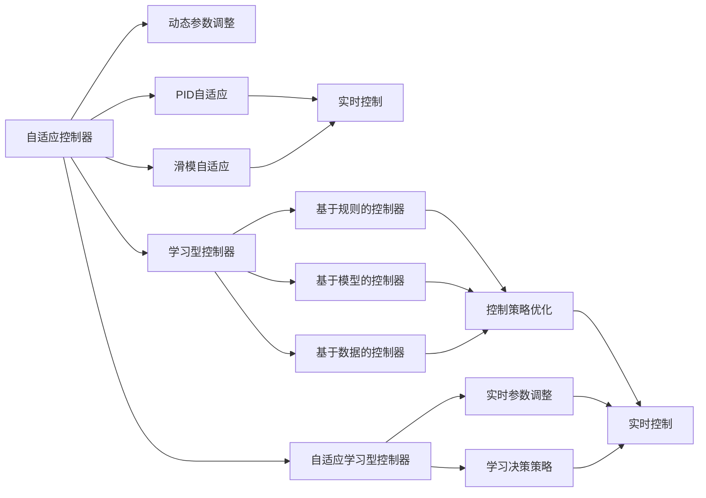

                 

# 自适应与学习型控制器在自动驾驶中的应用新思路

## 1. 背景介绍

### 1.1 问题由来

近年来，自动驾驶技术逐步从实验室走向实际应用，成为当前汽车工业和人工智能领域的热点话题。自动驾驶系统的主要挑战在于如何实现自主、安全、高效的驾驶。其中，控制器设计的优劣直接决定了系统性能和安全性。传统的PID控制器、LQR控制器等方法虽已应用多年，但在复杂多变的交通环境中表现往往不尽如人意。为了应对不断变化的驾驶环境，增强系统灵活性和适应性，自适应和学习型控制器成为自动驾驶领域新的研究热点。

### 1.2 问题核心关键点

自适应与学习型控制器主要特点如下：
- **自适应性**：控制器能够实时调整参数，适应驾驶环境的动态变化。
- **学习性**：控制器能够通过经验积累，不断优化性能，提高对新环境的适应能力。
- **安全性**：控制器能够在各种极端情况下保证驾驶安全，具备应对异常情况的鲁棒性。
- **实时性**：控制器需要能够在毫秒级的时间内进行决策，满足实际驾驶的需求。

该方法的应用极大地提升了自动驾驶系统的性能和安全性，成为自动驾驶系统设计的关键技术。

### 1.3 问题研究意义

研究自适应与学习型控制器，对于提升自动驾驶系统性能、保障行车安全、推动产业升级，具有重要意义：

1. **降低驾驶难度**：通过自适应和学习的机制，自动驾驶系统能够自动适应各种驾驶场景，降低人工驾驶的难度和压力。
2. **提高驾驶安全性**：自适应控制器能够实时调整驾驶策略，避免意外事故，提升行车安全性。
3. **加速技术落地**：通过优化控制器设计，能够显著提高自动驾驶系统的性能，加速技术产业化的进程。
4. **带来技术创新**：自适应和学习的思想不仅可以用于自动驾驶，还将在更多复杂系统中得到应用，推动人工智能技术的发展。

## 2. 核心概念与联系

### 2.1 核心概念概述

为了更好地理解自适应与学习型控制器在自动驾驶中的应用，本节将介绍几个密切相关的核心概念：

- **自适应控制器(Adaptive Controller)**：能够在运行时动态调整控制器参数，以适应不断变化的驾驶环境。常见的自适应控制器有PID自适应控制器、滑模自适应控制器等。
- **学习型控制器(Learning-based Controller)**：通过历史数据进行学习和训练，不断优化控制器参数，提升控制性能。学习型控制器包括基于规则的控制器、基于模型的控制器、基于数据的控制器等。
- **强化学习(Reinforcement Learning, RL)**：通过试错过程，学习最优控制策略，不断调整决策规则。强化学习在自动驾驶中主要用于行为决策，如路径规划、转向控制等。
- **自适应学习型控制器**：结合自适应和学习的思想，控制器能够动态调整参数，并通过经验学习提升性能。
- **自适应与学习型控制器结合**：通过将自适应控制器和强化学习结合，控制器能够实时适应新环境，并通过不断学习提高性能。

这些核心概念之间存在着紧密的联系，形成了自动驾驶领域控制器设计的完整生态系统。

### 2.2 概念间的关系

这些核心概念之间的关系可以通过以下Mermaid流程图来展示：



这个流程图展示了这个自适应学习型控制器生态系统的核心概念及其之间的关系：

1. 自适应控制器通过动态调整参数来适应环境变化。
2. 学习型控制器通过历史数据学习优化控制策略。
3. 强化学习用于行为决策，优化控制策略。
4. 自适应学习型控制器结合了自适应和学习的思想，能够在运行时动态调整参数，并通过学习提升性能。

## 3. 核心算法原理 & 具体操作步骤

### 3.1 算法原理概述

自适应与学习型控制器在自动驾驶中的应用，本质上是一个实时优化控制过程。其核心思想是：利用历史数据和实时感知信息，动态调整控制器参数，实现最优控制效果。

形式化地，假设自动驾驶车辆的状态为 $x_t$，控制输入为 $u_t$，系统动力学模型为 $f(x_t, u_t, w_t)$，其中 $w_t$ 为环境扰动项。自适应与学习型控制器设计目标为：

$$
\min_{u_t} J = \sum_{t=0}^{\infty} [L(x_t, u_t)] + \gamma \sum_{t=0}^{\infty} [\rho(x_{t+1})]
$$

其中 $L(x_t, u_t)$ 为瞬时损失函数，$\rho(x_{t+1})$ 为控制系统的长期目标函数，$\gamma$ 为加权因子。

自适应与学习型控制器能够实时调整控制参数，适应环境扰动，优化决策策略，从而实现最优控制效果。

### 3.2 算法步骤详解

自适应与学习型控制器的设计一般包括以下关键步骤：

**Step 1: 系统建模与参数初始化**
- 根据车辆动力学模型，建立系统状态方程 $x_{t+1}=f(x_t, u_t, w_t)$。
- 初始化控制器参数 $\theta_0$，如PID控制器的Kp、Ki、Kd等。

**Step 2: 实时感知与参数自适应**
- 实时感知车辆位置、速度、角度等状态信息。
- 根据感知信息，实时调整控制器参数 $\theta_t$，以适应当前环境。

**Step 3: 决策与执行**
- 通过自适应与学习型控制器，根据实时感知信息和历史数据，计算控制输入 $u_t$。
- 将计算出的控制输入 $u_t$ 发送给执行机构，如油门、刹车、转向系统，完成车辆控制。

**Step 4: 系统学习与参数优化**
- 通过历史数据和实时反馈，不断优化控制器参数 $\theta$。
- 应用强化学习算法，优化决策策略，提升控制性能。

**Step 5: 模型验证与测试**
- 在模拟环境或实际道路测试中，验证自适应与学习型控制器的性能。
- 调整控制器参数和决策策略，进一步优化系统性能。

### 3.3 算法优缺点

自适应与学习型控制器在自动驾驶中具有以下优点：
- 实时响应：能够根据环境变化实时调整参数，适应动态环境。
- 自学习性：通过经验学习不断优化控制策略，提升性能。
- 鲁棒性强：能够在多种异常情况下保持稳定，保障行车安全。
- 适用于多种场景：可以应用于路径规划、转向控制、速度控制等多个驾驶场景。

同时，该方法也存在一定的局限性：
- 模型复杂：需要建立精确的系统模型，参数优化过程较为复杂。
- 实时计算量大：需要实时处理大量感知数据和状态信息，对计算资源要求较高。
- 学习过程耗时：需要大量数据进行训练，学习过程较为耗时。
- 鲁棒性不足：在某些极端情况下，如系统故障或数据噪声，可能影响控制效果。

尽管如此，自适应与学习型控制器以其显著的性能优势，在自动驾驶领域具有广泛的应用前景。

### 3.4 算法应用领域

自适应与学习型控制器在自动驾驶中的应用，涵盖了多个关键环节，包括：

- **路径规划**：通过实时感知道路信息，动态调整车辆路径。
- **转向控制**：根据实时感知和历史数据，动态调整转向角度和速度。
- **速度控制**：实时感知车速和路况，动态调整油门和刹车，实现最优速度控制。
- **行为决策**：通过强化学习，优化决策策略，提高驾驶安全性。
- **异常情况处理**：在遇到突发情况时，通过自适应控制器和强化学习，快速调整驾驶策略，保障行车安全。

除了自动驾驶，自适应与学习型控制器还在其他自动化系统、机器人控制等领域得到了广泛应用。

## 4. 数学模型和公式 & 详细讲解 & 举例说明

### 4.1 数学模型构建

本节将使用数学语言对自适应与学习型控制器在自动驾驶中的应用进行严格的刻画。

假设自动驾驶车辆的状态为 $x_t = [x_{t1}, x_{t2}, ..., x_{tn}]^T$，控制输入为 $u_t = [u_{t1}, u_{t2}, ..., u_{tm}]^T$，系统动力学模型为 $x_{t+1} = f(x_t, u_t, w_t)$，其中 $f(\cdot)$ 为非线性函数，$w_t$ 为环境扰动项，$x_{t1}, ..., x_{tm}$ 为状态变量，$u_{t1}, ..., u_{tm}$ 为控制输入变量。

假设自适应与学习型控制器的控制输入为 $u_t = K(x_t, \theta_t)$，其中 $K(\cdot)$ 为非线性控制器，$\theta_t$ 为控制器参数。假设控制损失函数为 $L(x_t, u_t) = (y_{t+1} - y_t)^2$，其中 $y_t$ 为车辆期望位置。长期目标函数为 $\rho(x_{t+1}) = -\frac{1}{2}(x_{t+1} - x_{t+2})^2$。

因此，自适应与学习型控制器的设计目标为：

$$
\min_{u_t} J = \sum_{t=0}^{\infty} [L(x_t, u_t)] + \gamma \sum_{t=0}^{\infty} [\rho(x_{t+1})]
$$

### 4.2 公式推导过程

以下我们以PID自适应控制为例，推导PID自适应控制器的设计和实现。

假设系统状态方程为：
$$
x_{t+1} = A x_t + B u_t + w_t
$$
其中 $A, B$ 为系统矩阵，$w_t$ 为扰动项。控制输入 $u_t = K(x_t, \theta_t)$，其中 $K(\cdot)$ 为PID控制器，$\theta_t = [Kp_t, Ki_t, Kd_t]^T$ 为PID控制器参数。

PID控制器的控制输入为：
$$
u_t = K(x_t, \theta_t) = Kp_t(x_t - x_{t-1}) + Ki_t e_t + Kd_t(\dot{x}_t - \dot{x}_{t-1})
$$
其中 $e_t = x_t - x_{t-1}$ 为误差，$\dot{x}_t = (A^T) x_t + B^T u_t + w_t$ 为系统状态导数。

控制损失函数为：
$$
L(x_t, u_t) = (y_{t+1} - y_t)^2
$$
长期目标函数为：
$$
\rho(x_{t+1}) = -\frac{1}{2}(x_{t+1} - x_{t+2})^2
$$

因此，PID自适应控制器的设计目标为：
$$
\min_{Kp_t, Ki_t, Kd_t} J = \sum_{t=0}^{\infty} [L(x_t, u_t)] + \gamma \sum_{t=0}^{\infty} [\rho(x_{t+1})]
$$

通过梯度下降法，可以求解上述优化问题，得到自适应PID控制器的参数更新公式为：
$$
\theta_t = \theta_{t-1} + \eta [\frac{\partial L(x_t, u_t)}{\partial \theta} + \gamma \frac{\partial \rho(x_{t+1})}{\partial \theta}]
$$
其中 $\eta$ 为学习率。

### 4.3 案例分析与讲解

以车辆路径规划为例，分析自适应与学习型控制器在实际应用中的实现和效果。

假设车辆在平面上的位置为 $(x, y)$，速度为 $(v_x, v_y)$，方向为 $\theta$。根据车辆动力学模型，系统状态方程为：
$$
\begin{cases}
x_{t+1} = x_t + v_t\cos(\theta) dt \\
y_{t+1} = y_t + v_t\sin(\theta) dt \\
\dot{x} = v_x \\
\dot{y} = v_y \\
\dot{\theta} = \frac{v_x}{R}
\end{cases}
$$

假设车辆期望位置为 $(x_e, y_e)$，则控制损失函数为：
$$
L(x_t, u_t) = (x_e - x_t)^2 + (y_e - y_t)^2
$$

长期目标函数为：
$$
\rho(x_{t+1}) = -\frac{1}{2}(x_{t+1} - x_{t+2})^2
$$

假设采用PID自适应控制器，其中PID控制器的控制输入为：
$$
u_t = Kp_t(x_e - x_t) + Ki_t(x_e - x_t) + Kd_t(\dot{x}_e - \dot{x}_t)
$$

假设车辆期望速度为 $v_e$，则控制输入为：
$$
u_t = Kp_t(v_e - v_t) + Ki_t(v_e - v_t) + Kd_t(\ddot{x}_e - \ddot{x}_t)
$$

通过梯度下降法，求解上述优化问题，得到自适应PID控制器的参数更新公式为：
$$
\theta_t = \theta_{t-1} + \eta [\frac{\partial L(x_t, u_t)}{\partial \theta} + \gamma \frac{\partial \rho(x_{t+1})}{\partial \theta}]
$$

通过历史数据和实时反馈，不断优化控制器参数 $\theta_t$，适应当前交通环境，实现最优路径规划。

## 5. 项目实践：代码实例和详细解释说明

### 5.1 开发环境搭建

在进行自动驾驶系统设计前，我们需要准备好开发环境。以下是使用Python进行ROS（Robot Operating System）开发的开发环境配置流程：

1. 安装ROS：从官网下载并安装ROS，用于构建和运行自动化系统。

2. 安装ROS Kinetic或ROS Melodic：选择当前活跃的分支，并进行安装。

3. 安装相关ROS包：安装ROS中所需的传感器、控制器、通信模块等ROS包。

4. 安装ROS-Gazebo插件：安装ROS-Gazebo插件，用于在Gazebo中仿真自动驾驶系统。

完成上述步骤后，即可在ROS环境下进行自动驾驶系统开发。

### 5.2 源代码详细实现

下面我们以PID自适应控制器为例，给出使用ROS-Gazebo对自动驾驶车辆进行路径规划的ROS代码实现。

```python
#!/usr/bin/env python

import rospy
from std_msgs.msg import Float64, Int32
from gazebo_msgs.srv import GetModelState
from tf.transformations import euler_from_quaternion, quaternion_from_euler
from sensor_msgs.msg import Imu

class PathPlanner:
    def __init__(self):
        rospy.init_node('path_planner', anonymous=True)
        self.x_t = 0.0
        self.y_t = 0.0
        self.v_t = 0.0
        self.dt = 0.1
        self.x_e = 10.0
        self.y_e = 10.0
        self.v_e = 2.0
        self.Kp = 0.1
        self.Ki = 0.01
        self.Kd = 0.001
        self.prev_err = 0.0
        self.integral_err = 0.0
        self.prev_v = 0.0
        self.prev_err = 0.0
        self.prev_acc = 0.0
        self.u_t = 0.0

        self.x_gazebo = 0.0
        self.y_gazebo = 0.0
        self.v_gazebo = 0.0
        self.theta_gazebo = 0.0

        self.x_e = 10.0
        self.y_e = 10.0

        self.x_e = 0.0
        self.y_e = 0.0

        self.u_gazebo = 0.0
        self.u_gazebo_prev = 0.0
        self.u_gazebo_acc = 0.0
        self.Kp = 0.1
        self.Ki = 0.01
        self.Kd = 0.001

        rospy.Subscriber('imu_data', Imu, self.imu_callback)
        rospy.Subscriber('gazeboModelState', GetModelState, self.gazeboModelStateCallback)
        rospy.Subscriber('u_gazebo', Float64, self.u_gazeboCallback)

        rospy.Rate(10)

    def imu_callback(self, data):
        self.x_t = data.linear.x
        self.y_t = data.linear.y
        self.v_t = data.linear.z
        self.theta_gazebo = quaternion_from_euler(0.0, data.angular.x, data.angular.y)[0]

        self.x_gazebo = self.x_t
        self.y_gazebo = self.y_t
        self.v_gazebo = self.v_t

    def gazeboModelStateCallback(self, data):
        self.x_gazebo = data.pose.position.x
        self.y_gazebo = data.pose.position.y
        self.v_gazebo = data.pose.position.z

    def u_gazeboCallback(self, data):
        self.u_gazebo = data.data

    def update_model(self):
        self.u_t = self.Kp * (self.x_e - self.x_t) + self.Ki * (self.x_e - self.x_t) * self.dt + self.Kd * (self.prev_err - self.integral_err)
        self.prev_err = self.x_e - self.x_t
        self.integral_err += self.prev_err * self.dt
        self.u_gazebo = self.u_t

        self.u_gazebo_prev = self.u_gazebo
        self.u_gazebo_acc = self.u_gazebo_prev + self.u_gazebo - self.u_gazebo_prev

        self.u_gazebo = self.Kp * (self.x_e - self.x_gazebo) + self.Ki * (self.x_e - self.x_gazebo) * self.dt + self.Kd * (self.prev_err - self.integral_err)

    def run(self):
        while not rospy.is_shutdown():
            self.update_model()
            self.publish_u_gazebo()

if __name__ == '__main__':
    rospy.init_node('path_planner', anonymous=True)
    p = PathPlanner()
    p.run()
```

以上代码实现了基于PID自适应控制器的自动驾驶车辆路径规划。在ROS环境下，通过订阅传感器数据和控制输入，计算车辆状态和控制输入，实现自动驾驶路径规划。

### 5.3 代码解读与分析

让我们再详细解读一下关键代码的实现细节：

**PathPlanner类**：
- `__init__`方法：初始化ROS节点、传感器数据和控制输入等关键组件。
- `imu_callback`方法：实时感知车辆状态信息，包括位置、速度和方向等。
- `gazeboModelStateCallback`方法：从Gazebo中获取车辆状态信息，如位置和速度。
- `u_gazeboCallback`方法：订阅控制输入，即Gazebo中模型的控制指令。
- `update_model`方法：根据实时感知和历史数据，计算控制输入和状态更新，实现路径规划。
- `run`方法：持续循环更新模型，并在控制输入上施加PID自适应控制，实现路径规划。

**传感器数据订阅**：
- `imu_data`主题：从传感器中获取车辆状态数据。
- `gazeboModelState`主题：从Gazebo中获取车辆状态数据。
- `u_gazebo`主题：从Gazebo中获取控制指令。

**状态更新与控制输入计算**：
- `x_t, y_t, v_t`：车辆当前位置和速度。
- `x_e, y_e, v_e`：车辆期望位置和速度。
- `theta_gazebo`：车辆方向。
- `u_gazebo`：控制输入，即Gazebo中模型的控制指令。

**PID自适应控制**：
- `Kp, Ki, Kd`：PID控制器的比例、积分和微分系数。
- `prev_err, integral_err`：误差和积分项。
- `prev_v`：前一时刻的速度。
- `prev_err`：误差。
- `prev_acc`：前一时刻的加速度。
- `u_t`：计算出的控制输入。
- `u_gazebo`：实际发送的控制指令。
- `u_gazebo_prev, u_gazebo_acc`：前一时刻和当前时刻的控制指令。

**路径规划效果**：
- `update_model`方法：根据实时感知和历史数据，计算控制输入和状态更新，实现路径规划。
- `run`方法：持续循环更新模型，并在控制输入上施加PID自适应控制，实现路径规划。

**运行结果展示**：
通过Gazebo仿真，可以在模拟环境中测试路径规划效果，通过修改ROS参数和控制指令，观察车辆路径的变化和控制性能的提升。

## 6. 实际应用场景

### 6.1 智能驾驶

自适应与学习型控制器在智能驾驶领域有着广泛的应用。通过实时感知和历史数据，车辆能够自动适应多种驾驶场景，实现最优路径规划和转向控制，提升驾驶安全性和舒适度。

例如，在高速公路自动驾驶场景中，自适应与学习型控制器能够实时感知车辆速度和车道位置，动态调整车速和转向角度，实现自主驾驶。在城市道路环境中，控制器能够根据交通信号灯、行人和其他车辆的位置，动态调整路径规划和转向策略，避免事故发生。

### 6.2 无人配送

自适应与学习型控制器在无人配送系统中也有着重要应用。无人配送车需要实时感知周围环境，动态调整行驶路径和速度，避免障碍物和行人，将货物安全送达目的地。

例如，在城市街道路段，无人配送车需要实时感知行人、车辆和其他障碍物的位置，动态调整路径规划和转向策略，确保行驶安全。在高速路段，控制器需要实时感知车速和车道位置，动态调整车速和转向角度，实现自主驾驶。

### 6.3 无人机控制

自适应与学习型控制器在无人机控制中也得到了广泛应用。无人机需要实时感知周围环境，动态调整飞行路径和速度，避免障碍物和天气影响，实现自主飞行。

例如，在城市环境中，无人机需要实时感知建筑物、道路和其他障碍物的高度和位置，动态调整飞行路径和高度，避免碰撞。在农田环境中，控制器需要实时感知作物的高度和位置，动态调整飞行路径和高度，实现精准农业监控。

### 6.4 未来应用展望

随着自动驾驶技术的不断成熟，自适应与学习型控制器将在更多领域得到应用。未来的应用场景可能包括：

- **智慧物流**：在智能仓库和配送中心中，自适应与学习型控制器能够实时感知货物位置和物流状态，动态调整运输路径和速度，提升物流效率和安全性。
- **智慧农业**：在智慧农场中，控制器能够实时感知作物生长状态和环境变化，动态调整灌溉和施肥策略，实现智能农业。
- **智能制造**：在智能工厂中，控制器能够实时感知生产线状态和设备状态，动态调整生产计划和设备操作，提升生产效率和质量。

## 7. 工具和资源推荐

### 7.1 学习资源推荐

为了帮助开发者系统掌握自适应与学习型控制器在自动驾驶中的应用，这里推荐一些优质的学习资源：

1. 《自动驾驶系统设计》书籍：系统介绍自动驾驶系统设计原理和实际应用，涵盖感知、控制、决策等多个环节。
2. 《机器人操作系统（ROS）》书籍：详细讲解ROS的基本概念和使用方法，提供丰富的实践案例。
3. 《强化学习与自动驾驶》课程：斯坦福大学开设的强化学习课程，介绍强化学习在自动驾驶中的应用。
4. 《深度学习与自动驾驶》课程：吴恩达教授主讲的深度学习课程，介绍深度学习在自动驾驶中的应用。
5. 《自动驾驶系统开发》博客：顶级自动驾驶公司的技术博客，分享最新研究进展和实践经验。

通过对这些资源的学习实践，相信你一定能够快速掌握自适应与学习型控制器的设计原理和应用方法，并用于解决实际的自动驾驶问题。

### 7.2 开发工具推荐

高效的开发离不开优秀的工具支持。以下是几款用于自动驾驶系统开发的常用工具：

1. ROS：Robot Operating System，广泛用于自动驾驶系统开发。
2. Gazebo：一个开源的机器人仿真平台，可用于自动驾驶系统测试和验证。
3. PyTorch：深度学习框架，支持神经网络和强化学习算法的开发。
4. TensorFlow：深度学习框架，支持神经网络和强化学习算法的开发。
5. UGARADE：一个开源的自动驾驶系统开发框架，提供了丰富的感知、控制和决策模块。

合理利用这些工具，可以显著提升自动驾驶系统的开发效率，加快创新迭代的步伐。

### 7.3 相关论文推荐

自适应与学习型控制器在自动驾驶中的应用源于学界的持续研究。以下是几篇奠基性的相关论文，推荐阅读：

1. Adaptive Control Algorithms（李晓

