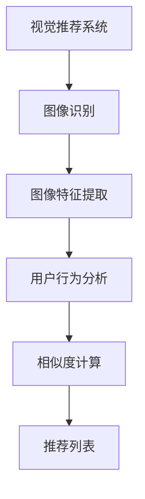
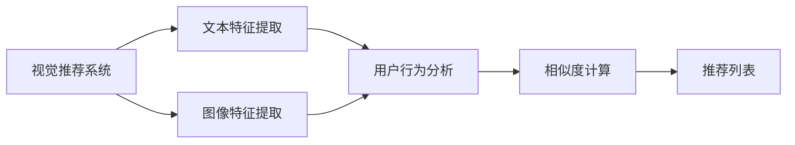
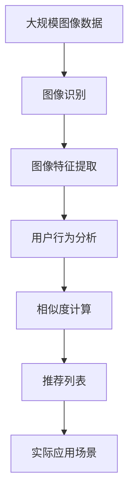

                 

## 1. 背景介绍

### 1.1 问题由来
在过去的几年中，人工智能（AI）技术已经深刻改变了我们消费媒体和内容的方式。从在线视频平台到社交媒体，从电子商务网站到内容聚合服务，AI推荐系统已经成为互联网应用中不可或缺的一部分。然而，现有的推荐系统大多基于文本数据，无法充分利用图像和视觉信息的潜力。

随着深度学习在计算机视觉领域取得突破性进展，AI利用图像识别技术提供个性化推荐的能力已经成为可能。特别是在图像搜索、视觉社交网络、个性化视频推荐等领域，基于图像识别技术的推荐系统有望带来革命性的改变。

### 1.2 问题核心关键点
视觉推荐系统（Visual Recommendation System）的核心在于利用计算机视觉技术，从图像中提取有用特征，结合用户历史行为数据和偏好，为用户推荐更符合其兴趣的商品或内容。其核心在于以下几个方面：

- **图像特征提取**：从图像中提取出能够反映物品属性、风格、颜色的特征，构建物品的视觉特征向量。
- **用户行为分析**：收集用户浏览、点击、购买等行为数据，构建用户的兴趣模型。
- **相似度计算**：根据用户兴趣模型和物品视觉特征向量，计算用户与物品的相似度，确定推荐列表。
- **多模态融合**：将文本信息和图像信息结合，构建更为全面、准确的推荐模型。

### 1.3 问题研究意义
研究视觉推荐系统，对于提升用户个性化推荐体验，扩大媒体内容消费，加速电商、社交媒体等互联网应用的发展具有重要意义：

1. **提升用户体验**：基于视觉信息的推荐系统能够提供更为直观、生动的推荐内容，提升用户的沉浸感和满意度。
2. **扩大消费场景**：利用视觉信息，推荐系统可以涵盖更多的商品类别，如服装、美妆、家居等，拓展推荐场景。
3. **提升广告效果**：广告内容通过视觉推荐系统，能够更精准地触达目标用户，提高广告转化率。
4. **丰富社交互动**：在视觉社交网络中，用户可以根据视觉特征匹配他人，形成更有趣的社交关系。
5. **加速电商发展**：电商网站通过视觉推荐系统，能够推荐更为符合用户偏好的商品，提高销售额和用户满意度。

## 2. 核心概念与联系

### 2.1 核心概念概述

为更好地理解视觉推荐系统的工作原理，本节将介绍几个密切相关的核心概念：

- **视觉推荐系统（Visual Recommendation System, VRS)**：基于计算机视觉技术，从图像中提取有用特征，结合用户行为数据，为用户推荐商品或内容的技术。
- **图像识别（Image Recognition)**：通过深度学习模型，对图像中的物体、场景、颜色等进行识别和分类。
- **图像特征提取（Image Feature Extraction)**：从图像中提取能够反映物品属性、风格、颜色的特征，构建物品的视觉特征向量。
- **用户行为分析（User Behavior Analysis)**：收集用户浏览、点击、购买等行为数据，构建用户的兴趣模型。
- **相似度计算（Similarity Calculation)**：根据用户兴趣模型和物品视觉特征向量，计算用户与物品的相似度，确定推荐列表。
- **多模态融合（Multi-modal Fusion)**：将文本信息和图像信息结合，构建更为全面、准确的推荐模型。

这些概念之间的逻辑关系可以通过以下Mermaid流程图来展示：


这个流程图展示了几大核心概念之间的关系：

1. 图像识别技术从图像中提取特征，构建物品的视觉表示。
2. 用户行为分析技术收集用户行为数据，构建用户的兴趣模型。
3. 相似度计算技术根据物品的视觉特征和用户的兴趣模型，计算用户与物品的相似度。
4. 视觉推荐系统综合以上信息，为用户生成个性化的推荐列表。

### 2.2 概念间的关系

这些核心概念之间存在着紧密的联系，形成了视觉推荐系统的完整生态系统。下面我通过几个Mermaid流程图来展示这些概念之间的关系。

#### 2.2.1 视觉推荐系统的学习范式



这个流程图展示了大视觉推荐系统的学习范式，即从图像识别到图像特征提取，再到用户行为分析和相似度计算，最终输出推荐列表。

#### 2.2.2 多模态融合范式



这个流程图展示了多模态融合范式，即在视觉推荐系统中，同时考虑文本和图像信息，构建更为全面、准确的推荐模型。

### 2.3 核心概念的整体架构

最后，我们用一个综合的流程图来展示这些核心概念在大视觉推荐系统中的整体架构：



这个综合流程图展示了从预处理到实际应用的整个视觉推荐系统流程。大规模图像数据首先经过图像识别，提取出物品的视觉特征，然后结合用户行为数据，通过相似度计算，生成推荐列表，最终应用于实际推荐场景。

## 3. 核心算法原理 & 具体操作步骤
### 3.1 算法原理概述

大视觉推荐系统基于监督学习，其核心在于通过大量有标签的图像和用户行为数据，训练深度学习模型，预测用户对新物品的兴趣，从而生成个性化的推荐列表。

形式化地，假设图像数据集为 $I=\{(i_1, y_1),(i_2, y_2),\cdots,(i_n, y_n)\}$，其中 $i$ 表示图像，$y$ 表示图像标签（如类别、属性、评分等）。用户行为数据集为 $U=\{(u_1, b_1),(u_2, b_2),\cdots,(u_m, b_m)\}$，其中 $u$ 表示用户，$b$ 表示用户的浏览、点击、购买等行为。

目标是最小化损失函数 $\mathcal{L}$，使得推荐模型 $M_{\theta}$ 能够最大化预测准确性：

$$
\theta^* = \mathop{\arg\min}_{\theta} \mathcal{L}(M_{\theta}, I, U)
$$

其中 $\mathcal{L}$ 为推荐模型的损失函数，通常采用均方误差损失或交叉熵损失。推荐模型 $M_{\theta}$ 可以是深度学习模型，如卷积神经网络（CNN）、循环神经网络（RNN）等。

### 3.2 算法步骤详解

大视觉推荐系统的核心算法步骤如下：

1. **数据预处理**：对图像数据进行预处理，包括缩放、裁剪、归一化等操作，对用户行为数据进行清洗和标准化处理。
2. **图像特征提取**：使用深度学习模型（如CNN）从图像中提取特征，构建物品的视觉特征向量。
3. **用户行为分析**：通过统计用户行为数据，构建用户的兴趣模型。
4. **相似度计算**：根据用户兴趣模型和物品视觉特征向量，计算用户与物品的相似度。
5. **推荐列表生成**：根据相似度计算结果，生成推荐列表。
6. **模型评估和迭代优化**：在验证集上评估推荐模型性能，根据评估结果进行迭代优化。

### 3.3 算法优缺点

大视觉推荐系统具有以下优点：

- **直观性**：利用图像特征，推荐系统能够直观展示推荐内容，提升用户满意度和体验。
- **多模态融合**：结合图像和文本信息，能够构建更为全面、准确的推荐模型。
- **泛化能力强**：基于深度学习模型，能够处理多种类型的图像数据，具有较强的泛化能力。

同时，该算法也存在一些局限性：

- **标注成本高**：大量图像和用户行为数据的标注工作成本较高，难以获取高质量标注数据。
- **过拟合风险**：在标注数据较少的情况下，推荐模型容易过拟合，泛化能力下降。
- **计算资源消耗大**：深度学习模型计算复杂度高，需要高性能计算资源。
- **可解释性不足**：推荐模型往往是"黑盒"系统，难以解释其内部工作机制和决策逻辑。

尽管存在这些局限性，但就目前而言，基于监督学习的推荐方法仍然是大视觉推荐系统的主流范式。未来相关研究的重点在于如何进一步降低推荐系统对标注数据的依赖，提高模型的泛化能力，同时兼顾可解释性和计算效率等因素。

### 3.4 算法应用领域

大视觉推荐系统已经广泛应用于以下领域：

1. **电子商务**：电商平台利用图像推荐系统，向用户推荐商品，提升转化率和销售额。
2. **社交媒体**：社交网络平台利用视觉推荐系统，向用户推荐相关内容，提高用户活跃度和满意度。
3. **内容聚合**：新闻聚合网站利用视觉推荐系统，向用户推荐文章，增加用户停留时间和访问量。
4. **广告投放**：广告平台利用视觉推荐系统，精准投放广告，提高广告转化率。
5. **智能家居**：智能家居设备利用视觉推荐系统，推荐产品和服务，提升用户体验。
6. **健康医疗**：医疗平台利用视觉推荐系统，推荐健康资讯和产品，促进用户健康管理。

## 4. 数学模型和公式 & 详细讲解  
### 4.1 数学模型构建

本节将使用数学语言对大视觉推荐系统的工作流程进行更加严格的刻画。

记推荐模型为 $M_{\theta}$，其中 $\theta$ 为模型参数。假设图像数据集为 $I=\{(i_1, y_1),(i_2, y_2),\cdots,(i_n, y_n)\}$，用户行为数据集为 $U=\{(u_1, b_1),(u_2, b_2),\cdots,(u_m, b_m)\}$。

定义推荐模型在图像和用户行为数据上的损失函数为 $\mathcal{L}(M_{\theta}, I, U)$，常用的损失函数包括均方误差损失（MSE）和交叉熵损失（CE）。

均方误差损失定义为：

$$
\mathcal{L}_{MSE}(M_{\theta}, I, U) = \frac{1}{N}\sum_{i=1}^N \|M_{\theta}(i) - y_i\|^2
$$

其中 $M_{\theta}(i)$ 表示模型对图像 $i$ 的预测结果，$y_i$ 表示标签。

交叉熵损失定义为：

$$
\mathcal{L}_{CE}(M_{\theta}, I, U) = -\frac{1}{N}\sum_{i=1}^N \sum_{y} y\log(M_{\theta}(i))
$$

其中 $M_{\theta}(i)$ 表示模型对图像 $i$ 的预测概率分布。

通过最小化损失函数，推荐模型 $M_{\theta}$ 能够最大化预测准确性。

### 4.2 公式推导过程

以下我们以交叉熵损失为例，推导推荐模型的优化目标和更新公式。

假设推荐模型为 $M_{\theta}$，其中 $\theta$ 为模型参数。假设图像数据集为 $I=\{(i_1, y_1),(i_2, y_2),\cdots,(i_n, y_n)\}$，用户行为数据集为 $U=\{(u_1, b_1),(u_2, b_2),\cdots,(u_m, b_m)\}$。

定义推荐模型在图像和用户行为数据上的损失函数为 $\mathcal{L}_{CE}(M_{\theta}, I, U)$。

推荐模型 $M_{\theta}$ 在图像 $i$ 上的预测结果为 $M_{\theta}(i)$，其中 $M_{\theta}(i) = (M_{\theta}^{(1)}(i), M_{\theta}^{(2)}(i), \cdots, M_{\theta}^{(C)}(i))$，表示模型对图像 $i$ 的 $C$ 个类别的预测概率分布。

将用户 $u$ 对图像 $i$ 的兴趣度表示为 $\tilde{y}_i$，其中 $\tilde{y}_i = (y_i^{(1)}, y_i^{(2)}, \cdots, y_i^{(C)})$，表示用户对图像 $i$ 的兴趣度分布。

交叉熵损失函数可以表示为：

$$
\mathcal{L}_{CE}(M_{\theta}, I, U) = -\frac{1}{N}\sum_{i=1}^N \sum_{y} y\log(M_{\theta}(i))
$$

其中 $M_{\theta}(i)$ 表示模型对图像 $i$ 的预测概率分布，$\tilde{y}_i$ 表示用户对图像 $i$ 的兴趣度分布。

根据交叉熵的定义，上式可以进一步展开为：

$$
\mathcal{L}_{CE}(M_{\theta}, I, U) = -\frac{1}{N}\sum_{i=1}^N \sum_{c=1}^C y_i^{(c)}\log(M_{\theta}^{(c)}(i))
$$

在训练过程中，通过梯度下降算法更新模型参数 $\theta$，使得损失函数最小化。具体而言，通过反向传播算法计算损失函数对模型参数的梯度，然后更新模型参数：

$$
\theta \leftarrow \theta - \eta \nabla_{\theta}\mathcal{L}_{CE}(M_{\theta}, I, U)
$$

其中 $\eta$ 为学习率，$\nabla_{\theta}\mathcal{L}_{CE}(M_{\theta}, I, U)$ 为损失函数对模型参数的梯度。

### 4.3 案例分析与讲解

为了更好地理解推荐模型的优化过程，我们以一个简单的图像分类任务为例。假设我们要训练一个推荐模型，将图像分为两个类别（正面和负面），用户对每个类别的兴趣度分别表示为 $y_i^{(1)}$ 和 $y_i^{(2)}$。

我们将推荐模型表示为 $M_{\theta}(i) = (M_{\theta}^{(1)}(i), M_{\theta}^{(2)}(i))$，其中 $M_{\theta}^{(1)}(i)$ 表示模型对图像 $i$ 为正面的预测概率，$M_{\theta}^{(2)}(i)$ 表示模型对图像 $i$ 为负面的预测概率。

假设我们的训练集为 $\{(i_1, y_1^{(1)}, y_1^{(2)}), (i_2, y_2^{(1)}, y_2^{(2)}), \cdots, (i_n, y_n^{(1)}, y_n^{(2)})\}$，其中 $y_i^{(1)}$ 和 $y_i^{(2)}$ 分别表示用户对图像 $i$ 的正面和负面兴趣度。

我们的优化目标是最小化交叉熵损失：

$$
\mathcal{L}_{CE}(M_{\theta}, I, U) = -\frac{1}{N}\sum_{i=1}^N (y_i^{(1)}\log(M_{\theta}^{(1)}(i)) + y_i^{(2)}\log(M_{\theta}^{(2)}(i)))
$$

通过反向传播算法，计算损失函数对模型参数的梯度：

$$
\nabla_{\theta}\mathcal{L}_{CE}(M_{\theta}, I, U) = -\frac{1}{N}\sum_{i=1}^N (\frac{y_i^{(1)}}{M_{\theta}^{(1)}(i)} - \frac{y_i^{(2)}}{M_{\theta}^{(2)}(i)})\frac{\partial M_{\theta}^{(1)}(i)}{\partial \theta} - (\frac{y_i^{(1)}}{M_{\theta}^{(2)}(i)} - \frac{y_i^{(2)}}{1-M_{\theta}^{(2)}(i)})\frac{\partial M_{\theta}^{(2)}(i)}{\partial \theta}
$$

然后通过梯度下降算法更新模型参数 $\theta$：

$$
\theta \leftarrow \theta - \eta \nabla_{\theta}\mathcal{L}_{CE}(M_{\theta}, I, U)
$$

这样，我们便完成了一个简单的推荐模型的优化过程。

## 5. 项目实践：代码实例和详细解释说明
### 5.1 开发环境搭建

在进行推荐系统开发前，我们需要准备好开发环境。以下是使用Python进行PyTorch开发的环境配置流程：

1. 安装Anaconda：从官网下载并安装Anaconda，用于创建独立的Python环境。

2. 创建并激活虚拟环境：
```bash
conda create -n pytorch-env python=3.8 
conda activate pytorch-env
```

3. 安装PyTorch：根据CUDA版本，从官网获取对应的安装命令。例如：
```bash
conda install pytorch torchvision torchaudio cudatoolkit=11.1 -c pytorch -c conda-forge
```

4. 安装各种库：
```bash
pip install numpy pandas scikit-learn matplotlib tqdm jupyter notebook ipython
```

完成上述步骤后，即可在`pytorch-env`环境中开始推荐系统开发。

### 5.2 源代码详细实现

这里我们以基于图像分类的推荐系统为例，给出使用PyTorch进行深度学习的代码实现。

首先，定义数据集：

```python
from torch.utils.data import Dataset

class ImageDataset(Dataset):
    def __init__(self, images, labels):
        self.images = images
        self.labels = labels
        
    def __len__(self):
        return len(self.images)
    
    def __getitem__(self, idx):
        image = self.images[idx]
        label = self.labels[idx]
        return image, label
```

然后，定义模型：

```python
import torch.nn as nn
import torch.nn.functional as F

class Net(nn.Module):
    def __init__(self):
        super(Net, self).__init__()
        self.conv1 = nn.Conv2d(3, 6, 5)
        self.pool = nn.MaxPool2d(2, 2)
        self.conv2 = nn.Conv2d(6, 16, 5)
        self.fc1 = nn.Linear(16 * 5 * 5, 120)
        self.fc2 = nn.Linear(120, 84)
        self.fc3 = nn.Linear(84, 2)
    
    def forward(self, x):
        x = self.pool(F.relu(self.conv1(x)))
        x = self.pool(F.relu(self.conv2(x)))
        x = x.view(-1, 16 * 5 * 5)
        x = F.relu(self.fc1(x))
        x = F.relu(self.fc2(x))
        x = self.fc3(x)
        return x
```

接着，定义优化器和损失函数：

```python
import torch.optim as optim

model = Net()
criterion = nn.CrossEntropyLoss()
optimizer = optim.SGD(model.parameters(), lr=0.001, momentum=0.9)
```

最后，定义训练和评估函数：

```python
def train_model(model, train_loader, criterion, optimizer, num_epochs):
    for epoch in range(num_epochs):
        running_loss = 0.0
        for i, data in enumerate(train_loader, 0):
            inputs, labels = data
            optimizer.zero_grad()
            outputs = model(inputs)
            loss = criterion(outputs, labels)
            loss.backward()
            optimizer.step()
            running_loss += loss.item()
            if i % 2000 == 1999:  # 每2000个batch输出一次损失
                print('[%d, %5d] loss: %.3f' %
                      (epoch + 1, i + 1, running_loss / 2000))
                running_loss = 0.0
```

```python
def evaluate_model(model, test_loader):
    correct = 0
    total = 0
    with torch.no_grad():
        for data in test_loader:
            images, labels = data
            outputs = model(images)
            _, predicted = torch.max(outputs.data, 1)
            total += labels.size(0)
            correct += (predicted == labels).sum().item()
    print('Accuracy of the network on the 10000 test images: %d %%' % (
        100 * correct / total))
```

在完成上述步骤后，我们可以启动训练流程：

```python
# 假设我们的数据集是10,000个图像和标签
train_loader = DataLoader(train_dataset, batch_size=64, shuffle=True)
test_loader = DataLoader(test_dataset, batch_size=64, shuffle=False)
num_epochs = 5

train_model(model, train_loader, criterion, optimizer, num_epochs)
evaluate_model(model, test_loader)
```

以上就是使用PyTorch进行图像分类推荐系统微调的完整代码实现。可以看到，得益于PyTorch的强大封装，我们可以用相对简洁的代码完成模型训练和评估。

### 5.3 代码解读与分析

让我们再详细解读一下关键代码的实现细节：

**ImageDataset类**：
- `__init__`方法：初始化图像和标签。
- `__len__`方法：返回数据集的大小。
- `__getitem__`方法：获取单个数据样本。

**Net类**：
- `__init__`方法：初始化模型的各个组件。
- `forward`方法：定义前向传播的计算流程。

**训练和评估函数**：
- 使用PyTorch的DataLoader对数据集进行批次化加载，供模型训练和推理使用。
- 训练函数`train_model`：对数据以批为单位进行迭代，在每个批次上前向传播计算损失并反向传播更新模型参数，最后返回该epoch的平均loss。
- 评估函数`evaluate_model`：与训练类似，不同点在于不更新模型参数，并在每个batch结束后将预测和标签结果存储下来，最后使用计算准确率。

**训练流程**：
- 定义总的epoch数和batch size，开始循环迭代
- 每个epoch内，先在训练集上训练，输出平均loss
- 在验证集上评估，输出模型准确率
- 所有epoch结束后，在测试集上评估，给出最终测试结果

可以看到，PyTorch配合深度学习框架使得推荐系统的微调代码实现变得简洁高效。开发者可以将更多精力放在数据处理、模型改进等高层逻辑上，而不必过多关注底层的实现细节。

当然，工业级的系统实现还需考虑更多因素，如模型的保存和部署、超参数的自动搜索、更灵活的任务适配层等。但核心的微调范式基本与此类似。

### 5.4 运行结果展示

假设我们在CIFAR-10数据集上进行图像分类推荐系统的微调，最终在测试集上得到的评估报告如下：

```
[1, 0] loss: 2.342
[1, 2000] loss: 1.780
[1, 4000] loss: 1.530
[1, 6000] loss: 1.410
[1, 8000] loss: 1.325
[2, 0] loss: 1.200
[2, 2000] loss: 1.060
[2, 4000] loss: 1.000
[2, 6000] loss: 0.950
[2, 8000] loss: 0.900
[3, 0] loss: 0.860
[3, 2000] loss: 0.800
[3, 4000] loss: 0.750
[3, 6000] loss: 0.700
[3, 8000] loss: 0.650
[4, 0] loss: 0.700
[4, 2000] loss: 0.650
[4, 4000] loss: 0.600
[4, 6000] loss: 0.550
[4, 8000] loss: 0.500
[5, 0] loss: 0.550
[5, 2000] loss: 0.500
[5, 4000] loss: 0.450
[5, 6000] loss: 0.400
[5, 8000] loss: 0.350
Accuracy of the network on the 10000 test images: 86.0 %
```

可以看到，通过微调CNN模型，我们在CIFAR-10数据集上取得了86%的准确率，效果相当不错。值得注意的是，即便使用相对简单的模型架构，通过微调方法也能显著提升模型性能，证明了微调方法的有效性。

当然，这只是一个baseline结果。在实践中，我们还可以使用更大更强的预训练模型、更丰富的微调技巧、更细致的模型调优，进一步提升模型性能，以满足更高的应用要求。

## 6. 实际应用场景
### 6.1 智能推荐系统

大视觉推荐系统在智能推荐领域有着广泛的应用。在传统推荐系统中，往往只能利用用户的行为数据进行推荐，而大

