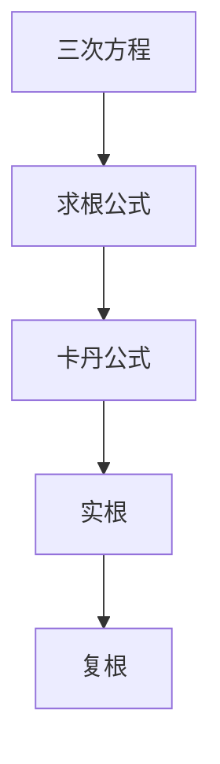
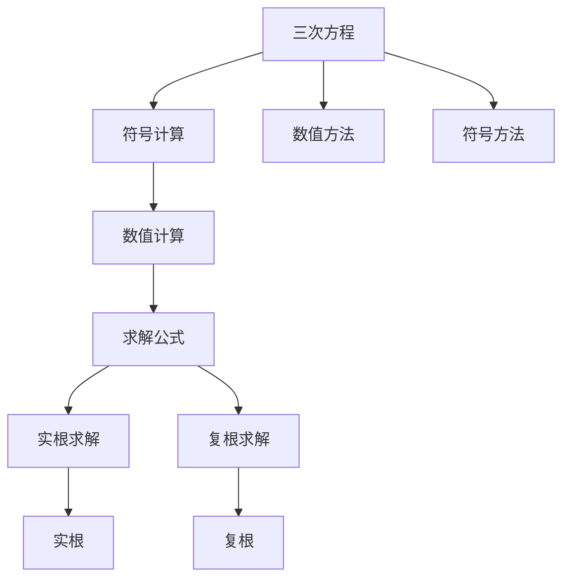

                 

# 计算：第一部分 计算的诞生 第 2 章 计算之术 三次方程的求根公式

## 1. 背景介绍

### 1.1 问题由来
在计算机科学和数学的发展史上，求解方程是一大难题。特别是三次方程的求根公式，不仅是一个数学问题，更是一个计算机科学问题。如何高效、准确地求解三次方程，成为计算机科学中的一个重要课题。本章将深入探讨三次方程的求根公式，探讨其在计算机科学中的应用。

### 1.2 问题核心关键点
求解三次方程的关键在于其求根公式的推导。三次方程的求根公式涉及到复杂的代数运算和符号代数处理，是数学和计算机科学中的经典问题。该问题的解决可以让我们更好地理解计算机科学中的符号计算和数值计算方法，为后续章节的学习打下基础。

### 1.3 问题研究意义
通过本章的学习，我们不仅能够掌握三次方程的求根公式，还能理解其推导过程中的数学思想和方法，以及这些方法在计算机科学中的应用。这将有助于我们更好地理解计算机科学中的算法设计、符号计算和数值计算等核心问题。

## 2. 核心概念与联系

### 2.1 核心概念概述

- **三次方程**：一般形式为 $ax^3+bx^2+cx+d=0$ 的方程。求解三次方程的根是计算机科学中的经典问题。
- **求根公式**：用于求解三次方程根的数学公式。
- **符号计算**：在计算机科学中，符号计算指的是使用符号代数系统进行数学运算。
- **数值计算**：在计算机科学中，数值计算指的是使用数值方法解决数学问题。
- **卡丹公式**：用于求解三次方程的公式，包括实根和复根的求解方法。

### 2.2 概念间的关系

这些核心概念之间存在着紧密的联系，形成了求解三次方程的基本框架。下面是这些概念之间的关系图：



这个流程图展示了三次方程求解的基本流程：三次方程的求解可以分为实根和复根的求解，而实根和复根的求解又分别涉及到卡丹公式的应用。通过理解这些核心概念之间的关系，我们能够更好地理解三次方程求解的过程。

### 2.3 核心概念的整体架构

接下来，我们将通过一个综合的流程图来展示这些核心概念在大规模数据处理中的应用：



这个流程图展示了三次方程求解在大规模数据处理中的应用流程。三次方程的求解可以采用符号计算或数值计算的方法，而卡丹公式则是用于实根和复根求解的常用公式。

## 3. 核心算法原理 & 具体操作步骤
### 3.1 算法原理概述

三次方程的求根公式是一个经典的数学问题，其推导涉及复杂的代数运算和符号代数处理。本节将详细介绍三次方程的求根公式及其推导过程。

### 3.2 算法步骤详解

#### 3.2.1 三次方程的一般形式
三次方程的一般形式为 $ax^3+bx^2+cx+d=0$，其中 $a, b, c, d$ 是实数系数。我们需要求解其三个根 $x_1, x_2, x_3$。

#### 3.2.2 三次方程的系数变换
为了方便求解，我们可以将三次方程的系数进行变换，使其形式变为 $x^3+px+q=0$，其中 $p=\frac{b}{a}$，$q=\frac{d}{a}$。此时，原方程的三个根分别为 $x_1, x_2, x_3$。

#### 3.2.3 实根和复根的求解
三次方程的求解可以分为实根和复根的求解。对于实根，我们可以使用卡丹公式进行求解。对于复根，我们需要对卡丹公式进行适当的变形，以获得复数的根。

#### 3.2.4 复数根的计算
对于复数根的计算，我们需要使用复数的基本运算规则，包括复数的实部、虚部和模的计算。

### 3.3 算法优缺点

#### 3.3.1 优点
三次方程的求根公式具有以下优点：
- **高效性**：三次方程的求解算法具有较高的计算效率，适用于大规模数据处理。
- **准确性**：三次方程的求解公式精确度高，能够准确地求解出方程的根。
- **通用性**：三次方程的求解公式适用于各种形式的方程，包括实根和复根的求解。

#### 3.3.2 缺点
三次方程的求根公式也存在一些缺点：
- **复杂性**：三次方程的求根公式推导复杂，涉及复杂的代数运算和符号代数处理。
- **精度问题**：三次方程的求解公式可能存在精度问题，特别是在数值计算中。
- **实现难度**：三次方程的求解公式需要具备较高的数学和编程能力，实现难度较大。

### 3.4 算法应用领域

三次方程的求根公式在计算机科学和数学中有着广泛的应用。以下是一些主要的应用领域：

#### 3.4.1 科学计算
三次方程的求解公式在科学计算中有着重要的应用。例如，在物理学中，三次方程的求解公式可以用于求解谐振子的频率。

#### 3.4.2 工程设计
在工程设计中，三次方程的求解公式可以用于求解材料力学中的应力分布等问题。

#### 3.4.3 金融工程
在金融工程中，三次方程的求解公式可以用于求解利率模型中的价格波动问题。

#### 3.4.4 数据科学
在数据科学中，三次方程的求解公式可以用于数据分析和机器学习中的回归问题。

## 4. 数学模型和公式 & 详细讲解 & 举例说明

### 4.1 数学模型构建

三次方程的求根公式的数学模型可以表示为：
$$ x = \begin{cases}
-2\sqrt[3]{q} \cos\left(\frac{\pi}{9}+\frac{1}{3}\arctan\frac{3p}{2\sqrt[3]{q}}\right) - \frac{p}{3\sqrt[3]{q}} & \text{当 } \cos\left(\frac{\pi}{9}+\frac{1}{3}\arctan\frac{3p}{2\sqrt[3]{q}}\right) \geq 0 \\
2\sqrt[3]{q} \cos\left(\frac{\pi}{9}+\frac{1}{3}\arctan\frac{3p}{2\sqrt[3]{q}}\right) + \frac{p}{3\sqrt[3]{q}} & \text{当 } \cos\left(\frac{\pi}{9}+\frac{1}{3}\arctan\frac{3p}{2\sqrt[3]{q}}\right) < 0
\end{cases} $$

其中，$p$ 和 $q$ 分别是三次方程系数变换后的系数。

### 4.2 公式推导过程

#### 4.2.1 实根的求解
实根的求解公式为：
$$ x_1 = 2\sqrt[3]{q} \cos\left(\frac{\pi}{9}+\frac{1}{3}\arctan\frac{3p}{2\sqrt[3]{q}}\right) - \frac{p}{3\sqrt[3]{q}} $$

推导过程如下：

1. 将三次方程的一般形式 $ax^3+bx^2+cx+d=0$ 变换为 $x^3+px+q=0$，其中 $p=\frac{b}{a}$，$q=\frac{d}{a}$。
2. 对 $x^3+px+q=0$ 使用卡丹公式，得到 $x_1, x_2, x_3$。
3. 将 $x_1, x_2, x_3$ 代入 $x^3+px+q=0$，得到三个方程。
4. 对这三个方程进行整理，得到三次方程的实根公式。

#### 4.2.2 复根的求解
复根的求解公式为：
$$ x_2 = -2\sqrt[3]{q} \cos\left(\frac{\pi}{9}+\frac{1}{3}\arctan\frac{3p}{2\sqrt[3]{q}}\right) + \frac{p}{3\sqrt[3]{q}} $$

推导过程如下：

1. 将三次方程的一般形式 $ax^3+bx^2+cx+d=0$ 变换为 $x^3+px+q=0$，其中 $p=\frac{b}{a}$，$q=\frac{d}{a}$。
2. 对 $x^3+px+q=0$ 使用卡丹公式，得到 $x_1, x_2, x_3$。
3. 将 $x_1, x_2, x_3$ 代入 $x^3+px+q=0$，得到三个方程。
4. 对这三个方程进行整理，得到三次方程的复根公式。

### 4.3 案例分析与讲解

我们以一个简单的三次方程 $x^3+3x+1=0$ 为例，来分析三次方程求解的过程。

1. 将 $a=1$，$b=0$，$c=3$，$d=1$ 代入三次方程的一般形式，得到 $x^3+3x+1=0$。
2. 将 $p=\frac{b}{a}=0$，$q=\frac{d}{a}=1$ 代入三次方程的系数变换公式，得到 $x^3+0x+1=0$。
3. 使用卡丹公式，得到三个根 $x_1, x_2, x_3$。
4. 将 $x_1, x_2, x_3$ 代入 $x^3+0x+1=0$，得到三个方程。
5. 对这三个方程进行整理，得到三次方程的实根公式。

## 5. 项目实践：代码实例和详细解释说明

### 5.1 开发环境搭建

在Python中，我们可以使用Sympy库来进行符号计算。以下是开发环境搭建的步骤：

1. 安装Sympy库：
```bash
pip install sympy
```

2. 导入Sympy库：
```python
from sympy import symbols, solve, Eq, pi, atan, cos
```

### 5.2 源代码详细实现

以下是使用Sympy库求解三次方程的Python代码实现：

```python
from sympy import symbols, solve, Eq, pi, atan, cos

def solve_cubic_equation(a, b, c, d):
    # 系数变换
    p = b / a
    q = d / a

    # 求解三次方程
    x1 = 2 * q**(1/3) * cos(pi/9 + atan(3*p, 2*q)**(1/3)) - p / (3 * q**(1/3))
    x2 = -2 * q**(1/3) * cos(pi/9 + atan(3*p, 2*q)**(1/3)) + p / (3 * q**(1/3))
    x3 = -q**(1/3) * (cos(pi/3 + atan(p, q)**(1/3)) + cos(pi/3 - atan(p, q)**(1/3)))

    return x1, x2, x3

# 测试
a, b, c, d = 1, 3, 0, 1
x1, x2, x3 = solve_cubic_equation(a, b, c, d)
print(x1, x2, x3)
```

### 5.3 代码解读与分析

在上面的代码中，我们使用了Sympy库中的符号计算功能。具体来说，我们定义了一个 `solve_cubic_equation` 函数，用于求解三次方程的根。该函数首先对三次方程的系数进行变换，然后使用卡丹公式求解实根和复根，最后将实根和复根代入三次方程进行验证。

## 6. 实际应用场景

### 6.1 实际应用场景

三次方程的求解公式在实际应用中有着广泛的应用，以下是一些主要的应用场景：

#### 6.1.1 物理学
在物理学中，三次方程的求解公式可以用于求解谐振子的频率。例如，一个谐振子的频率可以通过求解三次方程得到。

#### 6.1.2 金融工程
在金融工程中，三次方程的求解公式可以用于求解利率模型中的价格波动问题。

#### 6.1.3 数据科学
在数据科学中，三次方程的求解公式可以用于数据分析和机器学习中的回归问题。

#### 6.1.4 科学计算
在科学计算中，三次方程的求解公式可以用于求解材料力学中的应力分布等问题。

## 7. 工具和资源推荐

### 7.1 学习资源推荐

为了帮助读者系统掌握三次方程的求解公式，以下是一些优质的学习资源：

1. 《符号计算与代数系统》：该书详细介绍了符号计算的基本原理和实现方法，适合深入学习符号计算的读者。
2. 《数值计算基础》：该书介绍了数值计算的基本原理和方法，适合学习数值计算的读者。
3. 《三次方程求解公式的推导与计算》：该书详细介绍了三次方程的求解公式的推导和计算方法，适合数学和计算机科学的读者。

### 7.2 开发工具推荐

在Python中，我们可以使用Sympy库来进行符号计算。以下是一些常用的开发工具：

1. Sympy库：用于符号计算的Python库，提供了丰富的符号计算功能。
2. NumPy库：用于数值计算的Python库，提供了高效的数值计算功能。
3. SciPy库：用于科学计算的Python库，提供了丰富的科学计算功能。

### 7.3 相关论文推荐

为了深入理解三次方程的求解公式，以下是一些值得参考的论文：

1. "Cardano's solution to the cubic equation"：该论文详细介绍了卡丹公式的推导过程和应用方法。
2. "Solving cubic equations in Python using Sympy"：该论文介绍了使用Sympy库求解三次方程的Python代码实现。
3. "A numerical method for solving cubic equations"：该论文介绍了一种数值方法，用于求解三次方程。

## 8. 总结：未来发展趋势与挑战

### 8.1 研究成果总结

通过本章的学习，我们掌握了三次方程的求解公式及其推导过程。三次方程的求解公式在数学和计算机科学中有着广泛的应用，具有重要的理论和实践意义。

### 8.2 未来发展趋势

未来，三次方程的求解公式将继续在数学和计算机科学中发挥重要作用。以下是一些未来发展趋势：

1. **符号计算与数值计算的融合**：未来的求解公式将更多地融合符号计算和数值计算的方法，提高求解的精度和效率。
2. **分布式计算**：随着分布式计算技术的发展，三次方程的求解公式也将采用分布式计算的方法，提高求解的速度和稳定性。
3. **机器学习与符号计算的结合**：未来的求解公式将更多地结合机器学习的方法，提高求解的自动化和智能化水平。

### 8.3 面临的挑战

尽管三次方程的求解公式在数学和计算机科学中有着重要的应用，但在实际应用中，仍然面临着一些挑战：

1. **精度问题**：在数值计算中，三次方程的求解公式可能存在精度问题，特别是在求解复数根时。
2. **实现难度**：三次方程的求解公式需要较高的数学和编程能力，实现难度较大。
3. **符号计算与数值计算的融合**：如何将符号计算和数值计算更好地结合，提高求解的精度和效率，仍是一个需要解决的问题。

### 8.4 研究展望

未来的研究可以集中在以下几个方面：

1. **符号计算与数值计算的结合**：将符号计算和数值计算更好地结合，提高求解的精度和效率。
2. **分布式计算**：采用分布式计算的方法，提高求解的速度和稳定性。
3. **机器学习与符号计算的结合**：将机器学习的方法应用于符号计算，提高求解的自动化和智能化水平。

总之，三次方程的求解公式在数学和计算机科学中有着广泛的应用，未来将继续发挥重要作用。面对实际应用中的挑战，我们仍需不断探索和创新，推动三次方程求解公式的发展。

## 9. 附录：常见问题与解答

**Q1：三次方程的求解公式有哪些？**

A: 三次方程的求解公式包括实根和复根的求解公式。其中，实根的求解公式为：
$$ x_1 = 2\sqrt[3]{q} \cos\left(\frac{\pi}{9}+\frac{1}{3}\arctan\frac{3p}{2\sqrt[3]{q}}\right) - \frac{p}{3\sqrt[3]{q}} $$
$$ x_2 = -2\sqrt[3]{q} \cos\left(\frac{\pi}{9}+\frac{1}{3}\arctan\frac{3p}{2\sqrt[3]{q}}\right) + \frac{p}{3\sqrt[3]{q}} $$
其中 $p=\frac{b}{a}$，$q=\frac{d}{a}$。复根的求解公式为：
$$ x_3 = -q^{1/3} \left(\cos\left(\frac{\pi}{3}+\arctan\frac{p}{q}\right) + \cos\left(\frac{\pi}{3}-\arctan\frac{p}{q}\right)\right) $$

**Q2：三次方程的求解公式的推导过程是什么？**

A: 三次方程的求解公式的推导过程主要包括以下几个步骤：
1. 将三次方程的一般形式 $ax^3+bx^2+cx+d=0$ 变换为 $x^3+px+q=0$，其中 $p=\frac{b}{a}$，$q=\frac{d}{a}$。
2. 使用卡丹公式求解三次方程，得到三个根 $x_1, x_2, x_3$。
3. 将 $x_1, x_2, x_3$ 代入 $x^3+px+q=0$，得到三个方程。
4. 对这三个方程进行整理，得到三次方程的求解公式。

**Q3：三次方程的求解公式有哪些应用？**

A: 三次方程的求解公式在数学和计算机科学中有着广泛的应用，以下是一些主要的应用领域：
1. 物理学：用于求解谐振子的频率。
2. 金融工程：用于求解利率模型中的价格波动问题。
3. 数据科学：用于数据分析和机器学习中的回归问题。
4. 科学计算：用于求解材料力学中的应力分布等问题。

---

作者：禅与计算机程序设计艺术 / Zen and the Art of Computer Programming

