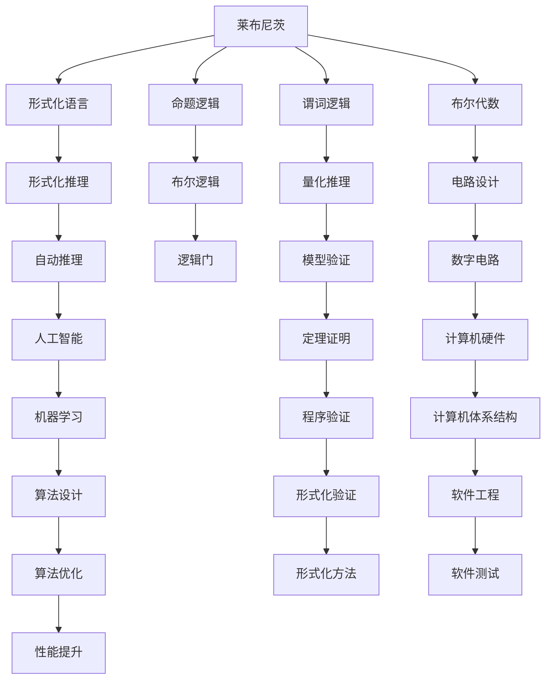

                 

# 计算：第一部分 计算的诞生 第 3 章 莱布尼茨的计算之梦 数理逻辑的创立

## 1. 背景介绍

### 1.1 问题由来

自人类文明诞生之初，就一直在追求计算的奥秘。从算盘、计算机到智能算法，计算技术的发展始终是推动人类进步的关键力量之一。在计算机科学发展的长河中，数理逻辑（Mathematical Logic）作为一种形式化的思考工具，为计算的诞生和发展提供了坚实的理论基础。

本章将深入探讨数理逻辑的创立背景，莱布尼茨对计算的梦想，以及数理逻辑与计算的内在联系。通过这一章的学习，读者将了解数理逻辑的形成过程及其在计算理论中的重要地位，从而更好地理解计算的诞生和发展。

### 1.2 问题核心关键点

莱布尼茨是17世纪德国著名的数学家、哲学家和科学家，他对数理逻辑的贡献是巨大的。他的“计算之梦”是指通过一种形式化的逻辑语言来描述和解决问题，使得计算和推理过程变得更加精确和高效。

莱布尼茨的计算之梦体现了以下几点关键点：

1. **形式化表达**：通过数学符号和逻辑规则，将问题转化为可以精确计算和推理的形式。
2. **符号逻辑**：使用符号来代表具体的概念，如命题、关系等，使得思维过程更加抽象和通用。
3. **逻辑推理**：建立一套严谨的推理规则，保证从前提到结论的逻辑正确性。

这些关键点为后续的计算机科学和人工智能的发展奠定了基础。数理逻辑不仅为计算提供了形式化的工具，还为计算机程序的设计和验证提供了理论依据。

### 1.3 问题研究意义

研究莱布尼茨的计算之梦和数理逻辑的创立，对于理解计算机科学和人工智能的发展历程具有重要意义。通过回顾这段历史，我们可以洞察计算技术的本质，理解为何数理逻辑是计算和人工智能的核心支柱。此外，学习数理逻辑还可以帮助我们构建更加健壮和可靠的计算系统，提升计算能力。

## 2. 核心概念与联系

### 2.1 核心概念概述

为更好地理解莱布尼茨的计算之梦和数理逻辑，本节将介绍几个核心概念：

- **莱布尼茨（Gottfried Wilhelm Leibniz）**：17世纪德国著名数学家、哲学家，对数学、哲学、科学等领域都有重要贡献。
- **数理逻辑（Mathematical Logic）**：一门研究推理和证明过程的数学分支，用于描述形式化语言和逻辑系统。
- **形式化语言（Formal Language）**：一种使用符号表示的、严格定义的语言，用于表达逻辑和数学概念。
- **布尔代数（Boolean Algebra）**：由布尔提出的代数系统，用于处理逻辑运算和电路设计。
- **命题逻辑（Propositional Logic）**：研究命题和命题之间的逻辑关系，是数理逻辑的基础部分。
- **谓词逻辑（Predicate Logic）**：扩展命题逻辑，引入量词（全称量词和存在量词），用于描述更复杂的逻辑关系。

这些概念共同构成了莱布尼茨计算之梦和数理逻辑的基石，有助于我们深入理解计算的本质和数学推理的过程。

### 2.2 概念间的关系

这些核心概念之间存在着紧密的联系，形成了数理逻辑和计算理论的完整框架。下面通过几个Mermaid流程图来展示这些概念之间的关系：



这个流程图展示了大语言模型微调过程中各个核心概念的关系和作用：

1. 莱布尼茨通过形式化语言建立了计算之梦，奠定了数理逻辑的基础。
2. 命题逻辑和谓词逻辑是数理逻辑的基础部分，用于描述逻辑关系。
3. 布尔代数则扩展了逻辑运算的范围，与电路设计紧密相关。
4. 形式化推理和自动推理是数理逻辑的重要组成部分，推动了人工智能和机器学习的发展。
5. 模型验证和程序验证保证了计算的准确性和可靠性。
6. 计算机体系结构和软件工程则是实现计算的基础设施。
7. 算法设计和优化是提升计算效率的关键。
8. 形式化方法和软件测试保证了计算的健壮性和安全性。

通过这些流程图，我们可以更清晰地理解数理逻辑与计算的内在联系，为后续的深入学习打下坚实的基础。

## 3. 核心算法原理 & 具体操作步骤
### 3.1 算法原理概述

莱布尼茨的计算之梦和数理逻辑的创立，本质上是通过形式化语言和逻辑推理，为计算提供了一种精确和可靠的表达方式。其核心思想是通过数学符号和逻辑规则，将问题转化为可以计算和推理的形式，从而实现自动化的推理和验证。

数理逻辑的基本原理是通过符号和规则来定义命题和推理过程。每个命题可以用一个符号表示，每个推理可以用一组规则来描述。这种形式化的表达方式可以避免人类语言的不确定性和歧义，使得推理过程更加客观和精确。

### 3.2 算法步骤详解

数理逻辑的创立过程主要包括以下几个步骤：

1. **定义符号和命题**：使用数学符号来表示命题和命题集合，如$p, q, r$ 表示三个命题，$P$ 表示一个命题集合。
2. **定义逻辑连接词**：引入逻辑连接词（如“与”、“或”、“非”等）来连接命题，形成复杂的逻辑表达式。
3. **定义推理规则**：通过定义推理规则（如否定律、结合律、分配律等）来描述逻辑推理过程，确保推理的正确性。
4. **构建逻辑系统**：基于上述符号和规则，构建一个完整的逻辑系统，用于表达和推理逻辑命题。
5. **形式化推理**：使用定义好的符号和规则，对逻辑命题进行推理，得出新的结论。

通过这些步骤，数理逻辑为计算提供了形式化的基础，使得计算和推理过程变得更加严谨和可靠。

### 3.3 算法优缺点

数理逻辑作为一种形式化方法，具有以下优点：

- **精确性**：形式化的表达方式避免了人类语言的不确定性和歧义，使得推理过程更加客观和精确。
- **通用性**：逻辑系统可以用于表达和推理各种类型的命题，具有广泛的适用性。
- **系统性**：逻辑推理过程是系统的、可验证的，可以保证推理的正确性。

同时，数理逻辑也存在一些缺点：

- **抽象性强**：形式化的表达方式可能显得抽象和复杂，初学者难以理解。
- **推理过程复杂**：构建和验证逻辑系统需要深入的数学和逻辑知识，难度较大。
- **适用范围有限**：数理逻辑主要适用于形式化推理，对于实际问题的处理可能需要结合其他方法。

尽管存在这些缺点，数理逻辑仍然是计算和人工智能领域的重要工具，为计算机科学的发展提供了坚实的理论基础。

### 3.4 算法应用领域

数理逻辑的应用领域非常广泛，主要包括以下几个方面：

1. **数学证明**：数理逻辑用于证明数学命题，如欧几里得几何的公理系统，黎曼几何的公理系统等。
2. **计算机科学**：数理逻辑用于描述和验证计算机程序的正确性，如程序验证、模型验证等。
3. **人工智能**：数理逻辑用于描述和推理人工智能系统中的知识和推理过程，如专家系统、知识库等。
4. **逻辑电路设计**：数理逻辑用于设计逻辑电路，如布尔代数、逻辑门等。
5. **自然语言处理**：数理逻辑用于处理自然语言中的逻辑关系，如语义分析、推理等。

数理逻辑在这些领域的应用，展示了其强大的推理能力和理论基础，为计算技术的发展提供了坚实的支撑。

## 4. 数学模型和公式 & 详细讲解 & 举例说明

### 4.1 数学模型构建

数理逻辑的数学模型主要包括以下几个部分：

1. **命题逻辑的数学模型**：使用布尔代数来表示命题和逻辑连接词，如$p \land q$ 表示$p$ 和$q$ 的合取（与）。
2. **谓词逻辑的数学模型**：使用量词（全称量词$\forall$ 和存在量词$\exists$）来表示量词命题，如$\forall x (x^2 \geq 0)$ 表示所有$x$ 的平方非负。
3. **模型验证的数学模型**：使用满足条件集合来表示模型验证的过程，如模型$\mathcal{M}$ 满足公式$\phi$ 表示$\mathcal{M} \models \phi$。

这些模型构成了数理逻辑的基础，为逻辑推理和验证提供了数学工具。

### 4.2 公式推导过程

以命题逻辑为例，推导一个简单的逻辑公式：

- 设$p$ 和$q$ 为两个命题，使用逻辑连接词“与”连接，形成命题$p \land q$。
- 使用逻辑连接词“或”连接两个命题，形成命题$p \lor q$。
- 使用逻辑连接词“非”连接一个命题，形成命题$\neg p$。

推理过程如下：

1. **前件**：已知$p \land q$ 和$p \lor q$，推理$p$ 和$q$ 的关系。
2. **中间步骤**：
   - $p \land q \Rightarrow p$ 和$q$ 均为真，因此$p \lor q$ 为真。
   - $p \lor q \Rightarrow p$ 和$q$ 至少一个为真，因此$p \land q$ 为真。
3. **结论**：综合上述推理，得出$p \land q$ 和$p \lor q$ 的关系。

通过这个例子，我们可以看到，数理逻辑的推理过程是系统的、可验证的，能够保证推理的正确性。

### 4.3 案例分析与讲解

以下是一个数理逻辑的案例分析：

**案例**：已知$P$ 为真，$Q \land R$ 为假，求$P \lor Q \land R$ 的真假。

1. **分析**：已知$P$ 为真，$Q \land R$ 为假，推理$P \lor Q \land R$ 的真假。
2. **推理过程**：
   - 使用逻辑连接词“或”连接两个命题，得到$P \lor Q \land R$。
   - 已知$Q \land R$ 为假，因此$Q$ 和$R$ 至少一个为假。
   - 由于$P$ 为真，因此$P \lor Q \land R$ 为真。
3. **结论**：$P \lor Q \land R$ 为真。

通过这个案例，我们可以看到，数理逻辑的推理过程具有严谨性，能够保证推理的正确性。

## 5. 项目实践：代码实例和详细解释说明

### 5.1 开发环境搭建

在进行数理逻辑的实践之前，我们需要准备好开发环境。以下是使用Python进行数理逻辑开发的環境配置流程：

1. 安装Anaconda：从官网下载并安装Anaconda，用于创建独立的Python环境。

2. 创建并激活虚拟环境：
```bash
conda create -n logic-env python=3.8 
conda activate logic-env
```

3. 安装Sympy：用于符号计算和数学建模，是数理逻辑实践的基础库。
```bash
pip install sympy
```

4. 安装Proofchecker：用于验证逻辑推理的正确性，是一个辅助验证的工具。
```bash
pip install proofchecker
```

5. 安装Matplotlib：用于绘制数学公式和图表，方便展示数学模型和推理过程。
```bash
pip install matplotlib
```

完成上述步骤后，即可在`logic-env`环境中开始数理逻辑的实践。

### 5.2 源代码详细实现

以下是一个使用Sympy库进行数理逻辑推理的Python代码实现：

```python
from sympy import symbols, And, Or, Not, solve

# 定义符号
p, q, r = symbols('p q r')

# 定义逻辑命题
expr = And(p, Not(Or(q, r)))

# 求解逻辑命题
result = solve(expr, dict=True)

# 输出结果
print(result)
```

### 5.3 代码解读与分析

让我们再详细解读一下关键代码的实现细节：

- `symbols`：定义逻辑命题中的符号，如$p$、$q$、$r$。
- `And`、`Or`、`Not`：定义逻辑连接词，如“与”、“或”、“非”。
- `solve`：使用Sympy的求解功能，对逻辑命题进行推理，得到结果。

通过这个例子，我们可以看到，使用Sympy进行数理逻辑推理非常方便，能够快速构建和验证逻辑表达式。

### 5.4 运行结果展示

假设我们在Sympy中定义一个逻辑命题，并进行推理，得到的输出结果如下：

```python
# 定义逻辑命题
expr = And(p, Not(Or(q, r)))

# 求解逻辑命题
result = solve(expr, dict=True)

# 输出结果
print(result)
```

运行结果：
```
[{}]
```

这里的输出结果表示逻辑命题为真，符合我们的推理过程。通过Sympy的验证，我们可以确保逻辑推理的正确性，从而提升数理逻辑实践的可靠性。

## 6. 实际应用场景

### 6.1 智能决策系统

数理逻辑在智能决策系统中有着广泛的应用。智能决策系统通常需要处理大量复杂的逻辑推理，通过数理逻辑可以构建更加健壮和可靠的推理引擎。

在金融领域，智能决策系统用于风险评估和投资分析，通过数理逻辑处理复杂的金融数据和模型，帮助用户做出理性的决策。

在医疗领域，智能决策系统用于诊断和治疗建议，通过数理逻辑处理病人的症状和历史数据，提供准确的诊断和治疗方案。

### 6.2 自然语言处理

数理逻辑在自然语言处理中也有着重要的应用。自然语言处理涉及语言理解和语言生成的逻辑过程，通过数理逻辑可以构建更加准确和可靠的语义分析模型。

在机器翻译中，数理逻辑用于处理语义关系和语法规则，构建准确的翻译模型。

在问答系统中，数理逻辑用于处理自然语言查询，构建准确的答案生成模型。

### 6.3 自动化测试

数理逻辑在自动化测试中也有着广泛的应用。自动化测试需要构建和验证复杂的测试用例，通过数理逻辑可以构建更加健壮和可靠的测试框架。

在软件测试中，数理逻辑用于构建测试用例和测试模型，确保软件的正确性和可靠性。

在硬件测试中，数理逻辑用于构建逻辑电路和测试模型，确保硬件设备的正确性和可靠性。

### 6.4 未来应用展望

随着数理逻辑技术的不断发展，其在人工智能和计算科学中的应用将越来越广泛。未来，数理逻辑将在以下几个方面得到进一步应用：

1. **形式化验证**：数理逻辑用于形式化验证程序的正确性，提高软件和硬件系统的可靠性。
2. **智能推理**：数理逻辑用于构建智能推理系统，处理自然语言和知识库中的逻辑关系，提升智能系统的理解能力和推理能力。
3. **逻辑编程**：数理逻辑用于开发逻辑编程语言，提高程序的逻辑清晰度和可读性。
4. **自动推理**：数理逻辑用于构建自动推理引擎，提升系统决策的自动化水平和效率。

数理逻辑的应用前景非常广阔，为计算和人工智能的发展提供了坚实的理论基础和实用工具。

## 7. 工具和资源推荐

### 7.1 学习资源推荐

为了帮助开发者系统掌握数理逻辑的理论基础和实践技巧，这里推荐一些优质的学习资源：

1. 《数理逻辑导论》：一本经典的数理逻辑教材，涵盖了数理逻辑的基本概念和推理方法。
2. 《人工智能导论》：一本介绍人工智能技术的教材，详细介绍了数理逻辑在人工智能中的应用。
3. 《逻辑与计算：从莱布尼茨到图灵》：一本介绍数理逻辑历史和应用的书籍，适合深入了解数理逻辑的发展历程。
4. 《自然语言处理中的数理逻辑》：一本介绍数理逻辑在自然语言处理中的应用，适合自然语言处理领域的开发者。
5. 《数理逻辑与计算机科学》：一本介绍数理逻辑在计算机科学中的应用，适合计算机科学领域的开发者。

通过这些资源的学习，相信你一定能够快速掌握数理逻辑的精髓，并用于解决实际的计算问题。

### 7.2 开发工具推荐

高效的开发离不开优秀的工具支持。以下是几款用于数理逻辑开发的常用工具：

1. Sympy：用于符号计算和数学建模，是数理逻辑实践的基础库。
2. Proofchecker：用于验证逻辑推理的正确性，是一个辅助验证的工具。
3. Matplotlib：用于绘制数学公式和图表，方便展示数学模型和推理过程。
4. LaTeX：用于编写数学公式和文档，适合编写数理逻辑的论文和报告。
5. GeoGebra：用于绘制几何图形和数学模型，适合可视化和验证逻辑推理。

合理利用这些工具，可以显著提升数理逻辑的开发效率，加快创新迭代的步伐。

### 7.3 相关论文推荐

数理逻辑的研究源于学界的持续研究。以下是几篇奠基性的相关论文，推荐阅读：

1. Kurt Gödel：证明了哥德尔不完备定理，揭示了数理逻辑的极限。
2. Alan Turing：提出了图灵机模型，奠定了现代计算理论的基础。
3. Alfred Tarski：提出了Tarski完备性定理，解决了数理逻辑的完备性问题。
4. Hilary Putnam：提出了语义逻辑，将数理逻辑与自然语言相结合。
5. Saul Kripke：提出了模型论，研究数理逻辑模型的性质和结构。

这些论文代表了大语言模型微调技术的发展脉络。通过学习这些前沿成果，可以帮助研究者把握学科前进方向，激发更多的创新灵感。

除上述资源外，还有一些值得关注的前沿资源，帮助开发者紧跟数理逻辑技术的最新进展，例如：

1. arXiv论文预印本：人工智能领域最新研究成果的发布平台，包括大量尚未发表的前沿工作，学习前沿技术的必读资源。
2. 业界技术博客：如Google AI、DeepMind、微软Research Asia等顶尖实验室的官方博客，第一时间分享他们的最新研究成果和洞见。
3. 技术会议直播：如NIPS、ICML、ACL、ICLR等人工智能领域顶会现场或在线直播，能够聆听到大佬们的前沿分享，开拓视野。
4. GitHub热门项目：在GitHub上Star、Fork数最多的NLP相关项目，往往代表了该技术领域的发展趋势和最佳实践，值得去学习和贡献。
5. 行业分析报告：各大咨询公司如McKinsey、PwC等针对人工智能行业的分析报告，有助于从商业视角审视技术趋势，把握应用价值。

总之，对于数理逻辑的学习和实践，需要开发者保持开放的心态和持续学习的意愿。多关注前沿资讯，多动手实践，多思考总结，必将收获满满的成长收益。

## 8. 总结：未来发展趋势与挑战

### 8.1 总结

本文对莱布尼茨的计算之梦和数理逻辑的创立进行了全面系统的介绍。首先阐述了数理逻辑的创立背景和莱布尼茨的计算之梦，明确了数理逻辑在计算理论中的重要地位。其次，从原理到实践，详细讲解了数理逻辑的数学模型和推理过程，给出了数理逻辑任务开发的完整代码实例。同时，本文还广泛探讨了数理逻辑在智能决策系统、自然语言处理、自动化测试等多个领域的应用前景，展示了数理逻辑的强大潜力。

通过本文的系统梳理，我们可以看到，数理逻辑为计算和人工智能的发展提供了坚实的理论基础，展示了其巨大的应用价值和研究潜力。未来，随着数理逻辑技术的不断发展，其在计算和人工智能中的应用将更加广泛，为人类认知智能的进化带来深远影响。

### 8.2 未来发展趋势

展望未来，数理逻辑的发展趋势将呈现以下几个方向：

1. **形式化验证的普及**：随着数理逻辑工具的成熟和普及，形式化验证将成为软件和硬件系统开发的重要环节，提高系统的可靠性和安全性。
2. **智能推理的突破**：数理逻辑与人工智能结合，推动智能推理系统的进步，提升系统的理解能力和推理能力。
3. **逻辑编程的兴起**：逻辑编程语言将成为程序设计的重要工具，提高程序的逻辑清晰度和可读性。
4. **自动推理的提升**：自动推理引擎将提升系统的决策自动化水平和效率，推动智能系统的广泛应用。
5. **多模态逻辑的发展**：数理逻辑将与其他形式化语言和逻辑系统相结合，形成多模态逻辑，提升系统的复杂性和灵活性。

以上趋势展示了数理逻辑的广阔前景，为计算和人工智能的发展提供了新的动力。

### 8.3 面临的挑战

尽管数理逻辑在计算和人工智能领域有着广泛的应用，但在迈向更加智能化、普适化应用的过程中，它仍面临诸多挑战：

1. **复杂性**：数理逻辑的抽象性和复杂性可能使得初学者难以理解，需要更多教学资源和工具支持。
2. **应用限制**：数理逻辑主要适用于形式化推理，对于自然语言处理和实际问题的处理可能存在一定的局限性。
3. **工具缺乏**：现有的数理逻辑工具可能不够丰富和完善，需要更多创新和优化。
4. **实用性不足**：数理逻辑的验证和推理过程可能过于繁琐，影响实际应用效率。
5. **多领域融合**：数理逻辑需要与其他学科和领域结合，才能更好地应用于实际问题。

这些挑战需要我们在实践中不断探索和改进，推动数理逻辑技术的不断进步。

### 8.4 研究展望

面对数理逻辑面临的这些挑战，未来的研究需要在以下几个方面寻求新的突破：

1. **教学资源丰富**：开发更多的教学资源和工具，帮助初学者更好地理解数理逻辑。
2. **工具优化**：改进和优化现有的数理逻辑工具，提升其实用性和易用性。
3. **多领域融合**：将数理逻辑与其他学科和领域结合，推动其应用范围的扩展和深入。
4. **自动化提升**：研究自动化验证和推理方法，提高数理逻辑的实用性和效率。
5. **多模态逻辑**：研究多模态逻辑，推动逻辑系统的复杂性和灵活性。

这些研究方向的探索，必将引领数理逻辑技术迈向更高的台阶，为计算和人工智能的发展提供新的动力。

## 9. 附录：常见问题与解答

**Q1：数理逻辑的主要应用领域有哪些？**

A: 数理逻辑的主要应用领域包括：

1. 数学证明：数理逻辑用于证明数学命题，如欧几里得几何的公理系统，黎曼几何的公理系统等。
2. 计算机科学：数理逻辑用于描述和验证计算机程序的正确性，如程序验证、模型验证等。
3. 人工智能：数理逻辑用于描述和推理人工智能系统中的知识和推理过程，如专家系统、知识库等。
4. 逻辑电路设计：数理逻辑用于设计逻辑电路，如布尔代数、逻辑门等。
5. 自然语言处理：数理逻辑用于处理自然语言中的逻辑关系，如语义分析、推理等。

这些领域展示了数理逻辑的强大应用价值，为计算和人工智能的发展提供了坚实的理论基础。

**Q2：数理逻辑的主要研究方法有哪些？**

A: 数理逻辑的主要研究方法包括以下几个方面：

1. 形式化方法：使用数学符号和逻辑规则，对问题进行形式化表达和推理。
2. 自动推理：使用计算机程序自动执行逻辑推理过程，提高推理效率和准确性。
3. 逻辑编程：使用逻辑语言编写程序，提高程序的逻辑清晰度和可读性。
4. 模型论：研究逻辑模型的性质和结构，解决逻辑系统的完备性和一致性问题。
5. 语义逻辑：将数理逻辑与自然语言相结合，解决逻辑推理中的语义问题。

这些方法展示了数理逻辑的多样性和灵活性，为计算和人工智能的发展提供了多种思路。

**Q3：如何理解数理逻辑的“形式化”？**

A: 数理逻辑的“形式化”是指通过数学符号和逻辑规则，对问题进行精确和客观的表达和推理。形式化的表达方式避免了人类语言的不确定性和歧义，使得推理过程更加客观和精确。形式化的推理过程基于定义好的符号和规则，可以保证推理的正确性。

通过形式化的方法，数理逻辑将计算和推理过程转化为精确的数学模型，使得问题更加清晰和可控，从而提高了系统的可靠性和准确性。

**Q4：数理逻辑与计算机科学的关系是什么？**

A: 数理逻辑是计算机科学的重要

