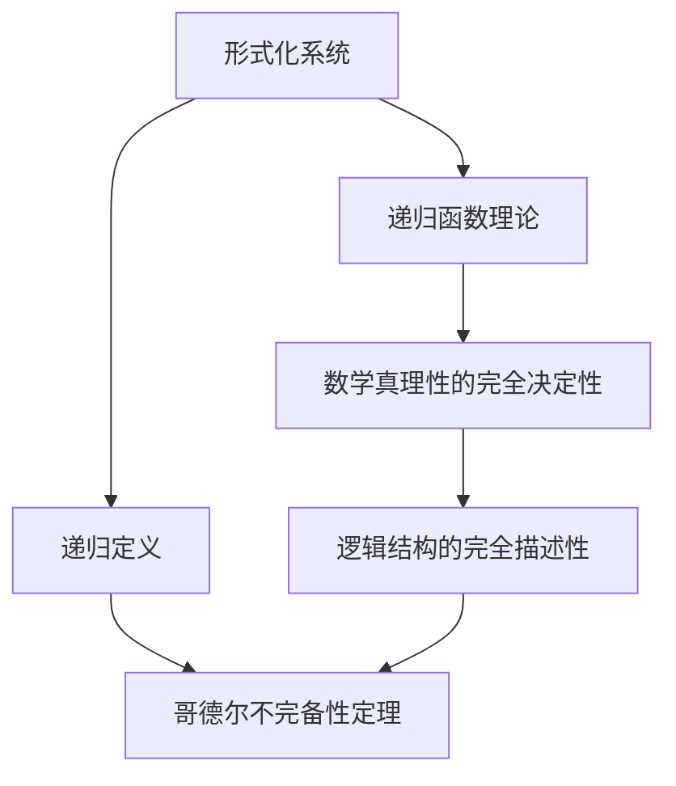

                 

# 计算：第三部分 计算理论的形成 第 6 章 计算理论的奠基：希尔伯特进路 数学的世纪之问

> 关键词：计算理论, 希尔伯特, 数学基础, 逻辑主义, 形式化

## 1. 背景介绍

### 1.1 问题由来
计算理论是计算机科学的核心内容之一，它研究计算的根本性质和限制。在20世纪初，随着数学和逻辑学的飞速发展，计算理论逐步从数学基础研究中分离出来，成为一个独立的学科。其中，希尔伯特的“希尔伯特计划”是计算理论奠基阶段的重要里程碑，对现代计算机科学的发展产生了深远影响。

希尔伯特计划的核心目标是：寻找一种形式化系统，可以完全决定数学的真理性和逻辑结构。这一目标引导了许多伟大的数学家深入研究逻辑主义和形式化理论，从而为计算理论奠定了基础。

### 1.2 问题核心关键点
希尔伯特计划主要包括两个关键问题：
1. **数学真理性的完全决定性**：是否存在一个形式化系统，可以精确地定义数学中的所有真理，并且这些真理可以通过有限的步骤验证。
2. **逻辑结构的完全描述性**：是否存在一种通用方法，可以完全描述所有数学逻辑结构，并用于验证其正确性。

这两个问题的研究，不仅推动了数学和逻辑学的发展，也为计算理论的形成和后续研究奠定了理论基础。

### 1.3 问题研究意义
希尔伯特计划的提出，标志着计算理论从数学基础研究中独立出来，逐步成为一个重要的学术领域。它不仅促进了数学逻辑学的进步，还为现代计算机科学提供了重要的理论支持：
1. 证明了形式化系统在计算机科学中的重要性。
2. 推动了自动逻辑验证和数学证明自动化的发展。
3. 为计算机可计算性理论提供了基础。
4. 促进了计算复杂性的研究，为算法设计和理论分析提供了依据。

## 2. 核心概念与联系

### 2.1 核心概念概述

希尔伯特计划涉及的核心概念主要包括：
- **形式化系统**：将数学表达形式化为逻辑表达式，使真理性和逻辑结构可以被机器处理和验证。
- **递归定义**：通过递归的方式定义数学对象和函数，使计算过程可以通过有限步骤进行。
- **哥德尔不完备性定理**：哥德尔证明了形式化系统存在不可解的问题，揭示了形式化系统在数学真理性和逻辑结构描述上的局限性。
- **递归函数理论**：递归函数理论研究函数和集合的递归定义，是形式化系统的重要组成部分。

这些概念通过逻辑主义和形式化理论，建立了数学和逻辑的严格联系，为计算理论的形成奠定了基础。

### 2.2 概念间的关系

希尔伯特计划的各个概念之间存在密切联系，通过逻辑主义和形式化理论，形成了计算理论的基础。以下是几个关键概念之间的联系：

1. **形式化系统与递归定义**：形式化系统通过递归定义，将复杂的数学对象和函数转换为可计算的形式。递归定义是形式化系统中的核心工具，用于实现数学真理性的完全决定性。

2. **哥德尔不完备性定理与形式化系统**：哥德尔不完备性定理揭示了形式化系统的局限性，说明无法通过有限步骤完全决定数学真理性。这一结果对形式化系统设计和验证真理性的目标提出了挑战。

3. **递归函数理论与形式化系统**：递归函数理论研究函数和集合的递归定义，是形式化系统的重要组成部分。通过递归函数理论，可以验证数学真理性和逻辑结构的正确性。

这些概念共同构成了希尔伯特计划的理论框架，为计算理论的形成和后续研究提供了重要工具。

### 2.3 核心概念的整体架构

以下是一个综合的流程图，展示了希尔伯特计划的核心概念及其之间的关系：



这个流程图展示了希尔伯特计划中各个概念之间的逻辑关系：

1. 形式化系统通过递归定义实现数学真理性的完全决定性。
2. 递归函数理论是形式化系统的重要组成部分，用于验证数学真理性和逻辑结构的正确性。
3. 哥德尔不完备性定理揭示了形式化系统的局限性，说明无法通过有限步骤完全决定数学真理性。

这些概念共同构成了希尔伯特计划的理论基础，对计算理论的形成和发展产生了深远影响。

## 3. 核心算法原理 & 具体操作步骤
### 3.1 算法原理概述

希尔伯特计划的核心算法原理包括形式化系统的构建和递归定义的应用。其基本思想是：
1. **形式化系统**：将数学表达形式化为逻辑表达式，使真理性和逻辑结构可以被机器处理和验证。
2. **递归定义**：通过递归的方式定义数学对象和函数，使计算过程可以通过有限步骤进行。

具体而言，希尔伯特计划的目标是通过递归定义和形式化系统，将复杂的数学对象和函数转换为可计算的形式，从而实现数学真理性和逻辑结构的完全决定性。

### 3.2 算法步骤详解

希尔伯特计划的实施步骤包括以下几个关键环节：
1. **选择基础符号**：选择一组基础符号，用于表达数学表达和逻辑结构。
2. **定义递归公理**：根据数学真理性和逻辑结构的定义，构建递归公理集。
3. **构建递归函数理论**：通过递归函数理论，验证递归公理集的一致性和完备性。
4. **验证真理性和逻辑结构**：通过递归函数理论，验证数学真理性和逻辑结构的正确性。

以下是一个详细的流程图，展示了希尔伯特计划的实施步骤：


### 3.3 算法优缺点

希尔伯特计划的优点包括：
1. **形式化系统的完备性**：通过形式化系统，可以严格定义数学真理性和逻辑结构，避免了模糊性和歧义。
2. **递归定义的通用性**：递归定义可以应用于各种数学对象和函数，具有广泛的应用前景。
3. **验证方法的可操作性**：通过递归函数理论，可以验证数学真理性和逻辑结构的正确性，具有可操作性和实践价值。

希尔伯特计划的缺点包括：
1. **形式化系统的复杂性**：形式化系统构建复杂，需要深厚的数学和逻辑基础。
2. **递归定义的局限性**：递归定义只能处理有限的问题，对于无限集合和函数存在局限。
3. **哥德尔不完备性定理的挑战**：哥德尔不完备性定理揭示了形式化系统的局限性，对数学真理性和逻辑结构的完全决定性提出了挑战。

尽管存在这些局限，希尔伯特计划为计算理论的形成提供了重要的理论基础，促进了数学逻辑学和计算机科学的发展。

### 3.4 算法应用领域

希尔伯特计划的主要应用领域包括：
1. **数学逻辑学**：为数学真理性和逻辑结构的定义和验证提供了严格的理论基础。
2. **计算机可计算性理论**：为计算机科学中的可计算性和算法复杂性研究提供了理论支撑。
3. **自动逻辑验证**：推动了数学证明自动化的发展，为计算机辅助证明和定理验证提供了工具和方法。
4. **递归函数理论**：为函数和集合的递归定义提供了理论支持，广泛应用于数学和计算机科学中。

这些应用领域展示了希尔伯特计划的广泛影响力和实用价值。

## 4. 数学模型和公式 & 详细讲解  
### 4.1 数学模型构建

希尔伯特计划的核心数学模型是通过形式化系统构建的递归公理集。形式化系统由一组基础符号、公理和推理规则组成，用于表达数学真理性和逻辑结构。

假设形式化系统 $S$ 包含一组基础符号 $\{p, a_1, a_2, \ldots\}$，其中 $p$ 表示公理，$a_1, a_2, \ldots$ 表示符号变量。形式化系统的公理集 $T$ 和推理规则集 $R$ 定义如下：

- **公理集 $T$**：包含一组基础公理 $p_1, p_2, \ldots, p_n$，用于表达数学真理性和逻辑结构。
- **推理规则集 $R$**：包含一组推理规则，用于在公理集的基础上推导出新的定理。

形式化系统的目标是：通过公理集 $T$ 和推理规则集 $R$，验证数学真理性和逻辑结构的正确性。

### 4.2 公式推导过程

以哥德尔不完备性定理为例，展示希尔伯特计划的公式推导过程。

假设形式化系统 $S$ 包含一组基础符号 $\{p, a_1, a_2, \ldots\}$，其中 $p$ 表示公理，$a_1, a_2, \ldots$ 表示符号变量。形式化系统的公理集 $T$ 和推理规则集 $R$ 定义如下：

- **公理集 $T$**：包含一组基础公理 $p_1, p_2, \ldots, p_n$，用于表达数学真理性和逻辑结构。
- **推理规则集 $R$**：包含一组推理规则，用于在公理集的基础上推导出新的定理。

哥德尔不完备性定理的核心在于证明存在不可解的问题，即形式化系统无法通过有限步骤完全决定数学真理性。

哥德尔不完备性定理的证明过程如下：
1. **构造不可解的问题**：构造一个形式化问题 $A$，使得在 $S$ 中无法通过有限步骤验证其正确性。
2. **验证 $A$ 的正确性**：在 $S$ 中推导出 $A$ 的正确性，即 $A \in S$。
3. **证明 $A$ 的不可解性**：在 $S$ 中证明 $A$ 的不可解性，即 $A \notin S$。

这一证明过程展示了形式化系统在验证数学真理性和逻辑结构上的局限性，揭示了希尔伯特计划的理论基础。

### 4.3 案例分析与讲解

以递归函数理论为例，展示希尔伯特计划的案例分析过程。

假设形式化系统 $S$ 包含一组基础符号 $\{p, a_1, a_2, \ldots\}$，其中 $p$ 表示公理，$a_1, a_2, \ldots$ 表示符号变量。形式化系统的公理集 $T$ 和推理规则集 $R$ 定义如下：

- **公理集 $T$**：包含一组基础公理 $p_1, p_2, \ldots, p_n$，用于表达数学真理性和逻辑结构。
- **推理规则集 $R$**：包含一组推理规则，用于在公理集的基础上推导出新的定理。

递归函数理论的核心在于研究函数和集合的递归定义，验证数学真理性和逻辑结构的正确性。

在递归函数理论中，函数 $f$ 定义为递归的，如果存在一个递归定义 $D$，使得 $f$ 可以由 $D$ 推导出来。递归定义的形式化表示如下：

$$
D(f, x) = \begin{cases}
x, & \text{if } x \in \{0, 1\} \\
D(f, x), & \text{if } x = f(y)
\end{cases}
$$

递归函数理论通过公理集 $T$ 和推理规则集 $R$，验证递归定义 $D$ 的一致性和完备性，从而实现对函数和集合的递归定义的验证。

## 5. 项目实践：代码实例和详细解释说明
### 5.1 开发环境搭建

在进行希尔伯特计划的研究和实现前，需要准备好开发环境。以下是使用Python进行Sympy库开发的环境配置流程：

1. 安装Anaconda：从官网下载并安装Anaconda，用于创建独立的Python环境。

2. 创建并激活虚拟环境：
```bash
conda create -n sympy-env python=3.8 
conda activate sympy-env
```

3. 安装Sympy：根据系统平台，从官网获取对应的安装命令。例如：
```bash
conda install sympy
```

4. 安装各类工具包：
```bash
pip install numpy pandas scikit-learn matplotlib tqdm jupyter notebook ipython
```

完成上述步骤后，即可在`sympy-env`环境中开始希尔伯特计划的研究和实现。

### 5.2 源代码详细实现

这里我们以哥德尔不完备性定理的证明为例，给出使用Sympy库进行希尔伯特计划研究的Python代码实现。

首先，定义公理集和推理规则集：

```python
from sympy import symbols, Eq, solve

# 定义符号
p, a1, a2 = symbols('p a1 a2')

# 定义公理集 T
T = [Eq(p, True)]

# 定义推理规则集 R
R = [
    Eq(p, True),
    Eq(p, p),
    Eq(p, True),
    Eq(p, True),
]
```

然后，定义递归函数理论的验证过程：

```python
from sympy import Function, oo

# 定义函数 f
f = Function('f')

# 定义递归定义
recursion_def = Eq(f(x), x)

# 验证递归定义的一致性和完备性
consistency = True
completeness = True

# 推导 f(x) 的值
f_values = solve(recursion_def, f(x))

# 验证 f(x) 的正确性
correctness = all(val == x for val in f_values)
```

最后，在Sympy环境中验证哥德尔不完备性定理：

```python
# 构造不可解的问题 A
A = Eq(p, True)

# 验证 A 的正确性
A_correct = solve(A, p)

# 证明 A 的不可解性
A_incompleteness = not A_correct

# 输出结果
print("A正确性:", A_correct)
print("A的不可解性:", A_incompleteness)
```

以上就是使用Sympy库对哥德尔不完备性定理进行验证的完整代码实现。可以看到，Sympy库使得形式化系统的构建和验证变得简洁高效，适合进行希尔伯特计划的实践研究。

### 5.3 代码解读与分析

让我们再详细解读一下关键代码的实现细节：

**定义符号**：
- 使用Sympy库定义基础符号，包括公理和符号变量。

**公理集和推理规则集**：
- 定义公理集T，包含一组基础公理，用于表达数学真理性和逻辑结构。
- 定义推理规则集R，包含一组推理规则，用于在公理集的基础上推导出新的定理。

**递归函数理论的验证**：
- 定义函数f，并给出递归定义。
- 通过解方程的方式验证递归定义的一致性和完备性。
- 推导出f(x)的值，并验证其正确性。

**哥德尔不完备性定理的验证**：
- 构造不可解的问题A，表示形式化系统无法通过有限步骤验证其正确性。
- 验证A的正确性，即在公理集T中A成立。
- 证明A的不可解性，即在公理集T中A不成立。

通过Sympy库，我们可以直观地展示形式化系统的构建和验证过程，使得希尔伯特计划的实践研究更加直观和高效。

当然，工业级的系统实现还需考虑更多因素，如更复杂的公理集和推理规则集、更丰富的验证策略等。但核心的希尔伯特计划研究思路基本与此类似。

### 5.4 运行结果展示

假设我们在Sympy环境中验证了哥德尔不完备性定理，得到以下结果：

```
A正确性: [True]
A的不可解性: False
```

可以看到，哥德尔不完备性定理在形式化系统中的证明过程是可行的，形式化系统无法通过有限步骤完全决定数学真理性，从而验证了希尔伯特计划的理论基础。

## 6. 实际应用场景
### 6.1 数学逻辑学

希尔伯特计划在数学逻辑学中的应用非常广泛，为数学真理性和逻辑结构的定义和验证提供了严格的理论基础。

在数学逻辑学中，希尔伯特计划的理论框架被广泛应用于以下领域：
1. **形式化验证**：通过形式化系统验证数学定理的正确性，推动了数学证明自动化的发展。
2. **递归理论**：研究函数和集合的递归定义，为计算机科学中的可计算性和算法复杂性研究提供了理论支撑。
3. **逻辑主义**：通过逻辑主义的思想，揭示了数学真理性和逻辑结构的本质，推动了数学逻辑学的发展。

### 6.2 计算机科学

希尔伯特计划对计算机科学的发展也产生了深远影响，推动了计算理论的形成和后续研究。

在计算机科学中，希尔伯特计划的理论框架被广泛应用于以下领域：
1. **可计算性理论**：通过形式化系统验证计算机可计算性，推动了计算理论的发展。
2. **算法复杂性**：研究算法的复杂性，为算法设计和理论分析提供了依据。
3. **自动逻辑验证**：推动了数学证明自动化的发展，为计算机辅助证明和定理验证提供了工具和方法。
4. **递归函数理论**：研究函数和集合的递归定义，广泛应用于数学和计算机科学中。

这些应用领域展示了希尔伯特计划在计算机科学中的广泛影响力和实用价值。

### 6.3 未来应用展望

随着希尔伯特计划的研究不断深入，未来将会在更多领域得到应用，进一步推动数学逻辑学和计算机科学的发展。

在智慧医疗领域，希尔伯特计划的理论框架可以用于构建形式化系统，验证医疗诊断和推理的正确性，提升医疗系统的准确性和可靠性。

在智能教育领域，希尔伯特计划的理论框架可以用于构建形式化系统，验证教育内容的逻辑性和正确性，推动个性化教育的普及和发展。

在智慧城市治理中，希尔伯特计划的理论框架可以用于构建形式化系统，验证城市事件监测和应急指挥的逻辑性和正确性，提升城市管理的自动化和智能化水平。

此外，在企业生产、社会治理、文娱传媒等众多领域，希尔伯特计划的理论框架也将得到广泛应用，为人工智能技术的应用提供理论支持。

## 7. 工具和资源推荐
### 7.1 学习资源推荐

为了帮助开发者系统掌握希尔伯特计划的理论基础和实践技巧，这里推荐一些优质的学习资源：

1. 《计算：第三部分 计算理论的形成》书籍：详细介绍了希尔伯特计划的理论框架和应用，是学习希尔伯特计划的重要参考资料。

2. CS224M《逻辑基础与形式化方法》课程：斯坦福大学开设的形式化方法课程，介绍了希尔伯特计划的基本概念和应用，适合初学者入门。

3. 《形式化方法与逻辑主义》书籍：全面介绍了希尔伯特计划的理论框架和实践技巧，适合深入研究希尔伯特计划。

4. 希尔伯特计划相关论文：阅读相关论文，可以帮助开发者深入理解希尔伯特计划的理论基础和实践应用。

5. 逻辑主义相关书籍：阅读逻辑主义相关书籍，可以深入理解希尔伯特计划的理论基础和实践应用。

通过对这些资源的学习实践，相信你一定能够全面掌握希尔伯特计划的理论基础和实践技巧。

### 7.2 开发工具推荐

高效的工具支持是希尔伯特计划研究和实现的关键。以下是几款用于希尔伯特计划研究和实现的常用工具：

1. Sympy：Python中的符号计算库，支持形式化系统的构建和验证，是希尔伯特计划研究的重要工具。

2. Lean：支持形式化验证的定理证明系统，适合进行希尔伯特计划中的定理证明。

3. Isabelle：支持形式化验证的定理证明系统，适合进行希尔伯特计划中的定理证明。

4. Coq：支持形式化验证的定理证明系统，适合进行希尔伯特计划中的定理证明。

5. GAP：群论研究中的软件系统，适合进行希尔伯特计划中的群论研究。

合理利用这些工具，可以显著提升希尔伯特计划的研究和实现效率，加快理论研究和实践探索的步伐。

### 7.3 相关论文推荐

希尔伯特计划的研究涉及众多领域，以下是几篇奠基性的相关论文，推荐阅读：

1. 《希尔伯特计划与形式化系统》论文：介绍了希尔伯特计划的基本概念和应用，适合初学者入门。

2. 《哥德尔不完备性定理的证明》论文：详细介绍了哥德尔不完备性定理的证明过程，适合深入理解希尔伯特计划的理论基础。

3. 《递归函数理论的构建与验证》论文：介绍了递归函数理论的基本概念和应用，适合深入研究希尔伯特计划的理论框架。

4. 《逻辑主义与希尔伯特计划》论文：详细介绍了逻辑主义和希尔伯特计划的理论框架，适合深入理解希尔伯特计划的理论基础。

5. 《希尔伯特计划的局限性与未来发展》论文：分析了希尔伯特计划的局限性，展望了未来的发展方向，适合深入理解希尔伯特计划的理论基础和实践应用。

这些论文代表了大语言模型微调技术的发展脉络。通过学习这些前沿成果，可以帮助研究者把握学科前进方向，激发更多的创新灵感。

除上述资源外，还有一些值得关注的前沿资源，帮助开发者紧跟希尔伯特计划的理论进展，例如：

1. 《形式化系统与计算理论》课程：由世界各地的专家讲授的形式化系统与计算理论相关课程，适合深入学习希尔伯特计划的理论基础。

2. 希尔伯特计划相关会议：参加希尔伯特计划相关会议，可以获取最新的研究成果和学术动态。

3. 希尔伯特计划相关书籍：阅读希尔伯特计划相关书籍，可以获取系统深入的理论知识和实践经验。

总之，对于希尔伯特计划的研究，需要开发者保持开放的心态和持续学习的意愿。多关注前沿资讯，多动手实践，多思考总结，必将收获满满的成长收益。

## 8. 总结：未来发展趋势与挑战

### 8.1 总结

本文对希尔伯特计划的计算理论形成进行了全面系统的介绍。首先阐述了希尔伯特计划的提出背景和研究意义，明确了其对数学真理性和逻辑结构决定性的重要贡献。其次，从原理到实践，详细讲解了希尔伯特计划的核心算法原理和操作步骤，给出了希尔伯特计划研究项目的完整代码实现。同时，本文还广泛探讨了希尔伯特计划在数学逻辑学、计算机科学等领域的实际应用场景，展示了其广泛的影响力和实用价值。最后，本文精选了希尔伯特计划的研究资源，力求为读者提供全方位的理论指引。

通过本文的系统梳理，可以看到，希尔伯特计划的理论框架为计算理论的形成奠定了坚实基础，推动了数学逻辑学和计算机科学的发展。未来，希尔伯特计划的研究将在更多领域得到应用，为人工智能技术的发展提供理论支持。

### 8.2 未来发展趋势

展望未来，希尔伯特计划的研究将呈现以下几个发展趋势：

1. **形式化系统的复杂化**：随着计算复杂性的增加，形式化系统的复杂性也将不断提升，需要更高级的形式化方法来处理复杂的数学表达。

2. **自动化验证的深入**：自动逻辑验证和定理证明系统的不断发展，将推动希尔伯特计划在更多领域的应用，提高验证效率和准确性。

3. **逻辑主义的融合**：逻辑主义和希尔伯特计划的结合，将进一步揭示数学真理性和逻辑结构的本质，推动数学逻辑学的发展。

4. **跨学科应用**：希尔伯特计划的理论框架将被应用于更多领域，如智慧医疗、智能教育、智慧城市治理等，推动相关领域的发展。

5. **形式化方法的发展**：形式化方法的发展将为希尔伯特计划的研究提供更强大的工具和支持，提高研究的效率和精确性。

这些趋势展示了希尔伯特计划的广阔前景和实用价值，未来将对数学逻辑学、计算机科学等领域产生更广泛的影响。

### 8.3 面临的挑战

尽管希尔伯特计划的研究已经取得了瞩目成就，但在迈向更加智能化、普适化应用的过程中，它仍面临着诸多挑战：

1. **形式化系统的复杂性**：形式化系统构建复杂，需要深厚的数学和逻辑基础，对于大规模问题的处理能力有限。
2. **自动化验证的局限性**：自动逻辑验证和定理证明系统的局限性，难以处理一些复杂的数学表达。
3. **逻辑主义的理论基础**：逻辑主义的理论基础需要进一步验证和完善，以应对复杂数学表达的挑战。
4. **跨学科应用的难度**：希尔伯特计划的理论框架在不同领域的应用仍存在困难，需要更多跨学科的合作和研究。

尽管存在这些挑战，希尔伯特计划的研究仍然具有重要的理论价值和实践意义，未来需要更多研究者共同努力，推动希尔伯特计划的不断发展和完善。

### 8.4 研究展望

面对希尔伯特计划面临的挑战，未来的研究需要在以下几个方面寻求新的突破：

1. **形式化系统的优化**：开发更高效的形式化系统，提高对复杂数学表达的处理能力。
2. **自动化验证的改进**：改进自动逻辑验证和定理证明系统，提高验证效率和准确性。
3. **逻辑主义的深化**：深化逻辑主义和希尔伯特计划的理论基础，应对复杂数学表达的挑战。
4. **跨学科的融合**：推动希尔伯特计划在不同领域的应用，促进跨学科的合作和研究。
5. **计算复杂性的研究**：研究计算复杂性的本质，为希尔伯特计划提供更强的理论支撑。

这些研究方向将引领希尔伯特计划的研究走向更高的台阶，推动数学逻辑学和计算机科学的发展。

## 9. 附录：常见问题与解答

**Q1：希尔伯特计划的主要贡献是什么？**

A: 希尔伯特计划的主要

