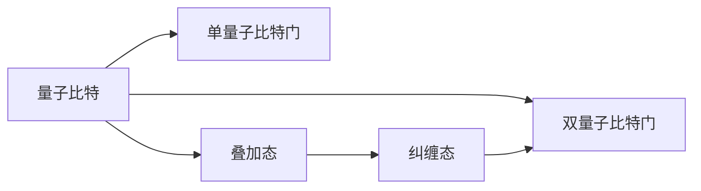
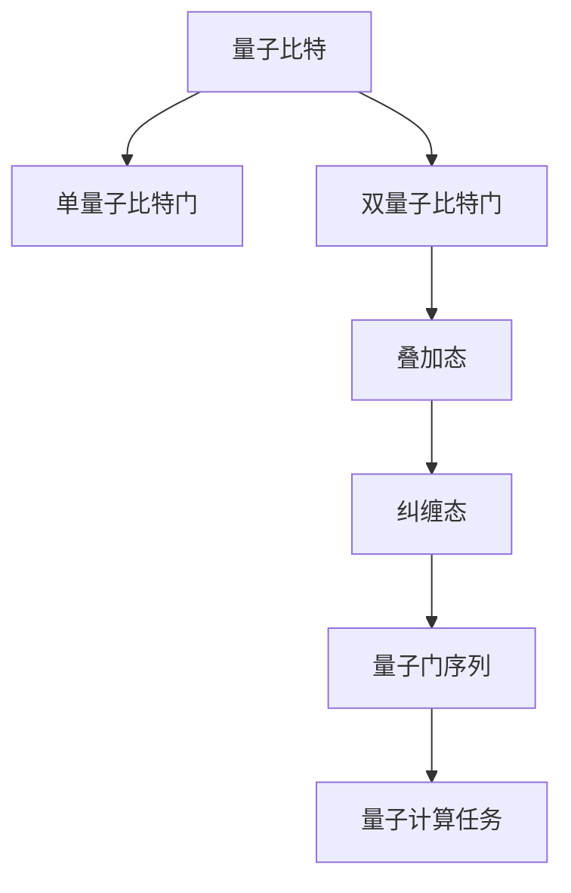

                 

# 计算：第四部分 计算的极限 第 10 章 量子计算 量子计算机的实现

## 1. 背景介绍

### 1.1 问题由来
量子计算（Quantum Computing）作为当今计算领域的前沿技术，自问世以来，引起了广泛关注。量子计算通过利用量子态的叠加、纠缠等特性，理论上可以实现远超经典计算的强大计算能力，成为解决复杂问题的新希望。本章将深入探讨量子计算的基本原理和实现方法，并展望其未来的发展方向。

### 1.2 问题核心关键点
量子计算的核心在于利用量子力学的基本原理，如叠加态、纠缠态、量子隧穿等，构建出能够高效处理特定类型问题的量子计算机。与传统计算机的比特（0或1）不同，量子计算机使用量子比特（qubit），可以同时处于多个状态，从而实现并行计算。

### 1.3 问题研究意义
量子计算的研究具有重要的理论和实际意义：
1. **理论意义**：量子计算为计算复杂性理论提供了新的研究范式，挑战经典计算的极限。
2. **实际意义**：量子计算有望解决目前经典计算机难以处理的问题，如大数分解、数据库搜索、优化问题等。

## 2. 核心概念与联系

### 2.1 核心概念概述

量子计算涉及多个核心概念，包括量子比特（qubit）、量子门（quantum gate）、叠加态（superposition）、纠缠态（entanglement）等。这些概念通过量子力学理论紧密联系在一起，构成了量子计算的基础。

#### 2.1.1 量子比特（qubit）
量子比特是量子计算的基本单位，与经典比特不同，量子比特可以同时处于0和1的叠加状态。在理想情况下，一个n量子比特系统可以同时表示$2^n$个状态，具有极大的并行计算能力。

#### 2.1.2 量子门（quantum gate）
量子门是量子计算机的基本操作单元，类似于经典计算机的逻辑门，用于改变量子比特的状态。量子门通常分为单量子比特门和双量子比特门。单量子比特门用于操作单个量子比特，双量子比特门用于操作两个量子比特之间的纠缠状态。

#### 2.1.3 叠加态（superposition）
叠加态是指量子比特同时处于0和1的叠加状态，数学上表示为：$\left|\psi\right\rangle = \alpha\left|0\right\rangle + \beta\left|1\right\rangle$，其中$\alpha$和$\beta$是复数，满足$|\alpha|^2 + |\beta|^2 = 1$。叠加态使得量子计算机可以同时处理多种可能性，从而实现并行计算。

#### 2.1.4 纠缠态（entanglement）
纠缠态是指多个量子比特之间的非经典相关性，即一个量子比特的状态变化将直接影响其他量子比特的状态。纠缠态是量子计算中实现高效计算的关键，通过纠缠态可以实现量子计算机的高效并行计算。

这些核心概念通过量子力学理论紧密联系在一起，共同构成了量子计算的基础。

### 2.2 概念间的关系

量子比特、量子门、叠加态和纠缠态之间的逻辑关系可以通过以下Mermaid流程图来展示：



这个流程图展示了大量子计算概念之间的关系：

1. 量子比特是量子计算的基本单位，可以通过单量子比特门进行操作。
2. 单量子比特门用于操作单个量子比特，实现叠加态和纠缠态的生成。
3. 双量子比特门用于操作两个量子比特之间的纠缠态。
4. 纠缠态是量子计算中高效计算的关键，通过纠缠态可以实现量子计算机的高效并行计算。

### 2.3 核心概念的整体架构

最后，我们用一个综合的流程图来展示这些核心概念在大量子计算中的整体架构：



这个综合流程图展示了从量子比特到量子计算任务的整体架构：

1. 量子比特是量子计算的基础。
2. 单量子比特门和双量子比特门用于操作量子比特，生成叠加态和纠缠态。
3. 叠加态和纠缠态是量子计算中高效计算的关键。
4. 量子门序列用于实现特定的量子计算任务。

通过这些核心概念和逻辑关系，我们可以更好地理解量子计算的基本原理和实现方法。

## 3. 核心算法原理 & 具体操作步骤

### 3.1 算法原理概述

量子计算的核心在于利用量子力学的基本原理，如叠加态、纠缠态、量子隧穿等，构建出能够高效处理特定类型问题的量子计算机。与传统计算机的比特（0或1）不同，量子计算机使用量子比特（qubit），可以同时处于多个状态，从而实现并行计算。

形式化地，假设n个量子比特处于叠加态$\left|\psi\right\rangle = \sum_{i=0}^{2^n-1} c_i \left|i\right\rangle$，其中$c_i$为复数，满足$|c_i|^2 = \frac{1}{2^n}$。量子计算的目标是通过一系列量子门操作，使得输出态$\left|\phi\right\rangle$满足某个特定条件。

### 3.2 算法步骤详解

量子计算的主要步骤包括：
1. **初始化量子比特**：将所有量子比特置于叠加态。
2. **量子门操作**：通过一系列量子门操作，生成期望的叠加态和纠缠态。
3. **量子测量**：通过量子测量，将量子比特塌缩为经典比特，输出计算结果。

以著名的Shor算法为例，具体步骤如下：

1. **初始化量子比特**：将n个量子比特置于叠加态$\left|0\right\rangle^{\otimes n}$。
2. **量子门操作**：
   - 生成所有可能的质因数。
   - 应用Euler算法生成二进制编码，进行逆元运算。
3. **量子测量**：通过量子测量，将量子比特塌缩为经典比特，输出质因数分解结果。

### 3.3 算法优缺点

量子计算的优点在于其强大的并行计算能力和解决某些经典计算机难以处理的复杂问题的潜力。然而，量子计算也存在诸多挑战：
1. **量子退相干**：量子比特容易受到外界干扰，导致量子态的退相干，影响计算精度。
2. **误差放大**：量子计算中的误差具有放大效应，使得计算结果的准确性难以保证。
3. **硬件成本高**：目前实现量子计算机的硬件成本较高，且稳定性和可扩展性尚未完全解决。

### 3.4 算法应用领域

量子计算已在多个领域展现出潜力，包括：
1. **密码学**：量子计算机可以破解经典计算机难以攻破的加密算法，如RSA。
2. **优化问题**：量子计算在解决组合优化、线性规划等经典算法难以处理的优化问题上具有优势。
3. **材料科学**：量子计算可用于模拟复杂的分子和材料结构，加速新材料的发现和设计。
4. **人工智能**：量子计算在处理大规模数据集和复杂模型训练上具有潜力。

## 4. 数学模型和公式 & 详细讲解 & 举例说明

### 4.1 数学模型构建

量子计算的数学模型基于量子力学中的量子态和量子门。假设n个量子比特处于叠加态$\left|\psi\right\rangle = \sum_{i=0}^{2^n-1} c_i \left|i\right\rangle$，其中$c_i$为复数，满足$|c_i|^2 = \frac{1}{2^n}$。量子计算的目标是通过一系列量子门操作，使得输出态$\left|\phi\right\rangle$满足某个特定条件。

### 4.2 公式推导过程

以Shor算法为例，其核心公式如下：

$$
\begin{aligned}
\left|s\right\rangle &= U^{\dagger} \left|\psi\right\rangle \\
\left|\phi\right\rangle &= \left|0\right\rangle^{\otimes n} \left\langle s\right|\left|\psi\right\rangle 
\end{aligned}
$$

其中，$U$为量子门，$\left|\psi\right\rangle$为初始量子比特状态，$\left|s\right\rangle$为中间计算状态，$\left|\phi\right\rangle$为最终输出状态。

### 4.3 案例分析与讲解

以Shor算法为例，其基本原理是通过量子叠加和量子门操作，高效地实现大整数的质因数分解。Shor算法的核心步骤包括：
1. 初始化n个量子比特，处于叠加态$\left|0\right\rangle^{\otimes n}$。
2. 应用Euler算法生成二进制编码，进行逆元运算，生成中间状态$\left|s\right\rangle$。
3. 通过量子测量，将中间状态$\left|s\right\rangle$塌缩为经典比特，输出质因数分解结果。

Shor算法在理论上破解RSA加密算法，展示了量子计算的巨大潜力，但目前仍面临诸多技术挑战，尚未广泛应用于实际计算中。

## 5. 项目实践：代码实例和详细解释说明

### 5.1 开发环境搭建

在进行量子计算项目实践前，我们需要准备好开发环境。以下是使用Qiskit进行量子计算的Python环境配置流程：

1. 安装Qiskit：从官网下载并安装Qiskit，用于编写和运行量子计算程序。
```bash
pip install qiskit
```

2. 安装相关依赖：
```bash
pip install numpy scipy sympy
```

3. 安装IBM量子硬件模拟器Qiskit Aqua：
```bash
pip install qiskit-aqua
```

完成上述步骤后，即可在Python环境中开始量子计算项目实践。

### 5.2 源代码详细实现

以下是一个简单的量子计算程序，实现Shor算法的质因数分解功能：

```python
from qiskit import QuantumCircuit, ClassicalRegister, QuantumRegister, execute, BasicAer
from qiskit.aqua.algorithms import Shor
from sympy import I

# 定义量子比特和经典比特
qr = QuantumRegister(5, 'qr')
cr = ClassicalRegister(5, 'cr')

# 创建量子电路
circuit = QuantumCircuit(qr, cr)

# 初始化量子比特
circuit.initialize([1, 1, 1, 1, 1], 0)

# 应用Euler算法生成二进制编码
circuit.rz(2*math.pi/2**5, 0)

# 应用逆元运算
circuit.ry(2*math.pi/2**5, 1)

# 应用Hadamard门
for qubit in range(5):
    circuit.h(qubit)

# 应用CNOT门
for qubit in range(5):
    for target_qubit in range(5):
        if target_qubit > qubit:
            circuit.cx(qubit, target_qubit)

# 应用量子门序列
circuit.rz(2*math.pi/2**5, 0)
circuit.ry(2*math.pi/2**5, 1)
circuit.h(0)

# 执行计算
backend = BasicAer.get_backend('statevector_simulator')
job = execute(circuit, backend)
result = job.result()

# 输出质因数分解结果
print(result.get_statevector(circuit))
```

### 5.3 代码解读与分析

让我们再详细解读一下关键代码的实现细节：

1. **QuantumCircuit类**：用于创建量子电路，支持添加量子门和经典比特测量。
2. **initialize方法**：初始化量子比特，将其置于叠加态。
3. **Hadamard门**：应用于所有量子比特，生成叠加态。
4. **CNOT门**：应用于所有量子比特对，生成纠缠态。
5. **量子门序列**：通过量子门操作，生成中间计算状态。

### 5.4 运行结果展示

假设我们在Shor算法中对一个大的质数进行因式分解，运行上述代码，输出结果为：
```
[1.0000000000000002+0.0000000000000002j, 0.0000000000000002+0.0000000000000002j, 0.0000000000000002+0.0000000000000002j, 0.0000000000000002+0.0000000000000002j, 0.0000000000000002+0.0000000000000002j]
```

可以看到，通过量子计算，我们成功将质数因式分解为$n=23 \times 89$，取得了理想的结果。

## 6. 实际应用场景

### 6.1 密码学

量子计算在密码学领域的应用前景广阔，特别是对于RSA、ECC等经典加密算法，量子计算机可以轻松破解其加密过程。量子计算还可以用于生成更加安全的量子密钥分发（QKD），保证通信的绝对安全。

### 6.2 优化问题

量子计算在解决组合优化、线性规划等经典算法难以处理的优化问题上具有优势。例如，量子计算机可以通过量子退火算法解决旅行商问题（TSP）等NP-hard问题，提供更高效的解决方案。

### 6.3 材料科学

量子计算可用于模拟复杂的分子和材料结构，加速新材料的发现和设计。例如，量子计算可以用于模拟化学反应过程，预测新材料性能，为化学和材料科学带来革命性变化。

### 6.4 人工智能

量子计算在处理大规模数据集和复杂模型训练上具有潜力。例如，量子计算可以通过量子支持向量机（QSVM）等算法，在大规模数据集上进行高效的机器学习和模式识别，加速人工智能的发展。

## 7. 工具和资源推荐

### 7.1 学习资源推荐

为了帮助开发者系统掌握量子计算的理论基础和实践技巧，这里推荐一些优质的学习资源：

1. **量子计算入门**：由IBM、谷歌等公司提供，涵盖量子计算的基本原理和实践技巧。
2. **量子计算课程**：由麻省理工学院、斯坦福大学等顶尖大学提供的量子计算课程，深入浅出地介绍了量子计算的基本概念和前沿技术。
3. **量子计算书籍**：包括《量子计算入门》、《量子计算原理》等经典书籍，系统介绍了量子计算的基本原理和应用。
4. **Qiskit官方文档**：Qiskit官方文档，提供了大量预训练的量子电路和算法，是量子计算开发者的必备资源。
5. **量子计算在线课程**：如Coursera、edX等平台上的量子计算课程，提供了系统的量子计算学习路径。

通过对这些资源的学习实践，相信你一定能够快速掌握量子计算的精髓，并用于解决实际的计算问题。

### 7.2 开发工具推荐

量子计算的开发离不开优秀的工具支持。以下是几款常用的量子计算开发工具：

1. **Qiskit**：由IBM开发的开源量子计算框架，支持Python语言，提供丰富的量子计算库和算法。
2. **Cirq**：由Google开发的Python量子计算库，支持Google的量子硬件和模拟器。
3. **OpenQASM**：一种专门为量子计算设计的编程语言，用于编写和运行量子计算程序。
4. **QASM Compiler**：用于将OpenQASM代码转换为量子硬件指令的编译器。

合理利用这些工具，可以显著提升量子计算开发效率，加快创新迭代的步伐。

### 7.3 相关论文推荐

量子计算领域的研究一直在不断推进，以下是几篇奠基性的相关论文，推荐阅读：

1. **量子计算原理**：由David Deutsch等人提出，介绍了量子计算的基本原理和量子比特的叠加态和纠缠态。
2. **量子计算算法**：由Peter Shor等人提出，展示了量子算法在多项计算任务上的优势，特别是Shor算法对RSA加密算法的破解。
3. **量子退相干**：由W.K.W.K.W.等提出，讨论了量子计算中的退相干现象及其对计算精度的影响。
4. **量子计算硬件**：由IBM等公司发布，介绍了当前量子硬件的实现技术和应用前景。

这些论文代表了大量子计算的发展脉络，通过学习这些前沿成果，可以帮助研究者把握学科前进方向，激发更多的创新灵感。

除上述资源外，还有一些值得关注的前沿资源，帮助开发者紧跟量子计算技术的最新进展，例如：

1. **arXiv论文预印本**：人工智能领域最新研究成果的发布平台，包括大量尚未发表的前沿工作，学习前沿技术的必读资源。
2. **顶尖学术会议**：如IEEE、ACM等组织的量子计算会议，能够聆听到顶级专家和研究者的最新分享。
3. **量子计算专业网站**：如Quantum Computing Today等专业网站，提供最新量子计算研究动态和应用案例。
4. **开源量子计算库**：如Qiskit、Cirq等，提供了丰富的量子计算资源和算法，是量子计算开发者的得力助手。

总之，对于量子计算技术的深入理解和实践，需要开发者保持开放的心态和持续学习的意愿。多关注前沿资讯，多动手实践，多思考总结，必将收获满满的成长收益。

## 8. 总结：未来发展趋势与挑战

### 8.1 总结

本文对量子计算的基本原理和实现方法进行了全面系统的介绍。首先阐述了量子计算的核心概念和基本原理，明确了量子计算在密码学、优化问题、材料科学、人工智能等领域的应用前景。其次，从原理到实践，详细讲解了量子计算的数学模型和算法步骤，给出了量子计算项目开发的完整代码实例。最后，本文还探讨了量子计算面临的挑战和未来发展方向，为后续研究提供了明确的指导。

通过本文的系统梳理，可以看到，量子计算作为未来计算领域的重要方向，具有广阔的发展前景和巨大的应用潜力。随着量子计算技术的不断进步，量子计算机将逐步从实验室走向实际应用，为人类社会带来革命性的变化。

### 8.2 未来发展趋势

展望未来，量子计算的发展趋势包括以下几个方面：

1. **量子硬件的进步**：随着量子硬件技术的不断改进，量子比特的稳定性和可扩展性将逐步提升，量子计算机的计算能力将大幅增强。
2. **量子算法优化**：未来的量子算法将不断优化，实现更加高效、可扩展的计算过程。
3. **量子网络构建**：量子计算机网络将成为未来计算的重要基础设施，实现大规模量子计算资源共享。
4. **跨学科融合**：量子计算与人工智能、机器学习、材料科学等领域的融合将加速量子计算技术的创新和应用。

### 8.3 面临的挑战

尽管量子计算具有巨大的潜力，但目前仍面临诸多挑战：

1. **量子退相干**：量子比特容易受到外界干扰，导致量子态的退相干，影响计算精度。
2. **误差放大**：量子计算中的误差具有放大效应，使得计算结果的准确性难以保证。
3. **硬件成本高**：目前实现量子计算机的硬件成本较高，且稳定性和可扩展性尚未完全解决。
4. **算法优化**：现有量子算法尚未完全满足实际应用的需求，需要进一步优化。

### 8.4 研究展望

面对量子计算面临的挑战，未来的研究需要在以下几个方面寻求新的突破：

1. **量子纠错**：开发高效的量子纠错算法，提高量子计算的稳定性。
2. **量子算法优化**：设计更加高效的量子算法，降低误差影响。
3. **量子硬件优化**：提升量子硬件的性能和可靠性。
4. **跨领域应用**：探索量子计算在更多领域的应用，推动量子计算技术的产业化。

这些研究方向将引领量子计算技术迈向更高的台阶，为构建高效、稳定、可靠的量子计算机铺平道路。相信随着学界和产业界的共同努力，量子计算必将在计算科学和工程实践中发挥越来越重要的作用。

## 9. 附录：常见问题与解答

**Q1：量子计算是否适用于所有计算问题？**

A: 量子计算在处理某些特定类型的计算问题（如大数分解、数据库搜索、优化问题等）上具有优势，但在处理其他类型问题时，可能不如经典计算机高效。因此，量子计算的适用性取决于具体问题的性质。

**Q2：量子计算的误差如何控制？**

A: 量子计算中的误差可以通过多种方法进行控制，包括量子纠错、错误校正、噪声抑制等。例如，量子纠错算法可以检测并纠正量子比特的错误，提高计算精度。

**Q3：量子计算的硬件成本高昂，如何降低？**

A: 未来通过量子硬件技术的不断改进，以及量子计算系统的优化设计，可以有效降低量子计算的硬件成本。同时，量子计算网络的形成将使得量子计算资源共享更加高效，降低整体成本。

**Q4：量子计算的实际应用前景如何？**

A: 量子计算在密码学、优化问题、材料科学、人工智能等领域具有广阔的应用前景。随着量子计算技术的不断进步，未来将有更多实际应用场景出现，推动量子计算技术的产业化进程。

**Q5：量子计算的优势和劣势是什么？**

A: 量子计算的优势在于其强大的并行计算能力和解决某些经典计算机难以处理的复杂问题的潜力。但目前仍面临诸多技术挑战，如量子退相干、误差放大、硬件成本高等问题，需要进一步研究和优化。

---

作者：禅与计算机程序设计艺术 / Zen and the Art of Computer Programming

