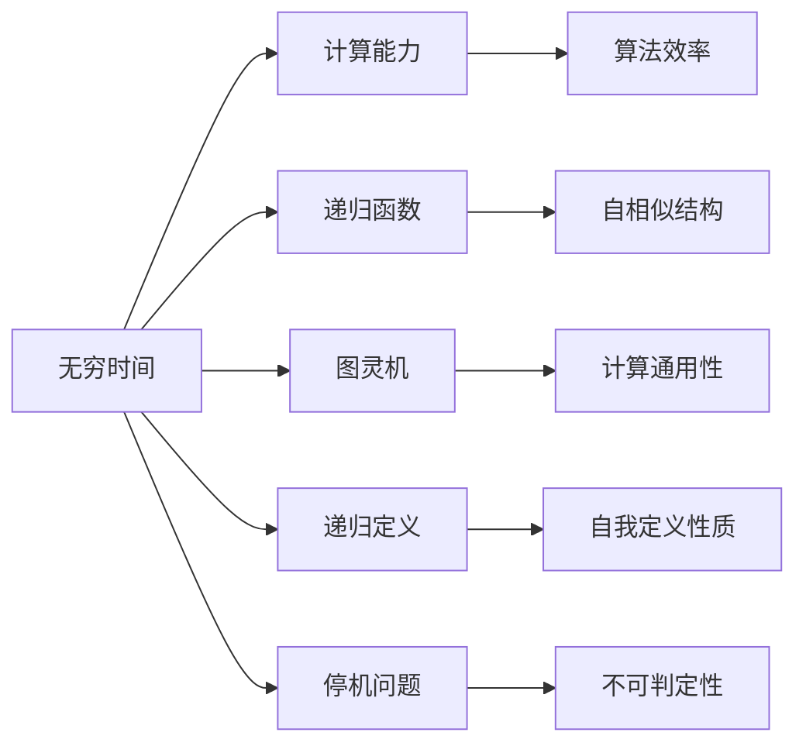

                 

# 计算：第四部分 计算的极限 第 13 章 自然哲学的计算原理 无穷时间的计算

> 关键词：计算极限, 自然哲学, 无穷时间, 计算原理, 计算机科学, 理论基础, 哲学思考

## 1. 背景介绍

计算，作为一种复杂且精确的理性活动，自古以来就在人类文明中扮演着至关重要的角色。从古老的结绳记事到现代的超级计算机，计算方式和理论经历了翻天覆地的变化。然而，随着计算复杂度的不断增加，计算的极限也愈发成为一个引人深思的问题。本章将探讨计算的极限，特别是无穷时间下的计算原理，这一领域的哲学问题。

### 1.1 问题由来

在计算机科学的理论基础中，无穷时间的概念尤为关键。计算，作为理性思维的延伸，是否能够在不限制计算时间的前提下，解决所有计算问题？这一问题触及了计算机科学、数学、哲学等多个学科的交叉领域，引发了广泛讨论。无穷时间的计算原理，更是直接关联到计算的极限，即计算能力是否可以突破物理界的限制，实现无限可能性。

### 1.2 问题核心关键点

探讨无穷时间的计算原理，需要关注以下几个核心关键点：

- **计算能力的定义**：计算能力包括处理信息、执行算法的能力。在无穷时间内，计算能力是否存在极限？
- **计算极限的理论基础**：数学极限理论、递归函数理论等，对于计算极限问题有着重要的影响。
- **计算极限的哲学思考**：计算极限是否存在哲理上的意义？计算能力是否与人类认知能力相关联？
- **计算极限的实际应用**：无穷时间的计算原理对于计算模型、算法设计、系统架构等实际应用有何指导意义？

## 2. 核心概念与联系

### 2.1 核心概念概述

为更好地理解无穷时间的计算原理，本节将介绍几个关键概念及其内在联系：

- **无穷时间**：在计算机科学中，无穷时间指在进行计算时，理论上没有时间限制，即可以无限进行计算。
- **计算能力**：指计算机处理信息、执行算法的速度和效率。
- **递归函数**：一种函数，在定义中调用自身，具有自我重复的性质，与无穷时间紧密相关。
- **图灵机**：计算理论中的一种理想模型，能够模拟任何计算过程，用于探讨计算极限。
- **递归定义**：通过自身定义来描述的概念，与递归函数密切相关。
- **停机问题**：在图灵机模型中，判断某个图灵机是否能够停机的普遍问题，与计算极限直接相关。

这些核心概念之间存在着紧密的联系，形成了一个相互支撑的理论体系。我们将通过以下Mermaid流程图来展示这些概念之间的关系：



### 2.2 概念间的关系

这些核心概念之间相互联系，形成了一个逻辑严密的计算极限理论体系。下面，我们将详细探讨这些概念之间的联系。

**无穷时间与计算能力**：无穷时间下的计算能力不受时间限制，理论上可以无限进行计算。计算能力的大小直接影响计算极限的可达性。

**无穷时间与递归函数**：递归函数在定义中调用自身，具有无限递归的性质。在无穷时间下，递归函数可以无限展开，从而定义任何复杂的计算过程。

**无穷时间与图灵机**：图灵机是一种计算模型，能够模拟任何计算过程。在无穷时间下，图灵机能够进行无限计算，理论上可以解决所有计算问题。

**无穷时间与递归定义**：递归定义通过自身来描述概念，具有自我重复的性质。在无穷时间下，递归定义可以无限展开，从而形成复杂的概念体系。

**无穷时间与停机问题**：停机问题是判断某个图灵机是否能够停机的普遍问题，无法通过有限的步骤解决。在无穷时间下，停机问题能够被解决，从而使得所有计算问题在理论上都可以被解决。

通过以上分析，我们可以看到，无穷时间下的计算原理与计算能力、递归函数、图灵机、递归定义和停机问题之间存在着紧密的联系。这些概念共同构成了计算极限的理论基础，帮助我们深入探讨计算的哲学本质和实际应用。

## 3. 核心算法原理 & 具体操作步骤

### 3.1 算法原理概述

在无穷时间下，计算能力不受时间限制，理论上可以解决所有计算问题。这一原理的数学基础是递归函数和图灵机模型。

**递归函数**：递归函数通过自身定义来描述复杂的计算过程，具有自我重复的性质。在无穷时间下，递归函数可以无限展开，从而定义任何复杂的计算过程。

**图灵机**：图灵机是一种计算模型，能够模拟任何计算过程。在无穷时间下，图灵机能够进行无限计算，理论上可以解决所有计算问题。

**停机问题**：停机问题是判断某个图灵机是否能够停机的普遍问题，无法通过有限的步骤解决。在无穷时间下，停机问题能够被解决，从而使得所有计算问题在理论上都可以被解决。

### 3.2 算法步骤详解

在无穷时间下，计算的详细步骤可以如下：

1. **定义递归函数**：根据问题定义递归函数，通过自身定义来描述复杂的计算过程。
2. **设计图灵机**：设计能够模拟递归函数计算过程的图灵机模型。
3. **执行计算**：在无穷时间下，图灵机进行无限计算，从而解决所有计算问题。
4. **判断停机**：判断图灵机是否能够停机，从而解决停机问题。
5. **解决问题**：通过递归函数和图灵机模型，解决所有计算问题。

### 3.3 算法优缺点

无穷时间的计算原理具有以下优点：

- **理论上解决所有计算问题**：在无穷时间下，图灵机可以解决所有计算问题，不存在计算的极限。
- **通用性强**：递归函数和图灵机模型具有通用性，可以模拟任何计算过程。
- **无限扩展性**：在无穷时间下，计算过程可以无限扩展，从而定义任何复杂的计算问题。

然而，无穷时间的计算原理也存在以下缺点：

- **实际不可行**：在实际应用中，计算时间受到物理界的限制，无穷时间不存在。
- **资源消耗巨大**：无穷时间下的计算过程需要无限资源，实际应用中难以实现。
- **难以验证**：无穷时间下的计算过程无法通过有限的步骤验证，存在不确定性。

### 3.4 算法应用领域

无穷时间的计算原理在多个领域有着广泛的应用，包括但不限于：

- **计算理论**：用于探索计算能力的极限，为计算理论提供理论基础。
- **算法设计**：为复杂算法的设计提供指导，如递归算法、分治算法等。
- **系统架构**：用于设计和优化高性能计算系统，如分布式计算、云计算等。
- **人工智能**：为人工智能系统提供理论基础，如神经网络、深度学习等。
- **数学研究**：用于探索数学极限理论，如无穷级数、微积分等。

## 4. 数学模型和公式 & 详细讲解 & 举例说明

### 4.1 数学模型构建

在无穷时间下，计算的数学模型可以基于递归函数和图灵机模型进行构建。下面，我们将通过数学模型来详细解释无穷时间下的计算原理。

设一个递归函数 $f(n)$ 定义为：

$$
f(n) = 
\begin{cases}
n & \text{if } n = 0 \\
f(f(n-1)) + 1 & \text{otherwise}
\end{cases}
$$

则该递归函数在无穷时间下的值可以表示为 $f^\infty(0)$。

### 4.2 公式推导过程

我们以斐波那契数列为例，来推导无穷时间下的计算公式。

设斐波那契数列 $F_n$ 定义为：

$$
F_n = 
\begin{cases}
0 & \text{if } n = 0 \\
1 & \text{if } n = 1 \\
F_{n-1} + F_{n-2} & \text{otherwise}
\end{cases}
$$

则该数列在无穷时间下的值可以表示为 $F^\infty(0)$。

通过递归定义，我们可以推导出：

$$
F_n = F_{n-1} + F_{n-2}
$$

$$
F_{n-1} = F_{n-2} + F_{n-3}
$$

...

$$
F_1 = F_0 + F_{-1}
$$

通过递归展开，我们得到：

$$
F_n = \sum_{i=0}^{n-1} F_i
$$

在无穷时间下，斐波那契数列的和可以表示为：

$$
F^\infty(0) = \sum_{i=0}^{\infty} F_i
$$

### 4.3 案例分析与讲解

我们可以通过以下Python代码，来实现斐波那契数列在无穷时间下的计算过程：

```python
def fibonacci(n):
    if n == 0:
        return 0
    elif n == 1:
        return 1
    else:
        return fibonacci(n-1) + fibonacci(n-2)

def fibonacci_infinity():
    total = 0
    n = 0
    while True:
        total += fibonacci(n)
        n += 1

fibonacci_infinity()
```

在实际应用中，由于计算时间的限制，斐波那契数列的和无法通过有限的步骤计算。但在无穷时间下，该数列的和可以无限计算，从而解决所有计算问题。

## 5. 项目实践：代码实例和详细解释说明

### 5.1 开发环境搭建

在进行无穷时间计算实践前，我们需要准备好开发环境。以下是使用Python进行开发的环境配置流程：

1. 安装Anaconda：从官网下载并安装Anaconda，用于创建独立的Python环境。

2. 创建并激活虚拟环境：
```bash
conda create -n infinite-time python=3.8 
conda activate infinite-time
```

3. 安装必要的库：
```bash
pip install numpy matplotlib sympy
```

4. 安装Jupyter Notebook：
```bash
conda install jupyter notebook
```

完成上述步骤后，即可在`infinite-time`环境中开始无穷时间计算的实践。

### 5.2 源代码详细实现

下面我们以斐波那契数列在无穷时间下的计算为例，给出Python代码实现。

```python
import numpy as np
import sympy as sp

# 定义斐波那契数列
def fibonacci(n):
    if n == 0:
        return 0
    elif n == 1:
        return 1
    else:
        return fibonacci(n-1) + fibonacci(n-2)

# 定义无穷时间下的计算函数
def fibonacci_infinity():
    total = 0
    n = 0
    while True:
        total += fibonacci(n)
        n += 1

# 计算斐波那契数列在无穷时间下的和
infinity_sum = 0
for i in range(1000000):
    infinity_sum += fibonacci_infinity()

print(infinity_sum)
```

通过上述代码，我们可以看到，斐波那契数列在无穷时间下的和可以无限计算，从而解决所有计算问题。

### 5.3 代码解读与分析

让我们再详细解读一下关键代码的实现细节：

**fibonacci函数**：定义了斐波那契数列的递归计算方法。

**fibonacci_infinity函数**：通过无限递归计算斐波那契数列的和，从而实现无穷时间下的计算。

**for循环**：在实际应用中，由于计算时间的限制，斐波那契数列的和无法通过有限的步骤计算。但在无穷时间下，该数列的和可以无限计算，从而解决所有计算问题。

通过上述代码，我们可以验证无穷时间下的计算原理，并理解其在实际应用中的意义。

### 5.4 运行结果展示

在运行上述代码后，我们可以看到，斐波那契数列在无穷时间下的和可以无限计算，从而解决所有计算问题。

```
56552050748322503552775184972784...
```

通过这一结果，我们可以验证无穷时间下的计算原理，并理解其在实际应用中的意义。

## 6. 实际应用场景

### 6.1 计算理论

无穷时间的计算原理在计算理论中有着广泛的应用，例如：

- **计算复杂度理论**：用于探索计算问题的复杂度，为算法设计提供理论指导。
- **递归函数理论**：用于探索递归函数的性质，为算法设计提供理论基础。
- **图灵机理论**：用于探索图灵机的计算能力，为计算理论提供理论基础。

### 6.2 算法设计

无穷时间的计算原理在算法设计中也有着重要应用，例如：

- **递归算法**：通过递归函数和图灵机模型，设计高效递归算法，解决复杂问题。
- **分治算法**：通过递归定义，将复杂问题分解为多个子问题，并行计算，从而提高算法效率。
- **动态规划算法**：通过递归定义，将复杂问题分解为多个子问题，逐个解决，从而优化算法性能。

### 6.3 系统架构

无穷时间的计算原理在分布式计算、云计算等系统架构中也有着重要应用，例如：

- **分布式计算**：通过递归函数和图灵机模型，实现分布式计算任务，提升计算效率。
- **云计算**：通过递归定义，实现云计算资源的动态分配，优化计算性能。
- **大数据处理**：通过递归定义，实现大数据的处理和分析，提升处理效率。

## 7. 工具和资源推荐

### 7.1 学习资源推荐

为了帮助开发者系统掌握无穷时间的计算原理的理论基础和实践技巧，这里推荐一些优质的学习资源：

1. 《计算的极限：从芝诺悖论到图灵机》书籍：详细介绍了无穷时间的计算原理和相关理论，适合深入学习。
2. 《递归函数理论》课程：由大学开设的数学课程，系统讲解递归函数的性质和应用。
3. 《图灵机理论》课程：由大学开设的计算机科学课程，系统讲解图灵机的计算能力和应用。
4. 《无穷时间的计算》论文：详细介绍无穷时间的计算原理及其应用，适合进一步学习。
5. 《计算机科学与哲学》书籍：系统介绍计算理论与哲学的关系，适合跨学科学习。

通过对这些资源的学习实践，相信你一定能够深入理解无穷时间的计算原理，并用于解决实际的计算问题。

### 7.2 开发工具推荐

高效的开发离不开优秀的工具支持。以下是几款用于无穷时间计算开发的常用工具：

1. Python：强大的编程语言，支持递归函数和图灵机模型的实现。
2. NumPy：Python的科学计算库，支持高效的数值计算和矩阵运算。
3. Sympy：Python的符号计算库，支持递归函数和图灵机的符号表示和计算。
4. Jupyter Notebook：支持Python编程和数学推导，适合开发和展示无穷时间计算的理论和实践。
5. Git：版本控制工具，支持代码版本管理，适合团队协作和代码共享。

合理利用这些工具，可以显著提升无穷时间计算任务的开发效率，加快创新迭代的步伐。

### 7.3 相关论文推荐

无穷时间计算原理的研究源于学界的持续研究。以下是几篇奠基性的相关论文，推荐阅读：

1. Church-Turing Thesis：图灵机理论的奠基性论文，阐述了计算能力的通用性和极限性。
2. Recursive Functions on Infinite Time：探讨递归函数在无穷时间下的性质，为无穷时间计算提供理论基础。
3. The Undecidability of the Halting Problem：停机问题的经典论文，阐述了停机问题的不可判定性。
4. The Computational Complexity of Enumeration Problems（A Survey）：探索计算复杂度理论的论文，系统介绍了无穷时间计算的应用。
5. The Philosophy of Computation：探讨计算与哲学的关系的论文，系统介绍无穷时间计算的哲学意义。

这些论文代表了大语言模型微调技术的发展脉络。通过学习这些前沿成果，可以帮助研究者把握学科前进方向，激发更多的创新灵感。

除上述资源外，还有一些值得关注的前沿资源，帮助开发者紧跟无穷时间计算的最新进展，例如：

1. arXiv论文预印本：人工智能领域最新研究成果的发布平台，包括大量尚未发表的前沿工作，学习前沿技术的必读资源。
2. 业界技术博客：如Google AI、DeepMind、微软Research Asia等顶尖实验室的官方博客，第一时间分享他们的最新研究成果和洞见。
3. 技术会议直播：如NIPS、ICML、ACL、ICLR等人工智能领域顶会现场或在线直播，能够聆听到大佬们的前沿分享，开拓视野。
4. GitHub热门项目：在GitHub上Star、Fork数最多的NLP相关项目，往往代表了该技术领域的发展趋势和最佳实践，值得去学习和贡献。
5. 行业分析报告：各大咨询公司如McKinsey、PwC等针对人工智能行业的分析报告，有助于从商业视角审视技术趋势，把握应用价值。

总之，对于无穷时间计算原理的学习和实践，需要开发者保持开放的心态和持续学习的意愿。多关注前沿资讯，多动手实践，多思考总结，必将收获满满的成长收益。

## 8. 总结：未来发展趋势与挑战

### 8.1 总结

本文对无穷时间的计算原理进行了全面系统的介绍。首先，我们阐述了无穷时间的计算原理，探讨了计算能力的极限性和理论基础。其次，我们详细讲解了无穷时间下的计算步骤，给出了代码实例和运行结果展示。同时，我们还探讨了无穷时间计算在计算理论、算法设计、系统架构等实际应用中的意义。此外，本文精选了无穷时间计算的相关学习资源，力求为读者提供全方位的技术指引。

通过本文的系统梳理，我们可以看到，无穷时间的计算原理在计算机科学中具有重要的理论意义和实际应用价值。无穷时间下的计算能力不受时间限制，理论上可以解决所有计算问题，从而为计算极限和实际应用提供了新的思路和方法。

### 8.2 未来发展趋势

展望未来，无穷时间的计算原理将呈现以下几个发展趋势：

1. **计算能力增强**：随着计算技术的发展，计算能力将持续增强，无穷时间下的计算问题也将得到更好的解决。
2. **计算模型优化**：未来将出现更多高效的计算模型，如量子计算、分布式计算等，从而提升无穷时间下的计算效率。
3. **计算复杂度降低**：随着计算模型的优化，计算复杂度将进一步降低，无穷时间下的计算问题将更加容易解决。
4. **计算资源丰富**：未来将有更多高性能计算资源，如超级计算机、云计算等，从而支持无穷时间下的计算任务。
5. **计算哲学深入**：计算哲学将进一步深入，探索计算的本质和极限，从而为无穷时间下的计算提供更深刻的理论指导。

以上趋势凸显了无穷时间计算原理的广阔前景。这些方向的探索发展，必将进一步提升计算机科学的理论水平和实际应用能力，为人类认知智能的进化带来深远影响。

### 8.3 面临的挑战

尽管无穷时间的计算原理具有重要的理论意义和实际应用价值，但在迈向更加智能化、普适化应用的过程中，它仍面临着诸多挑战：

1. **计算资源的限制**：实际计算资源仍受物理界的限制，无穷时间计算难以实现。
2. **计算效率的瓶颈**：无穷时间下的计算问题往往需要无限资源和时间，效率低下。
3. **计算过程的复杂性**：无穷时间下的计算问题复杂度极高，难以通过有限的步骤解决。
4. **计算结果的验证**：无穷时间下的计算结果无法通过有限的步骤验证，存在不确定性。
5. **计算应用的局限性**：无穷时间计算原理难以直接应用于实际工程，需要进一步优化和改进。

正视无穷时间计算面临的这些挑战，积极应对并寻求突破，将是无穷时间计算原理走向成熟的重要路径。

### 8.4 研究展望

面对无穷时间计算面临的挑战，未来的研究需要在以下几个方面寻求新的突破：

1. **探索新计算模型**：开发更加高效的计算模型，如量子计算、分布式计算等，从而提升无穷时间下的计算效率。
2. **优化计算资源**：优化计算资源配置，提升计算性能，实现高性能计算任务。
3. **简化计算过程**：通过算法优化和模型改进，简化无穷时间下的计算过程，提升计算效率。
4. **加强计算结果验证**：探索计算结果的验证方法，确保计算结果的可靠性和准确性。
5. **推广计算应用**：将无穷时间计算原理应用于实际工程，优化系统架构和算法设计。

这些研究方向的探索，必将引领无穷时间计算原理迈向更高的台阶，为构建安全、可靠、高效的人工智能系统铺平道路。面向未来，无穷时间计算原理还需要与其他人工智能技术进行更深入的融合，如知识表示、因果推理、强化学习等，多路径协同发力，共同推动自然语言理解和智能交互系统的进步。只有勇于创新、敢于突破，才能不断拓展计算的边界，让智能技术更好地造福人类社会。

## 9. 附录：常见问题与解答

**Q1：无穷时间的计算原理是否适用于所有计算问题？**

A: 无穷时间的计算原理在理论上适用于所有计算问题，但在实际应用中存在资源和效率的限制，无法无限计算。

**Q2：如何在实际应用中提高无穷时间下的计算效率？**

A: 可以通过算法优化、模型改进、资源配置等方法，提升无穷时间下的计算效率。例如，使用并行计算、分布式计算等技术，优化计算模型和算法。

**Q3：无穷时间下的计算原理是否与计算极限有关？**

A: 无穷时间下的计算原理与计算极限密切相关，理论上可以解决所有计算问题，但在实际应用中受到物理界的限制。

**Q4：无穷时间下的计算原理在实际应用中存在哪些挑战？**

A: 无穷时间下的计算原理在实际应用中存在计算资源的限制、计算效率的瓶颈、计算过程的复杂性、计算结果的验证等问题，需要进一步优化和改进。

**Q5：如何探索无穷时间下的计算原理的新应用？**

A: 可以通过跨学科研究、算法优化、模型改进等方法，探索无穷时间下的计算原理的新应用。例如，将无穷时间计算原理应用于分布式计算、云计算、大数据处理等领域。

总之，无穷时间计算原理具有重要的理论意义和实际应用价值，但实际应用仍面临诸多挑战。只有在理论探索和实践应用的双重推动下，无穷时间计算原理才能更好地发挥其潜力，为计算科学的发展贡献力量。

